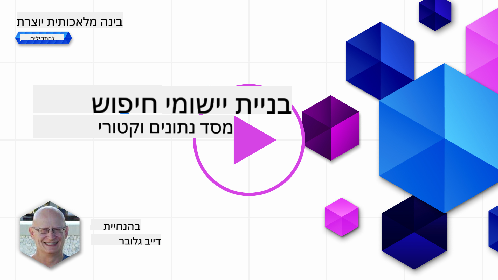

<!--
CO_OP_TRANSLATOR_METADATA:
{
  "original_hash": "d46aad0917a1a342d613e2c13d457da5",
  "translation_date": "2025-05-19T18:36:28+00:00",
  "source_file": "08-building-search-applications/README.md",
  "language_code": "he"
}
-->
# בניית אפליקציות חיפוש

[](https://aka.ms/gen-ai-lesson8-gh?WT.mc_id=academic-105485-koreyst)

> > _לחץ על התמונה למעלה כדי לצפות בסרטון של השיעור_

יש יותר ל-LLMs מאשר צ'אטבוטים ויצירת טקסט. ניתן גם לבנות אפליקציות חיפוש באמצעות Embeddings. Embeddings הם ייצוגים מספריים של נתונים הידועים גם כוקטורים, וניתן להשתמש בהם לחיפוש סמנטי של נתונים.

בשיעור זה, אתה הולך לבנות אפליקציית חיפוש עבור סטארט-אפ החינוך שלנו. הסטארט-אפ שלנו הוא ארגון ללא מטרות רווח המספק חינוך חינם לסטודנטים במדינות מתפתחות. לסטארט-אפ שלנו יש מספר רב של סרטוני YouTube שסטודנטים יכולים להשתמש בהם כדי ללמוד על AI. הסטארט-אפ שלנו רוצה לבנות אפליקציית חיפוש שמאפשרת לסטודנטים לחפש סרטון YouTube על ידי הקלדת שאלה.

לדוגמה, סטודנט עשוי להקליד 'מה הם Jupyter Notebooks?' או 'מה זה Azure ML' ואפליקציית החיפוש תחזיר רשימה של סרטוני YouTube שרלוונטיים לשאלה, ויותר מכך, אפליקציית החיפוש תחזיר קישור למקום בסרטון שבו נמצא התשובה לשאלה.

## מבוא

בשיעור זה נעסוק ב:

- חיפוש סמנטי מול חיפוש לפי מילות מפתח.
- מה הם Text Embeddings.
- יצירת אינדקס Text Embeddings.
- חיפוש באינדקס Text Embeddings.

## מטרות למידה

לאחר השלמת שיעור זה, תוכל:

- להבחין בין חיפוש סמנטי לבין חיפוש לפי מילות מפתח.
- להסביר מה הם Text Embeddings.
- ליצור אפליקציה באמצעות Embeddings לחיפוש נתונים.

## למה לבנות אפליקציית חיפוש?

יצירת אפליקציית חיפוש תעזור לך להבין כיצד להשתמש ב-Embeddings לחיפוש נתונים. תלמד גם כיצד לבנות אפליקציית חיפוש שניתן להשתמש בה על ידי סטודנטים כדי למצוא מידע במהירות.

השיעור כולל אינדקס Embedding של תמלולי YouTube לערוץ YouTube של Microsoft [AI Show](https://www.youtube.com/playlist?list=PLlrxD0HtieHi0mwteKBOfEeOYf0LJU4O1). ה-AI Show הוא ערוץ YouTube שמלמד אותך על AI ולמידת מכונה. אינדקס Embedding מכיל את ה-Embeddings עבור כל אחד מתמלולי YouTube עד אוקטובר 2023. תשתמש באינדקס Embedding כדי לבנות אפליקציית חיפוש עבור הסטארט-אפ שלנו. אפליקציית החיפוש מחזירה קישור למקום בסרטון שבו נמצא התשובה לשאלה. זהו דרך מצוינת עבור סטודנטים למצוא את המידע שהם צריכים במהירות.

הבא הוא דוגמה לשאילתה סמנטית לשאלה 'האם אתה יכול להשתמש ב-rstudio עם azure ml?'. בדוק את כתובת ה-URL של YouTube, תראה שה-URL מכיל חותמת זמן שמובילה אותך למקום בסרטון שבו נמצא התשובה לשאלה.


## מה זה חיפוש סמנטי?

עכשיו אולי אתה תוהה, מה זה חיפוש סמנטי? חיפוש סמנטי הוא טכניקת חיפוש שמשתמשת בסמנטיקה, או משמעות, של המילים בשאילתה כדי להחזיר תוצאות רלוונטיות.

הנה דוגמה לחיפוש סמנטי. נגיד שאתה מחפש לקנות רכב, אתה עשוי לחפש 'הרכב חלומות שלי', חיפוש סמנטי מבין שאתה לא `dreaming` על רכב, אלא שאתה מחפש לקנות את הרכב `ideal` שלך. חיפוש סמנטי מבין את כוונתך ומחזיר תוצאות רלוונטיות. האלטרנטיבה היא `keyword search` שתבצע חיפוש מילולי על חלומות על רכבים ולעיתים תחזיר תוצאות לא רלוונטיות.

## מה הם Text Embeddings?

[Text embeddings](https://en.wikipedia.org/wiki/Word_embedding?WT.mc_id=academic-105485-koreyst) הם טכניקת ייצוג טקסט המשמשת ב-[עיבוד שפה טבעית](https://en.wikipedia.org/wiki/Natural_language_processing?WT.mc_id=academic-105485-koreyst). Text embeddings הם ייצוגים מספריים סמנטיים של טקסט. Embeddings משמשים לייצג נתונים בצורה שקל למכונה להבין. ישנם מודלים רבים לבניית Text Embeddings, בשיעור זה נתמקד ביצירת Embeddings באמצעות מודל Embedding של OpenAI.

הנה דוגמה, דמיין שהטקסט הבא נמצא בתמלול מאחד הפרקים בערוץ YouTube של ה-AI Show:

```text
Today we are going to learn about Azure Machine Learning.
```

נעביר את הטקסט ל-API Embedding של OpenAI והוא יחזיר את ה-embedding הבא המכיל 1536 מספרים הידועים גם כוקטור. כל מספר בוקטור מייצג אספקט שונה של הטקסט. לשם קיצור, הנה עשרת המספרים הראשונים בוקטור.

```python
[-0.006655829958617687, 0.0026128944009542465, 0.008792596869170666, -0.02446001023054123, -0.008540431968867779, 0.022071078419685364, -0.010703742504119873, 0.003311325330287218, -0.011632772162556648, -0.02187200076878071, ...]
```

## איך נוצר אינדקס ה-Embedding?

אינדקס ה-Embedding לשיעור זה נוצר באמצעות סדרת סקריפטים של Python. תמצא את הסקריפטים יחד עם הוראות ב-[README](./scripts/README.md?WT.mc_id=academic-105485-koreyst) בתיקיית 'scripts' לשיעור זה. אין צורך להריץ את הסקריפטים כדי להשלים את השיעור מכיוון שאינדקס ה-Embedding מסופק לך.

הסקריפטים מבצעים את הפעולות הבאות:

1. התמלול עבור כל סרטון YouTube ברשימת ההשמעה של [AI Show](https://www.youtube.com/playlist?list=PLlrxD0HtieHi0mwteKBOfEeOYf0LJU4O1) מורד.
2. באמצעות [OpenAI Functions](https://learn.microsoft.com/azure/ai-services/openai/how-to/function-calling?WT.mc_id=academic-105485-koreyst), נעשה ניסיון לחלץ את שם הדובר מתוך 3 הדקות הראשונות של תמלול ה-YouTube. שם הדובר עבור כל סרטון נשמר באינדקס ה-Embedding בשם `embedding_index_3m.json`.
3. טקסט התמלול מחולק אז לקטעי טקסט של **3 דקות**. הקטע כולל כ-20 מילים חופפות מהקטע הבא כדי להבטיח ש-Embedding עבור הקטע לא ייחתך ולהעניק הקשר חיפוש טוב יותר.
4. כל קטע טקסט מועבר אז ל-API צ'אט של OpenAI כדי לסכם את הטקסט ל-60 מילים. הסיכום נשמר גם הוא באינדקס ה-Embedding `embedding_index_3m.json`.
5. לבסוף, טקסט הקטע מועבר ל-API Embedding של OpenAI. ה-API Embedding מחזיר וקטור של 1536 מספרים שמייצגים את המשמעות הסמנטית של הקטע. הקטע יחד עם וקטור ה-Embedding של OpenAI נשמר באינדקס ה-Embedding `embedding_index_3m.json`.

### מסדי נתונים וקטוריים

למען פשטות השיעור, אינדקס ה-Embedding נשמר בקובץ JSON בשם `embedding_index_3m.json` ומוטען ל-Pandas DataFrame. עם זאת, בייצור, אינדקס ה-Embedding יישמר במסד נתונים וקטורי כמו [Azure Cognitive Search](https://learn.microsoft.com/training/modules/improve-search-results-vector-search?WT.mc_id=academic-105485-koreyst), [Redis](https://cookbook.openai.com/examples/vector_databases/redis/readme?WT.mc_id=academic-105485-koreyst), [Pinecone](https://cookbook.openai.com/examples/vector_databases/pinecone/readme?WT.mc_id=academic-105485-koreyst), [Weaviate](https://cookbook.openai.com/examples/vector_databases/weaviate/readme?WT.mc_id=academic-105485-koreyst), כדי לציין כמה.

## הבנת דמיון קוסינוסי

למדנו על Text Embeddings, הצעד הבא הוא ללמוד כיצד להשתמש ב-Text Embeddings לחיפוש נתונים ובפרט למצוא את ה-Embeddings הדומים ביותר לשאילתה נתונה באמצעות דמיון קוסינוסי.

### מה זה דמיון קוסינוסי?

דמיון קוסינוסי הוא מדד לדמיון בין שני וקטורים, תוכל לשמוע את זה גם כ-`nearest neighbor search`. כדי לבצע חיפוש דמיון קוסינוסי אתה צריך _להפוך לוקטור_ עבור טקסט _שאילתה_ באמצעות API Embedding של OpenAI. ואז לחשב את _דמיון הקוסינוסי_ בין וקטור השאילתה לבין כל וקטור באינדקס ה-Embedding. זכור, אינדקס ה-Embedding מכיל וקטור עבור כל קטע טקסט מתמלול YouTube. לבסוף, למיין את התוצאות לפי דמיון קוסינוסי והקטעים עם הדמיון הקוסינוסי הגבוה ביותר הם הדומים ביותר לשאילתה.

מנקודת מבט מתמטית, דמיון קוסינוסי מודד את הקוסינוס של הזווית בין שני וקטורים המוקרנים במרחב רב-ממדי. מדידה זו מועילה, מכיוון שאם שני מסמכים רחוקים זה מזה על פי מרחק אוקלידי בגלל גודל, הם עדיין יכולים להיות בעלי זווית קטנה יותר ביניהם ולכן דמיון קוסינוסי גבוה יותר. למידע נוסף על משוואות דמיון קוסינוסי, עיין ב-[דמיון קוסינוסי](https://en.wikipedia.org/wiki/Cosine_similarity?WT.mc_id=academic-105485-koreyst).

## בניית אפליקציית החיפוש הראשונה שלך

הבא, אנחנו הולכים ללמוד כיצד לבנות אפליקציית חיפוש באמצעות Embeddings. אפליקציית החיפוש תאפשר לסטודנטים לחפש סרטון על ידי הקלדת שאלה. אפליקציית החיפוש תחזיר רשימה של סרטונים שרלוונטיים לשאלה. אפליקציית החיפוש גם תחזיר קישור למקום בסרטון שבו נמצא התשובה לשאלה.

פתרון זה נבנה ונבדק על Windows 11, macOS ו-Ubuntu 22.04 באמצעות Python 3.10 או מאוחר יותר. ניתן להוריד את Python מ-[python.org](https://www.python.org/downloads/?WT.mc_id=academic-105485-koreyst).

## משימה - בניית אפליקציית חיפוש, כדי לאפשר לסטודנטים

הצגנו את הסטארט-אפ שלנו בתחילת השיעור. עכשיו הגיע הזמן לאפשר לסטודנטים לבנות אפליקציית חיפוש עבור הערכותיהם.

במשימה זו, תיצור את שירותי Azure OpenAI שישמשו לבניית אפליקציית החיפוש. תיצור את שירותי Azure OpenAI הבאים. תזדקק למנוי Azure כדי להשלים את המשימה הזו.

### התחל את Azure Cloud Shell

1. היכנס ל-[פורטל Azure](https://portal.azure.com/?WT.mc_id=academic-105485-koreyst).
2. בחר את אייקון Cloud Shell בפינה העליונה-ימנית של פורטל Azure.
3. בחר **Bash** עבור סוג הסביבה.

#### צור קבוצת משאבים

> להוראות אלה, אנחנו משתמשים בקבוצת המשאבים בשם "semantic-video-search" במזרח ארה"ב.
> אתה יכול לשנות את שם קבוצת המשאבים, אבל כשאתה משנה את המיקום עבור המשאבים,
> בדוק את [טבלת זמינות המודלים](https://aka.ms/oai/models?WT.mc_id=academic-105485-koreyst).

```shell
az group create --name semantic-video-search --location eastus
```

#### צור משאב שירות Azure OpenAI

מ-Azure Cloud Shell, הרץ את הפקודה הבאה כדי ליצור משאב שירות Azure OpenAI.

```shell
az cognitiveservices account create --name semantic-video-openai --resource-group semantic-video-search \
    --location eastus --kind OpenAI --sku s0
```

#### קבל את נקודת הקצה והמפתחות לשימוש באפליקציה זו

מ-Azure Cloud Shell, הרץ את הפקודות הבאות כדי לקבל את נקודת הקצה והמפתחות עבור משאב שירות Azure OpenAI.

```shell
az cognitiveservices account show --name semantic-video-openai \
   --resource-group  semantic-video-search | jq -r .properties.endpoint
az cognitiveservices account keys list --name semantic-video-openai \
   --resource-group semantic-video-search | jq -r .key1
```

#### פרוס את מודל ה-Embedding של OpenAI

מ-Azure Cloud Shell, הרץ את הפקודה הבאה כדי לפרוס את מודל ה-Embedding של OpenAI.

```shell
az cognitiveservices account deployment create \
    --name semantic-video-openai \
    --resource-group  semantic-video-search \
    --deployment-name text-embedding-ada-002 \
    --model-name text-embedding-ada-002 \
    --model-version "2"  \
    --model-format OpenAI \
    --sku-capacity 100 --sku-name "Standard"
```

## פתרון

פתח את [מחברת הפתרון](../../../08-building-search-applications/python/aoai-solution.ipynb) ב-GitHub Codespaces ופעל לפי ההוראות במחברת Jupyter.

כאשר אתה מריץ את המחברת, תתבקש להזין שאילתה. תיבת הקלט תיראה כך:


## עבודה מצוינת! המשך ללמוד

לאחר השלמת שיעור זה, בדוק את [אוסף הלמידה של AI גנרטיבי](https://aka.ms/genai-collection?WT.mc_id=academic-105485-koreyst) שלנו כדי להמשיך לשפר את הידע שלך ב-AI גנרטיבי!

עבור לשיעור 9 שבו נבחן כיצד [לבנות אפליקציות יצירת תמונות](../09-building-image-applications/README.md?WT.mc_id=academic-105485-koreyst)!

**כתב ויתור**:  
מסמך זה תורגם באמצעות שירות תרגום AI [Co-op Translator](https://github.com/Azure/co-op-translator). למרות שאנו שואפים לדיוק, יש להיות מודעים לכך שתרגומים אוטומטיים עשויים להכיל שגיאות או אי דיוקים. המסמך המקורי בשפתו המקורית צריך להיחשב כמקור הסמכותי. עבור מידע קריטי, מומלץ להשתמש בתרגום אנושי מקצועי. אנו לא נושאים באחריות לכל אי הבנות או פרשנויות מוטעות הנובעות מהשימוש בתרגום זה.