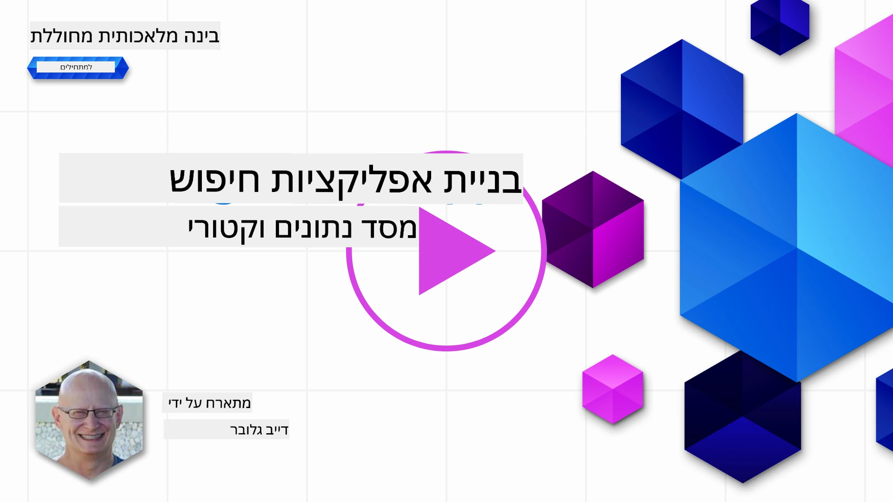
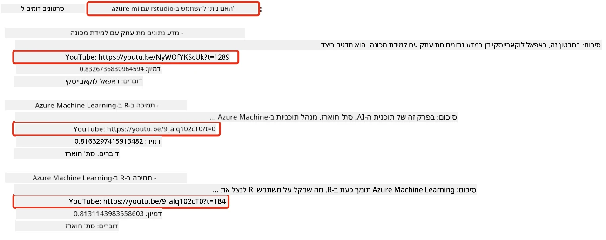
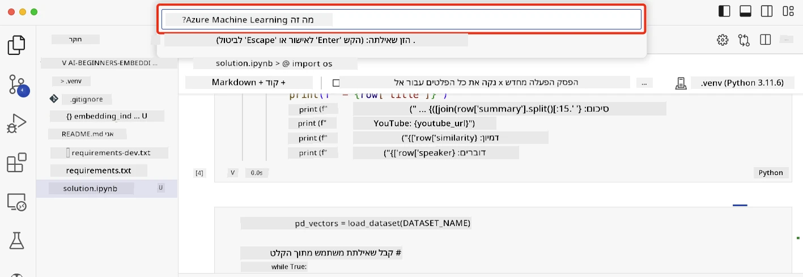

# בניית יישומי חיפוש

[](https://youtu.be/W0-nzXjOjr0?si=GcsqiTTvd7RKbo7V)

> > _לחצו על התמונה למעלה לצפייה בסרטון של השיעור הזה_

יש הרבה יותר ל-LLM מאשר צ'אטבוטים ויצירת טקסט. אפשר גם לבנות יישומי חיפוש באמצעות האמבדינגס. אמבדינגס הם ייצוגים מספריים של נתונים הידועים גם כווקטורים, וניתן להשתמש בהם לחיפוש סמנטי של נתונים.

בשיעור זה, תוכלו לבנות יישום חיפוש עבור הסטארטאפ החינוכי שלנו. הסטארטאפ שלנו הוא ארגון ללא מטרות רווח שמספק חינוך חינם לסטודנטים במדינות מתפתחות. לסטארטאפ שלנו יש מספר גדול של סרטוני YouTube שהסטודנטים יכולים להשתמש בהם כדי ללמוד על AI. הסטארטאפ שלנו רוצה לבנות יישום חיפוש שמאפשר לסטודנטים לחפש סרטון YouTube על ידי הקלדת שאלה.

למשל, סטודנט יכול להקליד 'מה הם Jupyter Notebooks?' או 'מה זה Azure ML' ויישום החיפוש יחזיר רשימת סרטוני YouTube שרלוונטיים לשאלה, ויותר מזה, יישום החיפוש יחזיר קישור למקום בסרטון שבו נמצא התשובה לשאלה.

## הקדמה

בשיעור זה נעסוק ב:

- חיפוש סמנטי מול חיפוש מבוסס מילות מפתח.
- מהן אמבדינגס טקסט.
- יצירת אינדקס אמבדינגס טקסט.
- חיפוש באינדקס אמבדינגס טקסט.

## מטרות הלמידה

לאחר השלמת שיעור זה, תוכלו:

- להבחין בין חיפוש סמנטי לחיפוש מילות מפתח.
- להסביר מהן אמבדינגס טקסט.
- ליצור יישום שמשתמש באמבדינגס לחיפוש נתונים.

## למה לבנות יישום חיפוש?

יצירת יישום חיפוש תעזור לכם להבין איך להשתמש באמבדינגס לחיפוש נתונים. תלמדו גם איך לבנות יישום חיפוש שסטודנטים יוכלו להשתמש בו כדי למצוא מידע במהירות.

השיעור כולל אינדקס אמבדינגס של תמלילי הווידאו ב-YouTube של ערוץ Microsoft [AI Show](https://www.youtube.com/playlist?list=PLlrxD0HtieHi0mwteKBOfEeOYf0LJU4O1). ה-AI Show הוא ערוץ YouTube שלומד אתכם על AI ולמידת מכונה. אינדקס האמבדינגס מכיל את האמבדינגס לכל תמלילי הווידאו עד אוקטובר 2023. תשתמשו באינדקס האמבדינגס כדי לבנות יישום חיפוש עבור הסטארטאפ שלנו. יישום החיפוש יחזיר קישור למקום בסרטון שבו נמצא התשובה לשאלה. זו דרך מצוינת לסטודנטים למצוא במהירות את המידע שהם צריכים.

הבא הוא דוגמה לשאילתה סמנטית לשאלה 'האם אפשר להשתמש ב-rstudio עם Azure ML?'. בדקו את כתובת ה-YouTube, תראו שהכתובת כוללת חותמת זמן שמקפיצה אתכם למקום בסרטון שבו נמצאת התשובה לשאלה.



## מה זה חיפוש סמנטי?

עכשיו אולי אתם תוהים, מה זה חיפוש סמנטי? חיפוש סמנטי הוא טכניקת חיפוש שמשתמשת בסמנטיקה, או במשמעות, של המילים בשאילתה כדי להחזיר תוצאות רלוונטיות.

הנה דוגמה לחיפוש סמנטי. נניח שאתם מחפשים לקנות רכב, אתם עשויים לחפש "הרכב החלומי שלי", חיפוש סמנטי מבין שאתם לא `חולמים` על רכב, אלא מחפשים לקנות את הרכב ה`אידיאלי` שלכם. חיפוש סמנטי מבין את הכוונה שלכם ומחזיר תוצאות רלוונטיות. האלטרנטיבה היא `חיפוש מילות מפתח` שיחפש במדויק את המילים ויחזור לעיתים קרובות לתוצאות לא רלוונטיות.

## מהן אמבדינגס טקסט?

[אמבדינגס טקסט](https://en.wikipedia.org/wiki/Word_embedding?WT.mc_id=academic-105485-koreyst) הם טכניקת ייצוג טקסט המשמשת ב-[עיבוד שפה טבעית](https://en.wikipedia.org/wiki/Natural_language_processing?WT.mc_id=academic-105485-koreyst). אמבדינגס טקסט הם ייצוגים מספריים סמנטיים של טקסט. משתמשים באמבדינגס כדי לייצג נתונים בצורה שקל למכונה להבין. קיימים מודלים רבים לבניית אמבדינגס טקסט, בשיעור זה נתמקד ביצירת אמבדינגס באמצעות דגם האמבדינג של OpenAI.

הנה דוגמה, תארו לעצמכם שהטקסט הבא נמצא בתמליל מאחד הפרקים בערוץ ה-AI Show ב-YouTube:

```text
Today we are going to learn about Azure Machine Learning.
```

נעביר את הטקסט ל-OpenAI Embedding API והוא יחזיר את האמבדינג הבא שמכיל 1536 מספרים כלומר וקטור. כל מספר בוקטור מייצג אספקט שונה של הטקסט. בקיצור, הנה 10 המספרים הראשונים בוקטור.

```python
[-0.006655829958617687, 0.0026128944009542465, 0.008792596869170666, -0.02446001023054123, -0.008540431968867779, 0.022071078419685364, -0.010703742504119873, 0.003311325330287218, -0.011632772162556648, -0.02187200076878071, ...]
```

## איך נוצר אינדקס האמбедינג?

אינדקס האמבדינג לשיעור זה נוצר עם סדרת סקריפטים בפייתון. תוכלו למצוא את הסקריפטים יחד עם ההוראות בקובץ ה-[README](./scripts/README.md?WT.mc_id=academic-105485-koreyst) בתיקיית 'scripts' של השיעור. אין צורך להריץ את הסקריפטים כדי להשלים את השיעור מאחר ואינדקס האמבדינג מסופק לכם.

הסקריפטים מבצעים את הפעולות הבאות:

1. תמליל של כל סרטון YouTube בערוץ [AI Show](https://www.youtube.com/playlist?list=PLlrxD0HtieHi0mwteKBOfEeOYf0LJU4O1) מורד.
2. באמצעות [OpenAI Functions](https://learn.microsoft.com/azure/ai-foundry/openai/how-to/function-calling?WT.mc_id=academic-105485-koreyst), נעשית נסיון לחלץ את שם הדובר מ-3 הדקות הראשונות של תמליל ה-YouTube. שם הדובר לכל סרטון נשמר באינדקס האמבדינג בשם `embedding_index_3m.json`.
3. טקסט התמליל מנותח ל**קטעי טקסט של 3 דקות**. הקטע כולל כ-20 מילים החופפות מהקטע הבא כדי להבטיח שהאמבדינג של הקטע לא ייחתך ולספק הקשר חיפוש טוב יותר.
4. כל קטע טקסט מועבר ל-OpenAI Chat API לסיכום הטקסט ל-60 מילים. הסיכום נשמר גם הוא באינדקס האמבדינג `embedding_index_3m.json`.
5. לבסוף, טקסט הקטע מועבר ל-OpenAI Embedding API. API של האמבדינג מחזיר וקטור של 1536 מספרים שמייצגים את המשמעות הסמנטית של הקטע. הקטע יחד עם וקטור האמבדינג של OpenAI נשמרים באינדקס אמבדינג `embedding_index_3m.json`.

### מאגרי נתונים וקטוריים

לצורך הפשטות, אינדקס האמבדינג נשמר בקובץ JSON בשם `embedding_index_3m.json` ונטען ל-Pandas DataFrame. עם זאת, בפרודקשן, אינדקס האמבדינג יאוחסן במאגר וקטורים כמו [Azure Cognitive Search](https://learn.microsoft.com/training/modules/improve-search-results-vector-search?WT.mc_id=academic-105485-koreyst), [Redis](https://cookbook.openai.com/examples/vector_databases/redis/readme?WT.mc_id=academic-105485-koreyst), [Pinecone](https://cookbook.openai.com/examples/vector_databases/pinecone/readme?WT.mc_id=academic-105485-koreyst), [Weaviate](https://cookbook.openai.com/examples/vector_databases/weaviate/readme?WT.mc_id=academic-105485-koreyst), ועוד.

## הבנת דמיון קוסינוס

למדנו על אמבדינגס טקסט, הצעד הבא הוא ללמוד איך להשתמש באמבדינגס טקסט לחיפוש נתונים ובפרט למצוא את האמבדינגס הכי דומים לשאילתה באמצעות דמיון קוסינוס.

### מה זה דמיון קוסינוס?

דמיון קוסינוס הוא מדד דמיון בין שני וקטורים, תשמעו לו גם בשם `חיפוש השכן הקרוב`. כדי לבצע חיפוש לפי דמיון קוסינוס צריך _להמיר לוקטור_ את טקסט ה_שאילתה_ באמצעות OpenAI Embedding API. לאחר מכן לחשב את ה_דמיון הקוסינוסי_ בין וקטור השאילתה לבין כל וקטור באינדקס האמבדינג. זכרו, לאינדקס האמבדינג יש וקטור עבור כל קטע טקסט בתמליל ה-YouTube. לבסוף, מיין את התוצאות לפי דמיון קוסינוס וקטעי הטקסט עם הדמיון הקוסינוסי הגבוה ביותר הם הדומים ביותר לשאילתה.

מבחינה מתמטית, דמיון קוסינוס מודד את הקוסינוס של הזווית בין שני וקטורים שמוקרנים במרחב רב-ממדי. מדידה זו מועילה, כי אם שני מסמכים רחוקים לפי מרחק אוקלידי בגלל הגודל, הם עדיין יכולים להיות עם זווית קטנה ביניהם ולכן דמיון קוסינוס גבוה יותר. למידע נוסף על נוסחאות דמיון קוסינוס ראו [Cosine similarity](https://en.wikipedia.org/wiki/Cosine_similarity?WT.mc_id=academic-105485-koreyst).

## בניית יישום החיפוש הראשון שלכם

כעת נלמד כיצד לבנות יישום חיפוש באמצעות אמבדינגס. יישום החיפוש יאפשר לסטודנטים לחפש סרטון על ידי הקלדת שאלה. יישום החיפוש יחזיר רשימת סרטונים הרלוונטיים לשאלה. יישום החיפוש גם יחזיר קישור למקום בסרטון שבו נמצאת התשובה לשאלה.

פתרון זה נבנה ונבדק על Windows 11, macOS, ו-Ubuntu 22.04 באמצעות Python 3.10 ומעלה. ניתן להוריד Python מ-[python.org](https://www.python.org/downloads/?WT.mc_id=academic-105485-koreyst).

## משימה - בניית יישום חיפוש, לאפשר לסטודנטים

הצגנו את הסטארטאפ בתחילת השיעור. כעת הגיע הזמן לאפשר לסטודנטים לבנות יישום חיפוש להערכות שלהם.

במשימה זו תיצרו את שירותי Azure OpenAI שישמשו לבניית יישום החיפוש. תיצרו את שירותי Azure OpenAI הבאים. תצטרכו מנוי Azure כדי להשלים משימה זו.

### התחילו את Azure Cloud Shell

1. היכנסו ל-[פורט Azure](https://portal.azure.com/?WT.mc_id=academic-105485-koreyst).
2. בחרו באייקון Cloud Shell בפינה הימנית העליונה של פורטל Azure.
3. בחרו **Bash** כסוג הסביבה.

#### צרו קבוצת משאבים

> להוראות אלה, אנחנו משתמשים בקבוצת המשאבים בשם "semantic-video-search" במזרח ארה"ב.
> ניתן לשנות את שם קבוצת המשאבים, אבל כשמשנים את המיקום של המשאבים,
> בדקו את [טבלת זמינות המודלים](https://aka.ms/oai/models?WT.mc_id=academic-105485-koreyst).

```shell
az group create --name semantic-video-search --location eastus
```

#### צרו משאב שירות Azure OpenAI

מתוך Azure Cloud Shell, הריצו את הפקודה הבאה כדי ליצור משאב של שירות Azure OpenAI.

```shell
az cognitiveservices account create --name semantic-video-openai --resource-group semantic-video-search \
    --location eastus --kind OpenAI --sku s0
```

#### קבלו את נקודת הקצה והמפתחות לשימוש ביישום זה

מתוך Azure Cloud Shell, הריצו את הפקודות הבאות כדי לקבל את נקודת הקצה והמפתחות של משאב שירות Azure OpenAI.

```shell
az cognitiveservices account show --name semantic-video-openai \
   --resource-group  semantic-video-search | jq -r .properties.endpoint
az cognitiveservices account keys list --name semantic-video-openai \
   --resource-group semantic-video-search | jq -r .key1
```

#### פרסמו את מודל האמבדינג של OpenAI

מתוך Azure Cloud Shell, הריצו את הפקודה הבאה כדי לפרסם את מודל האמבדינג של OpenAI.

```shell
az cognitiveservices account deployment create \
    --name semantic-video-openai \
    --resource-group  semantic-video-search \
    --deployment-name text-embedding-ada-002 \
    --model-name text-embedding-ada-002 \
    --model-version "2"  \
    --model-format OpenAI \
    --sku-capacity 100 --sku-name "Standard"
```

## פתרון

פתחו את [מחברת הפתרון](./python/aoai-solution.ipynb?WT.mc_id=academic-105485-koreyst) ב-GitHub Codespaces ועקבו אחרי ההוראות במחברת Jupyter.

כשאתם מריצים את המחברת, תתבקשו להזין שאילתה. תיבת הקלט תיראה כך:



## עבודה מצוינת! המשיכו ללמוד

לאחר השלמת שיעור זה, בדקו את [אוסף הלמידה של AI גנרטיבי שלנו](https://aka.ms/genai-collection?WT.mc_id=academic-105485-koreyst) להמשך שדרוג הידע שלכם בתחום!

עברו לשיעור 9 שבו נבחן איך [לבנות יישומי יצירת תמונה](../09-building-image-applications/README.md?WT.mc_id=academic-105485-koreyst)!

---

<!-- CO-OP TRANSLATOR DISCLAIMER START -->
**כתב ויתור**:
מסמך זה תורגם באמצעות שירות תרגום אוטומטי [Co-op Translator](https://github.com/Azure/co-op-translator). למרות שאנו שואפים לדיוק, יש לקחת בחשבון שתרגומים אוטומטיים עלולים להכיל שגיאות או אי-דיוקים. יש להחשיב את המסמך המקורי בשפתו הטבעית כמקור הסמכות. למידע קריטי מומלץ להשתמש בתרגום מקצועי על ידי מתרגם אדם. אנו לא אחראים לכל אי-הבנה או פירוש שגוי הנובע מהשימוש בתרגום זה.
<!-- CO-OP TRANSLATOR DISCLAIMER END -->