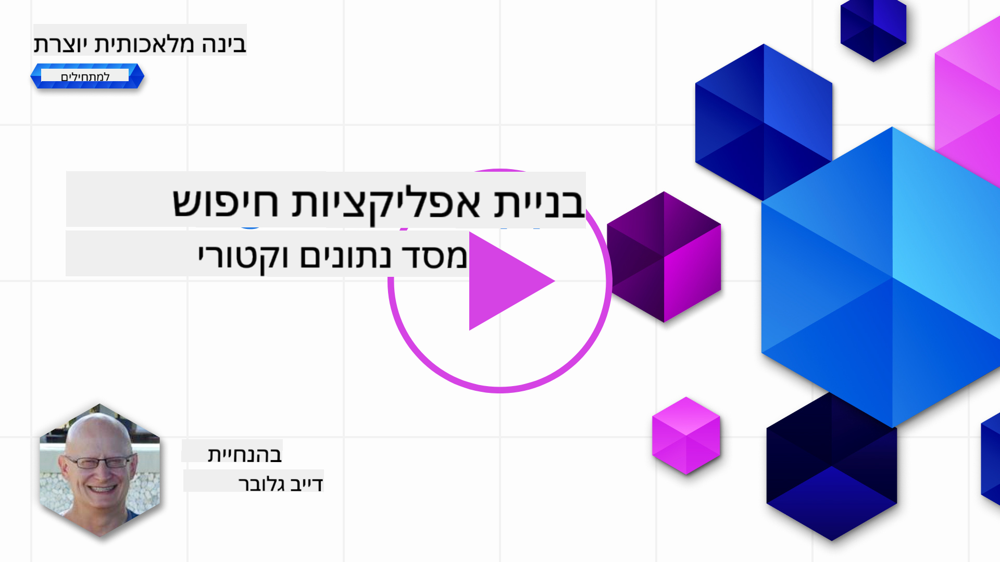
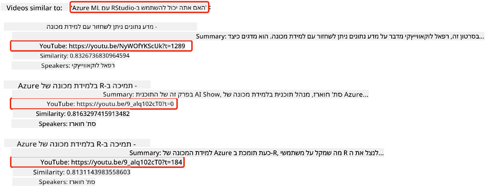
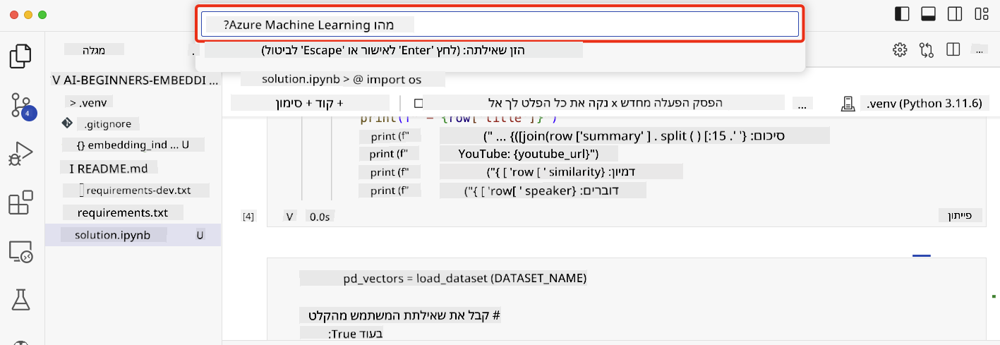

<!--
CO_OP_TRANSLATOR_METADATA:
{
  "original_hash": "d46aad0917a1a342d613e2c13d457da5",
  "translation_date": "2025-06-25T16:35:23+00:00",
  "source_file": "08-building-search-applications/README.md",
  "language_code": "he"
}
-->
# בניית יישומי חיפוש

[](https://aka.ms/gen-ai-lesson8-gh?WT.mc_id=academic-105485-koreyst)

> > _לחץ על התמונה למעלה כדי לצפות בסרטון של השיעור הזה_

יש יותר ל-LLMs מאשר צ'אטבוטים ויצירת טקסט. ניתן גם לבנות יישומי חיפוש באמצעות Embeddings. Embeddings הם ייצוגים מספריים של נתונים הידועים גם כוקטורים, וניתן להשתמש בהם לחיפוש סמנטי של נתונים.

בשיעור הזה, אתה הולך לבנות יישום חיפוש עבור סטארטאפ החינוך שלנו. הסטארטאפ שלנו הוא ארגון ללא מטרות רווח המספק חינוך חינם לתלמידים במדינות מתפתחות. לסטארטאפ שלנו יש מספר רב של סרטוני YouTube שתלמידים יכולים להשתמש בהם כדי ללמוד על AI. הסטארטאפ שלנו רוצה לבנות יישום חיפוש שמאפשר לתלמידים לחפש סרטון YouTube על ידי הקלדת שאלה.

לדוגמה, תלמיד עשוי להקליד 'מה הם Jupyter Notebooks?' או 'מה זה Azure ML' ויישום החיפוש יחזיר רשימת סרטוני YouTube הרלוונטיים לשאלה, ויותר מכך, יישום החיפוש יחזיר קישור למקום בסרטון שבו נמצאת התשובה לשאלה.

## מבוא

בשיעור הזה נעסוק ב:

- חיפוש סמנטי מול חיפוש לפי מילות מפתח.
- מה הם Text Embeddings.
- יצירת אינדקס של Text Embeddings.
- חיפוש באינדקס של Text Embeddings.

## מטרות למידה

לאחר סיום השיעור, תוכל:

- להבחין בין חיפוש סמנטי לחיפוש לפי מילות מפתח.
- להסביר מה הם Text Embeddings.
- ליצור יישום באמצעות Embeddings לחיפוש נתונים.

## למה לבנות יישום חיפוש?

יצירת יישום חיפוש תעזור לך להבין כיצד להשתמש ב-Embeddings לחיפוש נתונים. תלמד גם כיצד לבנות יישום חיפוש שניתן להשתמש בו על ידי תלמידים למציאת מידע במהירות.

השיעור כולל אינדקס Embedding של תמלולי YouTube לערוץ [AI Show](https://www.youtube.com/playlist?list=PLlrxD0HtieHi0mwteKBOfEeOYf0LJU4O1) של מיקרוסופט. ה-AI Show הוא ערוץ YouTube שמלמד על AI ולמידת מכונה. אינדקס ה-Embedding מכיל את ה-Embeddings עבור כל אחד מהתמלולים של YouTube עד אוקטובר 2023. תשתמש באינדקס ה-Embedding לבניית יישום חיפוש עבור הסטארטאפ שלנו. יישום החיפוש מחזיר קישור למקום בסרטון שבו נמצאת התשובה לשאלה. זו דרך מצוינת לתלמידים למצוא את המידע שהם צריכים במהירות.

הבא הוא דוגמה לשאילתה סמנטית לשאלה 'האם ניתן להשתמש ב-rstudio עם azure ml?'. בדוק את כתובת ה-URL של YouTube, תראה שה-URL מכיל חותמת זמן שמביאה אותך למקום בסרטון שבו נמצאת התשובה לשאלה.



## מה זה חיפוש סמנטי?

עכשיו אולי אתה תוהה, מה זה חיפוש סמנטי? חיפוש סמנטי הוא טכניקת חיפוש שמשתמשת בסמנטיקה, או משמעות, של המילים בשאילתה כדי להחזיר תוצאות רלוונטיות.

הנה דוגמה לחיפוש סמנטי. נניח שאתה מחפש לקנות רכב, אתה עשוי לחפש 'הרכב החלומי שלי', חיפוש סמנטי מבין שאתה לא `dreaming` על רכב, אלא שאתה מחפש לקנות את ה`ideal` רכב שלך. חיפוש סמנטי מבין את הכוונה שלך ומחזיר תוצאות רלוונטיות. האלטרנטיבה היא `keyword search` שתאמת תבצע חיפוש חלומות על רכבים ולעיתים קרובות תחזיר תוצאות לא רלוונטיות.

## מה הם Text Embeddings?

[Text embeddings](https://en.wikipedia.org/wiki/Word_embedding?WT.mc_id=academic-105485-koreyst) הם טכניקת ייצוג טקסט המשמשת ב[עיבוד שפה טבעית](https://en.wikipedia.org/wiki/Natural_language_processing?WT.mc_id=academic-105485-koreyst). Text embeddings הם ייצוגים מספריים סמנטיים של טקסט. Embeddings משמשים לייצוג נתונים בצורה קלה להבנה עבור מכונה. ישנם דגמים רבים לבניית Text embeddings, בשיעור הזה נתמקד ביצירת embeddings באמצעות מודל ה-Embedding של OpenAI.

הנה דוגמה, דמיין שהטקסט הבא נמצא בתמלול מאחד הפרקים בערוץ ה-AI Show של YouTube:

```text
Today we are going to learn about Azure Machine Learning.
```

נעביר את הטקסט ל-API ה-Embedding של OpenAI והוא יחזיר את ה-embedding הבא שמורכב מ-1536 מספרים הידועים כוקטור. כל מספר בוקטור מייצג היבט שונה של הטקסט. לשם קיצור, הנה עשרת המספרים הראשונים בוקטור.

```python
[-0.006655829958617687, 0.0026128944009542465, 0.008792596869170666, -0.02446001023054123, -0.008540431968867779, 0.022071078419685364, -0.010703742504119873, 0.003311325330287218, -0.011632772162556648, -0.02187200076878071, ...]
```

## איך נוצר אינדקס ה-Embedding?

אינדקס ה-Embedding עבור השיעור הזה נוצר באמצעות סדרת סקריפטים ב-Python. תמצא את הסקריפטים יחד עם הוראות ב-[README](./scripts/README.md?WT.mc_id=academic-105485-koreyst) בתיקיית 'scripts' עבור השיעור הזה. אין צורך להפעיל את הסקריפטים האלה כדי להשלים את השיעור מכיוון שאינדקס ה-Embedding מסופק עבורך.

הסקריפטים מבצעים את הפעולות הבאות:

1. התמלול עבור כל סרטון YouTube ברשימת ההשמעה של [AI Show](https://www.youtube.com/playlist?list=PLlrxD0HtieHi0mwteKBOfEeOYf0LJU4O1) מורד.
2. באמצעות [OpenAI Functions](https://learn.microsoft.com/azure/ai-services/openai/how-to/function-calling?WT.mc_id=academic-105485-koreyst), נעשה ניסיון לחלץ את שם הדובר מ-3 הדקות הראשונות של תמלול ה-YouTube. שם הדובר עבור כל סרטון נשמר באינדקס ה-Embedding שנקרא `embedding_index_3m.json`.
3. טקסט התמלול מחולק לקטעי טקסט של **3 דקות**. הקטע כולל כ-20 מילים חופפות מהקטע הבא כדי להבטיח שה-Embedding של הקטע לא יחתך ולספק הקשר חיפוש טוב יותר.
4. כל קטע טקסט מועבר ל-API הצ'אט של OpenAI כדי לסכם את הטקסט ל-60 מילים. הסיכום נשמר גם הוא באינדקס ה-Embedding `embedding_index_3m.json`.
5. לבסוף, טקסט הקטע מועבר ל-API ה-Embedding של OpenAI. ה-API ה-Embedding מחזיר וקטור של 1536 מספרים שמייצג את המשמעות הסמנטית של הקטע. הקטע יחד עם וקטור ה-Embedding של OpenAI נשמר באינדקס ה-Embedding `embedding_index_3m.json`.

### מאגרי וקטורים

לשם פשטות השיעור, אינדקס ה-Embedding נשמר בקובץ JSON בשם `embedding_index_3m.json` ומוטען לתוך DataFrame של Pandas. עם זאת, בייצור, אינדקס ה-Embedding יישמר במאגר וקטורים כמו [Azure Cognitive Search](https://learn.microsoft.com/training/modules/improve-search-results-vector-search?WT.mc_id=academic-105485-koreyst), [Redis](https://cookbook.openai.com/examples/vector_databases/redis/readme?WT.mc_id=academic-105485-koreyst), [Pinecone](https://cookbook.openai.com/examples/vector_databases/pinecone/readme?WT.mc_id=academic-105485-koreyst), [Weaviate](https://cookbook.openai.com/examples/vector_databases/weaviate/readme?WT.mc_id=academic-105485-koreyst), רק כדי להזכיר כמה.

## הבנת דמיון קוסינוס

למדנו על text embeddings, השלב הבא הוא ללמוד כיצד להשתמש ב-text embeddings לחיפוש נתונים ובפרט למצוא את ה-embeddings הדומים ביותר לשאילתה נתונה באמצעות דמיון קוסינוס.

### מה זה דמיון קוסינוס?

דמיון קוסינוס הוא מדד לדמיון בין שני וקטורים, תוכל לשמוע על זה גם כ`nearest neighbor search`. כדי לבצע חיפוש דמיון קוסינוס עליך לְוֶקטוֹרֵיזֵר את טקסט ה-שְׁאֵילָה באמצעות ה-API ה-Embedding של OpenAI. לאחר מכן לחשב את ה-דמיון קוסינוס בין וקטור השאילתה לכל וקטור באינדקס ה-Embedding. זכור, לאינדקס ה-Embedding יש וקטור עבור כל קטע טקסט של תמלול YouTube. לבסוף, מיין את התוצאות לפי דמיון קוסינוס והקטעי הטקסט עם דמיון הקוסינוס הגבוה ביותר הם הדומים ביותר לשאילתה.

מבחינה מתמטית, דמיון קוסינוס מודד את הקוסינוס של הזווית בין שני וקטורים המוקרנים במרחב רב-ממדי. מדידה זו מועילה, מכיוון שאם שני מסמכים רחוקים זה מזה במרחק אוקלידי בגלל גודל, הם עדיין יכולים להיות בעלי זווית קטנה יותר ביניהם ולכן דמיון קוסינוס גבוה יותר. למידע נוסף על משוואות דמיון קוסינוס, עיין ב[דמיון קוסינוס](https://en.wikipedia.org/wiki/Cosine_similarity?WT.mc_id=academic-105485-koreyst).

## בניית יישום החיפוש הראשון שלך

כעת, אנחנו הולכים ללמוד כיצד לבנות יישום חיפוש באמצעות Embeddings. יישום החיפוש יאפשר לתלמידים לחפש סרטון על ידי הקלדת שאלה. יישום החיפוש יחזיר רשימת סרטונים הרלוונטיים לשאלה. יישום החיפוש גם יחזיר קישור למקום בסרטון שבו נמצאת התשובה לשאלה.

הפתרון הזה נבנה ונבדק על Windows 11, macOS, ו-Ubuntu 22.04 באמצעות Python 3.10 או מאוחר יותר. תוכל להוריד את Python מ[python.org](https://www.python.org/downloads/?WT.mc_id=academic-105485-koreyst).

## משימה - בניית יישום חיפוש, לאפשר לתלמידים

הצגנו את הסטארטאפ שלנו בתחילת השיעור הזה. עכשיו זה הזמן לאפשר לתלמידים לבנות יישום חיפוש עבור ההערכות שלהם.

במשימה הזו, תיצור את שירותי Azure OpenAI שישמשו לבניית יישום החיפוש. תיצור את שירותי Azure OpenAI הבאים. תזדקק למנוי Azure כדי להשלים את המשימה הזו.

### התחל את Azure Cloud Shell

1. התחבר ל[פורטל Azure](https://portal.azure.com/?WT.mc_id=academic-105485-koreyst).
2. בחר את סמל ה-Cloud Shell בפינה העליונה-ימנית של פורטל Azure.
3. בחר **Bash** עבור סוג הסביבה.

#### צור קבוצת משאבים

> להוראות האלה, אנחנו משתמשים בקבוצת המשאבים בשם "semantic-video-search" במזרח ארה"ב.
> תוכל לשנות את שם קבוצת המשאבים, אך כאשר תשנה את המיקום עבור המשאבים,
> בדוק את [טבלת זמינות המודלים](https://aka.ms/oai/models?WT.mc_id=academic-105485-koreyst).

```shell
az group create --name semantic-video-search --location eastus
```

#### צור משאב שירות Azure OpenAI

מ-Azure Cloud Shell, הרץ את הפקודה הבאה כדי ליצור משאב שירות Azure OpenAI.

```shell
az cognitiveservices account create --name semantic-video-openai --resource-group semantic-video-search \
    --location eastus --kind OpenAI --sku s0
```

#### קבל את נקודת הקצה והמפתחות לשימוש ביישום הזה

מ-Azure Cloud Shell, הרץ את הפקודות הבאות כדי לקבל את נקודת הקצה והמפתחות עבור משאב שירות Azure OpenAI.

```shell
az cognitiveservices account show --name semantic-video-openai \
   --resource-group  semantic-video-search | jq -r .properties.endpoint
az cognitiveservices account keys list --name semantic-video-openai \
   --resource-group semantic-video-search | jq -r .key1
```

#### פרוס את מודל ה-Embedding של OpenAI

מ-Azure Cloud Shell, הרץ את הפקודה הבאה כדי לפרוס את מודל ה-Embedding של OpenAI.

```shell
az cognitiveservices account deployment create \
    --name semantic-video-openai \
    --resource-group  semantic-video-search \
    --deployment-name text-embedding-ada-002 \
    --model-name text-embedding-ada-002 \
    --model-version "2"  \
    --model-format OpenAI \
    --sku-capacity 100 --sku-name "Standard"
```

## פתרון

פתח את [מחברת הפתרון](../../../08-building-search-applications/python/aoai-solution.ipynb) ב-GitHub Codespaces ופעל לפי ההוראות במחברת Jupyter.

כאשר תריץ את המחברת, תתבקש להכניס שאילתה. תיבת הקלט תיראה כך:



## עבודה נהדרת! המשך ללמוד

לאחר השלמת השיעור הזה, בדוק את [אוסף הלמידה של AI גנרטיבי](https://aka.ms/genai-collection?WT.mc_id=academic-105485-koreyst) שלנו כדי להמשיך לשפר את הידע שלך ב-AI גנרטיבי!

עבור לשיעור 9 שבו נסתכל על איך [לבנות יישומי יצירת תמונות](../09-building-image-applications/README.md?WT.mc_id=academic-105485-koreyst)!

**כתב ויתור**:  
מסמך זה תורגם באמצעות שירות תרגום AI [Co-op Translator](https://github.com/Azure/co-op-translator). בעוד שאנו שואפים לדיוק, אנא היו מודעים לכך שתרגומים אוטומטיים עשויים להכיל שגיאות או אי-דיוקים. המסמך המקורי בשפתו המקורית צריך להיחשב כמקור הסמכותי. למידע קריטי, מומלץ להשתמש בתרגום אנושי מקצועי. אנו לא אחראים לכל אי-הבנה או פרשנות מוטעית הנובעת משימוש בתרגום זה.