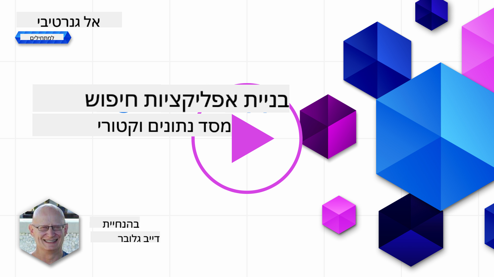
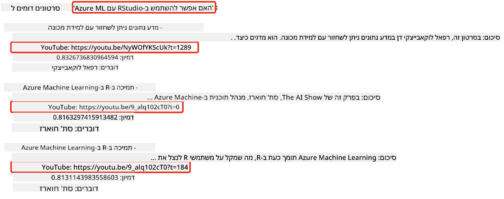

<!--
CO_OP_TRANSLATOR_METADATA:
{
  "original_hash": "58953c08b8ba7073b836d4270ea0fe86",
  "translation_date": "2025-10-17T20:01:12+00:00",
  "source_file": "08-building-search-applications/README.md",
  "language_code": "he"
}
-->
# בניית יישומי חיפוש

[](https://youtu.be/W0-nzXjOjr0?si=GcsqiTTvd7RKbo7V)

> > _לחצו על התמונה למעלה לצפייה בסרטון של השיעור הזה_

יש יותר במודלים של שפה גדולה (LLMs) מאשר רק צ'אטבוטים ויצירת טקסטים. ניתן גם לבנות יישומי חיפוש באמצעות Embeddings. Embeddings הם ייצוגים מספריים של נתונים, הידועים גם כוקטורים, וניתן להשתמש בהם לחיפוש סמנטי של נתונים.

בשיעור הזה, אתם הולכים לבנות יישום חיפוש עבור הסטארטאפ החינוכי שלנו. הסטארטאפ שלנו הוא ארגון ללא מטרות רווח שמספק חינוך חינם לתלמידים במדינות מתפתחות. לסטארטאפ שלנו יש מספר רב של סרטוני YouTube שתלמידים יכולים להשתמש בהם כדי ללמוד על AI. הסטארטאפ שלנו רוצה לבנות יישום חיפוש שמאפשר לתלמידים לחפש סרטון YouTube על ידי הקלדת שאלה.

לדוגמה, תלמיד יכול להקליד 'מה הם Jupyter Notebooks?' או 'מה זה Azure ML' ויישום החיפוש יחזיר רשימה של סרטוני YouTube שרלוונטיים לשאלה, ואפילו טוב יותר, יישום החיפוש יחזיר קישור למקום בסרטון שבו נמצאת התשובה לשאלה.

## מבוא

בשיעור הזה, נעסוק ב:

- חיפוש סמנטי לעומת חיפוש לפי מילות מפתח.
- מה הם Text Embeddings.
- יצירת אינדקס של Text Embeddings.
- חיפוש באינדקס של Text Embeddings.

## מטרות למידה

לאחר סיום השיעור, תוכלו:

- להבחין בין חיפוש סמנטי לחיפוש לפי מילות מפתח.
- להסביר מה הם Text Embeddings.
- ליצור יישום שמשתמש ב-Embeddings לחיפוש נתונים.

## למה לבנות יישום חיפוש?

יצירת יישום חיפוש תעזור לכם להבין איך להשתמש ב-Embeddings לחיפוש נתונים. תלמדו גם איך לבנות יישום חיפוש שתלמידים יכולים להשתמש בו כדי למצוא מידע במהירות.

השיעור כולל אינדקס Embedding של תמלילי YouTube לערוץ [AI Show](https://www.youtube.com/playlist?list=PLlrxD0HtieHi0mwteKBOfEeOYf0LJU4O1) של Microsoft. AI Show הוא ערוץ YouTube שמלמד על AI ולמידת מכונה. אינדקס ה-Embedding מכיל את ה-Embeddings עבור כל אחד מתמלילי YouTube עד אוקטובר 2023. תשתמשו באינדקס ה-Embedding כדי לבנות יישום חיפוש עבור הסטארטאפ שלנו. יישום החיפוש מחזיר קישור למקום בסרטון שבו נמצאת התשובה לשאלה. זו דרך מצוינת לתלמידים למצוא את המידע שהם צריכים במהירות.

הדוגמה הבאה מציגה שאילתה סמנטית לשאלה 'האם אפשר להשתמש ב-rstudio עם azure ml?'. שימו לב ל-URL של YouTube, תראו שה-URL מכיל חותמת זמן שמובילה אתכם למקום בסרטון שבו נמצאת התשובה לשאלה.



## מה זה חיפוש סמנטי?

עכשיו אתם אולי תוהים, מה זה חיפוש סמנטי? חיפוש סמנטי הוא טכניקת חיפוש שמשתמשת במשמעות של המילים בשאילתה כדי להחזיר תוצאות רלוונטיות.

הנה דוגמה לחיפוש סמנטי. נניח שאתם מחפשים לקנות רכב, אתם עשויים לחפש 'הרכב החלומי שלי', חיפוש סמנטי מבין שאתם לא `חולמים` על רכב, אלא מחפשים לקנות את הרכב `האידיאלי` שלכם. חיפוש סמנטי מבין את הכוונה שלכם ומחזיר תוצאות רלוונטיות. האלטרנטיבה היא `חיפוש לפי מילות מפתח` שיחפש באופן מילולי חלומות על רכבים ולעיתים קרובות יחזיר תוצאות לא רלוונטיות.

## מה הם Text Embeddings?

[Text embeddings](https://en.wikipedia.org/wiki/Word_embedding?WT.mc_id=academic-105485-koreyst) הם טכניקת ייצוג טקסט שמשתמשים בה ב-[עיבוד שפה טבעית](https://en.wikipedia.org/wiki/Natural_language_processing?WT.mc_id=academic-105485-koreyst). Text embeddings הם ייצוגים מספריים סמנטיים של טקסט. Embeddings משמשים לייצוג נתונים בצורה שקל למכונה להבין. ישנם מודלים רבים ליצירת Text Embeddings, בשיעור הזה נתמקד ביצירת Embeddings באמצעות מודל ה-Embedding של OpenAI.

הנה דוגמה, דמיינו שהטקסט הבא נמצא בתמליל מאחד הפרקים בערוץ YouTube של AI Show:

```text
Today we are going to learn about Azure Machine Learning.
```

נעביר את הטקסט ל-OpenAI Embedding API והוא יחזיר את ה-Embedding הבא שמורכב מ-1536 מספרים, הידועים גם כוקטור. כל מספר בוקטור מייצג היבט שונה של הטקסט. לשם קיצור, הנה 10 המספרים הראשונים בוקטור.

```python
[-0.006655829958617687, 0.0026128944009542465, 0.008792596869170666, -0.02446001023054123, -0.008540431968867779, 0.022071078419685364, -0.010703742504119873, 0.003311325330287218, -0.011632772162556648, -0.02187200076878071, ...]
```

## איך נוצר אינדקס ה-Embedding?

אינדקס ה-Embedding לשיעור הזה נוצר באמצעות סדרת סקריפטים ב-Python. תמצאו את הסקריפטים יחד עם הוראות ב-[README](./scripts/README.md?WT.mc_id=academic-105485-koreyst) בתיקיית 'scripts' של השיעור הזה. אין צורך להריץ את הסקריפטים כדי להשלים את השיעור הזה, מכיוון שאינדקס ה-Embedding מסופק לכם.

הסקריפטים מבצעים את הפעולות הבאות:

1. התמליל של כל סרטון YouTube ברשימת ההשמעה של [AI Show](https://www.youtube.com/playlist?list=PLlrxD0HtieHi0mwteKBOfEeOYf0LJU4O1) מורד.
2. באמצעות [OpenAI Functions](https://learn.microsoft.com/azure/ai-services/openai/how-to/function-calling?WT.mc_id=academic-105485-koreyst), נעשה ניסיון לחלץ את שם הדובר מתוך 3 הדקות הראשונות של תמליל הסרטון. שם הדובר עבור כל סרטון נשמר באינדקס ה-Embedding בשם `embedding_index_3m.json`.
3. טקסט התמליל מחולק לקטעי טקסט של **3 דקות**. הקטע כולל כ-20 מילים חופפות מהקטע הבא כדי להבטיח שה-Embedding של הקטע לא ייחתך ולספק הקשר חיפוש טוב יותר.
4. כל קטע טקסט מועבר ל-OpenAI Chat API כדי לסכם את הטקסט ל-60 מילים. הסיכום נשמר גם הוא באינדקס ה-Embedding `embedding_index_3m.json`.
5. לבסוף, טקסט הקטע מועבר ל-OpenAI Embedding API. ה-Embedding API מחזיר וקטור של 1536 מספרים שמייצגים את המשמעות הסמנטית של הקטע. הקטע יחד עם וקטור ה-Embedding של OpenAI נשמרים באינדקס ה-Embedding `embedding_index_3m.json`.

### מאגרי וקטורים

לשם פשטות השיעור, אינדקס ה-Embedding נשמר בקובץ JSON בשם `embedding_index_3m.json` ומועמס ל-Pandas DataFrame. עם זאת, בסביבת ייצור, אינדקס ה-Embedding יישמר במאגר וקטורים כמו [Azure Cognitive Search](https://learn.microsoft.com/training/modules/improve-search-results-vector-search?WT.mc_id=academic-105485-koreyst), [Redis](https://cookbook.openai.com/examples/vector_databases/redis/readme?WT.mc_id=academic-105485-koreyst), [Pinecone](https://cookbook.openai.com/examples/vector_databases/pinecone/readme?WT.mc_id=academic-105485-koreyst), [Weaviate](https://cookbook.openai.com/examples/vector_databases/weaviate/readme?WT.mc_id=academic-105485-koreyst), ועוד.

## הבנת דמיון קוסינוסי

למדנו על Text Embeddings, השלב הבא הוא ללמוד איך להשתמש ב-Text Embeddings לחיפוש נתונים ובפרט למצוא את ה-Embeddings הכי דומים לשאילתה נתונה באמצעות דמיון קוסינוסי.

### מה זה דמיון קוסינוסי?

דמיון קוסינוסי הוא מדד לדמיון בין שני וקטורים, לעיתים תשמעו את זה גם כ`חיפוש שכנים קרובים`. כדי לבצע חיפוש דמיון קוסינוסי, צריך ל`וקטוריזציה` של טקסט ה`שאילתה` באמצעות OpenAI Embedding API. לאחר מכן מחשבים את ה`דמיון הקוסינוסי` בין וקטור השאילתה לבין כל וקטור באינדקס ה-Embedding. זכרו, באינדקס ה-Embedding יש וקטור עבור כל קטע טקסט מתמליל YouTube. לבסוף, ממיינים את התוצאות לפי דמיון קוסינוסי והקטעים עם הדמיון הקוסינוסי הגבוה ביותר הם הכי דומים לשאילתה.

מבחינה מתמטית, דמיון קוסינוסי מודד את הקוסינוס של הזווית בין שני וקטורים המוקרנים במרחב רב-ממדי. מדידה זו מועילה, מכיוון שאם שני מסמכים רחוקים זה מזה במרחק אוקלידי בגלל גודל, הם עדיין יכולים להיות בעלי זווית קטנה ביניהם ולכן דמיון קוסינוסי גבוה יותר. למידע נוסף על משוואות דמיון קוסינוסי, ראו [דמיון קוסינוסי](https://en.wikipedia.org/wiki/Cosine_similarity?WT.mc_id=academic-105485-koreyst).

## בניית יישום החיפוש הראשון שלכם

כעת, נלמד איך לבנות יישום חיפוש באמצעות Embeddings. יישום החיפוש יאפשר לתלמידים לחפש סרטון על ידי הקלדת שאלה. יישום החיפוש יחזיר רשימה של סרטונים שרלוונטיים לשאלה. יישום החיפוש יחזיר גם קישור למקום בסרטון שבו נמצאת התשובה לשאלה.

הפתרון נבנה ונבדק על Windows 11, macOS, ו-Ubuntu 22.04 באמצעות Python 3.10 או גרסה מאוחרת יותר. ניתן להוריד את Python מ-[python.org](https://www.python.org/downloads/?WT.mc_id=academic-105485-koreyst).

## משימה - בניית יישום חיפוש, כדי לאפשר לתלמידים

הצגנו את הסטארטאפ שלנו בתחילת השיעור. עכשיו הגיע הזמן לאפשר לתלמידים לבנות יישום חיפוש עבור ההערכות שלהם.

במשימה הזו, תיצרו את שירותי Azure OpenAI שישמשו לבניית יישום החיפוש. תיצרו את שירותי Azure OpenAI הבאים. תצטרכו מנוי Azure כדי להשלים את המשימה הזו.

### התחלת Azure Cloud Shell

1. התחברו ל-[פורטל Azure](https://portal.azure.com/?WT.mc_id=academic-105485-koreyst).
2. בחרו באייקון Cloud Shell בפינה הימנית העליונה של פורטל Azure.
3. בחרו **Bash** כסוג הסביבה.

#### יצירת קבוצת משאבים

> להוראות האלה, אנחנו משתמשים בקבוצת משאבים בשם "semantic-video-search" במזרח ארה"ב.
> ניתן לשנות את שם קבוצת המשאבים, אבל כשמשנים את המיקום עבור המשאבים,
> בדקו את [טבלת זמינות המודלים](https://aka.ms/oai/models?WT.mc_id=academic-105485-koreyst).

```shell
az group create --name semantic-video-search --location eastus
```

#### יצירת משאב שירות Azure OpenAI

מ-Cloud Shell של Azure, הריצו את הפקודה הבאה כדי ליצור משאב שירות Azure OpenAI.

```shell
az cognitiveservices account create --name semantic-video-openai --resource-group semantic-video-search \
    --location eastus --kind OpenAI --sku s0
```

#### קבלת נקודת הקצה והמפתחות לשימוש ביישום הזה

מ-Cloud Shell של Azure, הריצו את הפקודות הבאות כדי לקבל את נקודת הקצה והמפתחות עבור משאב שירות Azure OpenAI.

```shell
az cognitiveservices account show --name semantic-video-openai \
   --resource-group  semantic-video-search | jq -r .properties.endpoint
az cognitiveservices account keys list --name semantic-video-openai \
   --resource-group semantic-video-search | jq -r .key1
```

#### פריסת מודל ה-Embedding של OpenAI

מ-Cloud Shell של Azure, הריצו את הפקודה הבאה כדי לפרוס את מודל ה-Embedding של OpenAI.

```shell
az cognitiveservices account deployment create \
    --name semantic-video-openai \
    --resource-group  semantic-video-search \
    --deployment-name text-embedding-ada-002 \
    --model-name text-embedding-ada-002 \
    --model-version "2"  \
    --model-format OpenAI \
    --sku-capacity 100 --sku-name "Standard"
```

## פתרון

פתחו את [מחברת הפתרון](./python/aoai-solution.ipynb?WT.mc_id=academic-105485-koreyst) ב-GitHub Codespaces ועקבו אחרי ההוראות במחברת Jupyter.

כשאתם מריצים את המחברת, תתבקשו להזין שאילתה. תיבת הקלט תיראה כך:


## עבודה מצוינת! המשיכו ללמוד

לאחר סיום השיעור הזה, בדקו את [אוסף הלמידה של AI גנרטיבי](https://aka.ms/genai-collection?WT.mc_id=academic-105485-koreyst) שלנו כדי להמשיך ולהעמיק את הידע שלכם ב-AI גנרטיבי!

עברו לשיעור 9 שבו נלמד איך [לבנות יישומי יצירת תמונות](../09-building-image-applications/README.md?WT.mc_id=academic-105485-koreyst)!

---

**כתב ויתור**:  
מסמך זה תורגם באמצעות שירות תרגום AI [Co-op Translator](https://github.com/Azure/co-op-translator). למרות שאנו שואפים לדיוק, יש לקחת בחשבון שתרגומים אוטומטיים עשויים להכיל שגיאות או אי דיוקים. המסמך המקורי בשפתו המקורית צריך להיחשב כמקור סמכותי. עבור מידע קריטי, מומלץ להשתמש בתרגום מקצועי אנושי. איננו אחראים לאי הבנות או לפרשנויות שגויות הנובעות משימוש בתרגום זה.