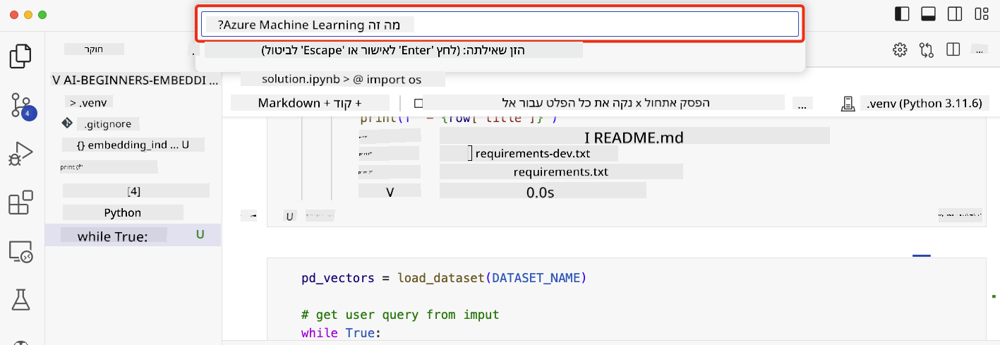

<!--
CO_OP_TRANSLATOR_METADATA:
{
  "original_hash": "d46aad0917a1a342d613e2c13d457da5",
  "translation_date": "2025-07-09T12:58:15+00:00",
  "source_file": "08-building-search-applications/README.md",
  "language_code": "he"
}
-->
# בניית אפליקציות חיפוש

[](https://aka.ms/gen-ai-lesson8-gh?WT.mc_id=academic-105485-koreyst)

> > _לחצו על התמונה למעלה לצפייה בסרטון של השיעור_

יש יותר ל-LLMs מאשר צ׳טבוטים ויצירת טקסט. אפשר גם לבנות אפליקציות חיפוש באמצעות Embeddings. Embeddings הם ייצוגים מספריים של נתונים, הידועים גם כווקטורים, וניתן להשתמש בהם לחיפוש סמנטי של נתונים.

בשיעור הזה, תבנו אפליקציית חיפוש עבור הסטארטאפ החינוכי שלנו. הסטארטאפ שלנו הוא ארגון ללא מטרות רווח שמספק חינוך חינם לסטודנטים במדינות מתפתחות. לסטארטאפ שלנו יש כמות גדולה של סרטוני YouTube שהסטודנטים יכולים להשתמש בהם כדי ללמוד על AI. הסטארטאפ רוצה לבנות אפליקציית חיפוש שתאפשר לסטודנטים לחפש סרטון YouTube על ידי הקלדת שאלה.

לדוגמה, סטודנט עשוי להקליד 'מה זה Jupyter Notebooks?' או 'מה זה Azure ML' ואפליקציית החיפוש תחזיר רשימה של סרטוני YouTube שרלוונטיים לשאלה, ויותר מזה, אפליקציית החיפוש תחזיר קישור למקום בסרטון שבו נמצא התשובה לשאלה.

## הקדמה

בשיעור זה נלמד על:

- חיפוש סמנטי לעומת חיפוש מילות מפתח.
- מה הם Text Embeddings.
- יצירת אינדקס Text Embeddings.
- חיפוש באינדקס Text Embeddings.

## מטרות הלמידה

בסיום השיעור תוכלו:

- להבדיל בין חיפוש סמנטי לחיפוש מילות מפתח.
- להסביר מה הם Text Embeddings.
- ליצור אפליקציה שמשתמשת ב-Embeddings לחיפוש נתונים.

## למה לבנות אפליקציית חיפוש?

יצירת אפליקציית חיפוש תעזור לכם להבין איך להשתמש ב-Embeddings לחיפוש נתונים. תלמדו גם איך לבנות אפליקציית חיפוש שסטודנטים יוכלו להשתמש בה כדי למצוא מידע במהירות.

השיעור כולל אינדקס Embedding של תמלולי YouTube עבור ערוץ Microsoft [AI Show](https://www.youtube.com/playlist?list=PLlrxD0HtieHi0mwteKBOfEeOYf0LJU4O1). ה-AI Show הוא ערוץ YouTube שמלמד על AI ולמידת מכונה. אינדקס ה-Embedding מכיל את ה-Embeddings עבור כל תמלול ה-YouTube עד אוקטובר 2023. תשתמשו באינדקס ה-Embedding כדי לבנות אפליקציית חיפוש עבור הסטארטאפ שלנו. אפליקציית החיפוש מחזירה קישור למקום בסרטון שבו נמצאת התשובה לשאלה. זו דרך מצוינת לסטודנטים למצוא את המידע שהם צריכים במהירות.

להלן דוגמה לשאילתה סמנטית לשאלה 'האם אפשר להשתמש ב-rstudio עם Azure ML?'. שימו לב לכתובת ה-YouTube, תראו שהכתובת כוללת חותמת זמן שמובילה אתכם למקום בסרטון שבו נמצאת התשובה לשאלה.


## מה זה חיפוש סמנטי?

עכשיו אולי תתעניינו, מה זה חיפוש סמנטי? חיפוש סמנטי הוא טכניקת חיפוש שמשתמשת במשמעות המילים בשאילתה כדי להחזיר תוצאות רלוונטיות.

הנה דוגמה לחיפוש סמנטי. נניח שאתם מחפשים לקנות רכב, אתם עשויים לחפש 'הרכב החלומי שלי', חיפוש סמנטי מבין שאתם לא `חולמים` על רכב, אלא מחפשים לקנות את ה`רכב האידיאלי` שלכם. חיפוש סמנטי מבין את הכוונה שלכם ומחזיר תוצאות רלוונטיות. האלטרנטיבה היא `חיפוש מילות מפתח` שיחפש מילולית חלומות על רכבים ולעיתים יחזיר תוצאות לא רלוונטיות.

## מה הם Text Embeddings?

[Text embeddings](https://en.wikipedia.org/wiki/Word_embedding?WT.mc_id=academic-105485-koreyst) הם טכניקת ייצוג טקסט המשמשת ב-[עיבוד שפה טבעית](https://en.wikipedia.org/wiki/Natural_language_processing?WT.mc_id=academic-105485-koreyst). Text embeddings הם ייצוגים מספריים סמנטיים של טקסט. Embeddings משמשים לייצוג נתונים בצורה שקל למכונה להבין. ישנם מודלים רבים לבניית text embeddings, בשיעור זה נתמקד ביצירת embeddings באמצעות מודל ה-OpenAI Embedding.

הנה דוגמה, דמיינו שהטקסט הבא הוא מתמלול של אחד הפרקים בערוץ ה-AI Show ב-YouTube:

```text
Today we are going to learn about Azure Machine Learning.
```

נעביר את הטקסט ל-OpenAI Embedding API והוא יחזיר את ה-embedding הבא שמכיל 1536 מספרים, כלומר וקטור. כל מספר בוקטור מייצג היבט שונה של הטקסט. בקיצור, הנה 10 המספרים הראשונים בוקטור.

```python
[-0.006655829958617687, 0.0026128944009542465, 0.008792596869170666, -0.02446001023054123, -0.008540431968867779, 0.022071078419685364, -0.010703742504119873, 0.003311325330287218, -0.011632772162556648, -0.02187200076878071, ...]
```

## איך נוצר אינדקס ה-Embedding?

אינדקס ה-Embedding לשיעור זה נוצר באמצעות סדרת סקריפטים בפייתון. תוכלו למצוא את הסקריפטים יחד עם ההוראות ב-[README](./scripts/README.md?WT.mc_id=academic-105485-koreyst) בתיקיית 'scripts' של השיעור. אין צורך להריץ את הסקריפטים כדי להשלים את השיעור כי אינדקס ה-Embedding כבר מסופק.

הסקריפטים מבצעים את הפעולות הבאות:

1. מורידים את התמלול של כל סרטון YouTube ברשימת ההשמעה של [AI Show](https://www.youtube.com/playlist?list=PLlrxD0HtieHi0mwteKBOfEeOYf0LJU4O1).
2. באמצעות [OpenAI Functions](https://learn.microsoft.com/azure/ai-services/openai/how-to/function-calling?WT.mc_id=academic-105485-koreyst), מנסים לחלץ את שם הדובר מה-3 הדקות הראשונות של תמלול ה-YouTube. שם הדובר לכל וידאו נשמר באינדקס ה-Embedding בשם `embedding_index_3m.json`.
3. הטקסט בתמלול מחולק ל**קטעי טקסט של 3 דקות**. הקטע כולל כ-20 מילים חופפות מהקטע הבא כדי לוודא שה-Embedding של הקטע לא ייחתך ולספק הקשר חיפוש טוב יותר.
4. כל קטע טקסט מועבר ל-OpenAI Chat API לסיכום הטקסט ל-60 מילים. הסיכום נשמר גם הוא באינדקס ה-Embedding `embedding_index_3m.json`.
5. לבסוף, טקסט הקטע מועבר ל-OpenAI Embedding API. ה-Embedding API מחזיר וקטור של 1536 מספרים שמייצגים את המשמעות הסמנטית של הקטע. הקטע יחד עם וקטור ה-OpenAI Embedding נשמרים באינדקס ה-Embedding `embedding_index_3m.json`.

### מסדי נתונים וקטוריים

לצורך פשטות השיעור, אינדקס ה-Embedding נשמר בקובץ JSON בשם `embedding_index_3m.json` ונטען ל-Pandas DataFrame. עם זאת, בסביבת ייצור, אינדקס ה-Embedding יאוחסן במסד נתונים וקטורי כמו [Azure Cognitive Search](https://learn.microsoft.com/training/modules/improve-search-results-vector-search?WT.mc_id=academic-105485-koreyst), [Redis](https://cookbook.openai.com/examples/vector_databases/redis/readme?WT.mc_id=academic-105485-koreyst), [Pinecone](https://cookbook.openai.com/examples/vector_databases/pinecone/readme?WT.mc_id=academic-105485-koreyst), [Weaviate](https://cookbook.openai.com/examples/vector_databases/weaviate/readme?WT.mc_id=academic-105485-koreyst), כדי למנות כמה.

## הבנת דמיון קוסינוס

למדנו על text embeddings, השלב הבא הוא ללמוד איך להשתמש ב-text embeddings לחיפוש נתונים ובפרט למצוא את ה-embeddings הכי דומים לשאילתה נתונה באמצעות דמיון קוסינוס.

### מה זה דמיון קוסינוס?

דמיון קוסינוס הוא מדד דמיון בין שני וקטורים, תיתכן גם שמכנים זאת `חיפוש השכן הקרוב`. כדי לבצע חיפוש דמיון קוסינוס צריך _להפוך לוקטור_ את טקסט ה_שאילתה_ באמצעות OpenAI Embedding API. לאחר מכן מחשבים את ה_דמיון הקוסינוסי_ בין וקטור השאילתה לבין כל וקטור באינדקס ה-Embedding. זכרו, לאינדקס ה-Embedding יש וקטור עבור כל קטע טקסט בתמלול ה-YouTube. לבסוף, ממיינים את התוצאות לפי דמיון קוסינוס והקטעים עם הדמיון הגבוה ביותר הם הדומים ביותר לשאילתה.

מבחינה מתמטית, דמיון קוסינוס מודד את הקוסינוס של הזווית בין שני וקטורים המוקרנים במרחב רב-ממדי. מדידה זו שימושית, כי אם שני מסמכים רחוקים זה מזה במרחק אוקלידי בגלל גודל, הם עדיין יכולים להיות עם זווית קטנה ביניהם ולכן דמיון קוסינוס גבוה יותר. למידע נוסף על נוסחאות דמיון קוסינוס, ראו [Cosine similarity](https://en.wikipedia.org/wiki/Cosine_similarity?WT.mc_id=academic-105485-koreyst).

## בניית אפליקציית החיפוש הראשונה שלכם

בהמשך נלמד איך לבנות אפליקציית חיפוש באמצעות Embeddings. אפליקציית החיפוש תאפשר לסטודנטים לחפש סרטון על ידי הקלדת שאלה. אפליקציית החיפוש תחזיר רשימה של סרטונים שרלוונטיים לשאלה. בנוסף, אפליקציית החיפוש תחזיר קישור למקום בסרטון שבו נמצאת התשובה לשאלה.

הפתרון נבנה ונבדק על Windows 11, macOS ו-Ubuntu 22.04 באמצעות Python 3.10 ומעלה. ניתן להוריד את Python מ-[python.org](https://www.python.org/downloads/?WT.mc_id=academic-105485-koreyst).

## משימה - בניית אפליקציית חיפוש, להנגיש לסטודנטים

הצגנו את הסטארטאפ שלנו בתחילת השיעור. עכשיו הגיע הזמן לאפשר לסטודנטים לבנות אפליקציית חיפוש עבור המטלות שלהם.

במשימה זו תיצרו את שירותי Azure OpenAI שישמשו לבניית אפליקציית החיפוש. תיצרו את שירותי Azure OpenAI הבאים. תזדקקו למנוי Azure כדי להשלים את המשימה.

### התחילו את Azure Cloud Shell

1. התחברו ל-[פורטל Azure](https://portal.azure.com/?WT.mc_id=academic-105485-koreyst).
2. בחרו באייקון Cloud Shell בפינה הימנית העליונה של פורטל Azure.
3. בחרו **Bash** כסוג הסביבה.

#### יצירת קבוצת משאבים

> להוראות אלו, אנו משתמשים בקבוצת המשאבים בשם "semantic-video-search" במזרח ארה"ב.
> ניתן לשנות את שם קבוצת המשאבים, אך כשמשנים את מיקום המשאבים,
> בדקו את [טבלת זמינות המודלים](https://aka.ms/oai/models?WT.mc_id=academic-105485-koreyst).

```shell
az group create --name semantic-video-search --location eastus
```

#### יצירת משאב שירות Azure OpenAI

מה-Cloud Shell של Azure, הריצו את הפקודה הבאה ליצירת משאב שירות Azure OpenAI.

```shell
az cognitiveservices account create --name semantic-video-openai --resource-group semantic-video-search \
    --location eastus --kind OpenAI --sku s0
```

#### קבלת נקודת הקצה והמפתחות לשימוש באפליקציה

מה-Cloud Shell של Azure, הריצו את הפקודות הבאות לקבלת נקודת הקצה והמפתחות של משאב שירות Azure OpenAI.

```shell
az cognitiveservices account show --name semantic-video-openai \
   --resource-group  semantic-video-search | jq -r .properties.endpoint
az cognitiveservices account keys list --name semantic-video-openai \
   --resource-group semantic-video-search | jq -r .key1
```

#### פריסת מודל OpenAI Embedding

מה-Cloud Shell של Azure, הריצו את הפקודה הבאה לפריסת מודל OpenAI Embedding.

```shell
az cognitiveservices account deployment create \
    --name semantic-video-openai \
    --resource-group  semantic-video-search \
    --deployment-name text-embedding-ada-002 \
    --model-name text-embedding-ada-002 \
    --model-version "2"  \
    --model-format OpenAI \
    --sku-capacity 100 --sku-name "Standard"
```

## הפתרון

פתחו את [מחברת הפתרון](../../../08-building-search-applications/python/aoai-solution.ipynb) ב-GitHub Codespaces ופעלו לפי ההוראות במחברת Jupyter.

כשתריצו את המחברת, תתבקשו להזין שאילתה. תיבת הקלט תיראה כך:



## עבודה מצוינת! המשיכו ללמוד

לאחר שסיימתם את השיעור, בדקו את [אוסף הלמידה של Generative AI](https://aka.ms/genai-collection?WT.mc_id=academic-105485-koreyst) שלנו כדי להמשיך להעמיק את הידע שלכם ב-Generative AI!

המשיכו לשיעור 9 שבו נלמד איך [לבנות אפליקציות ליצירת תמונות](../09-building-image-applications/README.md?WT.mc_id=academic-105485-koreyst)!

**כתב ויתור**:  
מסמך זה תורגם באמצעות שירות תרגום מבוסס בינה מלאכותית [Co-op Translator](https://github.com/Azure/co-op-translator). למרות שאנו שואפים לדיוק, יש לקחת בחשבון כי תרגומים אוטומטיים עלולים להכיל שגיאות או אי-דיוקים. המסמך המקורי בשפת המקור שלו נחשב למקור הסמכותי. למידע קריטי מומלץ להשתמש בתרגום מקצועי על ידי מתרגם אנושי. אנו לא נושאים באחריות לכל אי-הבנה או פרשנות שגויה הנובעת משימוש בתרגום זה.