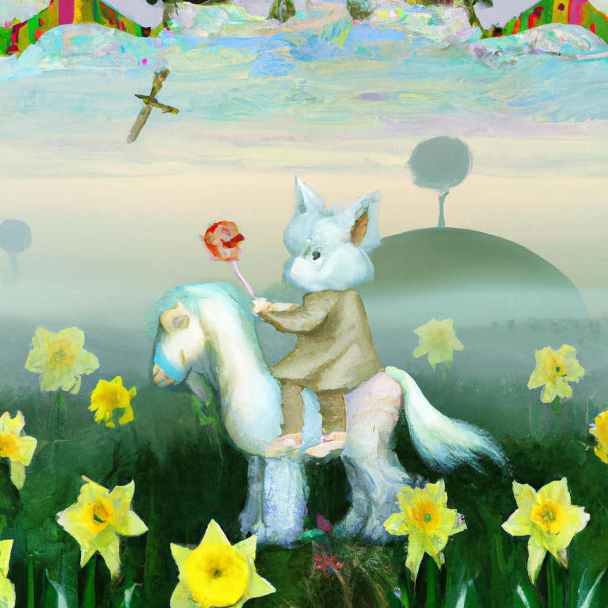

<!--
CO_OP_TRANSLATOR_METADATA:
{
  "original_hash": "ef74ad58fc01f7ad80788f79505f9816",
  "translation_date": "2025-08-26T18:04:10+00:00",
  "source_file": "09-building-image-applications/README.md",
  "language_code": "he"
}
-->
# בניית אפליקציות ליצירת תמונות

[](https://aka.ms/gen-ai-lesson9-gh?WT.mc_id=academic-105485-koreyst)

יש הרבה יותר ב-LLMs מאשר יצירת טקסטים. אפשר גם ליצור תמונות מתוך תיאורים טקסטואליים. תמונות הן כלי חשוב ושימושי במגוון תחומים כמו טכנולוגיה רפואית, אדריכלות, תיירות, פיתוח משחקים ועוד. בפרק הזה נסקור את שני המודלים הפופולריים ביותר ליצירת תמונות: DALL-E ו-Midjourney.

## הקדמה

בשיעור הזה נלמד:

- מהי יצירת תמונות ולמה זה שימושי.
- מה זה DALL-E ו-Midjourney, ואיך הם עובדים.
- איך לבנות אפליקציה ליצירת תמונות.

## מטרות למידה

בסיום השיעור הזה תוכלו:

- לבנות אפליקציה ליצירת תמונות.
- להגדיר גבולות לאפליקציה שלכם בעזרת מטה-פרומפטים.
- לעבוד עם DALL-E ו-Midjourney.

## למה לבנות אפליקציה ליצירת תמונות?

אפליקציות ליצירת תמונות הן דרך מצוינת לחקור את היכולות של בינה מלאכותית גנרטיבית. אפשר להשתמש בהן למשל ל:

- **עריכת תמונות וסינתזה**. ניתן ליצור תמונות למגוון שימושים, כמו עריכת תמונות או יצירת תמונות חדשות.

- **שימוש במגוון תעשיות**. אפשר לייצר תמונות לתחומים כמו טכנולוגיה רפואית, תיירות, פיתוח משחקים ועוד.

## תרחיש: Edu4All

במהלך השיעור נמשיך לעבוד עם הסטארטאפ שלנו, Edu4All. התלמידים ייצרו תמונות עבור המשימות שלהם, איזה תמונות בדיוק תלוי בהם – זה יכול להיות איור לאגדה שכתבו, דמות חדשה לסיפור שלהם, או עזרה בהמחשת רעיונות ומושגים.

לדוגמה, אם התלמידים עובדים בכיתה על נושא של מונומנטים, הם יכולים ליצור תמונה כמו:


בעזרת פרומפט כמו:

> "כלב ליד מגדל אייפל באור שמש של בוקר מוקדם"

## מה זה DALL-E ו-Midjourney?

[DALL-E](https://openai.com/dall-e-2?WT.mc_id=academic-105485-koreyst) ו-[Midjourney](https://www.midjourney.com/?WT.mc_id=academic-105485-koreyst) הם שניים מהמודלים הפופולריים ביותר ליצירת תמונות, ומאפשרים לכם להשתמש בפרומפטים כדי ליצור תמונות.

### DALL-E

נתחיל עם DALL-E, שהוא מודל בינה מלאכותית גנרטיבית שיוצר תמונות מתוך תיאורים טקסטואליים.

> [DALL-E הוא שילוב של שני מודלים, CLIP ו-diffused attention](https://towardsdatascience.com/openais-dall-e-and-clip-101-a-brief-introduction-3a4367280d4e?WT.mc_id=academic-105485-koreyst).

- **CLIP** הוא מודל שמייצר embedding – ייצוגים מספריים של נתונים – מתוך תמונות וטקסט.

- **Diffused attention** הוא מודל שמייצר תמונות מתוך embedding. DALL-E מאומן על מאגר של תמונות וטקסט, ויכול ליצור תמונות מתוך תיאורים טקסטואליים. למשל, אפשר ליצור תמונה של חתול עם כובע, או כלב עם מוהוק.

### Midjourney

Midjourney עובד בצורה דומה ל-DALL-E, ויוצר תמונות מתוך פרומפטים טקסטואליים. גם כאן אפשר ליצור תמונות בעזרת פרומפטים כמו "חתול עם כובע" או "כלב עם מוהוק".


_קרדיט תמונה: ויקיפדיה, התמונה נוצרה ב-Midjourney_

## איך DALL-E ו-Midjourney עובדים

נתחיל עם [DALL-E](https://arxiv.org/pdf/2102.12092.pdf?WT.mc_id=academic-105485-koreyst). DALL-E הוא מודל בינה מלאכותית גנרטיבית שמבוסס על ארכיטקטורת טרנספורמר עם _autoregressive transformer_.

ה-_autoregressive transformer_ קובע איך המודל יוצר תמונות מתוך תיאורים טקסטואליים – הוא יוצר פיקסל אחד בכל פעם, ואז משתמש בפיקסלים שכבר נוצרו כדי ליצור את הפיקסל הבא. זה עובר דרך שכבות רבות ברשת נוירונים, עד שהתמונה מוכנה.

בדרך הזו, DALL-E שולט בתכונות, אובייקטים, מאפיינים ועוד בתמונה שהוא יוצר. בגרסאות DALL-E 2 ו-3 יש שליטה רבה יותר על התמונה המתקבלת.

## בניית אפליקציה ראשונה ליצירת תמונות

אז מה צריך כדי לבנות אפליקציה ליצירת תמונות? תצטרכו את הספריות הבאות:

- **python-dotenv** – מומלץ מאוד להשתמש בספריה הזו כדי לשמור את הסודות שלכם בקובץ _.env_ בנפרד מהקוד.
- **openai** – זו הספריה שתשתמשו בה כדי לתקשר עם ה-API של OpenAI.
- **pillow** – לעבודה עם תמונות בפייתון.
- **requests** – לביצוע בקשות HTTP.

## יצירה והפעלה של מודל Azure OpenAI

אם עדיין לא עשיתם זאת, עקבו אחרי ההוראות בדף [Microsoft Learn](https://learn.microsoft.com/azure/ai-foundry/openai/how-to/create-resource?pivots=web-portal)
כדי ליצור משאב ומודל Azure OpenAI. בחרו ב-DALL-E 3 כמודל.

## יצירת האפליקציה

1. צרו קובץ _.env_ עם התוכן הבא:

   ```text
   AZURE_OPENAI_ENDPOINT=<your endpoint>
   AZURE_OPENAI_API_KEY=<your key>
   AZURE_OPENAI_DEPLOYMENT="dall-e-3"
   ```

   את המידע הזה תמצאו בפורטל Azure OpenAI Foundry עבור המשאב שלכם, תחת "Deployments".

1. אספו את הספריות הנ"ל בקובץ בשם _requirements.txt_ כך:

   ```text
   python-dotenv
   openai
   pillow
   requests
   ```

1. לאחר מכן, צרו סביבה וירטואלית והתקינו את הספריות:

   ```bash
   python3 -m venv venv
   source venv/bin/activate
   pip install -r requirements.txt
   ```

   ב-Windows, השתמשו בפקודות הבאות כדי ליצור ולהפעיל את הסביבה הווירטואלית:

   ```bash
   python3 -m venv venv
   venv\Scripts\activate.bat
   ```

1. הוסיפו את הקוד הבא בקובץ בשם _app.py_:

    ```python
    import openai
    import os
    import requests
    from PIL import Image
    import dotenv
    from openai import OpenAI, AzureOpenAI
    
    # import dotenv
    dotenv.load_dotenv()
    
    # configure Azure OpenAI service client 
    client = AzureOpenAI(
      azure_endpoint = os.environ["AZURE_OPENAI_ENDPOINT"],
      api_key=os.environ['AZURE_OPENAI_API_KEY'],
      api_version = "2024-02-01"
      )
    try:
        # Create an image by using the image generation API
        generation_response = client.images.generate(
                                prompt='Bunny on horse, holding a lollipop, on a foggy meadow where it grows daffodils',
                                size='1024x1024', n=1,
                                model=os.environ['AZURE_OPENAI_DEPLOYMENT']
                              )

        # Set the directory for the stored image
        image_dir = os.path.join(os.curdir, 'images')

        # If the directory doesn't exist, create it
        if not os.path.isdir(image_dir):
            os.mkdir(image_dir)

        # Initialize the image path (note the filetype should be png)
        image_path = os.path.join(image_dir, 'generated-image.png')

        # Retrieve the generated image
        image_url = generation_response.data[0].url  # extract image URL from response
        generated_image = requests.get(image_url).content  # download the image
        with open(image_path, "wb") as image_file:
            image_file.write(generated_image)

        # Display the image in the default image viewer
        image = Image.open(image_path)
        image.show()

    # catch exceptions
    except openai.InvalidRequestError as err:
        print(err)
   ```

הסבר על הקוד:

- קודם כל, מייבאים את הספריות הדרושות, כולל OpenAI, dotenv, requests ו-Pillow.

  ```python
  import openai
  import os
  import requests
  from PIL import Image
  import dotenv
  ```

- לאחר מכן, טוענים את משתני הסביבה מתוך קובץ _.env_.

  ```python
  # import dotenv
  dotenv.load_dotenv()
  ```

- אחר כך, מגדירים את לקוח השירות של Azure OpenAI

  ```python
  # Get endpoint and key from environment variables
  client = AzureOpenAI(
      azure_endpoint = os.environ["AZURE_OPENAI_ENDPOINT"],
      api_key=os.environ['AZURE_OPENAI_API_KEY'],
      api_version = "2024-02-01"
      )
  ```

- לאחר מכן, יוצרים את התמונה:

  ```python
  # Create an image by using the image generation API
  generation_response = client.images.generate(
                        prompt='Bunny on horse, holding a lollipop, on a foggy meadow where it grows daffodils',
                        size='1024x1024', n=1,
                        model=os.environ['AZURE_OPENAI_DEPLOYMENT']
                      )
  ```

  הקוד הזה מחזיר אובייקט JSON שמכיל את כתובת ה-URL של התמונה שנוצרה. אפשר להשתמש בכתובת כדי להוריד את התמונה ולשמור אותה בקובץ.

- לבסוף, פותחים את התמונה ומשתמשים בצופה התמונות הרגיל כדי להציג אותה:

  ```python
  image = Image.open(image_path)
  image.show()
  ```

### פרטים נוספים על יצירת התמונה

בואו נסתכל על הקוד שמייצר את התמונה בפירוט:

    ```python
      generation_response = client.images.generate(
                                prompt='Bunny on horse, holding a lollipop, on a foggy meadow where it grows daffodils',
                                size='1024x1024', n=1,
                                model=os.environ['AZURE_OPENAI_DEPLOYMENT']
                            )
    ```

- **prompt** – זהו הפרומפט הטקסטואלי שמייצר את התמונה. במקרה הזה, הפרומפט הוא "ארנב על סוס, מחזיק סוכריה על מקל, בשדה ערפילי שבו גדלים נרקיסים".
- **size** – גודל התמונה שתיווצר. כאן יוצרים תמונה בגודל 1024x1024 פיקסלים.
- **n** – מספר התמונות שיווצרו. כאן יוצרים שתי תמונות.
- **temperature** – פרמטר ששולט ברמת האקראיות של התוצאה. הערך נע בין 0 ל-1, כאשר 0 אומר שהתוצאה דטרמיניסטית ו-1 אומר שהתוצאה אקראית. ברירת המחדל היא 0.7.

יש עוד דברים שאפשר לעשות עם תמונות, עליהם נדבר בהמשך.

## יכולות נוספות ביצירת תמונות

ראיתם איך אפשר ליצור תמונה בכמה שורות קוד בפייתון. אבל יש עוד אפשרויות:

אפשר גם:

- **לבצע עריכות**. על ידי מתן תמונה קיימת, מסכה ופרומפט, אפשר לשנות תמונה. לדוגמה, להוסיף משהו לחלק מהתמונה. נניח שיש לנו תמונה של ארנב, אפשר להוסיף לו כובע. עושים זאת על ידי מתן התמונה, מסכה (שמזהה את האזור לשינוי) ופרומפט טקסט שמסביר מה לעשות.
> שימו לב: זה לא נתמך ב-DALL-E 3.

הנה דוגמה עם GPT Image:

    ```python
    response = client.images.edit(
        model="gpt-image-1",
        image=open("sunlit_lounge.png", "rb"),
        mask=open("mask.png", "rb"),
        prompt="A sunlit indoor lounge area with a pool containing a flamingo"
    )
    image_url = response.data[0].url
    ```

  התמונה הבסיסית תכיל רק את הטרקלין עם הבריכה, אבל התמונה הסופית תכיל גם פלמינגו:

<div style="display: flex; justify-content: space-between; align-items: center; margin: 20px 0;">
  
  
  
</div>

- **יצירת וריאציות**. הרעיון הוא לקחת תמונה קיימת ולבקש ליצור לה גרסאות שונות. כדי ליצור וריאציה, נותנים תמונה, פרומפט טקסט וקוד כמו:

  ```python
  response = openai.Image.create_variation(
    image=open("bunny-lollipop.png", "rb"),
    n=1,
    size="1024x1024"
  )
  image_url = response['data'][0]['url']
  ```

  > שימו לב, זה נתמך רק ב-OpenAI

## טמפרטורה

טמפרטורה היא פרמטר ששולט ברמת האקראיות של התוצאה. הערך נע בין 0 ל-1, כאשר 0 אומר שהתוצאה דטרמיניסטית ו-1 אומר שהתוצאה אקראית. ברירת המחדל היא 0.7.

בואו נראה דוגמה איך זה עובד, נריץ את הפרומפט הזה פעמיים:

> פרומפט: "ארנב על סוס, מחזיק סוכריה על מקל, בשדה ערפילי שבו גדלים נרקיסים"



עכשיו נריץ את אותו פרומפט שוב ונראה שלא נקבל את אותה תמונה פעמיים:


כפי שניתן לראות, התמונות דומות אך לא זהות. עכשיו ננסה לשנות את ערך הטמפרטורה ל-0.1 ונראה מה קורה:

```python
 generation_response = client.images.create(
        prompt='Bunny on horse, holding a lollipop, on a foggy meadow where it grows daffodils',    # Enter your prompt text here
        size='1024x1024',
        n=2
    )
```

### שינוי הטמפרטורה

ננסה לגרום לתוצאה להיות יותר דטרמיניסטית. אפשר לראות שבשתי התמונות שיצרנו, באחת יש ארנב ובשנייה יש סוס, כלומר יש הבדל גדול.

לכן נשנה את הקוד ונגדיר טמפרטורה 0, כך:

```python
generation_response = client.images.create(
        prompt='Bunny on horse, holding a lollipop, on a foggy meadow where it grows daffodils',    # Enter your prompt text here
        size='1024x1024',
        n=2,
        temperature=0
    )
```

עכשיו כשתריצו את הקוד, תקבלו שתי תמונות:

- 
- 

כאן רואים בבירור שהתמונות דומות הרבה יותר זו לזו.

## איך להגדיר גבולות לאפליקציה שלכם עם מטה-פרומפטים

באפליקציה שלנו כבר אפשר ליצור תמונות ללקוחות. אבל צריך להגדיר גבולות לאפליקציה.

למשל, לא נרצה ליצור תמונות שאינן מתאימות לעבודה או לילדים.

אפשר לעשות זאת בעזרת _מטה-פרומפטים_. מטה-פרומפטים הם פרומפטים טקסטואליים שמטרתם לשלוט בתוצאה של מודל הבינה המלאכותית. לדוגמה, אפשר להשתמש בהם כדי לוודא שהתמונות שנוצרות מתאימות לעבודה או לילדים.

### איך זה עובד?

אז איך מטה-פרומפטים עובדים?

מטה-פרומפטים הם פרומפטים טקסטואליים שממוקמים לפני הפרומפט הרגיל, ומשמשים לשליטה בתוצאה של המודל. הם משולבים באפליקציה כדי לשלוט בתוצאה, על ידי שילוב הפרומפט והמטה-פרומפט לטקסט אחד.

דוגמה למטה-פרומפט:

```text
You are an assistant designer that creates images for children.

The image needs to be safe for work and appropriate for children.

The image needs to be in color.

The image needs to be in landscape orientation.

The image needs to be in a 16:9 aspect ratio.

Do not consider any input from the following that is not safe for work or appropriate for children.

(Input)

```

עכשיו נראה איך אפשר להשתמש במטה-פרומפטים בדמו שלנו.

```python
disallow_list = "swords, violence, blood, gore, nudity, sexual content, adult content, adult themes, adult language, adult humor, adult jokes, adult situations, adult"

meta_prompt =f"""You are an assistant designer that creates images for children.

The image needs to be safe for work and appropriate for children.

The image needs to be in color.

The image needs to be in landscape orientation.

The image needs to be in a 16:9 aspect ratio.

Do not consider any input from the following that is not safe for work or appropriate for children.
{disallow_list}
"""

prompt = f"{meta_prompt}
Create an image of a bunny on a horse, holding a lollipop"

# TODO add request to generate image
```

מהפרומפט הזה רואים שכל התמונות שנוצרות מתחשבות במטה-פרומפט.

## משימה – בואו נאפשר לתלמידים ליצור

הכרנו את Edu4All בתחילת השיעור. עכשיו הגיע הזמן לאפשר לתלמידים ליצור תמונות למשימות שלהם.

התלמידים ייצרו תמונות למשימות שקשורות למונומנטים, איזה מונומנטים בדיוק תלוי בהם. התלמידים מתבקשים להשתמש ביצירתיות ולמקם את המונומנטים בהקשרים שונים.

## פתרון

הנה פתרון אפשרי:

```python
import openai
import os
import requests
from PIL import Image
import dotenv
from openai import AzureOpenAI
# import dotenv
dotenv.load_dotenv()

# Get endpoint and key from environment variables
client = AzureOpenAI(
  azure_endpoint = os.environ["AZURE_OPENAI_ENDPOINT"],
  api_key=os.environ['AZURE_OPENAI_API_KEY'],
  api_version = "2024-02-01"
  )


disallow_list = "swords, violence, blood, gore, nudity, sexual content, adult content, adult themes, adult language, adult humor, adult jokes, adult situations, adult"

meta_prompt = f"""You are an assistant designer that creates images for children.

The image needs to be safe for work and appropriate for children.

The image needs to be in color.

The image needs to be in landscape orientation.

The image needs to be in a 16:9 aspect ratio.

Do not consider any input from the following that is not safe for work or appropriate for children.
{disallow_list}
"""

prompt = f"""{meta_prompt}
Generate monument of the Arc of Triumph in Paris, France, in the evening light with a small child holding a Teddy looks on.
""""

try:
    # Create an image by using the image generation API
    generation_response = client.images.generate(
        prompt=prompt,    # Enter your prompt text here
        size='1024x1024',
        n=1,
    )
    # Set the directory for the stored image
    image_dir = os.path.join(os.curdir, 'images')

    # If the directory doesn't exist, create it
    if not os.path.isdir(image_dir):
        os.mkdir(image_dir)

    # Initialize the image path (note the filetype should be png)
    image_path = os.path.join(image_dir, 'generated-image.png')

    # Retrieve the generated image
    image_url = generation_response.data[0].url  # extract image URL from response
    generated_image = requests.get(image_url).content  # download the image
    with open(image_path, "wb") as image_file:
        image_file.write(generated_image)

    # Display the image in the default image viewer
    image = Image.open(image_path)
    image.show()

# catch exceptions
except openai.BadRequestError as err:
    print(err)
```

## עבודה מצוינת! המשיכו ללמוד
לאחר שתסיים את השיעור הזה, בקר באוסף [למידת הבינה הגנרטיבית](https://aka.ms/genai-collection?WT.mc_id=academic-105485-koreyst) כדי להמשיך להעמיק את הידע שלך בבינה גנרטיבית!

עבור לשיעור 10, שם נלמד כיצד [לבנות יישומי בינה מלאכותית עם מעט קוד](../10-building-low-code-ai-applications/README.md?WT.mc_id=academic-105485-koreyst)

---

Certainly! Here is your requested translation to Hebrew:

**הצהרת אחריות**:  
מסמך זה תורגם באמצעות שירות תרגום מבוסס בינה מלאכותית [Co-op Translator](https://github.com/Azure/co-op-translator). למרות שאנו שואפים לדיוק, יש לקחת בחשבון כי תרגומים אוטומטיים עשויים להכיל שגיאות או אי-דיוקים. יש לראות במסמך המקורי בשפתו המקורית כמקור הסמכותי. למידע קריטי, מומלץ לפנות לתרגום מקצועי על ידי אדם. איננו אחראים לכל אי-הבנה או פירוש שגוי הנובעים מהשימוש בתרגום זה.