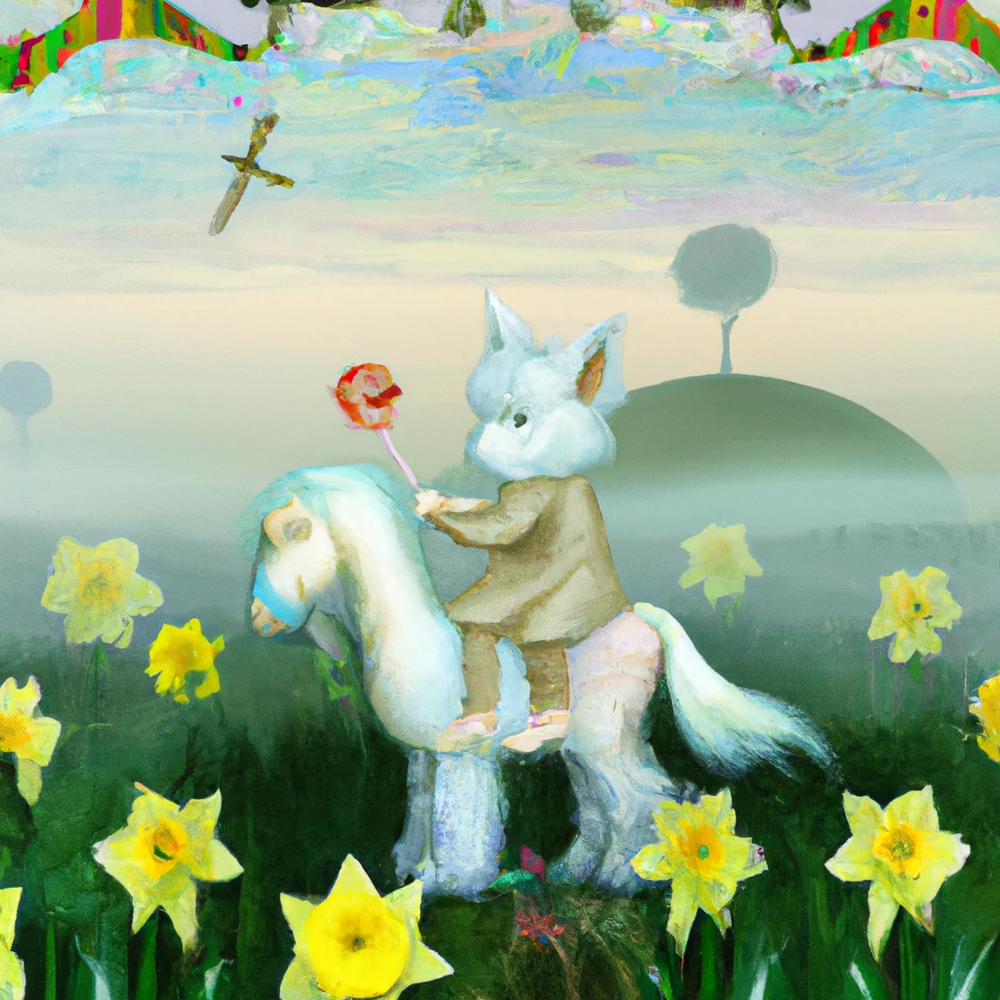

# בניית יישומי יצירת תמונות

[](https://youtu.be/B5VP0_J7cs8?si=5P3L5o7F_uS_QcG9)

יש ל-LLMs יותר מיצירת טקסט. ניתן גם ליצור תמונות מתיאורי טקסט. קיום תמונות כממדי יכול להיות שימושי מאוד במספר תחומים כמו מד-טק, ארכיטקטורה, תיירות, פיתוח משחקים ועוד. בפרק זה נסקור את שני הדגמים הפופולריים ביותר ליצירת תמונות, DALL-E ו-Midjourney.

## מבוא

בשיעור זה נכסה:

- יצירת תמונות ולמה זה מועיל.
- DALL-E ו-Midjourney, מה הם ואיך הם פועלים.
- איך לבנות אפליקציה ליצירת תמונות.

## יעדי למידה

עם סיום השיעור תוכל:

- לבנות אפליקציית יצירת תמונות.
- להגדיר גבולות לאפליקציה שלך עם מטה-פרומפטים.
- לעבוד עם DALL-E ו-Midjourney.

## למה לבנות אפליקציית יצירת תמונות?

אפליקציות ליצירת תמונות הן דרך נהדרת לחקור את יכולות הבינה המלאכותית הגנרטיבית. ניתן להשתמש בהן, למשל:

- **עריכת תמונות וסינתזה**. ניתן ליצור תמונות למגוון שימושים, כגון עריכת תמונות וסינתזה.

- **מיושמות בתעשיות שונות**. ניתן להשתמש בהן ליצירת תמונות למגוון תעשיות כמו מד-טק, תיירות, פיתוח משחקים ועוד.

## תרחיש: Edu4All

כחלק מהשיעור נמשיך לעבוד עם הסטארטאפ Edu4All. התלמידים ייצרו תמונות למבדקי ההערכה שלהם, אילו תמונות בדיוק - זו החלטה שלהם; הן יכולות להיות איורים לאגדה שכתבו, יצירת דמות חדשה לסיפור, או כדי לעזור להם להמחיש רעיונות ומושגים.

הנה מה שתלמידי Edu4All יכלו ליצור למשל כשעובדים בכיתה על אנדרטאות:


תוך שימוש בפרומפט כמו

> "כלב ליד מגדל אייפל באור השמש של הבוקר המוקדם"

## מה זה DALL-E ו-Midjourney?

[DALL-E](https://openai.com/dall-e-2?WT.mc_id=academic-105485-koreyst) ו-[Midjourney](https://www.midjourney.com/?WT.mc_id=academic-105485-koreyst) הם שניים מהדגמים הפופולריים ביותר ליצירת תמונות, הם מאפשרים שימוש בפרומפטים ליצירת תמונות.

### DALL-E

נתחיל עם DALL-E, שהוא דגם בינה מלאכותית גנרטיבית שיוצר תמונות מתיאורי טקסט.

> [DALL-E הוא צירוף של שני דגמים, CLIP ותשומת לב מפושטת](https://towardsdatascience.com/openais-dall-e-and-clip-101-a-brief-introduction-3a4367280d4e?WT.mc_id=academic-105485-koreyst).

- **CLIP**, הוא דגם שיוצר ייצוגים נומריים (אמבדינגים) של נתונים, מתמונות וטקסט.

- **תשומת לב מפושטת**, הוא דגם שיוצר תמונות מאמבדינגים. DALL-E מאומן על מאגר נתונים של תמונות וטקסט ויכול לשמש לייצור תמונות מתיאורי טקסט. למשל, DALL-E יכול לייצר תמונות של חתול עם כובע או כלב עם מוקאהוק.

### Midjourney

Midjourney פועל בדומה ל-DALL-E, הוא יוצר תמונות מפרומפטים טקסטואליים. ניתן להשתמש בו גם ליצירת תמונות בשימוש בפרומפטים כמו "חתול עם כובע" או "כלב עם מוקאהוק".


_זכויות תמונה ויקיפדיה, תמונה שנוצרה על ידי Midjourney_

## איך DALL-E ו-Midjourney פועלים

ראשית, [DALL-E](https://arxiv.org/pdf/2102.12092.pdf?WT.mc_id=academic-105485-koreyst). DALL-E הוא דגם בינה מלאכותית גנרטיבית מבוסס ארכיטקטורת טרנספורמר עם _טרנספורמר אוטורגסיבי_.

טרנספורמר אוטורגסיבי מגדיר איך דגם מייצר תמונות מתיאורי טקסט, הוא מייצר פיקסל אחד בכל פעם, ומשתמש בפיקסלים שנוצרו כדי ליצור את הבא. עובר דרך שכבות ברשת נוירונים עד שהתמונה השלמה נוצרת.

בתהליך זה, DALL-E שולט על התכונות, האובייקטים, המאפיינים ועוד בתמונה שהוא יוצר. עם זאת, ב-DALL-E 2 ו-3 יש שליטה טובה יותר על התמונה שנוצרת.

## בניית אפליקציית יצירת תמונות ראשונה שלך

אז מה דרוש לבניית אפליקציית יצירת תמונות? יש צורך בספריות הבאות:

- **python-dotenv**, מומלץ מאוד להשתמש בספריה זו כדי לשמור סודות בקובץ _.env_ מחוץ לקוד.
- **openai**, ספריה זו תאפשר לך לתקשר עם ממשק ה-API של OpenAI.
- **pillow**, לעבודה עם תמונות בפייתון.
- **requests**, לעזרה בביצוע בקשות HTTP.

## יצירת ופריסת מודל Azure OpenAI

אם לא עשית זאת כבר, עקוב אחר ההוראות בעמוד [Microsoft Learn](https://learn.microsoft.com/azure/ai-foundry/openai/how-to/create-resource?pivots=web-portal&WT.mc_id=academic-105485-koreyst)
כדי ליצור משאב ומודל Azure OpenAI. בחר ב-**gpt-image-1** כמודל (מודל יצירת תמונות Azure OpenAI הנוכחי; DALL-E 3 הוא וותיק וכבר אינו זמין לפריסות חדשות).

## צור את האפליקציה

1. צור קובץ _.env_ עם התוכן הבא:

   ```text
   AZURE_OPENAI_ENDPOINT=<your endpoint>
   AZURE_OPENAI_API_KEY=<your key>
   AZURE_OPENAI_DEPLOYMENT="gpt-image-1"
   ```

   אתר מידע זה בפורטל Azure OpenAI Foundry עבור המשאב שלך בחלק "Deployments".

1. אסוף את הספריות שלמעלה בקובץ בשם _requirements.txt_ כך:

   ```text
   python-dotenv
   openai
   pillow
   requests
   ```

1. לאחר מכן, צור סביבת עבודה ווירטואלית והתקן את הספריות:

   ```bash
   python3 -m venv venv
   source venv/bin/activate
   pip install -r requirements.txt
   ```

   עבור ווינדוס, השתמש בפקודות הבאות ליצירה והפעלת סביבת העבודה הווירטואלית:

   ```bash
   python3 -m venv venv
   venv\Scripts\activate.bat
   ```

1. הוסף את הקוד הבא בקובץ בשם _app.py_:

    ```python
    import openai
    import os
    import requests
    from PIL import Image
    import dotenv
    from openai import OpenAI, AzureOpenAI
    
    # ייבא dotenv
    dotenv.load_dotenv()
    
    # קבע תצורה של לקוח שירות Azure OpenAI
    client = AzureOpenAI(
      azure_endpoint = os.environ["AZURE_OPENAI_ENDPOINT"],
      api_key=os.environ['AZURE_OPENAI_API_KEY'],
      api_version = "2024-10-21"
      )
    try:
        # צור תמונה באמצעות ממשק ה-API ליצירת תמונות
        generation_response = client.images.generate(
                                prompt='Bunny on horse, holding a lollipop, on a foggy meadow where it grows daffodils',
                                size='1024x1024', n=1,
                                model=os.environ['AZURE_OPENAI_DEPLOYMENT']
                              )

        # הגדר את התיקייה לשמירת התמונה
        image_dir = os.path.join(os.curdir, 'images')

        # אם התיקייה לא קיימת, צור אותה
        if not os.path.isdir(image_dir):
            os.mkdir(image_dir)

        # אתחל את נתיב התמונה (שים לב שסוג הקובץ צריך להיות png)
        image_path = os.path.join(image_dir, 'generated-image.png')

        # שלוף את התמונה שנוצרה
        image_url = generation_response.data[0].url  # הפק כתובת URL של התמונה מהתגובה
        generated_image = requests.get(image_url).content  # הורד את התמונה
        with open(image_path, "wb") as image_file:
            image_file.write(generated_image)

        # הצג את התמונה במציג התמונות המוגדר כברירת מחדל
        image = Image.open(image_path)
        image.show()

    # תפוס חריגות
    except openai.BadRequestError as err:
        print(err)
   ```

בואו נסביר את הקוד הזה:

- ראשית, אנו מייבאים את הספריות הדרושות, כולל ספריית OpenAI, dotenv, requests ו-Pillow.

  ```python
  import openai
  import os
  import requests
  from PIL import Image
  import dotenv
  ```

- לאחר מכן, אנו טוענים את משתני הסביבה מקובץ _.env_.

  ```python
  # ייבוא dotenv
  dotenv.load_dotenv()
  ```

- לאחר מכן, אנחנו מגדירים את לקוח שירות Azure OpenAI 

  ```python
  # לקבל נקודת קצה ומפתח משתנות סביבה
  client = AzureOpenAI(
      azure_endpoint = os.environ["AZURE_OPENAI_ENDPOINT"],
      api_key=os.environ['AZURE_OPENAI_API_KEY'],
      api_version = "2024-10-21"
      )
  ```

- לאחר מכן, אנו מייצרים את התמונה:

  ```python
  # צור תמונה באמצעות ממשק תכנות היישומים (API) לייצור תמונות
  generation_response = client.images.generate(
                        prompt='Bunny on horse, holding a lollipop, on a foggy meadow where it grows daffodils',
                        size='1024x1024', n=1,
                        model=os.environ['AZURE_OPENAI_DEPLOYMENT']
                      )
  ```

  הקוד למעלה מממשק תגובה שמכיל את כתובת ה-URL של התמונה שנוצרה. ניתן להשתמש ב-URL כדי להוריד את התמונה ולשמור אותה לקובץ.

- לבסוף, אנחנו פותחים את התמונה ומשתמשים בצופה סטנדרטי להצגת התמונה:

  ```python
  image = Image.open(image_path)
  image.show()
  ```

### פרטים נוספים על יצירת התמונה

נבחן את הקוד שיוצר את התמונה ביתר פירוט:

   ```python
     generation_response = client.images.generate(
                               prompt='Bunny on horse, holding a lollipop, on a foggy meadow where it grows daffodils',
                               size='1024x1024', n=1,
                               model=os.environ['AZURE_OPENAI_DEPLOYMENT']
                           )
   ```

- **prompt**, הוא טקסט הפרומפט שמשמש ליצירת התמונה. במקרה זה, אנו משתמשים בפרומפט "ארנב על סוס, מחזיק סוכרייה, בערבה ערפלית עם נרקיסים".
- **size**, הוא גודל התמונה שנוצרה. במקרה זה, אנו יוצרים תמונה בגודל 1024x1024 פיקסלים.
- **n**, הוא מספר התמונות שנוצרות. במקרה זה, אנו יוצרים שתי תמונות.
- **temperature**, הוא פרמטר ששולט באקראיות הפלט של דגם בינה מלאכותית גנרטיבית. הטמפרטורה היא ערך בין 0 ל-1 כש-0 אומר פלט דטרמיניסטי ו-1 אומר פלט אקראי. ברירת המחדל היא 0.7.

יש עוד דברים שניתן לעשות עם תמונות שנכסה בסעיף הבא.

## יכולות נוספות ביצירת תמונות

עד כה ראית איך יכולנו ליצור תמונה בכמה שורות פייתון. עם זאת, יש עוד דברים שניתן לעשות עם תמונות.

ניתן גם לעשות את הדברים הבאים:

- **לבצע עריכות**. על ידי מתן תמונה קיימת, מסכה ופרומפט, ניתן לשנות תמונה. למשל, ניתן להוסיף משהו לחלק מהתמונה. דמיין את תמונת הארנב שלנו, אפשר להוסיף לו כובע. איך עושים זאת? מספקים את התמונה, מסכה (שמציינת את האזור לשינוי) ופרומפט טקסט שיגיד מה לעשות.
> שים לב: זה לא נתמך ב-DALL-E 3.
 
הנה דוגמה עם GPT Image:

   ```python
   response = client.images.edit(
       model="gpt-image-1",
       image=open("sunlit_lounge.png", "rb"),
       mask=open("mask.png", "rb"),
       prompt="A sunlit indoor lounge area with a pool containing a flamingo"
   )
   image_url = response.data[0].url
   ```

  התמונה הבסיסית תכיל רק את הלונג' עם הבריכה, אבל התמונה הסופית תכיל פלמינגו:

<div style="display: flex; justify-content: space-between; align-items: center; margin: 20px 0;">
  
  
  
</div>


- **ליצור וריאציות**. הרעיון הוא שלוקחים תמונה קיימת ומבקשים ליצור וריאציות שלה. ליצירת וריאציה, מספקים תמונה ופרומפט עם הקוד הבא:

  ```python
  response = client.images.create_variation(
    image=open("bunny-lollipop.png", "rb"),
    n=1,
    size="1024x1024"
  )
  image_url = response.data[0].url
  ```

  > שים לב, זה נתמך רק בדגם DALL-E 2 של OpenAI, לא ב-gpt-image-1

## טמפרטורה

טמפרטורה היא פרמטר ששולט באקראיות הפלט בדגם בינה מלאכותית גנרטיבית. הטמפרטורה היא ערך בין 0 ל-1, שבה 0 אומר פלט דטרמיניסטי ו-1 אומר פלט אקראי. ברירת המחדל היא 0.7.

נראה דוגמה כיצד הטמפרטורה פועלת על ידי הרצת הפרומפט פעמיים:

> פרומפט: "ארנב על סוס, מחזיק סוכרייה, בערבה ערפלית עם נרקיסים"



כעת נריץ את אותו הפרומפט שוב רק כדי לראות שלא נקבל את אותה תמונה פעמיים:


כפי שאתה רואה, התמונות דומות אך אינן זהות. ננסה לשנות את ערך הטמפרטורה ל-0.1 ונראה מה קורה:

```python
 generation_response = client.images.generate(
        prompt='Bunny on horse, holding a lollipop, on a foggy meadow where it grows daffodils',    # הזן כאן את טקסט ההנחיה שלך
        size='1024x1024',
        n=2
    )
```

### שינוי הטמפרטורה

ננסה להפוך את התגובה ליותר דטרמיניסטית. כמו שראינו מהתמונות שיצרנו, בתמונה הראשונה יש ארנב ובשנייה סוס, אז התמונות שונות מאוד.

לכן נשנה את הקוד ונגדיר את הטמפרטורה ל-0, כך:

```python
generation_response = client.images.generate(
        prompt='Bunny on horse, holding a lollipop, on a foggy meadow where it grows daffodils',    # הזן את טקסט הפקודה שלך כאן
        size='1024x1024',
        n=2,
        temperature=0
    )
```

כשתריץ את הקוד תקבל את שתי התמונות האלה:

- 
- 

כאן ניתן לראות בבירור שהתמונות דומות יותר זו לזו.

## איך להגדיר גבולות לאפליקציה שלך עם מטה-פרומפטים

עם הדמו שלנו, אנו כבר יכולים ליצור תמונות עבור הלקוחות שלנו. עם זאת, צריך להגדיר גבולות לאפליקציה שלנו.

לדוגמה, איננו רוצים ליצור תמונות שאינן בטוחות לעבודה, או שאינן מתאימות לילדים.

אפשר לעשות זאת עם _מטה-פרומפטים_. מטה-פרומפטים הם פרומפטים טקסטואליים שמשמשים לשליטה בפלט ממודל בינה מלאכותית גנרטיבית. למשל, אפשר להשתמש במטה-פרומפטים כדי לוודא שהתמונות שנוצרות בטוחות לעבודה ומתאימות לילדים.

### איך זה עובד?

עכשיו, איך מטה-פרומפטים פועלים?

מטה-פרומפטים הם פרומפטים טקסטואליים שממוקמים לפני הפרומפט הראשי, ומשמשים לשליטה בפלט המודל ונמצאים משולבים באפליקציות כדי לשלוט על הפלט. הם מתווספים ביחד לפרומפט טקסט יחיד.

דוגמה למטה-פרומפט תהיה:

```text
You are an assistant designer that creates images for children.

The image needs to be safe for work and appropriate for children.

The image needs to be in color.

The image needs to be in landscape orientation.

The image needs to be in a 16:9 aspect ratio.

Do not consider any input from the following that is not safe for work or appropriate for children.

(Input)

```

כעת נראה איך אפשר להשתמש במטה-פרומפטים בדמו שלנו.

```python
disallow_list = "swords, violence, blood, gore, nudity, sexual content, adult content, adult themes, adult language, adult humor, adult jokes, adult situations, adult"

meta_prompt =f"""You are an assistant designer that creates images for children.

The image needs to be safe for work and appropriate for children.

The image needs to be in color.

The image needs to be in landscape orientation.

The image needs to be in a 16:9 aspect ratio.

Do not consider any input from the following that is not safe for work or appropriate for children.
{disallow_list}
"""

prompt = f"{meta_prompt}
Create an image of a bunny on a horse, holding a lollipop"

# TODO להוסיף בקשה ליצירת תמונה
```

מהפרומפט שלמעלה ניתן לראות שכל התמונות שנוצרו מתחשבות במטה-פרומפט.

## משימה - ניתן לתלמידים אפשרות

הצגנו את Edu4All בתחילת השיעור. עכשיו הגיע הזמן לאפשר לתלמידים ליצור תמונות ליישומי ההערכה שלהם.


התלמידים ייצרו תמונות עבור ההערכות שלהם המכילות אנדרטאות, אילו אנדרטאות בדיוק זה תלוי בתלמידים. התלמידים מתבקשים להשתמש ביצירתיות שלהם במשימה זו כדי למקם את האנדרטאות בהקשרים שונים.

## פתרון

הנה פתרון אפשרי אחד:

```python
import openai
import os
import requests
from PIL import Image
import dotenv
from openai import AzureOpenAI
# ייבא dotenv
dotenv.load_dotenv()

# קבל נקודת קצה ומפתח ממשתני הסביבה
client = AzureOpenAI(
  azure_endpoint = os.environ["AZURE_OPENAI_ENDPOINT"],
  api_key=os.environ['AZURE_OPENAI_API_KEY'],
  api_version = "2024-10-21"
  )


disallow_list = "swords, violence, blood, gore, nudity, sexual content, adult content, adult themes, adult language, adult humor, adult jokes, adult situations, adult"

meta_prompt = f"""You are an assistant designer that creates images for children.

The image needs to be safe for work and appropriate for children.

The image needs to be in color.

The image needs to be in landscape orientation.

The image needs to be in a 16:9 aspect ratio.

Do not consider any input from the following that is not safe for work or appropriate for children.
{disallow_list}
"""

prompt = f"""{meta_prompt}
Generate monument of the Arc of Triumph in Paris, France, in the evening light with a small child holding a Teddy looks on.
"""

try:
    # צור תמונה באמצעות ממשק API ליצירת תמונות
    generation_response = client.images.generate(
        prompt=prompt,    # הזן כאן את טקסט ההנחיה שלך
        size='1024x1024',
        n=1,
    )
    # הגדר את התיקייה לשמירת התמונה
    image_dir = os.path.join(os.curdir, 'images')

    # אם התיקייה לא קיימת, צור אותה
    if not os.path.isdir(image_dir):
        os.mkdir(image_dir)

    # אתחל את נתיב התמונה (שים לב שסוג הקובץ צריך להיות png)
    image_path = os.path.join(image_dir, 'generated-image.png')

    # שלוף את התמונה שנוצרה
    image_url = generation_response.data[0].url  # חלץ את כתובת ה-URL של התמונה מהתגובה
    generated_image = requests.get(image_url).content  # הורד את התמונה
    with open(image_path, "wb") as image_file:
        image_file.write(generated_image)

    # הצג את התמונה בתצוגת התמונות המוגדרת כברירת מחדל
    image = Image.open(image_path)
    image.show()

# תפוס חריגות
except openai.BadRequestError as err:
    print(err)
```

## עבודה מצוינת! המשך ללמוד

לאחר סיום השיעור, עיין ב[אוסף הלמידה של AI גנרטיבי](https://aka.ms/genai-collection?WT.mc_id=academic-105485-koreyst) שלנו כדי להמשיך לשדרג את הידע שלך ב-AI גנרטיבי!

עבור לשיעור 10 שבו נבחן כיצד [לבנות יישומי AI עם קוד נמוך](../10-building-low-code-ai-applications/README.md?WT.mc_id=academic-105485-koreyst)

---

<!-- CO-OP TRANSLATOR DISCLAIMER START -->
**כתב ויתור**:
מסמך זה תורגם באמצעות שירות תרגום אוטומטי [Co-op Translator](https://github.com/Azure/co-op-translator). למרות שאנו שואפים לדיוק, יש לקחת בחשבון שתרגומים אוטומטיים עלולים להכיל שגיאות או אי-דיוקים. יש להחשיב את המסמך המקורי בשפתו הטבעית כמקור הסמכות. למידע קריטי מומלץ להשתמש בתרגום מקצועי על ידי מתרגם אדם. אנו לא אחראים לכל אי-הבנה או פירוש שגוי הנובע מהשימוש בתרגום זה.
<!-- CO-OP TRANSLATOR DISCLAIMER END -->