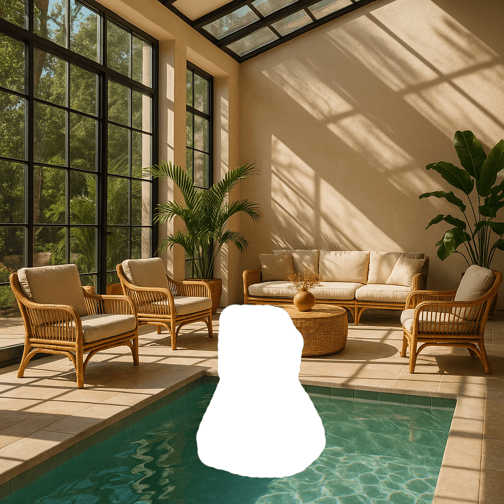

<!--
CO_OP_TRANSLATOR_METADATA:
{
  "original_hash": "063a2ac57d6b71bea0eaa880c68770d2",
  "translation_date": "2025-09-29T21:48:41+00:00",
  "source_file": "09-building-image-applications/README.md",
  "language_code": "he"
}
-->
# בניית יישומים ליצירת תמונות

[](https://aka.ms/gen-ai-lesson9-gh?WT.mc_id=academic-105485-koreyst)

יש יותר ב-LLMs מאשר יצירת טקסט. ניתן גם ליצור תמונות מתיאורי טקסט. שימוש בתמונות כמודל יכול להיות מועיל מאוד בתחומים רבים כמו טכנולוגיה רפואית, אדריכלות, תיירות, פיתוח משחקים ועוד. בפרק זה נבחן את שני המודלים הפופולריים ביותר ליצירת תמונות, DALL-E ו-Midjourney.

## הקדמה

בשיעור זה נעסוק ב:

- יצירת תמונות ולמה זה שימושי.
- DALL-E ו-Midjourney, מה הם ואיך הם עובדים.
- איך לבנות יישום ליצירת תמונות.

## מטרות למידה

לאחר השלמת השיעור, תוכלו:

- לבנות יישום ליצירת תמונות.
- להגדיר גבולות ליישום שלכם באמצעות מטה-פרומפטים.
- לעבוד עם DALL-E ו-Midjourney.

## למה לבנות יישום ליצירת תמונות?

יישומים ליצירת תמונות הם דרך מצוינת לחקור את היכולות של בינה מלאכותית יוצרת. ניתן להשתמש בהם, לדוגמה:

- **עריכת תמונות וסינתזה**. ניתן ליצור תמונות למגוון שימושים, כמו עריכת תמונות וסינתזה של תמונות.

- **יישום בתעשיות שונות**. ניתן גם להשתמש בהם ליצירת תמונות עבור תעשיות שונות כמו טכנולוגיה רפואית, תיירות, פיתוח משחקים ועוד.

## תרחיש: Edu4All

כחלק מהשיעור הזה, נמשיך לעבוד עם הסטארטאפ שלנו, Edu4All. התלמידים ייצרו תמונות עבור ההערכות שלהם, בדיוק אילו תמונות זה תלוי בתלמידים, אבל הם יכולים להיות איורים לאגדה שלהם, יצירת דמות חדשה לסיפור שלהם או לעזור להם לדמיין את הרעיונות והקונספטים שלהם.

הנה מה שהתלמידים של Edu4All יכולים ליצור לדוגמה אם הם עובדים בכיתה על מונומנטים:


באמצעות פרומפט כמו:

> "כלב ליד מגדל אייפל באור שמש מוקדם של הבוקר"

## מה זה DALL-E ו-Midjourney?

[DALL-E](https://openai.com/dall-e-2?WT.mc_id=academic-105485-koreyst) ו-[Midjourney](https://www.midjourney.com/?WT.mc_id=academic-105485-koreyst) הם שניים מהמודלים הפופולריים ביותר ליצירת תמונות, הם מאפשרים להשתמש בפרומפטים ליצירת תמונות.

### DALL-E

נתחיל עם DALL-E, שהוא מודל בינה מלאכותית יוצרת שמייצר תמונות מתיאורי טקסט.

> [DALL-E הוא שילוב של שני מודלים, CLIP ו-diffused attention](https://towardsdatascience.com/openais-dall-e-and-clip-101-a-brief-introduction-3a4367280d4e?WT.mc_id=academic-105485-koreyst).

- **CLIP**, הוא מודל שמייצר אמבדינגים, שהם ייצוגים מספריים של נתונים, מתמונות וטקסט.

- **Diffused attention**, הוא מודל שמייצר תמונות מאמבדינגים. DALL-E מאומן על מאגר נתונים של תמונות וטקסט וניתן להשתמש בו ליצירת תמונות מתיאורי טקסט. לדוגמה, ניתן להשתמש ב-DALL-E ליצירת תמונות של חתול עם כובע, או כלב עם מוהוק.

### Midjourney

Midjourney עובד בצורה דומה ל-DALL-E, הוא מייצר תמונות מפרומפטים טקסטואליים. Midjourney יכול גם לשמש ליצירת תמונות באמצעות פרומפטים כמו "חתול עם כובע", או "כלב עם מוהוק".


_קרדיט תמונה: ויקיפדיה, תמונה שנוצרה על ידי Midjourney_

## איך DALL-E ו-Midjourney עובדים

ראשית, [DALL-E](https://arxiv.org/pdf/2102.12092.pdf?WT.mc_id=academic-105485-koreyst). DALL-E הוא מודל בינה מלאכותית יוצרת המבוסס על ארכיטקטורת טרנספורמר עם _טרנספורמר אוטורגרסיבי_.

_טרנספורמר אוטורגרסיבי_ מגדיר כיצד מודל מייצר תמונות מתיאורי טקסט, הוא מייצר פיקסל אחד בכל פעם, ואז משתמש בפיקסלים שנוצרו כדי לייצר את הפיקסל הבא. התהליך עובר דרך שכבות רבות ברשת נוירונים, עד שהתמונה מושלמת.

עם תהליך זה, DALL-E שולט בתכונות, אובייקטים, מאפיינים ועוד בתמונה שהוא מייצר. עם זאת, ל-DALL-E 2 ו-3 יש יותר שליטה על התמונה המיוצרת.

## בניית יישום ראשון ליצירת תמונות

אז מה נדרש כדי לבנות יישום ליצירת תמונות? תצטרכו את הספריות הבאות:

- **python-dotenv**, מומלץ מאוד להשתמש בספרייה זו כדי לשמור את הסודות שלכם בקובץ _.env_ הרחק מהקוד.
- **openai**, זו הספרייה שתשתמשו בה כדי לתקשר עם ה-API של OpenAI.
- **pillow**, לעבודה עם תמונות ב-Python.
- **requests**, כדי לעזור לכם לבצע בקשות HTTP.

## יצירת מודל Azure OpenAI והפצתו

אם עדיין לא עשיתם זאת, עקבו אחר ההוראות בדף [Microsoft Learn](https://learn.microsoft.com/azure/ai-foundry/openai/how-to/create-resource?pivots=web-portal)  
כדי ליצור משאב ומודל Azure OpenAI. בחרו ב-DALL-E 3 כמודל.

## יצירת היישום

1. צרו קובץ _.env_ עם התוכן הבא:

   ```text
   AZURE_OPENAI_ENDPOINT=<your endpoint>
   AZURE_OPENAI_API_KEY=<your key>
   AZURE_OPENAI_DEPLOYMENT="dall-e-3"
   ```

   מצאו את המידע הזה בפורטל Azure OpenAI Foundry עבור המשאב שלכם תחת סעיף "Deployments".

1. אספו את הספריות הנ"ל בקובץ בשם _requirements.txt_ כך:

   ```text
   python-dotenv
   openai
   pillow
   requests
   ```

1. לאחר מכן, צרו סביבה וירטואלית והתקינו את הספריות:

   ```bash
   python3 -m venv venv
   source venv/bin/activate
   pip install -r requirements.txt
   ```

   עבור Windows, השתמשו בפקודות הבאות כדי ליצור ולהפעיל את הסביבה הווירטואלית:

   ```bash
   python3 -m venv venv
   venv\Scripts\activate.bat
   ```

1. הוסיפו את הקוד הבא בקובץ בשם _app.py_:

    ```python
    import openai
    import os
    import requests
    from PIL import Image
    import dotenv
    from openai import OpenAI, AzureOpenAI
    
    # import dotenv
    dotenv.load_dotenv()
    
    # configure Azure OpenAI service client 
    client = AzureOpenAI(
      azure_endpoint = os.environ["AZURE_OPENAI_ENDPOINT"],
      api_key=os.environ['AZURE_OPENAI_API_KEY'],
      api_version = "2024-02-01"
      )
    try:
        # Create an image by using the image generation API
        generation_response = client.images.generate(
                                prompt='Bunny on horse, holding a lollipop, on a foggy meadow where it grows daffodils',
                                size='1024x1024', n=1,
                                model=os.environ['AZURE_OPENAI_DEPLOYMENT']
                              )

        # Set the directory for the stored image
        image_dir = os.path.join(os.curdir, 'images')

        # If the directory doesn't exist, create it
        if not os.path.isdir(image_dir):
            os.mkdir(image_dir)

        # Initialize the image path (note the filetype should be png)
        image_path = os.path.join(image_dir, 'generated-image.png')

        # Retrieve the generated image
        image_url = generation_response.data[0].url  # extract image URL from response
        generated_image = requests.get(image_url).content  # download the image
        with open(image_path, "wb") as image_file:
            image_file.write(generated_image)

        # Display the image in the default image viewer
        image = Image.open(image_path)
        image.show()

    # catch exceptions
    except openai.InvalidRequestError as err:
        print(err)
   ```

הסבר על הקוד:

- ראשית, אנו מייבאים את הספריות הדרושות, כולל ספריית OpenAI, ספריית dotenv, ספריית requests וספריית Pillow.

  ```python
  import openai
  import os
  import requests
  from PIL import Image
  import dotenv
  ```

- לאחר מכן, אנו טוענים את משתני הסביבה מקובץ _.env_.

  ```python
  # import dotenv
  dotenv.load_dotenv()
  ```

- לאחר מכן, אנו מגדירים את לקוח שירות Azure OpenAI.

  ```python
  # Get endpoint and key from environment variables
  client = AzureOpenAI(
      azure_endpoint = os.environ["AZURE_OPENAI_ENDPOINT"],
      api_key=os.environ['AZURE_OPENAI_API_KEY'],
      api_version = "2024-02-01"
      )
  ```

- לאחר מכן, אנו מייצרים את התמונה:

  ```python
  # Create an image by using the image generation API
  generation_response = client.images.generate(
                        prompt='Bunny on horse, holding a lollipop, on a foggy meadow where it grows daffodils',
                        size='1024x1024', n=1,
                        model=os.environ['AZURE_OPENAI_DEPLOYMENT']
                      )
  ```

  הקוד הנ"ל מגיב עם אובייקט JSON שמכיל את כתובת ה-URL של התמונה שנוצרה. ניתן להשתמש בכתובת ה-URL כדי להוריד את התמונה ולשמור אותה בקובץ.

- לבסוף, אנו פותחים את התמונה ומשתמשים בצופה התמונות הסטנדרטי כדי להציג אותה:

  ```python
  image = Image.open(image_path)
  image.show()
  ```

### פרטים נוספים על יצירת התמונה

בואו נבחן את הקוד שמייצר את התמונה בפירוט:

   ```python
     generation_response = client.images.generate(
                               prompt='Bunny on horse, holding a lollipop, on a foggy meadow where it grows daffodils',
                               size='1024x1024', n=1,
                               model=os.environ['AZURE_OPENAI_DEPLOYMENT']
                           )
   ```

- **prompt**, הוא פרומפט הטקסט שמשמש ליצירת התמונה. במקרה זה, אנו משתמשים בפרומפט "ארנב על סוס, מחזיק סוכרייה על מקל, בשדה ערפילי שבו צומחים נרקיסים".
- **size**, הוא גודל התמונה שנוצרת. במקרה זה, אנו מייצרים תמונה בגודל 1024x1024 פיקסלים.
- **n**, הוא מספר התמונות שנוצרות. במקרה זה, אנו מייצרים שתי תמונות.
- **temperature**, הוא פרמטר ששולט באקראיות של הפלט של מודל בינה מלאכותית יוצרת. הטמפרטורה היא ערך בין 0 ל-1 כאשר 0 אומר שהפלט דטרמיניסטי ו-1 אומר שהפלט אקראי. הערך ברירת המחדל הוא 0.7.

יש עוד דברים שניתן לעשות עם תמונות שנכסה בסעיף הבא.

## יכולות נוספות של יצירת תמונות

ראיתם עד כה איך הצלחנו ליצור תמונה באמצעות כמה שורות קוד ב-Python. עם זאת, יש עוד דברים שניתן לעשות עם תמונות.

ניתן גם לבצע את הפעולות הבאות:

- **ביצוע עריכות**. על ידי מתן תמונה קיימת, מסכה ופרומפט, ניתן לשנות תמונה. לדוגמה, ניתן להוסיף משהו לחלק מסוים בתמונה. דמיינו את תמונת הארנב שלנו, ניתן להוסיף כובע לארנב. איך עושים זאת? על ידי מתן התמונה, מסכה (שמציינת את האזור לשינוי) ופרומפט טקסט שאומר מה צריך להיעשות.  
> הערה: זה לא נתמך ב-DALL-E 3.

הנה דוגמה באמצעות GPT Image:

   ```python
   response = client.images.edit(
       model="gpt-image-1",
       image=open("sunlit_lounge.png", "rb"),
       mask=open("mask.png", "rb"),
       prompt="A sunlit indoor lounge area with a pool containing a flamingo"
   )
   image_url = response.data[0].url
   ```

  התמונה הבסיסית תכיל רק את הטרקלין עם הבריכה, אבל התמונה הסופית תכיל פלמינגו:

<div style="display: flex; justify-content: space-between; align-items: center; margin: 20px 0;">
  
  
  
</div>

- **יצירת וריאציות**. הרעיון הוא לקחת תמונה קיימת ולבקש ליצור וריאציות שלה. כדי ליצור וריאציה, מספקים תמונה ופרומפט טקסט וקוד כמו כך:

  ```python
  response = openai.Image.create_variation(
    image=open("bunny-lollipop.png", "rb"),
    n=1,
    size="1024x1024"
  )
  image_url = response['data'][0]['url']
  ```

  > הערה, זה נתמך רק ב-OpenAI.

## טמפרטורה

טמפרטורה היא פרמטר ששולט באקראיות של הפלט של מודל בינה מלאכותית יוצרת. הטמפרטורה היא ערך בין 0 ל-1 כאשר 0 אומר שהפלט דטרמיניסטי ו-1 אומר שהפלט אקראי. הערך ברירת המחדל הוא 0.7.

בואו נבחן דוגמה איך הטמפרטורה עובדת, על ידי הרצת הפרומפט הזה פעמיים:

> פרומפט: "ארנב על סוס, מחזיק סוכרייה על מקל, בשדה ערפילי שבו צומחים נרקיסים"


עכשיו נריץ את אותו פרומפט שוב כדי לראות שלא נקבל את אותה תמונה פעמיים:


כפי שאתם רואים, התמונות דומות, אבל לא זהות. בואו ננסה לשנות את ערך הטמפרטורה ל-0.1 ונראה מה קורה:

```python
 generation_response = client.images.create(
        prompt='Bunny on horse, holding a lollipop, on a foggy meadow where it grows daffodils',    # Enter your prompt text here
        size='1024x1024',
        n=2
    )
```

### שינוי הטמפרטורה

אז בואו ננסה להפוך את התגובה ליותר דטרמיניסטית. יכולנו להבחין משתי התמונות שיצרנו שבתמונה הראשונה יש ארנב ובתמונה השנייה יש סוס, כך שהתמונות משתנות מאוד.

לכן נשנה את הקוד שלנו ונגדיר את הטמפרטורה ל-0, כך:

```python
generation_response = client.images.create(
        prompt='Bunny on horse, holding a lollipop, on a foggy meadow where it grows daffodils',    # Enter your prompt text here
        size='1024x1024',
        n=2,
        temperature=0
    )
```

עכשיו כשמריצים את הקוד הזה, מקבלים את שתי התמונות הבאות:

- 
- 

כאן ניתן לראות בבירור איך התמונות דומות יותר זו לזו.

## איך להגדיר גבולות ליישום שלכם עם מטה-פרומפטים

עם הדמו שלנו, אנחנו כבר יכולים ליצור תמונות עבור הלקוחות שלנו. עם זאת, אנחנו צריכים ליצור כמה גבולות ליישום שלנו.

לדוגמה, אנחנו לא רוצים ליצור תמונות שאינן מתאימות לעבודה, או שאינן מתאימות לילדים.

ניתן לעשות זאת עם _מטה-פרומפטים_. מטה-פרומפטים הם פרומפטים טקסטואליים שמשמשים לשליטה בפלט של מודל בינה מלאכותית יוצרת. לדוגמה, ניתן להשתמש במטה-פרומפטים כדי לשלוט בפלט, ולהבטיח שהתמונות שנוצרות מתאימות לעבודה, או מתאימות לילדים.

### איך זה עובד?

אז איך מטה-פרומפטים עובדים?

מטה-פרומפטים הם פרומפטים טקסטואליים שמשמשים לשליטה בפלט של מודל בינה מלאכותית יוצרת, הם ממוקמים לפני פרומפט הטקסט, ומשמשים לשליטה בפלט של המודל ומשולבים ביישומים כדי לשלוט בפלט של המודל. הם מקיפים את קלט הפרומפט ואת קלט המטה-פרומפט בפרומפט טקסטואלי אחד.

דוגמה אחת למטה-פרומפט תהיה הבאה:

```text
You are an assistant designer that creates images for children.

The image needs to be safe for work and appropriate for children.

The image needs to be in color.

The image needs to be in landscape orientation.

The image needs to be in a 16:9 aspect ratio.

Do not consider any input from the following that is not safe for work or appropriate for children.

(Input)

```

עכשיו, בואו נראה איך ניתן להשתמש במטה-פרומפטים בדמו שלנו.

```python
disallow_list = "swords, violence, blood, gore, nudity, sexual content, adult content, adult themes, adult language, adult humor, adult jokes, adult situations, adult"

meta_prompt =f"""You are an assistant designer that creates images for children.

The image needs to be safe for work and appropriate for children.

The image needs to be in color.

The image needs to be in landscape orientation.

The image needs to be in a 16:9 aspect ratio.

Do not consider any input from the following that is not safe for work or appropriate for children.
{disallow_list}
"""

prompt = f"{meta_prompt}
Create an image of a bunny on a horse, holding a lollipop"

# TODO add request to generate image
```

מהפרומפט הנ"ל, ניתן לראות איך כל התמונות שנוצרות מתחשבות במטה-פרומפט.

## משימה - בואו נאפשר לתלמידים

הצגנו את Edu4All בתחילת השיעור הזה. עכשיו הגיע הזמן לאפשר לתלמידים ליצור תמונות עבור ההערכות שלהם.

התלמידים ייצרו תמונות עבור ההערכות שלהם המכילות מונומנטים, בדיוק אילו מונומנטים זה תלוי בתלמידים. התלמידים מתבקשים להשתמש ביצירתיות שלהם במשימה זו כדי למקם את המונומנטים בהקשרים שונים.

## פתרון

הנה פתרון אפשרי:
```python
import openai
import os
import requests
from PIL import Image
import dotenv
from openai import AzureOpenAI
# import dotenv
dotenv.load_dotenv()

# Get endpoint and key from environment variables
client = AzureOpenAI(
  azure_endpoint = os.environ["AZURE_OPENAI_ENDPOINT"],
  api_key=os.environ['AZURE_OPENAI_API_KEY'],
  api_version = "2024-02-01"
  )


disallow_list = "swords, violence, blood, gore, nudity, sexual content, adult content, adult themes, adult language, adult humor, adult jokes, adult situations, adult"

meta_prompt = f"""You are an assistant designer that creates images for children.

The image needs to be safe for work and appropriate for children.

The image needs to be in color.

The image needs to be in landscape orientation.

The image needs to be in a 16:9 aspect ratio.

Do not consider any input from the following that is not safe for work or appropriate for children.
{disallow_list}
"""

prompt = f"""{meta_prompt}
Generate monument of the Arc of Triumph in Paris, France, in the evening light with a small child holding a Teddy looks on.
""""

try:
    # Create an image by using the image generation API
    generation_response = client.images.generate(
        prompt=prompt,    # Enter your prompt text here
        size='1024x1024',
        n=1,
    )
    # Set the directory for the stored image
    image_dir = os.path.join(os.curdir, 'images')

    # If the directory doesn't exist, create it
    if not os.path.isdir(image_dir):
        os.mkdir(image_dir)

    # Initialize the image path (note the filetype should be png)
    image_path = os.path.join(image_dir, 'generated-image.png')

    # Retrieve the generated image
    image_url = generation_response.data[0].url  # extract image URL from response
    generated_image = requests.get(image_url).content  # download the image
    with open(image_path, "wb") as image_file:
        image_file.write(generated_image)

    # Display the image in the default image viewer
    image = Image.open(image_path)
    image.show()

# catch exceptions
except openai.BadRequestError as err:
    print(err)
```

## עבודה נהדרת! המשיכו ללמוד

לאחר שסיימתם את השיעור הזה, בדקו את [אוסף הלמידה של AI גנרטיבי](https://aka.ms/genai-collection?WT.mc_id=academic-105485-koreyst) כדי להמשיך לשפר את הידע שלכם ב-AI גנרטיבי!

עברו לשיעור 10, שבו נבחן כיצד [לבנות יישומי AI עם קוד נמוך](../10-building-low-code-ai-applications/README.md?WT.mc_id=academic-105485-koreyst)

---

**כתב ויתור**:  
מסמך זה תורגם באמצעות שירות תרגום מבוסס בינה מלאכותית [Co-op Translator](https://github.com/Azure/co-op-translator). למרות שאנו שואפים לדיוק, יש לקחת בחשבון שתרגומים אוטומטיים עשויים להכיל שגיאות או אי דיוקים. המסמך המקורי בשפתו המקורית צריך להיחשב כמקור סמכותי. עבור מידע קריטי, מומלץ להשתמש בתרגום מקצועי על ידי אדם. איננו נושאים באחריות לאי הבנות או לפרשנויות שגויות הנובעות משימוש בתרגום זה.