# בניית יישומי בינה מלאכותית בקוד נמוך

[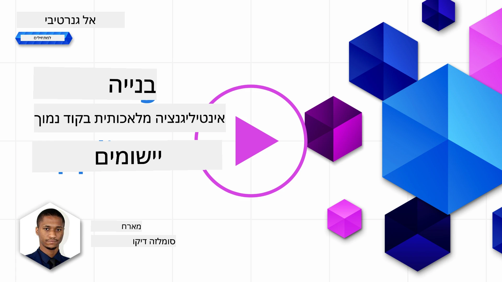](https://youtu.be/1vzq3Nd8GBA?si=h6LHWJXdmqf6mhDg)

> _(לחץ על התמונה למעלה לצפייה בסרטון השיעור)_

## מבוא

עכשיו שלמדנו איך לבנות יישומים ליצירת תמונות, נשוחח על קוד נמוך. בינה מלאכותית גנרטיבית יכולה לשמש בתחומים שונים כולל קוד נמוך, אך מה זה קוד נמוך ואיך ניתן להוסיף לו בינה מלאכותית?

בניית אפליקציות ופתרונות הפכה לקלה יותר עבור מפתחים מסורתיים ולא-מפתחים באמצעות פלטפורמות פיתוח בקוד נמוך. פלטפורמות אלה מאפשרות לך לבנות אפליקציות ופתרונות עם מעט מאוד קוד או ללא קוד כלל. זה מושג באמצעות מתן סביבת פיתוח ויזואלית שמאפשרת לגרור ולשחרר רכיבים כדי לבנות אפליקציות ופתרונות. זאת מאפשרת לבנות אפליקציות ופתרונות מהר יותר ובפחות משאבים. בשיעור זה נצלול לעומק כיצד להשתמש בקוד נמוך ואיך לשפר פיתוח בקוד נמוך באמצעות בינה מלאכותית בעזרת פלטפורמת Power.

פלטפורמת Power מספקת לארגונים הזדמנות להעצים את הצוותים שלהם לבנות פתרונות משלהם באמצעות סביבת קוד נמוך או ללא קוד אינטואיטיבית. סביבה זו מסייעת לפשט את תהליך בניית הפתרונות. עם פלטפורמת Power, ניתן לבנות פתרונות תוך ימים או שבועות במקום חודשים או שנים. הפלטפורמה כוללת חמישה מוצרים מרכזיים: Power Apps, Power Automate, Power BI, Power Pages ו-Copilot Studio.

שיעור זה מכסה:

- מבוא לבינה מלאכותית גנרטיבית בפלטפורמת Power
- מבוא ל-Copilot ואיך להשתמש בו
- שימוש בבינה מלאכותית גנרטיבית לבניית אפליקציות וזרימות בפלטפורמת Power
- הבנת דגמי בינה מלאכותית בפלטפורמת Power עם AI Builder
- בניית סוכנים אינטליגנטיים עם Microsoft Copilot Studio

## מטרות הלמידה

בסוף שיעור זה תוכל:

- להבין כיצד Copilot פועל בפלטפורמת Power.

- לבנות אפליקציית מעקב משימות סטודנטים לסטארט-אפ החינוכי שלנו.

- לבנות זרימת עיבוד חשבוניות שמשתמשת בבינה מלאכותית להפקת מידע מתוך חשבוניות.

- ליישם שיטות עבודה מומלצות בעת שימוש בדגם בינה מלאכותית Create Text with GPT.

- להבין מהו Microsoft Copilot Studio וכיצד לבנות סוכנים אינטליגנטיים בעזרתו.

הכלים והטכנולוגיות שתשתמש בהם בשיעור זה הם:

- **Power Apps**, לאפליקציית מעקב המשימות, המספקת סביבת פיתוח בקוד נמוך לבניית אפליקציות למעקב, ניהול ואינטראקציה עם נתונים.

- **Dataverse**, לאחסון הנתונים של אפליקציית מעקב המשימות, שבה Dataverse מספקת פלטפורמת נתונים בקוד נמוך לאחסון הנתונים של האפליקציה.

- **Power Automate**, לזרימת עיבוד החשבוניות שבה תהיה לך סביבת פיתוח בקוד נמוך לבניית זרימות עבודה לאוטומציה של תהליך עיבוד החשבוניות.

- **AI Builder**, לדגם הבינה המלאכותית לעיבוד החשבוניות שבו תשתמש בדגמי בינה מלאכותית מוכנים מראש כדי לעבד את החשבוניות לסטארט-אפ שלנו.

## בינה מלאכותית גנרטיבית בפלטפורמת Power

שיפור פיתוח בקוד נמוך ויישום עם בינה מלאכותית גנרטיבית הוא תחום מפתח בפלטפורמת Power. המטרה היא לאפשר לכולם לבנות אפליקציות, אתרים, לוחות בקרה המופעלים על ידי בינה מלאכותית ולבצע אוטומציה של תהליכים עם בינה מלאכותית, _ללא צורך במומחיות במדעי הנתונים_. מטרה זו מושגת על ידי שילוב בינה מלאכותית גנרטיבית בחוויית הפיתוח בקוד נמוך בפלטפורמת Power בצורת Copilot ו-AI Builder.

### איך זה עובד?

Copilot הוא עוזר בינה מלאכותית שמאפשר לך לבנות פתרונות בפלטפורמת Power על ידי תיאור הדרישות שלך בסדרת שלבים שיחה בשפה טבעית. לדוגמה, ניתן להנחות את העוזר לכתוב אילו שדות האפליקציה שלך תשתמש בהם והוא ייצור גם את האפליקציה וגם את דגם הנתונים התחתון או שתוכל להגדיר כיצד להגדיר זרימה ב-Power Automate.

ניתן להשתמש בפונקציות המונעות על ידי Copilot כתכונה במסכי האפליקציה שלך כדי לאפשר למשתמשים לגלות תובנות באמצעות אינטראקציות שיחתיות.

AI Builder הוא יכולת בינה מלאכותית בקוד נמוך זמינה בפלטפורמת Power המאפשרת לך להשתמש בדגמי בינה מלאכותית כדי לסייע באוטומציה של תהליכים וחיזוי תוצאות. עם AI Builder תוכל להביא בינה מלאכותית לאפליקציות וזרימות שמחוברות לנתונים ב-Dataverse או במקורות נתונים בענן שונים, כגון SharePoint, OneDrive או Azure.

Copilot זמין בכל מוצרי פלטפורמת Power: Power Apps, Power Automate, Power BI, Power Pages ו-Copilot Studio (לשעבר Power Virtual Agents). AI Builder זמין ב-Power Apps ו-Power Automate. בשיעור זה נתמקד כיצד להשתמש ב-Copilot ו-AI Builder ב-Power Apps ו-Power Automate לבניית פתרון לסטארט-אפ החינוכי שלנו.

### Copilot ב-Power Apps

כחלק מפלטפורמת Power, Power Apps מספקת סביבת פיתוח בקוד נמוך לבניית אפליקציות למעקב, ניהול ואינטראקציה עם נתונים. זוהי חבילת שירותי פיתוח אפליקציות עם פלטפורמת נתונים סקלאבילית ויכולת להתחבר לשירותים בענן ולנתונים מקומיים. Power Apps מאפשרת לבנות אפליקציות שרצות בדפדפנים, טאבלטים וטלפונים, וניתנות לשיתוף עם עמיתים לעבודה. Power Apps מקלה על המשתמשים להתחיל בפיתוח אפליקציות עם ממשק פשוט, כך שכל משתמש עסקי או מפתח מקצועי יכול לבנות אפליקציות מותאמות אישית. חוויית הפיתוח באפליקציה משתפרת גם באמצעות בינה מלאכותית גנרטיבית דרך Copilot.

תכונת עוזר הבינה מלאכותית Copilot ב-Power Apps מאפשרת לך לתאר איזה סוג אפליקציה אתה צריך ואילו מידע אתה רוצה שהאפליקציה תעקוב, תאסוף או תציג. Copilot מייצר אפליקציית Canvas תגובתית המבוססת על התיאור שלך. לאחר מכן תוכל להתאים את האפליקציה לצרכיך. עוזר הבינה מלאכותית Copilot גם מייצר ומציע טבלת Dataverse עם השדות שאתה צריך כדי לאחסן את הנתונים שברצונך לעקוב ונתוני דוגמה מסוימים. נבחן מהו Dataverse ואיך ניתן להשתמש בו ב-Power Apps בשיעור הזה מאוחר יותר. לאחר מכן תוכל להתאים את הטבלה לצרכיך באמצעות תכונת העוזר שיחה של Copilot. תכונה זו זמינה ישירות ממסך הבית של Power Apps.

### Copilot ב-Power Automate

כחלק מפלטפורמת Power, Power Automate מאפשר למשתמשים ליצור זרימות עבודה אוטומטיות בין יישומים ושירותים. היא עוזרת באוטומציה של תהליכים עסקיים חוזרים כגון תקשורת, איסוף נתונים ואישורי החלטות. הממשק הפשוט שלה מאפשר למשתמשים בכל רמת מיומנות טכנית (ממתחילים ועד מפתחים מנוסים) לאוטומט משימות עבודה. חוויית פיתוח זרימות העבודה משתפרת גם באמצעות בינה מלאכותית גנרטיבית דרך Copilot.

תכונת עוזר הבינה מלאכותית Copilot ב-Power Automate מאפשרת לך לתאר איזה סוג זרימה אתה צריך ואילו פעולות אתה רוצה שהזרימה תבצע. Copilot מייצר זרימה המבוססת על התיאור שלך. לאחר מכן תוכל להתאים את הזרימה לצרכיך. עוזר ה-AI Copilot גם מייצר ומציע את הפעולות שאתה צריך כדי לבצע את המשימה שברצונך לאוטומט. נבחן מהן זרימות ואיך ניתן להשתמש בהן ב-Power Automate בשיעור זה מאוחר יותר. לאחר מכן תוכל להתאים את הפעולות לצרכיך באמצעות תכונת העוזר שיחה של Copilot. תכונה זו זמינה ישירות ממסך הבית של Power Automate.

## בניית סוכנים אינטליגנטיים עם Microsoft Copilot Studio

[Microsoft Copilot Studio](https://learn.microsoft.com/microsoft-copilot-studio/fundamentals-what-is-copilot-studio?WT.mc_id=academic-105485-koreyst) (לשעבר Power Virtual Agents) הוא החבר בקוד נמוך בפלטפורמת Power לבניית **סוכני בינה מלאכותית** — עוזרי שיחה שיכולים לענות על שאלות, לבצע פעולות ולאוטומט משימות מטעם המשתמשים שלך. כפי שיתר מוצרי פלטפורמת Power, אתה בונה את הסוכנים הללו בחוויה ויזואלית, שמבוססת על שפה טבעית: אתה מתאר מה אתה רוצה שהסוכן יעשה, ו-Copilot Studio עוזר לבנות את ההנחיות, הידע והפעולות שלו.

עבור הסטארט-אפ החינוכי שלנו, תוכל לבנות סוכן שעונה על שאלות הסטודנטים לגבי קורסים, בודק מועד הגשת משימות ואפילו שולח דוא"ל למורה — כל זאת מבלי לכתוב קוד.

הנה כמה מהיכולות העדכניות שהופכות את Copilot Studio לעוצמתי:

- **תשובות גנרטיביות מתוך הידע שלך**. במקום לכתוב ידנית כל שיחה, ניתן לחבר **מקורות ידע** — אתרי אינטרנט ציבוריים, SharePoint, OneDrive, Dataverse, קבצים שהועלו, או נתוני ארגון דרך מחברים — והסוכן מייצר תשובות מבוססות מהמקורות.

- **תזמור גנרטיבי**. במקום להסתמך על ביטויי טריגר נוקשים, הסוכן משתמש ב-AI כדי להבין בקשה ולקבוע דינמית איזה ידע, נושאים ופעולות לשלב למילוי הבקשה, כולל שרשור כמה שלבים יחד.

- **פעולות ומחברים**. סוכנים יכולים *לעשות* דברים, לא רק לנהל שיחה. ניתן להעניק לסוכן פעולות המגובות על ידי יותר מ-1,500 מחברי פלטפורמת Power מוכנים מראש, זרימות עבודה ב-Power Automate, ממשקי REST מותאמים, פרומפטים, או שרתי **Model Context Protocol (MCP)**.

- **סוכנים אוטונומיים**. הסוכנים לא מוגבלים למענה בחלון שיחה. ניתן לבנות **סוכנים אוטונומיים** שמופעלים על ידי אירועים — כגון מייל חדש, רשומה חדשה ב-Dataverse, או קובץ שהועלה — ואז פועלים ברקע להשלמת משימה.

- **תזמור מולטי-סוכני**. סוכנים יכולים לקרוא לסוכנים אחרים. סוכן ב-Copilot Studio יכול להעביר לשליטה, או להיות מורחב על ידי, סוכנים אחרים, כולל סוכנים שפורסמו ל-Microsoft 365 Copilot וסוכנים שנבנו ב-Microsoft Foundry.

- **בחירת דגם**. מעבר לדגמים המובנים, ניתן להביא דגמים מהקטלוג של Microsoft Foundry כדי להתאים איך הסוכן שלך חושב ומגיב.

- **פרסום בכל מקום**. לאחר בנייה, הסוכן ניתן לפרסום בערוצים מרובים — Microsoft Teams, Microsoft 365 Copilot, אתר אינטרנט או אפליקציה מותאמת אישית, ועוד — כשהאבטחה, האימות וניתוח הנתונים מנוהלות דרך חוויית הניהול של פלטפורמת Power.

תוכל להתחיל לבנות את הסוכן הראשון שלך ב-[copilotstudio.microsoft.com](https://copilotstudio.microsoft.com?WT.mc_id=academic-105485-koreyst) וללמוד עוד ב-[תיעוד Microsoft Copilot Studio](https://learn.microsoft.com/microsoft-copilot-studio/?WT.mc_id=academic-105485-koreyst).

## משימה: ניהול משימות סטודנטים וחשבוניות לסטארט-אפ שלנו, באמצעות Copilot

הסטארט-אפ שלנו מספק קורסים מקוונים לסטודנטים. הסטארט-אפ התפתח במהירות ועכשיו מתקשה לעמוד בביקוש לקורסים שלו. הסטארט-אפ שכר אותך כמפתח בפלטפורמת Power כדי לעזור להם לבנות פתרון בקוד נמוך לניהול משימות הסטודנטים וחשבוניותיהם. הפתרון אמור לסייע להם לעקוב ולנהל משימות סטודנטים דרך אפליקציה ולאוטומט את תהליך עיבוד החשבוניות דרך זרימת עבודה. ביקשו ממך להשתמש בבינה מלאכותית גנרטיבית לפיתוח הפתרון.

כשאתה מתחיל להשתמש ב-Copilot, תוכל להשתמש ב-[ספריית הפרומפטים של Power Platform Copilot](https://github.com/pnp/powerplatform-prompts?WT.mc_id=academic-109639-somelezediko) להתחלה עם הפרומפטים. ספרייה זו מכילה רשימת פרומפטים שניתן להשתמש בהם כדי לבנות אפליקציות וזרימות עם Copilot. תוכל גם להשתמש בפרומפטים שבספרייה כדי לקבל רעיון כיצד לתאר את הדרישות שלך ל-Copilot.

### בניית אפליקציית מעקב משימות סטודנטים לסטארט-אפ שלנו

המורים בסטארט-אפ שלנו התקשו לעקוב אחר משימות הסטודנטים. הם השתמשו בגיליון אלקטרוני למעקב המשימות אך זה הפך קשה לניהול עקב גידול במספר הסטודנטים. הם ביקשו ממך לבנות אפליקציה שתעזור להם לעקוב ולנהל משימות סטודנטים. האפליקציה תאפשר להם להוסיף משימות חדשות, לצפות במשימות, לעדכן משימות ולמחוק משימות. האפליקציה גם תאפשר למורים ולסטודנטים לצפות במשימות שנבדקו ואלו שלא.

תבנה את האפליקציה באמצעות Copilot ב-Power Apps בהתאם לשלבים הבאים:

1. נווט אל [מסך הבית של Power Apps](https://make.powerapps.com?WT.mc_id=academic-105485-koreyst).

1. השתמש בשדה הטקסט במסך הבית כדי לתאר את האפליקציה שברצונך לבנות. לדוגמה, **_אני רוצה לבנות אפליקציה למעקב וניהול משימות סטודנטים_**. לחץ על כפתור **שלח** כדי לשלוח את הפרומפט ל-Copilot ה-AI.

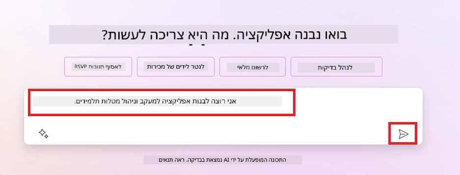

1. ה-Copilot ה-AI יציע טבלת Dataverse עם השדות שאתה צריך לאחסן את הנתונים שברצונך לעקוב ונתוני דוגמה מסוימים. לאחר מכן תוכל להתאים את הטבלה לצרכיך באמצעות תכונת העוזר שיחה של ה-Copilot.

   > **חשוב**: Dataverse הוא פלטפורמת הנתונים התחתונה של פלטפורמת Power. זוהי פלטפורמת נתונים בקוד נמוך לאחסון נתוני האפליקציה. זו שירות מנוהל באופן מלא המאחסן נתונים בביטחה בענן של מיקרוסופט ומסופק בתוך סביבת פלטפורמת Power שלך. היא מגיעה עם יכולות ניהול נתונים מובנות, כגון סיווג נתונים, מקור הנתונים, בקרת גישה מדויקת ועוד. ניתן ללמוד עוד על Dataverse [כאן](https://docs.microsoft.com/powerapps/maker/data-platform/data-platform-intro?WT.mc_id=academic-109639-somelezediko).

   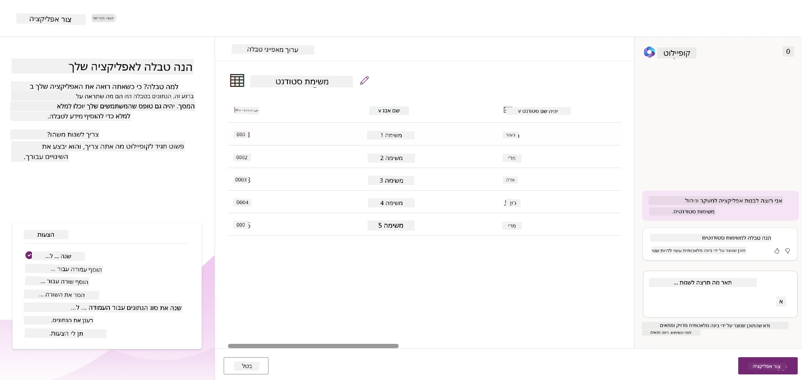

1. המורים רוצים לשלוח מיילים לסטודנטים שהגישו את המשימות שלהם כדי לעדכן אותם על התקדמות המשימות. ניתן להשתמש ב-Copilot להוספת שדה חדש לטבלה לאחסון דואר האלקטרוני של הסטודנט. לדוגמה, תוכל להשתמש בפרומפט הבא להוספת שדה חדש לטבלה: **_אני רוצה להוסיף עמודה לאחסון דואר אלקטרוני של סטודנט_**. לחץ על כפתור **שלח** כדי לשלוח את הפרומפט ל-Copilot ה-AI.

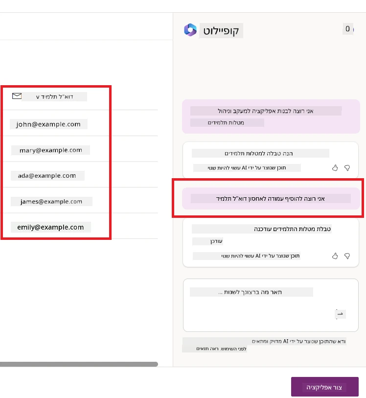

1. ה-Copilot ה-AI ייצור שדה חדש ולאחר מכן תוכל להתאים את השדה לצרכיך.

1. לאחר שסיימתם עם הטבלה, לחצו על כפתור **Create app** כדי ליצור את האפליקציה.

1. ה-AI Copilot ייצור אפליקציית Canvas מגיבה על סמך התיאור שלכם. לאחר מכן תוכלו להתאים את האפליקציה לצרכים שלכם.

1. למורים לשלוח מיילים לתלמידים, תוכלו להשתמש ב-Copilot כדי להוסיף מסך חדש לאפליקציה. לדוגמה, תוכלו להשתמש בהנחיה הבאה כדי להוסיף מסך חדש לאפליקציה: **_אני רוצה להוסיף מסך לשליחת מיילים לתלמידים_**. לחצו על כפתור **Send** כדי לשלוח את ההנחיה ל-AI Copilot.

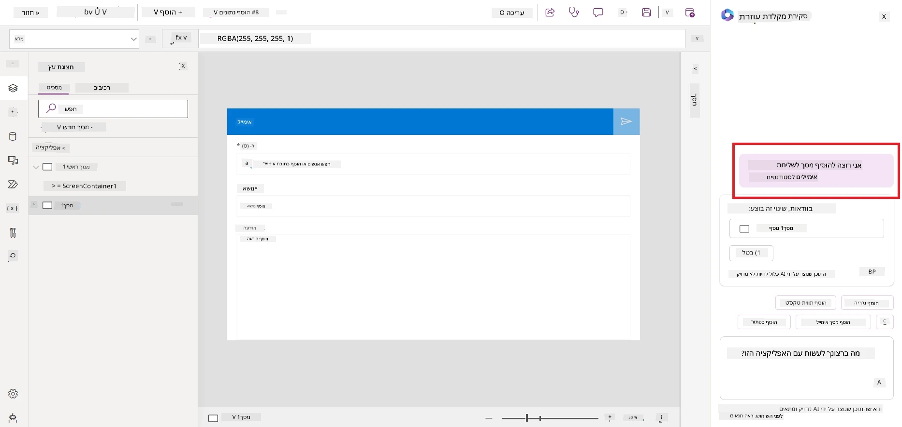

1. ה-AI Copilot ייצור מסך חדש ואז תוכלו להתאים את המסך לצרכים שלכם.

1. לאחר שסיימתם עם האפליקציה, לחצו על כפתור **Save** כדי לשמור את האפליקציה.

1. כדי לשתף את האפליקציה עם המורים, לחצו על כפתור **Share** ואז לחצו שוב על כפתור **Share**. לאחר מכן תוכלו לשתף את האפליקציה עם המורים על ידי הזנת כתובות המייל שלהם.

> **המשימה שלכם**: האפליקציה שבניתם היא התחלה טובה אבל ניתן לשפרה. עם תכונת המייל, המורים יכולים לשלוח מיילים לתלמידים ידנית על ידי הקלדת כתובות המייל. האם תוכלו להשתמש ב-Copilot כדי לבנות אוטומציה שתאפשר למורים לשלוח מיילים לתלמידים באופן אוטומטי כאשר הם מגישים את המטלות שלהם? הרמז שלכם הוא שבאמצעות ההנחיה הנכונה תוכלו להשתמש ב-Copilot ב-Power Automate לבנות את זה.

### בנו טבלת מידע חשבוניות לסטארטאפ שלנו

צוות הכספים של הסטארטאפ שלנו מתקשה לעקוב אחרי החשבוניות. הם השתמשו בגליון אלקטרוני למעקב אחרי החשבוניות, אך זה הפך לקשה לניהול ככל שמספר החשבוניות גדל. הם ביקשו מכם לבנות טבלה שתעזור להם לאחסן, לעקוב ולנהל את המידע של החשבוניות שהתקבלו. הטבלה תשמש לבניית אוטומציה שתוציא את כל המידע של החשבוניות ותאחסן אותו בטבלה. הטבלה גם תאפשר לצוות הכספים לצפות בחשבוניות ששולמו ואלו שלא שולמו.

ל-Power Platform יש פלטפורמת נתונים תחתית בשם Dataverse המאפשרת לכם לאחסן את הנתונים של האפליקציות והפתרונות שלכם. Dataverse מספקת פלטפורמת נתונים בקוד נמוך לאחסון הנתונים של האפליקציה. זוהי שירות מנוהל במלואו המאחסן את הנתונים בצורה מאובטחת בענן של מיקרוסופט ומופעל בסביבת Power Platform שלכם. היא מגיעה עם יכולות מינהלת נתונים מובנות, כגון סיווג נתונים, ייחוס נתונים, בקרת גישה מפורטת ועוד. תוכלו ללמוד עוד [על Dataverse כאן](https://docs.microsoft.com/powerapps/maker/data-platform/data-platform-intro?WT.mc_id=academic-109639-somelezediko).

למה כדאי שנשתמש ב-Dataverse לסטארטאפ שלנו? הטבלאות הסטנדרטיות והמותאמות בתוך Dataverse מספקות אפשרות אחסון מאובטחת ומבוססת ענן לנתונים שלכם. טבלאות מאפשרות לכם לאחסן סוגי נתונים שונים, בדומה לאופן שבו אתם עשויים להשתמש בדפי עבודה מרובים בחוברת Excel אחת. תוכלו להשתמש בטבלאות לאחסן נתונים הספציפיים לארגון או לצרכי העסק שלכם. כמה מהיתרונות שיקבל הסטארטאפ שלנו משימוש ב-Dataverse כוללים אך לא מוגבלים ל:

- **קל לניהול**: הן המידע המטה-דאטה והן הנתונים מאוחסנים בענן, כך שלא תצטרכו לדאוג לפרטים על אופן האחסון או הניהול. תוכלו להתמקד בבניית האפליקציות והפתרונות שלכם.

- **מאובטח**: Dataverse מספק אחסון מאובטח ומבוסס ענן לנתונים שלכם. תוכלו לשלוט במי יש גישה לנתונים בטבלאות שלכם ואיך הם יכולים לגשת אליהם באמצעות אבטחה מבוססת תפקידים.

- **מטה-דאטה עשיר**: סוגי נתונים וקשרים משמשים ישירות בתוך Power Apps

- **לוגיקה ואימות**: תוכלו להשתמש בכללי עסק, שדות מחושבים וכללי אימות כדי לאכוף לוגיקת עסקים ולשמור על דיוק הנתונים.

עכשיו כשאתם יודעים מה זה Dataverse ולמה כדאי להשתמש בו, נבחן כיצד תוכלו להשתמש ב-Copilot ליצירת טבלה ב-Dataverse שתענה על דרישות צוות הכספים שלנו.

> **הערה** : תשתמשו בטבלה זו בחלק הבא לבניית אוטומציה שתוציא את כל המידע של החשבוניות ותאחסן אותו בטבלה.

ליצירת טבלה ב-Dataverse באמצעות Copilot, עקבו אחרי השלבים הבאים:

1. נווטו למסך הבית של [Power Apps](https://make.powerapps.com?WT.mc_id=academic-105485-koreyst).

2. בסרגל הניווט בצד שמאל, בחרו ב-**Tables** ואז לחצו על **Describe the new Table**.

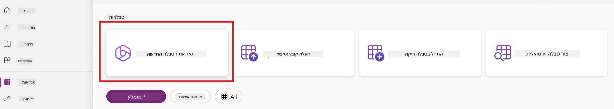

1. במסך **Describe the new Table**, השתמשו באזור הטקסט לתאר את הטבלה שאתם רוצים ליצור. לדוגמה, **_אני רוצה ליצור טבלה לאחסון מידע של חשבוניות_**. לחצו על כפתור **Send** כדי לשלוח את ההנחיה ל-AI Copilot.

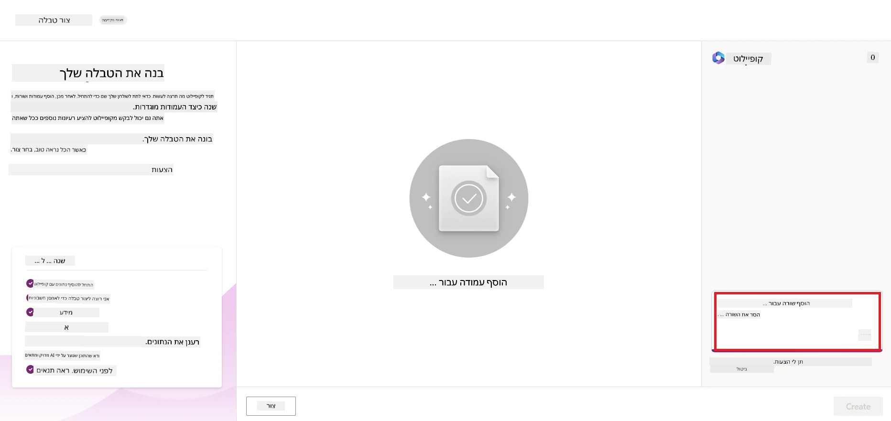

1. ה-AI Copilot יציע טבלת Dataverse עם השדות שתצטרכו לאחסן את הנתונים שאתם רוצים לעקוב אחריהם וכמה נתוני דוגמה. לאחר מכן תוכלו להתאים את הטבלה לצרכים שלכם בעזרת תכונת העוזר של AI Copilot בשלבים שיחתיים.

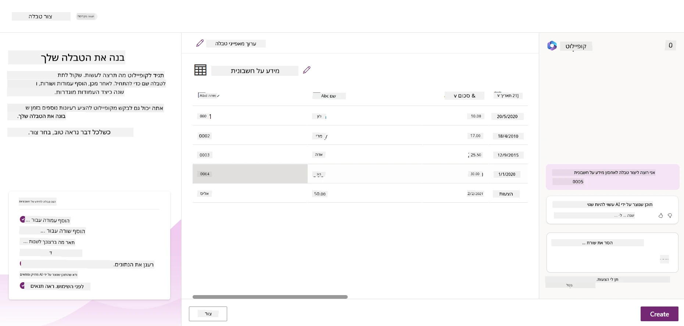

1. צוות הכספים רוצה לשלוח מייל לספק לעדכן אותו במצב הנוכחי של החשבונית. תוכלו להשתמש ב-Copilot כדי להוסיף שדה חדש לטבלה לאחסון מייל הספק. לדוגמה, תוכלו להשתמש בהנחיה הבאה כדי להוסיף שדה חדש לטבלה: **_אני רוצה להוסיף עמודה לאחסון מייל הספק_**. לחצו על כפתור **Send** כדי לשלוח את ההנחיה ל-AI Copilot.

1. ה-AI Copilot ייצור שדה חדש ואז תוכלו להתאים את השדה לצרכים שלכם.

1. לאחר שסיימתם עם הטבלה, לחצו על כפתור **Create** כדי ליצור את הטבלה.

## דגמי AI ב-Power Platform עם AI Builder

AI Builder היא יכולת AI בקוד נמוך הזמינה ב-Power Platform שמאפשרת לכם להשתמש בדגמי בינה מלאכותית כדי לסייע באוטומציה של תהליכים ולחזות תוצאות. עם AI Builder תוכלו להביא AI לאפליקציות ולזרמי העבודה שלכם שמחוברים לנתונים ב-Dataverse או במקורות נתונים ענניים שונים, כגון SharePoint, OneDrive או Azure.

## דגמי AI מובנים מול דגמי AI מותאמים

AI Builder מספק שני סוגי דגמי AI: דגמי AI מובנים ודגמי AI מותאמים. דגמי AI מובנים הם דגמי AI מוכנים לשימוש שלמדו על ידי מיקרוסופט וזמינים ב-Power Platform. אלה מסייעים לכם להוסיף אינטליגנציה לאפליקציות ולזרמים שלכם מבלי הצורך לאסוף נתונים ולבנות, לאמן ולפרסם מודלים משלכם. תוכלו להשתמש במודלים אלה כדי לאוטומט תהליכים ולחזות תוצאות.

כמה מדגמי ה-AI המובנים הזמינים ב-Power Platform כוללים:

- **חילוץ ביטויי מפתח**: מודל זה מחלץ ביטויי מפתח מתוך טקסט.
- **זיהוי שפה**: מודל זה מזהה את שפת הטקסט.
- **ניתוח רגשות**: מודל זה מזהה רגשות חיוביים, שליליים, ניטרליים או מעורבים בטקסט.
- **קורא כרטיס ביקור**: מודל זה מחלץ מידע מכרטיסי ביקור.
- **זיהוי טקסט**: מודל זה מחלץ טקסט מתמונות.
- **זיהוי אובייקטים**: מודל זה מזהה ומחלץ אובייקטים מתמונות.
- **עיבוד מסמכים**: מודל זה מחלץ מידע מטפסים.
- **עיבוד חשבוניות**: מודל זה מחלץ מידע מתוך חשבוניות.

עם דגמי AI מותאמים תוכלו להביא מודל משלכם ל-AI Builder כך שיוכל לתפקד כמו כל מודל מותאם של AI Builder, ולהכשר את המודל באמצעות הנתונים שלכם. תוכלו להשתמש במודלים אלה לאוטומציה של תהליכים ולחזות תוצאות הן ב-Power Apps והן ב-Power Automate. כאשר אתם משתמשים במודל שלכם קיימות מגבלות שחלים. קראו עוד על המגבלות הללו [כאן](https://learn.microsoft.com/ai-builder/byo-model#limitations?WT.mc_id=academic-105485-koreyst).

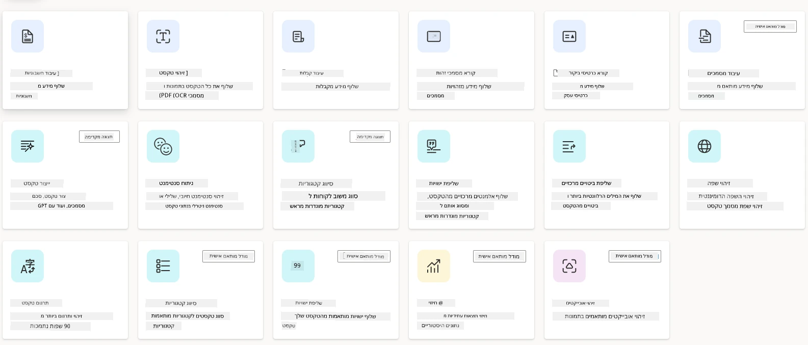

## מטלת בית #2 - בניית זרימת עיבוד חשבונית לסטארטאפ שלנו

צוות הכספים מתקשה לעבד חשבוניות. הם השתמשו בגליון אלקטרוני למעקב אחרי החשבוניות, אך זה הפך לקשה לניהול ככל שמספר החשבוניות גדל. הם ביקשו מכם לבנות תהליך עבודה שיסייע להם לעבד חשבוניות באמצעות AI. תהליך העבודה צריך לאפשר להם לחלץ מידע מהחשבוניות ולאחסן את המידע בטבלת Dataverse. תהליך העבודה צריך גם לאפשר להם לשלוח מייל לצוות הכספים עם המידע שנחלץ.

עכשיו כשאתם יודעים מה זה AI Builder ולמה כדאי להשתמש בו, נבחן כיצד תוכלו להשתמש במודל AI של עיבוד חשבוניות ב-AI Builder, אותו סקרנו קודם לכן, לבניית תהליך עבודה שיעזור לצוות הכספים לעבד חשבוניות.

לבניית תהליך עבודה שיעזור לצוות הכספים לעבד חשבוניות באמצעות מודל AI של עיבוד חשבוניות ב-AI Builder, עקבו אחרי השלבים הבאים:

1. נווטו למסך הבית של [Power Automate](https://make.powerautomate.com?WT.mc_id=academic-105485-koreyst).

2. השתמשו באזור הטקסט במסך הבית לתאר את תהליך העבודה שברצונכם לבנות. לדוגמה, **_עבד חשבונית כשהיא מגיעה לתיבת הדואר שלי_**. לחצו על כפתור **Send** כדי לשלוח את ההנחיה ל-AI Copilot.

   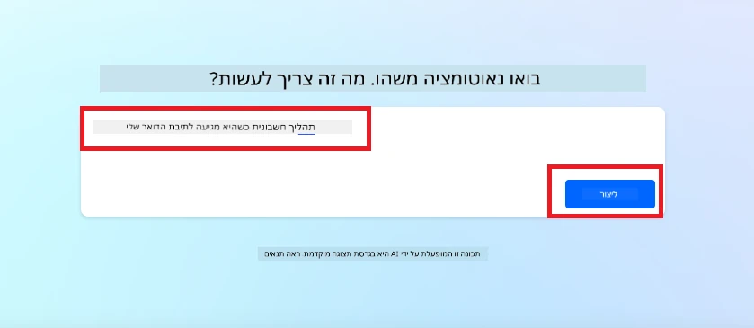

3. ה-AI Copilot יציע את הפעולות שעליכם לבצע על מנת לאוטומט את המשימה שברצונכם לבצע. תוכלו ללחוץ על כפתור **Next** כדי לעבור בין השלבים הבאים.

4. בשלב הבא, Power Automate יבקש מכם להגדיר את החיבורים הנדרשים לתהליך העבודה. לאחר שסיימתם, לחצו על כפתור **Create flow** כדי ליצור את תהליך העבודה.

5. ה-AI Copilot ייצור את תהליך העבודה ואתם תוכלו להתאים אותו לצרכים שלכם.

6. עדכנו את הטריגר של תהליך העבודה והגדירו את **Folder** לתיקייה שבה יאוחסנו החשבוניות. לדוגמה, תוכלו להגדיר את התיקייה ל-**Inbox**. לחצו על **Show advanced options** והגדירו את **Only with Attachments** ל-**Yes**. זה יוודא שתהליך העבודה ירוץ רק כאשר מתקבל מייל עם קובץ מצורף בתיקייה.

7. הסירו את הפעולות הבאות מתהליך העבודה: **HTML to text**, **Compose**, **Compose 2**, **Compose 3** ו-**Compose 4** כי אינכם צריכים אותן.

8. הסירו את פעולה **Condition** מתהליך העבודה כי אינכם צריכים אותה. תהליך העבודה ייראה כמו בתצלום המסך הבא:

   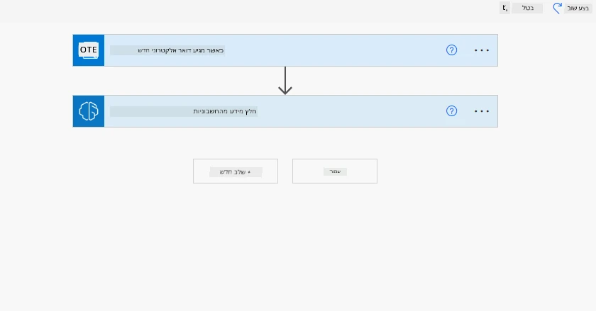

9. לחצו על כפתור **Add an action** וחפשו **Dataverse**. בחרו באפשרות **Add a new row**.

10. בפעולת **Extract Information from invoices**, עדכנו את **Invoice File** להפנות ל-**Attachment Content** מהמייל. זה יוודא שתהליך העבודה יחלץ מידע מקובץ החשבונית המצורף.

11. בחרו את ה**Table** שיצרתם קודם לכן. לדוגמה, תוכלו לבחור את טבלת **Invoice Information**. בחרו את התוכן הדינמי מהפעולה הקודמת כדי למלא את השדות הבאים:

    - מזהה (ID)
    - סכום (Amount)
    - תאריך (Date)
    - שם (Name)
    - סטטוס - הגדירו את **Status** ל-**Pending**.
    - מייל ספק - השתמשו בתוכן הדינמי **From** מהטריגר **When a new email arrives**.

    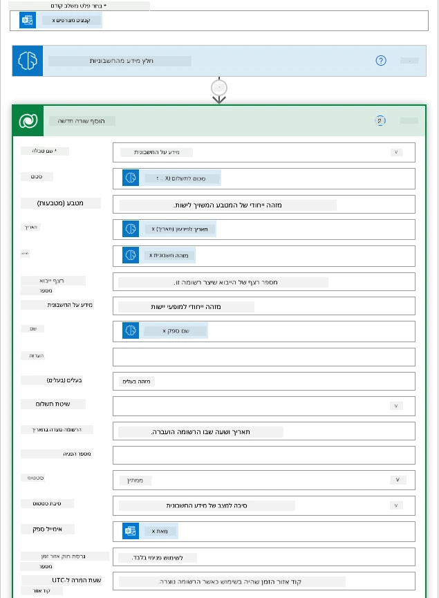

12. לאחר שסיימתם עם תהליך העבודה, לחצו על כפתור **Save** כדי לשמור את תהליך העבודה. תוכלו לבדוק את תהליך העבודה על ידי שליחת מייל עם חשבונית לתיקייה שהגדרתם בטריגר.

> **המשימה שלכם**: תהליך העבודה שבניתם הוא התחלה טובה, כעת עליכם לחשוב כיצד לבנות אוטומציה שתאפשר לצוות הכספים שלנו לשלוח מייל לספק לעדכן אותו במצב הנוכחי של החשבונית. הרמז שלכם: תהליך העבודה חייב לפעול כאשר הסטטוס של החשבונית משתנה.

## השתמשו במודל AI ליצירת טקסט ב-Power Automate

מודל ה-Create Text with GPT ב-AI Builder מאפשר לכם ליצור טקסט בהתבסס על הנחיה ומופעל באמצעות שירות Microsoft Azure OpenAI. באמצעות יכולת זו תוכלו לשלב את טכנולוגיית GPT (טרנספורמר מאומן מראש) באפליקציות ובזרמים שלכם כדי לבנות מגוון של זרמי עבודה אוטומטיים ויישומים בעלי תובנה.

דגמי GPT עוברים אימון נרחב על כמויות עצומות של נתונים, המאפשר להם להפיק טקסט הקרוב לשפת אדם כאשר מקבלים הנחיה. כשמשולבים באוטומציה של תהליכים, דגמי AI כמו GPT יכולים לשמש לייעול ואוטומציה של מגוון רחב של משימות.

לדוגמה, תוכלו לבנות זרמים שמייצרים אוטומטית טקסט למשימות שונות, כגון טיוטות למיילים, תיאורי מוצרים ועוד. תוכלו גם להשתמש במודל ליצירת טקסט עבור אפליקציות שונות, כגון צ׳אט-בוטים ואפליקציות שירות לקוחות שמאפשרות לנציגי שירות הלקוחות להגיב בצורה יעילה ואפקטיבית לפניות הלקוחות.

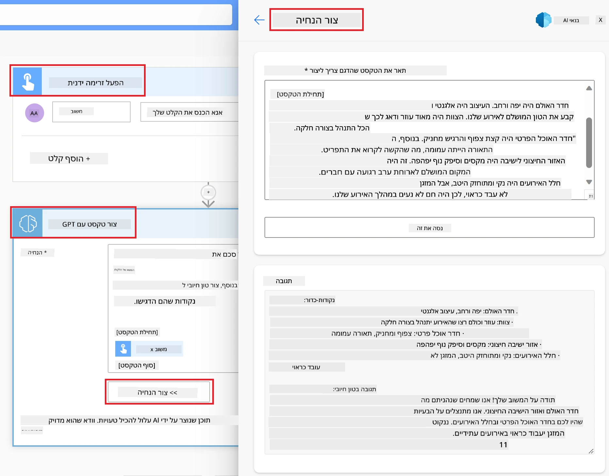

כדי ללמוד כיצד להשתמש במודל ה-AI הזה ב-Power Automate, עברו דרך המודול [הוספת אינטליגנציה עם AI Builder ו-GPT](https://learn.microsoft.com/training/modules/ai-builder-text-generation/?WT.mc_id=academic-109639-somelezediko).

## עבודה מצוינת! המשיכו ללמוד

לאחר שסיימתם את השיעור הזה, בדקו את [אוסף הלמידה של Generative AI](https://aka.ms/genai-collection?WT.mc_id=academic-105485-koreyst) שלנו כדי להמשיך להעשיר את הידע שלכם ב-Generative AI!

רוצים להתאים אישית ולקבל יותר מ-Copilot? בחנו את [Awesome Copilot](https://github.com/github/awesome-copilot?WT.mc_id=academic-105485-koreyst) — אוסף קהילתי של הוראות, סוכנים, מיומנויות ותצורות שיעזרו לכם להפיק את המירב מ-GitHub Copilot.

עברו לשיעור 11 שבו נבחן כיצד [לשלב Generative AI עם קריאת פונקציות](../11-integrating-with-function-calling/README.md?WT.mc_id=academic-105485-koreyst)!

---

<!-- CO-OP TRANSLATOR DISCLAIMER START -->
**כתב ויתור**:
מסמך זה תורגם באמצעות שירות תרגום אוטומטי [Co-op Translator](https://github.com/Azure/co-op-translator). למרות שאנו שואפים לדיוק, יש לקחת בחשבון שתרגומים אוטומטיים עלולים להכיל שגיאות או אי-דיוקים. יש להחשיב את המסמך המקורי בשפתו הטבעית כמקור הסמכות. למידע קריטי מומלץ להשתמש בתרגום מקצועי על ידי מתרגם אדם. אנו לא אחראים לכל אי-הבנה או פירוש שגוי הנובע מהשימוש בתרגום זה.
<!-- CO-OP TRANSLATOR DISCLAIMER END -->