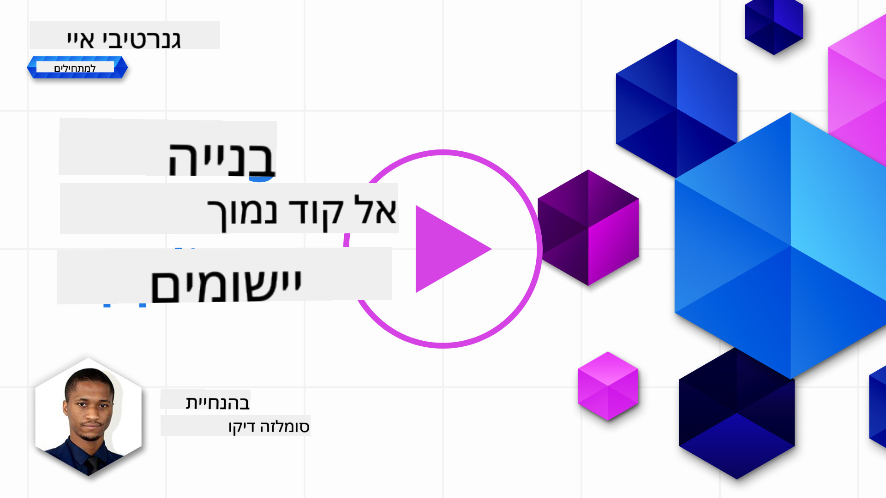
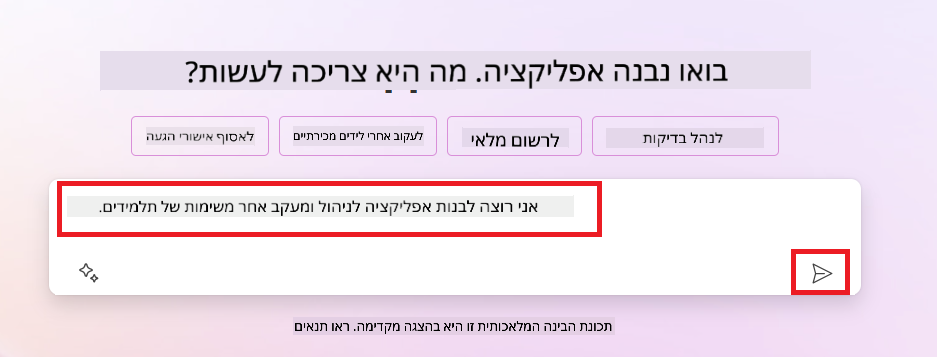
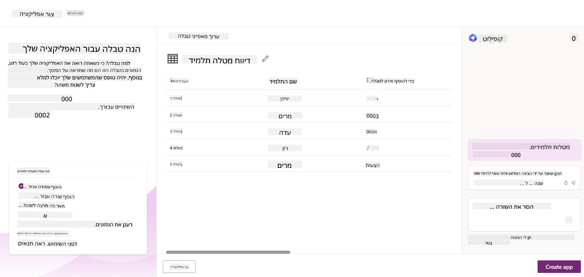
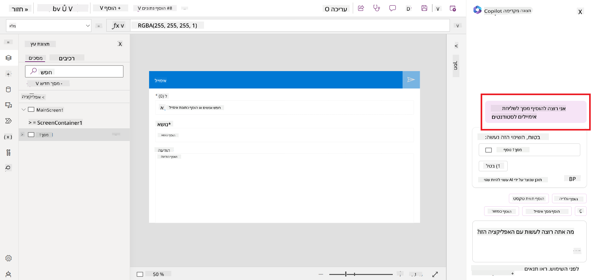
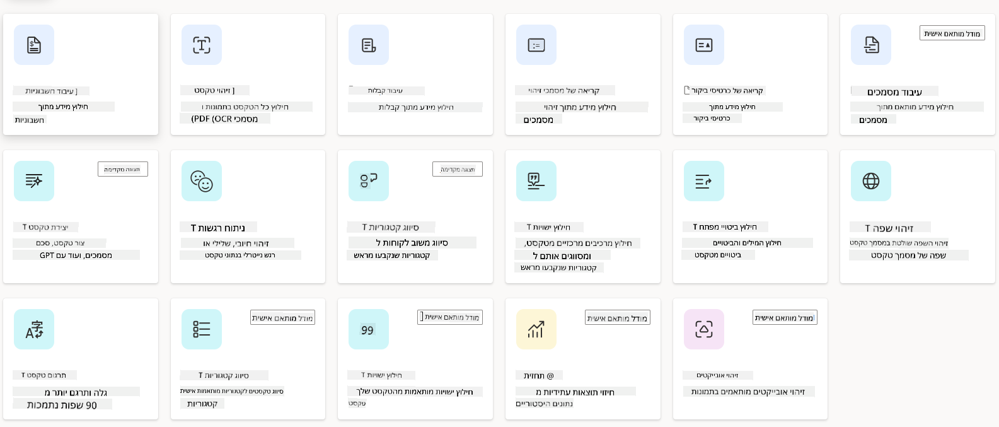
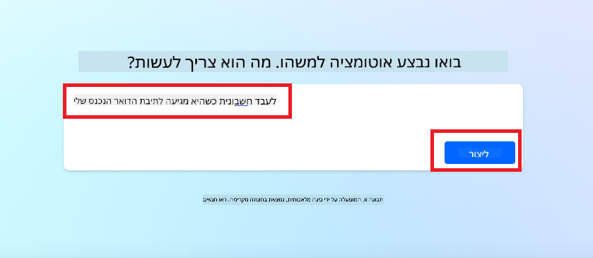
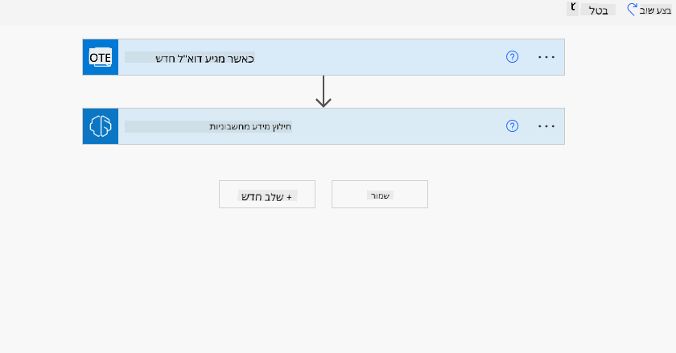
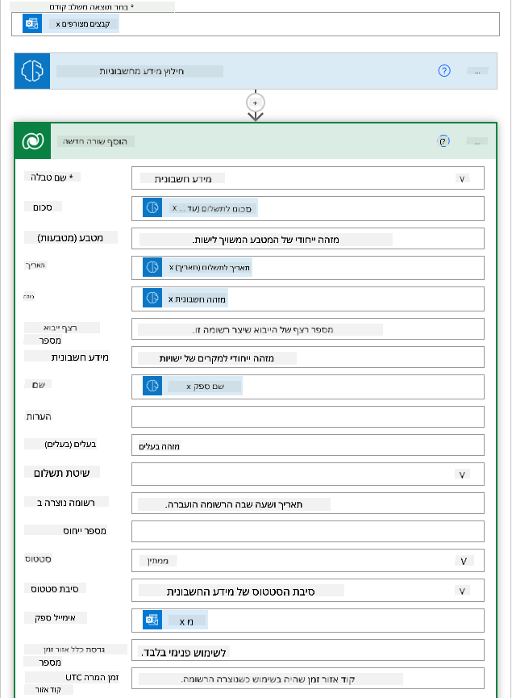
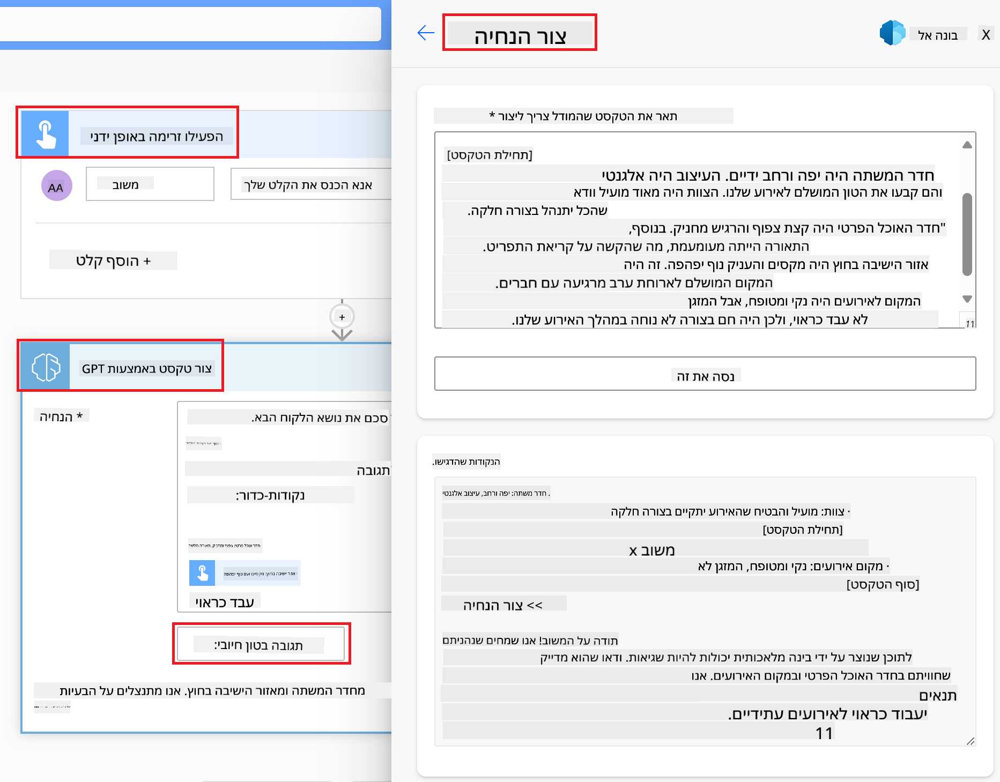

<!--
CO_OP_TRANSLATOR_METADATA:
{
  "original_hash": "f5ff3b6204a695a117d6f452403c95f7",
  "translation_date": "2025-06-25T19:01:43+00:00",
  "source_file": "10-building-low-code-ai-applications/README.md",
  "language_code": "he"
}
-->
# בניית אפליקציות AI בקוד נמוך

> _(לחצו על התמונה למעלה לצפייה בסרטון של השיעור הזה)_

## מבוא

עכשיו כשכבר למדנו כיצד לבנות אפליקציות ליצירת תמונות, נדבר על קוד נמוך. AI גנרטיבי יכול לשמש במגוון תחומים שונים כולל קוד נמוך, אבל מהו קוד נמוך ואיך ניתן להוסיף לו AI?

בניית אפליקציות ופתרונות הפכה לקלה יותר למפתחים מסורתיים ולמי שאינו מפתח באמצעות פלטפורמות פיתוח קוד נמוך. פלטפורמות אלה מאפשרות לבנות אפליקציות ופתרונות עם מעט או ללא קוד. זה מושג על ידי מתן סביבה לפיתוח חזותי שמאפשרת לגרור ולשחרר רכיבים כדי לבנות אפליקציות ופתרונות. זה מאפשר לבנות אפליקציות ופתרונות מהר יותר ועם פחות משאבים. בשיעור זה, נעמיק כיצד להשתמש בקוד נמוך וכיצד לשפר את פיתוח הקוד הנמוך עם AI באמצעות Power Platform.

Power Platform מעניקה לארגונים את האפשרות להעצים את הצוותים שלהם לבנות פתרונות משלהם באמצעות סביבה אינטואיטיבית של קוד נמוך או ללא קוד. סביבה זו מסייעת לפשט את תהליך בניית הפתרונות. עם Power Platform, ניתן לבנות פתרונות בימים או שבועות במקום חודשים או שנים. Power Platform מורכבת מחמישה מוצרים מרכזיים: Power Apps, Power Automate, Power BI, Power Pages ו-Copilot Studio.

שיעור זה מכסה:

- מבוא ל-AI גנרטיבי ב-Power Platform
- מבוא ל-Copilot וכיצד להשתמש בו
- שימוש ב-AI גנרטיבי לבניית אפליקציות ותהליכים ב-Power Platform
- הבנת מודלי ה-AI ב-Power Platform עם AI Builder

## מטרות למידה

בסוף השיעור, תוכלו:

- להבין כיצד Copilot עובד ב-Power Platform.

- לבנות אפליקציה למעקב אחרי מטלות תלמידים עבור הסטארטאפ החינוכי שלנו.

- לבנות תהליך עיבוד חשבוניות שמשתמש ב-AI כדי לחלץ מידע מחשבוניות.

- ליישם שיטות עבודה מומלצות בשימוש במודל GPT AI ליצירת טקסט.

הכלים והטכנולוגיות שתשתמשו בהם בשיעור זה הם:

- **Power Apps**, עבור אפליקציית מעקב אחרי מטלות תלמידים, המספקת סביבה לפיתוח בקוד נמוך לבניית אפליקציות למעקב, ניהול ואינטראקציה עם נתונים.

- **Dataverse**, לאחסון הנתונים עבור אפליקציית מעקב אחרי מטלות תלמידים, שם Dataverse תספק פלטפורמת נתונים בקוד נמוך לאחסון נתוני האפליקציה.

- **Power Automate**, עבור תהליך עיבוד חשבוניות בו תהיה לכם סביבה לפיתוח בקוד נמוך לבניית תהליכי עבודה לאוטומציה של תהליך עיבוד החשבוניות.

- **AI Builder**, עבור מודל ה-AI לעיבוד חשבוניות בו תשתמשו במודלי AI מובנים לעיבוד החשבוניות עבור הסטארטאפ שלנו.

## AI גנרטיבי ב-Power Platform

שיפור הפיתוח והיישום בקוד נמוך עם AI גנרטיבי הוא תחום מפתח ב-Power Platform. המטרה היא לאפשר לכולם לבנות אפליקציות, אתרים, לוחות מחוונים ולבצע אוטומציה של תהליכים עם AI, _ללא צורך במומחיות במדעי הנתונים_. מטרה זו מושגת על ידי שילוב AI גנרטיבי בחוויית הפיתוח בקוד נמוך ב-Power Platform בצורת Copilot ו-AI Builder.

### איך זה עובד?

Copilot הוא עוזר AI שמאפשר לכם לבנות פתרונות ב-Power Platform על ידי תיאור הדרישות שלכם בסדרת שלבים שיחתיים בשפה טבעית. לדוגמה, תוכלו להנחות את עוזר ה-AI שלכם לציין אילו שדות האפליקציה שלכם תשתמש בהם והוא ייצור גם את האפליקציה וגם את מודל הנתונים התשתיתי, או שתוכלו לציין כיצד להגדיר תהליך ב-Power Automate.

אתם יכולים להשתמש בתכונות המונעות על ידי Copilot כתכונה במסכי האפליקציה שלכם כדי לאפשר למשתמשים לחשוף תובנות באמצעות אינטראקציות שיחתיות.

AI Builder הוא יכולת AI בקוד נמוך הזמינה ב-Power Platform שמאפשרת לכם להשתמש במודלי AI כדי לעזור לכם לבצע אוטומציה של תהליכים ולחזות תוצאות. עם AI Builder אתם יכולים להביא AI לאפליקציות ולתהליכים שלכם שמתחברים לנתונים שלכם ב-Dataverse או במקורות נתונים בענן שונים, כגון SharePoint, OneDrive או Azure.

Copilot זמין בכל מוצרי Power Platform: Power Apps, Power Automate, Power BI, Power Pages ו-Power Virtual Agents. AI Builder זמין ב-Power Apps וב-Power Automate. בשיעור זה, נתמקד כיצד להשתמש ב-Copilot ו-AI Builder ב-Power Apps וב-Power Automate כדי לבנות פתרון עבור הסטארטאפ החינוכי שלנו.

### Copilot ב-Power Apps

כחלק מ-Power Platform, Power Apps מספקת סביבה לפיתוח בקוד נמוך לבניית אפליקציות למעקב, ניהול ואינטראקציה עם נתונים. זו חבילה של שירותי פיתוח אפליקציות עם פלטפורמת נתונים בקנה מידה גדול והיכולת להתחבר לשירותי ענן ונתונים מקומיים. Power Apps מאפשרת לכם לבנות אפליקציות שפועלות בדפדפנים, טאבלטים וטלפונים, וניתן לשתף אותן עם עמיתים לעבודה. Power Apps מקלה על המשתמשים בפיתוח אפליקציות עם ממשק פשוט, כך שכל משתמש עסקי או מפתח מקצועי יכול לבנות אפליקציות מותאמות אישית. חוויית פיתוח האפליקציות גם משופרת עם AI גנרטיבי דרך Copilot.

תכונת העוזר AI ב-Power Apps מאפשרת לכם לתאר איזה סוג של אפליקציה אתם צריכים ואיזה מידע אתם רוצים שהאפליקציה שלכם תעקוב, תאסוף או תציג. לאחר מכן, Copilot יוצר אפליקציית Canvas רספונסיבית בהתבסס על התיאור שלכם. תוכלו להתאים את האפליקציה לצרכים שלכם. העוזר AI גם מייצר ומציע טבלת Dataverse עם השדות שאתם צריכים לאחסון הנתונים שאתם רוצים לעקוב אחריהם וכמה נתוני דוגמה. נבחן מהו Dataverse וכיצד ניתן להשתמש בו ב-Power Apps בשיעור זה בהמשך. תוכלו להתאים את הטבלה לצרכים שלכם באמצעות תכונת העוזר AI בשלבים שיחתיים. תכונה זו זמינה מיד ממסך הבית של Power Apps.

### Copilot ב-Power Automate

כחלק מ-Power Platform, Power Automate מאפשר למשתמשים ליצור תהליכי עבודה אוטומטיים בין אפליקציות ושירותים. הוא עוזר לבצע אוטומציה של תהליכים עסקיים חוזרים כמו תקשורת, איסוף נתונים ואישורי החלטות. הממשק הפשוט שלו מאפשר למשתמשים בכל רמות הטכניות (ממתחילים ועד מפתחים מנוסים) לבצע אוטומציה של משימות עבודה. חוויית פיתוח תהליכי העבודה גם משופרת עם AI גנרטיבי דרך Copilot.

תכונת העוזר AI ב-Power Automate מאפשרת לכם לתאר איזה סוג של תהליך אתם צריכים ואילו פעולות אתם רוצים שהתהליך שלכם יבצע. לאחר מכן, Copilot יוצר תהליך בהתבסס על התיאור שלכם. תוכלו להתאים את התהליך לצרכים שלכם. העוזר AI גם מייצר ומציע את הפעולות שאתם צריכים לבצע את המשימה שאתם רוצים לבצע אוטומציה. נבחן מה הם תהליכים וכיצד ניתן להשתמש בהם ב-Power Automate בשיעור זה בהמשך. תוכלו להתאים את הפעולות לצרכים שלכם באמצעות תכונת העוזר AI בשלבים שיחתיים. תכונה זו זמינה מיד ממסך הבית של Power Automate.

## משימה: ניהול מטלות תלמידים וחשבוניות עבור הסטארטאפ שלנו, באמצעות Copilot

הסטארטאפ שלנו מספק קורסים מקוונים לתלמידים. הסטארטאפ גדל במהירות וכעת מתקשה לעמוד בדרישה לקורסים שלו. הסטארטאפ שכר אתכם כמפתחי Power Platform כדי לעזור להם לבנות פתרון בקוד נמוך שיעזור להם לנהל את מטלות התלמידים והחשבוניות שלהם. הפתרון שלהם צריך להיות מסוגל לעזור להם לעקוב ולנהל מטלות תלמידים באמצעות אפליקציה ולבצע אוטומציה של תהליך עיבוד החשבוניות באמצעות תהליך עבודה. ביקשו מכם להשתמש ב-AI גנרטיבי כדי לפתח את הפתרון.

כשאתם מתחילים להשתמש ב-Copilot, אתם יכולים להשתמש ב-[ספריית הפקודות של Power Platform Copilot](https://github.com/pnp/powerplatform-prompts?WT.mc_id=academic-109639-somelezediko) כדי להתחיל עם הפקודות. ספרייה זו מכילה רשימת פקודות שאתם יכולים להשתמש בהן כדי לבנות אפליקציות ותהליכים עם Copilot. תוכלו גם להשתמש בפקודות בספרייה כדי לקבל רעיון כיצד לתאר את הדרישות שלכם ל-Copilot.

### בניית אפליקציית מעקב אחרי מטלות תלמידים עבור הסטארטאפ שלנו

המורים בסטארטאפ שלנו מתקשים לעקוב אחרי מטלות התלמידים. הם השתמשו בגיליון אלקטרוני כדי לעקוב אחרי המטלות, אך זה הפך לקשה לניהול ככל שמספר התלמידים גדל. הם ביקשו מכם לבנות אפליקציה שתעזור להם לעקוב ולנהל מטלות תלמידים. האפליקציה צריכה לאפשר להם להוסיף מטלות חדשות, לצפות במטלות, לעדכן מטלות ולמחוק מטלות. האפליקציה צריכה גם לאפשר למורים ולתלמידים לצפות במטלות שקיבלו ציון ואלו שלא קיבלו ציון.

תבנו את האפליקציה באמצעות Copilot ב-Power Apps על פי השלבים הבאים:

1. נווטו למסך הבית של [Power Apps](https://make.powerapps.com?WT.mc_id=academic-105485-koreyst).

1. השתמשו באזור הטקסט במסך הבית כדי לתאר את האפליקציה שאתם רוצים לבנות. לדוגמה, **_אני רוצה לבנות אפליקציה למעקב ולניהול מטלות תלמידים_**. לחצו על כפתור **שלח** כדי לשלוח את הפקודה ל-AI Copilot.

1. ה-AI Copilot יציע טבלת Dataverse עם השדות שאתם צריכים לאחסון הנתונים שאתם רוצים לעקוב אחריהם וכמה נתוני דוגמה. תוכלו להתאים את הטבלה לצרכים שלכם באמצעות תכונת העוזר AI בשלבים שיחתיים.

   > **חשוב**: Dataverse היא פלטפורמת הנתונים התשתיתית של Power Platform. זו פלטפורמת נתונים בקוד נמוך לאחסון נתוני האפליקציה. זו שירות מנוהל לחלוטין שמאחסן נתונים בצורה מאובטחת בענן של Microsoft ומוקצה בסביבת Power Platform שלכם. הוא מגיע עם יכולות ניהול נתונים מובנות, כגון סיווג נתונים, שושלת נתונים, בקרת גישה מדויקת ועוד. תוכלו ללמוד עוד על Dataverse [כאן](https://docs.microsoft.com/powerapps/maker/data-platform/data-platform-intro?WT.mc_id=academic-109639-somelezediko).

   

1. המורים רוצים לשלוח אימיילים לתלמידים שהגישו את המטלות שלהם כדי לעדכן אותם על התקדמות המטלות שלהם. תוכלו להשתמש ב-Copilot כדי להוסיף שדה חדש לטבלה לאחסון האימייל של התלמיד. לדוגמה, תוכלו להשתמש בפקודה הבאה כדי להוסיף שדה חדש לטבלה: **_אני רוצה להוסיף עמודה לאחסון אימייל של תלמיד_**. לחצו על כפתור **שלח** כדי לשלוח את הפקודה ל-AI Copilot.

1. ה-AI Copilot ייצור שדה חדש ותוכלו להתאים את השדה לצרכים שלכם.

1. לאחר שתסיימו עם הטבלה, לחצו על כפתור **צור אפליקציה** כדי ליצור את האפליקציה.

1. ה-AI Copilot ייצור אפליקציית Canvas רספונסיבית בהתבסס על התיאור שלכם. תוכלו להתאים את האפליקציה לצרכים שלכם.

1. כדי לאפשר למורים לשלוח אימיילים לתלמידים, תוכלו להשתמש ב-Copilot כדי להוסיף מסך חדש לאפליקציה. לדוגמה, תוכלו להשתמש בפקודה הבאה כדי להוסיף מסך חדש לאפליקציה: **_אני רוצה להוסיף מסך לשליחת אימיילים לתלמידים_**. לחצו על כפתור **שלח** כדי לשלוח את הפקודה ל-AI Copilot.

1. ה-AI Copilot ייצור מסך חדש ותוכלו להתאים את המסך לצרכים שלכם.

1. לאחר שתסיימו עם האפליקציה, לחצו על כפתור **שמור** כדי לשמור את האפליקציה.

1. כדי לשתף את האפליקציה עם המורים, לחצו על כפתור **שתף** ולאחר מכן לחצו שוב על כפתור **שתף**. תוכלו לשתף את האפליקציה עם המורים על ידי הזנת כתובות האימייל שלהם.

> **שיעורי הבית שלכם**: האפליקציה שבניתם היא התחלה טובה אך ניתן לשפר אותה. עם תכונת האימייל, המורים יכולים לשלוח אימיילים לתלמידים רק באופן ידני על ידי הצורך להקליד את האימיילים שלהם. האם תוכלו להשתמש ב-Copilot כדי לבנות אוטומציה שתאפשר למורים לשלוח אימיילים לתלמידים באופן אוטומטי כאשר הם מגישים את המטלות שלהם? הרמז שלכם הוא שבאמצעות פקודה נכונה תוכלו להשתמש ב-Copilot ב-Power Automate כדי לבנות זאת.

### בניית טבלת מידע על חשבוניות עבור הסטארטאפ שלנו

צוות הכספים של הסטארטאפ שלנו מתקשה לעקוב אחרי החשבוניות. הם השתמשו בגיליון אלקטרוני כדי לעקוב אחרי החשבוניות, אך זה הפך לקשה לניהול ככל שמספר החשבוניות גדל. הם ביקשו מכם לבנות טבלה שתעזור להם לאחסן, לעקוב ולנהל את המידע של החשבוניות שהם קיבלו. הטבלה צריכה לשמש לבניית אוטומציה שתוציא את כל המידע על החשבוניות ותאחסן אותו בטבלה. הטבלה צריכה גם לאפשר לצוות הכספים לצפות בחשבוניות ששולמו ואלו שלא שולמו.

ל-Power Platform יש פלטפורמת נתונים תשתיתית בשם Dataverse שמאפשרת לכם לאחסן את הנתונים לאפליקציות ולפתרונות שלכם. Dataverse מספקת פלטפורמת נתונים בקוד נמוך לאחסון נתוני האפליקציה. זו שירות מנוהל לחלוטין שמאחסן נתונים בצורה מאובטחת בענן של Microsoft ומוקצה בסביבת Power Platform שלכם. הוא מגיע עם יכולות ניהול נתונים מובנות, כגון סיווג נתונים, שושלת נתונים, בקרת גישה מדויקת ועוד. תוכלו ללמוד עוד [על Dataverse כאן](https://docs.microsoft.com/powerapps/maker/data-platform/data-platform-intro?WT.mc_id=academic-109639-somelezediko).

למה כדאי לנו להשתמש ב-Dataverse עבור הסטארטאפ שלנו? הטבלאות הסטנדרטיות והמותאמות אישית בתוך Dataverse מספקות אפשרות אחסון מאובטחת ומבוססת ענן לנתונים שלכם. טבלאות מאפשרות לכם לאחסן סוגי נתונים שונים, בדומה לאופן שבו אתם עשויים להשתמש במספר גיליונות עבודה בתוך חוברת עבודה אחת של Excel. תוכלו להשתמש בטבלאות לאחסון נתונים שהם ספציפיים לארגון שלכם או לצרכים העסקיים שלכם. חלק מהיתרונות שהסטארטאפ שלנו יקבל משימוש ב-Dataverse כוללים אך אינם מוגבלים ל:

- **קל לניהול**: גם המטא-נתונים וגם הנתונים מאוחסנים בענן, כך שאין צורך לדאוג לפרטים של איך הם מאוחסנים או מנוהלים. תוכלו להתמקד בבניית האפליקציות והפתרונות שלכם.

- **מאובטח**: Dataverse מספקת אפשרות אחסון מאובטחת ומבוססת ענן לנתונים שלכם. תוכלו לשלוט על מי יש גישה לנתונים בטבלאות שלכם וכיצד הם יכולים לגשת אליהם באמצעות אבטחה מבוססת תפקידים.

- **מטא-נתונים עשירים**: סוגי נת
טקסט. - **ניתוח רגשות**: מודל זה מזהה רגשות חיוביים, שליליים, ניטרליים או מעורבים בטקסט. - **קורא כרטיסי ביקור**: מודל זה שולף מידע מכרטיסי ביקור. - **זיהוי טקסט**: מודל זה שולף טקסט מתמונות. - **זיהוי אובייקטים**: מודל זה מזהה ושולף אובייקטים מתמונות. - **עיבוד מסמכים**: מודל זה שולף מידע מטפסים. - **עיבוד חשבוניות**: מודל זה שולף מידע מחשבוניות. עם מודלים מותאמים אישית של AI, ניתן להביא את המודל שלך ל-AI Builder כך שהוא יוכל לתפקד כמו כל מודל מותאם אישית של AI Builder, ולאפשר לך לאמן את המודל באמצעות הנתונים שלך. ניתן להשתמש במודלים אלה כדי לאוטומט תהליכים ולחזות תוצאות הן ב-Power Apps והן ב-Power Automate. בעת שימוש במודל שלך ישנן מגבלות החלות. קרא עוד על מגבלות אלה [כאן](https://learn.microsoft.com/ai-builder/byo-model#limitations?WT.mc_id=academic-105485-koreyst).  ## משימה #2 - בניית זרימת עיבוד חשבוניות לסטארטאפ שלנו צוות הכספים מתקשה לעבד חשבוניות. הם השתמשו בגיליון אלקטרוני למעקב אחר החשבוניות אך זה הפך לקשה לניהול ככל שמספר החשבוניות גדל. הם ביקשו ממך לבנות זרימת עבודה שתסייע להם לעבד חשבוניות באמצעות AI. זרימת העבודה צריכה לאפשר להם לשאוב מידע מחשבוניות ולשמור את המידע בטבלת Dataverse. זרימת העבודה צריכה גם לאפשר להם לשלוח אימייל לצוות הכספים עם המידע שנשאב. עכשיו כשאתה יודע מהו AI Builder ולמה כדאי להשתמש בו, בוא נסתכל על איך אפשר להשתמש במודל עיבוד חשבוניות ב-AI Builder, אשר סקרנו קודם לכן, כדי לבנות זרימת עבודה שתסייע לצוות הכספים לעבד חשבוניות. כדי לבנות זרימת עבודה שתסייע לצוות הכספים לעבד חשבוניות באמצעות מודל עיבוד חשבוניות ב-AI Builder, עקוב אחר הצעדים הבאים: 1. נווט למסך הבית של [Power Automate](https://make.powerautomate.com?WT.mc_id=academic-105485-koreyst). 2. השתמש באזור הטקסט במסך הבית כדי לתאר את זרימת העבודה שברצונך לבנות. לדוגמה, **_עבד חשבונית כשהיא מגיעה לתיבת הדואר שלי_**. לחץ על כפתור **שלח** כדי לשלוח את ההנחיה ל-AI Copilot.  3. ה-AI Copilot יציע את הפעולות שאתה צריך לבצע כדי לבצע את המשימה שברצונך לאוטומט. תוכל ללחוץ על כפתור **הבא** כדי לעבור לשלב הבא. 4. בשלב הבא, Power Automate יבקש ממך להגדיר את החיבורים הנדרשים לזרימה. לאחר שתסיים, לחץ על כפתור **צור זרימה** כדי ליצור את הזרימה. 5. ה-AI Copilot ייצור זרימה ותוכל לאחר מכן להתאים את הזרימה לצרכים שלך. 6. עדכן את הטריגר של הזרימה והגדר את **תיקיה** לתיקיה שבה החשבוניות יישמרו. לדוגמה, תוכל להגדיר את התיקיה ל-**תיבת דואר נכנס**. לחץ על **הצג אפשרויות מתקדמות** והגדר את **רק עם קבצים מצורפים** ל-**כן**. זה יבטיח שהזרימה תפעל רק כאשר מתקבל אימייל עם קובץ מצורף בתיקיה. 7. הסר את הפעולות הבאות מהזרימה: **HTML לטקסט**, **Compose**, **Compose 2**, **Compose 3** ו-**Compose 4** כי לא תשתמש בהם. 8. הסר את פעולת **תנאי** מהזרימה כי לא תשתמש בה. זה אמור להיראות כמו צילום המסך הבא:  9. לחץ על כפתור **הוסף פעולה** וחפש את **Dataverse**. בחר את פעולת **הוסף שורה חדשה**. 10. על פעולת **שאוב מידע מחשבוניות**, עדכן את **קובץ החשבונית** כדי להצביע על **תוכן הקובץ המצורף** מהאימייל. זה יבטיח שהזרימה תשאב מידע מקובץ החשבונית המצורף. 11. בחר את **טבלה** שיצרת קודם לכן. לדוגמה, תוכל לבחור את טבלת **מידע חשבונית**. בחר את התוכן הדינמי מהפעולה הקודמת כדי למלא את השדות הבאים: - מזהה - סכום - תאריך - שם - מצב - הגדר את **מצב** ל-**בהמתנה**. - אימייל ספק - השתמש בתוכן הדינמי **מ** מהטריגר **כאשר מגיע אימייל חדש**.  12. לאחר שתסיים עם הזרימה, לחץ על כפתור **שמור** כדי לשמור את הזרימה. תוכל לאחר מכן לבדוק את הזרימה על ידי שליחת אימייל עם חשבונית לתיקיה שציינת בטריגר. > **שיעורי הבית שלך**: הזרימה שבנית היא התחלה טובה, עכשיו עליך לחשוב איך תוכל לבנות אוטומציה שתאפשר לצוות הכספים שלנו לשלוח אימייל לספק לעדכן אותו במצב הנוכחי של החשבונית שלו. הרמז שלך: הזרימה חייבת לפעול כאשר מצב החשבונית משתנה.

## השתמש במודל AI ליצירת טקסט ב-Power Automate

מודל יצירת טקסט עם GPT ב-AI Builder מאפשר לך ליצור טקסט בהתבסס על הנחיה ומופעל על ידי שירות Microsoft Azure OpenAI. עם יכולת זו, תוכל לשלב את טכנולוגיית GPT (Generative Pre-Trained Transformer) באפליקציות ובזרימות שלך כדי לבנות מגוון של זרימות אוטומטיות ואפליקציות תובנות.

מודלי GPT עוברים הכשרה נרחבת על כמויות עצומות של נתונים, מה שמאפשר להם לייצר טקסט שדומה לשפה אנושית כאשר ניתנת להם הנחיה. כאשר הם משולבים עם אוטומציה של זרימת עבודה, מודלי AI כמו GPT יכולים להיות מנוצלים כדי לייעל ולאוטומט מגוון רחב של משימות.

לדוגמה, תוכל לבנות זרימות ליצירת טקסט באופן אוטומטי עבור מגוון של שימושים, כגון: טיוטות של אימיילים, תיאורי מוצרים ועוד. תוכל גם להשתמש במודל ליצירת טקסט עבור מגוון של אפליקציות, כגון צ'אטבוטים ואפליקציות שירות לקוחות שמאפשרות לסוכני שירות לקוחות להגיב בצורה יעילה ויעילה לשאלות לקוחות.

כדי ללמוד איך להשתמש במודל AI זה ב-Power Automate, עבור דרך המודול [הוסף אינטיליגנציה עם AI Builder ו-GPT](https://learn.microsoft.com/training/modules/ai-builder-text-generation/?WT.mc_id=academic-109639-somelezediko).

## עבודה נהדרת! המשך ללמוד

לאחר סיום השיעור הזה, בדוק את [אוסף הלמידה של AI גנרטיבי](https://aka.ms/genai-collection?WT.mc_id=academic-105485-koreyst) כדי להמשיך לשפר את הידע שלך ב-AI גנרטיבי!

עבור לשיעור 11 שבו נסתכל על איך [לשלב AI גנרטיבי עם קריאת פונקציות](../11-integrating-with-function-calling/README.md?WT.mc_id=academic-105485-koreyst)!

**הצהרת אחריות**:  
מסמך זה תורגם באמצעות שירות תרגום AI [Co-op Translator](https://github.com/Azure/co-op-translator). למרות שאנו שואפים לדיוק, אנא היו מודעים לכך שתרגומים אוטומטיים עשויים להכיל שגיאות או אי דיוקים. המסמך המקורי בשפתו המקורית צריך להיחשב כמקור סמכותי. עבור מידע קריטי, מומלץ להשתמש בתרגום מקצועי אנושי. אנו לא אחראים לכל אי הבנות או פירושים מוטעים הנובעים מהשימוש בתרגום זה.