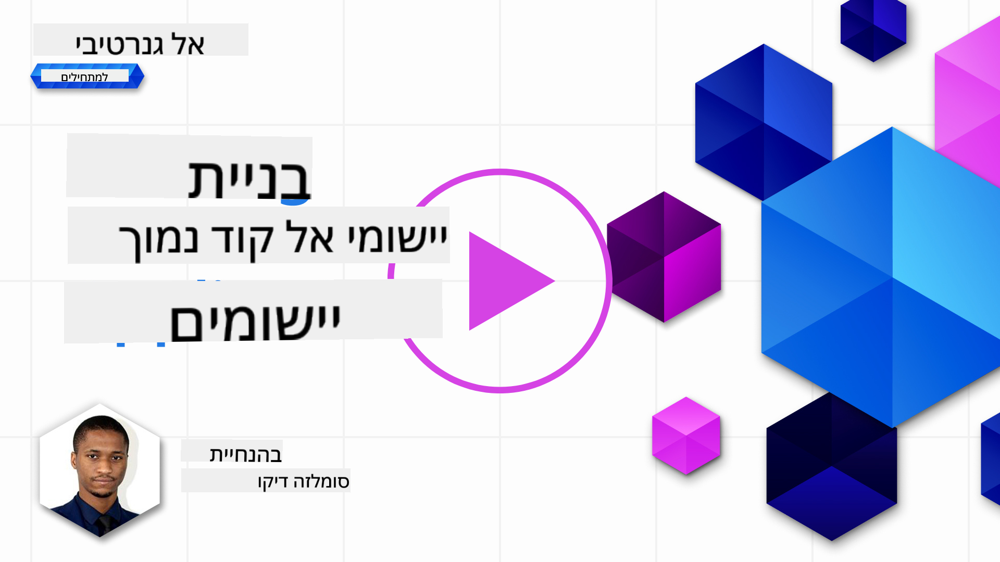
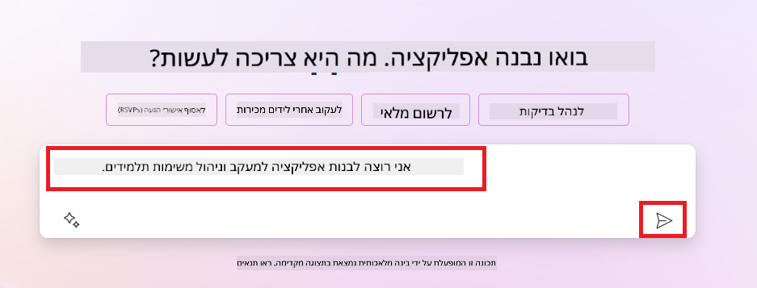
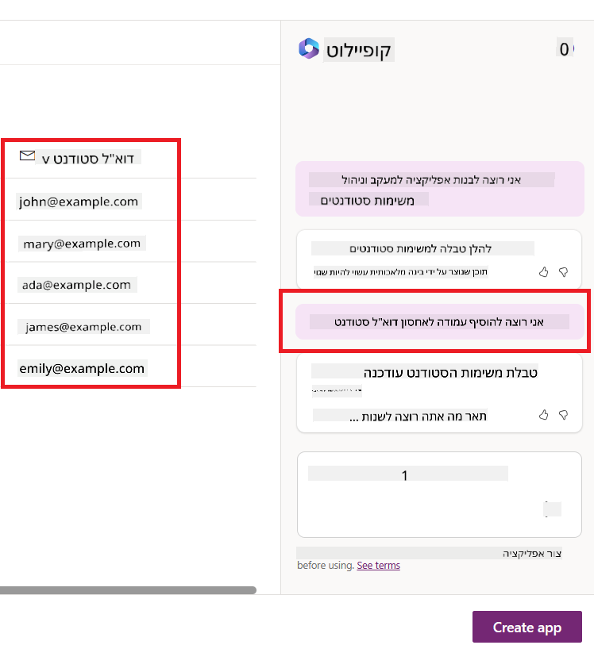

<!--
CO_OP_TRANSLATOR_METADATA:
{
  "original_hash": "846ac8e3b7dcfb697d3309fec05f0fea",
  "translation_date": "2025-10-17T20:04:57+00:00",
  "source_file": "10-building-low-code-ai-applications/README.md",
  "language_code": "he"
}
-->
# בניית יישומי AI בקוד נמוך

> _(לחצו על התמונה למעלה לצפייה בסרטון של השיעור הזה)_

## מבוא

עכשיו, לאחר שלמדנו כיצד לבנות יישומים ליצירת תמונות, בואו נדבר על קוד נמוך. AI גנרטיבי יכול לשמש למגוון תחומים שונים, כולל קוד נמוך, אבל מה זה קוד נמוך וכיצד ניתן להוסיף לו AI?

בניית יישומים ופתרונות הפכה לקלה יותר עבור מפתחים מסורתיים וגם עבור מי שאינם מפתחים באמצעות שימוש בפלטפורמות פיתוח בקוד נמוך. פלטפורמות אלו מאפשרות לבנות יישומים ופתרונות עם מעט או ללא קוד כלל. הדבר מתאפשר באמצעות סביבת פיתוח חזותית שמאפשרת לגרור ולשחרר רכיבים כדי לבנות יישומים ופתרונות. כך ניתן לבנות יישומים ופתרונות במהירות ובמשאבים פחותים. בשיעור הזה, נעמיק כיצד להשתמש בקוד נמוך וכיצד לשפר את הפיתוח בקוד נמוך עם AI באמצעות Power Platform.

פלטפורמת Power Platform מספקת לארגונים את ההזדמנות להעצים את הצוותים שלהם לבנות פתרונות משלהם באמצעות סביבת קוד נמוך או ללא קוד אינטואיטיבית. סביבת זו מסייעת לפשט את תהליך בניית הפתרונות. עם Power Platform, ניתן לבנות פתרונות תוך ימים או שבועות במקום חודשים או שנים. Power Platform כוללת חמישה מוצרים מרכזיים: Power Apps, Power Automate, Power BI, Power Pages ו-Copilot Studio.

השיעור הזה מכסה:

- מבוא ל-AI גנרטיבי ב-Power Platform
- מבוא ל-Copilot וכיצד להשתמש בו
- שימוש ב-AI גנרטיבי לבניית יישומים וזרימות עבודה ב-Power Platform
- הבנת מודלי AI ב-Power Platform עם AI Builder

## מטרות למידה

בסוף השיעור הזה, תוכלו:

- להבין כיצד Copilot עובד ב-Power Platform.

- לבנות יישום מעקב אחר משימות תלמידים עבור חברת הסטארטאפ שלנו בתחום החינוך.

- לבנות זרימת עבודה לעיבוד חשבוניות שמשתמשת ב-AI כדי לחלץ מידע מחשבוניות.

- ליישם שיטות עבודה מומלצות בעת שימוש במודל AI ליצירת טקסט עם GPT.

הכלים והטכנולוגיות שתשתמשו בהם בשיעור הזה הם:

- **Power Apps**, עבור יישום מעקב אחר משימות תלמידים, המספק סביבת פיתוח בקוד נמוך לבניית יישומים למעקב, ניהול ואינטראקציה עם נתונים.

- **Dataverse**, לאחסון הנתונים של יישום מעקב אחר משימות תלמידים, שבו Dataverse יספק פלטפורמת נתונים בקוד נמוך לאחסון נתוני היישום.

- **Power Automate**, עבור זרימת העבודה לעיבוד חשבוניות, שבו תהיה לכם סביבת פיתוח בקוד נמוך לבניית זרימות עבודה לאוטומציה של תהליך עיבוד החשבוניות.

- **AI Builder**, עבור מודל ה-AI לעיבוד חשבוניות, שבו תשתמשו במודלי AI מובנים לעיבוד החשבוניות עבור חברת הסטארטאפ שלנו.

## AI גנרטיבי ב-Power Platform

שיפור הפיתוח והיישום בקוד נמוך עם AI גנרטיבי הוא תחום מפתח עבור Power Platform. המטרה היא לאפשר לכל אחד לבנות יישומים, אתרים, לוחות מחוונים ולבצע אוטומציה של תהליכים עם AI, _מבלי לדרוש מומחיות במדעי הנתונים_. מטרה זו מושגת על ידי שילוב AI גנרטיבי בחוויית הפיתוח בקוד נמוך ב-Power Platform בצורה של Copilot ו-AI Builder.

### איך זה עובד?

Copilot הוא עוזר AI שמאפשר לכם לבנות פתרונות ב-Power Platform על ידי תיאור הדרישות שלכם בסדרה של שלבים שיחיים באמצעות שפה טבעית. לדוגמה, תוכלו להנחות את עוזר ה-AI שלכם לציין אילו שדות היישום שלכם ישתמש בהם והוא ייצור גם את היישום וגם את מודל הנתונים הבסיסי, או שתוכלו לציין כיצד להגדיר זרימה ב-Power Automate.

ניתן להשתמש בפונקציות המונעות על ידי Copilot כתכונה במסכי היישום שלכם כדי לאפשר למשתמשים לגלות תובנות באמצעות אינטראקציות שיחיות.

AI Builder הוא יכולת AI בקוד נמוך הזמינה ב-Power Platform שמאפשרת לכם להשתמש במודלי AI כדי לעזור לכם לבצע אוטומציה של תהליכים ולחזות תוצאות. עם AI Builder תוכלו להביא AI ליישומים ולזרימות עבודה שמתחברות לנתונים שלכם ב-Dataverse או במקורות נתונים בענן שונים, כמו SharePoint, OneDrive או Azure.

Copilot זמין בכל מוצרי Power Platform: Power Apps, Power Automate, Power BI, Power Pages ו-Power Virtual Agents. AI Builder זמין ב-Power Apps וב-Power Automate. בשיעור הזה, נתמקד כיצד להשתמש ב-Copilot וב-AI Builder ב-Power Apps וב-Power Automate כדי לבנות פתרון עבור חברת הסטארטאפ שלנו בתחום החינוך.

### Copilot ב-Power Apps

כחלק מ-Power Platform, Power Apps מספקת סביבת פיתוח בקוד נמוך לבניית יישומים למעקב, ניהול ואינטראקציה עם נתונים. מדובר במערך שירותי פיתוח יישומים עם פלטפורמת נתונים ניתנת להרחבה ויכולת להתחבר לשירותי ענן ולנתונים מקומיים. Power Apps מאפשרת לבנות יישומים שפועלים בדפדפנים, טאבלטים וטלפונים, וניתן לשתף אותם עם עמיתים לעבודה. Power Apps מקלה על המשתמשים להיכנס לעולם פיתוח היישומים עם ממשק פשוט, כך שכל משתמש עסקי או מפתח מקצועי יכול לבנות יישומים מותאמים אישית. חוויית פיתוח היישומים גם משופרת עם AI גנרטיבי באמצעות Copilot.

תכונת עוזר ה-AI Copilot ב-Power Apps מאפשרת לכם לתאר איזה סוג יישום אתם צריכים ואיזה מידע אתם רוצים שהיישום שלכם יעקוב אחריו, יאסוף או יציג. Copilot יוצר יישום Canvas רספונסיבי בהתבסס על התיאור שלכם. לאחר מכן תוכלו להתאים את היישום לצרכים שלכם. עוזר ה-AI Copilot גם יוצר ומציע טבלת Dataverse עם השדות שאתם צריכים כדי לאחסן את הנתונים שאתם רוצים לעקוב אחריהם וכמה נתוני דוגמה. נבחן מהו Dataverse וכיצד תוכלו להשתמש בו ב-Power Apps בשיעור הזה בהמשך. לאחר מכן תוכלו להתאים את הטבלה לצרכים שלכם באמצעות תכונת עוזר ה-AI Copilot דרך שלבים שיחיים. תכונה זו זמינה ישירות ממסך הבית של Power Apps.

### Copilot ב-Power Automate

כחלק מ-Power Platform, Power Automate מאפשר למשתמשים ליצור זרימות עבודה אוטומטיות בין יישומים ושירותים. הוא מסייע באוטומציה של תהליכים עסקיים חוזרים כמו תקשורת, איסוף נתונים ואישורי החלטות. הממשק הפשוט שלו מאפשר למשתמשים בכל רמת מיומנות טכנית (ממתחילים ועד מפתחים מנוסים) לאוטומט משימות עבודה. חוויית פיתוח הזרימות גם משופרת עם AI גנרטיבי באמצעות Copilot.

תכונת עוזר ה-AI Copilot ב-Power Automate מאפשרת לכם לתאר איזה סוג זרימה אתם צריכים ואילו פעולות אתם רוצים שהזרימה שלכם תבצע. Copilot יוצר זרימה בהתבסס על התיאור שלכם. לאחר מכן תוכלו להתאים את הזרימה לצרכים שלכם. עוזר ה-AI Copilot גם יוצר ומציע את הפעולות שאתם צריכים כדי לבצע את המשימה שאתם רוצים לאוטומט. נבחן מהן זרימות וכיצד תוכלו להשתמש בהן ב-Power Automate בשיעור הזה בהמשך. לאחר מכן תוכלו להתאים את הפעולות לצרכים שלכם באמצעות תכונת עוזר ה-AI Copilot דרך שלבים שיחיים. תכונה זו זמינה ישירות ממסך הבית של Power Automate.

## משימה: ניהול משימות תלמידים וחשבוניות עבור חברת הסטארטאפ שלנו, באמצעות Copilot

חברת הסטארטאפ שלנו מספקת קורסים מקוונים לתלמידים. החברה גדלה במהירות וכעת מתקשה לעמוד בביקוש לקורסים שלה. החברה שכרה אתכם כמפתחי Power Platform כדי לעזור להם לבנות פתרון בקוד נמוך שיסייע להם לנהל את משימות התלמידים והחשבוניות שלהם. הפתרון שלהם צריך להיות מסוגל לעזור להם לעקוב ולנהל משימות תלמידים באמצעות יישום ולבצע אוטומציה של תהליך עיבוד החשבוניות באמצעות זרימת עבודה. התבקשתם להשתמש ב-AI גנרטיבי כדי לפתח את הפתרון.

כשאתם מתחילים להשתמש ב-Copilot, תוכלו להשתמש ב-[ספריית ההנחיות של Power Platform Copilot](https://github.com/pnp/powerplatform-prompts?WT.mc_id=academic-109639-somelezediko) כדי להתחיל עם ההנחיות. ספרייה זו מכילה רשימת הנחיות שתוכלו להשתמש בהן כדי לבנות יישומים וזרימות עבודה עם Copilot. תוכלו גם להשתמש בהנחיות שבספרייה כדי לקבל רעיונות כיצד לתאר את הדרישות שלכם ל-Copilot.

### בניית יישום מעקב אחר משימות תלמידים עבור חברת הסטארטאפ שלנו

המורים בחברת הסטארטאפ שלנו מתקשים לעקוב אחר משימות התלמידים. הם השתמשו בגיליון אלקטרוני כדי לעקוב אחר המשימות, אבל זה הפך לקשה לניהול ככל שמספר התלמידים גדל. הם ביקשו מכם לבנות יישום שיעזור להם לעקוב ולנהל את משימות התלמידים. היישום צריך לאפשר להם להוסיף משימות חדשות, לצפות במשימות, לעדכן משימות ולמחוק משימות. היישום צריך גם לאפשר למורים ולתלמידים לצפות במשימות שנבדקו ובאלו שעדיין לא נבדקו.

תבנו את היישום באמצעות Copilot ב-Power Apps לפי השלבים הבאים:

1. עברו למסך הבית של [Power Apps](https://make.powerapps.com?WT.mc_id=academic-105485-koreyst).

1. השתמשו באזור הטקסט במסך הבית כדי לתאר את היישום שאתם רוצים לבנות. לדוגמה, **_אני רוצה לבנות יישום למעקב וניהול משימות תלמידים_**. לחצו על כפתור **שלח** כדי לשלוח את ההנחיה ל-Copilot.

1. Copilot יציע טבלת Dataverse עם השדות שאתם צריכים כדי לאחסן את הנתונים שאתם רוצים לעקוב אחריהם וכמה נתוני דוגמה. לאחר מכן תוכלו להתאים את הטבלה לצרכים שלכם באמצעות תכונת עוזר ה-AI Copilot דרך שלבים שיחיים.

   > **חשוב**: Dataverse הוא פלטפורמת הנתונים הבסיסית של Power Platform. מדובר בפלטפורמת נתונים בקוד נמוך לאחסון נתוני היישום. זהו שירות מנוהל לחלוטין שמאחסן נתונים בצורה מאובטחת בענן של Microsoft ומוקצה בתוך סביבת Power Platform שלכם. הוא מגיע עם יכולות ניהול נתונים מובנות, כמו סיווג נתונים, שושלת נתונים, בקרת גישה מדויקת ועוד. תוכלו ללמוד עוד על Dataverse [כאן](https://docs.microsoft.com/powerapps/maker/data-platform/data-platform-intro?WT.mc_id=academic-109639-somelezediko).

1. המורים רוצים לשלוח מיילים לתלמידים שהגישו את המשימות שלהם כדי לעדכן אותם על התקדמות המשימות שלהם. תוכלו להשתמש ב-Copilot כדי להוסיף שדה חדש לטבלה לאחסון כתובת המייל של התלמיד. לדוגמה, תוכלו להשתמש בהנחיה הבאה כדי להוסיף שדה חדש לטבלה: **_אני רוצה להוסיף עמודה לאחסון כתובת המייל של התלמיד_**. לחצו על כפתור **שלח** כדי לשלוח את ההנחיה ל-Copilot.

1. Copilot ייצור שדה חדש ולאחר מכן תוכלו להתאים את השדה לצרכים שלכם.

1. לאחר שתסיימו עם הטבלה, לחצו על כפתור **צור יישום** כדי ליצור את היישום.

1. Copilot ייצור יישום Canvas רספונסיבי בהתבסס על התיאור שלכם. לאחר מכן תוכלו להתאים את היישום לצרכים שלכם.

1. כדי שהמורים יוכלו לשלוח מיילים לתלמידים, תוכלו להשתמש ב-Copilot כדי להוסיף מסך חדש ליישום. לדוגמה, תוכלו להשתמש בהנחיה הבאה כדי להוסיף מסך חדש ליישום: **_אני רוצה להוסיף מסך לשליחת מיילים לתלמידים_**. לחצו על כפתור **שלח** כדי לשלוח את ההנחיה ל-Copilot.

1. Copilot ייצור מסך חדש ולאחר מכן תוכלו להתאים את המסך לצרכים שלכם.

1. לאחר שתסיימו עם היישום, לחצו על כפתור **שמור** כדי לשמור את היישום.

1. כדי לשתף את היישום עם המורים, לחצו על כפתור **שתף** ולאחר מכן לחצו שוב על כפתור **שתף**. תוכלו לשתף את היישום עם המורים על ידי הזנת כתובות המייל שלהם.

> **שיעורי בית**: היישום שבניתם הוא התחלה טובה אך ניתן לשפר אותו. עם תכונת המייל, המורים יכולים לשלוח מיילים לתלמידים רק באופן ידני על ידי הקלדת כתובות המייל שלהם. האם תוכלו להשתמש ב-Copilot כדי לבנות אוטומציה שתאפשר למורים לשלוח מיילים לתלמידים באופן אוטומטי כאשר הם מגישים את המשימות שלהם? הרמז שלכם הוא שבעזרת ההנחיה הנכונה תוכלו להשתמש ב-Copilot ב-Power Automate כדי לבנות זאת.

### בניית טבלת מידע על חשבוניות עבור חברת הסטארטאפ שלנו

צוות הכספים של חברת הסטארטאפ שלנו מתקשה לעקוב אחר חשבוניות. הם השתמשו בגיליון אלקטרוני כדי לעקוב אחר החשבוניות, אבל זה הפך לקשה לניהול ככל שמספר החשבוניות גדל. הם ביקשו מכם לבנות טבלה שתעזור להם לאחסן, לעקוב ולנהל את המידע של החשבוניות שהם קיבלו. הטבלה צריכה לשמש לבניית אוטומציה שתוציא את כל המידע מהחשבוניות ותאחסן אותו בטבלה. הטבלה צריכה גם לאפשר לצוות הכספים לצפות בחשבוניות ששולמו ובאלו שעדיין לא שולמו.

פלטפורמת Power Platform כוללת פלטפורמת נתונים בסיסית בשם Dataverse שמאפשרת לכם לאחסן את הנתונים עבור היישומים והפתרונות שלכם. Dataverse מספקת פלטפורמת נתונים בקוד נמוך לאחסון נתוני היישום. מדובר בשירות מנוהל לחלוטין שמאחסן נתונים בצורה מאובטחת בענן של Microsoft ומוקצה בתוך סביבת Power Platform שלכם. הוא מגיע עם יכולות ניהול נתונים מובנות, כמו סיווג נתונים, שושלת נתונים, בקרת גישה מדויקת ועוד. תוכלו ללמוד עוד [על Dataverse כאן](https://docs.microsoft.com/powerapps/maker/data-platform/data-platform-intro?WT.mc_id=academic-109639-somelezediko).
מדוע כדאי להשתמש ב-Dataverse עבור הסטארטאפ שלנו? הטבלאות הסטנדרטיות והמותאמות אישית בתוך Dataverse מספקות אפשרות אחסון מאובטחת ומבוססת ענן עבור הנתונים שלכם. הטבלאות מאפשרות לכם לאחסן סוגים שונים של נתונים, בדומה לשימוש במספר גיליונות עבודה בתוך חוברת עבודה אחת של Excel. ניתן להשתמש בטבלאות כדי לאחסן נתונים ספציפיים לצרכים של הארגון או העסק שלכם. כמה מהיתרונות שהסטארטאפ שלנו יקבל משימוש ב-Dataverse כוללים, אך לא מוגבלים ל:

- **קל לניהול**: גם המטא-נתונים וגם הנתונים נשמרים בענן, כך שאין צורך לדאוג לפרטים כיצד הם נשמרים או מנוהלים. תוכלו להתמקד בבניית האפליקציות והפתרונות שלכם.

- **מאובטח**: Dataverse מספק אפשרות אחסון מאובטחת ומבוססת ענן עבור הנתונים שלכם. ניתן לשלוט מי יכול לגשת לנתונים בטבלאות שלכם וכיצד הם יכולים לגשת אליהם באמצעות אבטחה מבוססת תפקידים.

- **מטא-נתונים עשירים**: סוגי נתונים וקשרים משמשים ישירות בתוך Power Apps.

- **לוגיקה ואימות**: ניתן להשתמש בכללי עסק, שדות מחושבים וכללי אימות כדי לאכוף לוגיקה עסקית ולשמור על דיוק הנתונים.

עכשיו כשאתם יודעים מה זה Dataverse ולמה כדאי להשתמש בו, בואו נסתכל איך אפשר להשתמש ב-Copilot כדי ליצור טבלה ב-Dataverse שתענה על הדרישות של צוות הכספים שלנו.

> **Note**: תשתמשו בטבלה הזו בחלק הבא כדי לבנות אוטומציה שתוציא את כל המידע מהחשבוניות ותשמור אותו בטבלה.

כדי ליצור טבלה ב-Dataverse באמצעות Copilot, בצעו את השלבים הבאים:

1. נווטו למסך הבית של [Power Apps](https://make.powerapps.com?WT.mc_id=academic-105485-koreyst).

2. בסרגל הניווט השמאלי, בחרו ב-**Tables** ואז לחצו על **Describe the new Table**.

3. במסך **Describe the new Table**, השתמשו באזור הטקסט כדי לתאר את הטבלה שאתם רוצים ליצור. לדוגמה, **_אני רוצה ליצור טבלה לאחסון מידע על חשבוניות_**. לחצו על כפתור **Send** כדי לשלוח את ההנחיה ל-AI Copilot.

4. ה-AI Copilot יציע טבלת Dataverse עם השדות הדרושים לאחסון הנתונים שאתם רוצים לעקוב אחריהם וכמה נתונים לדוגמה. לאחר מכן תוכלו להתאים את הטבלה לצרכים שלכם באמצעות תכונת העוזר של AI Copilot דרך שלבים שיחתיים.

5. צוות הכספים רוצה לשלוח דוא"ל לספק כדי לעדכן אותו במצב הנוכחי של החשבונית שלו. תוכלו להשתמש ב-Copilot כדי להוסיף שדה חדש לטבלה לאחסון כתובת הדוא"ל של הספק. לדוגמה, תוכלו להשתמש בהנחיה הבאה כדי להוסיף שדה חדש לטבלה: **_אני רוצה להוסיף עמודה לאחסון כתובת דוא"ל של הספק_**. לחצו על כפתור **Send** כדי לשלוח את ההנחיה ל-AI Copilot.

6. ה-AI Copilot ייצור שדה חדש ולאחר מכן תוכלו להתאים את השדה לצרכים שלכם.

7. לאחר שתסיימו עם הטבלה, לחצו על כפתור **Create** כדי ליצור את הטבלה.

## מודלים של AI בפלטפורמת Power עם AI Builder

AI Builder הוא יכולת AI בקוד נמוך הזמינה בפלטפורמת Power שמאפשרת לכם להשתמש במודלים של AI כדי לעזור לכם לאוטומט תהליכים ולחזות תוצאות. עם AI Builder תוכלו לשלב AI באפליקציות ובזרימות שמתחברות לנתונים שלכם ב-Dataverse או במקורות נתונים בענן שונים, כמו SharePoint, OneDrive או Azure.

## מודלים AI מובנים מול מודלים AI מותאמים אישית

AI Builder מספק שני סוגים של מודלים AI: מודלים AI מובנים ומודלים AI מותאמים אישית. מודלים AI מובנים הם מודלים AI מוכנים לשימוש שמאומנים על ידי Microsoft וזמינים בפלטפורמת Power. הם עוזרים להוסיף אינטליגנציה לאפליקציות ולזרימות שלכם מבלי שתצטרכו לאסוף נתונים ואז לבנות, לאמן ולפרסם את המודלים שלכם. ניתן להשתמש במודלים אלו כדי לאוטומט תהליכים ולחזות תוצאות.

כמה מהמודלים AI המובנים הזמינים בפלטפורמת Power כוללים:

- **Key Phrase Extraction**: מודל זה מוציא ביטויים מרכזיים מטקסט.
- **Language Detection**: מודל זה מזהה את השפה של טקסט.
- **Sentiment Analysis**: מודל זה מזהה רגשות חיוביים, שליליים, ניטרליים או מעורבים בטקסט.
- **Business Card Reader**: מודל זה מוציא מידע מכרטיסי ביקור.
- **Text Recognition**: מודל זה מוציא טקסט מתמונות.
- **Object Detection**: מודל זה מזהה ומוציא אובייקטים מתמונות.
- **Document processing**: מודל זה מוציא מידע מטפסים.
- **Invoice Processing**: מודל זה מוציא מידע מחשבוניות.

עם מודלים AI מותאמים אישית תוכלו להביא את המודל שלכם ל-AI Builder כך שהוא יוכל לתפקד כמו כל מודל מותאם אישית של AI Builder, מה שמאפשר לכם לאמן את המודל באמצעות הנתונים שלכם. ניתן להשתמש במודלים אלו כדי לאוטומט תהליכים ולחזות תוצאות גם ב-Power Apps וגם ב-Power Automate. כאשר משתמשים במודל שלכם יש מגבלות שחלות. קראו עוד על המגבלות האלו [כאן](https://learn.microsoft.com/ai-builder/byo-model#limitations?WT.mc_id=academic-105485-koreyst).

## משימה #2 - בניית זרימת עיבוד חשבוניות עבור הסטארטאפ שלנו

צוות הכספים מתקשה לעבד חשבוניות. הם השתמשו בגיליון אלקטרוני כדי לעקוב אחר החשבוניות, אך זה הפך לקשה לניהול ככל שמספר החשבוניות גדל. הם ביקשו מכם לבנות זרימת עבודה שתעזור להם לעבד חשבוניות באמצעות AI. זרימת העבודה צריכה לאפשר להם להוציא מידע מחשבוניות ולשמור את המידע בטבלת Dataverse. זרימת העבודה צריכה גם לאפשר להם לשלוח דוא"ל לצוות הכספים עם המידע שהוצא.

עכשיו כשאתם יודעים מה זה AI Builder ולמה כדאי להשתמש בו, בואו נסתכל איך אפשר להשתמש במודל AI לעיבוד חשבוניות ב-AI Builder, עליו דיברנו קודם, כדי לבנות זרימת עבודה שתעזור לצוות הכספים לעבד חשבוניות.

כדי לבנות זרימת עבודה שתעזור לצוות הכספים לעבד חשבוניות באמצעות מודל AI לעיבוד חשבוניות ב-AI Builder, בצעו את השלבים הבאים:

1. נווטו למסך הבית של [Power Automate](https://make.powerautomate.com?WT.mc_id=academic-105485-koreyst).

2. השתמשו באזור הטקסט במסך הבית כדי לתאר את זרימת העבודה שאתם רוצים לבנות. לדוגמה, **_עבד חשבונית כשהיא מגיעה לתיבת הדואר שלי_**. לחצו על כפתור **Send** כדי לשלוח את ההנחיה ל-AI Copilot.

   

3. ה-AI Copilot יציע את הפעולות שאתם צריכים לבצע כדי לבצע את המשימה שאתם רוצים לאוטומט. תוכלו ללחוץ על כפתור **Next** כדי לעבור לשלבים הבאים.

4. בשלב הבא, Power Automate יבקש מכם להגדיר את החיבורים הנדרשים לזרימה. לאחר שתסיימו, לחצו על כפתור **Create flow** כדי ליצור את הזרימה.

5. ה-AI Copilot ייצור זרימה ולאחר מכן תוכלו להתאים את הזרימה לצרכים שלכם.

6. עדכנו את הטריגר של הזרימה והגדירו את **Folder** לתיקייה שבה יישמרו החשבוניות. לדוגמה, תוכלו להגדיר את התיקייה ל-**Inbox**. לחצו על **Show advanced options** והגדירו את **Only with Attachments** ל-**Yes**. זה יבטיח שהזרימה תפעל רק כאשר מתקבל דוא"ל עם קובץ מצורף בתיקייה.

7. הסירו את הפעולות הבאות מהזרימה: **HTML to text**, **Compose**, **Compose 2**, **Compose 3** ו-**Compose 4** מכיוון שלא תשתמשו בהן.

8. הסירו את פעולת **Condition** מהזרימה מכיוון שלא תשתמשו בה. זה צריך להיראות כמו צילום המסך הבא:

   

9. לחצו על כפתור **Add an action** וחפשו את **Dataverse**. בחרו בפעולה **Add a new row**.

10. בפעולה **Extract Information from invoices**, עדכנו את **Invoice File** כך שיצביע על **Attachment Content** מהדוא"ל. זה יבטיח שהזרימה תוציא מידע מקובץ החשבונית המצורף.

11. בחרו את **Table** שיצרתם קודם. לדוגמה, תוכלו לבחור את טבלת **Invoice Information**. בחרו את התוכן הדינמי מהפעולה הקודמת כדי למלא את השדות הבאים:

    - ID
    - Amount
    - Date
    - Name
    - Status - הגדירו את **Status** ל-**Pending**.
    - Supplier Email - השתמשו בתוכן הדינמי **From** מהטריגר **When a new email arrives**.

    

12. לאחר שתסיימו עם הזרימה, לחצו על כפתור **Save** כדי לשמור את הזרימה. לאחר מכן תוכלו לבדוק את הזרימה על ידי שליחת דוא"ל עם חשבונית לתיקייה שציינתם בטריגר.

> **המשימה שלכם**: הזרימה שבניתם היא התחלה טובה, עכשיו עליכם לחשוב איך תוכלו לבנות אוטומציה שתאפשר לצוות הכספים שלנו לשלוח דוא"ל לספק כדי לעדכן אותו במצב הנוכחי של החשבונית שלו. רמז: הזרימה חייבת לפעול כאשר מצב החשבונית משתנה.

## שימוש במודל AI ליצירת טקסט ב-Power Automate

מודל Create Text with GPT AI ב-AI Builder מאפשר לכם ליצור טקסט בהתבסס על הנחיה ומופעל על ידי Microsoft Azure OpenAI Service. עם יכולת זו, תוכלו לשלב את טכנולוגיית GPT (Generative Pre-Trained Transformer) באפליקציות ובזרימות שלכם כדי לבנות מגוון זרימות אוטומטיות ואפליקציות תובנתיות.

מודלי GPT עוברים הכשרה נרחבת על כמויות עצומות של נתונים, מה שמאפשר להם לייצר טקסט שדומה מאוד לשפה אנושית כאשר מספקים להם הנחיה. כאשר משלבים אותם עם אוטומציה של זרימות עבודה, מודלי AI כמו GPT יכולים להיות מנוצלים כדי לייעל ולאוטומט מגוון רחב של משימות.

לדוגמה, תוכלו לבנות זרימות כדי ליצור טקסט באופן אוטומטי עבור מגוון שימושים, כמו: טיוטות של דוא"ל, תיאורי מוצרים ועוד. תוכלו גם להשתמש במודל כדי ליצור טקסט עבור מגוון אפליקציות, כמו צ'אטבוטים ואפליקציות שירות לקוחות שמאפשרות לנציגי שירות לקוחות להגיב בצורה יעילה ואפקטיבית לשאלות של לקוחות.

כדי ללמוד איך להשתמש במודל AI זה ב-Power Automate, עברו על המודול [Add intelligence with AI Builder and GPT](https://learn.microsoft.com/training/modules/ai-builder-text-generation/?WT.mc_id=academic-109639-somelezediko).

## עבודה מצוינת! המשיכו ללמוד

לאחר שסיימתם את השיעור הזה, בדקו את [אוסף הלמידה של Generative AI](https://aka.ms/genai-collection?WT.mc_id=academic-105485-koreyst) כדי להמשיך לשפר את הידע שלכם ב-Generative AI!

עברו לשיעור 11 שבו נסתכל איך [לשלב Generative AI עם קריאת פונקציות](../11-integrating-with-function-calling/README.md?WT.mc_id=academic-105485-koreyst)!

---

**כתב ויתור**:  
מסמך זה תורגם באמצעות שירות תרגום AI [Co-op Translator](https://github.com/Azure/co-op-translator). למרות שאנו שואפים לדיוק, יש לקחת בחשבון שתרגומים אוטומטיים עשויים להכיל שגיאות או אי דיוקים. המסמך המקורי בשפתו המקורית צריך להיחשב כמקור סמכותי. עבור מידע קריטי, מומלץ להשתמש בתרגום מקצועי אנושי. איננו אחראים לאי הבנות או לפרשנויות שגויות הנובעות משימוש בתרגום זה.