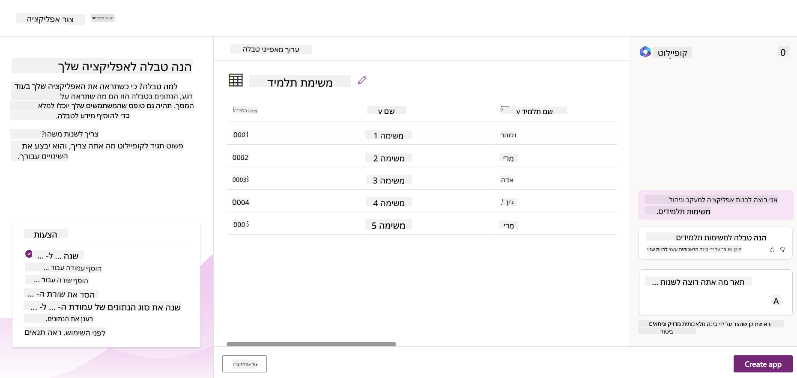
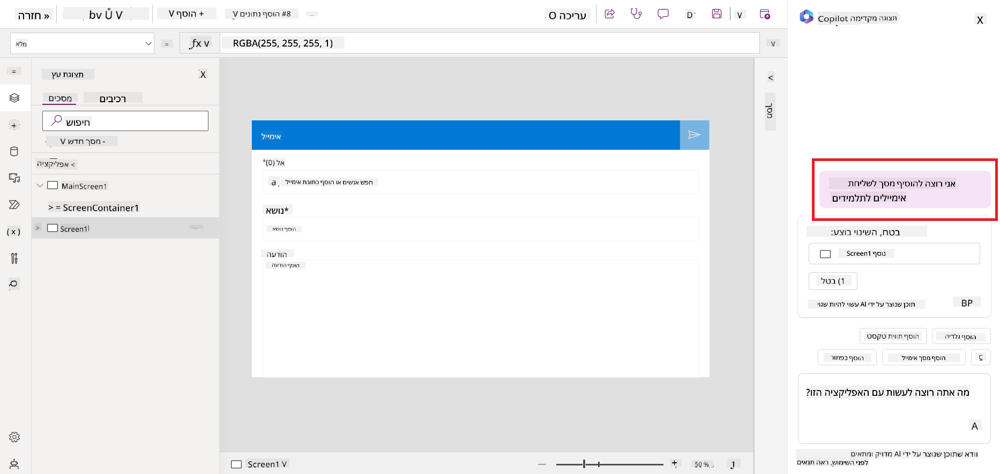
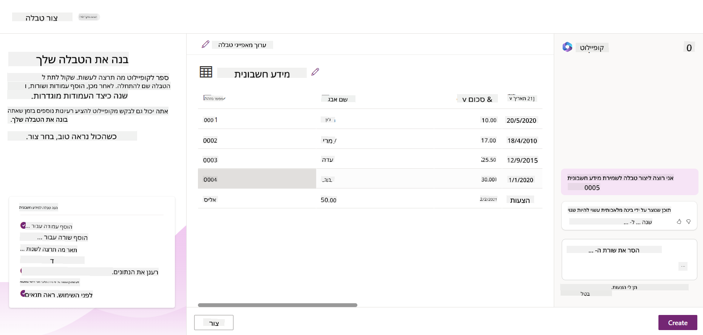
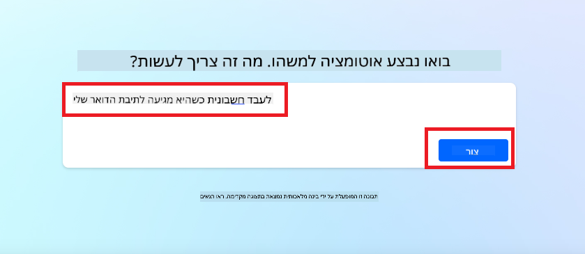
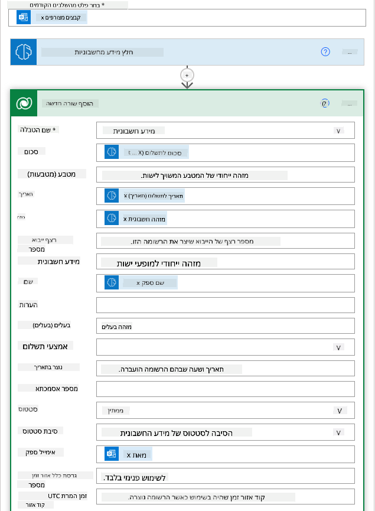
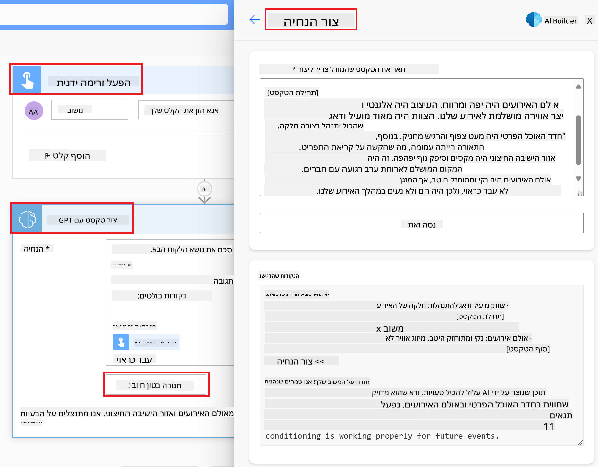

<!--
CO_OP_TRANSLATOR_METADATA:
{
  "original_hash": "f5ff3b6204a695a117d6f452403c95f7",
  "translation_date": "2025-07-09T14:05:38+00:00",
  "source_file": "10-building-low-code-ai-applications/README.md",
  "language_code": "he"
}
-->
# בניית יישומי AI בקוד נמוך

> _(לחצו על התמונה למעלה לצפייה בסרטון של השיעור)_

## מבוא

כעת, לאחר שלמדנו כיצד לבנות יישומים ליצירת תמונות, בואו נדבר על קוד נמוך. ניתן להשתמש ב-AI גנרטיבי במגוון תחומים שונים, כולל קוד נמוך, אבל מה זה קוד נמוך ואיך אפשר להוסיף לו AI?

בניית אפליקציות ופתרונות הפכה לקלה יותר למפתחים מסורתיים ולא-מפתחים באמצעות פלטפורמות פיתוח בקוד נמוך. פלטפורמות אלו מאפשרות לבנות אפליקציות ופתרונות עם מעט או ללא קוד כלל. זה מושג על ידי מתן סביבה ויזואלית לפיתוח שמאפשרת גרירה ושחרור של רכיבים לבניית האפליקציות והפתרונות. כך ניתן לבנות אפליקציות ופתרונות מהר יותר ובמשאבים פחותים. בשיעור זה נצלול לעומק כיצד להשתמש בקוד נמוך ואיך לשפר את הפיתוח בקוד נמוך עם AI באמצעות Power Platform.

Power Platform מעניקה לארגונים הזדמנות להעצים את הצוותים שלהם לבנות פתרונות משלהם בסביבה אינטואיטיבית של קוד נמוך או ללא קוד. סביבה זו מפשטת את תהליך בניית הפתרונות. עם Power Platform, ניתן לבנות פתרונות בתוך ימים או שבועות במקום חודשים או שנים. Power Platform מורכבת מחמישה מוצרים מרכזיים: Power Apps, Power Automate, Power BI, Power Pages ו-Copilot Studio.

השיעור כולל:

- מבוא ל-AI גנרטיבי ב-Power Platform  
- מבוא ל-Copilot ואיך להשתמש בו  
- שימוש ב-AI גנרטיבי לבניית אפליקציות וזרימות ב-Power Platform  
- הבנת מודלי ה-AI ב-Power Platform עם AI Builder  

## מטרות הלמידה

בסיום השיעור תוכלו:

- להבין כיצד Copilot פועל ב-Power Platform.  
- לבנות אפליקציית מעקב משימות לסטודנטים עבור הסטארטאפ שלנו בתחום החינוך.  
- לבנות זרימת עיבוד חשבוניות שמשתמשת ב-AI לחילוץ מידע מהחשבוניות.  
- ליישם שיטות עבודה מומלצות בשימוש במודל ה-AI Create Text עם GPT.  

הכלים והטכנולוגיות שתשתמשו בהם בשיעור זה הם:

- **Power Apps**, לאפליקציית מעקב המשימות לסטודנטים, המספקת סביבה לפיתוח בקוד נמוך לבניית אפליקציות למעקב, ניהול ואינטראקציה עם נתונים.  
- **Dataverse**, לאחסון הנתונים של אפליקציית מעקב המשימות, המספק פלטפורמת נתונים בקוד נמוך לאחסון נתוני האפליקציה.  
- **Power Automate**, לזרימת עיבוד החשבוניות, שבה תשתמשו בסביבת פיתוח בקוד נמוך לבניית זרימות עבודה לאוטומציה של תהליך עיבוד החשבוניות.  
- **AI Builder**, למודל ה-AI של עיבוד החשבוניות, שבו תשתמשו במודלים מוכנים מראש לעיבוד החשבוניות עבור הסטארטאפ שלנו.  

## AI גנרטיבי ב-Power Platform

שיפור הפיתוח והיישום בקוד נמוך באמצעות AI גנרטיבי הוא תחום מפתח ב-Power Platform. המטרה היא לאפשר לכל אחד לבנות אפליקציות, אתרים, לוחות מחוונים ואוטומציות מונעות AI, _בלי צורך במומחיות במדעי הנתונים_. מטרה זו מושגת על ידי שילוב AI גנרטיבי בחוויית הפיתוח בקוד נמוך ב-Power Platform באמצעות Copilot ו-AI Builder.

### איך זה עובד?

Copilot הוא עוזר AI שמאפשר לכם לבנות פתרונות ב-Power Platform על ידי תיאור הדרישות שלכם בסדרה של שלבים שיחתיים בשפה טבעית. לדוגמה, תוכלו להנחות את העוזר לציין אילו שדות האפליקציה שלכם תשתמש בהם והוא ייצור גם את האפליקציה וגם את מודל הנתונים התחתון, או שתוכלו לציין כיצד להגדיר זרימה ב-Power Automate.

ניתן להשתמש בפונקציות המונעות Copilot בתור תכונה במסכי האפליקציה שלכם כדי לאפשר למשתמשים לחשוף תובנות דרך אינטראקציות שיחתיות.

AI Builder היא יכולת AI בקוד נמוך הזמינה ב-Power Platform שמאפשרת להשתמש במודלי AI כדי לעזור באוטומציה של תהליכים וחיזוי תוצאות. עם AI Builder ניתן להוסיף AI לאפליקציות ולזרימות שמתחברות לנתונים ב-Dataverse או במקורות נתונים בענן שונים, כמו SharePoint, OneDrive או Azure.

Copilot זמין בכל מוצרי Power Platform: Power Apps, Power Automate, Power BI, Power Pages ו-Power Virtual Agents. AI Builder זמין ב-Power Apps ו-Power Automate. בשיעור זה נתמקד כיצד להשתמש ב-Copilot ו-AI Builder ב-Power Apps ו-Power Automate לבניית פתרון לסטארטאפ החינוכי שלנו.

### Copilot ב-Power Apps

כחלק מ-Power Platform, Power Apps מספקת סביבה לפיתוח בקוד נמוך לבניית אפליקציות למעקב, ניהול ואינטראקציה עם נתונים. זוהי חבילת שירותי פיתוח אפליקציות עם פלטפורמת נתונים ניתנת להרחבה ויכולת להתחבר לשירותי ענן ולנתונים מקומיים. Power Apps מאפשרת לבנות אפליקציות שרצות בדפדפנים, טאבלטים וטלפונים, וניתן לשתף אותן עם עמיתים לעבודה. Power Apps מקלה על המשתמשים להיכנס לפיתוח אפליקציות עם ממשק פשוט, כך שכל משתמש עסקי או מפתח מקצועי יכול לבנות אפליקציות מותאמות אישית. חוויית הפיתוח משתפרת גם באמצעות AI גנרטיבי דרך Copilot.

תכונת העוזר AI Copilot ב-Power Apps מאפשרת לכם לתאר איזה סוג אפליקציה אתם צריכים ואיזה מידע אתם רוצים שהאפליקציה תעקוב, תאסוף או תציג. Copilot יוצר אפליקציית Canvas רספונסיבית בהתבסס על התיאור שלכם. לאחר מכן תוכלו להתאים את האפליקציה לצרכים שלכם. ה-Copilot גם יוצר ומציע טבלת Dataverse עם השדות הדרושים לאחסון הנתונים שברצונכם לעקוב אחריהם ודוגמאות נתונים. נבחן בהמשך השיעור מהו Dataverse וכיצד להשתמש בו ב-Power Apps. תוכלו להתאים את הטבלה לצרכים שלכם באמצעות תכונת העוזר AI Copilot בשלבים שיחתיים. תכונה זו זמינה ישירות ממסך הבית של Power Apps.

### Copilot ב-Power Automate

כחלק מ-Power Platform, Power Automate מאפשר למשתמשים ליצור זרימות עבודה אוטומטיות בין אפליקציות ושירותים. הוא מסייע באוטומציה של תהליכים עסקיים חוזרים כמו תקשורת, איסוף נתונים ואישורי החלטות. הממשק הפשוט מאפשר למשתמשים בכל רמת מיומנות (ממתחילים ועד מפתחים מנוסים) לאוטומט משימות עבודה. חוויית פיתוח הזרימות משתפרת גם היא באמצעות AI גנרטיבי דרך Copilot.

תכונת העוזר AI Copilot ב-Power Automate מאפשרת לכם לתאר איזה סוג זרימה אתם צריכים ואילו פעולות אתם רוצים שהזרימה תבצע. Copilot יוצר זרימה בהתבסס על התיאור שלכם. לאחר מכן תוכלו להתאים את הזרימה לצרכים שלכם. ה-Copilot גם יוצר ומציע את הפעולות הדרושות לביצוע המשימה שברצונכם לאוטומט. נבחן בהמשך השיעור מהן זרימות וכיצד להשתמש בהן ב-Power Automate. תוכלו להתאים את הפעולות לצרכים שלכם באמצעות תכונת העוזר AI Copilot בשלבים שיחתיים. תכונה זו זמינה ישירות ממסך הבית של Power Automate.

## משימה: ניהול משימות סטודנטים וחשבוניות לסטארטאפ שלנו, באמצעות Copilot

הסטארטאפ שלנו מספק קורסים מקוונים לסטודנטים. הסטארטאפ גדל במהירות וכעת מתקשה לעמוד בביקוש לקורסים שלו. הסטארטאפ שכר אתכם כמפתח Power Platform כדי לעזור להם לבנות פתרון בקוד נמוך לניהול משימות הסטודנטים והחשבוניות שלהם. הפתרון שלהם צריך לאפשר מעקב וניהול משימות סטודנטים דרך אפליקציה ואוטומציה של תהליך עיבוד החשבוניות דרך זרימת עבודה. התבקשתם להשתמש ב-AI גנרטיבי לפיתוח הפתרון.

כשתתחילו להשתמש ב-Copilot, תוכלו להשתמש ב-[ספריית הפקודות של Power Platform Copilot](https://github.com/pnp/powerplatform-prompts?WT.mc_id=academic-109639-somelezediko) כדי להתחיל עם הפקודות. ספרייה זו מכילה רשימת פקודות שניתן להשתמש בהן לבניית אפליקציות וזרימות עם Copilot. תוכלו גם להשתמש בפקודות בספרייה כדי לקבל רעיון כיצד לתאר את הדרישות שלכם ל-Copilot.

### בניית אפליקציית מעקב משימות לסטודנטים עבור הסטארטאפ שלנו

המורים בסטארטאפ שלנו מתקשים לעקוב אחרי משימות הסטודנטים. הם השתמשו בגליון אלקטרוני למעקב אחר המשימות, אך זה הפך לקשה לניהול ככל שמספר הסטודנטים גדל. הם ביקשו מכם לבנות אפליקציה שתעזור להם לעקוב ולנהל את משימות הסטודנטים. האפליקציה צריכה לאפשר הוספת משימות חדשות, צפייה במשימות, עדכון מחיקות משימות. האפליקציה צריכה גם לאפשר למורים ולסטודנטים לצפות במשימות שנבדקו ואלו שטרם נבדקו.

תבנו את האפליקציה באמצעות Copilot ב-Power Apps לפי השלבים הבאים:

1. עברו למסך הבית של [Power Apps](https://make.powerapps.com?WT.mc_id=academic-105485-koreyst).

1. השתמשו באזור הטקסט במסך הבית כדי לתאר את האפליקציה שברצונכם לבנות. לדוגמה, **_אני רוצה לבנות אפליקציה למעקב וניהול משימות סטודנטים_**. לחצו על כפתור **שלח** כדי לשלוח את הפקודה ל-Copilot AI.

1. ה-Copilot AI יציע טבלת Dataverse עם השדות הדרושים לאחסון הנתונים שברצונכם לעקוב אחריהם ודוגמאות נתונים. לאחר מכן תוכלו להתאים את הטבלה לצרכים שלכם באמצעות תכונת העוזר AI Copilot בשלבים שיחתיים.

   > **חשוב**: Dataverse היא פלטפורמת הנתונים התחתונה של Power Platform. זוהי פלטפורמת נתונים בקוד נמוך לאחסון נתוני האפליקציה. זוהי שירות מנוהל במלואו המאחסן נתונים בצורה מאובטחת בענן של מיקרוסופט ומסופק בתוך סביבת Power Platform שלכם. היא כוללת יכולות ניהול נתונים מובנות, כגון סיווג נתונים, מעקב מקור הנתונים, בקרת גישה מדויקת ועוד. ניתן ללמוד עוד על Dataverse [כאן](https://docs.microsoft.com/powerapps/maker/data-platform/data-platform-intro?WT.mc_id=academic-109639-somelezediko).

   

1. המורים רוצים לשלוח מיילים לסטודנטים שהגישו את המשימות שלהם כדי לעדכן אותם על התקדמות המשימות. תוכלו להשתמש ב-Copilot כדי להוסיף שדה חדש לטבלה לאחסון כתובת המייל של הסטודנט. לדוגמה, תוכלו להשתמש בפקודה הבאה להוספת שדה חדש לטבלה: **_אני רוצה להוסיף עמודה לאחסון כתובת מייל של סטודנט_**. לחצו על כפתור **שלח** כדי לשלוח את הפקודה ל-Copilot AI.

1. ה-Copilot AI ייצור שדה חדש ולאחר מכן תוכלו להתאים את השדה לצרכים שלכם.

1. לאחר שתסיימו עם הטבלה, לחצו על כפתור **צור אפליקציה** כדי ליצור את האפליקציה.

1. ה-Copilot AI ייצור אפליקציית Canvas רספונסיבית בהתבסס על התיאור שלכם. לאחר מכן תוכלו להתאים את האפליקציה לצרכים שלכם.

1. כדי לאפשר למורים לשלוח מיילים לסטודנטים, תוכלו להשתמש ב-Copilot כדי להוסיף מסך חדש לאפליקציה. לדוגמה, תוכלו להשתמש בפקודה הבאה להוספת מסך חדש לאפליקציה: **_אני רוצה להוסיף מסך לשליחת מיילים לסטודנטים_**. לחצו על כפתור **שלח** כדי לשלוח את הפקודה ל-Copilot AI.

1. ה-Copilot AI ייצור מסך חדש ולאחר מכן תוכלו להתאים את המסך לצרכים שלכם.

1. לאחר שתסיימו עם האפליקציה, לחצו על כפתור **שמור** כדי לשמור את האפליקציה.

1. כדי לשתף את האפליקציה עם המורים, לחצו על כפתור **שתף** ואז לחצו שוב על כפתור **שתף**. תוכלו לשתף את האפליקציה עם המורים על ידי הזנת כתובות המייל שלהם.

> **המשימה הביתית שלכם**: האפליקציה שבניתם היא התחלה טובה אך ניתן לשפרה. עם תכונת המייל, המורים יכולים לשלוח מיילים לסטודנטים רק באופן ידני על ידי הקלדת כתובות המייל שלהם. האם תוכלו להשתמש ב-Copilot כדי לבנות אוטומציה שתאפשר למורים לשלוח מיילים לסטודנטים באופן אוטומטי כאשר הם מגישים את המשימות? הרמז שלכם הוא שבאמצעות הפקודה הנכונה תוכלו להשתמש ב-Copilot ב-Power Automate לבניית זה.

### בניית טבלת מידע על חשבוניות לסטארטאפ שלנו

צוות הכספים של הסטארטאפ שלנו מתקשה לעקוב אחרי החשבוניות. הם השתמשו בגליון אלקטרוני למעקב אחר החשבוניות, אך זה הפך לקשה לניהול ככל שמספר החשבוניות גדל. הם ביקשו מכם לבנות טבלה שתעזור להם לאחסן, לעקוב ולנהל את המידע על החשבוניות שהם מקבלים. הטבלה תשמש לבניית אוטומציה שתחלץ את כל המידע מהחשבוניות ותאחסן אותו בטבלה. הטבלה גם תאפשר לצוות הכספים לצפות בחשבוניות ששולמו ואלו שטרם שולמו.

ל-Power Platform יש פלטפורמת נתונים תחתונה בשם Dataverse שמאפשרת לאחסן את הנתונים של האפליקציות והפתרונות שלכם. Dataverse מספקת פלטפורמת נתונים בקוד נמוך לאחסון נתוני האפליקציה. זוהי שירות מנוהל במלואו המאחסן נתונים בצורה מאובטחת בענן של מיקרוסופט ומסופק בתוך סביבת Power Platform שלכם. היא כוללת יכולות ניהול נתונים מובנות, כגון סיווג נתונים, מעקב מקור הנתונים, בקרת גישה מדויקת ועוד. ניתן ללמוד עוד [על Dataverse כאן](https://docs.microsoft.com/powerapps/maker/data-platform/data-platform-intro?WT.mc_id=academic-109639-somelezediko).

מדוע כדאי להשתמש ב-Dataverse עבור הסטארטאפ שלנו? הטבלאות הסטנדרטיות והמותאמות ב-Dataverse מספקות אפשרות אחסון מאובטחת ומבוססת ענן לנתונים שלכם. טבלאות מאפשרות לאחסן סוגי נתונים שונים, בדומה לאופן שבו משתמשים בגליונות עבודה מרובים בקובץ Excel אחד. ניתן להשתמש בטבלאות לאחסון נתונים ספציפיים לארגון או לצרכי העסק שלכם. חלק מהיתרונות שהסטארטאפ שלנו יקבל משימוש ב-Dataverse כוללים אך לא מוגבלים ל:
- **קל לניהול**: גם המטא-דאטה וגם הנתונים מאוחסנים בענן, כך שלא צריך לדאוג לפרטים של איך הם נשמרים או מנוהלים. אפשר להתמקד בבניית האפליקציות והפתרונות שלכם.

- **מאובטח**: Dataverse מספק אפשרות אחסון מאובטחת ומבוססת ענן לנתונים שלכם. ניתן לשלוט מי יכול לגשת לנתונים בטבלאות שלכם ואיך הם יכולים לגשת אליהם באמצעות אבטחה מבוססת תפקידים.

- **מטא-דאטה עשירה**: סוגי הנתונים והקשרים משולבים ישירות בתוך Power Apps

- **לוגיקה ואימות**: ניתן להשתמש בכללי עסק, שדות מחושבים וכללי אימות כדי לאכוף לוגיקה עסקית ולשמור על דיוק הנתונים.

עכשיו כשאתם יודעים מה זה Dataverse ולמה כדאי להשתמש בו, בואו נבחן איך אפשר להשתמש ב-Copilot כדי ליצור טבלה ב-Dataverse שתענה על דרישות צוות הכספים שלנו.

> **Note** : תשתמשו בטבלה הזו בחלק הבא כדי לבנות אוטומציה שתחלץ את כל המידע מהחשבוניות ותאחסן אותו בטבלה.

כדי ליצור טבלה ב-Dataverse באמצעות Copilot, בצעו את השלבים הבאים:

1. עברו למסך הבית של [Power Apps](https://make.powerapps.com?WT.mc_id=academic-105485-koreyst).

2. בסרגל הניווט השמאלי, בחרו ב-**Tables** ואז לחצו על **Describe the new Table**.

1. במסך **Describe the new Table**, השתמשו באזור הטקסט כדי לתאר את הטבלה שברצונכם ליצור. לדוגמה, **_אני רוצה ליצור טבלה לאחסון מידע על חשבוניות_**. לחצו על כפתור **Send** כדי לשלוח את ההנחיה ל-AI Copilot.

1. ה-AI Copilot יציע טבלה ב-Dataverse עם השדות הדרושים לאחסון הנתונים שברצונכם לעקוב אחריהם וכמה דוגמאות לנתונים. לאחר מכן תוכלו להתאים את הטבלה לצרכים שלכם באמצעות תכונת העוזר של AI Copilot דרך שלבים שיחתיים.

1. צוות הכספים רוצה לשלוח מייל לספק כדי לעדכן אותו במצב הנוכחי של החשבונית שלו. ניתן להשתמש ב-Copilot כדי להוסיף שדה חדש לטבלה לאחסון כתובת המייל של הספק. לדוגמה, אפשר להשתמש בהנחיה הבאה כדי להוסיף עמודה חדשה לטבלה: **_אני רוצה להוסיף עמודה לאחסון מייל ספק_**. לחצו על כפתור **Send** כדי לשלוח את ההנחיה ל-AI Copilot.

1. ה-AI Copilot ייצור שדה חדש ולאחר מכן תוכלו להתאים את השדה לצרכים שלכם.

1. לאחר שסיימתם עם הטבלה, לחצו על כפתור **Create** כדי ליצור את הטבלה.

## מודלים של AI ב-Power Platform עם AI Builder

AI Builder היא יכולת AI בקוד נמוך הזמינה ב-Power Platform שמאפשרת להשתמש במודלים של AI כדי לעזור באוטומציה של תהליכים וחיזוי תוצאות. עם AI Builder ניתן להכניס AI לאפליקציות ולזרימות שמתחברות לנתונים שלכם ב-Dataverse או במקורות נתונים בענן שונים, כמו SharePoint, OneDrive או Azure.

## מודלים מוכנים מראש לעומת מודלים מותאמים אישית

AI Builder מספק שני סוגים של מודלים: מודלים מוכנים מראש ומודלים מותאמים אישית. מודלים מוכנים מראש הם מודלים מאומנים על ידי מיקרוסופט וזמינים ב-Power Platform. הם מאפשרים להוסיף אינטליגנציה לאפליקציות ולזרימות בלי הצורך לאסוף נתונים, לבנות, לאמן ולפרסם מודלים בעצמכם. ניתן להשתמש במודלים אלו לאוטומציה של תהליכים ולחיזוי תוצאות.

כמה מהמודלים המוכנים מראש הזמינים ב-Power Platform כוללים:

- **Key Phrase Extraction**: מודל שמחלץ ביטויים מרכזיים מתוך טקסט.
- **Language Detection**: מודל שמזהה את שפת הטקסט.
- **Sentiment Analysis**: מודל שמזהה רגשות חיוביים, שליליים, ניטרליים או מעורבים בטקסט.
- **Business Card Reader**: מודל שמחלץ מידע מכרטיסי ביקור.
- **Text Recognition**: מודל שמחלץ טקסט מתמונות.
- **Object Detection**: מודל שמזהה ומחלץ אובייקטים מתמונות.
- **Document processing**: מודל שמחלץ מידע מטפסים.
- **Invoice Processing**: מודל שמחלץ מידע מחשבוניות.

עם מודלים מותאמים אישית ניתן להביא מודל משלכם ל-AI Builder כך שיוכל לפעול כמו כל מודל מותאם אישית אחר, ולאפשר לכם לאמן את המודל באמצעות הנתונים שלכם. ניתן להשתמש במודלים אלו לאוטומציה של תהליכים ולחיזוי תוצאות גם ב-Power Apps וגם ב-Power Automate. כשמשתמשים במודל משלכם קיימות מגבלות שחלות. למידע נוסף על המגבלות הללו קראו ב-[limitations](https://learn.microsoft.com/ai-builder/byo-model#limitations?WT.mc_id=academic-105485-koreyst).

## משימה #2 - בניית זרימת עבודה לעיבוד חשבוניות עבור הסטארטאפ שלנו

צוות הכספים מתקשה לעבד חשבוניות. הם השתמשו בגליון אלקטרוני למעקב אחר החשבוניות, אך זה הפך לקשה לניהול ככל שמספר החשבוניות גדל. הם ביקשו מכם לבנות זרימת עבודה שתעזור להם לעבד חשבוניות באמצעות AI. זרימת העבודה צריכה לאפשר להם לחלץ מידע מהחשבוניות ולאחסן את המידע בטבלה ב-Dataverse. כמו כן, זרימת העבודה צריכה לאפשר להם לשלוח מייל לצוות הכספים עם המידע שחולץ.

עכשיו כשאתם יודעים מה זה AI Builder ולמה כדאי להשתמש בו, בואו נבחן איך להשתמש במודל ה-Invoice Processing ב-AI Builder, שכבר סקרנו קודם, כדי לבנות זרימת עבודה שתעזור לצוות הכספים לעבד חשבוניות.

כדי לבנות זרימת עבודה שתעזור לצוות הכספים לעבד חשבוניות באמצעות מודל ה-Invoice Processing ב-AI Builder, בצעו את השלבים הבאים:

1. עברו למסך הבית של [Power Automate](https://make.powerautomate.com?WT.mc_id=academic-105485-koreyst).

2. השתמשו באזור הטקסט במסך הבית כדי לתאר את זרימת העבודה שברצונכם לבנות. לדוגמה, **_לעבד חשבונית כשהיא מגיעה לתיבת הדואר שלי_**. לחצו על כפתור **Send** כדי לשלוח את ההנחיה ל-AI Copilot.

   

3. ה-AI Copilot יציע את הפעולות הדרושות לביצוע המשימה שברצונכם לאוטומט. ניתן ללחוץ על כפתור **Next** כדי לעבור לשלב הבא.

4. בשלב הבא, Power Automate יבקש מכם להגדיר את החיבורים הדרושים לזרימה. לאחר שתסיימו, לחצו על כפתור **Create flow** כדי ליצור את הזרימה.

5. ה-AI Copilot ייצור זרימה ולאחר מכן תוכלו להתאים אותה לצרכים שלכם.

6. עדכנו את הטריגר של הזרימה והגדירו את **Folder** לתיקייה שבה יאוחסנו החשבוניות. לדוגמה, ניתן להגדיר את התיקייה ל-**Inbox**. לחצו על **Show advanced options** והגדירו את **Only with Attachments** ל-**Yes**. כך תוודאו שהזרימה תופעל רק כאשר מתקבל מייל עם קובץ מצורף בתיקייה.

7. הסירו את הפעולות הבאות מהזרימה: **HTML to text**, **Compose**, **Compose 2**, **Compose 3** ו-**Compose 4** כי לא תשתמשו בהן.

8. הסירו את הפעולה **Condition** מהזרימה כי לא תשתמשו בה. הזרימה אמורה להיראות כמו בצילום המסך הבא:

   

9. לחצו על כפתור **Add an action** וחפשו **Dataverse**. בחרו את הפעולה **Add a new row**.

10. בפעולה **Extract Information from invoices**, עדכנו את **Invoice File** כך שיצביע על **Attachment Content** מהמייל. כך תוודאו שהזרימה מחלצת מידע מקובץ החשבונית המצורף.

11. בחרו את **Table** שיצרתם קודם. לדוגמה, ניתן לבחור את טבלת **Invoice Information**. בחרו את התוכן הדינמי מהפעולה הקודמת כדי למלא את השדות הבאים:

    - ID  
    - Amount  
    - Date  
    - Name  
    - Status - הגדירו את **Status** ל-**Pending**.  
    - Supplier Email - השתמשו בתוכן הדינמי **From** מהטריגר **When a new email arrives**.

    

12. לאחר שסיימתם עם הזרימה, לחצו על כפתור **Save** כדי לשמור את הזרימה. לאחר מכן תוכלו לבדוק את הזרימה על ידי שליחת מייל עם חשבונית לתיקייה שהגדרתם בטריגר.

> **Your homework**: הזרימה שבניתם היא התחלה טובה, עכשיו עליכם לחשוב איך לבנות אוטומציה שתאפשר לצוות הכספים שלנו לשלוח מייל לספק כדי לעדכן אותו במצב הנוכחי של החשבונית שלו. רמז: הזרימה חייבת לפעול כאשר מצב החשבונית משתנה.

## שימוש במודל AI ליצירת טקסט ב-Power Automate

מודל Create Text with GPT ב-AI Builder מאפשר לכם ליצור טקסט בהתבסס על הנחיה ומופעל על ידי שירות Microsoft Azure OpenAI. עם יכולת זו, ניתן לשלב את טכנולוגיית GPT (Generative Pre-Trained Transformer) באפליקציות ובזרימות שלכם כדי לבנות מגוון זרימות אוטומטיות ויישומים תובנתיים.

מודלי GPT עוברים אימון נרחב על כמויות גדולות של נתונים, מה שמאפשר להם לייצר טקסט הדומה מאוד לשפה אנושית כאשר מקבלים הנחיה. בשילוב עם אוטומציה של זרימות עבודה, ניתן להשתמש במודלים כמו GPT כדי לייעל ולאוטומט מגוון רחב של משימות.

לדוגמה, ניתן לבנות זרימות שיוצרות טקסט באופן אוטומטי למגוון שימושים, כמו טיוטות מיילים, תיאורי מוצרים ועוד. ניתן גם להשתמש במודל ליצירת טקסט עבור אפליקציות שונות, כמו צ'אטבוטים ואפליקציות שירות לקוחות שמאפשרות לנציגי השירות להגיב ביעילות ובמהירות לפניות הלקוחות.

כדי ללמוד איך להשתמש במודל AI זה ב-Power Automate, עברו על המודול [Add intelligence with AI Builder and GPT](https://learn.microsoft.com/training/modules/ai-builder-text-generation/?WT.mc_id=academic-109639-somelezediko).

## עבודה מצוינת! המשיכו ללמוד

לאחר שסיימתם את השיעור הזה, בדקו את [אוסף הלמידה על Generative AI](https://aka.ms/genai-collection?WT.mc_id=academic-105485-koreyst) שלנו כדי להמשיך להעמיק את הידע שלכם ב-Generative AI!

המשיכו לשיעור 11 שבו נבחן איך [לשלב Generative AI עם Function Calling](../11-integrating-with-function-calling/README.md?WT.mc_id=academic-105485-koreyst)!

**כתב ויתור**:  
מסמך זה תורגם באמצעות שירות תרגום מבוסס בינה מלאכותית [Co-op Translator](https://github.com/Azure/co-op-translator). למרות שאנו שואפים לדיוק, יש לקחת בחשבון כי תרגומים אוטומטיים עלולים להכיל שגיאות או אי-דיוקים. המסמך המקורי בשפת המקור שלו נחשב למקור הסמכותי. למידע קריטי מומלץ להשתמש בתרגום מקצועי על ידי מתרגם אנושי. אנו לא נושאים באחריות לכל אי-הבנה או פרשנות שגויה הנובעת משימוש בתרגום זה.