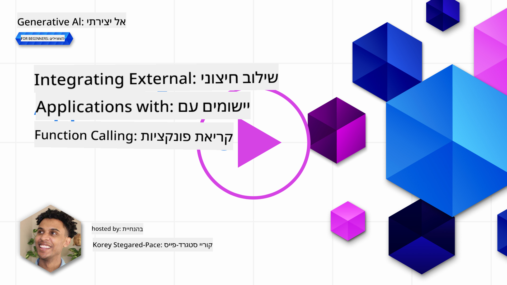
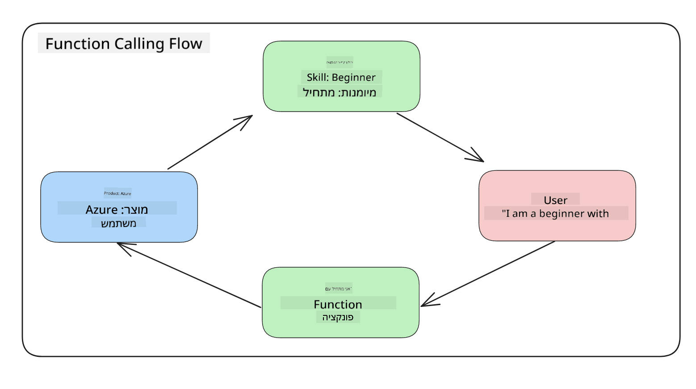
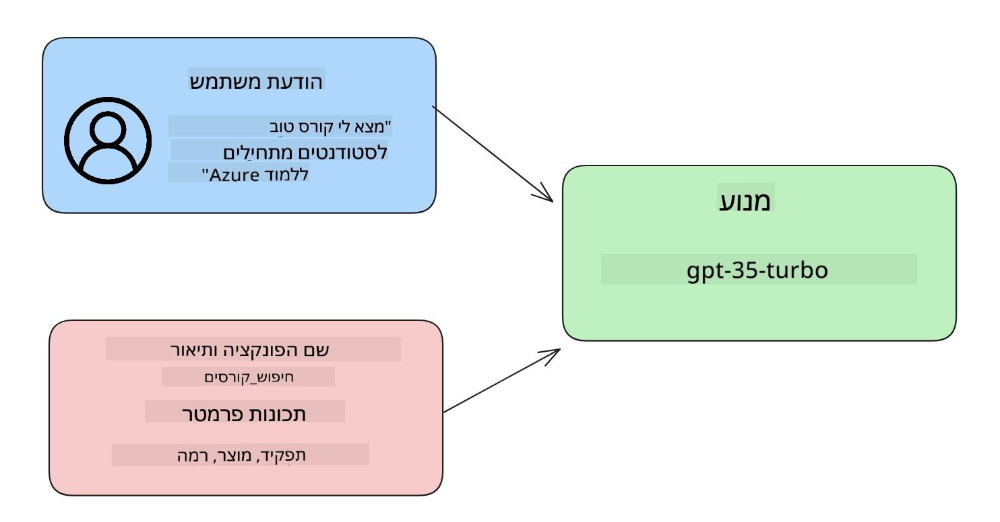

<!--
CO_OP_TRANSLATOR_METADATA:
{
  "original_hash": "77a48a201447be19aa7560706d6f93a0",
  "translation_date": "2025-06-25T19:57:41+00:00",
  "source_file": "11-integrating-with-function-calling/README.md",
  "language_code": "he"
}
-->
# אינטגרציה עם קריאה לפונקציות



למדת לא מעט עד כה בשיעורים הקודמים. עם זאת, ניתן לשפר עוד. דברים שניתן לטפל בהם הם איך ניתן לקבל פורמט תגובה עקבי יותר כדי להקל על העבודה עם התגובה בהמשך. בנוסף, אולי נרצה להוסיף נתונים ממקורות אחרים כדי להעשיר את היישום שלנו.

הבעיות שהוזכרו לעיל הן מה שהפרק הזה מנסה לטפל בו.

## הקדמה

שיעור זה יכסה:

- הסבר מהי קריאה לפונקציות ושימושיה.
- יצירת קריאה לפונקציה באמצעות Azure OpenAI.
- איך לשלב קריאה לפונקציה ביישום.

## מטרות למידה

בסוף השיעור הזה, תוכל:

- להסביר את מטרת השימוש בקריאה לפונקציות.
- להגדיר קריאה לפונקציה באמצעות שירות Azure OpenAI.
- לעצב קריאות פונקציה יעילות עבור מקרה השימוש של היישום שלך.

## תרחיש: שיפור הצ'אטבוט שלנו עם פונקציות

בשיעור זה, אנו רוצים לבנות תכונה עבור הסטארטאפ החינוכי שלנו המאפשרת למשתמשים להשתמש בצ'אטבוט כדי למצוא קורסים טכניים. נמליץ על קורסים שמתאימים לרמת המיומנות שלהם, התפקיד הנוכחי וטכנולוגיה שמעניינת אותם.

כדי להשלים את התרחיש הזה, נשתמש בשילוב של:

- `Azure OpenAI` כדי ליצור חוויית צ'אט עבור המשתמש.
- `Microsoft Learn Catalog API` כדי לעזור למשתמשים למצוא קורסים על פי בקשת המשתמש.
- `Function Calling` כדי לקחת את השאילתה של המשתמש ולשלוח אותה לפונקציה כדי לבצע את בקשת ה-API.

כדי להתחיל, נבחן מדוע נרצה להשתמש בקריאה לפונקציות מלכתחילה:

## למה קריאה לפונקציות

לפני קריאה לפונקציות, התגובות ממודלים של שפה היו לא מובנות ולא עקביות. מפתחים נדרשו לכתוב קוד אימות מורכב כדי לוודא שהם יכולים לטפל בכל וריאציה של תגובה. משתמשים לא יכלו לקבל תשובות כמו "מהו מזג האוויר הנוכחי בסטוקהולם?". זאת מכיוון שהמודלים היו מוגבלים לזמן שבו אומנו הנתונים.

קריאה לפונקציות היא תכונה של שירות Azure OpenAI כדי להתגבר על המגבלות הבאות:

- **פורמט תגובה עקבי**. אם נוכל לשלוט טוב יותר בפורמט התגובה, נוכל לשלב את התגובה ביתר קלות במערכות אחרות.
- **נתונים חיצוניים**. היכולת להשתמש בנתונים ממקורות אחרים של יישום בהקשר של צ'אט.

## המחשת הבעיה באמצעות תרחיש

> אנו ממליצים להשתמש ב-[מחברת המצורפת](../../../11-integrating-with-function-calling/python/aoai-assignment.ipynb) אם ברצונך להריץ את התרחיש למטה. ניתן גם לקרוא יחד איתנו כשאנו מנסים להמחיש בעיה שבה פונקציות יכולות לעזור לטפל בבעיה.

בואו נסתכל על הדוגמה שממחישה את בעיית פורמט התגובה:

נניח שאנו רוצים ליצור מסד נתונים של נתוני תלמידים כדי שנוכל להמליץ להם על הקורס הנכון. למטה יש לנו שני תיאורים של תלמידים שהם מאוד דומים בנתונים שהם מכילים.

1. צור חיבור למשאב Azure OpenAI שלנו:

   ```python
   import os
   import json
   from openai import AzureOpenAI
   from dotenv import load_dotenv
   load_dotenv()

   client = AzureOpenAI(
   api_key=os.environ['AZURE_OPENAI_API_KEY'],  # this is also the default, it can be omitted
   api_version = "2023-07-01-preview"
   )

   deployment=os.environ['AZURE_OPENAI_DEPLOYMENT']
   ```

   למטה יש קוד פייתון לקביעת התצורה של החיבור שלנו ל-Azure OpenAI שבו אנו מגדירים `api_type`, `api_base`, `api_version` and `api_key`.

1. Creating two student descriptions using variables `student_1_description` and `student_2_description`.

   ```python
   student_1_description="Emily Johnson is a sophomore majoring in computer science at Duke University. She has a 3.7 GPA. Emily is an active member of the university's Chess Club and Debate Team. She hopes to pursue a career in software engineering after graduating."

   student_2_description = "Michael Lee is a sophomore majoring in computer science at Stanford University. He has a 3.8 GPA. Michael is known for his programming skills and is an active member of the university's Robotics Club. He hopes to pursue a career in artificial intelligence after finishing his studies."
   ```

   אנו רוצים לשלוח את תיאורי התלמידים לעיל ל-LLM כדי לנתח את הנתונים. ניתן להשתמש בנתונים אלו מאוחר יותר ביישום שלנו ולהישלח ל-API או להישמר במסד נתונים.

1. בואו ניצור שני פרומפטים זהים שבהם אנו מנחים את ה-LLM על איזה מידע אנו מעוניינים:

   ```python
   prompt1 = f'''
   Please extract the following information from the given text and return it as a JSON object:

   name
   major
   school
   grades
   club

   This is the body of text to extract the information from:
   {student_1_description}
   '''

   prompt2 = f'''
   Please extract the following information from the given text and return it as a JSON object:

   name
   major
   school
   grades
   club

   This is the body of text to extract the information from:
   {student_2_description}
   '''
   ```

   הפרומפטים לעיל מנחים את ה-LLM לחלץ מידע ולהחזיר את התגובה בפורמט JSON.

1. לאחר הגדרת הפרומפטים והחיבור ל-Azure OpenAI, נשלח כעת את הפרומפטים ל-LLM באמצעות `openai.ChatCompletion`. We store the prompt in the `messages` variable and assign the role to `user`. זה כדי לדמות הודעה ממשתמש שנכתבת לצ'אטבוט.

   ```python
   # response from prompt one
   openai_response1 = client.chat.completions.create(
   model=deployment,
   messages = [{'role': 'user', 'content': prompt1}]
   )
   openai_response1.choices[0].message.content

   # response from prompt two
   openai_response2 = client.chat.completions.create(
   model=deployment,
   messages = [{'role': 'user', 'content': prompt2}]
   )
   openai_response2.choices[0].message.content
   ```

כעת נוכל לשלוח את שתי הבקשות ל-LLM ולבחון את התגובה שנקבל על ידי מציאתה כך `openai_response1['choices'][0]['message']['content']`.

1. Lastly, we can convert the response to JSON format by calling `json.loads`:

   ```python
   # Loading the response as a JSON object
   json_response1 = json.loads(openai_response1.choices[0].message.content)
   json_response1
   ```

   תגובה 1:

   ```json
   {
     "name": "Emily Johnson",
     "major": "computer science",
     "school": "Duke University",
     "grades": "3.7",
     "club": "Chess Club"
   }
   ```

   תגובה 2:

   ```json
   {
     "name": "Michael Lee",
     "major": "computer science",
     "school": "Stanford University",
     "grades": "3.8 GPA",
     "club": "Robotics Club"
   }
   ```

   למרות שהפרומפטים זהים והתיאורים דומים, אנו רואים ערכים של `Grades` property formatted differently, as we can sometimes get the format `3.7` or `3.7 GPA` for example.

   This result is because the LLM takes unstructured data in the form of the written prompt and returns also unstructured data. We need to have a structured format so that we know what to expect when storing or using this data

So how do we solve the formatting problem then? By using functional calling, we can make sure that we receive structured data back. When using function calling, the LLM does not actually call or run any functions. Instead, we create a structure for the LLM to follow for its responses. We then use those structured responses to know what function to run in our applications.



We can then take what is returned from the function and send this back to the LLM. The LLM will then respond using natural language to answer the user's query.

## Use Cases for using function calls

There are many different use cases where function calls can improve your app like:

- **Calling External Tools**. Chatbots are great at providing answers to questions from users. By using function calling, the chatbots can use messages from users to complete certain tasks. For example, a student can ask the chatbot to "Send an email to my instructor saying I need more assistance with this subject". This can make a function call to `send_email(to: string, body: string)`

- **Create API or Database Queries**. Users can find information using natural language that gets converted into a formatted query or API request. An example of this could be a teacher who requests "Who are the students that completed the last assignment" which could call a function named `get_completed(student_name: string, assignment: int, current_status: string)`

- **Creating Structured Data**. Users can take a block of text or CSV and use the LLM to extract important information from it. For example, a student can convert a Wikipedia article about peace agreements to create AI flashcards. This can be done by using a function called `get_important_facts(agreement_name: string, date_signed: string, parties_involved: list)`

## Creating Your First Function Call

The process of creating a function call includes 3 main steps:

1. **Calling** the Chat Completions API with a list of your functions and a user message.
2. **Reading** the model's response to perform an action i.e. execute a function or API Call.
3. **Making** another call to Chat Completions API with the response from your function to use that information to create a response to the user.



### Step 1 - creating messages

The first step is to create a user message. This can be dynamically assigned by taking the value of a text input or you can assign a value here. If this is your first time working with the Chat Completions API, we need to define the `role` and the `content` of the message.

The `role` can be either `system` (creating rules), `assistant` (the model) or `user` (the end-user). For function calling, we will assign this as `user` ושאלה לדוגמה.

```python
messages= [ {"role": "user", "content": "Find me a good course for a beginner student to learn Azure."} ]
```

על ידי הקצאת תפקידים שונים, מתבהר ל-LLM אם זה המערכת אומרת משהו או המשתמש, מה שעוזר לבנות היסטוריית שיחה שה-LLM יכול לבנות עליה.

### שלב 2 - יצירת פונקציות

כעת נגדיר פונקציה ואת הפרמטרים של הפונקציה הזו. נשתמש כאן רק בפונקציה אחת שנקראת `search_courses` but you can create multiple functions.

> **Important** : Functions are included in the system message to the LLM and will be included in the amount of available tokens you have available.

Below, we create the functions as an array of items. Each item is a function and has properties `name`, `description` and `parameters`:

```python
functions = [
   {
      "name":"search_courses",
      "description":"Retrieves courses from the search index based on the parameters provided",
      "parameters":{
         "type":"object",
         "properties":{
            "role":{
               "type":"string",
               "description":"The role of the learner (i.e. developer, data scientist, student, etc.)"
            },
            "product":{
               "type":"string",
               "description":"The product that the lesson is covering (i.e. Azure, Power BI, etc.)"
            },
            "level":{
               "type":"string",
               "description":"The level of experience the learner has prior to taking the course (i.e. beginner, intermediate, advanced)"
            }
         },
         "required":[
            "role"
         ]
      }
   }
]
```

בואו נתאר כל מקרה של פונקציה בפירוט למטה:

- `name` - The name of the function that we want to have called.
- `description` - This is the description of how the function works. Here it's important to be specific and clear.
- `parameters` - A list of values and format that you want the model to produce in its response. The parameters array consists of items where the items have the following properties:
  1.  `type` - The data type of the properties will be stored in.
  1.  `properties` - List of the specific values that the model will use for its response
      1. `name` - The key is the name of the property that the model will use in its formatted response, for example, `product`.
      1. `type` - The data type of this property, for example, `string`.
      1. `description` - Description of the specific property.

There's also an optional property `required` - required property for the function call to be completed.

### Step 3 - Making the function call

After defining a function, we now need to include it in the call to the Chat Completion API. We do this by adding `functions` to the request. In this case `functions=functions`.

There is also an option to set `function_call` to `auto`. This means we will let the LLM decide which function should be called based on the user message rather than assigning it ourselves.

Here's some code below where we call `ChatCompletion.create`, note how we set `functions=functions` and `function_call="auto"` וכך לתת ל-LLM את הבחירה מתי לקרוא לפונקציות שאנו מספקים לו:

```python
response = client.chat.completions.create(model=deployment,
                                        messages=messages,
                                        functions=functions,
                                        function_call="auto")

print(response.choices[0].message)
```

התגובה שחוזרת כעת נראית כך:

```json
{
  "role": "assistant",
  "function_call": {
    "name": "search_courses",
    "arguments": "{\n  \"role\": \"student\",\n  \"product\": \"Azure\",\n  \"level\": \"beginner\"\n}"
  }
}
```

כאן אנו יכולים לראות איך הפונקציה `search_courses` was called and with what arguments, as listed in the `arguments` property in the JSON response.

The conclusion the LLM was able to find the data to fit the arguments of the function as it was extracting it from the value provided to the `messages` parameter in the chat completion call. Below is a reminder of the `messages` נראית:

```python
messages= [ {"role": "user", "content": "Find me a good course for a beginner student to learn Azure."} ]
```

כפי שאתה רואה, `student`, `Azure` and `beginner` was extracted from `messages` and set as input to the function. Using functions this way is a great way to extract information from a prompt but also to provide structure to the LLM and have reusable functionality.

Next, we need to see how we can use this in our app.

## Integrating Function Calls into an Application

After we have tested the formatted response from the LLM, we can now integrate this into an application.

### Managing the flow

To integrate this into our application, let's take the following steps:

1. First, let's make the call to the OpenAI services and store the message in a variable called `response_message`.

   ```python
   response_message = response.choices[0].message
   ```

1. כעת נגדיר את הפונקציה שתתקשר ל-API של Microsoft Learn כדי לקבל רשימת קורסים:

   ```python
   import requests

   def search_courses(role, product, level):
     url = "https://learn.microsoft.com/api/catalog/"
     params = {
        "role": role,
        "product": product,
        "level": level
     }
     response = requests.get(url, params=params)
     modules = response.json()["modules"]
     results = []
     for module in modules[:5]:
        title = module["title"]
        url = module["url"]
        results.append({"title": title, "url": url})
     return str(results)
   ```

   שים לב כיצד כעת אנו יוצרים פונקציית פייתון ממשית שמתאימה לשמות הפונקציות שהוצגו ב-`functions` variable. We're also making real external API calls to fetch the data we need. In this case, we go against the Microsoft Learn API to search for training modules.

Ok, so we created `functions` variables and a corresponding Python function, how do we tell the LLM how to map these two together so our Python function is called?

1. To see if we need to call a Python function, we need to look into the LLM response and see if `function_call` כחלק ממנה ומבצעת את הפונקציה המצביעה. כך ניתן לבצע את הבדיקה המוזכרת למטה:

   ```python
   # Check if the model wants to call a function
   if response_message.function_call.name:
    print("Recommended Function call:")
    print(response_message.function_call.name)
    print()

    # Call the function.
    function_name = response_message.function_call.name

    available_functions = {
            "search_courses": search_courses,
    }
    function_to_call = available_functions[function_name]

    function_args = json.loads(response_message.function_call.arguments)
    function_response = function_to_call(**function_args)

    print("Output of function call:")
    print(function_response)
    print(type(function_response))


    # Add the assistant response and function response to the messages
    messages.append( # adding assistant response to messages
        {
            "role": response_message.role,
            "function_call": {
                "name": function_name,
                "arguments": response_message.function_call.arguments,
            },
            "content": None
        }
    )
    messages.append( # adding function response to messages
        {
            "role": "function",
            "name": function_name,
            "content":function_response,
        }
    )
   ```

   שלוש השורות הללו מבטיחות שנחלץ את שם הפונקציה, את הפרמטרים ונבצע את הקריאה:

   ```python
   function_to_call = available_functions[function_name]

   function_args = json.loads(response_message.function_call.arguments)
   function_response = function_to_call(**function_args)
   ```

   למטה התוצאה מהרצת הקוד שלנו:

   **תוצאה**

   ```Recommended Function call:
   {
     "name": "search_courses",
     "arguments": "{\n  \"role\": \"student\",\n  \"product\": \"Azure\",\n  \"level\": \"beginner\"\n}"
   }

   Output of function call:
   [{'title': 'Describe concepts of cryptography', 'url': 'https://learn.microsoft.com/training/modules/describe-concepts-of-cryptography/?
   WT.mc_id=api_CatalogApi'}, {'title': 'Introduction to audio classification with TensorFlow', 'url': 'https://learn.microsoft.com/en-
   us/training/modules/intro-audio-classification-tensorflow/?WT.mc_id=api_CatalogApi'}, {'title': 'Design a Performant Data Model in Azure SQL
   Database with Azure Data Studio', 'url': 'https://learn.microsoft.com/training/modules/design-a-data-model-with-ads/?
   WT.mc_id=api_CatalogApi'}, {'title': 'Getting started with the Microsoft Cloud Adoption Framework for Azure', 'url':
   'https://learn.microsoft.com/training/modules/cloud-adoption-framework-getting-started/?WT.mc_id=api_CatalogApi'}, {'title': 'Set up the
   Rust development environment', 'url': 'https://learn.microsoft.com/training/modules/rust-set-up-environment/?WT.mc_id=api_CatalogApi'}]
   <class 'str'>
   ```

1. כעת נשלח את ההודעה המעודכנת, `messages` ל-LLM כדי שנוכל לקבל תגובה בשפה טבעית במקום תגובת JSON של API.

   ```python
   print("Messages in next request:")
   print(messages)
   print()

   second_response = client.chat.completions.create(
      messages=messages,
      model=deployment,
      function_call="auto",
      functions=functions,
      temperature=0
         )  # get a new response from GPT where it can see the function response


   print(second_response.choices[0].message)
   ```

   **תוצאה**

   ```python
   {
     "role": "assistant",
     "content": "I found some good courses for beginner students to learn Azure:\n\n1. [Describe concepts of cryptography] (https://learn.microsoft.com/training/modules/describe-concepts-of-cryptography/?WT.mc_id=api_CatalogApi)\n2. [Introduction to audio classification with TensorFlow](https://learn.microsoft.com/training/modules/intro-audio-classification-tensorflow/?WT.mc_id=api_CatalogApi)\n3. [Design a Performant Data Model in Azure SQL Database with Azure Data Studio](https://learn.microsoft.com/training/modules/design-a-data-model-with-ads/?WT.mc_id=api_CatalogApi)\n4. [Getting started with the Microsoft Cloud Adoption Framework for Azure](https://learn.microsoft.com/training/modules/cloud-adoption-framework-getting-started/?WT.mc_id=api_CatalogApi)\n5. [Set up the Rust development environment](https://learn.microsoft.com/training/modules/rust-set-up-environment/?WT.mc_id=api_CatalogApi)\n\nYou can click on the links to access the courses."
   }

   ```

## משימה

כדי להמשיך בלימוד שלך על קריאה לפונקציות ב-Azure OpenAI תוכל לבנות:

- פרמטרים נוספים של הפונקציה שעשויים לעזור ללומדים למצוא עוד קורסים.
- ליצור קריאה לפונקציה נוספת שלוקחת מידע נוסף מהלומד כמו שפת האם שלו
- ליצור טיפול בשגיאות כאשר קריאת הפונקציה ו/או קריאת ה-API לא מחזירה קורסים מתאימים

רמז: עקוב אחר דף [התיעוד של API](https://learn.microsoft.com/training/support/catalog-api-developer-reference?WT.mc_id=academic-105485-koreyst) כדי לראות כיצד והיכן נתונים אלו זמינים.

## עבודה מצוינת! המשך במסע

לאחר השלמת שיעור זה, בדוק את [אוסף הלמידה של AI מחולל](https://aka.ms/genai-collection?WT.mc_id=academic-105485-koreyst) שלנו כדי להמשיך ולהעמיק את הידע שלך ב-AI מחולל!

התקדם לשיעור 12, שבו נבחן כיצד [לעצב חוויית משתמש ליישומי AI](../12-designing-ux-for-ai-applications/README.md?WT.mc_id=academic-105485-koreyst)!

**הצהרת אחריות**:  
מסמך זה תורגם באמצעות שירות תרגום בינה מלאכותית [Co-op Translator](https://github.com/Azure/co-op-translator). למרות שאנו שואפים לדיוק, יש להיות מודעים לכך שתרגומים אוטומטיים עשויים להכיל טעויות או אי דיוקים. יש לראות במסמך המקורי בשפתו המקורית כמקור סמכותי. עבור מידע קריטי, מומלץ להשתמש בתרגום אנושי מקצועי. איננו אחראים לאי הבנות או פרשנויות שגויות הנובעות משימוש בתרגום זה.