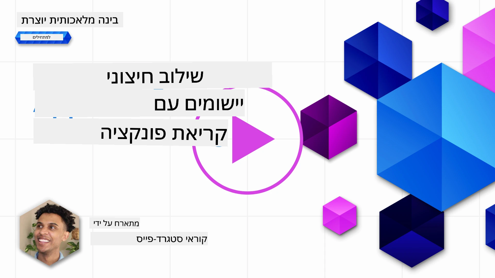
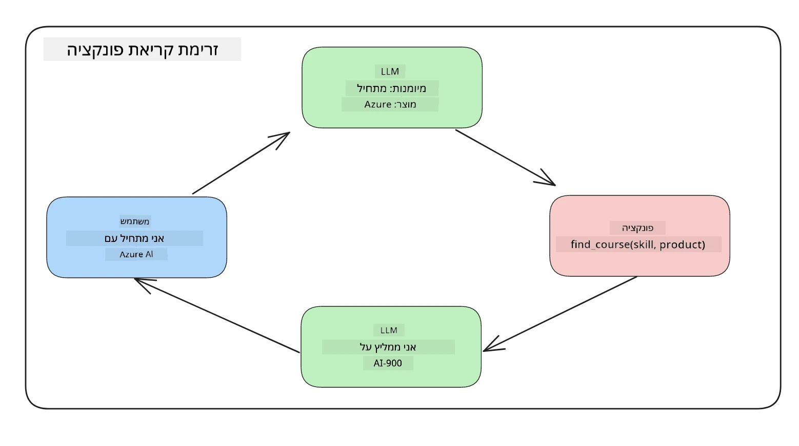
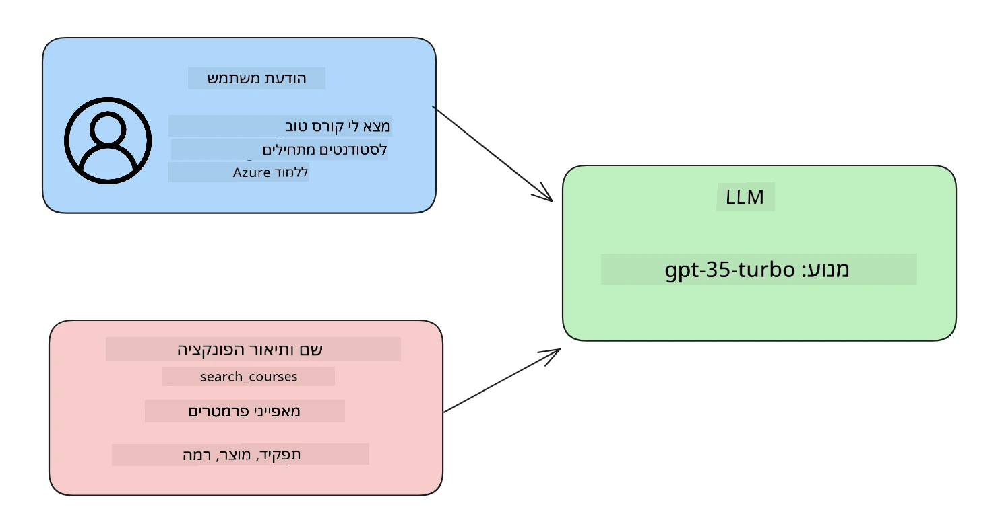

# אינטגרציה עם קריאת פונקציות

[](https://youtu.be/DgUdCLX8qYQ?si=f1ouQU5HQx6F8Gl2)

למדתם די הרבה עד כה בשיעורים הקודמים. עם זאת, ניתן לשפר עוד יותר. יש כמה דברים שנוכל לטפל בהם כמו איך לקבל פורמט תגובה עקבי יותר כדי להקל על העבודה עם התגובה בהמשך. בנוסף, נרצה להוסיף נתונים ממקורות אחרים כדי להעשיר עוד יותר את היישום שלנו.

הבעיות שהוזכרו למעלה הן מה שהפרק הזה יעסוק לטפל בהם.

## מבוא

שיעור זה יכסה:

- להסביר מהי קריאת פונקציה ומתי משתמשים בה.
- יצירת קריאת פונקציה באמצעות Azure OpenAI.
- איך לשלב קריאת פונקציה בתוך יישום.

## יעדי הלמידה

בסיום השיעור, תוכל:

- להסביר את מטרת השימוש בקריאת פונקציה.
- להגדיר קריאת פונקציה באמצעות שירות Azure OpenAI.
- לעצב קריאות פונקציה יעילות לשימוש ביישום שלך.

## תרחיש: שיפור צ'אטבוט עם פונקציות

לשיעור זה, נרצה לבנות תכונה לסטארטאפ חינוכי שלנו שתאפשר למשתמשים להשתמש בצ'אטבוט למציאת קורסים טכניים. נמליץ על קורסים שמתאימים לרמת הידע, תפקיד נוכחי וטכנולוגיה מעניינת.

להשלמת התרחיש נשתמש בשילוב של:

- `Azure OpenAI` ליצירת חווית צ'אט למשתמש.
- `Microsoft Learn Catalog API` שיעזור למשתמשים למצוא קורסים לפי הבקשה שלהם.
- `Function Calling` שתקח את שאילתת המשתמש ותשלח אותה לפונקציה שתבצע את בקשת ה-API.

כדי להתחיל, נבחן מדוע נרצה להשתמש בקריאת פונקציות מלכתחילה:

## למה קריאת פונקציות

לפני קריאת פונקציות, התגובות מ-LLM היו לא מובנות ולא עקביות. המפתחים נדרשו לכתוב קוד אימות מסובך כדי להתמודד עם כל וריאציה של תגובה. משתמשים לא יכלו לקבל תשובות כמו "מה מזג האוויר הנוכחי בסטוקהולם?". זאת כי הדגמים התבססו על מידע שהוגבל לזמן האימון.

קריאת פונקציות היא תכונה של שירות Azure OpenAI להתגבר על המגבלות הבאות:

- **פורמט תגובה עקבי**. אם נוכל לשלוט טוב יותר בפורמט התגובה נוכל לשלב את התגובה בקלות במערכות אחרות.
- **נתונים חיצוניים**. יכולת להשתמש בנתונים ממקורות אחרים של יישום בתוך הקשר שיחה.

## המחשת הבעיה באמצעות תרחיש

> מומלץ להשתמש ב-[מחברת כלולה](./python/aoai-assignment.ipynb?WT.mc_id=academic-105485-koreyst) אם ברצונך להריץ את התרחיש שלהלן. אפשר גם לקרוא בלבד כשאנחנו מנסים להמחיש בעיה שבה פונקציות יכולות לעזור לפתור אותה.

נבחן דוגמה שמדגימה את בעיית פורמט התגובה:

נניח שאנחנו רוצים ליצור מסד נתונים של נתוני סטודנטים כדי להציע להם את הקורס המתאים. למטה יש שתי תיאורים של סטודנטים שהם דומים מאוד בנתונים שמכילים.

1. צור חיבור למשאב Azure OpenAI שלנו:

   ```python
   import os
   import json
   from openai import OpenAI
   from dotenv import load_dotenv
   load_dotenv()

   # ממשק התגובות מופעל מ- Azure OpenAI (Microsoft Foundry) גרסה 1
   # נקודת הקצה, לכן אנו מגדירים את לקוח OpenAI על <your-endpoint>/openai/v1/.
   endpoint = os.environ['AZURE_OPENAI_ENDPOINT']
   client = OpenAI(
   api_key=os.environ['AZURE_OPENAI_API_KEY'],
   base_url=f"{endpoint.rstrip('/')}/openai/v1/",
   )

   deployment=os.environ['AZURE_OPENAI_DEPLOYMENT']
   ```

   למטה יש קוד פייתון שמגדיר את החיבור שלנו ל-Azure OpenAI. מכיוון שאנו משתמשים ב-endpoint v1, רק צריך להגדיר את `api_key` ו-`base_url` (לא צריך `api_version`).

1. יצירת שני תיאורי סטודנטים באמצעות המשתנים `student_1_description` ו-`student_2_description`.

   ```python
   student_1_description="Emily Johnson is a sophomore majoring in computer science at Duke University. She has a 3.7 GPA. Emily is an active member of the university's Chess Club and Debate Team. She hopes to pursue a career in software engineering after graduating."

   student_2_description = "Michael Lee is a sophomore majoring in computer science at Stanford University. He has a 3.8 GPA. Michael is known for his programming skills and is an active member of the university's Robotics Club. He hopes to pursue a career in artificial intelligence after finishing his studies."
   ```

   אנו רוצים לשלוח את תיאורי הסטודנטים ל-LLM כדי לפרש את הנתונים. נתונים אלו ישמשו אחר כך ביישום שלנו ויכולים להישלח ל-API או להישמר במסד נתונים.

1. ניצור שני הודעות זהות שבהן נתווה על ה-LLM איזו מידע מעניין אותנו:

   ```python
   prompt1 = f'''
   Please extract the following information from the given text and return it as a JSON object:

   name
   major
   school
   grades
   club

   This is the body of text to extract the information from:
   {student_1_description}
   '''

   prompt2 = f'''
   Please extract the following information from the given text and return it as a JSON object:

   name
   major
   school
   grades
   club

   This is the body of text to extract the information from:
   {student_2_description}
   '''
   ```

   ההודעות למעלה מורות ל-LLM להוציא מידע ולהחזיר את התגובה בפורמט JSON.

1. לאחר הגדרת ההודעות והחיבור ל-Azure OpenAI, נשלח את ההודעות ל-LLM באמצעות `client.responses.create`. נשמור את ההודעה במשתנה `input` ונגדיר את התפקיד ל-`user`. זאת כדי לדמות הודעה משתמש שנכתבת לצ'אטבוט.

   ```python
   # תגובה מהבקשה הראשונה
   openai_response1 = client.responses.create(
   model=deployment,
   input = [{'role': 'user', 'content': prompt1}],
   store=False,
   )
   openai_response1.output_text

   # תגובה מהבקשה השנייה
   openai_response2 = client.responses.create(
   model=deployment,
   input = [{'role': 'user', 'content': prompt2}],
   store=False,
   )
   openai_response2.output_text
   ```

כעת נוכל לשלוח את שתי הבקשות ל-LLM ולבחון את התגובה המתקבלת על ידי מציאתה למשל כך `openai_response1.output_text`.

1. לבסוף, ניתן להמיר את התגובה לפורמט JSON על ידי קריאה ל- `json.loads`:

   ```python
   # טוען את התגובה כאובייקט JSON
   json_response1 = json.loads(openai_response1.output_text)
   json_response1
   ```

   תגובה 1:

   ```json
   {
     "name": "Emily Johnson",
     "major": "computer science",
     "school": "Duke University",
     "grades": "3.7",
     "club": "Chess Club"
   }
   ```

   תגובה 2:

   ```json
   {
     "name": "Michael Lee",
     "major": "computer science",
     "school": "Stanford University",
     "grades": "3.8 GPA",
     "club": "Robotics Club"
   }
   ```

   למרות שההודעות זהות והתיאורים דומים, אנו רואים ערכים שונים של התכונה `Grades` המופיעים בפורמטים שונים, למשל יכול לקבל ערך כמו `3.7` או `3.7 GPA`.

   התוצאה הזו נובעת מהיות ה-LLM מקבל נתונים לא מובנים בצורת ההודעה הכתובה ומחזיר גם נתונים לא מובנים. אנו צריכים פורמט מובנה כדי לדעת למה לצפות בעת שמירת הנתונים או השימוש בהם.

אז איך פותרים את בעיית הפורמט? באמצעות קריאת פונקציה, נוודא שנקבל נתונים מובנים חזרה. בעת שימוש בקריאת פונקציה, ה-LLM לא באמת מפעיל או מריץ פונקציות. במקום זאת, אנו יוצרים מבנה שה-LLM יעקוב אחריו בתגובותיו. לאחר מכן נשתמש בתגובות המובנות הללו כדי לדעת איזו פונקציה להריץ ביישומים שלנו.



לאחר מכן נוכל לקחת את התוצאה שהוחזרה מהפונקציה ולשלוח אותה חזרה ל-LLM. ה-LLM יענה בשפה טבעית על שאילתת המשתמש.

## מקרים לשימוש בקריאות פונקציה

ישנם מקרים שונים בהם קריאות פונקציה יכולות לשפר את היישום שלך, כגון:

- **שימוש בכלים חיצוניים**. צ'אטבוטים מצוינים במתן תשובות לשאלות משתמשים. באמצעות קריאת פונקציה, הצ'אטבוטים יכולים להשתמש בהודעות המשתמש לבצע משימות מסוימות. לדוגמה, סטודנט יכול לבקש מן הצ'אטבוט "שלח מייל למרצה שלי שאמרתי שאני צריך עזרה נוספת בנושא זה". זה יכול לקרוא לפונקציה בשם `send_email(to: string, body: string)`

- **יצירת שאילתות API או מסד נתונים**. משתמשים יכולים למצוא מידע באמצעות שפה טבעית שזוכה להמרה לשאילתה או בקשת API בפורמט מסודר. דוגמה לכך היא מורה שמתעניין ב"מי הסטודנטים שסיימו את המשימה האחרונה", שיכול לקרוא לפונקציה בשם `get_completed(student_name: string, assignment: int, current_status: string)`

- **יצירת נתונים מובנים**. משתמשים יכולים לקחת בלוק טקסט או CSV ולהשתמש ב-LLM כדי לחלץ מידע חשוב מהם. לדוגמה, סטודנט יכול להמיר מאמר מוויקיפדיה על הסכמי שלום ליצירת כרטיסיות AI. זה יכול להיעשות באמצעות פונקציה בשם `get_important_facts(agreement_name: string, date_signed: string, parties_involved: list)`

## יצירת קריאת הפונקציה הראשונה שלך

תהליך יצירת קריאת פונקציה כולל 3 שלבים עיקריים:

1. **קריאה** ל-Responses API עם רשימת הפונקציות (כלים) שלך והודעת משתמש.
2. **קריאה** לתגובת המודל לביצוע פעולה כגון הרצת פונקציה או קריאת API.
3. **ביצוע** קריאה נוספת ל-Responses API עם תגובת הפונקציה שלך כדי להשתמש במידע הזה ליצירת תגובה למשתמש.



### שלב 1 - יצירת הודעות

השלב הראשון הוא ליצור הודעת משתמש. ניתן להקצות זאת בצורה דינמית על ידי לקיחת ערך מהזנת טקסט או להקצות ערך כאן. אם זו הפעם הראשונה שאתה עובד עם Responses API, אנו צריכים להגדיר את `role` ואת `content` של ההודעה.

ה-`role` יכול להיות `system` (יצירת חוקים), `assistant` (המודל) או `user` (המשתמש הסופי). בקריאת פונקציה, נגדיר זאת כ-`user` ודוגמת שאלה.

```python
messages= [ {"role": "user", "content": "Find me a good course for a beginner student to learn Azure."} ]
```

על ידי הקצאת תפקידים שונים, ברור ל-LLM אם זו מערכת שמדברת או המשתמש, מה שעוזר לבנות היסטוריית שיחה שעל ה-LLM לבנות עליה.

### שלב 2 - יצירת פונקציות

לאחר מכן נגדיר פונקציה ואת הפרמטרים שלה. כאן נשתמש בפונקציה אחת בלבד בשם `search_courses` אבל ניתן ליצור פונקציות מרובות.

> **חשוב** : פונקציות כלולות בהודעת המערכת ל-LLM ויכללו בכמות הטוקנים הזמינה שיש לכם.

למטה, ניצור את הפונקציות כמערך פריטים. כל פריט הוא כלי בממשק Responses API הפשוט, עם תכונות `type`, `name`, `description` ו-`parameters`:

```python
functions = [
   {
      "type":"function",
      "name":"search_courses",
      "description":"Retrieves courses from the search index based on the parameters provided",
      "parameters":{
         "type":"object",
         "properties":{
            "role":{
               "type":"string",
               "description":"The role of the learner (i.e. developer, data scientist, student, etc.)"
            },
            "product":{
               "type":"string",
               "description":"The product that the lesson is covering (i.e. Azure, Power BI, etc.)"
            },
            "level":{
               "type":"string",
               "description":"The level of experience the learner has prior to taking the course (i.e. beginner, intermediate, advanced)"
            }
         },
         "required":[
            "role"
         ]
      }
   }
]
```

נסביר כל מופע פונקציה בפירוט למטה:

- `name` - שם הפונקציה שאנו רוצים לקרוא לה.
- `description` - תיאור כיצד הפונקציה פועלת. כאן חשוב להיות מדויקים וברורים.
- `parameters` - רשימת ערכים ופורמט שהמודל יפיק בתגובתו. מערך הפרמטרים כולל פריטים שבהם יש את התכונות הבאות:
  1.  `type` - סוג הנתונים של התכונות שבהם יאוחסנו הערכים.
  1.  `properties` - רשימת הערכים הספציפיים שהמודל ישתמש בהם בתגובתו
      1. `name` - המפתח הוא שם התכונה שהמודל ישתמש בו בתגובה המפורמנת, לדוגמה, `product`.
      1. `type` - סוג הנתונים של תכונה זו, לדוגמה, `string`.
      1. `description` - תיאור התכונה הספציפית.

יש גם תכונה אופציונלית בשם `required` - תכונה דרושה כדי שהקריאה לפונקציה תושלם.

### שלב 3 - ביצוע קריאת הפונקציה

לאחר הגדרת הפונקציה, עלינו לכלול אותה בקריאה ל-Responses API. נעשה זאת על ידי הוספת `tools` לבקשה. במקרה זה `tools=functions`.

יש גם אפשרות להגדיר `tool_choice` ל-`auto`. משמעות הדבר היא שנאפשר ל-LLM להחליט איזו פונקציה לקרוא על פי הודעת המשתמש במקום להגדיר זאת בעצמנו.

להלן קוד שבו קוראים ל- `client.responses.create`, שים לב כיצד הגדרנו `tools=functions` ו-`tool_choice="auto"` ובכך נותנים ל-LLM את האפשרות מתי לקרוא לפונקציות שאנו מספקים לו:

```python
response = client.responses.create(model=deployment,
                                        input=messages,
                                        tools=functions,
                                        tool_choice="auto",
                                        store=False)

print(response.output)
```

התגובה המתקבלת כעת כוללת פריט `function_call` בתוך `response.output` שנראה כך:

```json
{
  "type": "function_call",
  "name": "search_courses",
  "call_id": "call_abc123",
  "arguments": "{\n  \"role\": \"student\",\n  \"product\": \"Azure\",\n  \"level\": \"beginner\"\n}"
}
```

כאן אנו רואים כיצד פונקציית `search_courses` נקראה ובאילו ארגומנטים, כפי שמפורט בתכונה `arguments` בתגובה בפורמט JSON.

המסקנה היא ש-LLM הצליח למצוא את הנתונים המתאימים לארגומנטים של הפונקציה כשהוציא אותם מהערך שסופק לפרמטר `input` בקריאת Responses API. למטה תזכורת לערך `messages`:

```python
messages= [ {"role": "user", "content": "Find me a good course for a beginner student to learn Azure."} ]
```

כפי שניתן לראות, `student`, `Azure` ו-`beginner` חולצו מ-`messages` והוגדרו כקלט לפונקציה. שימוש בפונקציות בדרך זו היא דרך מצוינת לחלץ מידע מפרומפט וגם לספק מבנה ל-LLM וליצור פונקציונליות שניתנת לשימוש חוזר.

כעת צריך לראות איך נוכל להשתמש בזה ביישום שלנו.

## שילוב קריאות פונקציה ביישום

לאחר שבדקנו את תגובת ה-LLM המעוצבת, נוכל כעת לשלב זאת ביישום.

### ניהול הזרימה

כדי לשלב זאת ביישום שלנו, נעשה את השלבים הבאים:

1. ראשית, נשגר את הקריאה לשירותי OpenAI וניתן לשלוף את פריטי קריאת הפונקציה מתוך התגובה `output`.

   ```python
   response_items = response.output
   tool_calls = [item for item in response_items if item.type == "function_call"]
   ```

1. כעת נגדיר את הפונקציה שתקרוא ל-Microsoft Learn API כדי לקבל רשימת קורסים:

   ```python
   import requests

   def search_courses(role, product, level):
     url = "https://learn.microsoft.com/api/catalog/"
     params = {
        "role": role,
        "product": product,
        "level": level
     }
     response = requests.get(url, params=params)
     modules = response.json()["modules"]
     results = []
     for module in modules[:5]:
        title = module["title"]
        url = module["url"]
        results.append({"title": title, "url": url})
     return str(results)
   ```

   שים לב כי כעת אנו יוצרים פונקציית פייתון ממשית שממפה לשמות הפונקציות שהוגדרו במשתנה `functions`. כמו כן, אנו מבצעים קריאות API חיצוניות אמיתיות כדי לקבל את הנתונים הנחוצים. במקרה זה, אנו פונים ל-Microsoft Learn API לחיפוש מודולי הכשרה.

אוקיי, יצרנו את משתנה `functions` ופונקציית פייתון מקבילה, איך נודיע ל-LLM כיצד למפות ביניהם כך שהפונקציה בפייתון תקרא?

1. כדי לבדוק האם יש צורך לקרוא לפונקציית פייתון, עלינו לבדוק את התגובה מה-LLM ולראות אם קיים פריט `function_call` כחלק ממנו, ולהפעיל את הפונקציה שצוינה. כך ניתן לבצע את הבדיקה למטה:

   ```python
   # בדוק אם הדגם רוצה לקרוא לפונקציה
   if tool_calls:
    for tool_call in tool_calls:
     print("Recommended Function call:")
     print(tool_call.name)
     print()

     # קרא לפונקציה.
     function_name = tool_call.name

     available_functions = {
             "search_courses": search_courses,
     }
     function_to_call = available_functions[function_name]

     function_args = json.loads(tool_call.arguments)
     function_response = function_to_call(**function_args)

     print("Output of function call:")
     print(function_response)
     print(type(function_response))

     # הוסף את קריאת הפונקציה ותוצאתה לשיחה.
     # פריט ה-function_call של הדגם חייב להיות מצורף לפני הפלט שלו.
     messages.append(tool_call)  # פריט ה-function_call של העוזר
     messages.append( # תוצאת הפונקציה
         {
             "type": "function_call_output",
             "call_id": tool_call.call_id,
             "output": function_response,
         }
     )
   ```

   שלוש השורות הללו מוודאות שאנו שולפים את שם הפונקציה, את הארגומנטים ומבצעים את הקריאה:

   ```python
   function_to_call = available_functions[function_name]

   function_args = json.loads(tool_call.arguments)
   function_response = function_to_call(**function_args)
   ```

   להלן פלט ההרצה של הקוד שלנו:

**פלט**

   ```Recommended Function call:
   {
     "name": "search_courses",
     "arguments": "{\n  \"role\": \"student\",\n  \"product\": \"Azure\",\n  \"level\": \"beginner\"\n}"
   }

   Output of function call:
   [{'title': 'Describe concepts of cryptography', 'url': 'https://learn.microsoft.com/training/modules/describe-concepts-of-cryptography/?
   WT.mc_id=api_CatalogApi'}, {'title': 'Introduction to audio classification with TensorFlow', 'url': 'https://learn.microsoft.com/en-
   us/training/modules/intro-audio-classification-tensorflow/?WT.mc_id=api_CatalogApi'}, {'title': 'Design a Performant Data Model in Azure SQL
   Database with Azure Data Studio', 'url': 'https://learn.microsoft.com/training/modules/design-a-data-model-with-ads/?
   WT.mc_id=api_CatalogApi'}, {'title': 'Getting started with the Microsoft Cloud Adoption Framework for Azure', 'url':
   'https://learn.microsoft.com/training/modules/cloud-adoption-framework-getting-started/?WT.mc_id=api_CatalogApi'}, {'title': 'Set up the
   Rust development environment', 'url': 'https://learn.microsoft.com/training/modules/rust-set-up-environment/?WT.mc_id=api_CatalogApi'}]
   <class 'str'>
   ```

1. כעת נשלח את ההודעה המעודכנת, `messages` ל-LLM כדי לקבל תגובה בשפה טבעית במקום תגובת JSON ממסד נתונים.

   ```python
   print("Messages in next request:")
   print(messages)
   print()

   second_response = client.responses.create(
      input=messages,
      model=deployment,
      tool_choice="auto",
      tools=functions,
      temperature=0,
      store=False,
         )  # לקבל תשובה חדשה מהמודל שבו הוא יכול לראות את תגובת הפונקציה


   print(second_response.output_text)
   ```

**פלט**

   ```text
   I found some good courses for beginner students to learn Azure:

   1. [Describe concepts of cryptography](https://learn.microsoft.com/training/modules/describe-concepts-of-cryptography/?WT.mc_id=api_CatalogApi)
   2. [Introduction to audio classification with TensorFlow](https://learn.microsoft.com/training/modules/intro-audio-classification-tensorflow/?WT.mc_id=api_CatalogApi)
   3. [Design a Performant Data Model in Azure SQL Database with Azure Data Studio](https://learn.microsoft.com/training/modules/design-a-data-model-with-ads/?WT.mc_id=api_CatalogApi)
   4. [Getting started with the Microsoft Cloud Adoption Framework for Azure](https://learn.microsoft.com/training/modules/cloud-adoption-framework-getting-started/?WT.mc_id=api_CatalogApi)
   5. [Set up the Rust development environment](https://learn.microsoft.com/training/modules/rust-set-up-environment/?WT.mc_id=api_CatalogApi)

   You can click on the links to access the courses.
   ```

## משימה

כדי להמשיך ללמוד על Azure OpenAI Function Calling תוכל לבנות:

- פרמטרים נוספים של הפונקציה שעשויים לעזור ללומדים למצוא עוד קורסים.

- צור קריאת פונקציה נוספת שלוקחת מידע נוסף מהלומד כמו שפת האם שלו
- צור טיפול בשגיאות כאשר קריאת הפונקציה ו/או קריאת ה-API לא מחזירה קורסים מתאימים

רמז: עקוב אחרי [תיעוד הממשק API של Learn](https://learn.microsoft.com/training/support/catalog-api-developer-reference?WT.mc_id=academic-105485-koreyst) כדי לראות איך ואיפה הנתונים האלה זמינים.

## עבודה מצוינת! המשך את המסע

לאחר סיום השעור הזה, בדוק את [אוסף הלמידה של Generative AI](https://aka.ms/genai-collection?WT.mc_id=academic-105485-koreyst) שלנו כדי להמשיך לשפר את הידע שלך ב-Generative AI!

עבור לשיעור 12, שבו נבחן כיצד [לתכנן חוויית משתמש ליישומי AI](../12-designing-ux-for-ai-applications/README.md?WT.mc_id=academic-105485-koreyst)!

---

<!-- CO-OP TRANSLATOR DISCLAIMER START -->
**כתב ויתור**:
מסמך זה תורגם באמצעות שירות תרגום אוטומטי [Co-op Translator](https://github.com/Azure/co-op-translator). למרות שאנו שואפים לדיוק, יש לקחת בחשבון שתרגומים אוטומטיים עלולים להכיל שגיאות או אי-דיוקים. יש להחשיב את המסמך המקורי בשפתו הטבעית כמקור הסמכות. למידע קריטי מומלץ להשתמש בתרגום מקצועי על ידי מתרגם אדם. אנו לא אחראים לכל אי-הבנה או פירוש שגוי הנובע מהשימוש בתרגום זה.
<!-- CO-OP TRANSLATOR DISCLAIMER END -->