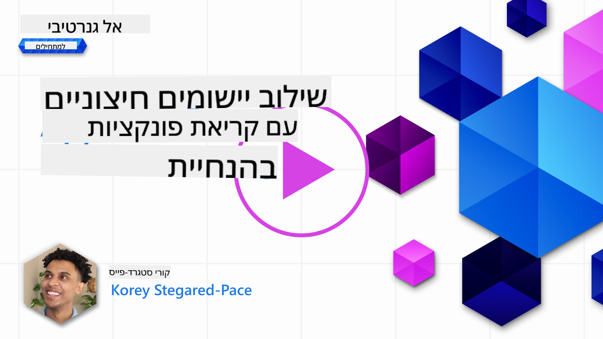
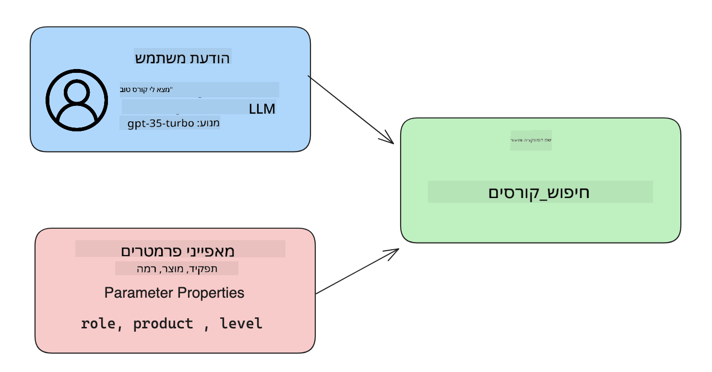

<!--
CO_OP_TRANSLATOR_METADATA:
{
  "original_hash": "f6f84f9ef2d066cd25850cab93580a50",
  "translation_date": "2025-10-17T20:01:36+00:00",
  "source_file": "11-integrating-with-function-calling/README.md",
  "language_code": "he"
}
-->
# שילוב עם קריאה לפונקציות

[](https://youtu.be/DgUdCLX8qYQ?si=f1ouQU5HQx6F8Gl2)

למדת לא מעט עד כה בשיעורים הקודמים. עם זאת, תמיד יש מקום לשיפור. בין הדברים שניתן לשפר הם איך לקבל פורמט תגובה עקבי יותר כדי להקל על העבודה עם התגובה בהמשך. בנוסף, ייתכן שנרצה להוסיף נתונים ממקורות אחרים כדי להעשיר את האפליקציה שלנו.

הבעיות שהוזכרו לעיל הן בדיוק מה שהפרק הזה מתמקד בו.

## הקדמה

השיעור הזה יכסה:

- הסבר על מהי קריאה לפונקציות ושימושיה.
- יצירת קריאה לפונקציה באמצעות Azure OpenAI.
- איך לשלב קריאה לפונקציה באפליקציה.

## מטרות למידה

בסיום השיעור הזה, תוכל:

- להסביר את מטרת השימוש בקריאה לפונקציות.
- להגדיר קריאה לפונקציה באמצעות שירות Azure OpenAI.
- לעצב קריאות פונקציה יעילות עבור השימוש באפליקציה שלך.

## תרחיש: שיפור הצ'אטבוט שלנו באמצעות פונקציות

בשיעור הזה, אנחנו רוצים לבנות תכונה עבור חברת הסטארטאפ החינוכית שלנו שתאפשר למשתמשים להשתמש בצ'אטבוט כדי למצוא קורסים טכניים. נמליץ על קורסים שמתאימים לרמת המיומנות שלהם, תפקידם הנוכחי והטכנולוגיה שמעניינת אותם.

כדי להשלים את התרחיש הזה, נשתמש בשילוב של:

- `Azure OpenAI` ליצירת חוויית צ'אט עבור המשתמש.
- `Microsoft Learn Catalog API` כדי לעזור למשתמשים למצוא קורסים בהתאם לבקשתם.
- `קריאה לפונקציות` כדי לקחת את השאילתה של המשתמש ולשלוח אותה לפונקציה שתבצע את בקשת ה-API.

כדי להתחיל, בואו נבחן מדוע בכלל נרצה להשתמש בקריאה לפונקציות:

## למה קריאה לפונקציות

לפני קריאה לפונקציות, התגובות מ-LLM היו לא מובנות ולא עקביות. מפתחים נדרשו לכתוב קוד אימות מורכב כדי לוודא שהם יכולים להתמודד עם כל וריאציה של תגובה. משתמשים לא יכלו לקבל תשובות כמו "מה מזג האוויר הנוכחי בסטוקהולם?". זאת מכיוון שהמודלים היו מוגבלים לזמן שבו הנתונים אומנו.

קריאה לפונקציות היא תכונה של שירות Azure OpenAI שמתגברת על המגבלות הבאות:

- **פורמט תגובה עקבי**. אם נוכל לשלוט טוב יותר בפורמט התגובה, נוכל לשלב את התגובה בקלות רבה יותר במערכות אחרות.
- **נתונים חיצוניים**. היכולת להשתמש בנתונים ממקורות אחרים של אפליקציה בהקשר של צ'אט.

## המחשת הבעיה דרך תרחיש

> אנו ממליצים להשתמש ב-[מחברת המצורפת](./python/aoai-assignment.ipynb?WT.mc_id=academic-105485-koreyst) אם תרצו להריץ את התרחיש הבא. ניתן גם לקרוא בלבד, שכן אנו מנסים להמחיש בעיה שבה פונקציות יכולות לעזור לפתור אותה.

בואו נבחן דוגמה שממחישה את בעיית פורמט התגובה:

נניח שאנחנו רוצים ליצור מסד נתונים של נתוני תלמידים כדי שנוכל להציע להם את הקורס המתאים. להלן שתי תיאורים של תלמידים שמאוד דומים בנתונים שהם מכילים.

1. יצירת חיבור למשאב Azure OpenAI שלנו:

   ```python
   import os
   import json
   from openai import AzureOpenAI
   from dotenv import load_dotenv
   load_dotenv()

   client = AzureOpenAI(
   api_key=os.environ['AZURE_OPENAI_API_KEY'],  # this is also the default, it can be omitted
   api_version = "2023-07-01-preview"
   )

   deployment=os.environ['AZURE_OPENAI_DEPLOYMENT']
   ```

   להלן קוד Python שמגדיר את החיבור ל-Azure OpenAI שבו אנו מגדירים `api_type`, `api_base`, `api_version` ו-`api_key`.

1. יצירת שני תיאורי תלמידים באמצעות משתנים `student_1_description` ו-`student_2_description`.

   ```python
   student_1_description="Emily Johnson is a sophomore majoring in computer science at Duke University. She has a 3.7 GPA. Emily is an active member of the university's Chess Club and Debate Team. She hopes to pursue a career in software engineering after graduating."

   student_2_description = "Michael Lee is a sophomore majoring in computer science at Stanford University. He has a 3.8 GPA. Michael is known for his programming skills and is an active member of the university's Robotics Club. He hopes to pursue a career in artificial intelligence after finishing his studies."
   ```

   אנו רוצים לשלוח את תיאורי התלמידים הללו ל-LLM כדי לנתח את הנתונים. נתונים אלו יכולים לשמש מאוחר יותר באפליקציה שלנו ולהישלח ל-API או להישמר במסד נתונים.

1. בואו ניצור שני הנחיות זהות שבהן אנו מנחים את ה-LLM על איזה מידע אנו מעוניינים:

   ```python
   prompt1 = f'''
   Please extract the following information from the given text and return it as a JSON object:

   name
   major
   school
   grades
   club

   This is the body of text to extract the information from:
   {student_1_description}
   '''

   prompt2 = f'''
   Please extract the following information from the given text and return it as a JSON object:

   name
   major
   school
   grades
   club

   This is the body of text to extract the information from:
   {student_2_description}
   '''
   ```

   ההנחיות לעיל מנחות את ה-LLM לחלץ מידע ולהחזיר את התגובה בפורמט JSON.

1. לאחר הגדרת ההנחיות והחיבור ל-Azure OpenAI, נשלח כעת את ההנחיות ל-LLM באמצעות `openai.ChatCompletion`. אנו שומרים את ההנחיה במשתנה `messages` ומקצים את התפקיד ל-`user`. זה כדי לדמות הודעה ממשתמש שנכתבת לצ'אטבוט.

   ```python
   # response from prompt one
   openai_response1 = client.chat.completions.create(
   model=deployment,
   messages = [{'role': 'user', 'content': prompt1}]
   )
   openai_response1.choices[0].message.content

   # response from prompt two
   openai_response2 = client.chat.completions.create(
   model=deployment,
   messages = [{'role': 'user', 'content': prompt2}]
   )
   openai_response2.choices[0].message.content
   ```

כעת נוכל לשלוח את שתי הבקשות ל-LLM ולבחון את התגובה שאנו מקבלים על ידי מציאתה כך `openai_response1['choices'][0]['message']['content']`.

1. לבסוף, נוכל להמיר את התגובה לפורמט JSON על ידי קריאה ל-`json.loads`:

   ```python
   # Loading the response as a JSON object
   json_response1 = json.loads(openai_response1.choices[0].message.content)
   json_response1
   ```

   תגובה 1:

   ```json
   {
     "name": "Emily Johnson",
     "major": "computer science",
     "school": "Duke University",
     "grades": "3.7",
     "club": "Chess Club"
   }
   ```

   תגובה 2:

   ```json
   {
     "name": "Michael Lee",
     "major": "computer science",
     "school": "Stanford University",
     "grades": "3.8 GPA",
     "club": "Robotics Club"
   }
   ```

   למרות שההנחיות זהות והתיאורים דומים, אנו רואים ערכים של מאפיין `Grades` בפורמט שונה, כמו `3.7` או `3.7 GPA`.

   תוצאה זו נובעת מכך שה-LLM לוקח נתונים לא מובנים בצורה של הנחיה כתובה ומחזיר גם נתונים לא מובנים. אנו צריכים פורמט מובנה כדי שנדע למה לצפות כשאנו שומרים או משתמשים בנתונים אלו.

אז איך פותרים את בעיית הפורמט? באמצעות קריאה לפונקציות, אנו יכולים לוודא שאנו מקבלים נתונים מובנים בחזרה. כאשר משתמשים בקריאה לפונקציות, ה-LLM לא באמת קורא או מריץ פונקציות. במקום זאת, אנו יוצרים מבנה שה-LLM יעקוב אחריו בתגובותיו. אנו משתמשים בתגובות המובנות הללו כדי לדעת איזו פונקציה להריץ באפליקציות שלנו.


לאחר מכן, אנו יכולים לקחת את מה שמוחזר מהפונקציה ולשלוח זאת בחזרה ל-LLM. ה-LLM יגיב בשפה טבעית כדי לענות על השאילתה של המשתמש.

## שימושים לקריאה לפונקציות

ישנם שימושים רבים שבהם קריאה לפונקציות יכולה לשפר את האפליקציה שלך, כמו:

- **קריאה לכלים חיצוניים**. צ'אטבוטים מצוינים במתן תשובות לשאלות של משתמשים. באמצעות קריאה לפונקציות, הצ'אטבוטים יכולים להשתמש בהודעות ממשתמשים כדי לבצע משימות מסוימות. לדוגמה, תלמיד יכול לבקש מהצ'אטבוט "שלח אימייל למורה שלי ואמור שאני זקוק לעזרה נוספת בנושא הזה". זה יכול לבצע קריאה לפונקציה `send_email(to: string, body: string)`.

- **יצירת שאילתות API או מסד נתונים**. משתמשים יכולים למצוא מידע באמצעות שפה טבעית שמומרת לשאילתה או בקשת API בפורמט מובנה. דוגמה לכך יכולה להיות מורה שמבקש "מי התלמידים שסיימו את המשימה האחרונה" שיכול לקרוא לפונקציה בשם `get_completed(student_name: string, assignment: int, current_status: string)`.

- **יצירת נתונים מובנים**. משתמשים יכולים לקחת בלוק טקסט או CSV ולהשתמש ב-LLM כדי לחלץ מידע חשוב ממנו. לדוגמה, תלמיד יכול להמיר מאמר מוויקיפדיה על הסכמי שלום ליצירת כרטיסי פלאש AI. זה יכול להיעשות באמצעות פונקציה בשם `get_important_facts(agreement_name: string, date_signed: string, parties_involved: list)`.

## יצירת קריאה לפונקציה ראשונה

תהליך יצירת קריאה לפונקציה כולל 3 שלבים עיקריים:

1. **קריאה** ל-Chat Completions API עם רשימת הפונקציות שלך והודעת משתמש.
2. **קריאה** לתגובה של המודל כדי לבצע פעולה, כלומר להריץ פונקציה או קריאת API.
3. **ביצוע** קריאה נוספת ל-Chat Completions API עם התגובה מהפונקציה כדי להשתמש במידע הזה ליצירת תגובה למשתמש.



### שלב 1 - יצירת הודעות

השלב הראשון הוא יצירת הודעת משתמש. ניתן להקצות ערך באופן דינמי על ידי לקיחת הערך של קלט טקסט או להקצות ערך כאן. אם זו הפעם הראשונה שלך לעבוד עם Chat Completions API, אנו צריכים להגדיר את `role` ואת `content` של ההודעה.

ה-`role` יכול להיות `system` (יצירת כללים), `assistant` (המודל) או `user` (המשתמש הסופי). עבור קריאה לפונקציות, אנו נציין זאת כ-`user` ודוגמה לשאלה.

```python
messages= [ {"role": "user", "content": "Find me a good course for a beginner student to learn Azure."} ]
```

על ידי הקצאת תפקידים שונים, זה מבהיר ל-LLM אם זה המערכת שאומרת משהו או המשתמש, מה שעוזר לבנות היסטוריית שיחה שה-LLM יכול לבנות עליה.

### שלב 2 - יצירת פונקציות

לאחר מכן, נגדיר פונקציה ואת הפרמטרים שלה. נשתמש רק בפונקציה אחת כאן בשם `search_courses`, אך ניתן ליצור פונקציות רבות.

> **חשוב**: פונקציות נכללות בהודעת המערכת ל-LLM וייכללו בכמות הטוקנים הזמינים שיש לך.

להלן, אנו יוצרים את הפונקציות כמערך של פריטים. כל פריט הוא פונקציה ויש לו מאפיינים `name`, `description` ו-`parameters`:

```python
functions = [
   {
      "name":"search_courses",
      "description":"Retrieves courses from the search index based on the parameters provided",
      "parameters":{
         "type":"object",
         "properties":{
            "role":{
               "type":"string",
               "description":"The role of the learner (i.e. developer, data scientist, student, etc.)"
            },
            "product":{
               "type":"string",
               "description":"The product that the lesson is covering (i.e. Azure, Power BI, etc.)"
            },
            "level":{
               "type":"string",
               "description":"The level of experience the learner has prior to taking the course (i.e. beginner, intermediate, advanced)"
            }
         },
         "required":[
            "role"
         ]
      }
   }
]
```

בואו נתאר כל מופע פונקציה בפירוט רב יותר להלן:

- `name` - שם הפונקציה שאנו רוצים שתיקרא.
- `description` - זהו התיאור של איך הפונקציה עובדת. כאן חשוב להיות ספציפיים וברורים.
- `parameters` - רשימת ערכים ופורמט שהמודל יפיק בתגובתו. מערך הפרמטרים מורכב מפריטים שבהם לפריטים יש את המאפיינים הבאים:
  1.  `type` - סוג הנתונים שבו המאפיינים יישמרו.
  1.  `properties` - רשימת הערכים הספציפיים שהמודל ישתמש בהם בתגובתו המובנית.
      1. `name` - המפתח הוא שם המאפיין שהמודל ישתמש בו בתגובתו המובנית, לדוגמה, `product`.
      1. `type` - סוג הנתונים של מאפיין זה, לדוגמה, `string`.
      1. `description` - תיאור של המאפיין הספציפי.

יש גם מאפיין אופציונלי `required` - מאפיין נדרש כדי להשלים את קריאת הפונקציה.

### שלב 3 - ביצוע קריאה לפונקציה

לאחר הגדרת פונקציה, כעת אנו צריכים לכלול אותה בקריאה ל-Chat Completion API. אנו עושים זאת על ידי הוספת `functions` לבקשה. במקרה זה `functions=functions`.

יש גם אפשרות להגדיר `function_call` ל-`auto`. זה אומר שניתן ל-LLM להחליט איזו פונקציה יש לקרוא בהתבסס על הודעת המשתמש במקום להקצות אותה בעצמנו.

להלן קוד שבו אנו קוראים ל-`ChatCompletion.create`, שימו לב איך אנו מגדירים `functions=functions` ו-`function_call="auto"` ובכך נותנים ל-LLM את הבחירה מתי לקרוא לפונקציות שאנו מספקים לו:

```python
response = client.chat.completions.create(model=deployment,
                                        messages=messages,
                                        functions=functions,
                                        function_call="auto")

print(response.choices[0].message)
```

התגובה שמתקבלת נראית כך:

```json
{
  "role": "assistant",
  "function_call": {
    "name": "search_courses",
    "arguments": "{\n  \"role\": \"student\",\n  \"product\": \"Azure\",\n  \"level\": \"beginner\"\n}"
  }
}
```

כאן אנו רואים איך הפונקציה `search_courses` נקראה ועם אילו ארגומנטים, כפי שמפורט במאפיין `arguments` בתגובה JSON.

המסקנה היא שה-LLM הצליח למצוא את הנתונים שמתאימים לארגומנטים של הפונקציה כשהוא חילץ אותם מהערך שסופק למשתנה `messages` בקריאה ל-Chat Completion. להלן תזכורת לערך של `messages`:

```python
messages= [ {"role": "user", "content": "Find me a good course for a beginner student to learn Azure."} ]
```

כפי שניתן לראות, `student`, `Azure` ו-`beginner` חולצו מ-`messages` והוגדרו כקלט לפונקציה. שימוש בפונקציות בדרך זו הוא דרך מצוינת לחלץ מידע מהנחיה וגם לספק מבנה ל-LLM וליצור פונקציונליות חוזרת.

כעת, אנו צריכים לראות איך ניתן להשתמש בזה באפליקציה שלנו.

## שילוב קריאות פונקציות באפליקציה

לאחר שבדקנו את תגובת הפורמט מה-LLM, כעת נוכל לשלב זאת באפליקציה.

### ניהול הזרימה

כדי לשלב זאת באפליקציה שלנו, בואו נבצע את השלבים הבאים:

1. ראשית, נבצע את הקריאה לשירותי OpenAI ונשמור את ההודעה במשתנה בשם `response_message`.

   ```python
   response_message = response.choices[0].message
   ```

1. כעת נגדיר את הפונקציה שתבצע קריאה ל-Microsoft Learn API כדי לקבל רשימת קורסים:

   ```python
   import requests

   def search_courses(role, product, level):
     url = "https://learn.microsoft.com/api/catalog/"
     params = {
        "role": role,
        "product": product,
        "level": level
     }
     response = requests.get(url, params=params)
     modules = response.json()["modules"]
     results = []
     for module in modules[:5]:
        title = module["title"]
        url = module["url"]
        results.append({"title": title, "url": url})
     return str(results)
   ```

   שימו לב איך אנו יוצרים כעת פונקציית Python אמיתית שמתאימה לשמות הפונקציות שהוצגו במשתנה `functions`. אנו גם מבצעים קריאות API חיצוניות אמיתיות כדי לאחזר את הנתונים שאנו צריכים. במקרה זה, אנו פונים ל-Microsoft Learn API כדי לחפש מודולי הדרכה.

אוקיי, אז יצרנו משתנה `functions` ופונקציית Python תואמת, איך אנו אומרים ל-LLM איך למפות בין השניים כך שפונקציית Python שלנו תיקרא?

1. כדי לראות אם אנו צריכים לקרוא לפונקציית Python, אנו צריכים לבדוק בתגובה של ה-LLM אם `function_call` הוא חלק ממנה ולקרוא לפונקציה שצוינה. הנה איך ניתן לבצע את הבדיקה המוזכרת להלן:

   ```python
   # Check if the model wants to call a function
   if response_message.function_call.name:
    print("Recommended Function call:")
    print(response_message.function_call.name)
    print()

    # Call the function.
    function_name = response_message.function_call.name

    available_functions = {
            "search_courses": search_courses,
    }
    function_to_call = available_functions[function_name]

    function_args = json.loads(response_message.function_call.arguments)
    function_response = function_to_call(**function_args)

    print("Output of function call:")
    print(function_response)
    print(type(function_response))


    # Add the assistant response and function response to the messages
    messages.append( # adding assistant response to messages
        {
            "role": response_message.role,
            "function_call": {
                "name": function_name,
                "arguments": response_message.function_call.arguments,
            },
            "content": None
        }
    )
    messages.append( # adding function response to messages
        {
            "role": "function",
            "name": function_name,
            "content":function_response,
        }
    )
   ```

   שלושת השורות הללו מבטיחות שאנו מחלצים את שם הפונקציה, הארגומנטים ומבצעים את הקריאה:

   ```python
   function_to_call = available_functions[function_name]

   function_args = json.loads(response_message.function_call.arguments)
   function_response = function_to_call(**function_args)
   ```

   להלן הפלט מהרצת הקוד שלנו:

   **פלט**

   ```Recommended Function call:
   {
     "name": "search_courses",
     "arguments": "{\n  \"role\": \"student\",\n  \"product\": \"Azure\",\n  \"level\": \"beginner\"\n}"
   }

   Output of function call:
   [{'title': 'Describe concepts of cryptography', 'url': 'https://learn.microsoft.com/training/modules/describe-concepts-of-cryptography/?
   WT.mc_id=api_CatalogApi'}, {'title': 'Introduction to audio classification with TensorFlow', 'url': 'https://learn.microsoft.com/en-
   us/training/modules/intro-audio-classification-tensorflow/?WT.mc_id=api_CatalogApi'}, {'title': 'Design a Performant Data Model in Azure SQL
   Database with Azure Data Studio', 'url': 'https://learn.microsoft.com/training/modules/design-a-data-model-with-ads/?
   WT.mc_id=api_CatalogApi'}, {'title': 'Getting started with the Microsoft Cloud Adoption Framework for Azure', 'url':
   'https://learn.microsoft.com/training/modules/cloud-adoption-framework-getting-started/?WT.mc_id=api_CatalogApi'}, {'title': 'Set up the
   Rust development environment', 'url': 'https://learn.microsoft.com/training/modules/rust-set-up-environment/?WT.mc_id=api_CatalogApi'}]
   <class 'str'>
   ```

1. כעת נשלח את ההודעה המעודכנת, `messages`, ל-LLM כדי שנוכל לקבל תגובה בשפה טבעית במקום תגובה בפורמט JSON של API.

   ```python
   print("Messages in next request:")
   print(messages)
   print()

   second_response = client.chat.completions.create(
      messages=messages,
      model=deployment,
      function_call="auto",
      functions=functions,
      temperature=0
         )  # get a new response from GPT where it can see the function response


   print(second_response.choices[0].message)
   ```

   **פלט**

   ```python
   {
     "role": "assistant",
     "content": "I found some good courses for beginner students to learn Azure:\n\n1. [Describe concepts of cryptography] (https://learn.microsoft.com/training/modules/describe-concepts-of-cryptography/?WT.mc_id=api_CatalogApi)\n2. [Introduction to audio classification with TensorFlow](https://learn.microsoft.com/training/modules/intro-audio-classification-tensorflow/?WT.mc_id=api_CatalogApi)\n3. [Design a Performant Data Model in Azure SQL Database with Azure Data Studio](https://learn.microsoft.com/training/modules/design-a-data-model-with-ads/?WT.mc_id=api_CatalogApi)\n4. [Getting started with the Microsoft Cloud Adoption Framework for Azure](https://learn.microsoft.com/training/modules/cloud-adoption-framework-getting-started/?WT.mc_id=api_CatalogApi)\n5. [Set up the Rust development environment](https://learn.microsoft.com/training/modules/rust-set-up-environment/?WT.mc_id=api_CatalogApi)\n\nYou can click on the links to access the courses."
   }

   ```

## משימה

כדי להמשיך ללמוד על קריאה לפונקציות ב-Azure OpenAI, ניתן לבנות:

- יותר פרמטרים לפונקציה שעשויים לעזור ללומדים למצוא יותר קורסים.
- ליצור קריאה לפונקציה נוספת שלוקחת יותר מידע מהלומד כמו שפת האם שלו.
- צור טיפול בשגיאות כאשר קריאת הפונקציה ו/או קריאת ה-API לא מחזירה קורסים מתאימים

רמז: עקוב אחר עמוד [תיעוד ה-API של Learn](https://learn.microsoft.com/training/support/catalog-api-developer-reference?WT.mc_id=academic-105485-koreyst) כדי לראות כיצד והיכן נתונים אלו זמינים.

## עבודה נהדרת! המשך המסע

לאחר סיום השיעור הזה, בדוק את [אוסף הלמידה של AI גנרטיבי](https://aka.ms/genai-collection?WT.mc_id=academic-105485-koreyst) כדי להמשיך לשפר את הידע שלך ב-AI גנרטיבי!

עבור לשיעור 12, שבו נבחן כיצד [לעצב UX עבור יישומי AI](../12-designing-ux-for-ai-applications/README.md?WT.mc_id=academic-105485-koreyst)!

---

**כתב ויתור**:  
מסמך זה תורגם באמצעות שירות תרגום AI [Co-op Translator](https://github.com/Azure/co-op-translator). למרות שאנו שואפים לדיוק, יש לקחת בחשבון שתרגומים אוטומטיים עשויים להכיל שגיאות או אי דיוקים. המסמך המקורי בשפתו המקורית צריך להיחשב כמקור סמכותי. עבור מידע קריטי, מומלץ להשתמש בתרגום מקצועי אנושי. איננו אחראים לאי הבנות או לפרשנויות שגויות הנובעות משימוש בתרגום זה.