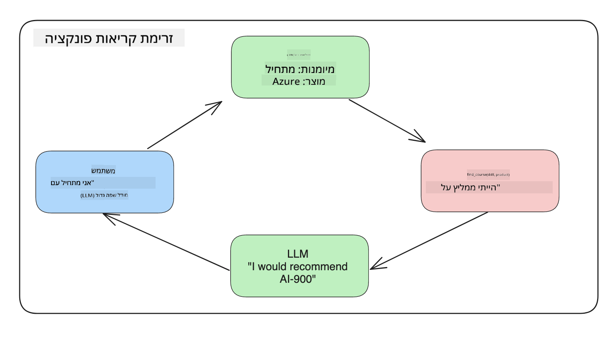

<!--
CO_OP_TRANSLATOR_METADATA:
{
  "original_hash": "77a48a201447be19aa7560706d6f93a0",
  "translation_date": "2025-07-09T14:38:02+00:00",
  "source_file": "11-integrating-with-function-calling/README.md",
  "language_code": "he"
}
-->
# אינטגרציה עם קריאת פונקציות

[](https://aka.ms/gen-ai-lesson11-gh?WT.mc_id=academic-105485-koreyst)

למדת לא מעט עד כה בשיעורים הקודמים. עם זאת, אפשר להשתפר עוד יותר. כמה מהנושאים שנרצה לטפל בהם הם איך לקבל פורמט תגובה עקבי יותר כדי להקל על העבודה עם התגובה בהמשך, וגם אולי להוסיף נתונים ממקורות נוספים כדי להעשיר את האפליקציה שלנו.

הבעיות שהוזכרו לעיל הן אלו שהפרק הזה מתמקד בפתרונן.

## מבוא

בשיעור זה נלמד:

- להסביר מהי קריאת פונקציות ומתי משתמשים בה.
- ליצור קריאת פונקציה באמצעות Azure OpenAI.
- כיצד לשלב קריאת פונקציה באפליקציה.

## מטרות הלמידה

בסיום השיעור תוכל:

- להסביר את המטרה בשימוש בקריאת פונקציות.
- להגדיר קריאת פונקציה באמצעות שירות Azure OpenAI.
- לעצב קריאות פונקציה יעילות למקרה השימוש של האפליקציה שלך.

## תרחיש: שיפור הצ'אטבוט שלנו עם פונקציות

בשיעור זה נרצה לבנות תכונה לסטארטאפ החינוכי שלנו שתאפשר למשתמשים להשתמש בצ'אטבוט כדי למצוא קורסים טכניים. נמליץ על קורסים שמתאימים לרמת המיומנות שלהם, לתפקיד הנוכחי ולתחום הטכנולוגיה שמעניין אותם.

כדי להשלים את התרחיש הזה, נשתמש בשילוב של:

- `Azure OpenAI` ליצירת חווית שיחה למשתמש.
- `Microsoft Learn Catalog API` שיעזור למשתמשים למצוא קורסים בהתאם לבקשתם.
- `Function Calling` שיקח את השאילתה של המשתמש וישלח אותה לפונקציה שתבצע את בקשת ה-API.

כדי להתחיל, נבחן למה בכלל נרצה להשתמש בקריאת פונקציות:

## למה קריאת פונקציות

לפני קריאת פונקציות, התגובות מ-LLM היו לא מובנות ולא עקביות. המפתחים נדרשו לכתוב קוד אימות מורכב כדי לוודא שהם יכולים להתמודד עם כל וריאציה של תגובה. משתמשים לא יכלו לקבל תשובות כמו "מה מזג האוויר הנוכחי בסטוקהולם?". זאת מכיוון שהמודלים היו מוגבלים לזמן שבו אומנו הנתונים.

קריאת פונקציות היא תכונה של שירות Azure OpenAI שמטרתה להתגבר על המגבלות הבאות:

- **פורמט תגובה עקבי**. אם נוכל לשלוט טוב יותר בפורמט התגובה, נוכל לשלב את התגובה בקלות רבה יותר במערכות אחרות.
- **נתונים חיצוניים**. היכולת להשתמש בנתונים ממקורות אחרים של האפליקציה בהקשר של שיחה.

## המחשת הבעיה דרך תרחיש

> אנו ממליצים להשתמש ב-[המחברת המצורפת](python/aoai-assignment.ipynb) אם ברצונך להריץ את התרחיש הבא. אפשר גם פשוט לקרוא ולהבין כיצד פונקציות יכולות לעזור לפתור את הבעיה.

נבחן דוגמה שממחישה את בעיית פורמט התגובה:

נניח שאנחנו רוצים ליצור בסיס נתונים של נתוני סטודנטים כדי להציע להם את הקורס המתאים. למטה יש שתי תיאורים של סטודנטים שהם מאוד דומים בנתונים שהם מכילים.

1. יצירת חיבור למשאב Azure OpenAI שלנו:

   ```python
   import os
   import json
   from openai import AzureOpenAI
   from dotenv import load_dotenv
   load_dotenv()

   client = AzureOpenAI(
   api_key=os.environ['AZURE_OPENAI_API_KEY'],  # this is also the default, it can be omitted
   api_version = "2023-07-01-preview"
   )

   deployment=os.environ['AZURE_OPENAI_DEPLOYMENT']
   ```

   למטה יש קוד פייתון שמגדיר את החיבור ל-Azure OpenAI שבו מגדירים את `api_type`, `api_base`, `api_version` ו-`api_key`.

1. יצירת שני תיאורי סטודנטים באמצעות המשתנים `student_1_description` ו-`student_2_description`.

   ```python
   student_1_description="Emily Johnson is a sophomore majoring in computer science at Duke University. She has a 3.7 GPA. Emily is an active member of the university's Chess Club and Debate Team. She hopes to pursue a career in software engineering after graduating."

   student_2_description = "Michael Lee is a sophomore majoring in computer science at Stanford University. He has a 3.8 GPA. Michael is known for his programming skills and is an active member of the university's Robotics Club. He hopes to pursue a career in artificial intelligence after finishing his studies."
   ```

   נרצה לשלוח את תיאורי הסטודנטים הללו ל-LLM כדי שיפרק את הנתונים. נתונים אלו יוכלו לשמש בהמשך באפליקציה שלנו, להישלח ל-API או להישמר בבסיס נתונים.

1. ניצור שני פרומפטים זהים שבהם ננחה את ה-LLM אילו מידע אנחנו מעוניינים לקבל:

   ```python
   prompt1 = f'''
   Please extract the following information from the given text and return it as a JSON object:

   name
   major
   school
   grades
   club

   This is the body of text to extract the information from:
   {student_1_description}
   '''

   prompt2 = f'''
   Please extract the following information from the given text and return it as a JSON object:

   name
   major
   school
   grades
   club

   This is the body of text to extract the information from:
   {student_2_description}
   '''
   ```

   הפרומפטים למעלה מנחים את ה-LLM לחלץ מידע ולהחזיר את התגובה בפורמט JSON.

1. לאחר שהגדרנו את הפרומפטים והחיבור ל-Azure OpenAI, נשלח את הפרומפטים ל-LLM באמצעות `openai.ChatCompletion`. נשמור את הפרומפט במשתנה `messages` וניתן את התפקיד כ-`user`. זה מדמה הודעה ממשתמש שנכתבת לצ'אטבוט.

   ```python
   # response from prompt one
   openai_response1 = client.chat.completions.create(
   model=deployment,
   messages = [{'role': 'user', 'content': prompt1}]
   )
   openai_response1.choices[0].message.content

   # response from prompt two
   openai_response2 = client.chat.completions.create(
   model=deployment,
   messages = [{'role': 'user', 'content': prompt2}]
   )
   openai_response2.choices[0].message.content
   ```

כעת נוכל לשלוח את שתי הבקשות ל-LLM ולבדוק את התגובה שקיבלנו על ידי מציאתה כך: `openai_response1['choices'][0]['message']['content']`.

1. לבסוף, נוכל להמיר את התגובה לפורמט JSON על ידי קריאה ל-`json.loads`:

   ```python
   # Loading the response as a JSON object
   json_response1 = json.loads(openai_response1.choices[0].message.content)
   json_response1
   ```

   תגובה 1:

   ```json
   {
     "name": "Emily Johnson",
     "major": "computer science",
     "school": "Duke University",
     "grades": "3.7",
     "club": "Chess Club"
   }
   ```

   תגובה 2:

   ```json
   {
     "name": "Michael Lee",
     "major": "computer science",
     "school": "Stanford University",
     "grades": "3.8 GPA",
     "club": "Robotics Club"
   }
   ```

   למרות שהפרומפטים זהים והתיאורים דומים, אנו רואים שהערכים של המאפיין `Grades` מעוצבים בצורה שונה, לפעמים בפורמט `3.7` ולפעמים `3.7 GPA` למשל.

   התוצאה הזו נובעת מכך שה-LLM מקבל נתונים לא מובנים בצורת הפרומפט הכתוב ומחזיר גם הוא נתונים לא מובנים. אנחנו צריכים פורמט מובנה כדי לדעת למה לצפות כשאנחנו מאחסנים או משתמשים בנתונים האלה.

אז איך פותרים את בעיית הפורמט? באמצעות קריאת פונקציות, נוכל לוודא שאנחנו מקבלים נתונים מובנים בחזרה. כשמשתמשים בקריאת פונקציות, ה-LLM לא קורא או מריץ פונקציות בפועל. במקום זאת, אנחנו יוצרים מבנה שה-LLM צריך לעקוב אחריו בתגובותיו. לאחר מכן, אנחנו משתמשים בתגובות המובנות האלה כדי לדעת איזו פונקציה להריץ באפליקציות שלנו.



לאחר מכן נוכל לקחת את מה שהפונקציה מחזירה ולשלוח זאת חזרה ל-LLM. ה-LLM יגיב בשפה טבעית כדי לענות על השאילתה של המשתמש.

## מקרים לשימוש בקריאות פונקציה

ישנם מקרים רבים שבהם קריאות פונקציה יכולות לשפר את האפליקציה שלך, כמו:

- **קריאה לכלים חיצוניים**. צ'אטבוטים מצוינים במתן תשובות לשאלות משתמשים. באמצעות קריאת פונקציות, הצ'אטבוטים יכולים להשתמש בהודעות מהמשתמשים כדי לבצע משימות מסוימות. לדוגמה, סטודנט יכול לבקש מהצ'אטבוט "שלח מייל למדריך שלי ואמר שאני צריך עזרה נוספת בנושא הזה". זה יכול להוביל לקריאת פונקציה בשם `send_email(to: string, body: string)`.

- **יצירת שאילתות API או בסיסי נתונים**. משתמשים יכולים למצוא מידע בשפה טבעית שהופך לשאילתה או בקשת API בפורמט מסודר. דוגמה לכך היא מורה שמבקש "מי הסטודנטים שסיימו את המטלה האחרונה" שיכולה לקרוא לפונקציה בשם `get_completed(student_name: string, assignment: int, current_status: string)`.

- **יצירת נתונים מובנים**. משתמשים יכולים לקחת קטע טקסט או CSV ולהשתמש ב-LLM כדי לחלץ מידע חשוב ממנו. לדוגמה, סטודנט יכול להמיר מאמר מוויקיפדיה על הסכמי שלום ליצירת כרטיסיות לימוד מבוססות AI. זה יכול להתבצע באמצעות פונקציה בשם `get_important_facts(agreement_name: string, date_signed: string, parties_involved: list)`.

## יצירת קריאת הפונקציה הראשונה שלך

תהליך יצירת קריאת פונקציה כולל 3 שלבים עיקריים:

1. **קריאה** ל-Chat Completions API עם רשימת הפונקציות שלך והודעת משתמש.
2. **קריאת** תגובת המודל כדי לבצע פעולה, כלומר להריץ פונקציה או קריאת API.
3. **ביצוע** קריאה נוספת ל-Chat Completions API עם התגובה מהפונקציה שלך כדי להשתמש במידע זה ליצירת תגובה למשתמש.


### שלב 1 - יצירת הודעות

השלב הראשון הוא ליצור הודעת משתמש. ניתן להקצות אותה באופן דינמי על ידי לקיחת הערך מקלט טקסט או להקצות ערך כאן. אם זו הפעם הראשונה שאתה עובד עם Chat Completions API, עלינו להגדיר את ה-`role` ואת ה-`content` של ההודעה.

ה-`role` יכול להיות `system` (יצירת חוקים), `assistant` (המודל) או `user` (המשתמש הקצה). עבור קריאת פונקציות, נגדיר זאת כ-`user` עם שאלה לדוגמה.

```python
messages= [ {"role": "user", "content": "Find me a good course for a beginner student to learn Azure."} ]
```

על ידי הקצאת תפקידים שונים, ברור ל-LLM אם זו מערכת שמדברת או המשתמש, מה שעוזר לבנות היסטוריית שיחה שה-LLM יכול להמשיך ממנה.

### שלב 2 - יצירת פונקציות

לאחר מכן נגדיר פונקציה ואת הפרמטרים שלה. נשתמש בפונקציה אחת בלבד בשם `search_courses`, אך ניתן ליצור פונקציות מרובות.

> **חשוב**: פונקציות נכללות בהודעת המערכת ל-LLM ויכללו בכמות הטוקנים הזמינים שלך.

להלן, ניצור את הפונקציות כמערך של פריטים. כל פריט הוא פונקציה ויש לה את המאפיינים `name`, `description` ו-`parameters`:

```python
functions = [
   {
      "name":"search_courses",
      "description":"Retrieves courses from the search index based on the parameters provided",
      "parameters":{
         "type":"object",
         "properties":{
            "role":{
               "type":"string",
               "description":"The role of the learner (i.e. developer, data scientist, student, etc.)"
            },
            "product":{
               "type":"string",
               "description":"The product that the lesson is covering (i.e. Azure, Power BI, etc.)"
            },
            "level":{
               "type":"string",
               "description":"The level of experience the learner has prior to taking the course (i.e. beginner, intermediate, advanced)"
            }
         },
         "required":[
            "role"
         ]
      }
   }
]
```

נפרט כל מופע פונקציה ביתר פירוט:

- `name` - שם הפונקציה שאנו רוצים שתקרא.
- `description` - תיאור אופן פעולת הפונקציה. חשוב להיות מדויקים וברורים כאן.
- `parameters` - רשימת ערכים ופורמט שהמודל אמור להפיק בתגובתו. מערך הפרמטרים מורכב מפריטים שבהם יש את המאפיינים הבאים:
  1.  `type` - סוג הנתונים של המאפיינים שבהם יאוחסנו הערכים.
  1.  `properties` - רשימת הערכים הספציפיים שהמודל ישתמש בהם בתגובתו
      1. `name` - המפתח הוא שם המאפיין שהמודל ישתמש בו בתגובה המפורמטת, לדוגמה, `product`.
      1. `type` - סוג הנתונים של מאפיין זה, לדוגמה, `string`.
      1. `description` - תיאור המאפיין הספציפי.

יש גם מאפיין אופציונלי `required` - מאפיין חובה להשלמת קריאת הפונקציה.

### שלב 3 - ביצוע קריאת הפונקציה

לאחר שהגדרנו פונקציה, עלינו לכלול אותה בקריאה ל-Chat Completion API. נעשה זאת על ידי הוספת `functions` לבקשה. במקרה זה `functions=functions`.

יש גם אפשרות להגדיר את `function_call` ל-`auto`. משמעות הדבר היא שנאפשר ל-LLM להחליט איזו פונקציה יש לקרוא בהתבסס על הודעת המשתמש במקום להקצות זאת בעצמנו.

להלן קוד שבו קוראים ל-`ChatCompletion.create`, שים לב כיצד מגדירים `functions=functions` ו-`function_call="auto"` וכך נותנים ל-LLM את הבחירה מתי לקרוא לפונקציות שסיפקנו:

```python
response = client.chat.completions.create(model=deployment,
                                        messages=messages,
                                        functions=functions,
                                        function_call="auto")

print(response.choices[0].message)
```

התגובה שמתקבלת כעת נראית כך:

```json
{
  "role": "assistant",
  "function_call": {
    "name": "search_courses",
    "arguments": "{\n  \"role\": \"student\",\n  \"product\": \"Azure\",\n  \"level\": \"beginner\"\n}"
  }
}
```

כאן ניתן לראות כיצד פונקציית `search_courses` נקראה ואילו ארגומנטים נמסרו, כפי שמפורט במאפיין `arguments` בתגובה בפורמט JSON.

המסקנה היא שה-LLM הצליח למצוא את הנתונים המתאימים לארגומנטים של הפונקציה מכיוון שחילץ אותם מהערך שנמסר לפרמטר `messages` בקריאת השלמת השיחה. למטה תזכורת לערך `messages`:

```python
messages= [ {"role": "user", "content": "Find me a good course for a beginner student to learn Azure."} ]
```

כפי שניתן לראות, `student`, `Azure` ו-`beginner` חולצו מ-`messages` והוגדרו כקלט לפונקציה. שימוש בפונקציות בדרך זו הוא דרך מצוינת לחלץ מידע מפרומפט וגם לספק מבנה ל-LLM וליצור פונקציונליות שניתנת לשימוש חוזר.

כעת נבחן כיצד נוכל להשתמש בזה באפליקציה שלנו.

## שילוב קריאות פונקציה באפליקציה

לאחר שבדקנו את התגובה המפורמטת מה-LLM, נוכל לשלב זאת באפליקציה.

### ניהול הזרימה

כדי לשלב זאת באפליקציה שלנו, ננקוט בצעדים הבאים:

1. ראשית, נבצע את הקריאה לשירותי OpenAI ונשמור את ההודעה במשתנה בשם `response_message`.

   ```python
   response_message = response.choices[0].message
   ```

1. כעת נגדיר את הפונקציה שתבצע קריאה ל-Microsoft Learn API כדי לקבל רשימת קורסים:

   ```python
   import requests

   def search_courses(role, product, level):
     url = "https://learn.microsoft.com/api/catalog/"
     params = {
        "role": role,
        "product": product,
        "level": level
     }
     response = requests.get(url, params=params)
     modules = response.json()["modules"]
     results = []
     for module in modules[:5]:
        title = module["title"]
        url = module["url"]
        results.append({"title": title, "url": url})
     return str(results)
   ```

   שים לב שכעת אנו יוצרים פונקציית פייתון אמיתית שממפה לשמות הפונקציות שהוגדרו במשתנה `functions`. בנוסף, אנו מבצעים קריאות API חיצוניות אמיתיות כדי להביא את הנתונים הדרושים. במקרה זה, אנו פונים ל-Microsoft Learn API כדי לחפש מודולי הדרכה.

טוב, יצרנו את משתנה `functions` ופונקציית פייתון תואמת, איך נודיע ל-LLM כיצד למפות ביניהם כדי שהפונקציה שלנו תוקרא?

1. כדי לבדוק אם יש צורך לקרוא לפונקציית פייתון, עלינו לבדוק את תגובת ה-LLM ולראות אם `function_call` הוא חלק ממנה ולקרוא לפונקציה שצוינה. כך ניתן לבצע את הבדיקה:

   ```python
   # Check if the model wants to call a function
   if response_message.function_call.name:
    print("Recommended Function call:")
    print(response_message.function_call.name)
    print()

    # Call the function.
    function_name = response_message.function_call.name

    available_functions = {
            "search_courses": search_courses,
    }
    function_to_call = available_functions[function_name]

    function_args = json.loads(response_message.function_call.arguments)
    function_response = function_to_call(**function_args)

    print("Output of function call:")
    print(function_response)
    print(type(function_response))


    # Add the assistant response and function response to the messages
    messages.append( # adding assistant response to messages
        {
            "role": response_message.role,
            "function_call": {
                "name": function_name,
                "arguments": response_message.function_call.arguments,
            },
            "content": None
        }
    )
    messages.append( # adding function response to messages
        {
            "role": "function",
            "name": function_name,
            "content":function_response,
        }
    )
   ```

   שלוש השורות הללו מבטיחות שנחלץ את שם הפונקציה, את הארגומנטים ונבצע את הקריאה:

   ```python
   function_to_call = available_functions[function_name]

   function_args = json.loads(response_message.function_call.arguments)
   function_response = function_to_call(**function_args)
   ```

   להלן הפלט מהרצת הקוד שלנו:

   **פלט**

   ```Recommended Function call:
   {
     "name": "search_courses",
     "arguments": "{\n  \"role\": \"student\",\n  \"product\": \"Azure\",\n  \"level\": \"beginner\"\n}"
   }

   Output of function call:
   [{'title': 'Describe concepts of cryptography', 'url': 'https://learn.microsoft.com/training/modules/describe-concepts-of-cryptography/?
   WT.mc_id=api_CatalogApi'}, {'title': 'Introduction to audio classification with TensorFlow', 'url': 'https://learn.microsoft.com/en-
   us/training/modules/intro-audio-classification-tensorflow/?WT.mc_id=api_CatalogApi'}, {'title': 'Design a Performant Data Model in Azure SQL
   Database with Azure Data Studio', 'url': 'https://learn.microsoft.com/training/modules/design-a-data-model-with-ads/?
   WT.mc_id=api_CatalogApi'}, {'title': 'Getting started with the Microsoft Cloud Adoption Framework for Azure', 'url':
   'https://learn.microsoft.com/training/modules/cloud-adoption-framework-getting-started/?WT.mc_id=api_CatalogApi'}, {'title': 'Set up the
   Rust development environment', 'url': 'https://learn.microsoft.com/training/modules/rust-set-up-environment/?WT.mc_id=api_CatalogApi'}]
   <class 'str'>
   ```

1. כעת נשלח את ההודעה המעודכנת, `messages` ל-LLM כדי לקבל תגובה בשפה טבעית במקום תגובת JSON מפורמטת של API.

   ```python
   print("Messages in next request:")
   print(messages)
   print()

   second_response = client.chat.completions.create(
      messages=messages,
      model=deployment,
      function_call="auto",
      functions=functions,
      temperature=0
         )  # get a new response from GPT where it can see the function response


   print(second_response.choices[0].message)
   ```

   **פלט**

   ```python
   {
     "role": "assistant",
     "content": "I found some good courses for beginner students to learn Azure:\n\n1. [Describe concepts of cryptography] (https://learn.microsoft.com/training/modules/describe-concepts-of-cryptography/?WT.mc_id=api_CatalogApi)\n2. [Introduction to audio classification with TensorFlow](https://learn.microsoft.com/training/modules/intro-audio-classification-tensorflow/?WT.mc_id=api_CatalogApi)\n3. [Design a Performant Data Model in Azure SQL Database with Azure Data Studio](https://learn.microsoft.com/training/modules/design-a-data-model-with-ads/?WT.mc_id=api_CatalogApi)\n4. [Getting started with the Microsoft Cloud Adoption Framework for Azure](https://learn.microsoft.com/training/modules/cloud-adoption-framework-getting-started/?WT.mc_id=api_CatalogApi)\n5. [Set up the Rust development environment](https://learn.microsoft.com/training/modules/rust-set-up-environment/?WT.mc_id=api_CatalogApi)\n\nYou can click on the links to access the courses."
   }

   ```

## מטלה

כדי להמשיך ללמוד על Azure OpenAI Function Calling תוכל לבנות:

- פרמטרים נוספים לפונקציה שעשויים לעזור ללומדים למצוא יותר קורסים.
- ליצור קריאת פונקציה נוספת שלוקחת מידע נוסף מהלומד כמו שפת האם שלו.
- ליצור טיפול בשגיאות כאשר קריאת הפונקציה ו/או קריאת ה-API לא מחזירות קורסים מתאימים.
## עבודה מצוינת! המשך את המסע

לאחר שסיימת את השיעור הזה, עיין באוסף [Generative AI Learning](https://aka.ms/genai-collection?WT.mc_id=academic-105485-koreyst) שלנו כדי להמשיך לשפר את הידע שלך ב-Generative AI!

עבור לשיעור 12, שם נבחן כיצד [לעצב UX עבור יישומי AI](../12-designing-ux-for-ai-applications/README.md?WT.mc_id=academic-105485-koreyst)!

**כתב ויתור**:  
מסמך זה תורגם באמצעות שירות תרגום מבוסס בינה מלאכותית [Co-op Translator](https://github.com/Azure/co-op-translator). למרות שאנו שואפים לדיוק, יש לקחת בחשבון כי תרגומים אוטומטיים עלולים להכיל שגיאות או אי-דיוקים. המסמך המקורי בשפת המקור שלו נחשב למקור הסמכותי. למידע קריטי מומלץ להשתמש בתרגום מקצועי על ידי מתרגם אנושי. אנו לא נושאים באחריות לכל אי-הבנה או פרשנות שגויה הנובעת משימוש בתרגום זה.