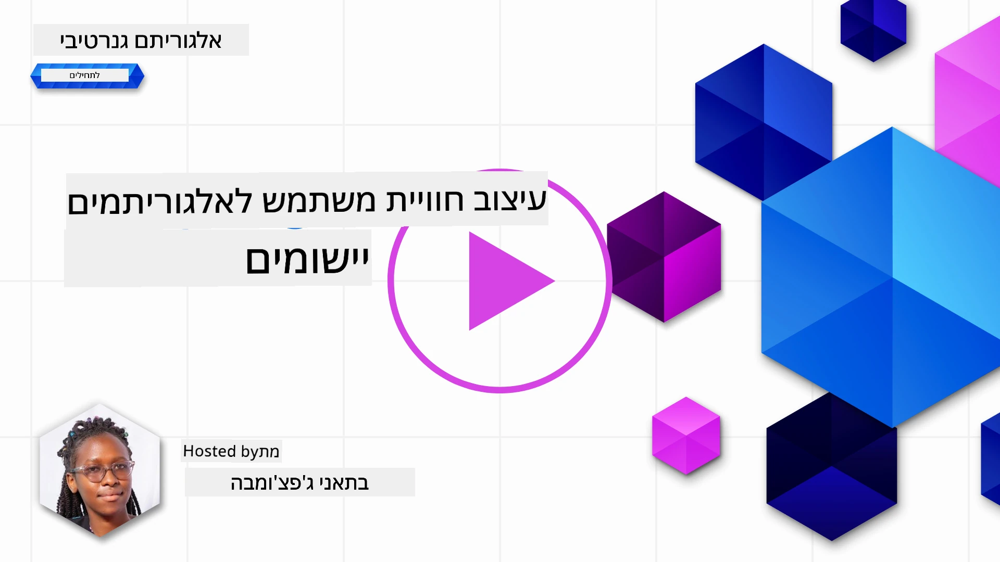
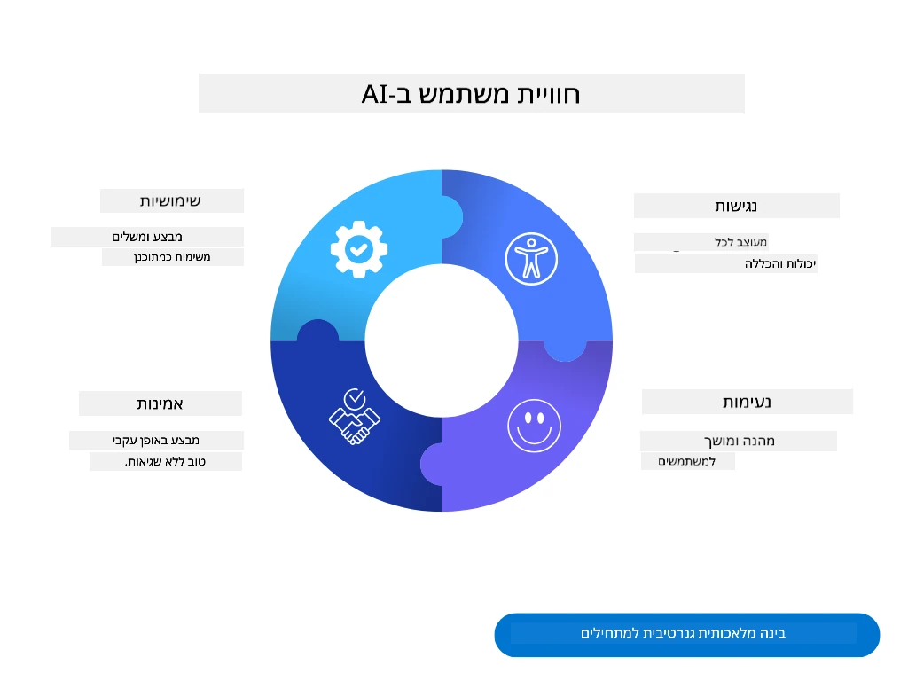
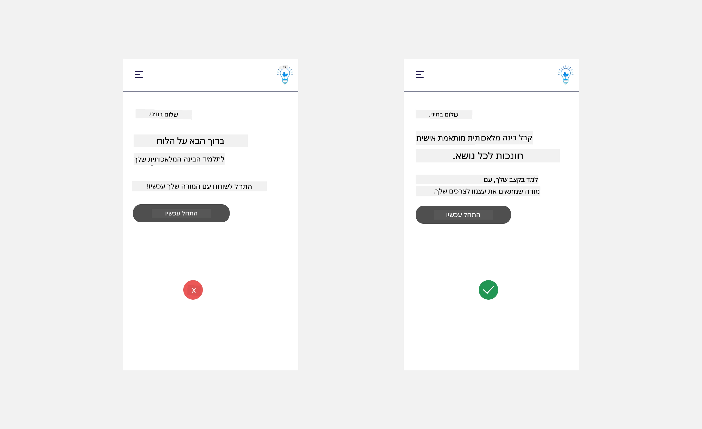
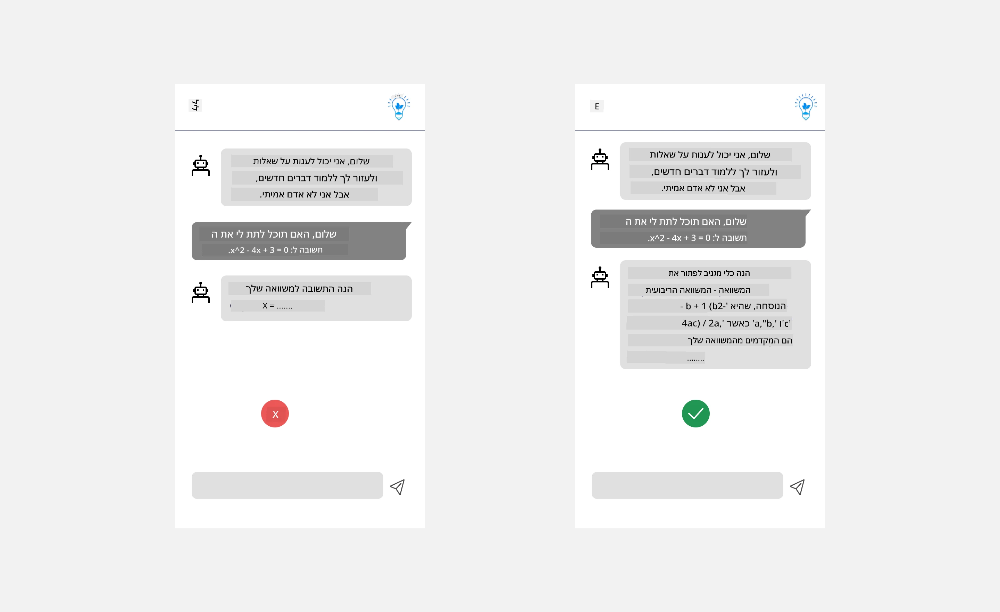
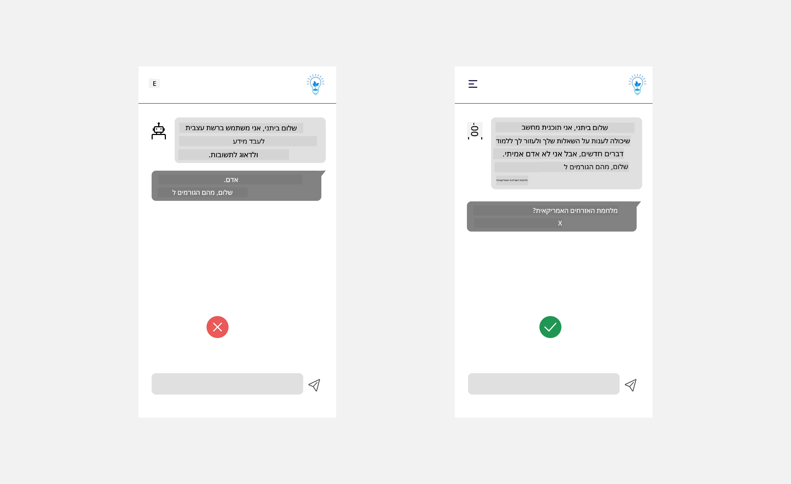
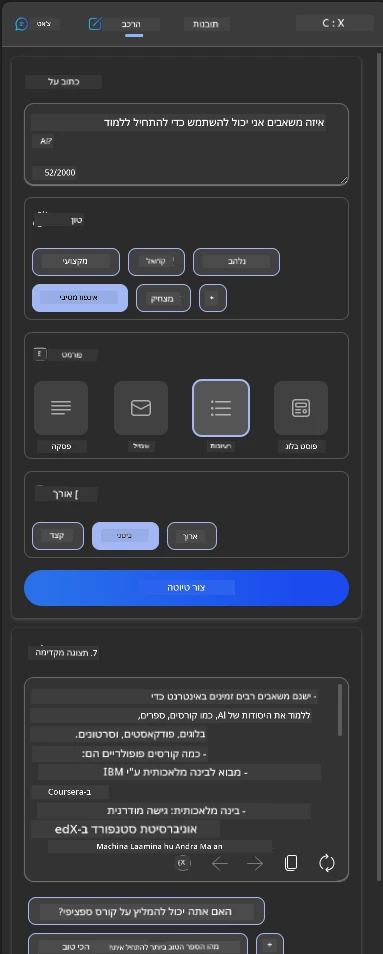
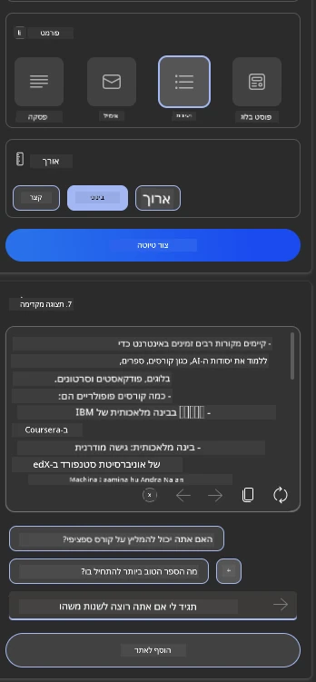
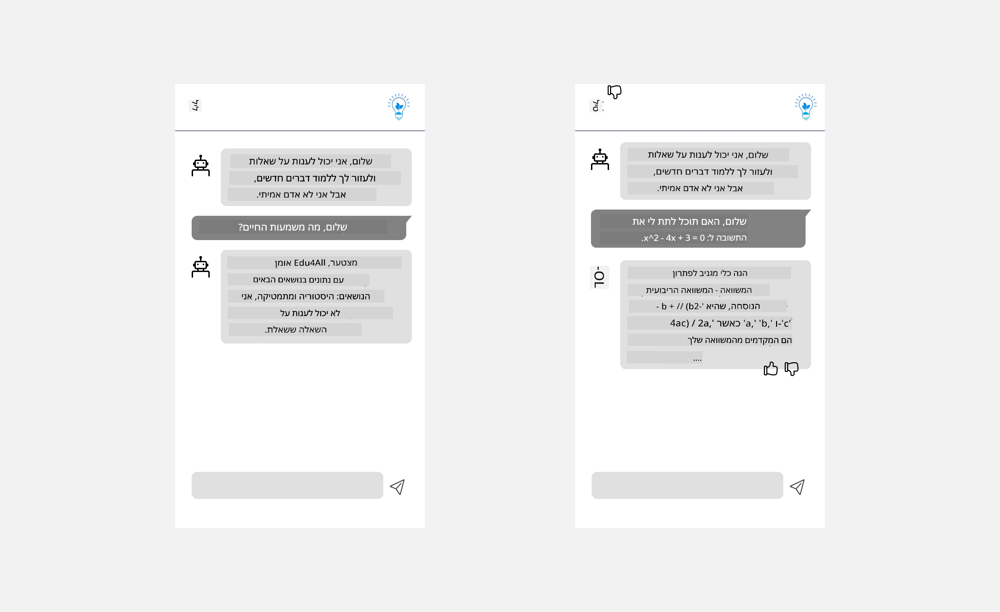

# עיצוב חוויית משתמש לאפליקציות בינה מלאכותית

> _(לחצו על התמונה למעלה כדי לצפות בסרטון של השיעור)_

חוויית המשתמש היא היבט מאוד חשוב בבניית אפליקציות. משתמשים צריכים להיות מסוגלים להשתמש באפליקציה שלכם בצורה יעילה כדי לבצע משימות. היעילות היא דבר אחד, אך עליכם גם לעצב אפליקציות כך שיוכלו לשמש כל אחד, כדי להפוך אותן לנגישות. פרק זה יתמקד בתחום זה כדי שאתם בסופו של דבר תעצבו אפליקציה שאנשים יכולים ורוצים להשתמש בה.

## מבוא

חוויית המשתמש היא האופן שבו משתמש מתקשר ומשתמש במוצר או שירות ספציפי, בין אם זה מערכת, כלי או עיצוב. כשמפתחים אפליקציות בינה מלאכותית, המפתחים לא מתמקדים רק בהבטחת יעילות חוויית המשתמש אלא גם באתיקה. בשיעור זה נסקור כיצד לבנות אפליקציות בינה מלאכותית (AI) שמטפלות בצרכי המשתמש.

השיעור יכסה את התחומים הבאים:

- מבוא לחוויית משתמש והבנת צרכי המשתמש  
- עיצוב אפליקציות בינה מלאכותית לאמון ושקיפות  
- עיצוב אפליקציות בינה מלאכותית לשיתוף פעולה ומשוב  

## יעדי הלמידה

לאחר שלקחתם שיעור זה, תוכלו:

- להבין כיצד לבנות אפליקציות בינה מלאכותית העונות לצרכי המשתמש.  
- לעצב אפליקציות בינה מלאכותית שמקדמות אמון ושיתוף פעולה.  

### דרישות מוקדמות

הקדישו זמן לקרוא עוד על [חוויית משתמש ומחשבה עיצובית.](https://learn.microsoft.com/training/modules/ux-design?WT.mc_id=academic-105485-koreyst)

## מבוא לחוויית משתמש והבנת צרכי המשתמש

בסטארטאפ החינוכי הבדיוני שלנו, יש לנו שני משתמשים עיקריים, מורים ותלמידים. לכל אחד משני המשתמשים יש צרכים ייחודיים. עיצוב שממוקד במשתמש מכתיב את העדיפות למשתמש ומבטיח שהמוצרים הם רלוונטיים ומועילים עבור אלה להם הם מיועדים.

האפליקציה צריכה להיות **שימושית, אמינה, נגישה ונעימה** כדי לספק חוויית משתמש טובה.

### שימושיות

שימושיות משמעותה שהאפליקציה כוללת פונקציונליות התואמת את מטרתה המיועדת, לדוגמה אוטומציה של תהליך הדירוג או יצירת כרטיסיות לסיכום חומר. אפליקציה שמבצעת אוטומציה של תהליך הדירוג צריכה להיות מסוגלת להקצות ציונים בדיוק וביעילות לעבודות התלמידים על פי קריטריונים שהוגדרו מראש. באופן דומה, אפליקציה שיוצרת כרטיסיות סיכום צריכה להיות מסוגלת ליצור שאלות רלוונטיות ומגוונות על סמך הנתונים שלה.

### אמינות

אמינות פירושה שהאפליקציה יכולה לבצע את המשימה שלה בעקביות וללא שגיאות. עם זאת, כמו בני אדם, גם הבינה המלאכותית אינה מושלמת ויכולה לטעות. האפליקציות עלולות להיפגש בטעויות או במצבים לא צפויים שדורשים התערבות אנושית או תיקון. כיצד אתם מתמודדים עם שגיאות? בחלק האחרון של השיעור נעסוק כיצד מערכות ואפליקציות בינה מלאכותית מעוצבות לשיתוף פעולה ומשוב.

### נגישות

נגישות פירושה להרחיב את חוויית המשתמש למשתמשים עם יכולות מגוונות, כולל בעלי מוגבלויות, ולהקפיד שאף אחד לא ייחשב מחוץ לתמונה. על ידי ביצוע עקרונות והנחיות נגישות, פתרונות בינה מלאכותית הופכים ליותר כוללים, נגישים ושימושיים לכל המשתמשים.

### נעימות

נעימות פירושה שהאפליקציה מהנה לשימוש. חוויית משתמש מושכת יכולה להשפיע באופן חיובי על המשתמש ולעודד אותו לחזור לאפליקציה ולהגדיל את הכנסות העסק.

לא כל אתגר ניתן לפתור באמצעות בינה מלאכותית. הבינה המלאכותית באה לשפר את חוויית המשתמש שלכם, בין אם באמצעות אוטומציה של משימות ידניות או התאמה אישית של חוויות המשתמש.

## עיצוב אפליקציות בינה מלאכותית לאמון ושקיפות

בניית אמון היא קריטית בעת עיצוב אפליקציות בינה מלאכותית. האמון מבטיח שהמשתמש בטוח שהאפליקציה תבצע את העבודה, תספק תוצאות בעקביות והתוצאות הן מה שמשתמש צריך. סיכון בתחום זה הוא חוסר אמון ואמון יתר. חוסר אמון מתרחש כאשר למשתמש יש אמון מועט או אפסי במערכת בינה מלאכותית, מה שמוביל לדחיית האפליקציה שלכם. אמון יתר מתרחש כאשר משתמש מעריך גבוה מדי את יכולות מערכת הבינה המלאכותית, מה שמוביל לכך שהמשתמשים יבזו למערכת יותר מדי. לדוגמה, מערכת דירוג אוטומטית במקרה של אמון יתר עשויה להוביל לכך שמורה לא יבדוק כמה מן הניירות כדי לוודא שמערכת הדירוג פועלת היטב. זה יכול להביא לציונים לא הוגנים או לא מדויקים לתלמידים, או להזדמנויות שהוחמצו למשוב ולשיפור.

שני דרכים להבטיח שהאמון יעמוד במרכז העיצוב הן הסברנות ושליטה.

### הסברנות

כאשר הבינה המלאכותית מסייעת בקבלת החלטות כגון העברת ידע לדורות הבאים, חשוב שמורים והורים יבינו כיצד מתקבלות ההחלטות. זו הסברנות - הבנת האופן שבו אפליקציות בינה מלאכותית מקבלות החלטות. עיצוב להסברנות כולל הוספת פרטים המדגישים כיצד הבינה המלאכותית הגיעה לפלט. הקהל צריך להיות מודע לכך שהפלט נוצר על ידי בינה מלאכותית ולא אדם. לדוגמה, במקום לומר "התחל לדבר עם המורה שלך עכשיו", אמרו "השתמש במורה בינה מלאכותית שמתאים את עצמו לצרכים שלך ועוזר לך ללמוד בקצב שלך."

דוגמה נוספת היא כיצד הבינה המלאכותית משתמשת בנתוני משתמש ונתונים אישיים. לדוגמה, משתמש עם פרסונה תלמיד עשוי להיות מוגבל על פי הפרסונה שלו. הבינה המלאכותית עשויה שלא לחשוף תשובות לשאלות אך תוכל לכוון את המשתמש כיצד לחשוב ולפתור בעיה.

חלק מרכזי אחר של הסברנות הוא פישוט ההסברים. תלמידים ומורים לא בהכרח מומחי בינה מלאכותית, לכן יש לפשט ולהקל על ההבנה של מה האפליקציה יכולה או לא יכולה לעשות.

### שליטה

בינה מלאכותית גנרטיבית יוצרת שיתוף פעולה בין הבינה המלאכותית למשתמש, כאשר למשל משתמש יכול לשנות בקשות לתוצאות שונות. בנוסף, לאחר שנוצר הפלט, המשתמשים צריכים להיות מסוגלים לשנות את התוצאות ולקבל תחושת שליטה. לדוגמה, בשימוש ב-Microsoft Copilot (לשעבר Bing Chat), אפשר להתאים את הבקשה על פי פורמט, טון ואורך. ניתן להוסיף שינויים לפלט ולשנות את הפלט כפי שמוצג למטה:

תכונה נוספת ב-Microsoft Copilot שמאפשרת למשתמש שליטה על האפליקציה היא היכולת לבחור אם להיכלל או לא בנתונים שהבינה המלאכותית משתמשת בהם. עבור אפליקציה לבית ספר, תלמיד עשוי לרצות להשתמש בהערות שלו כמו גם במשאבי המורים כחומר לסיכום.

> בעת עיצוב אפליקציות בינה מלאכותית, יש להקפיד על כוונה מודעת כדי לוודא שהמשתמשים לא יתייחסו לבינה המלאכותית ביתר מדי וייצרו ציפיות לא ריאליות לגבי יכולותיה. דרך אחת לעשות זאת היא ליצור חיכוך בין הבקשות והתוצאות. להזכיר למשתמש שזה בינה מלאכותית ולא אדם חבר.

## עיצוב אפליקציות בינה מלאכותית לשיתוף פעולה ומשוב

כפי שהוזכר קודם, בינה מלאכותית גנרטיבית יוצרת שיתוף פעולה בין המשתמש לבינה המלאכותית. רוב האינטראקציות הן שבהן משתמש מזין בקשה והבינה המלאכותית מייצרת פלט. מה אם הפלט אינו נכון? כיצד האפליקציה מטפלת בשגיאות אם הן מתרחשות? האם הבינה המלאכותית מטילה את האשמה על המשתמש או לוקחת זמן להסביר את השגיאה?

יש לבנות באפליקציות בינה מלאכותית מנגנוני קבלת ומתן משוב. זה לא רק מסייע לשפר את מערכת הבינה המלאכותית אלא גם בונה אמון עם המשתמשים. יש לכלול לולאת משוב בעיצוב, לדוגמה ניתן לכלול סימון אגודל למעלה או למטה על הפלט.

דרך נוספת לטפל בכך היא לתקשר בצורה ברורה את היכולות והמגבלות של המערכת. כאשר משתמש מבצע טעות בבקשה מעבר ליכולות הבינה המלאכותית, יש להציע דרך להתמודדות עם זאת, כפי שמוצג למטה.

שגיאות מערכת נפוצות באפליקציות בהן המשתמש עשוי להזדקק לעזרה במידע מחוץ לתחום הבינה המלאכותית או כאשר לאפליקציה יש מגבלה בכמות השאלות/נושאים שמשתמש יכול ליצור עבורם סיכומים. לדוגמה, אפליקציית בינה מלאכותית שאומנה על נתונים בנושאים מוגבלים כמו היסטוריה ומתמטיקה לא תוכל לטפל בשאלות בנושא גאוגרפיה. כדי למתן זאת, מערכת הבינה המלאכותית יכולה לתת תגובה כמו: "מצטערים, המוצר שלנו אומן עם נתונים בנושאים הבאים....., אינני יכול לענות על השאלה ששאלת."

אפליקציות בינה מלאכותית אינן מושלמות, לכן הן צפויות לעשות טעויות. בעת עיצוב האפליקציות שלכם, עליכם להבטיח שתיצרו מרחב למשוב מהמשתמשים ולטיפול בשגיאות בצורה פשוטה וקלה להבנה.

## משימה

קחו כל אפליקציות בינה מלאכותית שבניתם עד כה, שקלו ליישם את השלבים הבאים באפליקציה שלכם:

- **נעימות:** שקלו כיצד להפוך את האפליקציה שלכם ליותר נעימה. האם אתם מוסיפים הסברים בכל מקום? האם אתם מעודדים את המשתמש לחקור? כיצד אתם מנוסחים את הודעות השגיאה?  

- **שימושיות:** בונים אפליקציית רשת. ודאו שהאפליקציה ניתנת לניווט גם באמצעות עכבר וגם באמצעות מקלדת.  

- **אמון ושקיפות:** אל תסמכו על הבינה המלאכותית לחלוטין ועל הפלט שלה, שקלו כיצד תוכלו להוסיף אדם לתהליך כדי לאמת את התוצאות. כמו כן, שקלו ויישמו דרכים נוספות להשגת אמון ושקיפות.  

- **שליטה:** תנו למשתמש שליטה על הנתונים שהוא מספק לאפליקציה. יישמו דרך בה המשתמש יכול לבחור להיכלל או לא להיכלל באיסוף נתונים באפליקציית הבינה המלאכותית.  

<!-- ## [Post-lecture quiz](../../../12-designing-ux-for-ai-applications/quiz-url) -->

## המשיכו ללמוד!

לאחר סיום שיעור זה, בדקו את [אוסף הלמידה של בינה מלאכותית גנרטיבית](https://aka.ms/genai-collection?WT.mc_id=academic-105485-koreyst) להמשך העמקת הידע שלכם בבינה מלאכותית גנרטיבית!

עברו לשיעור 13, בו נבחן כיצד [לבטוח באפליקציות בינה מלאכותית](../13-securing-ai-applications/README.md?WT.mc_id=academic-105485-koreyst)!

---

<!-- CO-OP TRANSLATOR DISCLAIMER START -->
**כתב ויתור**:
מסמך זה תורגם באמצעות שירות תרגום אוטומטי [Co-op Translator](https://github.com/Azure/co-op-translator). למרות שאנו שואפים לדיוק, יש לקחת בחשבון שתרגומים אוטומטיים עלולים להכיל שגיאות או אי-דיוקים. יש להחשיב את המסמך המקורי בשפתו הטבעית כמקור הסמכות. למידע קריטי מומלץ להשתמש בתרגום מקצועי על ידי מתרגם אדם. אנו לא אחראים לכל אי-הבנה או פירוש שגוי הנובע מהשימוש בתרגום זה.
<!-- CO-OP TRANSLATOR DISCLAIMER END -->