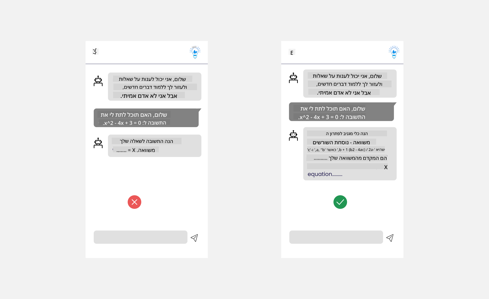
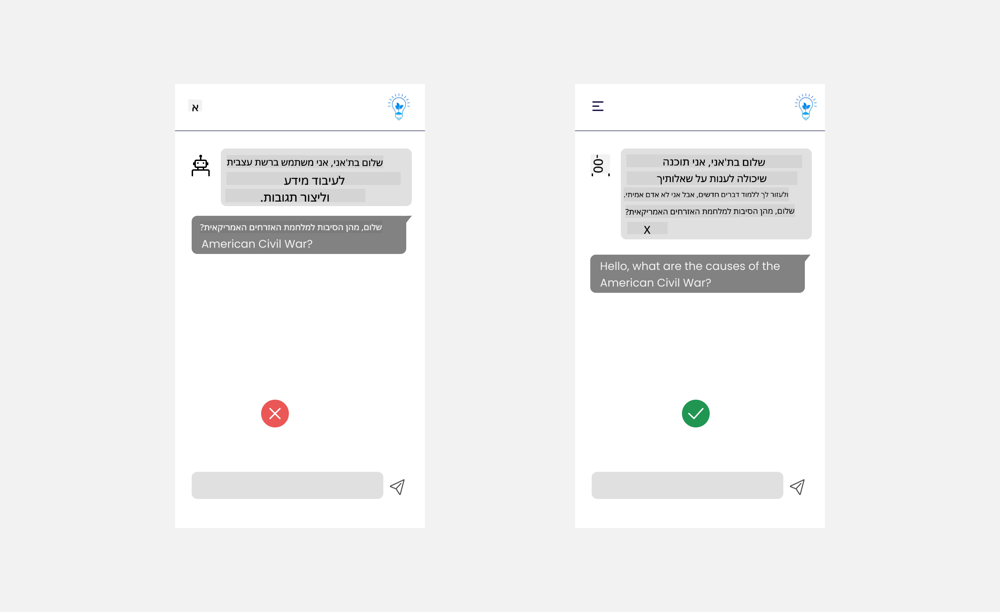

<!--
CO_OP_TRANSLATOR_METADATA:
{
  "original_hash": "ec385b41ee50579025d50cc03bfb3a25",
  "translation_date": "2025-07-09T15:00:42+00:00",
  "source_file": "12-designing-ux-for-ai-applications/README.md",
  "language_code": "he"
}
-->
# עיצוב חוויית משתמש לאפליקציות בינה מלאכותית

> _(לחצו על התמונה למעלה לצפייה בסרטון של השיעור)_

חוויית המשתמש היא היבט חשוב מאוד בבניית אפליקציות. המשתמשים צריכים להיות מסוגלים להשתמש באפליקציה שלכם בצורה יעילה כדי לבצע משימות. יעילות היא דבר אחד, אך חשוב גם לעצב אפליקציות כך שיוכלו לשמש את כולם, כדי להפוך אותן ל_נגישות_. פרק זה יתמקד בתחום זה, כדי שתוכלו לעצב אפליקציה שאנשים יכולים ורוצים להשתמש בה.

## מבוא

חוויית המשתמש היא האופן שבו משתמש מתקשר ומשתמש במוצר או שירות מסוים, בין אם זה מערכת, כלי או עיצוב. בפיתוח אפליקציות בינה מלאכותית, המפתחים לא מתמקדים רק בהבטחת חוויית משתמש יעילה, אלא גם אתית. בשיעור זה נלמד כיצד לבנות אפליקציות בינה מלאכותית (AI) שמטפלות בצרכי המשתמש.

השיעור יכסה את התחומים הבאים:

- מבוא לחוויית משתמש והבנת צרכי המשתמש
- עיצוב אפליקציות AI לאמון ושקיפות
- עיצוב אפליקציות AI לשיתוף פעולה ומשוב

## מטרות הלמידה

לאחר שיעור זה, תוכלו:

- להבין כיצד לבנות אפליקציות AI שעונות על צרכי המשתמש.
- לעצב אפליקציות AI שמקדמות אמון ושיתוף פעולה.

### דרישות מוקדמות

קחו זמן וקראו עוד על [חוויית משתמש וחשיבה עיצובית.](https://learn.microsoft.com/training/modules/ux-design?WT.mc_id=academic-105485-koreyst)

## מבוא לחוויית משתמש והבנת צרכי המשתמש

בחברת ההזנק החינוכית הבדיונית שלנו, יש שני משתמשים עיקריים: מורים ותלמידים. לכל אחד מהם צרכים ייחודיים. עיצוב ממוקד משתמש שם את המשתמש במרכז, ומבטיח שהמוצרים יהיו רלוונטיים ומועילים לאלו שהם מיועדים להם.

האפליקציה צריכה להיות **שימושית, אמינה, נגישה ונעימה** כדי לספק חוויית משתמש טובה.

### שימושיות

שימושיות פירושה שהאפליקציה כוללת פונקציונליות שמתאימה למטרתה, כמו אוטומציה של תהליך ההערכה או יצירת כרטיסיות חזרה. אפליקציה שמבצעת אוטומציה של תהליך ההערכה צריכה להיות מסוגלת להקצות ציונים לתלמידים בצורה מדויקת ויעילה על פי קריטריונים מוגדרים מראש. באופן דומה, אפליקציה שיוצרת כרטיסיות חזרה צריכה לייצר שאלות רלוונטיות ומגוונות בהתבסס על הנתונים שלה.

### אמינות

אמינות פירושה שהאפליקציה יכולה לבצע את המשימה שלה בעקביות וללא שגיאות. עם זאת, בינה מלאכותית, כמו בני אדם, אינה מושלמת ועלולה לטעות. האפליקציות עלולות להיתקל בשגיאות או במצבים בלתי צפויים שדורשים התערבות או תיקון אנושי. איך מטפלים בשגיאות? בסעיף האחרון של השיעור נלמד כיצד מערכות ואפליקציות AI מעוצבות לשיתוף פעולה ומשוב.

### נגישות

נגישות פירושה להרחיב את חוויית המשתמש גם למשתמשים עם יכולות שונות, כולל אנשים עם מוגבלויות, כדי לוודא שאף אחד לא נשאר מחוץ. על ידי הקפדה על קווים מנחים ועקרונות נגישות, פתרונות AI הופכים לכוללים, נגישים ומועילים לכל המשתמשים.

### נעימות

נעימות פירושה שהאפליקציה מהנה לשימוש. חוויית משתמש מושכת יכולה להשפיע לטובה על המשתמש ולעודד אותו לחזור לאפליקציה, מה שמעלה את ההכנסות העסקיות.

לא כל אתגר ניתן לפתור באמצעות AI. הבינה המלאכותית באה להעשיר את חוויית המשתמש, בין אם באוטומציה של משימות ידניות או בהתאמה אישית של חוויות המשתמש.

## עיצוב אפליקציות AI לאמון ושקיפות

בניית אמון היא קריטית בעת עיצוב אפליקציות AI. אמון מבטיח שהמשתמש בטוח שהאפליקציה תבצע את העבודה, תספק תוצאות בעקביות והתוצאות הן מה שהמשתמש צריך. סיכון בתחום זה הוא חוסר אמון או אמון מופרז. חוסר אמון מתרחש כאשר למשתמש יש מעט או אין אמון במערכת AI, מה שמוביל לדחיית האפליקציה. אמון מופרז מתרחש כאשר המשתמש מעריך יתר על המידה את יכולות מערכת ה-AI, מה שמוביל לאמון יתר. לדוגמה, מערכת הערכה אוטומטית במקרה של אמון מופרז עלולה לגרום למורה לא לבדוק חלק מהניירות כדי לוודא שהמערכת עובדת כראוי. זה עלול לגרום לציונים לא הוגנים או לא מדויקים לתלמידים, או להזדמנויות חסרות למשוב ולשיפור.

שתי דרכים להבטיח שהאמון יהיה במרכז העיצוב הן הסבריות ושליטה.

### הסבריות

כאשר AI מסייע בקבלת החלטות כמו העברת ידע לדורות הבאים, חשוב שהמורים וההורים יבינו כיצד מתקבלות ההחלטות על ידי ה-AI. זו הסבריות – הבנת האופן שבו אפליקציות AI מקבלות החלטות. עיצוב להסבריות כולל הוספת פרטים ודוגמאות למה שהאפליקציה יכולה לעשות. לדוגמה, במקום "התחל עם AI למורה", המערכת יכולה להשתמש ב: "סכם את ההערות שלך לחזרה קלה יותר בעזרת AI."

דוגמה נוספת היא כיצד AI משתמש בנתוני משתמש ונתונים אישיים. לדוגמה, משתמש עם פרסונה של תלמיד עשוי להיות מוגבל בהתאם לפרסונה שלו. ה-AI לא יוכל לחשוף תשובות לשאלות, אך עשוי לסייע להנחות את המשתמש לחשוב כיצד לפתור בעיה.

חלק נוסף חשוב בהסבריות הוא פישוט ההסברים. תלמידים ומורים אינם מומחים ב-AI, לכן ההסברים על מה שהאפליקציה יכולה או לא יכולה לעשות צריכים להיות פשוטים וקלים להבנה.

### שליטה

AI גנרטיבי יוצר שיתוף פעולה בין ה-AI למשתמש, שבו למשל המשתמש יכול לשנות פקודות לקבלת תוצאות שונות. בנוסף, לאחר יצירת פלט, המשתמשים צריכים להיות מסוגלים לשנות את התוצאות ולקבל תחושת שליטה. לדוגמה, בשימוש ב-Bing, ניתן להתאים את הפקודה לפי פורמט, טון ואורך. בנוסף, ניתן להוסיף שינויים לפלט ולשנות אותו כפי שמוצג למטה:

תכונה נוספת בבינג שמאפשרת למשתמש שליטה באפליקציה היא היכולת לבחור אם לאפשר או לא לאפשר ל-AI להשתמש בנתונים. באפליקציה לבית ספר, תלמיד עשוי לרצות להשתמש בהערות שלו וגם במשאבי המורים כחומר לחזרה.

> בעת עיצוב אפליקציות AI, כוונה מודעת היא המפתח כדי למנוע מהמשתמשים להאמין יותר מדי ולהציב ציפיות לא ריאליות לגבי היכולות. דרך אחת לעשות זאת היא ליצור חיכוך בין הפקודות לתוצאות. להזכיר למשתמש שזה AI ולא בן אדם.

## עיצוב אפליקציות AI לשיתוף פעולה ומשוב

כפי שצוין קודם, AI גנרטיבי יוצר שיתוף פעולה בין המשתמש ל-AI. רוב האינטראקציות הן כאשר המשתמש מזין פקודה וה-AI מייצר פלט. מה אם הפלט שגוי? איך האפליקציה מטפלת בשגיאות אם הן מתרחשות? האם ה-AI מאשים את המשתמש או לוקח זמן להסביר את השגיאה?

אפליקציות AI צריכות להיות בנויים לקבל ולתת משוב. זה לא רק עוזר למערכת ה-AI להשתפר, אלא גם בונה אמון עם המשתמשים. יש לכלול בלולאת המשוב בעיצוב, לדוגמה, סימון אצבע למעלה או למטה על הפלט.

דרך נוספת לטפל בכך היא לתקשר בצורה ברורה את היכולות והמגבלות של המערכת. כאשר משתמש טועה ומבקש משהו מעבר ליכולות ה-AI, צריך להיות גם דרך לטפל בכך, כפי שמוצג למטה.

שגיאות מערכת הן נפוצות באפליקציות שבהן המשתמש עשוי להזדקק לעזרה במידע מחוץ לתחום ה-AI או שהאפליקציה מוגבלת בכמות השאלות/נושאים שניתן לייצר עבורם סיכומים. לדוגמה, אפליקציית AI שאומנה על נתונים בנושאים מוגבלים כמו היסטוריה ומתמטיקה עשויה שלא להתמודד עם שאלות בגאוגרפיה. כדי למנוע זאת, מערכת ה-AI יכולה לתת תגובה כמו: "מצטערים, המוצר שלנו אומן על נתונים בנושאים הבאים..., אינני יכול לענות על השאלה ששאלת."

אפליקציות AI אינן מושלמות, ולכן הן צפויות לטעות. בעת עיצוב האפליקציות שלכם, יש לוודא שיש מקום למשוב מהמשתמשים ולטיפול בשגיאות בצורה פשוטה וקלה להסבר.

## משימה

קחו כל אפליקציות AI שבניתם עד כה, שקלו ליישם את השלבים הבאים באפליקציה שלכם:

- **נעימות:** חשבו כיצד להפוך את האפליקציה לנעימה יותר. האם אתם מוסיפים הסברים בכל מקום? האם אתם מעודדים את המשתמש לחקור? איך אתם מנוסחים הודעות השגיאה שלכם?

- **שימושיות:** בונים אפליקציית ווב. ודאו שהאפליקציה ניתנת לניווט הן בעכבר והן במקלדת.

- **אמון ושקיפות:** אל תסמכו על ה-AI ועל הפלט שלו באופן מלא, חשבו כיצד להוסיף אדם לתהליך לאימות הפלט. בנוסף, שקלו ויישמו דרכים נוספות להשגת אמון ושקיפות.

- **שליטה:** תנו למשתמש שליטה על הנתונים שהוא מספק לאפליקציה. יישמו דרך שבה המשתמש יכול לבחור אם לאפשר או לא לאפשר איסוף נתונים באפליקציית ה-AI.

## המשיכו ללמוד!

לאחר שסיימתם את השיעור, בדקו את [אוסף הלמידה של Generative AI](https://aka.ms/genai-collection?WT.mc_id=academic-105485-koreyst) כדי להמשיך להעמיק את הידע שלכם ב-Generative AI!

המשיכו לשיעור 13, שבו נבחן כיצד [לאבטח אפליקציות AI](../13-securing-ai-applications/README.md?WT.mc_id=academic-105485-koreyst)!

**כתב ויתור**:  
מסמך זה תורגם באמצעות שירות תרגום מבוסס בינה מלאכותית [Co-op Translator](https://github.com/Azure/co-op-translator). למרות שאנו שואפים לדיוק, יש לקחת בחשבון כי תרגומים אוטומטיים עלולים להכיל שגיאות או אי-דיוקים. המסמך המקורי בשפת המקור שלו נחשב למקור הסמכותי. למידע קריטי מומלץ להשתמש בתרגום מקצועי על ידי מתרגם אנושי. אנו לא נושאים באחריות לכל אי-הבנה או פרשנות שגויה הנובעת משימוש בתרגום זה.