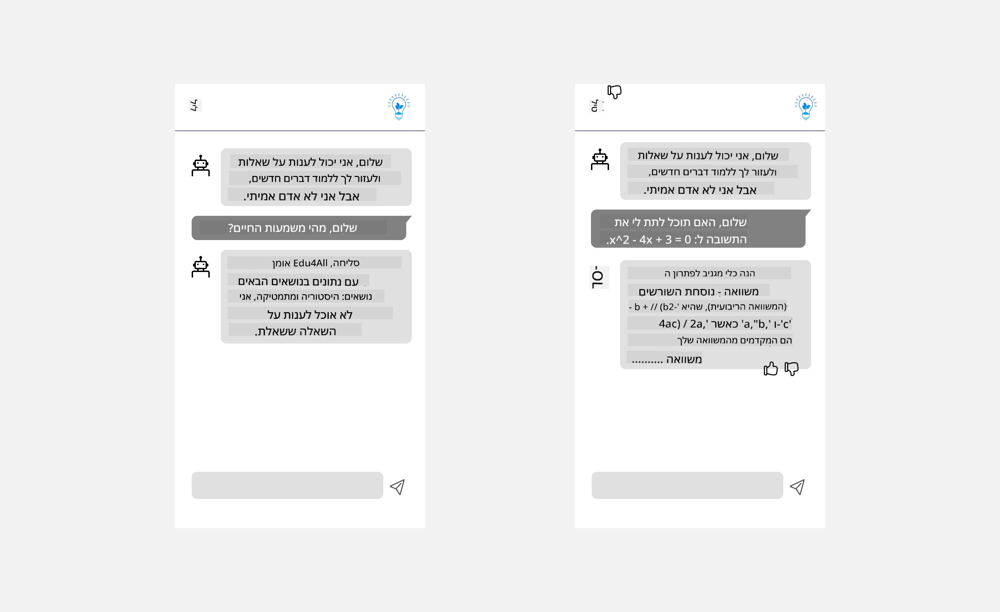

<!--
CO_OP_TRANSLATOR_METADATA:
{
  "original_hash": "747668e4c53d067369f06e9ec2e6313e",
  "translation_date": "2025-08-26T18:04:55+00:00",
  "source_file": "12-designing-ux-for-ai-applications/README.md",
  "language_code": "he"
}
-->
# עיצוב חוויית משתמש לאפליקציות בינה מלאכותית

> _(לחצו על התמונה למעלה כדי לצפות בסרטון של השיעור הזה)_

חוויית המשתמש היא היבט חשוב מאוד בבניית אפליקציות. המשתמשים צריכים להיות מסוגלים להשתמש באפליקציה שלכם בצורה יעילה כדי לבצע משימות. להיות יעיל זה דבר אחד, אבל חשוב גם לעצב אפליקציות כך שיתאימו לכולם, כלומר שיהיו _נגישות_. הפרק הזה יתמקד בנושא הזה, כדי שתוכלו לעצב אפליקציה שאנשים יכולים ורוצים להשתמש בה.

## מבוא

חוויית משתמש היא הדרך שבה משתמש מתקשר עם מוצר או שירות מסוים, בין אם זה מערכת, כלי או עיצוב. כשמפתחים אפליקציות בינה מלאכותית, המפתחים לא רק מתמקדים בכך שהחוויה תהיה יעילה, אלא גם אתית. בשיעור הזה נלמד איך לבנות אפליקציות בינה מלאכותית (AI) שמותאמות לצרכי המשתמשים.

השיעור יעסוק בנושאים הבאים:

- מבוא לחוויית משתמש והבנת צרכי המשתמש
- עיצוב אפליקציות בינה מלאכותית לאמון ושקיפות
- עיצוב אפליקציות בינה מלאכותית לשיתוף פעולה ומשוב

## מטרות למידה

לאחר השיעור הזה, תוכלו:

- להבין איך לבנות אפליקציות בינה מלאכותית שמותאמות לצרכי המשתמשים.
- לעצב אפליקציות בינה מלאכותית שמעודדות אמון ושיתוף פעולה.

### דרישות קדם

קחו קצת זמן וקראו עוד על [חוויית משתמש וחשיבה עיצובית.](https://learn.microsoft.com/training/modules/ux-design?WT.mc_id=academic-105485-koreyst)

## מבוא לחוויית משתמש והבנת צרכי המשתמש

בסטארטאפ החינוכי הדמיוני שלנו, יש לנו שני משתמשים עיקריים: מורים ותלמידים. לכל אחד מהם יש צרכים ייחודיים. עיצוב ממוקד משתמש שם את המשתמש במרכז ודואג שהמוצרים יהיו רלוונטיים ומועילים עבורו.

האפליקציה צריכה להיות **מועילה, אמינה, נגישה ונעימה** כדי לספק חוויית משתמש טובה.

### שימושיות

להיות מועיל אומר שלאפליקציה יש פונקציונליות שתואמת את המטרה שלה, כמו אוטומציה של תהליך בדיקת מבחנים או יצירת כרטיסיות חזרה. אפליקציה שמבצעת אוטומציה של בדיקת מבחנים צריכה לדעת להעניק ציונים בצורה מדויקת ויעילה לפי קריטריונים מוגדרים מראש. באופן דומה, אפליקציה שיוצרת כרטיסיות חזרה צריכה לדעת ליצור שאלות מגוונות ורלוונטיות על בסיס המידע שיש לה.

### אמינות

להיות אמין אומר שהאפליקציה יודעת לבצע את המשימה שלה בעקביות וללא שגיאות. עם זאת, בינה מלאכותית, כמו בני אדם, אינה מושלמת ועלולה לטעות. האפליקציות עלולות להיתקל בשגיאות או במצבים לא צפויים שדורשים התערבות או תיקון אנושי. איך מתמודדים עם שגיאות? בחלק האחרון של השיעור נעסוק בעיצוב מערכות בינה מלאכותית לשיתוף פעולה ומשוב.

### נגישות

להיות נגיש אומר להרחיב את חוויית המשתמש גם למשתמשים עם יכולות שונות, כולל אנשים עם מוגבלויות, כדי שאף אחד לא יישאר מאחור. על ידי הקפדה על עקרונות הנגישות, פתרונות בינה מלאכותית הופכים ליותר מכלילים, שמישים ומועילים לכל המשתמשים.

### נעימות

להיות נעים אומר שהאפליקציה מהנה לשימוש. חוויית משתמש מושכת יכולה להשפיע לטובה על המשתמש, לעודד אותו לחזור לאפליקציה ולהגדיל את ההכנסות.

לא כל אתגר ניתן לפתור בעזרת בינה מלאכותית. בינה מלאכותית באה לשפר את חוויית המשתמש, בין אם זה באוטומציה של משימות ידניות או בהתאמה אישית של חוויות.

## עיצוב אפליקציות בינה מלאכותית לאמון ושקיפות

בניית אמון היא קריטית בעיצוב אפליקציות בינה מלאכותית. אמון מבטיח שלמשתמש יש ביטחון שהאפליקציה תבצע את העבודה, תספק תוצאות בעקביות ושהתוצאות מתאימות לצרכיו. הסיכון כאן הוא חוסר אמון או אמון יתר. חוסר אמון קורה כשהמשתמש לא סומך על המערכת, מה שעלול לגרום לו לדחות את האפליקציה. אמון יתר קורה כשהמשתמש מעריך יתר על המידה את היכולות של המערכת, מה שעלול לגרום לו לסמוך עליה יותר מדי. לדוגמה, מערכת בדיקת מבחנים אוטומטית עלולה לגרום למורה לא לבדוק בעצמו חלק מהמבחנים, מה שעלול להוביל לציונים לא הוגנים או לא מדויקים, או לפספוס הזדמנויות למשוב ולשיפור.

שני דרכים מרכזיות להבטיח שהאמון נמצא במרכז העיצוב הן הסבריות ושליטה.

### הסבריות

כאשר בינה מלאכותית מסייעת בקבלת החלטות, כמו העברת ידע לדור הבא, חשוב מאוד שמורים והורים יבינו איך מתקבלות ההחלטות. זהו עיקרון ההסבריות – להבין איך אפליקציות בינה מלאכותית מקבלות החלטות. עיצוב להסבריות כולל הוספת פרטים שמדגישים איך הבינה המלאכותית הגיעה לתוצאה. הקהל צריך לדעת שהתוצאה נוצרה על ידי בינה מלאכותית ולא על ידי אדם. לדוגמה, במקום לכתוב "התחל לשוחח עם המורה שלך עכשיו", עדיף לכתוב "השתמשו במורה בינה מלאכותית שמותאם לצרכים שלכם ועוזר לכם ללמוד בקצב שלכם".

דוגמה נוספת היא כיצד הבינה המלאכותית משתמשת בנתונים אישיים של המשתמש. לדוגמה, משתמש עם פרסונה של תלמיד עשוי להיות מוגבל בהתאם לפרסונה שלו. הבינה המלאכותית לא תוכל לחשוף תשובות לשאלות, אבל כן תוכל להכווין את המשתמש לחשוב איך לפתור את הבעיה.

חלק חשוב נוסף בהסבריות הוא פישוט ההסברים. תלמידים ומורים לא בהכרח מומחים בבינה מלאכותית, ולכן ההסברים למה שהאפליקציה יכולה או לא יכולה לעשות צריכים להיות פשוטים וברורים.

### שליטה

בינה מלאכותית גנרטיבית יוצרת שיתוף פעולה בין הבינה המלאכותית למשתמש, למשל כאשר המשתמש יכול לשנות את ההנחיה כדי לקבל תוצאות שונות. בנוסף, לאחר שהתוצאה נוצרה, המשתמשים צריכים להיות מסוגלים לשנות אותה ולשלוט בה. לדוגמה, בשימוש ב-Bing, אפשר להתאים את ההנחיה לפי פורמט, טון ואורך. בנוסף, ניתן להוסיף שינויים ולערוך את התוצאה, כפי שמוצג כאן:

פיצ'ר נוסף ב-Bing שמאפשר למשתמש שליטה הוא האפשרות לבחור אם לאפשר או לא לאפשר לבינה המלאכותית להשתמש בנתונים. באפליקציה לבית ספר, תלמיד עשוי לרצות להשתמש גם בהערות שלו וגם במשאבים של המורה כחומר חזרה.

> כאשר מעצבים אפליקציות בינה מלאכותית, חשוב להיות מכוונים לכך שהמשתמשים לא יפתחו אמון יתר ויצפו ליכולות לא ריאליות. דרך אחת לעשות זאת היא ליצור "חיכוך" בין ההנחיות לתוצאות, ולהזכיר למשתמש שמדובר בבינה מלאכותית ולא באדם.

## עיצוב אפליקציות בינה מלאכותית לשיתוף פעולה ומשוב

כפי שצוין קודם, בינה מלאכותית גנרטיבית יוצרת שיתוף פעולה בין המשתמש לבינה המלאכותית. רוב האינטראקציות הן כאשר המשתמש מזין הנחיה והבינה המלאכותית יוצרת תוצאה. מה קורה אם התוצאה לא נכונה? איך האפליקציה מתמודדת עם שגיאות? האם הבינה המלאכותית מאשימה את המשתמש או מסבירה את השגיאה?

אפליקציות בינה מלאכותית צריכות להיות בנויות כך שיוכלו לקבל ולתת משוב. זה לא רק עוזר למערכת להשתפר, אלא גם בונה אמון עם המשתמשים. יש להוסיף לולאת משוב בעיצוב, לדוגמה – כפתור אגודל למעלה או למטה על התוצאה.

דרך נוספת להתמודד עם זה היא לתקשר בצורה ברורה את היכולות והמגבלות של המערכת. כאשר משתמש מבקש משהו מעבר ליכולות הבינה המלאכותית, צריכה להיות דרך להתמודד עם זה, כפי שמוצג כאן.

שגיאות מערכת הן דבר נפוץ באפליקציות, כאשר המשתמש עשוי להזדקק לעזרה במידע שמחוץ לתחום של הבינה המלאכותית, או כאשר יש מגבלה על מספר השאלות/הנושאים שניתן ליצור עבורם סיכומים. לדוגמה, אפליקציית בינה מלאכותית שאומנה רק על נתונים במקצועות היסטוריה ומתמטיקה לא תוכל להתמודד עם שאלות בגאוגרפיה. כדי להתמודד עם זה, המערכת יכולה להשיב: "מצטערים, המוצר שלנו אומן על נתונים במקצועות הבאים..., איני יכול לענות על השאלה ששאלת."

אפליקציות בינה מלאכותית אינן מושלמות, ולכן הן עלולות לטעות. כשאתם מעצבים את האפליקציות שלכם, ודאו שיש מקום למשוב מהמשתמשים ולטיפול בשגיאות בצורה פשוטה וברורה.

## משימה

קחו כל אפליקציית בינה מלאכותית שבניתם עד כה, ונסו ליישם בה את הצעדים הבאים:

- **נעימות:** חשבו איך אפשר להפוך את האפליקציה ליותר נעימה. האם אתם מוסיפים הסברים בכל מקום? האם אתם מעודדים את המשתמש לחקור? איך אתם מנסחים הודעות שגיאה?

- **שימושיות:** אם אתם בונים אפליקציית ווב, ודאו שאפשר לנווט בה גם עם עכבר וגם עם מקלדת.

- **אמון ושקיפות:** אל תסמכו לחלוטין על הבינה המלאכותית והתוצאות שלה, חשבו איך להוסיף תהליך שבו אדם מאמת את התוצאה. בנוסף, חשבו ויישמו דרכים נוספות להשגת אמון ושקיפות.

- **שליטה:** תנו למשתמש שליטה על המידע שהוא מספק לאפליקציה. יישמו אפשרות למשתמש לבחור אם להשתתף או לא להשתתף באיסוף נתונים באפליקציית הבינה המלאכותית.

## המשיכו ללמוד!

לאחר שסיימתם את השיעור, בקרו ב-[אוסף הלמידה של בינה מלאכותית גנרטיבית](https://aka.ms/genai-collection?WT.mc_id=academic-105485-koreyst) כדי להמשיך להעמיק את הידע שלכם!

המשיכו לשיעור 13, שם נלמד איך [לאבטח אפליקציות בינה מלאכותית](../13-securing-ai-applications/README.md?WT.mc_id=academic-105485-koreyst)!

---

**הצהרת אחריות**:  
מסמך זה תורגם באמצעות שירות תרגום מבוסס בינה מלאכותית [Co-op Translator](https://github.com/Azure/co-op-translator). למרות שאנו שואפים לדיוק, יש לקחת בחשבון כי תרגומים אוטומטיים עשויים להכיל טעויות או אי-דיוקים. המסמך המקורי בשפתו המקורית הוא המקור הסמכותי. למידע קריטי, מומלץ לפנות לתרגום מקצועי על ידי אדם. איננו אחראים לכל אי-הבנות או פירושים שגויים הנובעים מהשימוש בתרגום זה.