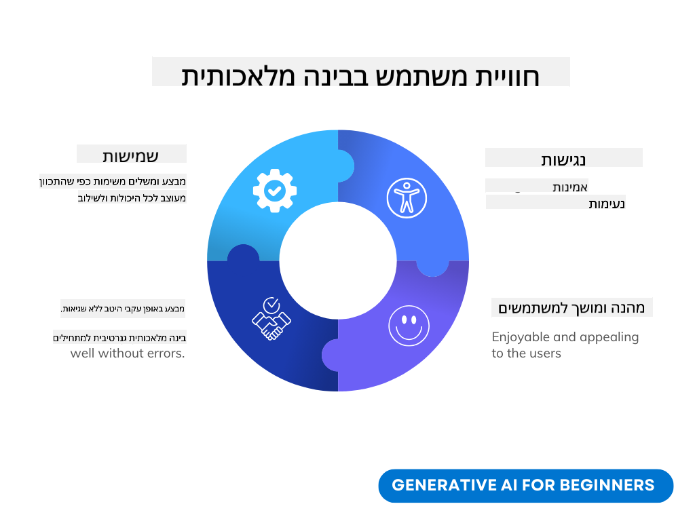
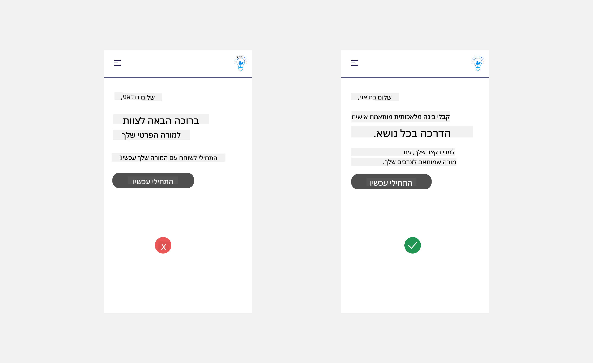
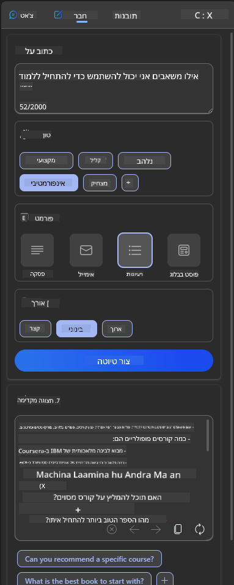
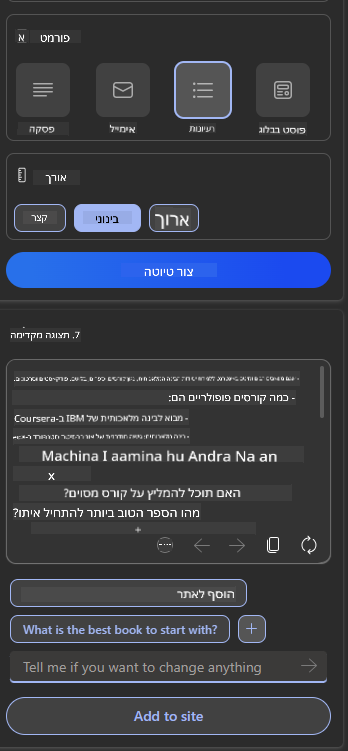

<!--
CO_OP_TRANSLATOR_METADATA:
{
  "original_hash": "78bbeed50fd4dc9fdee931f5daf98cb3",
  "translation_date": "2025-10-17T20:00:48+00:00",
  "source_file": "12-designing-ux-for-ai-applications/README.md",
  "language_code": "he"
}
-->
# עיצוב חוויית משתמש עבור יישומי AI

> _(לחצו על התמונה למעלה לצפייה בסרטון של השיעור הזה)_

חוויית משתמש היא היבט חשוב מאוד בבניית אפליקציות. המשתמשים צריכים להיות מסוגלים להשתמש באפליקציה שלכם בצורה יעילה כדי לבצע משימות. להיות יעיל זה דבר אחד, אבל אתם גם צריכים לעצב אפליקציות כך שיהיו נגישות לכולם. פרק זה יתמקד בתחום זה כדי שתוכלו לעצב אפליקציה שאנשים יכולים ורוצים להשתמש בה.

## הקדמה

חוויית משתמש היא הדרך שבה משתמש מתקשר עם ומשתמש במוצר או שירות מסוים, בין אם מדובר במערכת, כלי או עיצוב. בעת פיתוח יישומי AI, מפתחים לא רק מתמקדים בהבטחת חוויית משתמש אפקטיבית אלא גם אתית. בשיעור זה, נעסוק כיצד לבנות יישומי בינה מלאכותית (AI) שמטפלים בצרכי המשתמש.

השיעור יכסה את התחומים הבאים:

- הקדמה לחוויית משתמש והבנת צרכי המשתמש
- עיצוב יישומי AI לאמון ושקיפות
- עיצוב יישומי AI לשיתוף פעולה ומשוב

## מטרות למידה

לאחר השיעור הזה, תוכלו:

- להבין כיצד לבנות יישומי AI שמטפלים בצרכי המשתמש.
- לעצב יישומי AI שמקדמים אמון ושיתוף פעולה.

### דרישות מקדימות

קחו זמן לקרוא עוד על [חוויית משתמש וחשיבה עיצובית.](https://learn.microsoft.com/training/modules/ux-design?WT.mc_id=academic-105485-koreyst)

## הקדמה לחוויית משתמש והבנת צרכי המשתמש

בסטארטאפ החינוכי הבדיוני שלנו, יש לנו שני משתמשים עיקריים: מורים ותלמידים. לכל אחד מהמשתמשים יש צרכים ייחודיים. עיצוב ממוקד משתמש נותן עדיפות למשתמש ומבטיח שהמוצרים יהיו רלוונטיים ומועילים עבורם.

האפליקציה צריכה להיות **שימושית, אמינה, נגישה ונעימה** כדי לספק חוויית משתמש טובה.

### שימושיות

להיות שימושי פירושו שהאפליקציה כוללת פונקציונליות שמתאימה למטרתה המיועדת, כמו אוטומציה של תהליך בדיקת מבחנים או יצירת כרטיסיות חזרה ללימוד. אפליקציה שמבצעת אוטומציה של תהליך בדיקת מבחנים צריכה להיות מסוגלת להקצות ציונים לעבודות התלמידים בצורה מדויקת ויעילה על בסיס קריטריונים מוגדרים מראש. באופן דומה, אפליקציה שיוצרת כרטיסיות חזרה צריכה להיות מסוגלת ליצור שאלות רלוונטיות ומגוונות על בסיס הנתונים שלה.

### אמינות

להיות אמין פירושו שהאפליקציה יכולה לבצע את משימתה באופן עקבי וללא שגיאות. עם זאת, כמו בני אדם, גם AI אינו מושלם ועלול להיות חשוף לשגיאות. האפליקציות עשויות להיתקל בשגיאות או מצבים בלתי צפויים שדורשים התערבות או תיקון אנושי. איך מתמודדים עם שגיאות? בחלק האחרון של השיעור הזה, נעסוק כיצד מערכות ויישומי AI מעוצבים לשיתוף פעולה ומשוב.

### נגישות

להיות נגיש פירושו להרחיב את חוויית המשתמש למשתמשים עם יכולות שונות, כולל אנשים עם מוגבלויות, ולהבטיח שאף אחד לא יישאר בחוץ. על ידי עמידה בהנחיות ובפרינציפים של נגישות, פתרונות AI הופכים ליותר כוללניים, שימושיים ומועילים לכל המשתמשים.

### נעימות

להיות נעים פירושו שהאפליקציה מהנה לשימוש. חוויית משתמש מושכת יכולה להשפיע באופן חיובי על המשתמש ולעודד אותו לחזור להשתמש באפליקציה, ובכך להגדיל את הכנסות העסק.

לא כל אתגר ניתן לפתור באמצעות AI. AI נכנס לתמונה כדי לשפר את חוויית המשתמש, בין אם מדובר באוטומציה של משימות ידניות או בהתאמה אישית של חוויות משתמש.

## עיצוב יישומי AI לאמון ושקיפות

בניית אמון היא קריטית בעת עיצוב יישומי AI. אמון מבטיח שהמשתמש בטוח שהאפליקציה תבצע את העבודה, תספק תוצאות באופן עקבי והתוצאות יהיו מה שהמשתמש צריך. סיכון בתחום זה הוא חוסר אמון או אמון יתר. חוסר אמון מתרחש כאשר למשתמש יש מעט או אין אמון במערכת AI, מה שמוביל לדחיית האפליקציה. אמון יתר מתרחש כאשר משתמש מעריך יתר על המידה את יכולות מערכת ה-AI, מה שמוביל לכך שהמשתמש סומך על המערכת יותר מדי. לדוגמה, מערכת בדיקת מבחנים אוטומטית במקרה של אמון יתר עשויה לגרום למורה לא לבדוק חלק מהמבחנים כדי לוודא שהמערכת פועלת היטב. זה יכול להוביל לציונים לא הוגנים או לא מדויקים לתלמידים, או להחמצת הזדמנויות למשוב ושיפור.

שתי דרכים להבטיח שהאמון יהיה במרכז העיצוב הן הסבריות ושליטה.

### הסבריות

כאשר AI מסייע בקבלת החלטות כמו העברת ידע לדורות הבאים, חשוב מאוד שהמורים וההורים יבינו כיצד מתקבלות ההחלטות של ה-AI. זהו עקרון ההסבריות - הבנת האופן שבו יישומי AI מקבלים החלטות. עיצוב להסבריות כולל הוספת פרטים שמדגישים כיצד ה-AI הגיע לתוצאה. הקהל חייב להיות מודע לכך שהתוצאה נוצרה על ידי AI ולא על ידי אדם. לדוגמה, במקום לומר "התחל לשוחח עם המורה שלך עכשיו" יש לומר "השתמש במורה AI שמותאם לצרכים שלך ועוזר לך ללמוד בקצב שלך."

דוגמה נוספת היא כיצד AI משתמש בנתוני משתמשים ונתונים אישיים. לדוגמה, משתמש עם פרסונה של תלמיד עשוי להיות מוגבל על בסיס הפרסונה שלו. ה-AI עשוי לא להיות מסוגל לחשוף תשובות לשאלות אך יכול לעזור להנחות את המשתמש לחשוב כיצד הוא יכול לפתור בעיה.

חלק חשוב נוסף בהסבריות הוא פישוט ההסברים. תלמידים ומורים עשויים לא להיות מומחים ב-AI, ולכן ההסברים על מה האפליקציה יכולה או לא יכולה לעשות צריכים להיות פשוטים וקלים להבנה.

### שליטה

AI גנרטיבי יוצר שיתוף פעולה בין ה-AI לבין המשתמש, שבו למשל משתמש יכול לשנות הנחיות כדי לקבל תוצאות שונות. בנוסף, לאחר שנוצרה תוצאה, המשתמשים צריכים להיות מסוגלים לשנות את התוצאות ולתת להם תחושת שליטה. לדוגמה, בעת שימוש בבינג, ניתן להתאים את ההנחיה על בסיס פורמט, טון ואורך. בנוסף, ניתן להוסיף שינויים לתוצאה ולשנות אותה כפי שמוצג להלן:

תכונה נוספת בבינג שמאפשרת למשתמש לשלוט באפליקציה היא היכולת לבחור אם לשתף או לא לשתף את הנתונים שה-AI משתמש בהם. עבור אפליקציה בית ספרית, תלמיד עשוי לרצות להשתמש בהערות שלו כמו גם במשאבי המורים כחומר חזרה.

> בעת עיצוב יישומי AI, חשוב להיות מכוונים כדי להבטיח שהמשתמשים לא יאמינו יתר על המידה ויציבו ציפיות לא מציאותיות לגבי יכולות המערכת. דרך אחת לעשות זאת היא ליצור חיכוך בין ההנחיות לתוצאות. להזכיר למשתמש שזהו AI ולא אדם.

## עיצוב יישומי AI לשיתוף פעולה ומשוב

כפי שצוין קודם, AI גנרטיבי יוצר שיתוף פעולה בין המשתמש ל-AI. רוב האינטראקציות הן עם משתמש שמזין הנחיה וה-AI שמייצר תוצאה. מה אם התוצאה שגויה? איך האפליקציה מתמודדת עם שגיאות אם הן מתרחשות? האם ה-AI מאשים את המשתמש או לוקח זמן להסביר את השגיאה?

יישומי AI צריכים להיות בנויים לקבל ולתת משוב. זה לא רק עוזר למערכת ה-AI להשתפר אלא גם בונה אמון עם המשתמשים. לולאת משוב צריכה להיות כלולה בעיצוב, דוגמה לכך יכולה להיות סימון פשוט של אגודל למעלה או למטה על התוצאה.

דרך נוספת להתמודד עם זה היא לתקשר בצורה ברורה את היכולות והמגבלות של המערכת. כאשר משתמש עושה שגיאה ומבקש משהו מעבר ליכולות ה-AI, צריכה להיות גם דרך להתמודד עם זה, כפי שמוצג להלן.

שגיאות מערכת הן נפוצות באפליקציות שבהן המשתמש עשוי להזדקק לעזרה במידע מחוץ לתחום ה-AI או שהאפליקציה עשויה להיות מוגבלת בכמות השאלות/הנושאים שהמשתמש יכול ליצור סיכומים. לדוגמה, אפליקציית AI שמאומנת עם נתונים על נושאים מוגבלים כמו היסטוריה ומתמטיקה עשויה לא להיות מסוגלת להתמודד עם שאלות סביב גיאוגרפיה. כדי להתמודד עם זה, מערכת ה-AI יכולה לתת תגובה כמו: "מצטער, המוצר שלנו אומן עם נתונים בנושאים הבאים....., אני לא יכול להגיב לשאלה ששאלת."

יישומי AI אינם מושלמים, ולכן הם נוטים לעשות טעויות. בעת עיצוב האפליקציות שלכם, עליכם להבטיח שאתם יוצרים מקום למשוב מהמשתמשים והתמודדות עם שגיאות בצורה פשוטה וקלה להסבר.

## משימה

קחו כל אפליקציית AI שבניתם עד כה, ושקלו ליישם את השלבים הבאים באפליקציה שלכם:

- **נעימות:** שקלו כיצד תוכלו להפוך את האפליקציה שלכם ליותר נעימה. האם אתם מוסיפים הסברים בכל מקום? האם אתם מעודדים את המשתמש לחקור? איך אתם מנסחים את הודעות השגיאה שלכם?

- **שימושיות:** בבניית אפליקציית ווב, ודאו שהאפליקציה שלכם ניתנת לניווט גם באמצעות עכבר וגם באמצעות מקלדת.

- **אמון ושקיפות:** אל תסמכו לחלוטין על ה-AI ועל התוצאות שלו, שקלו כיצד תוכלו להוסיף אדם לתהליך כדי לאמת את התוצאות. בנוסף, שקלו ויישמו דרכים נוספות להשגת אמון ושקיפות.

- **שליטה:** תנו למשתמש שליטה על הנתונים שהוא מספק לאפליקציה. יישמו דרך שבה המשתמש יכול לבחור אם לשתף או לא לשתף נתונים באפליקציית ה-AI.

<!-- ## [שאלון לאחר השיעור](../../../12-designing-ux-for-ai-applications/quiz-url) -->

## המשיכו ללמוד!

לאחר השלמת השיעור הזה, בדקו את [אוסף הלמידה של AI גנרטיבי](https://aka.ms/genai-collection?WT.mc_id=academic-105485-koreyst) כדי להמשיך להעמיק את הידע שלכם ב-AI גנרטיבי!

עברו לשיעור 13, שבו נעסוק ב-[אבטחת יישומי AI](../13-securing-ai-applications/README.md?WT.mc_id=academic-105485-koreyst)!

---

**כתב ויתור**:  
מסמך זה תורגם באמצעות שירות תרגום AI [Co-op Translator](https://github.com/Azure/co-op-translator). למרות שאנו שואפים לדיוק, יש לקחת בחשבון שתרגומים אוטומטיים עשויים להכיל שגיאות או אי דיוקים. המסמך המקורי בשפתו המקורית צריך להיחשב כמקור סמכותי. עבור מידע קריטי, מומלץ להשתמש בתרגום מקצועי אנושי. איננו אחראים לאי הבנות או לפרשנויות שגויות הנובעות משימוש בתרגום זה.