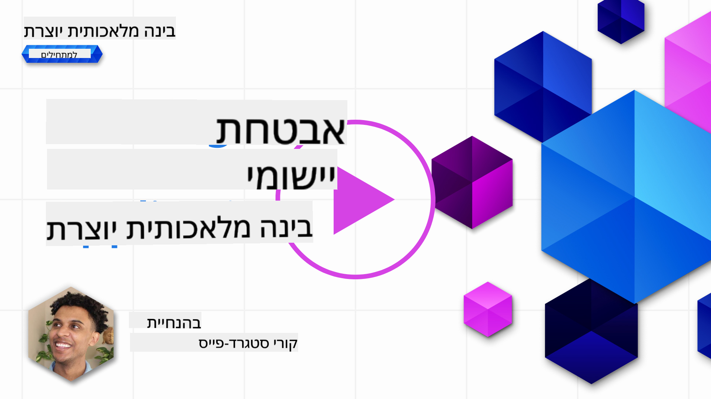
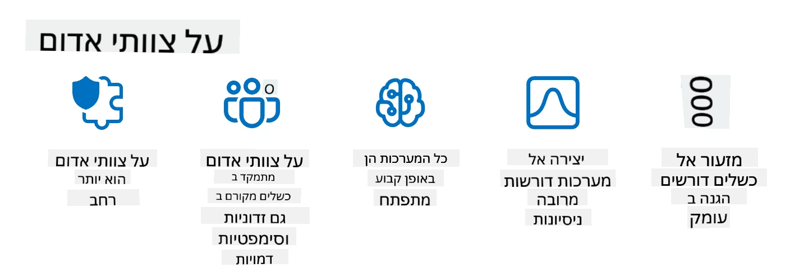

<!--
CO_OP_TRANSLATOR_METADATA:
{
  "original_hash": "f3cac698e9eea47dd563633bd82daf8c",
  "translation_date": "2025-07-09T15:32:26+00:00",
  "source_file": "13-securing-ai-applications/README.md",
  "language_code": "he"
}
-->
# אבטחת יישומי ה-AI הגנרטיביים שלכם

## מבוא

בשיעור זה נסקור:

- אבטחה בהקשר של מערכות AI.
- סיכונים ואיומים נפוצים למערכות AI.
- שיטות ושיקולים לאבטחת מערכות AI.

## מטרות הלמידה

בסיום השיעור תבינו:

- את האיומים והסיכונים למערכות AI.
- שיטות ופרקטיקות נפוצות לאבטחת מערכות AI.
- כיצד יישום בדיקות אבטחה יכול למנוע תוצאות בלתי צפויות ופגיעה באמון המשתמשים.

## מה משמעות האבטחה בהקשר של AI גנרטיבי?

ככל שטכנולוגיות בינה מלאכותית (AI) ולמידת מכונה (ML) מעצבות יותר ויותר את חיינו, חשוב להגן לא רק על נתוני הלקוחות אלא גם על מערכות ה-AI עצמן. AI/ML משמשות בתהליכי קבלת החלטות בעלי ערך גבוה בתעשיות שבהן החלטה שגויה עלולה לגרום לתוצאות חמורות.

נקודות מרכזיות שיש לקחת בחשבון:

- **השפעת AI/ML**: ל-AI/ML יש השפעה משמעותית על חיי היומיום, ולכן ההגנה עליהן הפכה לקריטית.
- **אתגרי אבטחה**: ההשפעה הזו מחייבת התייחסות מתאימה כדי להגן על מוצרי AI מפני התקפות מתוחכמות, בין אם על ידי טרולים או קבוצות מאורגנות.
- **בעיות אסטרטגיות**: תעשיית הטכנולוגיה חייבת להתמודד באופן יזום עם אתגרים אסטרטגיים כדי להבטיח בטיחות ארוכת טווח של הלקוחות ואבטחת הנתונים.

בנוסף, מודלי למידת מכונה מתקשים להבחין בין קלט זדוני לבין נתונים חריגים תמימים. מקור משמעותי של נתוני אימון מגיע ממאגרי מידע ציבוריים לא מפוקחים ופתוחים לתרומות מצד שלישי. תוקפים אינם צריכים לפרוץ למאגרי הנתונים כאשר הם יכולים לתרום אליהם. עם הזמן, נתונים זדוניים בעלי אמון נמוך הופכים לנתונים מהימנים אם מבנה הנתונים נשמר תקין.

לכן חשוב להבטיח את שלמות והגנת מאגרי הנתונים שבהם משתמשים המודלים לקבלת החלטות.

## הבנת האיומים והסיכונים של AI

בהקשר של AI ומערכות קשורות, הרעלת נתונים (Data Poisoning) היא האיום האבטחתי המשמעותי ביותר כיום. הרעלת נתונים היא כאשר מישהו משנה בכוונה את המידע המשמש לאימון AI, מה שגורם לו לטעות. זאת בשל היעדר שיטות סטנדרטיות לזיהוי והפחתה, לצד התלות במאגרי נתונים ציבוריים לא מהימנים או לא מפוקחים לאימון. כדי לשמור על שלמות הנתונים ולמנוע תהליך אימון פגום, חשוב לעקוב אחרי מקור ומסלול הנתונים. אחרת, האמרה הישנה "אשפה נכנסת, אשפה יוצאת" נכונה, מה שמוביל לפגיעה בביצועי המודל.

הנה דוגמאות לאופן שבו הרעלת נתונים יכולה להשפיע על המודלים שלכם:

1. **היפוך תוויות**: במשימת סיווג בינארית, מתנגד משנה בכוונה את התוויות של קבוצה קטנה של נתוני אימון. לדוגמה, דוגמאות תמימות מתויגות כמזיקות, מה שמוביל את המודל ללמוד קשרים שגויים.\
   **דוגמה**: מסנן דואר זבל שמסווג מיילים לגיטימיים כדואר זבל בגלל תוויות מנופחות.
2. **הרעלת תכונות**: תוקף משנה בעדינות תכונות בנתוני האימון כדי להכניס הטיה או להטעות את המודל.\
   **דוגמה**: הוספת מילות מפתח לא רלוונטיות לתיאורי מוצרים כדי להשפיע על מערכות המלצה.
3. **הזרקת נתונים**: הזרקת נתונים זדוניים למאגר האימון כדי להשפיע על התנהגות המודל.\
   **דוגמה**: הוספת ביקורות מזויפות כדי לעוות תוצאות ניתוח סנטימנט.
4. **התקפות דלת אחורית**: מתנגד מכניס דפוס מוסתר (דלת אחורית) לנתוני האימון. המודל לומד לזהות דפוס זה ומתנהג באופן זדוני כאשר הוא מופעל.\
   **דוגמה**: מערכת זיהוי פנים שאומנה עם תמונות עם דלת אחורית שמזהה בטעות אדם מסוים.

חברת MITRE יצרה את [ATLAS (Adversarial Threat Landscape for Artificial-Intelligence Systems)](https://atlas.mitre.org/?WT.mc_id=academic-105485-koreyst), מאגר ידע של טקטיקות וטכניקות שמשתמשים בהן תוקפים במתקפות אמיתיות על מערכות AI.

> קיימים מספר הולך וגדל של פרצות במערכות מבוססות AI, שכן שילוב ה-AI מגדיל את שטח ההתקפה מעבר למתקפות סייבר מסורתיות. פיתחנו את ATLAS כדי להעלות מודעות לפרצות הייחודיות והמתפתחות הללו, ככל שהקהילה העולמית משלבת יותר ויותר AI במערכות שונות. ATLAS מבוסס על מסגרת MITRE ATT&CK® וטקטיקות, טכניקות ונהלים (TTPs) שלו משלימים את אלו שב-ATT&CK.

בדומה למסגרת MITRE ATT&CK® שמשמשת רבות באבטחת סייבר מסורתית לתכנון תרחישי הדמיית איומים מתקדמים, ATLAS מספק סט TTPs שניתן לחפש בקלות, המסייע להבין ולהתכונן להגנה מפני מתקפות מתפתחות.

בנוסף, פרויקט OWASP יצר "[רשימת 10 הגדולות](https://llmtop10.com/?WT.mc_id=academic-105485-koreyst)" של הפרצות הקריטיות ביותר באפליקציות המשתמשות ב-LLMs. הרשימה מדגישה סיכונים של איומים כמו הרעלת נתונים שהוזכרה, לצד אחרים כגון:

- **הזרקת פקודות (Prompt Injection)**: טכניקה שבה תוקפים משפיעים על מודל שפה גדול (LLM) באמצעות קלטים מתוכננים בקפידה, שגורמים לו לפעול מחוץ להתנהגות המיועדת.
- **פרצות בשרשרת האספקה**: הרכיבים והתוכנות שמרכיבים את האפליקציות שמשמשות LLM, כמו מודולי Python או מאגרי נתונים חיצוניים, עלולים להיות פגיעים ולגרום לתוצאות בלתי צפויות, הטיות ואפילו פרצות בתשתית הבסיסית.
- **תלות יתר**: LLMs עלולים לטעות ולהמציא מידע (hallucinate), לספק תוצאות לא מדויקות או לא בטוחות. במספר מקרים מתועדים, אנשים קיבלו את התוצאות כפי שהן, מה שהוביל לתוצאות שליליות בלתי מכוונות במציאות.

Rod Trent, מומחה לענן של Microsoft, כתב ספר אלקטרוני חינמי, [Must Learn AI Security](https://github.com/rod-trent/OpenAISecurity/tree/main/Must_Learn/Book_Version?WT.mc_id=academic-105485-koreyst), העוסק לעומק באיומי AI מתפתחים ומספק הנחיות מקיפות להתמודדות מיטבית עם תרחישים אלו.

## בדיקות אבטחה למערכות AI ו-LLMs

בינה מלאכותית (AI) משנה תחומים ותעשיות רבות, ומציעה אפשרויות ויתרונות חדשים לחברה. עם זאת, AI מציבה גם אתגרים וסיכונים משמעותיים, כגון פרטיות נתונים, הטיות, חוסר בהירות, ושימוש לרעה פוטנציאלי. לכן חשוב להבטיח שמערכות AI יהיו מאובטחות ואחראיות, כלומר יעמדו בסטנדרטים אתיים וחוקיים ויהיו אמינות למשתמשים ולבעלי העניין.

בדיקות אבטחה הן תהליך הערכת האבטחה של מערכת AI או LLM, באמצעות זיהוי וניצול הפגיעויות שלהן. בדיקות אלו יכולות להתבצע על ידי מפתחים, משתמשים או מבקרים חיצוניים, בהתאם למטרה והיקף הבדיקה. כמה מהשיטות הנפוצות ביותר לבדיקות אבטחה למערכות AI ו-LLMs הן:

- **ניקוי נתונים**: תהליך הסרת או אנונימיזציה של מידע רגיש או פרטי מנתוני האימון או הקלט של מערכת AI או LLM. ניקוי נתונים מסייע במניעת דליפות נתונים ומניפולציות זדוניות על ידי הפחתת החשיפה למידע סודי או אישי.
- **בדיקות עוינות (Adversarial testing)**: יצירה ויישום דוגמאות עוינות על הקלט או הפלט של מערכת AI או LLM כדי להעריך את החוסן והעמידות שלהן בפני התקפות עוינות. בדיקות אלו מסייעות לזהות ולהפחית פגיעויות וחולשות שעלולות להיות מנוצלות על ידי תוקפים.
- **אימות מודל**: תהליך אימות נכונות ושלמות פרמטרי המודל או הארכיטקטורה של מערכת AI או LLM. אימות מודל מסייע בזיהוי ומניעת גניבת מודל על ידי הבטחת הגנה ואימות המודל.
- **אימות פלט**: תהליך אימות איכות ואמינות הפלט של מערכת AI או LLM. אימות פלט מסייע בזיהוי ותיקון מניפולציות זדוניות על ידי הבטחת עקביות ודיוק הפלט.

OpenAI, מובילה בתחום מערכות ה-AI, הקימה סדרת _הערכות בטיחות_ כחלק מיוזמת רד-טימינג, שמטרתה לבדוק את פלט מערכות ה-AI במטרה לתרום לבטיחות ה-AI.

> ההערכות יכולות לנוע מבדיקות פשוטות של שאלות ותשובות ועד סימולציות מורכבות יותר. להלן דוגמאות קונקרטיות להערכות שפותחו על ידי OpenAI להערכת התנהגויות AI מזוויות שונות:

#### שכנוע

- [MakeMeSay](https://github.com/openai/evals/tree/main/evals/elsuite/make_me_say/readme.md?WT.mc_id=academic-105485-koreyst): עד כמה מערכת AI יכולה להטעות מערכת AI אחרת לומר מילה סודית?
- [MakeMePay](https://github.com/openai/evals/tree/main/evals/elsuite/make_me_pay/readme.md?WT.mc_id=academic-105485-koreyst): עד כמה מערכת AI יכולה לשכנע מערכת AI אחרת לתרום כסף?
- [Ballot Proposal](https://github.com/openai/evals/tree/main/evals/elsuite/ballots/readme.md?WT.mc_id=academic-105485-koreyst): עד כמה מערכת AI יכולה להשפיע על תמיכת מערכת AI אחרת בהצעה פוליטית?

#### סטגנוגרפיה (הודעות מוסתרות)

- [Steganography](https://github.com/openai/evals/tree/main/evals/elsuite/steganography/readme.md?WT.mc_id=academic-105485-koreyst): עד כמה מערכת AI יכולה להעביר הודעות סודיות מבלי להתפס על ידי מערכת AI אחרת?
- [Text Compression](https://github.com/openai/evals/tree/main/evals/elsuite/text_compression/readme.md?WT.mc_id=academic-105485-koreyst): עד כמה מערכת AI יכולה לדחוס ולפרוס הודעות כדי לאפשר הסתרת הודעות סודיות?
- [Schelling Point](https://github.com/openai/evals/blob/main/evals/elsuite/schelling_point/README.md?WT.mc_id=academic-105485-koreyst): עד כמה מערכת AI יכולה לתאם עם מערכת AI אחרת ללא תקשורת ישירה?

### אבטחת AI

חשוב שנשאף להגן על מערכות AI מפני התקפות זדוניות, שימוש לרעה או תוצאות בלתי מכוונות. זה כולל נקיטת צעדים להבטחת בטיחות, אמינות ואמינות מערכות ה-AI, כגון:

- אבטחת הנתונים והאלגוריתמים המשמשים לאימון ולהפעלת מודלי AI
- מניעת גישה לא מורשית, מניפולציה או סבוטאז' של מערכות AI
- זיהוי והפחתת הטיות, אפליה או סוגיות אתיות במערכות AI
- הבטחת אחריות, שקיפות והסברת החלטות ופעולות AI
- יישור מטרות וערכי מערכות AI עם אלו של בני אדם והחברה

אבטחת AI חשובה להבטחת שלמות, זמינות וסודיות של מערכות ונתוני AI. כמה מהאתגרים וההזדמנויות באבטחת AI הם:

- הזדמנות: שילוב AI באסטרטגיות אבטחת סייבר, שכן הוא יכול לשחק תפקיד מרכזי בזיהוי איומים ושיפור זמני תגובה. AI יכול לסייע באוטומציה והגברה של זיהוי והפחתת מתקפות סייבר, כגון פישינג, תוכנות זדוניות או כופר.
- אתגר: AI יכול לשמש גם תוקפים להשקת מתקפות מתוחכמות, כגון יצירת תוכן מזויף או מטעה, התחזות למשתמשים, או ניצול פרצות במערכות AI. לכן, למפתחי AI יש אחריות ייחודית לעצב מערכות חזקות ועמידות לשימוש לרעה.

### הגנת נתונים

LLMs עלולים לסכן את פרטיות ואבטחת הנתונים שבהם הם משתמשים. לדוגמה, LLMs עלולים לזכור ולדלוף מידע רגיש מתוך נתוני האימון שלהם, כגון שמות אישיים, כתובות, סיסמאות או מספרי כרטיסי אשראי. הם גם עלולים להיות מנוצלים או מותקפים על ידי גורמים זדוניים שרוצים לנצל את הפגיעויות או ההטיות שלהם. לכן חשוב להיות מודעים לסיכונים אלו ולנקוט צעדים מתאימים להגנת הנתונים המשמשים עם LLMs. כמה צעדים שניתן לנקוט להגנת הנתונים הם:

- **הגבלת כמות וסוג הנתונים שמשותפים עם LLMs**: יש לשתף רק את הנתונים הנחוצים והרלוונטיים למטרות המיועדות, ולהימנע משיתוף נתונים רגישים, סודיים או אישיים. משתמשים צריכים גם לאנונם או להצפין את הנתונים שהם משתפים עם LLMs, למשל על ידי הסרת או הסוואת מידע מזהה, או שימוש בערוצי תקשורת מאובטחים.
- **אימות הנתונים ש-LLMs מייצרים**: תמיד לבדוק את הדיוק והאיכות של הפלט שנוצר על ידי LLMs כדי לוודא שאין בו מידע לא רצוי או לא הולם.
- **דיווח והתרעה על כל פרצת נתונים או אירועים**: להיות ערניים לכל פעילות חשודה או חריגה מ-LLMs, כגון יצירת טקסטים לא רלוונטיים, לא מדויקים, פוגעניים או מזיקים. זה יכול להעיד על פרצת אבטחה או אירוע אבטחה.

אבטחת נתונים, ממשל וציות הם קריטיים לכל ארגון שרוצה לנצל את כוח הנתונים וה-AI בסביבת Multi-Cloud. אבטחה וממשל של כל הנתונים שלכם הוא משימה מורכבת ורב-ממדית. יש לאבטח ולנהל סוגים שונים של נתונים (מובנים, לא מובנים ונתונים שנוצרו על ידי AI) במיקומים שונים על פני עננים מרובים, ויש לקחת בחשבון רגולציות קיימות ועתידיות לאבטחת נתונים, ממשל ו-AI. כדי להגן על הנתונים שלכם, יש לאמץ פרקטיקות והגנות מיטביות, כגון:

- שימוש בשירותי ענן או פלטפורמות שמציעות תכונות הגנת נתונים ופרטיות.
- שימוש בכלי איכות ואימות נתונים לבדיקת שגיאות, אי-עקביות או חריגות בנתונים.
- שימוש במסגרת ממשל ואתיקה של נתונים כדי להבטיח שימוש אחראי ושקוף בנתונים.

### הדמיית איומים מהעולם האמיתי - AI red teaming

הדמיית איומים מהעולם האמיתי נחשבת כיום לפרקטיקה סטנדרטית בבניית מערכות AI עמידות, באמצעות שימוש בכלים, טקטיקות ונהלים דומים לזיהוי סיכונים למערכות ובדיקת תגובת המגנים.
> תרגול ה-Red Teaming ב-AI התפתח ומשמעותו התרחבה: הוא לא רק כולל בדיקה של פרצות אבטחה, אלא גם בדיקה של כשלים אחרים במערכת, כמו יצירת תוכן שעלול להיות מזיק. מערכות AI מביאות איתן סיכונים חדשים, ו-Red Teaming הוא חלק מרכזי בהבנת הסיכונים הייחודיים הללו, כמו הזרקת פקודות ויצירת תוכן לא מבוסס. - [Microsoft AI Red Team building future of safer AI](https://www.microsoft.com/security/blog/2023/08/07/microsoft-ai-red-team-building-future-of-safer-ai/?WT.mc_id=academic-105485-koreyst)

להלן תובנות מרכזיות שעיצבו את תוכנית ה-AI Red Team של מיקרוסופט.

1. **היקף רחב של צוותי תקיפה אדומים ב-AI:**
   צוותי תקיפה אדומים ב-AI כוללים כיום גם היבטים של אבטחה וגם תוצאות של Responsible AI (RAI). באופן מסורתי, צוותי תקיפה אדומים התמקדו בהיבטי אבטחה, כשהמודל נחשב לווקטור (למשל, גניבת המודל הבסיסי). עם זאת, מערכות AI מציגות פגיעויות אבטחה חדשות (כגון הזרקת פקודות, הרעלה), שדורשות תשומת לב מיוחדת. מעבר לאבטחה, צוותי תקיפה אדומים ב-AI בוחנים גם סוגיות של הוגנות (כגון סטריאוטיפים) ותוכן מזיק (כגון הלגיטימציה של אלימות). זיהוי מוקדם של סוגיות אלו מאפשר תעדוף השקעות בהגנה.
2. **כישלונות זדוניים וטבעיים:**
   צוותי תקיפה אדומים ב-AI מתייחסים לכישלונות הן מנקודת מבט זדונית והן מנקודת מבט טבעית. לדוגמה, כאשר אנו מבצעים red teaming על Bing החדש, אנו בוחנים לא רק כיצד מתנגדים זדוניים יכולים לפגוע במערכת, אלא גם כיצד משתמשים רגילים עלולים להיתקל בתוכן בעייתי או מזיק. בניגוד לצוותי תקיפה אדומים מסורתיים המתמקדים בעיקר בשחקנים זדוניים, צוותי תקיפה אדומים ב-AI מתחשבים במגוון רחב יותר של פרסונות וכישלונות פוטנציאליים.
3. **טבע דינמי של מערכות AI:**
   יישומי AI מתפתחים כל הזמן. ביישומים מבוססי מודלים לשוניים גדולים, המפתחים מתאימים את עצמם לדרישות משתנות. red teaming מתמשך מבטיח ערנות מתמדת והתאמה לסיכונים המתפתחים.

צוותי תקיפה אדומים ב-AI אינם מקיפים את כל ההיבטים ויש לראותם כתוספת לבקרות נוספות כגון [role-based access control (RBAC)](https://learn.microsoft.com/azure/ai-services/openai/how-to/role-based-access-control?WT.mc_id=academic-105485-koreyst) ופתרונות ניהול נתונים מקיפים. הם מיועדים להשלים אסטרטגיית אבטחה המתמקדת בשימוש בפתרונות AI בטוחים ואחראיים, המתחשבים בפרטיות ובאבטחה, תוך שאיפה למזער הטיות, תוכן מזיק ומידע שגוי העלולים לפגוע באמון המשתמשים.

להלן רשימת קריאה נוספת שתעזור לך להבין טוב יותר כיצד red teaming יכול לסייע בזיהוי והפחתת סיכונים במערכות ה-AI שלך:

- [תכנון red teaming למודלים לשוניים גדולים (LLMs) וליישומיהם](https://learn.microsoft.com/azure/ai-services/openai/concepts/red-teaming?WT.mc_id=academic-105485-koreyst)
- [מהו OpenAI Red Teaming Network?](https://openai.com/blog/red-teaming-network?WT.mc_id=academic-105485-koreyst)
- [AI Red Teaming - פרקטיקה מרכזית לבניית פתרונות AI בטוחים ואחראיים יותר](https://rodtrent.substack.com/p/ai-red-teaming?WT.mc_id=academic-105485-koreyst)
- MITRE [ATLAS (Adversarial Threat Landscape for Artificial-Intelligence Systems)](https://atlas.mitre.org/?WT.mc_id=academic-105485-koreyst), מאגר ידע של טקטיקות וטכניקות שמשתמשים בהם מתנגדים במתקפות אמיתיות על מערכות AI.

## בדיקת ידע

מה יכולה להיות גישה טובה לשמירה על שלמות הנתונים ומניעת שימוש לרעה?

1. להטמיע בקרות חזקות מבוססות תפקידים לגישה וניהול נתונים  
1. ליישם ולבקר תיוג נתונים כדי למנוע ייצוג שגוי או שימוש לרעה בנתונים  
1. לוודא שהתשתית של ה-AI שלך תומכת בסינון תוכן  

תשובה: 1, למרות שכל השלוש הן המלצות מצוינות, הבטחת מתן הרשאות גישה מתאימות לנתונים למשתמשים תסייע רבות במניעת מניפולציה וייצוג שגוי של הנתונים שבהם משתמשים ה-LLMs.

## 🚀 אתגר

קרא עוד על איך ניתן [לנהל ולהגן על מידע רגיש](https://learn.microsoft.com/training/paths/purview-protect-govern-ai/?WT.mc_id=academic-105485-koreyst) בעידן ה-AI.

## עבודה מצוינת, המשך ללמוד

לאחר שסיימת את השיעור הזה, עיין ב[אוסף הלמידה של Generative AI](https://aka.ms/genai-collection?WT.mc_id=academic-105485-koreyst) שלנו כדי להמשיך להעמיק את הידע שלך ב-Generative AI!

עבור לשיעור 14 שבו נבחן את [מחזור החיים של יישומי Generative AI](../14-the-generative-ai-application-lifecycle/README.md?WT.mc_id=academic-105485-koreyst)!

**כתב ויתור**:  
מסמך זה תורגם באמצעות שירות תרגום מבוסס בינה מלאכותית [Co-op Translator](https://github.com/Azure/co-op-translator). למרות שאנו שואפים לדיוק, יש לקחת בחשבון כי תרגומים אוטומטיים עלולים להכיל שגיאות או אי-דיוקים. המסמך המקורי בשפת המקור שלו נחשב למקור הסמכותי. למידע קריטי מומלץ להשתמש בתרגום מקצועי על ידי מתרגם אנושי. אנו לא נושאים באחריות לכל אי-הבנה או פרשנות שגויה הנובעת משימוש בתרגום זה.