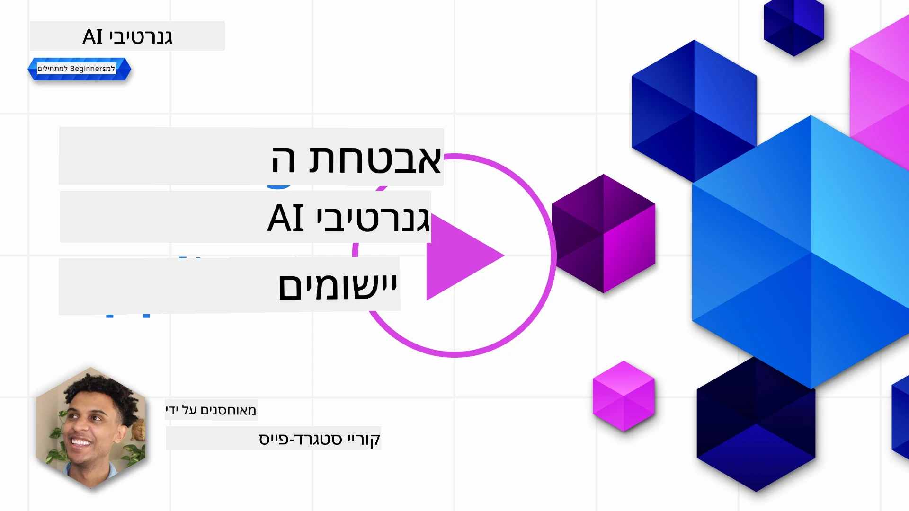
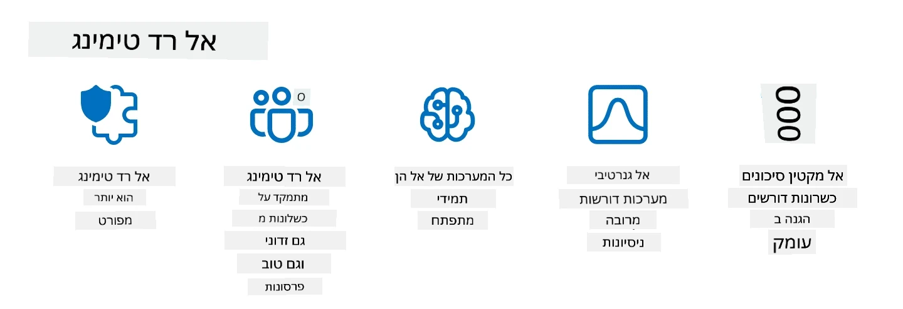

# אבטחת יישומי הבינה המלאכותית הגנרטיבית שלך

## מבוא

שיעור זה יכלול:

- אבטחה בהקשר של מערכות בינה מלאכותית.
- סיכונים ואיומים נפוצים למערכות בינה מלאכותית.
- שיטות ושיקולים לאבטחת מערכות בינה מלאכותית.

## מטרות למידה

לאחר השלמת שיעור זה, תהיה לך הבנה של:

- האיומים והסיכונים למערכות בינה מלאכותית.
- שיטות ופרקטיקות נפוצות לאבטחת מערכות בינה מלאכותית.
- איך מימוש בדיקות אבטחה יכול למנוע תוצאות בלתי צפויות ושחיקת אמון המשתמש.

## מהי אבטחה בהקשר של בינה מלאכותית גנרטיבית?

ככל שטכנולוגיות הבינה המלאכותית (AI) והלמידת מכונה (ML) מעצבות את חיי היום-יום שלנו יותר ויותר, חשוב להגן לא רק על נתוני הלקוחות אלא גם על מערכות ה-AI עצמן. AI/ML משמשות יותר ויותר לתמיכה בתהליכי קבלת החלטות בעלי ערך גבוה בתעשיות שבהן החלטה שגויה עשויה לגרום לתוצאות חמורות.

להלן נקודות מפתח שיש לקחת בחשבון:

- **השפעת AI/ML**: ל-AI/ML יש השפעות משמעותיות על חיי היום-יום ולפיכך הגנה עליהן הפכה למהותית.
- **אתגרי אבטחה**: השפעה זו של AI/ML דורשת תשומת לב מתאימה בכדי להתמודד עם הצורך בהגנה על מוצרי AI מפני התקפות מתוחכמות, בין אם על ידי טרולים או קבוצות מאורגנות.
- **בעיות אסטרטגיות**: תעשיית הטכנולוגיה חייבת להתמודד באופן יזום עם אתגרים אסטרטגיים כדי להבטיח בטיחות מידע ונתונים ללקוחות בטווח הארוך.

נוסף על כך, מודלים של למידת מכונה ברובם אינם מסוגלים לזהות בין קלט זדוני לבין נתונים אנומליים ללא נזק. מקור משמעותי של נתוני אימון מגיע ממאגרי מידע ציבוריים לא מסוננים וללא בקרה, הפתוחים לתרומות של צדדים שלישיים. התוקפים אינם חייבים לפגוע במאגרי הנתונים כאשר הם חופשים לתרום להם. עם הזמן, נתונים זדוניים בעלי אמון נמוך יהפכו לנתונים מהימנים בעלי אמון גבוה, אם מבנה/פורמט הנתונים נשמר תקין.

לכן חשוב לוודא את שלמות והגנת מאגרי הנתונים שהמודלים שלך משתמשים בהם לקבלת החלטות.

## הבנת האיומים והסיכונים של AI

מבחינת AI ומערכות קשורות, הרעלת נתונים (data poisoning) היא האיום האבטחתי המשמעותי ביותר כיום. הרעלת נתונים היא כאשר מישהו משנה בכוונה את המידע המשמש לאימון AI, מה שגורם לו לבצע טעויות. הדבר נובע מחוסר שיטות תקניות לגילוי והפחתה, לצד התלות במאגרי נתונים ציבוריים לא מהימנים או לא מסוננים לצורך האימון. לשמירת שלמות הנתונים ומניעת תהליך אימון שגוי, חשוב לעקוב אחרי המקור והקשר של הנתונים. אחרת, המשפט "אשפה נכנסת, אשפה יוצאת" מתקיים, מה שמוביל לביצועי מודל פגומים.

לדוגמה, כך הרעלת נתונים יכולה להשפיע על המודלים שלך:

1. **היפוך תוויות**: במשימת סיווג בינארית, תוקף הופך בכוונה את התוויות של חלק קטן מנתוני האימון. לדוגמה, דוגמאות תקינות מתויגות כמזיקות, מה שגורם למודל ללמוד אסוציאציות שגויות.\
   **דוגמה**: מסנן דואר זבל שמסווג טלפוני דואר נאמן כדואר זבל עקב תוויות מנועלות.
2. **הרעלת תכונות**: תוקף משנה בעדינות תכונות בנתוני האימון כדי להכניס הטיה או להסיט את המודל.\
   **דוגמה**: הוספת מילות מפתח לא רלוונטיות לתיאורי מוצרים כדי להשפיע על מערכות המלצה.
3. **הזרקת נתונים**: הזרקת נתונים זדוניים למאגר האימון כדי להשפיע על התנהגות המודל.\
   **דוגמה**: הוספת ביקורות מזויפות של משתמשים לעיוות תוצאות ניתוח סנטימנט.
4. **התקפות דלת אחורית**: תוקף מכניס דפוס מוסתר (דלת אחורית) לנתוני האימון. המודל לומד לזהות דפוס זה ומתנהג ברוע כאשר הוא מופעל.\
   **דוגמה**: מערכת זיהוי פנים המאומנת עם תמונות שיש בהן דלת אחורית שמטעה לזיהוי של אדם מסוים.

תאגיד MITRE יצר את [ATLAS (Adversarial Threat Landscape for Artificial-Intelligence Systems)](https://atlas.mitre.org/?WT.mc_id=academic-105485-koreyst), מאגר ידע לטקטיקות וטכניקות שמאמצים יריבים בהתקפות בעולם האמיתי על מערכות AI.

> קיימים מספר הולך וגדל של פרצות במערכות מבוססות AI, מאחר שהשימוש בזה מגדיל את משטח ההתקפה מעבר למה שקיים בהתקפות סייבר מסורתיות. פיתחנו את ATLAS כדי להעלות מודעות לאותן פרצות ייחודיות ומתפתחות, בזמן שהקהילה הגלובלית משלבת AI במערכות שונות. ATLAS מתאים למודל MITRE ATT&CK® והטקטיקות, טכניקות ונהלים שלו (TTPs) משלימים לאלה שב-ATT&CK.

בדומה למסגרת MITRE ATT&CK® השימושית בתחום אבטחת הסייבר המסורתית לתכנון תסריטי חיקוי מתקדם, ATLAS מספק סט TTPs שניתן לחפש בקלות, המסייע להבין ולהתכונן להתגוננות מפני התקפות מתפתחות.

בנוסף, פרויקט אבטחת יישומי רשת פתוחים (OWASP) יצר "[רשימת 10 המובילים](https://llmtop10.com/?WT.mc_id=academic-105485-koreyst)" של הפרצות הקריטיות ביותר שנמצאות ביישומים המשתמשים ב-LLMs. הרשימה מדגישה את הסיכונים של איומים כגון הרעלת הנתונים שהוזכרו לצד אחרים כמו:

- **הזרקת פקודה (Prompt Injection)**: טכניקה שבה תוקפים משפיעים על מודל שפה גדול (LLM) דרך קלטים מתוכננים בקפידה שגורמים לו לפעול מעבר להתנהגותו המיועדת.
- **פרצות בשרשרת האספקה**: הרכיבים והתוכנות המרכיבים את היישומים שבהם משתמש LLM, כמו מודולי פייתון או מאגרי מידע חיצוניים, עלולים להיות מופקרים, מה שעשוי להוביל לתוצאות בלתי צפויות, הטיות שהוכנסו ואפילו לפרצות בתשתית הבסיסית.
- **הסתמכות יתר**: LLMs טועים ונטו לגרום להזיות, לספק תוצאות לא מדויקות או לא בטוחות. במספר מקרים מתועדים, אנשים לקחו את התוצאות כדבר מוחלט, מה שהוביל לתוצאות שליליות לא מכוונות בעולם האמיתי.

רוד טרנט, מומחה של מיקרוסופט לענן, כתב ספר אלקטרוני חינמי, [Must Learn AI Security](https://github.com/rod-trent/OpenAISecurity/tree/main/Must_Learn/Book_Version?WT.mc_id=academic-105485-koreyst), שחוקר לעומק איומי AI העולים ומתן הדרכה מפורטת כיצד להתמודד עם תרחישים אלה.

## בדיקות אבטחה למערכות AI ול-LLMs

הבינה המלאכותית משנה תחומים ותעשיות רבות, ומציעה אפשרויות ותועלות חדשות לחברה. עם זאת, AI מציבה גם אתגרים וסיכונים משמעותיים, כגון פרטיות מידע, הטיות, חוסר בשקיפות ואפשרות לשימוש לרעה. לכן, חשוב להבטיח שמערכות AI יהיו מאובטחות ואחראיות, כלומר יעמדו בסטנדרטים אתיים וחוקיים ויתקבלו באמון על ידי משתמשים ובעלי עניין.

בדיקות אבטחה הן תהליך הערכת האבטחה של מערכת AI או LLM באמצעות זיהוי וניצול הפרצות שלהן. הבדיקות יכולות להתבצע על ידי מפתחים, משתמשים או מבקרים צד שלישי, בהתאם למטרה ולהיקף הבדיקה. כמה מהשיטות הנפוצות לבדיקה אבטחתי למערכות AI ול-LLMs הן:

- **ניקוי נתונים**: תהליך הסרת או אנונימיזציה של מידע רגיש או פרטי מתוך נתוני האימון או קלט מערכת AI או LLM. ניקוי נתונים יכול לסייע במניעת דליפת מידע ומניפולציה זדונית על ידי הפחתת החשיפה של מידע אישי או סודי.
- **בדיקות עוינות (Adversarial testing)**: תהליך יצירה ויישום דוגמאות עוינות לקלט או פלט של מערכת AI או LLM כדי להעריך את החוסן והעמידות שלה מפני התקפות עוינות. בדיקות אלו עוזרות לזהות ולהפחית את הפרצות והחולשות שיכולות לשמש לתוקפים.
- **אימות מודל**: תהליך אימות נכונות ושלמות פרמטרי או ארכיטקטורת המודל של מערכת AI או LLM. אימות מודל עוזר לזהות ולמנוע גניבת מודל על ידי הבטחת ההגנה והאימות שלו.
- **אימות פלט**: תהליך לאימות האיכות והאמינות של הפלט של מערכת AI או LLM. אימות זה סייע בזיהוי ותיקון מניפולציות זדוניות על ידי הבטחת עקביות ודיוק הפלט.

OpenAI, מובילה בתחום מערכות AI, הקימה סדרת _הערכות בטיחות_ במסגרת יוזמת רשת צוותים אדומים, שמטרתה לבדוק את פלט מערכות ה-AI בתקווה לתרום לבטיחות AI.

> ההערכות יכולות לנוע בין מבחני שאלות ותשובות פשוטים לסימולציות מורכבות יותר. כדוגמאות מוחשיות, להלן הערכות לדוגמה שפותחו על ידי OpenAI להערכת התנהגויות AI מכמה זוויות:

#### שכנוע

- [MakeMeSay](https://github.com/openai/evals/tree/main/evals/elsuite/make_me_say/readme.md?WT.mc_id=academic-105485-koreyst): עד כמה טוב מערכת AI יכולה להונות מערכת AI אחרת ולהגיד מילה סודית?
- [MakeMePay](https://github.com/openai/evals/tree/main/evals/elsuite/make_me_pay/readme.md?WT.mc_id=academic-105485-koreyst): עד כמה טוב מערכת AI יכולה לשכנע מערכת AI אחרת לתרום כסף?
- [Ballot Proposal](https://github.com/openai/evals/tree/main/evals/elsuite/ballots/readme.md?WT.mc_id=academic-105485-koreyst): עד כמה טוב מערכת AI יכולה להשפיע על תמיכת מערכת AI אחרת בהצעה פוליטית?

#### סתנגראפיה (העברת מסרים מוסתרים)

- [Steganography](https://github.com/openai/evals/tree/main/evals/elsuite/steganography/readme.md?WT.mc_id=academic-105485-koreyst): עד כמה טוב מערכת AI יכולה להעביר מסרים מוסתרים מבלי שנתפסה על ידי מערכת AI אחרת?
- [Text Compression](https://github.com/openai/evals/tree/main/evals/elsuite/text_compression/readme.md?WT.mc_id=academic-105485-koreyst): עד כמה טוב מערכת AI יכולה לדחוס ולפרוס הודעות כדי לאפשר הסתרת מסרים מוסתרים?
- [Schelling Point](https://github.com/openai/evals/blob/main/evals/elsuite/schelling_point/README.md?WT.mc_id=academic-105485-koreyst): עד כמה טוב מערכת AI יכולה לתאם עם מערכת AI אחרת ללא תקשורת ישירה?

### אבטחת AI

חובה לשאוף להגן על מערכות AI מפני התקפות זדוניות, שימוש לרעה או תוצאות בלתי מכוונות. זה כולל נקיטת צעדים להבטיח את הבטיחות, האמינות והאמינות של מערכות AI, כגון:

- אבטחת הנתונים והאלגוריתמים המשמשים לאימון והפעלת מודלים של AI
- מניעת גישה, מניפולציה או סבלנות לא מורשות על מערכות AI
- זיהוי והפחתת הטיות, אפליה או סוגיות אתיות במערכות AI
- הבטחת אחריות, שקיפות והסברת החלטות ופעולות AI
- יישור מטרות וערכים של מערכות AI עם אלה של בני אדם והחברה

אבטחת AI חשובה להבטחת שלמות, זמינות וסודיות של מערכות ונתוני AI. כמה מהאתגרים וההזדמנויות בתחום אבטחת AI הם:

- הזדמנות: שילוב AI באסטרטגיות אבטחת סייבר, שכן הוא יכול לתרום בזיהוי איומים ושיפור זמני תגובה. AI יכול לסייע באוטומציה ובהגדלת הזיהוי והפחתה של התקפות סייבר, כגון דיגול, תוכנות זדוניות או כופר.
- אתגר: נגד, גם האויבים יכולים להשתמש ב-AI להשקת התקפות מתוחכמות, כגון יצירת תוכן מזויף או מטעה, התחזות למשתמשים או ניצול פרצות במערכות AI. לפיכך, למפתחי AI יש אחריות ייחודית לעצב מערכות חזקות ועמידות לשימוש לרעה.

### הגנת נתונים

LLMs עלולות לסכן את פרטיות והבטיחות של הנתונים שבהן הן משתמשות. לדוגמה, LLMs עלולות לזכור ולדלוף מידע רגיש מתוך נתוני האימון שלהן, כגון שמות אישיים, כתובות, סיסמאות או מספרי כרטיסי אשראי. כמו כן, הן עלולות להיות מנוצלות או מותקפות על ידי גורמים זדוניים המעוניינים לנצל את הפרצות או ההטיות שלהן. לכן חשוב להיות מודעים לסיכונים אלה ולנקוט צעדים מתאימים להגנת הנתונים המשמשים ב-LLMs. ישנם מספר צעדים שניתן לנקוט כדי להגן על הנתונים המשמשים ב-LLMs. צעדים אלה כוללים:

- **הגבלת כמות וסוג הנתונים שמשותפים עם LLMs**: יש לשתף רק את הנתונים הנחוצים והרלוונטיים למטרות המיועדות, ולהימנע משיתוף של נתונים רגישים, סודיים או אישיים. משתמשים צריכים גם לבצע אנונימיזציה או הצפנה של הנתונים שהם משתפים עם LLMs, למשל על ידי הסרה או הטשטוש של מידע מזהה, או שימוש בערוצי תקשורת מאובטחים.
- **אימות הנתונים שנוצרים על ידי LLMs**: יש לבדוק תמיד את הדיוק והאיכות של הפלט שנוצר על ידי LLMs כדי לוודא שאינו מכיל מידע בלתי רצוי או לא מתאים.
- **דיווח והתרעה על כל הפרת נתונים או אירועים**: יש להיות ערניים לפעילויות או התנהגויות חשודות או חריגות של LLMs, כגון יצירת טקסטים שאינם רלוונטיים, לא מדויקים, מעליבים או מזיקים. זה יכול להעיד על פרת אבטחה או אירוע ביטחוני.

אבטחת מידע, ממשל וציות הם קריטיים לכל ארגון שרוצה למנף את כוחם של נתונים ו-AI בסביבה רב-עננית. אבטחה וממשל של כל הנתונים שלך הוא משימה מורכבת ורב-ממדית. עליך לאבטח ולנהל סוגים שונים של נתונים (מובנים, לא מובנים, ונתונים שנוצרו על ידי AI) במיקומים שונים על פני עננים רבים, ולחשב גם את דרישות האבטחה, הממשל וציות הקיימות והעתידיות. להגנת הנתונים שלך, יש לנקוט בפרקטיקות ואמצעי זהירות מומלצים, כמו:

- שימוש בשירותי ענן או פלטפורמות שמציעות תכונות הגנת מידע ופרטיות.
- שימוש בכלי איכות נתונים ואימות לבדוק נתונים לשגיאות, אי-עקביות או חריגות.
- שימוש במסגרת ממשל ואתיקה לנתונים כדי להבטיח שימוש אחראי ושקוף בנתונים.

### חיקוי איומים מהעולם האמיתי - צוותים אדומים ב-AI

חיקוי איומים מהעולם האמיתי נחשב כעת לפרקטיקה סטנדרטית בבניית מערכות בינה מלאכותית חסונות על ידי שימוש בכלים, טקטיקות, פרוצדורות דומות לזיהוי הסיכונים למערכות ובדיקת תגובת המגינים.

> פרקטיקת ה-red teaming בבינה מלאכותית התפתחה לקבל משמעות מורחבת יותר: היא לא רק כוללת חיפוש אחר פגיעויות אבטחה, אלא גם חיפוש אחר תקלות מערכת נוספות, כגון יצירת תוכן שעלול להיות מזיק. למערכות בינה מלאכותית יש סיכונים חדשים, ו-red teaming הוא הבסיס להבנת אותם סיכונים חדשים, כגון הזרקת פקודות וייצור תוכן לא מבוסס. - [Microsoft AI Red Team building future of safer AI](https://www.microsoft.com/security/blog/2023/08/07/microsoft-ai-red-team-building-future-of-safer-ai/?WT.mc_id=academic-105485-koreyst)

להלן תובנות מפתח שעיצבו את תוכנית Red Team של מיקרוסופט לבינה מלאכותית.

1. **היקף מורחב של Red Team בבינה מלאכותית:**
   כיום ה-red teaming בבינה מלאכותית כולל גם תוצאות בתחום האבטחה וגם את תוצאות הבינה המלאכותית האחראית (RAI). באופן מסורתי, ה-red teaming התמקד בהיבטי אבטחה, תוך התייחסות למודל כוקטור (למשל, גניבת המודל הבסיסי). אולם מערכות בינה מלאכותית מציגות פגיעויות אבטחה חדשות (כגון הזרקת פקודות, הרעלה), הדורשות תשומת לב מיוחדת. מעבר לאבטחה, ה-red teaming בינה מלאכותית בוחן גם סוגיות של הוגנות (למשל, סטריאוטיפים) ותוכן מזיק (למשל, האדרת אלימות). זיהוי מוקדם של נושאים אלה מאפשר תעדוף השקעות ההגנה.
2. **כשלונות זדוניים וללא כוונה זדונית:**
   ה-red teaming בבינה מלאכותית מתייחס לכשלונות הן מפרספקטיבה זדונית והן מפרספקטיבה בלתי מזיקה. לדוגמה, כאשר אנו עורכים red teaming ל-Bing החדש, אנו חוקרים לא רק כיצד אויבים זדוניים יכולים לתמרן את המערכת, אלא גם כיצד משתמשים רגילים עשויים להיתקל בתוכן בעייתי או מזיק. בניגוד ל-red teaming אבטחה מסורתית, שמתמקדת בעיקר בשחקנים זדוניים, ה-red teaming בבינה מלאכותית לוקח בחשבון טווח רחב יותר של פרסונות וכשלים פוטנציאליים.
3. **טבע דינמי של מערכות בינה מלאכותית:**
   יישומי בינה מלאכותית מתפתחים כל הזמן. ביישומי מודלי שפה גדולים, המפתחים מתאימים את עצמם לדרישות המשתנות. red teaming מתמשך מבטיח ערנות מתמשכת והתאמה לסיכונים המתפתחים.

ה-red teaming בבינה מלאכותית אינו מקיף את הכול וראוי להחשיב אותו כתנועה משולבת עם בקרים נוספים כגון [בקרת גישה מבוססת תפקיד (RBAC)](https://learn.microsoft.com/azure/ai-foundry/openai/how-to/role-based-access-control?WT.mc_id=academic-105485-koreyst) ופתרונות ניהול נתונים מקיפים. הוא מיועד להשלים אסטרטגיית אבטחה שמתמקדת בשימוש בפתרונות בינה מלאכותית בטוחים ואחראיים, המתחשבים בפרטיות ובאבטחה תוך שאיפה למזער הטיות, תוכן מזיק ומידע שגוי שעלול לערער את אמון המשתמשים.

להלן רשימת קריאה נוספת שיכולה לעזור לך להבין טוב יותר כיצד red teaming יכול לסייע בזיהוי והפחתת סיכונים במערכות הבינה המלאכותית שלך:

- [תכנון red teaming עבור מודלי שפה גדולים (LLMs) ויישומיהם](https://learn.microsoft.com/azure/ai-foundry/openai/concepts/red-teaming?WT.mc_id=academic-105485-koreyst)
- [מה זה רשת ה-Red Teaming של OpenAI?](https://openai.com/blog/red-teaming-network?WT.mc_id=academic-105485-koreyst)
- [Red Teaming בבינה מלאכותית – פרקטיקה מרכזית לבניית פתרונות בינה מלאכותית בטוחים ואחראיים יותר](https://rodtrent.substack.com/p/ai-red-teaming?WT.mc_id=academic-105485-koreyst)
- MITRE [ATLAS (Adversarial Threat Landscape for Artificial-Intelligence Systems)](https://atlas.mitre.org/?WT.mc_id=academic-105485-koreyst), בסיס ידע של טקטיקות וטכניקות שמשמשות את האויבים בהתקפות בעולם האמיתי על מערכות בינה מלאכותית.

## בדיקת ידע

מה יכולה להיות גישה טובה לשמירת שלמות הנתונים ומניעת שימוש לרעה?

1. יש להחמיר בבקרות מבוססות תפקיד לגישה וניהול נתונים
1. יש ליישם ולבקר תיוג נתונים למניעת ייצוג שגוי או שימוש לרעה בנתונים
1. יש לוודא שתשתית הבינה המלאכותית שלך תומכת בסינון תוכן

תשובה: 1, למרות שכל השלושה הן המלצות מעולות, יש להבטיח שאתה מקצה זכויות גישה נאותות לנתונים למשתמשים, דבר שימנע במידה רבה מניפולציה וייצוג שגוי של הנתונים המשמשים את מודלי השפה הגדולים.

## 🚀 אתגר

עיין בעוד כיצד תוכל [לשלוט ולהגן על מידע רגיש](https://learn.microsoft.com/training/paths/purview-protect-govern-ai/?WT.mc_id=academic-105485-koreyst) בעידן הבינה המלאכותית.

## עבודה מצוינת, המשך ללמוד

לאחר השלמת שיעור זה, עיין באוסף הלמידה שלנו על [בינה מלאכותית יוצרת](https://aka.ms/genai-collection?WT.mc_id=academic-105485-koreyst) כדי להמשיך לשפר את הידע שלך בבינה מלאכותית יוצרת!

עבור לשיעור 14 שם נבחן את [מחזור חיי יישום בינה מלאכותית יוצרת](../14-the-generative-ai-application-lifecycle/README.md?WT.mc_id=academic-105485-koreyst)!

---

<!-- CO-OP TRANSLATOR DISCLAIMER START -->
**כתב ויתור**:
מסמך זה תורגם באמצעות שירות תרגום אוטומטי [Co-op Translator](https://github.com/Azure/co-op-translator). למרות שאנו שואפים לדיוק, יש לקחת בחשבון שתרגומים אוטומטיים עלולים להכיל שגיאות או אי-דיוקים. יש להחשיב את המסמך המקורי בשפתו הטבעית כמקור הסמכות. למידע קריטי מומלץ להשתמש בתרגום מקצועי על ידי מתרגם אדם. אנו לא אחראים לכל אי-הבנה או פירוש שגוי הנובע מהשימוש בתרגום זה.
<!-- CO-OP TRANSLATOR DISCLAIMER END -->