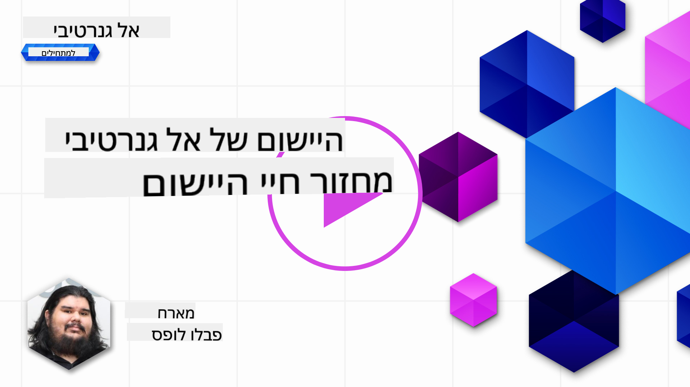
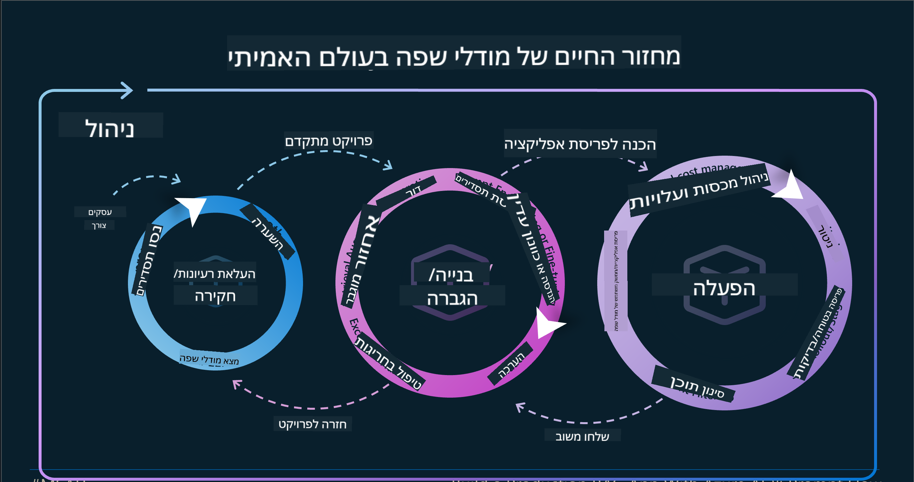
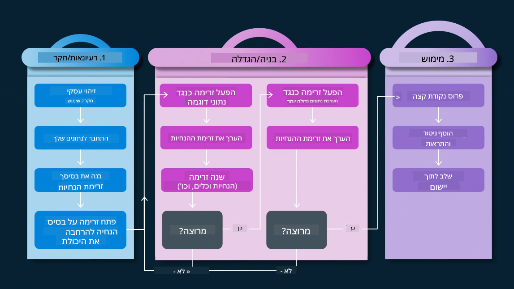
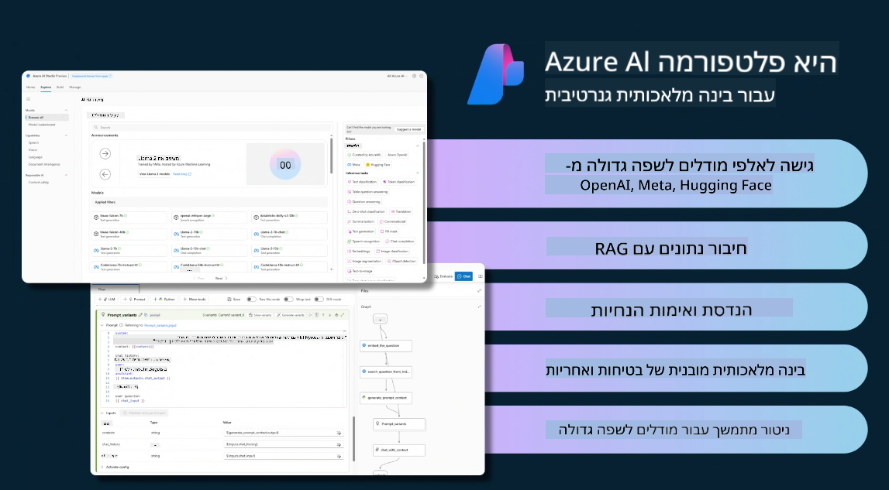
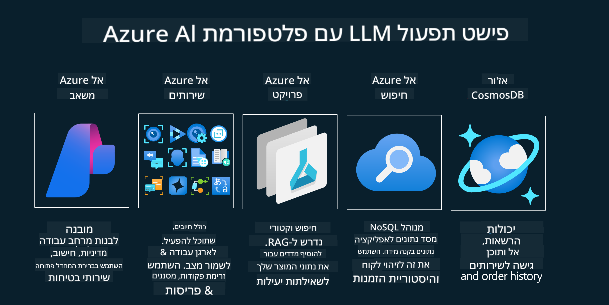

<!--
CO_OP_TRANSLATOR_METADATA:
{
  "original_hash": "27a5347a5022d5ef0a72ab029b03526a",
  "translation_date": "2025-05-19T23:30:50+00:00",
  "source_file": "14-the-generative-ai-application-lifecycle/README.md",
  "language_code": "he"
}
-->

# מחזור החיים של יישום בינה מלאכותית גנרטיבית

שאלה חשובה לכל יישומי הבינה המלאכותית היא הרלוונטיות של תכונות הבינה המלאכותית, שכן זהו תחום שמתפתח במהירות. כדי להבטיח שהיישום שלך יישאר רלוונטי, אמין ועמיד, יש לעקוב, להעריך ולשפר אותו באופן מתמיד. כאן נכנס לתמונה מחזור החיים של בינה מלאכותית גנרטיבית.

מחזור החיים של בינה מלאכותית גנרטיבית הוא מסגרת שמנחה אותך בשלבי הפיתוח, הפריסה והתחזוקה של יישום בינה מלאכותית גנרטיבית. הוא עוזר לך להגדיר את המטרות שלך, למדוד את הביצועים שלך, לזהות את האתגרים שלך וליישם את הפתרונות שלך. כמו כן, הוא מסייע ליישר את היישום שלך עם הסטנדרטים האתיים והחוקיים של התחום שלך ושל בעלי העניין שלך. על ידי מעקב אחר מחזור החיים של בינה מלאכותית גנרטיבית, תוכל להבטיח שהיישום שלך תמיד מספק ערך ומספק את המשתמשים שלך.

## הקדמה

בפרק זה תלמד:

- להבין את המעבר מ-MLOps ל-LLMOps
- מחזור החיים של LLM
- כלי מחזור חיים
- מדידת והערכת מחזור חיים

## להבין את המעבר מ-MLOps ל-LLMOps

LLMs הם כלי חדש בארסנל הבינה המלאכותית. הם עוצמתיים ביותר במשימות ניתוח ויצירה ליישומים, אך לעוצמה זו יש השלכות על האופן שבו אנו מייעלים את משימות הבינה המלאכותית והלמידה המכונתית הקלאסית.

עם זאת, אנו זקוקים לפרדיגמה חדשה להתאים את הכלי הזה בצורה דינמית, עם התמריצים הנכונים. ניתן לסווג יישומי בינה מלאכותית ישנים יותר כ"יישומי ML" ויישומי בינה מלאכותית חדשים יותר כ"יישומי GenAI" או פשוט "יישומי AI", המשקפים את הטכנולוגיה והטכניקות המרכזיות בשימוש באותה תקופה. זה משנה את הנרטיב שלנו בכמה דרכים, עיין בהשוואה הבאה.

שים לב שב-LLMOps, אנו מתמקדים יותר במפתחי היישומים, תוך שימוש באינטגרציות כנקודה מרכזית, תוך שימוש ב-"מודלים כשירות" וחשיבה בנקודות הבאות למטריקות.

- איכות: איכות התגובה
- נזק: בינה מלאכותית אחראית
- יושר: ביסוס התגובה (האם זה הגיוני? האם זה נכון?)
- עלות: תקציב הפתרון
- השהיה: זמן ממוצע לתגובה לטוקן

## מחזור החיים של LLM

ראשית, כדי להבין את מחזור החיים והשינויים, בואו נבחן את האינפוגרפיקה הבאה.

כפי שאתה יכול להבחין, זה שונה ממחזורי החיים הרגילים של MLOps. ל-LLMs יש דרישות חדשות רבות, כמו הנחיה, טכניקות שונות לשיפור האיכות (כיוונון עדין, RAG, Meta-Prompts), הערכה ואחריות שונות עם בינה מלאכותית אחראית, ולבסוף, מדדים חדשים להערכה (איכות, נזק, יושר, עלות והשהיה).

לדוגמה, הסתכל על איך אנחנו מעלים רעיונות. שימוש בהנדסת הנחיות כדי להתנסות עם LLMs שונים כדי לחקור אפשרויות לבדוק אם ההיפותזה שלהם יכולה להיות נכונה.

שימו לב שזה לא ליניארי, אלא לולאות משולבות, איטרטיביות ובעל מחזור כולל.

כיצד נוכל לחקור את הצעדים הללו? בואו ניכנס לפרטים כיצד נוכל לבנות מחזור חיים.

זה עשוי להיראות קצת מסובך, בואו נתמקד בשלושת הצעדים הגדולים תחילה.

1. העלאת רעיונות/חקירה: חקירה, כאן נוכל לחקור בהתאם לצרכי העסק שלנו. יצירת אבטיפוס, יצירת [PromptFlow](https://microsoft.github.io/promptflow/index.html?WT.mc_id=academic-105485-koreyst) ובדיקה אם הוא יעיל מספיק עבור ההיפותזה שלנו.
2. בנייה/הגדלה: יישום, כעת, אנו מתחילים להעריך מערכי נתונים גדולים יותר וליישם טכניקות, כמו כיוונון עדין ו-RAG, כדי לבדוק את החוסן של הפתרון שלנו. אם לא, ייתכן שיישום מחדש, הוספת שלבים חדשים בזרימה שלנו או ארגון מחדש של הנתונים יעזרו. לאחר בדיקת הזרימה והסקאלה שלנו, אם זה עובד ובודקים את המדדים שלנו, זה מוכן לשלב הבא.
3. הפעלה: אינטגרציה, כעת הוספת מערכות ניטור והתראות למערכת שלנו, פריסה ואינטגרציה של יישומים ליישום שלנו.

לאחר מכן, יש לנו את המחזור הכולל של ניהול, תוך התמקדות באבטחה, תאימות וממשל.

מזל טוב, עכשיו יש לך את יישום הבינה המלאכותית שלך מוכן לפעולה. לחוויה מעשית, עיין ב-[Contoso Chat Demo](https://nitya.github.io/contoso-chat/?WT.mc_id=academic-105485-koreys).

כעת, אילו כלים נוכל להשתמש?

## כלי מחזור חיים

לכלים, Microsoft מספקת את [פלטפורמת Azure AI](https://azure.microsoft.com/solutions/ai/?WT.mc_id=academic-105485-koreys) ו-[PromptFlow](https://microsoft.github.io/promptflow/index.html?WT.mc_id=academic-105485-koreyst) כדי להקל ולגרום למחזור שלך להיות קל ליישום ומוכן לפעולה.

ה-[פלטפורמת Azure AI](https://azure.microsoft.com/solutions/ai/?WT.mc_id=academic-105485-koreys), מאפשרת לך להשתמש ב-[AI Studio](https://ai.azure.com/?WT.mc_id=academic-105485-koreys). AI Studio הוא פורטל אינטרנט שמאפשר לך לחקור מודלים, דוגמאות וכלים. ניהול המשאבים שלך, זרימות פיתוח UI ואפשרויות SDK/CLI לפיתוח מונחה קוד.

Azure AI, מאפשרת לך להשתמש במשאבים מרובים, לנהל את הפעולות שלך, שירותים, פרויקטים, חיפוש וקטורי וצרכי מסדי נתונים.

בנה, מהוכחת-קונספט (POC) ועד ליישומים בקנה מידה גדול עם PromptFlow:

- עיצוב ובניית אפליקציות מ-VS Code, עם כלים ויזואליים ופונקציונליים
- בדיקה וכיוונון עדין של האפליקציות שלך לאיכות AI, בקלות.
- השתמש ב-Azure AI Studio כדי לשלב ולחזור עם הענן, דחוף ופרוס לאינטגרציה מהירה.

## נהדר! המשך ללמוד!

מדהים, עכשיו למד עוד על איך אנו מבנים יישום כדי להשתמש במושגים עם [אפליקציית הצ'אט של Contoso](https://nitya.github.io/contoso-chat/?WT.mc_id=academic-105485-koreyst), כדי לבדוק כיצד קידום הענן מוסיף את המושגים הללו בהדגמות. לתוכן נוסף, בדוק את [המושב המיוחד של Ignite!
](https://www.youtube.com/watch?v=DdOylyrTOWg)

כעת, בדוק את שיעור 15, כדי להבין כיצד [הפקת מידע מורחבת ומסדי נתונים וקטוריים](../15-rag-and-vector-databases/README.md?WT.mc_id=academic-105485-koreyst) משפיעים על בינה מלאכותית גנרטיבית וכיצד ליצור אפליקציות מעוררות יותר!

**כתב ויתור**:  
מסמך זה תורגם באמצעות שירות תרגום בינה מלאכותית [Co-op Translator](https://github.com/Azure/co-op-translator). בעוד שאנו שואפים לדיוק, יש להיות מודעים לכך שתרגומים אוטומטיים עשויים להכיל שגיאות או אי-דיוקים. המסמך המקורי בשפתו המקורית צריך להיחשב כמקור הסמכותי. עבור מידע קריטי, מומלץ להשתמש בתרגום אנושי מקצועי. איננו אחראים לכל אי הבנה או פירוש שגוי הנובע מהשימוש בתרגום זה.