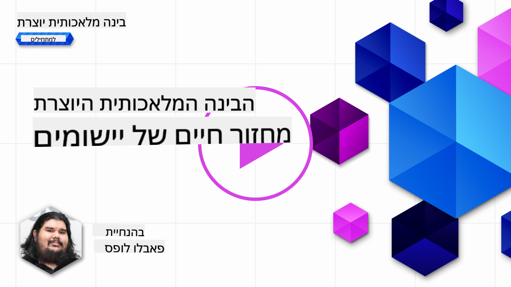
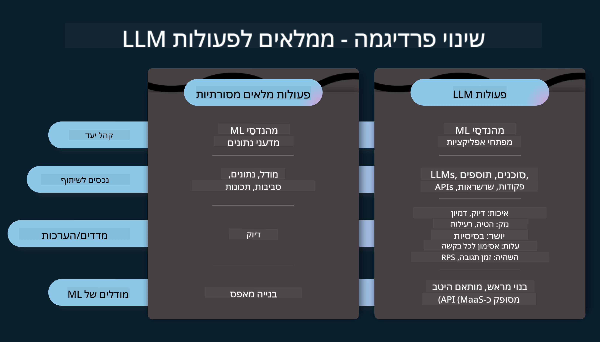
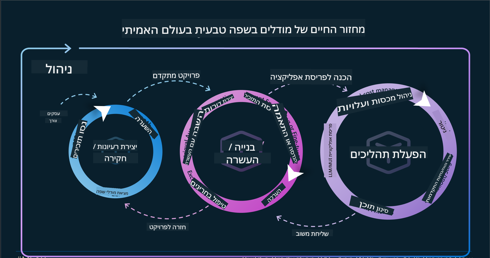
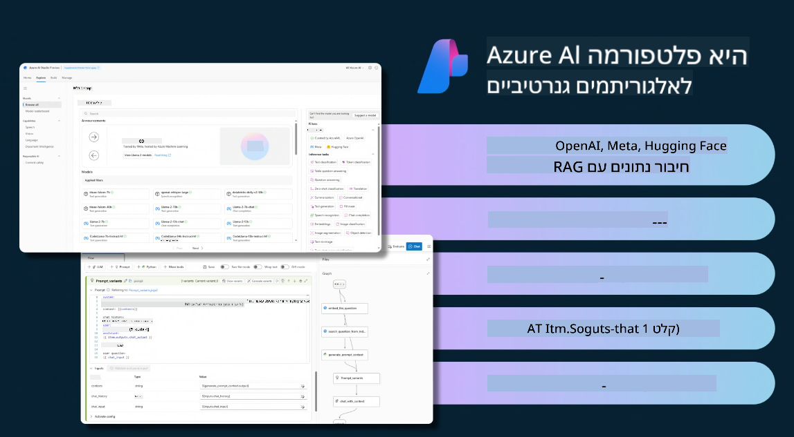
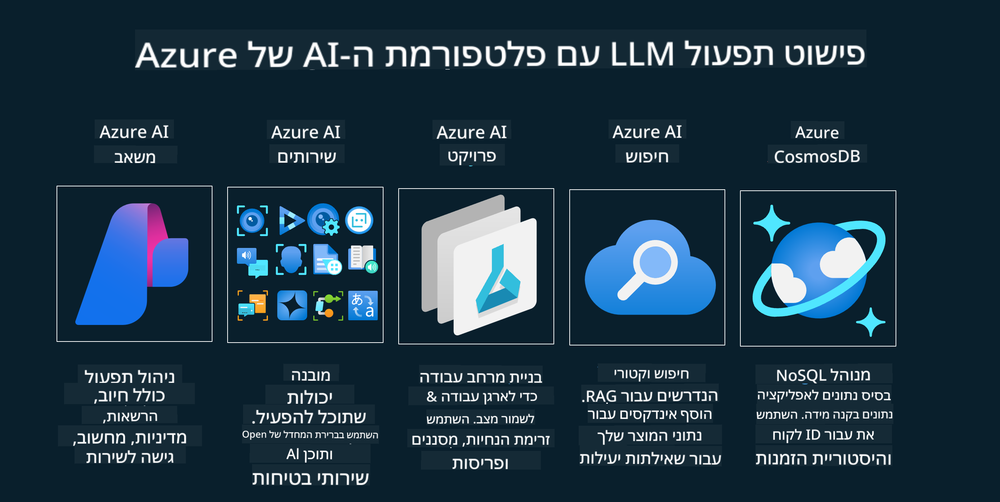
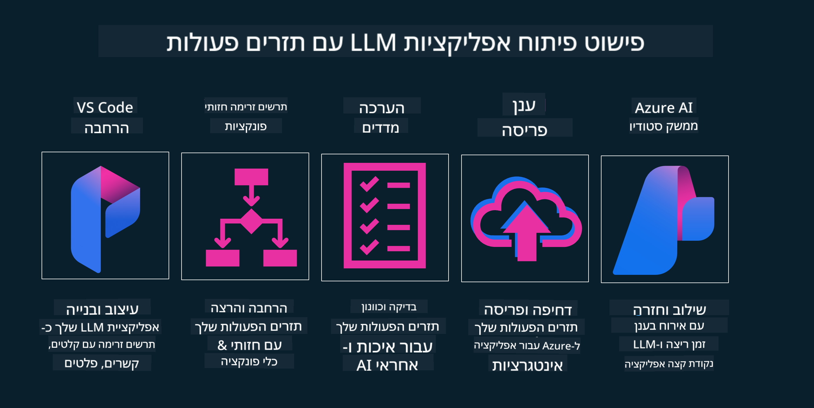

<!--
CO_OP_TRANSLATOR_METADATA:
{
  "original_hash": "27a5347a5022d5ef0a72ab029b03526a",
  "translation_date": "2025-07-09T15:55:54+00:00",
  "source_file": "14-the-generative-ai-application-lifecycle/README.md",
  "language_code": "he"
}
-->

# מחזור החיים של יישומי AI גנרטיביים

שאלה חשובה לכל יישומי ה-AI היא הרלוונטיות של תכונות ה-AI, מכיוון שתחום ה-AI מתפתח במהירות. כדי להבטיח שהיישום שלך יישאר רלוונטי, אמין וחזק, יש צורך במעקב, הערכה ושיפור מתמידים. כאן נכנס לתמונה מחזור החיים של ה-AI הגנרטיבי.

מחזור החיים של ה-AI הגנרטיבי הוא מסגרת שמנחה אותך בשלבי הפיתוח, הפריסה והתחזוקה של יישום AI גנרטיבי. הוא עוזר לך להגדיר את המטרות שלך, למדוד את הביצועים, לזהות את האתגרים וליישם פתרונות. בנוסף, הוא מסייע לך ליישר את היישום עם הסטנדרטים האתיים והחוקיים של התחום והגורמים המעורבים. על ידי מעקב אחר מחזור החיים של ה-AI הגנרטיבי, תוכל להבטיח שהיישום שלך תמיד יספק ערך ויספק את צורכי המשתמשים.

## מבוא

בפרק זה תלמד:

- להבין את המעבר מה-MLOps ל-LLMOps  
- מחזור החיים של LLM  
- כלים למחזור החיים  
- מדידה והערכה במחזור החיים  

## להבין את המעבר מ-MLOps ל-LLMOps

LLMs הם כלי חדש בארסנל של הבינה המלאכותית, הם חזקים מאוד במשימות ניתוח ויצירה עבור יישומים, אך הכוח הזה מביא עמו השלכות על האופן שבו אנו מייעלים משימות AI ולמידת מכונה קלאסית.

לכן, אנו זקוקים לפרדיגמה חדשה שתתאים את הכלי הזה בצורה דינמית, עם התמריצים הנכונים. ניתן לסווג יישומי AI ישנים כ"ML Apps" ויישומי AI חדשים כ"GenAI Apps" או פשוט "AI Apps", המשקפים את הטכנולוגיות והטכניקות המרכזיות באותה תקופה. זה משנה את הסיפור שלנו בכמה מובנים, ראו את ההשוואה הבאה.

שימו לב שב-LLMOps, אנו מתמקדים יותר במפתחי היישומים, משתמשים באינטגרציות כנקודת מפתח, משתמשים ב"Models-as-a-Service" וחושבים על המדדים הבאים:

- איכות: איכות התגובה  
- נזק: AI אחראי  
- יושרה: עמידות התגובה (האם זה הגיוני? האם זה נכון?)  
- עלות: תקציב הפתרון  
- השהייה: זמן ממוצע לתגובה לטוקן  

## מחזור החיים של LLM

ראשית, כדי להבין את מחזור החיים והשינויים, שימו לב לאינפוגרפיקה הבאה.

כפי שניתן לראות, זה שונה ממחזורי החיים הרגילים של MLOps. ל-LLMs יש דרישות חדשות רבות, כמו פרומפטינג, טכניקות שונות לשיפור האיכות (Fine-Tuning, RAG, Meta-Prompts), הערכה ואחריות עם AI אחראי, ולבסוף מדדי הערכה חדשים (איכות, נזק, יושרה, עלות והשהייה).

לדוגמה, שימו לב לאופן שבו אנו מפתחים רעיונות. שימוש בהנדסת פרומפטים כדי להתנסות עם LLMs שונים ולחקור אפשרויות כדי לבדוק אם ההשערות שלנו יכולות להיות נכונות.

שימו לב שזה לא תהליך ליניארי, אלא לולאות משולבות, איטרטיביות, עם מחזור כולל.

איך נוכל לחקור את השלבים האלה? בואו נצלול לפרטים כיצד לבנות מחזור חיים.

זה עשוי להיראות קצת מסובך, בואו נתמקד בשלושת השלבים הגדולים תחילה.

1. יצירת רעיונות/חקירה: חקירה, כאן אנו יכולים לחקור בהתאם לצרכי העסק שלנו. יצירת אב-טיפוס, יצירת [PromptFlow](https://microsoft.github.io/promptflow/index.html?WT.mc_id=academic-105485-koreyst) ובדיקת יעילותו להשערות שלנו.  
1. בנייה/הרחבה: יישום, כעת מתחילים להעריך על מערכי נתונים גדולים יותר, מיישמים טכניקות כמו Fine-tuning ו-RAG, כדי לבדוק את החוסן של הפתרון שלנו. אם לא, ייתכן שנצטרך ליישם מחדש, להוסיף שלבים חדשים בזרימה או לארגן מחדש את הנתונים. לאחר בדיקת הזרימה והקנה מידה, אם זה עובד ועומד במדדים, הוא מוכן לשלב הבא.  
1. הפעלה: אינטגרציה, כעת מוסיפים מערכות ניטור והתראות למערכת, פריסה ואינטגרציה עם היישום.  

לאחר מכן, יש את מחזור הניהול הכולל, המתמקד באבטחה, תאימות וממשל.

כל הכבוד, עכשיו יש לך יישום AI מוכן לפעולה. לחוויה מעשית, עיין ב-[Contoso Chat Demo.](https://nitya.github.io/contoso-chat/?WT.mc_id=academic-105485-koreys)

עכשיו, אילו כלים נוכל להשתמש?

## כלים למחזור החיים

לגבי כלים, מיקרוסופט מספקת את [Azure AI Platform](https://azure.microsoft.com/solutions/ai/?WT.mc_id=academic-105485-koreys) ו-[PromptFlow](https://microsoft.github.io/promptflow/index.html?WT.mc_id=academic-105485-koreyst) שמקלים על יישום המחזור וגורמים לו להיות פשוט ונגיש.

[Azure AI Platform](https://azure.microsoft.com/solutions/ai/?WT.mc_id=academic-105485-koreys) מאפשרת לך להשתמש ב-[AI Studio](https://ai.azure.com/?WT.mc_id=academic-105485-koreys). AI Studio הוא פורטל אינטרנטי שמאפשר לך לחקור מודלים, דוגמאות וכלים, לנהל משאבים, לפתח זרימות UI ואפשרויות SDK/CLI לפיתוח קוד-ראשון.

Azure AI מאפשרת לך להשתמש במשאבים רבים לניהול פעולות, שירותים, פרויקטים, חיפוש וקטורי וצרכי מסדי נתונים.

בנה, מהוכחת היתכנות (POC) ועד יישומים בקנה מידה גדול עם PromptFlow:

- עיצוב ובניית יישומים מ-VS Code, עם כלים ויזואליים ופונקציונליים  
- בדיקה וכיול מדויק של היישומים לאיכות AI, בקלות  
- שימוש ב-Azure AI Studio לאינטגרציה ואיטרציה עם הענן, דחיפה ופריסה לאינטגרציה מהירה  

## מצוין! המשך ללמוד!

מדהים, עכשיו למד עוד על איך אנו מבנים יישום כדי להשתמש במושגים עם [Contoso Chat App](https://nitya.github.io/contoso-chat/?WT.mc_id=academic-105485-koreyst), כדי לראות איך Cloud Advocacy מוסיף את המושגים האלה בהדגמות. לתוכן נוסף, עיין במפגש הפיצול שלנו ב-[Ignite!](https://www.youtube.com/watch?v=DdOylyrTOWg)

כעת, בדוק את שיעור 15, כדי להבין כיצד [Retrieval Augmented Generation ו-Vector Databases](../15-rag-and-vector-databases/README.md?WT.mc_id=academic-105485-koreyst) משפיעים על AI גנרטיבי ומאפשרים יצירת יישומים מעניינים יותר!

**כתב ויתור**:  
מסמך זה תורגם באמצעות שירות תרגום מבוסס בינה מלאכותית [Co-op Translator](https://github.com/Azure/co-op-translator). למרות שאנו שואפים לדיוק, יש לקחת בחשבון כי תרגומים אוטומטיים עלולים להכיל שגיאות או אי-דיוקים. המסמך המקורי בשפת המקור שלו נחשב למקור הסמכותי. למידע קריטי מומלץ להשתמש בתרגום מקצועי על ידי מתרגם אנושי. אנו לא נושאים באחריות לכל אי-הבנה או פרשנות שגויה הנובעת משימוש בתרגום זה.