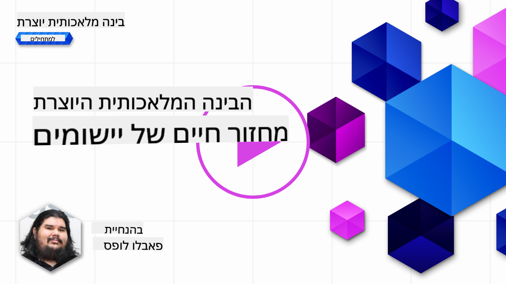
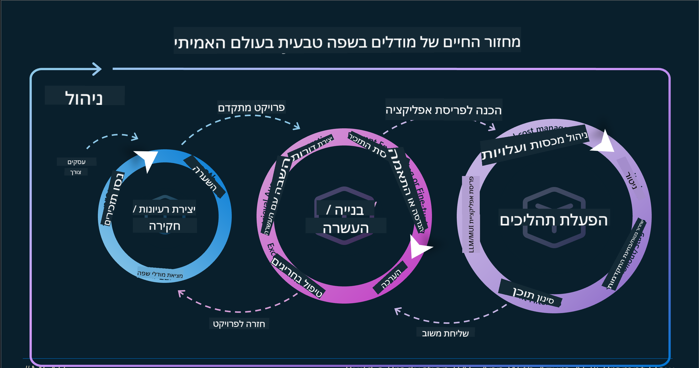
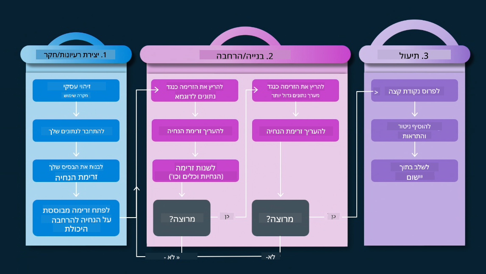
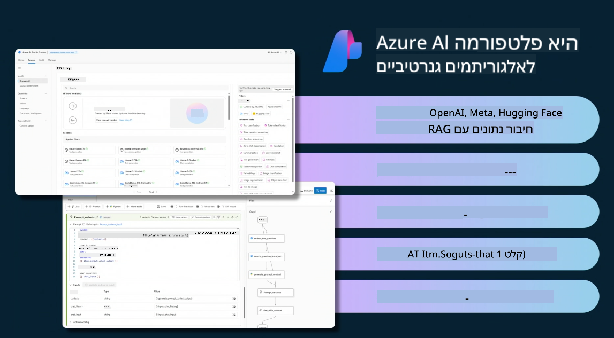
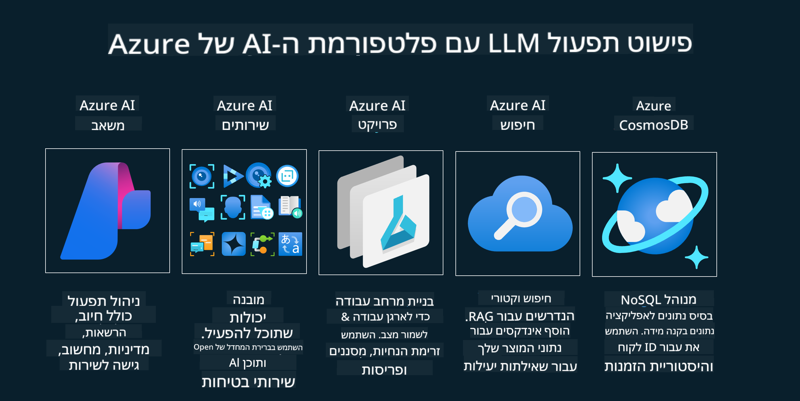
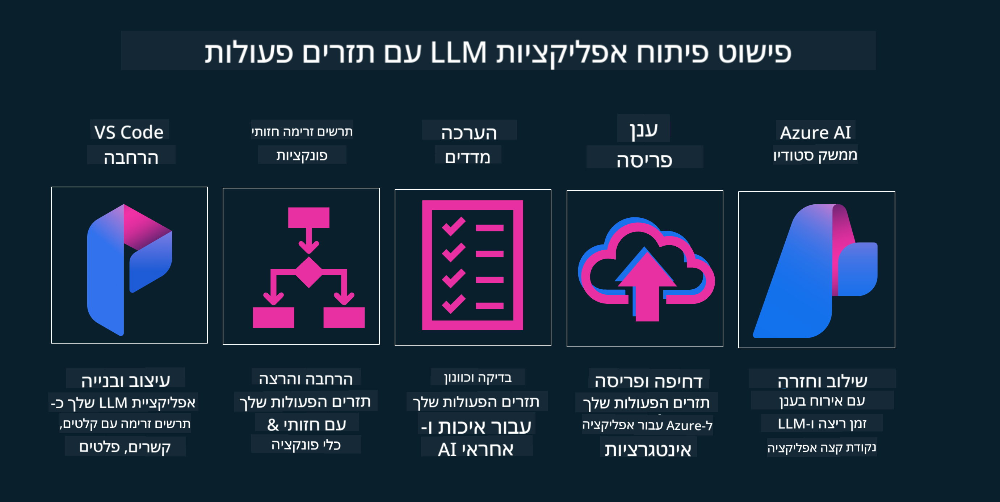

<!--
CO_OP_TRANSLATOR_METADATA:
{
  "original_hash": "27a5347a5022d5ef0a72ab029b03526a",
  "translation_date": "2025-06-25T22:06:32+00:00",
  "source_file": "14-the-generative-ai-application-lifecycle/README.md",
  "language_code": "he"
}
-->

# מחזור החיים של יישום AI גנרטיבי

שאלה חשובה עבור כל יישומי AI היא הרלוונטיות של תכונות AI, מכיוון ש-AI הוא תחום שמתפתח במהירות. כדי להבטיח שהיישום שלך יישאר רלוונטי, אמין וחזק, יש לעקוב, להעריך ולשפר אותו באופן רציף. כאן נכנס לתמונה מחזור החיים של AI גנרטיבי.

מחזור החיים של AI גנרטיבי הוא מסגרת שמנחה אותך בשלבים של פיתוח, פריסה ותחזוקה של יישום AI גנרטיבי. הוא עוזר לך להגדיר את המטרות שלך, למדוד את הביצועים שלך, לזהות את האתגרים שלך וליישם את הפתרונות שלך. הוא גם עוזר לך להתאים את היישום שלך לסטנדרטים אתיים וחוקיים של התחום שלך ושל בעלי העניין שלך. על ידי מעקב אחר מחזור החיים של AI גנרטיבי, אתה יכול להבטיח שהיישום שלך תמיד מספק ערך ומספק את המשתמשים שלך.

## מבוא

בפרק זה תלמד:

- להבין את השינוי הפרדיגמטי מ-MLOps ל-LLMOps
- מחזור החיים של LLM
- כלי מחזור החיים
- מדידה והערכה של מחזור החיים

## להבין את השינוי הפרדיגמטי מ-MLOps ל-LLMOps

LLMs הם כלי חדש בארסנל הבינה המלאכותית, הם חזקים מאוד במשימות ניתוח ויצירה עבור יישומים, אך הכוח הזה יש לו כמה השלכות על איך שאנחנו מייעלים משימות AI ולמידת מכונה קלאסית.

עם זאת, אנו זקוקים לפרדיגמה חדשה כדי להתאים את הכלי הזה בצורה דינמית, עם התמריצים הנכונים. אנו יכולים לסווג אפליקציות AI ישנות כ"אפליקציות ML" ואפליקציות AI חדשות כ"אפליקציות GenAI" או פשוט "אפליקציות AI", מה שמשקף את הטכנולוגיה והטכניקות המיינסטרים שהיו בשימוש באותה תקופה. זה משנה את הנרטיב שלנו בכמה דרכים, עיין בהשוואה הבאה.

שימו לב שב-LLMOps, אנו מתמקדים יותר במפתחי האפליקציות, תוך שימוש באינטגרציות כנקודה מרכזית, שימוש ב"מודלים כשירות" וחשיבה בנקודות הבאות עבור מדדים.

- איכות: איכות תגובה
- נזק: AI אחראי
- יושר: תגובה מבוססת (יש היגיון? זה נכון?)
- עלות: תקציב פתרון
- זמן תגובה: זמן ממוצע לתגובה של טוקן

## מחזור החיים של LLM

ראשית, כדי להבין את מחזור החיים והשינויים, בואו נבחין באינפוגרפיקה הבאה.

כפי שאתה יכול לראות, זה שונה ממחזורי החיים הרגילים של MLOps. ל-LLMs יש דרישות רבות חדשות, כמו הנחיה, טכניקות שונות לשיפור איכות (Fine-Tuning, RAG, Meta-Prompts), הערכה ואחריות עם AI אחראי, ולבסוף, מדדי הערכה חדשים (איכות, נזק, יושר, עלות וזמן תגובה).

לדוגמה, תסתכל איך אנחנו מעלים רעיונות. שימוש בהנדסת הנחיות כדי להתנסות ב-LLMs שונים כדי לחקור אפשרויות לבדוק אם ההיפותזות שלהם עשויות להיות נכונות.

שים לב שזה לא ליניארי, אלא לולאות משולבות, איטרטיביות ועם מחזור כולל.

איך נוכל לחקור את השלבים האלה? בואו ניכנס לפרטים איך נוכל לבנות מחזור חיים.

זה עשוי להיראות קצת מסובך, בואו נתמקד בשלושת השלבים הגדולים קודם.

1. העלאת רעיונות/חקר: חקר, כאן נוכל לחקור בהתאם לצרכים העסקיים שלנו. יצירת אב טיפוס, יצירת [PromptFlow](https://microsoft.github.io/promptflow/index.html?WT.mc_id=academic-105485-koreyst) ובדיקה אם הוא יעיל מספיק עבור ההיפותזה שלנו.
2. בנייה/הגדלה: יישום, עכשיו, אנו מתחילים להעריך מערכי נתונים גדולים יותר ליישם טכניקות, כמו Fine-tuning ו-RAG, כדי לבדוק את החוזק של הפתרון שלנו. אם זה לא, יישום מחדש שלו, הוספת שלבים חדשים בזרימה שלנו או ארגון מחדש של הנתונים, עשויים לעזור. לאחר בדיקת הזרימה והקנה מידה שלנו, אם זה עובד ובודקים את המדדים שלנו, זה מוכן לשלב הבא.
3. הפעלה: שילוב, עכשיו הוספת מערכות ניטור והתראות למערכת שלנו, פריסה ושילוב אפליקציה ליישום שלנו.

לאחר מכן, יש לנו את המחזור הכולל של ניהול, תוך התמקדות באבטחה, תאימות וממשל.

מזל טוב, עכשיו יש לך את אפליקציית ה-AI שלך מוכנה לפעולה. לחוויה מעשית, עיין ב-[דמו הצ'אט של Contoso.](https://nitya.github.io/contoso-chat/?WT.mc_id=academic-105485-koreys)

עכשיו, אילו כלים נוכל להשתמש?

## כלי מחזור החיים

לכלים, מיקרוסופט מספקת את [פלטפורמת Azure AI](https://azure.microsoft.com/solutions/ai/?WT.mc_id=academic-105485-koreys) ו-[PromptFlow](https://microsoft.github.io/promptflow/index.html?WT.mc_id=academic-105485-koreyst) להקל ולגרום למחזור שלך להיות קל ליישום ומוכן לפעולה.

ה-[פלטפורמת Azure AI](https://azure.microsoft.com/solutions/ai/?WT.mc_id=academic-105485-koreys), מאפשרת לך להשתמש ב-[AI Studio](https://ai.azure.com/?WT.mc_id=academic-105485-koreys). AI Studio הוא פורטל אינטרנט שמאפשר לך לחקור מודלים, דוגמאות וכלים. ניהול המשאבים שלך, זרימות פיתוח UI ואפשרויות SDK/CLI לפיתוח Code-First.

Azure AI, מאפשרת לך להשתמש במשאבים מרובים, לניהול הפעולות שלך, שירותים, פרויקטים, חיפוש וקטורים וצרכי מסדי נתונים.

בנה, מהוכחת רעיון (POC) ועד יישומים בקנה מידה גדול עם PromptFlow:

- עיצוב ובניית אפליקציות מ-VS Code, עם כלים חזותיים ופונקציונליים
- בדוק והתאם את האפליקציות שלך ל-AI איכותי, בקלות.
- השתמש ב-Azure AI Studio לשילוב ואיטרציה עם ענן, דחוף ופרוס לשילוב מהיר.

## מצוין! המשך ללמוד!

מדהים, עכשיו למד עוד על איך אנחנו מבנים יישום כדי להשתמש במושגים עם [אפליקציית הצ'אט של Contoso](https://nitya.github.io/contoso-chat/?WT.mc_id=academic-105485-koreyst), כדי לבדוק איך תמיכה בענן מוסיפה את המושגים האלה בהדגמות. לעוד תוכן, בדוק את [הפגישה שלנו ב-Ignite!](https://www.youtube.com/watch?v=DdOylyrTOWg)

עכשיו, בדוק את שיעור 15, כדי להבין איך [דור מוגבר על ידי אחזור ומסדי נתונים וקטוריים](../15-rag-and-vector-databases/README.md?WT.mc_id=academic-105485-koreyst) משפיעים על AI גנרטיבי ויוצרים יישומים יותר מרתקים!

**כתב ויתור**:  
מסמך זה תורגם באמצעות שירות תרגום בינה מלאכותית [Co-op Translator](https://github.com/Azure/co-op-translator). בעוד שאנו שואפים לדיוק, יש להיות מודעים לכך שתרגומים אוטומטיים עשויים להכיל שגיאות או אי דיוקים. המסמך המקורי בשפתו המקורית צריך להיחשב כמקור הסמכותי. למידע קריטי, מומלץ להשתמש בתרגום אנושי מקצועי. אנו לא אחראים על כל אי הבנות או פרשנויות שגויות הנובעות מהשימוש בתרגום זה.