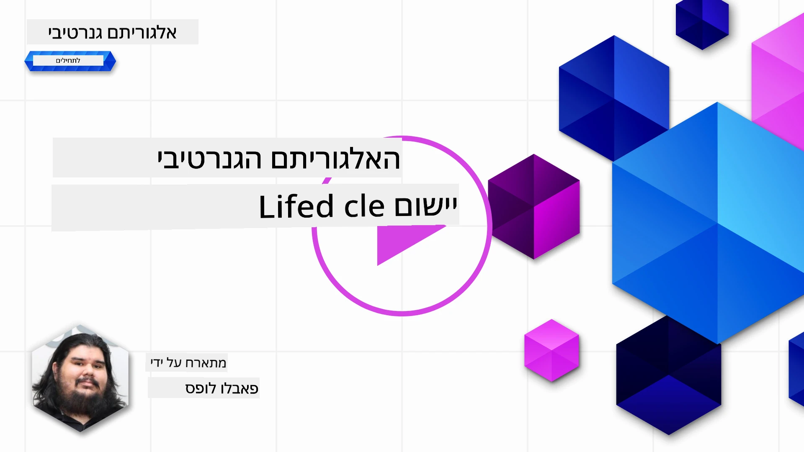
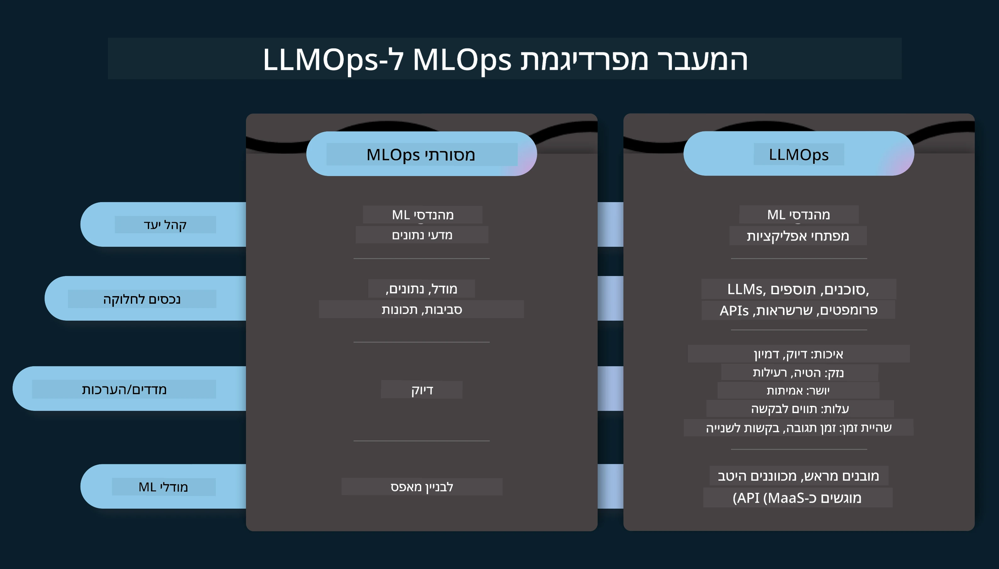
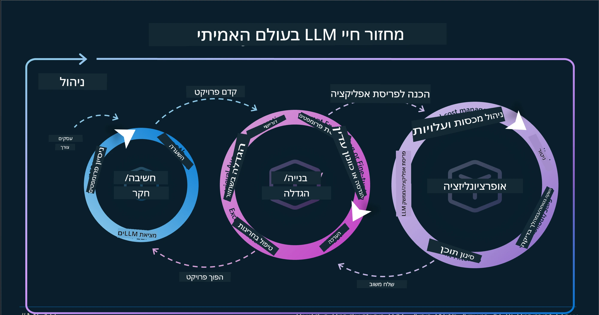
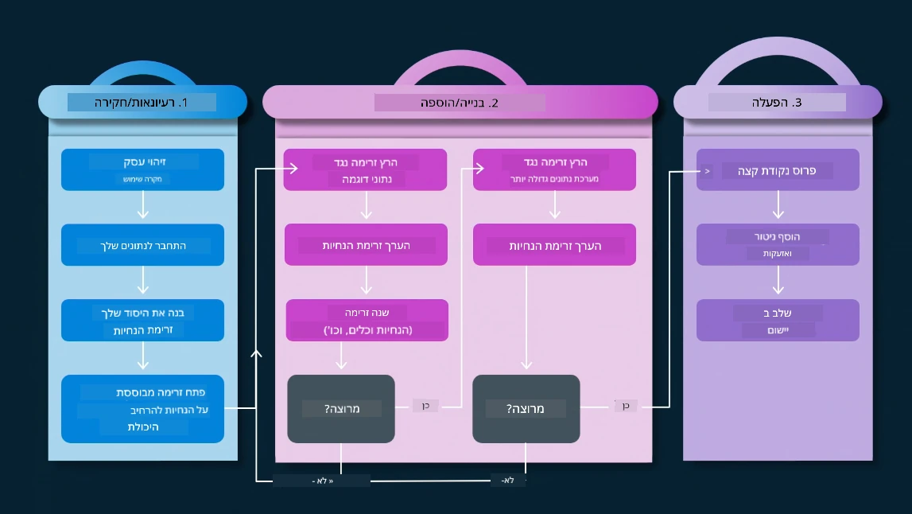
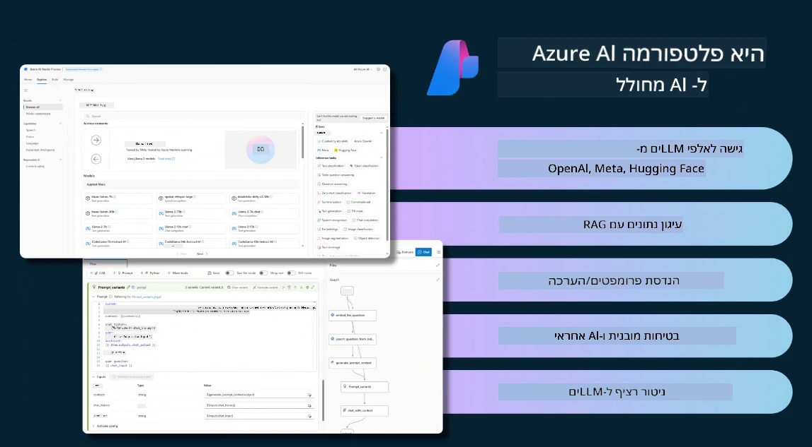
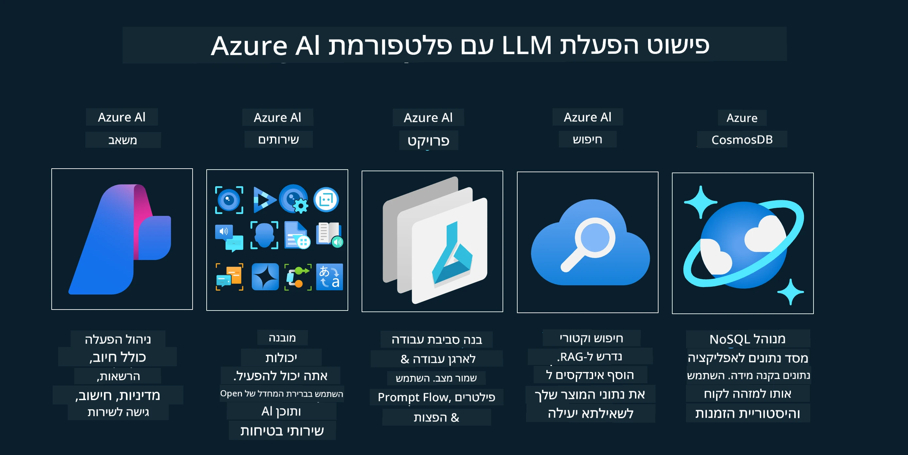
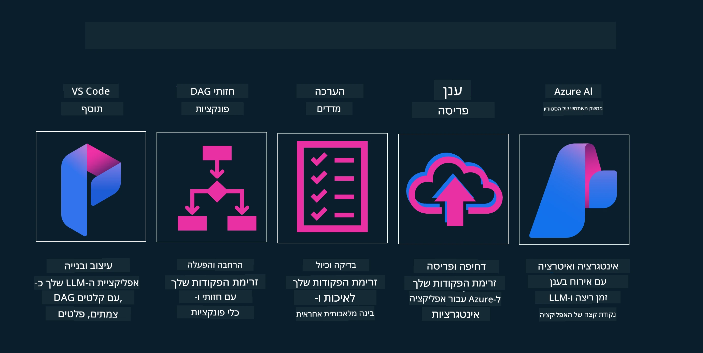

# מחזור החיים של יישומי AI גנרטיביים

שאלה חשובה לכל יישומי ה-AI היא הרלוונטיות של תכונות ה-AI, מכיוון ש-AI הוא תחום שמתפתח במהירות, כדי להבטיח שהיישום שלך יישאר רלוונטי, מהימן ויציב, יש צורך במעקב, הערכה ושיפור מתמיד. כאן נכנס לתמונה מחזור החיים של ה-AI הגנרטיבי.

מחזור החיים של ה-AI הגנרטיבי הוא מסגרת שמדריכה אותך בשלבים של פיתוח, פריסה ותחזוקה של יישום AI גנרטיבי. היא עוזרת לך להגדיר את המטרות שלך, למדוד את הביצועים, לזהות את האתגרים וליישם את הפתרונות. היא גם מסייעת ליישם את היישום בהתאם לסטנדרטים האתיים והחוקיים של התחום וגורמי העניין שלך. בעזרת מעקב אחרי מחזור החיים של ה-AI הגנרטיבי, תוכל להבטיח שהיישום שלך תמיד יספק ערך ויספק את הצרכים של המשתמשים.

## מבוא

בפרק זה תלמד:

- להבין את המעבר מפרדיגמת MLOps ל-LLMOps
- מחזור החיים של LLM
- כלי מחזור החיים
- מדידה והערכה של מחזור החיים

## להבין את המעבר מפרדיגמת MLOps ל-LLMOps

LLMs הם כלי חדש בארסנל של הבינה המלאכותית, הם בעלי יכולת עצומה במשימות ניתוח ויצירה ליישומים, אך כוח זה מביא עמו השלכות על האופן שבו אנו מייעלים משימות AI ולמידת מכונה קלאסית.

על כן, אנו צריכים פרדיגמה חדשה שתתאים לכלי זה באופן דינמי, עם התמריצים הנכונים. ניתן לסווג יישומי AI ישנים כ"יישומי ML" ויישומי AI חדשים כ"יישומי GenAI" או פשוט "יישומי AI", המשקפים את הטכנולוגיה והטכניקות המרכזיות שהיו בשימוש באותה תקופה. זה משנה את הנרטיב שלנו במספר דרכים, ראה את ההשוואה הבאה.

שים לב שב-LLMOps, ההתמקדות היא יותר מפתחי האפליקציות, עם שימוש באינטגרציות כנקודת מפתח, שימוש ב"מודלים כשירות" ומחשבה בנקודות הבאות למטריקות.

- איכות: איכות התגובה
- נזק: AI אחראי
- יושר: ביסוס התגובה (האם זה הגיוני? האם זה נכון?)
- עלות: תקציב הפתרון
- השהייה: זמן ממוצע לתגובה בטוקנים

## מחזור החיים של LLM

ראשית, כדי להבין את מחזור החיים ואת השינויים, נבחין באינפוגרפיקה הבאה.

כפי שאפשר להבחין, זה שונה ממחזורי החיים הרגילים של MLOps. ל-LLMs יש דרישות חדשות רבות, כמו פרומפטינג, טכניקות שונות לשיפור איכות (פיין-טיונינג, RAG, מטה-פרומפטים), הערכה ואחריות עם AI אחראי, ולבסוף מדדים חדשים להערכה (איכות, נזק, יושר, עלות והשהייה).

לדוגמה, ראה כיצד אנו מייצרים רעיונות. שימוש בהנדסת פרומפטים להתנסות עם LLMs שונים כדי לחקור אפשרויות ולבדוק אם ההשערה שלהם יכולה להיות נכונה.

שים לב שזה אינו תהליך ליניארי, אלא לולאות משולבות, איטרטיביות ועם מחזור כללי כולל.

כיצד נוכל לחקור את השלבים האלה? נתחיל בפרט כיצד נבנה מחזור חיים.

זה עשוי להיראות קצת מסובך, נתמקד בשלושת השלבים המרכזיים ראשית.

1. יצירת רעיונות/חקירה: חקירה, כאן נוכל לחקור בהתאם לצרכי העסק שלנו. יצירת אב-טיפוס, יצירת [PromptFlow](https://microsoft.github.io/promptflow/index.html?WT.mc_id=academic-105485-koreyst) ובדיקת יעילות עבור ההשערה שלנו.
1. בנייה/הגברה: יישום, עכשיו אנו מתחילים להעריך עבור מערכי נתונים גדולים יותר תוך יישום טכניקות, כמו פיין-טיונינג ו-RAG, כדי לבדוק את עמידות הפתרון שלנו. אם לא, ניתן ליישם מחדש, להוסיף שלבים לזרימה או לארגן מחדש את הנתונים, שעלול לסייע. לאחר בדיקת הזרימה וההיקף, אם זה עובד ובודק את המדדים, היישום מוכן לשלב הבא.
1. הפעלה: אינטגרציה, עכשיו מוסיפים מערכות ניטור והתראות למערכת שלנו, פריסה ואינטגרציה עם האפליקציה.

לאחר מכן, יש לנו את מחזור הניהול הכולל, עם התמקדות בביטחון, תאימות וממשל.

ברכות, כעת יש לך יישום AI מוכן ומתפקד. לניסיון מעשי, בדוק את [דמו צ'אט Contoso](https://nitya.github.io/contoso-chat/?WT.mc_id=academic-105485-koreyst)

ועכשיו, אילו כלים נוכל להשתמש?

## כלי מחזור החיים

לצורך כלי עבודה, מיקרוסופט מספקת את [Azure AI Platform](https://azure.microsoft.com/solutions/ai/?WT.mc_id=academic-105485-koreyst) ו-[PromptFlow](https://microsoft.github.io/promptflow/index.html?WT.mc_id=academic-105485-koreyst) שמקלים ומאפשרים להטמיע את מחזור החיים בקלות ולהיות מוכנים להתחיל.

[Azure AI Platform](https://azure.microsoft.com/solutions/ai/?WT.mc_id=academic-105485-koreyst) מאפשרת שימוש ב-[AI Studio](https://ai.azure.com/?WT.mc_id=academic-105485-koreyst). AI Studio הוא פורטל אינטרנטי המאפשר לך לחקור מודלים, דוגמאות וכלים. לנהל את המשאבים שלך, פיתוח זרימות ממשק משתמש ואפשרויות SDK/CLI לפיתוח קוד-ראשון.

Azure AI מאפשרת לך להשתמש במשאבים מגוונים לניהול הפעולות, שירותים, פרויקטים, חיפוש וקטורי וצרכי בסיסי נתונים.

בנה מיסודות של Proof-of-Concept (POC) ועד יישומים בקנה מידה גדול עם PromptFlow:

- עיצוב ובניית יישומים מ-VS Code, עם כלים ויזואליים ופונקציונליים
- בדוק וכוון עדינות את היישומים שלך לאיכות AI, בקלות.
- השתמש ב-Azure AI Studio כדי לשלב ולחזור על התהליך בענן, לדחוף ולפרוס לאינטגרציה מהירה.

## מצוין! המשך ללמוד!

נפלא, כעת למד עוד איך אנו מבנים אפליקציה כדי להשתמש במושגים עם [אפליקציית הצ'אט של Contoso](https://nitya.github.io/contoso-chat/?WT.mc_id=academic-105485-koreyst), כדי לבדוק כיצד Cloud Advocacy מוסיפה את המושגים בהדגמות. לתוכן נוסף, צפה במפגש הפריצה שלנו ב-[Ignite!](https://www.youtube.com/watch?v=DdOylyrTOWg)

כעת, בדוק את השיעור ה-15, כדי להבין כיצד [Retrieval Augmented Generation ומסדי נתונים וקטוריים](../15-rag-and-vector-databases/README.md?WT.mc_id=academic-105485-koreyst) משפיעים על AI גנרטיבי וליצור יישומים מרתקים יותר!

---

<!-- CO-OP TRANSLATOR DISCLAIMER START -->
**כתב ויתור**:  
מסמך זה תורגם באמצעות שירות תרגום מבוסס בינה מלאכותית [Co-op Translator](https://github.com/Azure/co-op-translator). למרות שאנו שואפים לדייק, יש להיות מודעים לכך שתרגומים אוטומטיים עלולים להכיל שגיאות או חוסר דיוקים. המסמך המקורי בשפת המקור נחשב למקור הסמכותי. למידע קריטי מומלץ להשתמש בשירותי תרגום מקצועיים על ידי אדם. אנו לא נושאים באחריות עבור אי-הבנות או פרשנויות שגויות הנובעות משימוש בתרגום זה.
<!-- CO-OP TRANSLATOR DISCLAIMER END -->