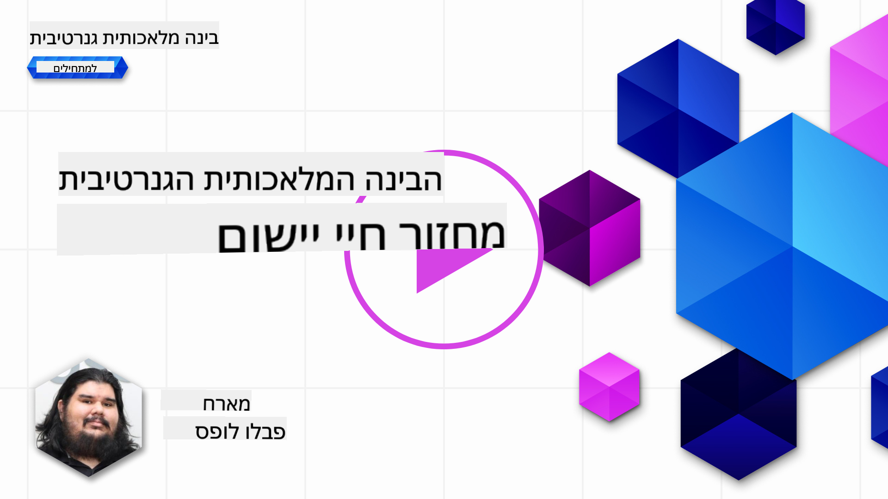
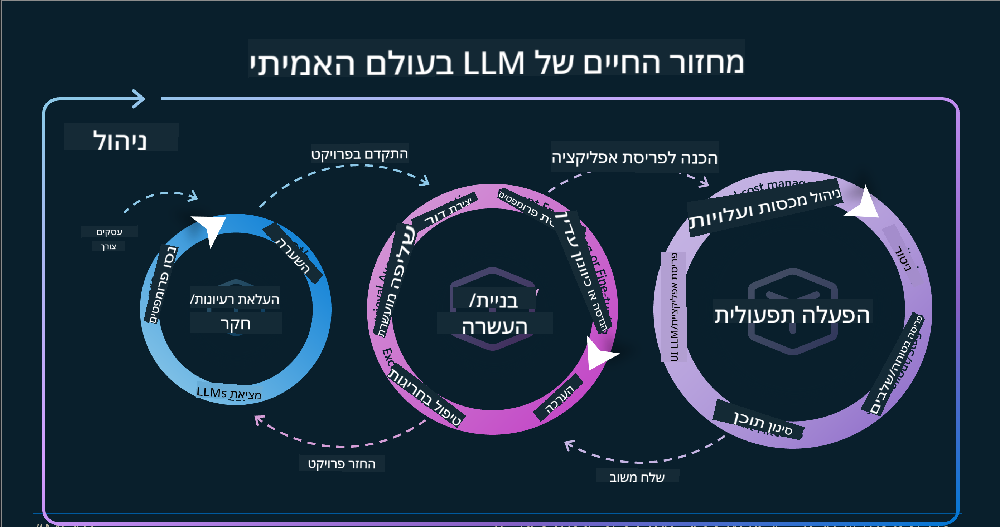
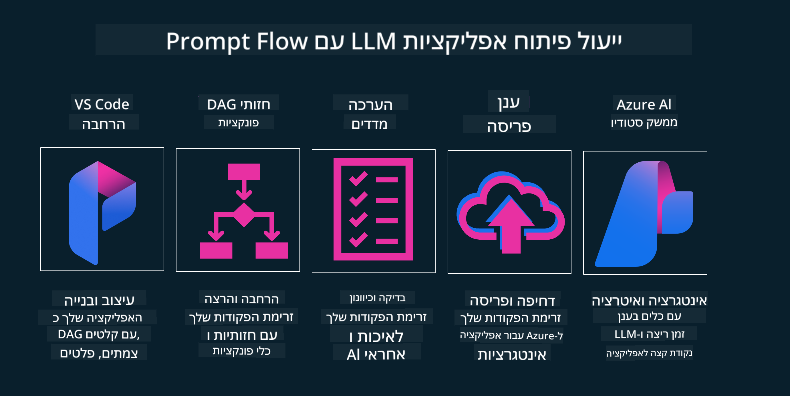

<!--
CO_OP_TRANSLATOR_METADATA:
{
  "original_hash": "df44972d5575ea8cef3c52ee31696d04",
  "translation_date": "2025-12-19T15:54:41+00:00",
  "source_file": "14-the-generative-ai-application-lifecycle/README.md",
  "language_code": "he"
}
-->

# מחזור החיים של יישום בינה מלאכותית גנרטיבית

שאלה חשובה לכל יישומי הבינה המלאכותית היא הרלוונטיות של תכונות הבינה המלאכותית, מכיוון שבינה מלאכותית היא תחום שמתפתח במהירות, כדי להבטיח שהיישום שלך יישאר רלוונטי, אמין וחזק, עליך לנטר, להעריך ולשפר אותו באופן מתמיד. כאן נכנס לתמונה מחזור החיים של הבינה המלאכותית הגנרטיבית.

מחזור החיים של הבינה המלאכותית הגנרטיבית הוא מסגרת שמנחה אותך בשלבי פיתוח, פריסה ותחזוקה של יישום בינה מלאכותית גנרטיבית. הוא עוזר לך להגדיר את המטרות שלך, למדוד את הביצועים, לזהות את האתגרים שלך וליישם את הפתרונות שלך. הוא גם עוזר לך ליישר את היישום שלך עם הסטנדרטים האתיים והמשפטיים של התחום שלך ושל בעלי העניין שלך. על ידי מעקב אחר מחזור החיים של הבינה המלאכותית הגנרטיבית, תוכל להבטיח שהיישום שלך תמיד יספק ערך ויספק את צורכי המשתמשים שלך.

## מבוא

בפרק זה תלמד:

- להבין את המעבר מה-MLOps ל-LLMOps
- מחזור החיים של LLM
- כלים למחזור החיים
- מדידה והערכה במחזור החיים

## להבין את המעבר מ-MLOps ל-LLMOps

מודלים שפתיים גדולים (LLMs) הם כלי חדש בארסנל הבינה המלאכותית, הם חזקים מאוד במשימות ניתוח ויצירה עבור יישומים, אך כוח זה מביא עמו השלכות על האופן שבו אנו מייעלים משימות בינה מלאכותית ולמידת מכונה קלאסית.

לכן, אנו זקוקים לפרדיגמה חדשה כדי להתאים את הכלי הזה בצורה דינמית, עם התמריצים הנכונים. ניתן לסווג יישומי בינה מלאכותית ישנים כ"יישומי למידת מכונה" ויישומים חדשים כ"יישומי בינה מלאכותית גנרטיבית" או פשוט "יישומי בינה מלאכותית", המשקפים את הטכנולוגיה והטכניקות המרכזיות בשימוש באותה תקופה. זה משנה את הנרטיב שלנו בכמה דרכים, הסתכל על ההשוואה הבאה.

שים לב שב-LLMOps, אנו מתמקדים יותר במפתחי היישומים, משתמשים באינטגרציות כנקודת מפתח, משתמשים ב"מודלים כשירות" וחושבים בנקודות הבאות למדדים.

- איכות: איכות התגובה
- נזק: בינה מלאכותית אחראית
- יושרה: עיגון התגובה (האם זה הגיוני? האם זה נכון?)
- עלות: תקציב הפתרון
- השהייה: זמן ממוצע לתגובה של טוקן

## מחזור החיים של LLM

ראשית, כדי להבין את מחזור החיים והשינויים, נבחן את האינפוגרפיקה הבאה.

כפי שניתן להבחין, זה שונה ממחזורי החיים הרגילים של MLOps. ל-LLMs יש דרישות חדשות רבות, כמו פרומפטינג, טכניקות שונות לשיפור האיכות (כמו כוונון עדין, RAG, מטה-פרומפטים), הערכה ואחריות עם בינה מלאכותית אחראית, ולבסוף, מדדי הערכה חדשים (איכות, נזק, יושרה, עלות והשהייה).

לדוגמה, הסתכל כיצד אנו מייצרים רעיונות. שימוש בהנדסת פרומפטים כדי להתנסות עם מודלים שונים ולחקור אפשרויות כדי לבדוק אם ההשערה שלהם יכולה להיות נכונה.

שים לב שזה לא ליניארי, אלא לולאות משולבות, איטרטיביות ועם מחזור כולל.

כיצד נוכל לחקור את השלבים האלה? בוא ניכנס לפרטים כיצד נוכל לבנות מחזור חיים.

זה עשוי להיראות קצת מסובך, בוא נתמקד בשלושת השלבים הגדולים תחילה.

1. יצירת רעיונות/חקירה: חקירה, כאן אנו יכולים לחקור בהתאם לצרכי העסק שלנו. יצירת אב-טיפוס, יצירת [PromptFlow](https://microsoft.github.io/promptflow/index.html?WT.mc_id=academic-105485-koreyst) ובדיקה אם זה יעיל מספיק עבור ההשערה שלנו.
1. בנייה/הרחבה: יישום, כעת אנו מתחילים להעריך עבור מערכי נתונים גדולים יותר, מיישמים טכניקות כמו כוונון עדין ו-RAG, כדי לבדוק את החוסן של הפתרון שלנו. אם לא, ייתכן שיישום מחדש, הוספת שלבים חדשים בזרימה או ארגון מחדש של הנתונים יעזרו. לאחר בדיקת הזרימה והקנה מידה, אם זה עובד ובודקים את המדדים שלנו, זה מוכן לשלב הבא.
1. הפעלה: אינטגרציה, כעת מוסיפים מערכות ניטור והתראות למערכת שלנו, פריסה ואינטגרציה של היישום.

לאחר מכן, יש לנו את מחזור הניהול הכולל, המתמקד באבטחה, תאימות וממשל.

ברכות, כעת יש לך יישום בינה מלאכותית מוכן לפעולה. לחוויה מעשית, עיין ב-[הדגמת צ'אט Contoso.](https://nitya.github.io/contoso-chat/?WT.mc_id=academic-105485-koreys)

עכשיו, אילו כלים נוכל להשתמש?

## כלים למחזור החיים

לכלים, מיקרוסופט מספקת את [פלטפורמת Azure AI](https://azure.microsoft.com/solutions/ai/?WT.mc_id=academic-105485-koreys) ו-[PromptFlow](https://microsoft.github.io/promptflow/index.html?WT.mc_id=academic-105485-koreyst) שמקלים על יישום המחזור וגורמים לו להיות פשוט ומוכן לשימוש.

[פלטפורמת Azure AI](https://azure.microsoft.com/solutions/ai/?WT.mc_id=academic-105485-koreys) מאפשרת לך להשתמש ב-[AI Studio](https://ai.azure.com/?WT.mc_id=academic-105485-koreys). AI Studio הוא פורטל אינטרנט המאפשר לך לחקור מודלים, דוגמאות וכלים. ניהול המשאבים שלך, זרימות פיתוח ממשק משתמש ואפשרויות SDK/CLI לפיתוח קוד-ראשון.

Azure AI מאפשרת לך להשתמש במשאבים רבים, לנהל את הפעולות, השירותים, הפרויקטים, חיפוש וקטורי וצרכי מסדי נתונים.

בנה, מהוכחת מושג (POC) ועד יישומים בקנה מידה גדול עם PromptFlow:

- עיצוב ובניית יישומים מ-VS Code, עם כלים ויזואליים ופונקציונליים
- בדיקה וכוונון עדין של היישומים שלך לאיכות בינה מלאכותית, בקלות.
- השתמש ב-Azure AI Studio כדי לשלב ולאיטרט עם הענן, לדחוף ולפרוס לאינטגרציה מהירה.

## מצוין! המשך ללמוד!

מדהים, עכשיו למד עוד על איך אנו מבנים יישום כדי להשתמש במושגים עם [יישום הצ'אט של Contoso](https://nitya.github.io/contoso-chat/?WT.mc_id=academic-105485-koreyst), כדי לבדוק כיצד Cloud Advocacy מוסיפה את המושגים האלה בהדגמות. לתוכן נוסף, עיין במפגש הפריצה שלנו ב-[Ignite!](https://www.youtube.com/watch?v=DdOylyrTOWg)

כעת, בדוק את שיעור 15, כדי להבין כיצד [Retrieval Augmented Generation ומסדי נתונים וקטוריים](../15-rag-and-vector-databases/README.md?WT.mc_id=academic-105485-koreyst) משפיעים על בינה מלאכותית גנרטיבית וליצור יישומים מרתקים יותר!

---

<!-- CO-OP TRANSLATOR DISCLAIMER START -->
**כתב ויתור**:  
מסמך זה תורגם באמצעות שירות תרגום מבוסס בינה מלאכותית [Co-op Translator](https://github.com/Azure/co-op-translator). למרות שאנו שואפים לדיוק, יש לקחת בחשבון כי תרגומים אוטומטיים עלולים להכיל שגיאות או אי-דיוקים. המסמך המקורי בשפת המקור שלו נחשב למקור הסמכותי. למידע קריטי מומלץ להשתמש בתרגום מקצועי על ידי אדם. אנו לא נושאים באחריות לכל אי-הבנה או פרשנות שגויה הנובעת משימוש בתרגום זה.
<!-- CO-OP TRANSLATOR DISCLAIMER END -->