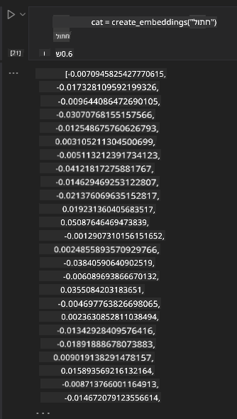

<!--
CO_OP_TRANSLATOR_METADATA:
{
  "original_hash": "e2861bbca91c0567ef32bc77fe054f9e",
  "translation_date": "2025-05-20T01:35:39+00:00",
  "source_file": "15-rag-and-vector-databases/README.md",
  "language_code": "he"
}
-->
# יצירת תוכן מועשר באמצעות אחזור (RAG) ומאגרי נתונים וקטוריים

בשיעור על יישומי חיפוש, למדנו בקצרה כיצד לשלב את הנתונים שלך בתוך מודלים של שפה גדולה (LLMs). בשיעור זה, נעמיק יותר במושגים של עיגון הנתונים שלך ביישום LLM, המכניקה של התהליך והשיטות לאחסון נתונים, כולל הן הטמעות והן טקסט.

> **סרטון בקרוב**

## הקדמה

בשיעור זה נכסה את הנושאים הבאים:

- הקדמה ל-RAG, מה זה ולמה הוא משמש בבינה מלאכותית.

- הבנת מה הם מאגרי נתונים וקטוריים ויצירת אחד עבור היישום שלנו.

- דוגמה מעשית על איך לשלב RAG בתוך יישום.

## מטרות למידה

לאחר השלמת השיעור, תוכלו:

- להסביר את החשיבות של RAG באחזור ועיבוד נתונים.

- להגדיר יישום RAG ולעגן את הנתונים שלכם ל-LLM.

- שילוב יעיל של RAG ומאגרי נתונים וקטוריים ביישומי LLM.

## התרחיש שלנו: שיפור LLMs עם הנתונים שלנו

לשיעור זה, אנו רוצים להוסיף את ההערות שלנו לסטארטאפ חינוכי, שמאפשר לצ'אטבוט לקבל יותר מידע על הנושאים השונים. באמצעות ההערות שיש לנו, הלומדים יוכלו ללמוד טוב יותר ולהבין את הנושאים השונים, מה שיקל עליהם לחזור על החומר לקראת הבחינות שלהם. כדי ליצור את התרחיש שלנו, נשתמש ב:

- `Azure OpenAI:` ה-LLM שנשתמש בו ליצירת הצ'אטבוט שלנו

- `AI for beginners' lesson on Neural Networks`: זה יהיה הנתונים שנעגן את ה-LLM שלנו עליהם

- `Azure AI Search` ו-`Azure Cosmos DB:` מאגר נתונים וקטורי לאחסון הנתונים שלנו ויצירת אינדקס חיפוש

משתמשים יוכלו ליצור מבחנים תרגול מההערות שלהם, כרטיסי זיכרון לחזרה ולסכם אותם לתמציות. כדי להתחיל, נבחן מה זה RAG וכיצד הוא עובד:

## יצירת תוכן מועשר באמצעות אחזור (RAG)

צ'אטבוט המופעל על ידי LLM מעבד הנחיות משתמש כדי ליצור תגובות. הוא מעוצב להיות אינטראקטיבי ומתחבר עם משתמשים במגוון רחב של נושאים. עם זאת, התגובות שלו מוגבלות להקשר שסופק ולנתוני האימון הבסיסיים שלו. לדוגמה, חיתוך הידע של GPT-4 הוא ספטמבר 2021, כלומר, הוא חסר ידע על אירועים שהתרחשו לאחר תקופה זו. בנוסף, הנתונים המשמשים לאימון LLMs אינם כוללים מידע סודי כגון הערות אישיות או מדריך מוצר של חברה.

### איך RAGs (יצירת תוכן מועשר באמצעות אחזור) עובדים

נניח שאתה רוצה לפרוס צ'אטבוט שיוצר מבחנים מההערות שלך, תצטרך חיבור לבסיס ידע. כאן RAG נכנס להצלה. RAGs פועלים כדלקמן:

- **בסיס ידע:** לפני האחזור, יש לעכל ולעבד את המסמכים הללו, בדרך כלל על ידי פירוק מסמכים גדולים לחלקים קטנים יותר, המרה להטמעת טקסט ואחסון אותם במאגר נתונים.

- **שאלת משתמש:** המשתמש שואל שאלה

- **אחזור:** כאשר משתמש שואל שאלה, מודל ההטמעה מאחזר מידע רלוונטי מבסיס הידע שלנו כדי לספק יותר הקשר שישולב בהנחיה.

- **יצירת תוכן מועשר:** ה-LLM משפר את תגובתו על סמך הנתונים שהוחזרו. זה מאפשר לתגובה שנוצרה להיות לא רק מבוססת על נתונים מאומנים מראש אלא גם מידע רלוונטי מההקשר הנוסף. הנתונים שהוחזרו משמשים להעשיר את תגובות ה-LLM. לאחר מכן ה-LLM מחזיר תשובה לשאלת המשתמש.

הארכיטקטורה של RAGs מיושמת באמצעות טרנספורמרים הכוללים שני חלקים: מקודד ומפענח. לדוגמה, כאשר משתמש שואל שאלה, הטקסט הקלט 'מקודד' לווקטורים שתופסים את משמעות המילים והווקטורים 'מפוענחים' לאינדקס המסמך שלנו ויוצרים טקסט חדש על בסיס שאלת המשתמש. ה-LLM משתמש במודל מקודד-מפענח כדי ליצור את הפלט.

שתי גישות בעת יישום RAG על פי המאמר המוצע: [יצירת תוכן מועשר באמצעות אחזור למשימות עיבוד שפה טבעית (NLP) אינטנסיביות ידע](https://arxiv.org/pdf/2005.11401.pdf?WT.mc_id=academic-105485-koreyst) הן:

- **_RAG-Sequence_** שימוש במסמכים שהוחזרו כדי לנבא את התשובה הטובה ביותר האפשרית לשאלת משתמש

- **RAG-Token** שימוש במסמכים כדי ליצור את הטוקן הבא, ואז להחזיר אותם כדי לענות על שאלת המשתמש

### למה להשתמש ב-RAGs?

- **עשירות מידע:** מבטיח תגובות טקסט מעודכנות ונוכחיות. זה משפר ביצועים על משימות ספציפיות לתחום על ידי גישה לבסיס הידע הפנימי.

- מפחית יצירת מידע שגוי על ידי שימוש **בנתונים מאומתים** בבסיס הידע כדי לספק הקשר לשאלות המשתמשים.

- זה **חסכוני** מכיוון שהם יותר כלכליים לעומת כוונון עדין של LLM.

## יצירת בסיס ידע

היישום שלנו מבוסס על הנתונים האישיים שלנו כלומר, השיעור על רשתות נוירונים בתוכנית הלימודים AI For Beginners.

### מאגרי נתונים וקטוריים

מאגר נתונים וקטורי, בניגוד למאגרי נתונים מסורתיים, הוא מאגר נתונים מיוחד המיועד לאחסון, ניהול וחיפוש וקטורים מוטמעים. הוא מאחסן ייצוגים מספריים של מסמכים. פירוק נתונים להטמעות מספריות מקל על מערכת הבינה המלאכותית שלנו להבין ולעבד את הנתונים.

אנו מאחסנים את ההטמעות שלנו במאגרי נתונים וקטוריים מכיוון של-LLMs יש מגבלה על מספר הטוקנים שהם מקבלים כקלט. מכיוון שלא ניתן להעביר את כל ההטמעות ל-LLM, נצטרך לפרק אותן לחלקים וכאשר משתמש שואל שאלה, ההטמעות הדומות ביותר לשאלה יוחזרו יחד עם ההנחיה. פירוק גם מפחית עלויות על מספר הטוקנים שעוברים דרך LLM.

כמה מאגרי נתונים וקטוריים פופולריים כוללים את Azure Cosmos DB, Clarifyai, Pinecone, Chromadb, ScaNN, Qdrant ו-DeepLake. ניתן ליצור מודל Azure Cosmos DB באמצעות Azure CLI עם הפקודה הבאה:

```bash
az login
az group create -n <resource-group-name> -l <location>
az cosmosdb create -n <cosmos-db-name> -r <resource-group-name>
az cosmosdb list-keys -n <cosmos-db-name> -g <resource-group-name>
```

### מטקסט להטמעות

לפני שנאחסן את הנתונים שלנו, נצטרך להמיר אותם להטמעות וקטוריות לפני שהם מאוחסנים במאגר הנתונים. אם אתם עובדים עם מסמכים גדולים או טקסטים ארוכים, תוכלו לפרק אותם על סמך השאילתות שאתם מצפים. פירוק יכול להתבצע ברמת המשפט או ברמת הפסקה. מכיוון שפירוק נגזר ממשמעות המילים סביבן, תוכלו להוסיף הקשר נוסף לחלק, למשל, על ידי הוספת כותרת המסמך או הכללת טקסט לפני או אחרי החלק. ניתן לפרק את הנתונים באופן הבא:

```python
def split_text(text, max_length, min_length):
    words = text.split()
    chunks = []
    current_chunk = []

    for word in words:
        current_chunk.append(word)
        if len(' '.join(current_chunk)) < max_length and len(' '.join(current_chunk)) > min_length:
            chunks.append(' '.join(current_chunk))
            current_chunk = []

    # If the last chunk didn't reach the minimum length, add it anyway
    if current_chunk:
        chunks.append(' '.join(current_chunk))

    return chunks
```

לאחר הפירוק, נוכל להטמיע את הטקסט שלנו באמצעות מודלים הטמעה שונים. כמה מודלים שניתן להשתמש בהם כוללים: word2vec, ada-002 על ידי OpenAI, Azure Computer Vision ועוד רבים. בחירת מודל לשימוש תלויה בשפות שבהן אתם משתמשים, סוג התוכן המקודד (טקסט/תמונות/אודיו), גודל הקלט שהוא יכול לקודד ואורך פלט ההטמעה.

דוגמה לטקסט מוטמע באמצעות מודל `text-embedding-ada-002` של OpenAI היא:


## אחזור וחיפוש וקטורי

כאשר משתמש שואל שאלה, המאחזר ממיר אותה לווקטור באמצעות מקודד השאילתה, ואז מחפש דרך אינדקס החיפוש של המסמך שלנו וקטורים רלוונטיים במסמך הקשורים לקלט. לאחר סיום, הוא ממיר את וקטור הקלט ואת וקטורי המסמך לטקסט ומעביר אותו דרך ה-LLM.

### אחזור

אחזור מתרחש כאשר המערכת מנסה למצוא במהירות את המסמכים מהאינדקס שמספקים את קריטריוני החיפוש. המטרה של המאחזר היא לקבל מסמכים שישמשו לספק הקשר ולעגן את ה-LLM על הנתונים שלך.

ישנן כמה דרכים לבצע חיפוש בתוך מאגר הנתונים שלנו כגון:

- **חיפוש מילות מפתח** - משמש לחיפושי טקסט

- **חיפוש סמנטי** - משתמש במשמעות הסמנטית של מילים

- **חיפוש וקטורי** - ממיר מסמכים מטקסט לייצוגים וקטוריים באמצעות מודלים הטמעה. אחזור יתבצע על ידי שאילת המסמכים שייצוגי הווקטור שלהם קרובים ביותר לשאלת המשתמש.

- **היברידי** - שילוב של חיפוש מילות מפתח וחיפוש וקטורי.

אתגר עם אחזור מגיע כאשר אין תגובה דומה לשאילתה במאגר הנתונים, המערכת תחזיר אז את המידע הטוב ביותר שהיא יכולה לקבל, עם זאת, ניתן להשתמש בטקטיקות כמו הגדרת המרחק המרבי לרלוונטיות או שימוש בחיפוש היברידי שמשלב גם מילות מפתח וגם חיפוש וקטורי. בשיעור זה נשתמש בחיפוש היברידי, שילוב של חיפוש וקטורי וחיפוש מילות מפתח. נאחסן את הנתונים שלנו במסגרת נתונים עם עמודות המכילות את החלקים וכן הטמעות.

### דמיון וקטורי

המאחזר יחפש דרך מאגר הידע עבור הטמעות שקרובות אחת לשנייה, השכן הקרוב ביותר, מכיוון שהן טקסטים דומים. בתרחיש שבו משתמש שואל שאילתה, היא מוטמעת תחילה ואז מותאמת להטמעות דומות. המדידה הנפוצה שמשמשת כדי למצוא כמה דומים וקטורים שונים היא דמיון קוסינוס שמבוסס על הזווית בין שני וקטורים.

ניתן למדוד דמיון באמצעות חלופות אחרות שניתן להשתמש בהן הן מרחק אוקלידי שהוא הקו הישר בין נקודות הקצה של הווקטור ומכפלת נקודה שמודדת את סכום המכפלות של רכיבים תואמים של שני וקטורים.

### אינדקס חיפוש

כאשר מבצעים אחזור, נצטרך לבנות אינדקס חיפוש עבור מאגר הידע שלנו לפני ביצוע החיפוש. אינדקס יאחסן את ההטמעות שלנו ויוכל לאחזר במהירות את החלקים הדומים ביותר אפילו במאגר נתונים גדול. ניתן ליצור את האינדקס שלנו באופן מקומי באמצעות:

```python
from sklearn.neighbors import NearestNeighbors

embeddings = flattened_df['embeddings'].to_list()

# Create the search index
nbrs = NearestNeighbors(n_neighbors=5, algorithm='ball_tree').fit(embeddings)

# To query the index, you can use the kneighbors method
distances, indices = nbrs.kneighbors(embeddings)
```

### דירוג מחדש

לאחר ששאלתם את מאגר הנתונים, ייתכן שתצטרכו למיין את התוצאות מהכי רלוונטיות. LLM דירוג מחדש מנצל למידת מכונה כדי לשפר את הרלוונטיות של תוצאות החיפוש על ידי סידורן מהכי רלוונטיות. באמצעות Azure AI Search, דירוג מחדש מתבצע אוטומטית עבורכם באמצעות דירוג מחדש סמנטי. דוגמה לאופן שבו דירוג מחדש עובד באמצעות שכנים קרובים ביותר:

```python
# Find the most similar documents
distances, indices = nbrs.kneighbors([query_vector])

index = []
# Print the most similar documents
for i in range(3):
    index = indices[0][i]
    for index in indices[0]:
        print(flattened_df['chunks'].iloc[index])
        print(flattened_df['path'].iloc[index])
        print(flattened_df['distances'].iloc[index])
    else:
        print(f"Index {index} not found in DataFrame")
```

## חיבור הכל יחד

השלב האחרון הוא הוספת ה-LLM שלנו לתהליך כדי לקבל תגובות שמבוססות על הנתונים שלנו. ניתן ליישם זאת באופן הבא:

```python
user_input = "what is a perceptron?"

def chatbot(user_input):
    # Convert the question to a query vector
    query_vector = create_embeddings(user_input)

    # Find the most similar documents
    distances, indices = nbrs.kneighbors([query_vector])

    # add documents to query  to provide context
    history = []
    for index in indices[0]:
        history.append(flattened_df['chunks'].iloc[index])

    # combine the history and the user input
    history.append(user_input)

    # create a message object
    messages=[
        {"role": "system", "content": "You are an AI assistant that helps with AI questions."},
        {"role": "user", "content": history[-1]}
    ]

    # use chat completion to generate a response
    response = openai.chat.completions.create(
        model="gpt-4",
        temperature=0.7,
        max_tokens=800,
        messages=messages
    )

    return response.choices[0].message

chatbot(user_input)
```

## הערכת היישום שלנו

### מדדי הערכה

- איכות התגובות המסופקות, לוודא שהן נשמעות טבעיות, שוטפות ודמויות אדם

- עיגון הנתונים: הערכת האם התגובה הגיעה מהמסמכים שסופקו

- רלוונטיות: הערכת האם התגובה מתאימה וקשורה לשאלה שנשאלה

- שוטפות - האם התגובה הגיונית מבחינה דקדוקית

## שימושים ל-RAG (יצירת תוכן מועשר באמצעות אחזור) ומאגרי נתונים וקטוריים

ישנם שימושים רבים שבהם קריאות פונקציה יכולות לשפר את האפליקציה שלך כמו:

- שאלות ותשובות: עיגון נתוני החברה שלך לצ'אט שניתן להשתמש בו על ידי עובדים לשאילת שאלות.

- מערכות המלצה: שבהן ניתן ליצור מערכת שמתאימה את הערכים הדומים ביותר כמו סרטים, מסעדות ועוד רבים.

- שירותי צ'אטבוט: ניתן לאחסן היסטוריית צ'אט ולהתאים את השיחה על סמך נתוני המשתמש.

- חיפוש תמונות על בסיס הטמעות וקטוריות, שימושי כאשר עושים זיהוי תמונה וזיהוי חריגות.

## סיכום

כיסינו את התחומים הבסיסיים של RAG מהוספת הנתונים שלנו ליישום, שאילת המשתמש ופלט. כדי לפשט את יצירת RAG, ניתן להשתמש במסגרות כמו Semanti Kernel, Langchain או Autogen.

## מטלה

כדי להמשיך ללמוד על יצירת תוכן מועשר באמצעות אחזור (RAG) תוכלו לבנות:

- לבנות חזית ליישום באמצעות המסגרת לבחירתכם

- לנצל מסגרת, או LangChain או Semantic Kernel, ולשחזר את היישום שלכם.

מזל טוב על השלמת השיעור 👏.

## הלמידה לא נעצרת כאן, המשיכו במסע

לאחר השלמת השיעור, בדקו את [אוסף הלמידה של AI יצירתי](https://aka.ms/genai-collection?WT.mc_id=academic-105485-koreyst) כדי להמשיך ולהעמיק את הידע שלכם ב-AI יצירתי!

**כתב ויתור**:  
מסמך זה תורגם באמצעות שירות תרגום בינה מלאכותית [Co-op Translator](https://github.com/Azure/co-op-translator). בעוד שאנו שואפים לדיוק, יש להיות מודעים לכך שתרגומים אוטומטיים עשויים להכיל שגיאות או אי-דיוקים. המסמך המקורי בשפתו המקורית צריך להיחשב כמקור סמכותי. למידע קריטי, מומלץ תרגום אנושי מקצועי. איננו אחראים לכל אי הבנה או פרשנות מוטעית הנובעת משימוש בתרגום זה.