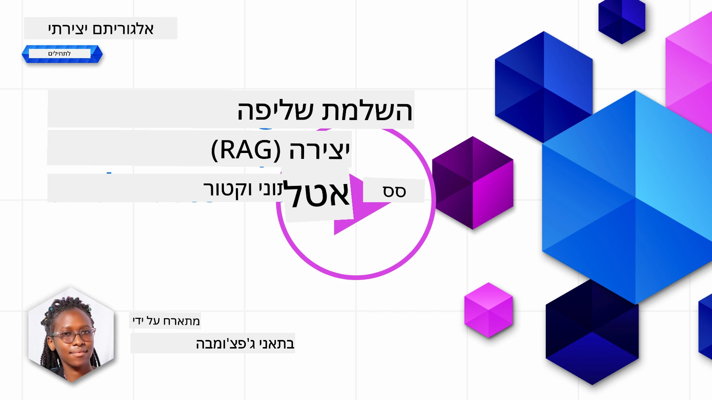
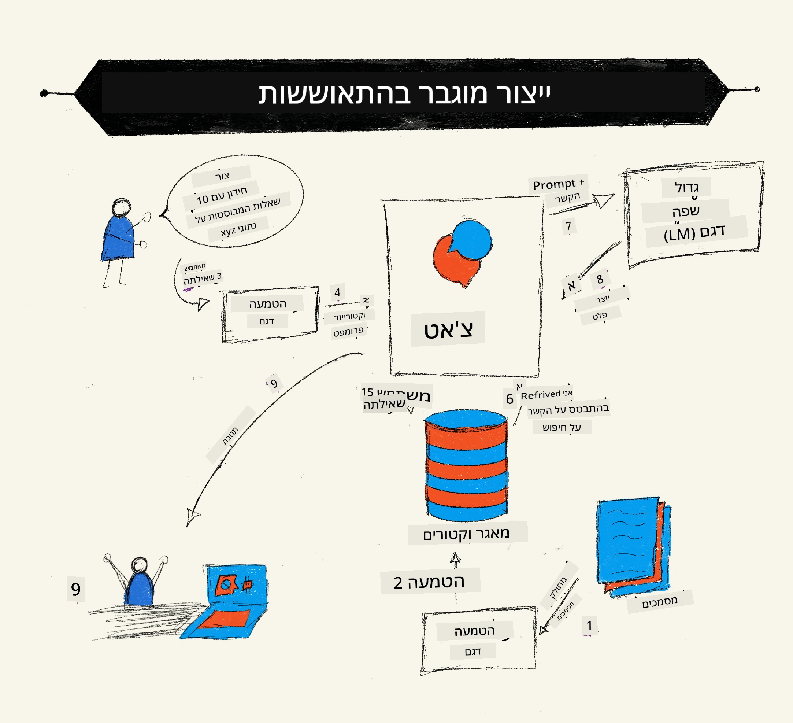
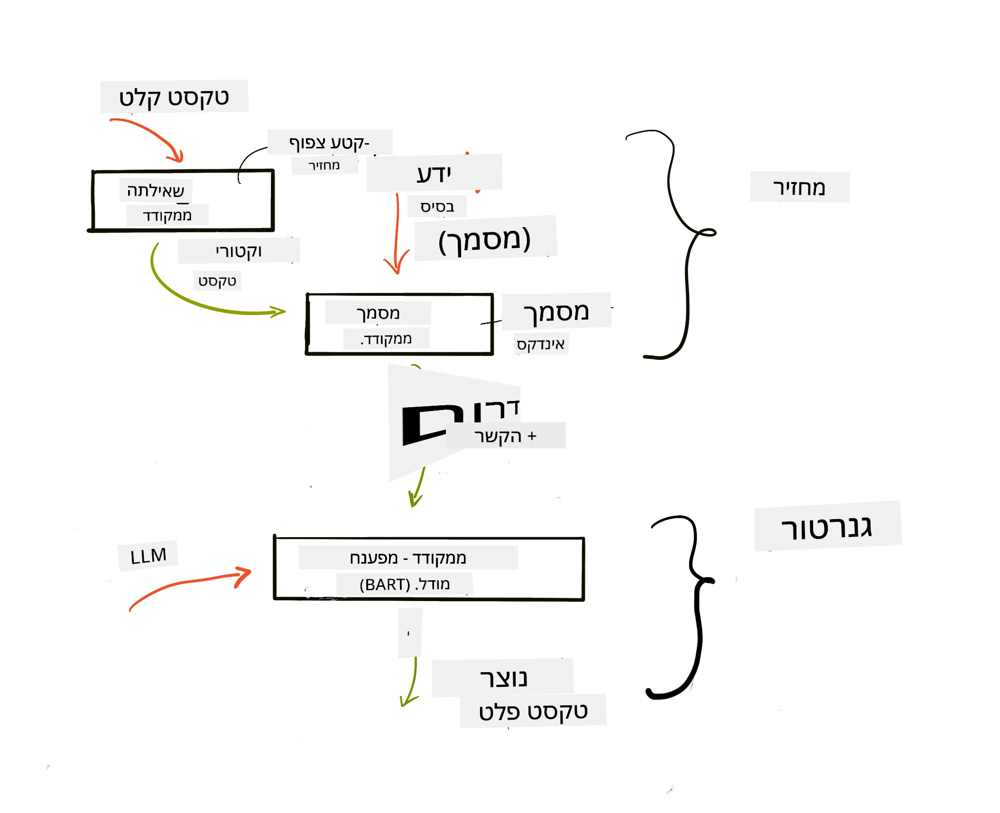
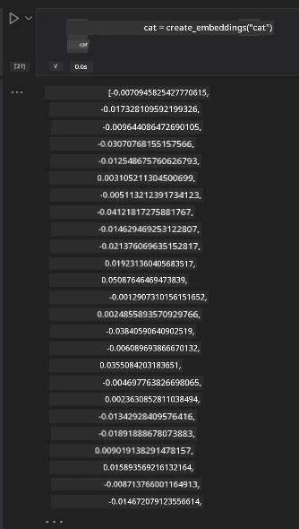

# יצירה מוגברת של שליפה (RAG) ומסדי נתונים וקטוריים

[](https://youtu.be/4l8zhHUBeyI?si=BmvDmL1fnHtgQYkL)

בשיעור על יישומי חיפוש, למדנו בקצרה כיצד לשלב את הנתונים שלך במודלים גדולים של שפה (LLMs). בשיעור זה נתעמק יותר במושגי העיגון של הנתונים שלך באפליקציית ה-LLM, במכניקת התהליך ובשיטות לאחסון נתונים, כולל גם אמבדינגים וטקסט.

> **וידאו יגיע בקרוב**

## הקדמה

בשיעור זה נכסה את הנושאים הבאים:

- מבוא ל-RAG, מה זה ולמה משתמשים בו בבינה מלאכותית (AI).

- הבנת מה הם מסדי נתונים וקטוריים ויצירת אחד לאפליקציה שלנו.

- דוגמה מעשית כיצד לשלב RAG באפליקציה.

## מטרות הלמידה

בתום השיעור תהיה לך היכולת:

- להסביר את משמעות RAG בשליפה ועיבוד נתונים.

- להגדיר אפליקציית RAG ולעגן את הנתונים שלך ב-LLM

- לשלב בצורה יעילה RAG ומסדי נתונים וקטוריים באפליקציות LLM.

## התרחיש שלנו: שיפור ה-LLMs שלנו עם הנתונים שלנו

לשיעור זה נרצה להוסיף את ההערות שלנו לסטארט-אפ חינוכי, שמאפשר לצ'אטבוט לקבל מידע נוסף על נושאים שונים. באמצעות ההערות שיש לנו, הלומדים יוכלו ללמוד טוב יותר ולהבין את הנושאים השונים, מה שיקל עליהם ללמוד למבחנים. ליצירת התרחיש שלנו, נשמש ב:

- `Azure OpenAI:` ה-LLM שבו נשתמש ליצירת הצ'אטבוט שלנו

- `שיעור AI למתחילים על רשתות עצביות`: זה יהיה הנתון שעליו נעגן את ה-LLM שלנו

- `Azure AI Search` ו-`Azure Cosmos DB:` מסד נתונים וקטורי לשמירת הנתונים שלנו וליצירת אינדקס חיפוש

משתמשים יוכלו ליצור חידונים לתרגול מההערות שלהם, כרטיסיות לחזרה ולסכם אותן לתצוגות מוצקות. כדי להתחיל, בואו נבחן מהו RAG ואיך הוא פועל:

## יצירה מוגברת של שליפה (RAG)

צ'אטבוט מונחה LLM מעבד פקודות משתמש ליצירת תגובות. הוא מתוכנת להיות אינטראקטיבי ומעורב עם המשתמשים בנושאים שונים. עם זאת, התגובות שלו מוגבלות להקשר שסופק ולנתוני האימון הבסיסיים שלו. לדוגמה, חתך הידע של GPT-4 הוא עד ספטמבר 2021, כלומר, חסר לו ידע על אירועים שהתרחשו אחר תקופה זו. בנוסף, הנתונים שבהם השתמשו לאימון ה-LLMs אינם כוללים מידע חסוי כגון הערות אישיות או מדריך מוצר של חברה.

### איך RAGs (יצירה מוגברת של שליפה) פועלים



נניח שאתה רוצה לפרוס צ'אטבוט שיוצר חידונים מההערות שלך, תחסר חיבור למאגר הידע. כאן RAG נכנס לתמונה. RAGs פועלים כך:

- **מאגר הידע:** לפני השליפה, יש צורך להזין ולעבד מראש את המסמכים, בדרך כלל לפצל מסמכים גדולים לחלקים קטנים יותר, להמיר אותם לאמבדינג טקסט ולשמור אותם במסד נתונים.

- **שאלת משתמש:** המשתמש שואל שאלה

- **שליפה:** בעת שהמשתמש שואל שאלה, מודל האמבדינג שולף מידע רלוונטי ממאגר הידע שלנו כדי לספק הקשר נוסף שישולב בפקודה.

- **יצירה מוגברת:** ה-LLM משפר את התגובה שלו בהתבסס על הנתונים שנשלפו. הוא מאפשר לתגובה שנוצרה לא להתבסס רק על נתוני האימון אלא גם על מידע רלוונטי מההקשר הנוסף. הנתונים שנשלפו משמשים להעצמת תגובות ה-LLM. ואז ה-LLM מחזיר תשובה לשאלת המשתמש.



הארכיטקטורה של RAGs מיושמת באמצעות טרנספורמרים שמורכבים משני חלקים: מקודד (encoder) ופענח (decoder). לדוגמה, כאשר משתמש שואל שאלה, הטקסט הקלט "מקודד" לוקטורים שתופסים את משמעות המילים ווקטורים אלה "מפוענחים" לאינדקס המסמכים שלנו ומייצרים טקסט חדש על בסיס השאלה. ה-LLM משתמש בשני מודלים – מקודד-פענח - ליצירת הפלט.

יש שתי גישות בעת יישום RAG לפי המאמר שהוצע: [Retrieval-Augmented Generation for Knowledge intensive NLP Tasks](https://arxiv.org/pdf/2005.11401.pdf?WT.mc_id=academic-105485-koreyst) הן:

- **_RAG-Sequence_** משתמש במסמכים שנשלפו כדי לחזות את התשובה הטובה ביותר לשאלת משתמש

- **RAG-Token** משתמש במסמכים כדי לייצר את הטוקן הבא, ואז שולף אותם כדי לענות לשאלה

### מדוע להשתמש ב-RAGs?

- **עושר מידע:** מבטיח שתגובות הטקסט הן עדכניות ונכונות. לכן, משפר ביצועים במשימות ספציפיות על ידי גישה למאגר הידע הפנימי.

- מפחית המצאות על ידי שימוש ב**נתונים הניתנים לאימות** במאגר הידע כדי לספק הקשר לשאלות המשתמש.

- הוא **יעיל מבחינת עלות** כי הוא זול יותר מאשר כוונון עדין של LLM

## יצירת מאגר ידע

האפליקציה שלנו מבוססת על הנתונים האישיים שלנו כלומר, שיעור הרשת העצבית במסגרת קורס AI למתחילים.

### מסדי נתונים וקטוריים

מסד נתונים וקטורי, בניגוד למסדי נתונים רגילים, הוא מסד נתונים מיוחד שנועד לאחסן, לנהל ולחפש וקטורים מוטמעים. הוא מאחסן ייצוגים מספריים של מסמכים. פירוק הנתונים לאמבדינגים מספריים מקל על מערכת ה-AI שלנו להבין ולעבד את הנתונים.

אנו מאחסנים את האמבדינגים שלנו במסדי נתונים וקטוריים כי ל-LLMs יש מגבלת מספר הטוקנים שהם מקבלים כקלט. לא ניתן להעביר את כל האמבדינגים ל-LLM, ולכן נצטרך לפרק אותם לחלקים וכאשר משתמש שואל שאלה, האמבדינגים שהכי מתאימים לשאלה יוחזרו יחד עם הפקודה. פירוק לחלקים גם מפחית עלויות בכמות הטוקנים שעוברים דרך ה-LLM.

מסדי נתונים וקטוריים פופולריים כוללים Azure Cosmos DB, Clarifyai, Pinecone, Chromadb, ScaNN, Qdrant ו-DeepLake. ניתן ליצור מודל של Azure Cosmos DB באמצעות Azure CLI עם הפקודה הבאה:

```bash
az login
az group create -n <resource-group-name> -l <location>
az cosmosdb create -n <cosmos-db-name> -r <resource-group-name>
az cosmosdb list-keys -n <cosmos-db-name> -g <resource-group-name>
```

### מטקסט לאמבדינגים

לפני שנאחסן את הנתונים שלנו, נצטרך להמיר אותם לאמבדינג וקטורי לפני שהם נשמרים במסד הנתונים. אם אתה עובד עם מסמכים גדולים או טקסטים ארוכים, ניתן לפרק אותם לחלקים על בסיס שאילתות צפויות. פירוק ניתן לעשות ברמת משפט או ברמת פסקה. מכיוון שפירוק מפיק משמעות מהמילים סביבו, ניתן להוסיף הקשר נוסף לחלק, לדוגמה, על ידי הוספת כותרת המסמך או כלול טקסט לפני או אחרי החלק. ניתן לפרק את הנתונים כך:

```python
def split_text(text, max_length, min_length):
    words = text.split()
    chunks = []
    current_chunk = []

    for word in words:
        current_chunk.append(word)
        if len(' '.join(current_chunk)) < max_length and len(' '.join(current_chunk)) > min_length:
            chunks.append(' '.join(current_chunk))
            current_chunk = []

    # אם החתיכה האחרונה לא הגיעה לאורך המינימלי, הוסף אותה בכל מקרה
    if current_chunk:
        chunks.append(' '.join(current_chunk))

    return chunks
```

לאחר הפירוק, נוכל להטמיע את הטקסט שלנו באמצעות מודלים שונים לאמבדינג. בין המודלים שניתן להשתמש בהם: word2vec, ada-002 של OpenAI, Azure Computer Vision ועוד רבים. הבחירה במודל תלויה בשפות שבו אתה משתמש, בסוג התוכן המקודד (טקסט/תמונות/אודיו), בגודל הקלט שהוא יכול לקודד ואורך פלט האמבדינג.

דוגמה לטקסט שהוטמע באמצעות מודל `text-embedding-ada-002` של OpenAI היא:


## שליפה וחיפוש וקטורי

כאשר משתמש שואל שאלה, המשלף ממיר אותה לוקטור באמצעות מקודד השאילתא, ואז מחפש באמצעות אינדקס החיפוש שלנו וקטורים רלוונטיים במסמכים הקשורים לקלט. לאחר מכן הוא ממיר גם את וקטור הקלט וגם את וקטורי המסמכים לטקסט ומעביר אל ה-LLM.

### שליפה

השליפה מתרחשת כאשר המערכת מנסה למצוא במהירות את המסמכים מתוך האינדקס שעומדים בקריטריוני החיפוש. המטרה של המשלף היא להשיג מסמכים שישמשו לספק הקשר ולעגן את ה-LLM על הנתונים שלך.

ישנן דרכים שונות לבצע חיפוש במסד הנתונים שלנו כגון:

- **חיפוש לפי מילות מפתח** - משמש לחיפושי טקסט

- **חיפוש וקטורי** - ממיר מסמכים מייצוג טקסט לוקטורים על ידי מודלי אמבדינג, מאפשר **חיפוש סמנטי** על פי משמעות המילים. השליפה תתבצע על ידי שאילת המסמכים שהייצוג הוקטורי שלהם הכי קרוב לשאילתא של המשתמש.

- **היברידי** - שילוב של חיפוש מילות מפתח וחיפוש וקטורי.

אתגר בשליפה מתעורר כאשר אין תגובה דומה לשאילתא במסד הנתונים, אז המערכת תחזיר את המידע הטוב ביותר שהיא יכולה להשיג, עם זאת, ניתן להשתמש בטקטיקות כמו קביעת מרחק מירבי לרלוונטיות או שימוש בחיפוש היברידי שמשלב מחיפוש מילות מפתח ווקטורי. בשיעור זה נשתמש בחיפוש היברידי, שילוב של חיפוש וקטורי ומילות מפתח. נאחסן את הנתונים שלנו במסגרת עם עמודות המכילות את החלקים כמו גם את האמבדינגים.

### דמיון וקטורי

המשלף יחפש במאגר הידע אמבדינגים הקרובים זה לזה, השכן הקרוב ביותר, כי מדובר בטקסטים דומים. בתרחיש שבו משתמש שואל שאילתה, תחילה היא מוטמעת ואז משודכת לאמבדינגים דומים. המדידה הנפוצה שמשמשת לבדוק כמה וקטורים דומים היא דמיון קוסינוס, המבוסס על הזווית בין שני וקטורים.

ניתן למדוד דמיון באמצעות אלטרנטיבות אחרות כגון מרחק אוקלידי שהוא הקו הישר בין נקודות קצה של וקטורים ומכפלת נקודות שמודדת את סכום המכפלה של רכיבים מתאימים בשני וקטורים.

### אינדקס חיפוש

כשתבצע שליפה, תצטרך לבנות אינדקס חיפוש למאגר הידע שלך לפני ביצוע החיפוש. אינדקס יאחסן את האמבדינגים שלנו ויוכל לשלוף במהירות את החלקים הדומים ביותר אפילו במסד גדול. ניתן ליצור את האינדקס מקומי באמצעות:

```python
from sklearn.neighbors import NearestNeighbors

embeddings = flattened_df['embeddings'].to_list()

# צור את אינדקס החיפוש
nbrs = NearestNeighbors(n_neighbors=5, algorithm='ball_tree').fit(embeddings)

# כדי לשאול את האינדקס, ניתן להשתמש בשיטת kneighbors
distances, indices = nbrs.kneighbors(embeddings)
```

### דירוג מחדש

לאחר ששאלת את מסד הנתונים, ייתכן שיהיה צורך למיין את התוצאות מהרלוונטיות ביותר. LLM לדירוג מחדש עושה שימוש בלמידת מכונה כדי לשפר את הרלוונטיות של תוצאות החיפוש על ידי סידורן מהכי רלוונטיות. בשימוש ב-Azure AI Search, הדירוג מחדש נעשה באופן אוטומטי עבורך באמצעות מדרג סמנטי (semantic reranker). דוגמה לאופן פעולת דירוג מחדש באמצעות השכנים הקרובים:

```python
# מצא את המסמכים הכי דומים
distances, indices = nbrs.kneighbors([query_vector])

index = []
# הדפס את המסמכים הכי דומים
for i in range(3):
    index = indices[0][i]
    for index in indices[0]:
        print(flattened_df['chunks'].iloc[index])
        print(flattened_df['path'].iloc[index])
        print(flattened_df['distances'].iloc[index])
    else:
        print(f"Index {index} not found in DataFrame")
```

## הבאת כל החלקים יחד

השלב האחרון הוא להוסיף את ה-LLM לתמונה כדי לקבל תגובות שעוגנו על הנתונים שלנו. נוכל ליישם זאת כך:

```python
user_input = "what is a perceptron?"

def chatbot(user_input):
    # המיר את השאלה לווקטור שאילתה
    query_vector = create_embeddings(user_input)

    # מצא את המסמכים הכי דומים
    distances, indices = nbrs.kneighbors([query_vector])

    # הוסף מסמכים לשאילתה כדי לספק הקשר
    history = []
    for index in indices[0]:
        history.append(flattened_df['chunks'].iloc[index])

    # שלב את ההיסטוריה וקלט המשתמש
    history.append(user_input)

    # צור אובייקט הודעה
    messages=[
        {"role": "system", "content": "You are an AI assistant that helps with AI questions."},
        {"role": "user", "content": "\n\n".join(history) }
    ]

    # השתמש בהשלמת שיחה כדי ליצור תגובה
    response = openai.chat.completions.create(
        model="gpt-4",
        temperature=0.7,
        max_tokens=800,
        messages=messages
    )

    return response.choices[0].message

chatbot(user_input)
```

## הערכת האפליקציה שלנו

### מדדי הערכה

- איכות התגובות המסופקות, לוודא שהן נשמעות טבעיות, שוטפות ודמויות אדם

- עיגון הנתונים: הערכת האם התגובה מגיעה מהמסמכים שסופקו

- רלוונטיות: הערכת התאמת התגובה לשאלה שנשאלה

- שוטפות – האם התגובה הגיונית מבחינה דקדוקית

## שימושים עבור RAG (יצירה מוגברת של שליפה) ומסדי נתונים וקטוריים

ישנם שימושים רבים בהם קריאות לפונקציות יכולות לשפר את האפליקציה שלך כגון:

- שאלות ותשובות: עיגון נתוני החברה שלך לצ'אט שניתן להשתמש בו על ידי עובדים לשאילת שאלות.

- מערכות המלצה: בהן ניתן ליצור מערכת המתאימה ערכים הכי דומים כגון סרטים,מסעדות ויותר.

- שירותי צ'אטבוט: אפשר לאחסן היסטוריית שיחות ולהתאים אישית את השיחה בהתבסס על נתוני המשתמש.

- חיפוש תמונות המבוסס על אמבדינגים וקטוריים, שימושי לזיהוי תמונות וזיהוי חריגות.

## סיכום

כיסינו את התחומים הבסיסיים של RAG מהוספת הנתונים לאפליקציה, שאילת המשתמש והתוצאה. כדי לפשט יצירת RAG, אפשר להשתמש במסגרת כמו Semantic Kernel, Langchain או Autogen.

## משימה

להמשך הלימוד שלך של יצירה מוגברת של שליפה (RAG), תוכל לבנות:

- לבנות ממשק חזותי לאפליקציה באמצעות המסגרת שבחרת

- להשתמש במסגרת, בין LangChain או Semantic Kernel, ולשחזר את האפליקציה שלך.

ברכות על סיום השיעור 👏.

## הלמידה לא נעצרת כאן, המשך את המסע

בתום השיעור, בדוק את [אוסף הלמידה של בינה מלאכותית גנרטיבית שלנו](https://aka.ms/genai-collection?WT.mc_id=academic-105485-koreyst) כדי להמשיך ולפתח את הידע שלך בבינה מלאכותית גנרטיבית!

---

<!-- CO-OP TRANSLATOR DISCLAIMER START -->
**כתב ויתור**:
מסמך זה תורגם בעזרת שירות תרגום מבוסס בינה מלאכותית [Co-op Translator](https://github.com/Azure/co-op-translator). למרות שאנו שואפים לדיוק, יש לקחת בחשבון שתרגומים אוטומטיים עלולים להכיל שגיאות או אי-דיוקים. המסמך המקורי בשפת המקור שלו נחשב למקור המוסמך. למידע קריטי מומלץ להשתמש בתרגום מקצועי על ידי אדם. אנו לא נשאים באחריות עבור אי-הבנות או פרשנויות שגויות הנובעות משימוש בתרגום זה.
<!-- CO-OP TRANSLATOR DISCLAIMER END -->