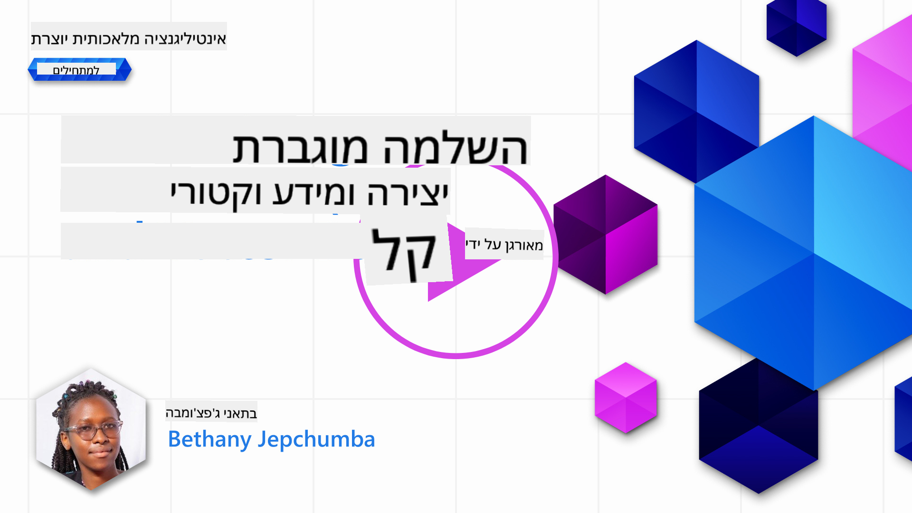
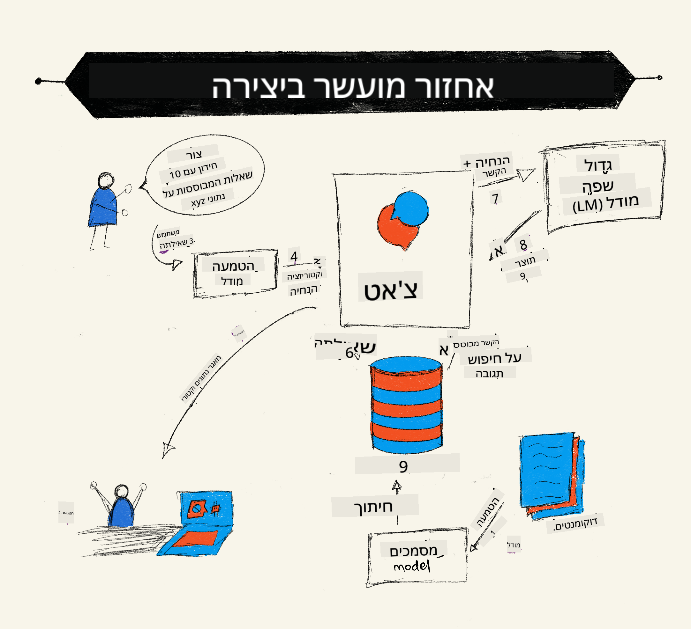
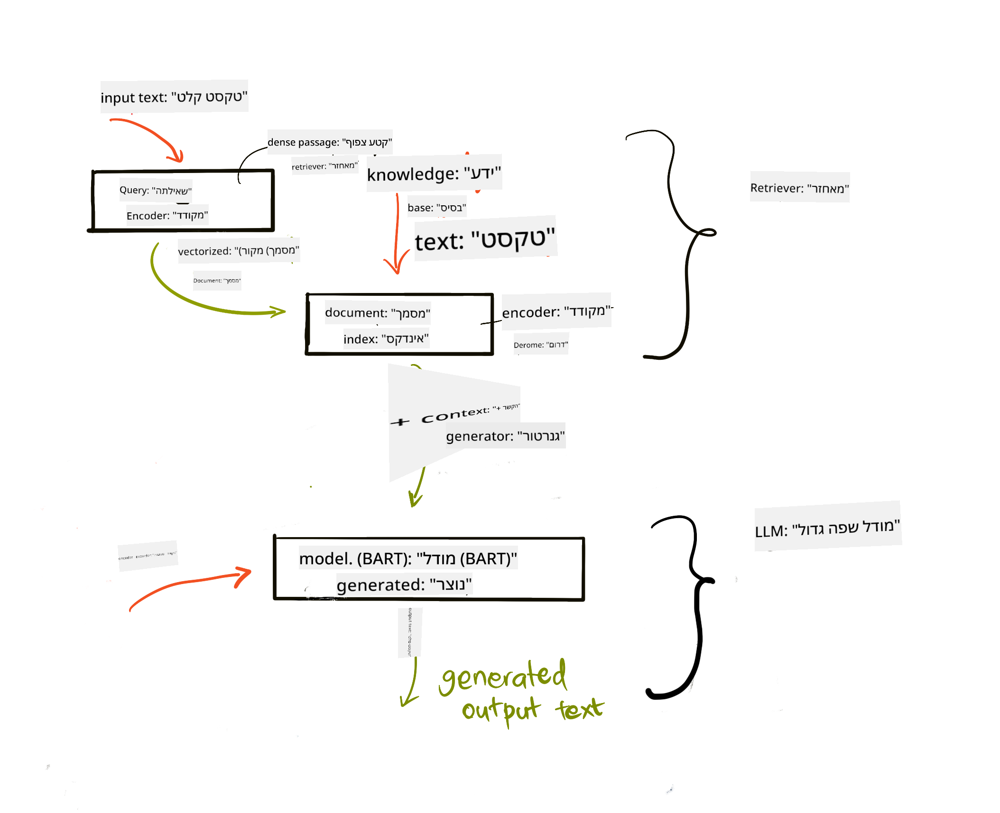
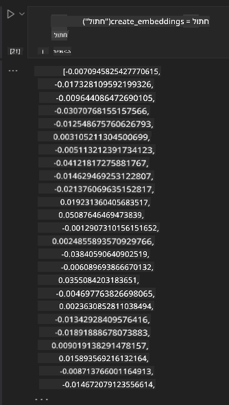

<!--
CO_OP_TRANSLATOR_METADATA:
{
  "original_hash": "e2861bbca91c0567ef32bc77fe054f9e",
  "translation_date": "2025-07-09T16:15:45+00:00",
  "source_file": "15-rag-and-vector-databases/README.md",
  "language_code": "he"
}
-->
# יצירת תוכן משופר באמצעות אחזור מידע (RAG) ומסדי נתונים וקטוריים

[](https://aka.ms/gen-ai-lesson15-gh?WT.mc_id=academic-105485-koreyst)

בשיעור על יישומי חיפוש למדנו בקצרה כיצד לשלב את הנתונים האישיים שלך במודלים לשוניים גדולים (LLMs). בשיעור זה נעמיק במושג של עיגון הנתונים שלך באפליקציית ה-LLM, במכניקה של התהליך ובשיטות לאחסון נתונים, כולל גם הטמעות (embeddings) וגם טקסט.

> **וידאו יפורסם בקרוב**

## מבוא

בשיעור זה נסקור את הנושאים הבאים:

- היכרות עם RAG, מה זה ולמה משתמשים בו בבינה מלאכותית.

- הבנת מה הם מסדי נתונים וקטוריים ויצירת אחד עבור האפליקציה שלנו.

- דוגמה מעשית לשילוב RAG באפליקציה.

## מטרות הלמידה

בסיום השיעור תוכל:

- להסביר את החשיבות של RAG באחזור ועיבוד נתונים.

- להגדיר אפליקציית RAG ולעגן את הנתונים שלך ב-LLM.

- לשלב בצורה יעילה RAG ומסדי נתונים וקטוריים באפליקציות LLM.

## התרחיש שלנו: שיפור ה-LLM שלנו עם הנתונים שלנו

בשיעור זה נרצה להוסיף את ההערות שלנו לסטארטאפ חינוכי, שיאפשר לצ'אטבוט לקבל מידע נוסף על נושאים שונים. באמצעות ההערות שברשותנו, הלומדים יוכלו ללמוד טוב יותר ולהבין את הנושאים השונים, מה שיקל עליהם לחזור על החומר לקראת מבחנים. ליצירת התרחיש שלנו נשתמש ב:

- `Azure OpenAI:` ה-LLM שבו נשתמש ליצירת הצ'אטבוט שלנו

- `AI for beginners' lesson on Neural Networks`: הנתונים שעליהם נעגן את ה-LLM שלנו

- `Azure AI Search` ו-`Azure Cosmos DB:` מסד נתונים וקטורי לאחסון הנתונים וליצירת אינדקס חיפוש

המשתמשים יוכלו ליצור חידונים לתרגול מההערות שלהם, כרטיסיות סיכום ולסכם אותן לתצוגות תמציתיות. כדי להתחיל, נבחן מהו RAG וכיצד הוא פועל:

## יצירת תוכן משופר באמצעות אחזור מידע (RAG)

צ'אטבוט מבוסס LLM מעבד בקשות משתמש כדי לייצר תגובות. הוא מתוכנן להיות אינטראקטיבי ומתקשר עם המשתמשים במגוון רחב של נושאים. עם זאת, התגובות שלו מוגבלות להקשר שניתן לו ולנתוני האימון הבסיסיים שלו. לדוגמה, הידע של GPT-4 מוגבל לספטמבר 2021, כלומר הוא חסר מידע על אירועים שהתרחשו לאחר תקופה זו. בנוסף, הנתונים ששימשו לאימון ה-LLM אינם כוללים מידע חסוי כמו הערות אישיות או מדריך מוצר של חברה.

### כיצד פועלים RAG (Retrieval Augmented Generation)



נניח שברצונך לפרוס צ'אטבוט שיוצר חידונים מההערות שלך, תזדקק לחיבור לבסיס הידע. כאן RAG נכנס לתמונה. RAG פועלים כך:

- **בסיס ידע:** לפני האחזור, יש לעבד את המסמכים, בדרך כלל לפצל מסמכים גדולים לחלקים קטנים יותר, להמיר אותם להטמעות טקסט ולאחסן אותם במסד נתונים.

- **שאילתת משתמש:** המשתמש שואל שאלה

- **אחזור:** כאשר המשתמש שואל שאלה, מודל ההטמעות מאחזר מידע רלוונטי מבסיס הידע שלנו כדי לספק הקשר נוסף שישולב בבקשה.

- **יצירה משופרת:** ה-LLM משפר את תגובתו בהתבסס על הנתונים שנאספו. זה מאפשר לתגובה להיות לא רק מבוססת על נתוני האימון, אלא גם על מידע רלוונטי מההקשר שנוסף. הנתונים שנאספו משמשים להעשיר את תגובות ה-LLM. ה-LLM מחזיר תשובה לשאלת המשתמש.



הארכיטקטורה של RAG מיושמת באמצעות טרנספורמרים המורכבים משני חלקים: מקודד ופענח. לדוגמה, כאשר משתמש שואל שאלה, הטקסט הנכנס "מקודד" לווקטורים הלוכדים את משמעות המילים, והווקטורים "מפוענחים" לאינדקס המסמכים שלנו ומייצרים טקסט חדש בהתבסס על שאילתת המשתמש. ה-LLM משתמש במודל מקודד-פענח כדי לייצר את הפלט.

שתי גישות ליישום RAG לפי המאמר המוצע: [Retrieval-Augmented Generation for Knowledge intensive NLP Tasks](https://arxiv.org/pdf/2005.11401.pdf?WT.mc_id=academic-105485-koreyst) הן:

- **_RAG-Sequence_** המשתמש במסמכים שנאספו כדי לחזות את התשובה הטובה ביותר לשאילתת המשתמש

- **RAG-Token** המשתמש במסמכים כדי לייצר את הטוקן הבא, ואז לאחזר אותם כדי לענות על השאלה

### למה להשתמש ב-RAG?

- **עושר מידע:** מבטיח שהתגובות הטקסטואליות מעודכנות ועכשוויות. לכן, הוא משפר ביצועים במשימות ספציפיות לתחום על ידי גישה לבסיס הידע הפנימי.

- מפחית המצאות על ידי שימוש ב**נתונים שניתן לאמת** מבסיס הידע כדי לספק הקשר לשאילתות המשתמש.

- הוא **חסכוני** יותר בהשוואה לכיול מחדש (fine-tuning) של LLM.

## יצירת בסיס ידע

האפליקציה שלנו מבוססת על הנתונים האישיים שלנו, כלומר שיעור הרשתות העצביות בתכנית הלימודים AI For Beginners.

### מסדי נתונים וקטוריים

מסד נתונים וקטורי, בניגוד למסדי נתונים מסורתיים, הוא מסד נתונים מיוחד שנועד לאחסן, לנהל ולחפש וקטורים מוטמעים. הוא מאחסן ייצוגים מספריים של מסמכים. פירוק הנתונים להטמעות מספריות מקל על מערכת ה-AI שלנו להבין ולעבד את הנתונים.

אנו מאחסנים את ההטמעות שלנו במסדי נתונים וקטוריים כי ל-LLMs יש מגבלה על מספר הטוקנים שהם מקבלים כקלט. מאחר שאי אפשר להעביר את כל ההטמעות ל-LLM, נצטרך לפצל אותן לחלקים וכאשר משתמש שואל שאלה, ההטמעות שהכי מתאימות לשאלה יוחזרו יחד עם הבקשה. הפיצול גם מפחית עלויות במספר הטוקנים שעוברים דרך ה-LLM.

מסדי נתונים וקטוריים פופולריים כוללים את Azure Cosmos DB, Clarifyai, Pinecone, Chromadb, ScaNN, Qdrant ו-DeepLake. ניתן ליצור מודל Azure Cosmos DB באמצעות Azure CLI עם הפקודה הבאה:

```bash
az login
az group create -n <resource-group-name> -l <location>
az cosmosdb create -n <cosmos-db-name> -r <resource-group-name>
az cosmosdb list-keys -n <cosmos-db-name> -g <resource-group-name>
```

### מטקסט להטמעות

לפני שנאחסן את הנתונים, נצטרך להמיר אותם להטמעות וקטוריות לפני האחסון במסד הנתונים. אם אתה עובד עם מסמכים גדולים או טקסטים ארוכים, ניתן לפצל אותם לפי השאילתות שאתה מצפה להן. הפיצול יכול להיעשות ברמת משפט או ברמת פסקה. מכיוון שהפיצול שואב משמעות מהמילים שסביבו, ניתן להוסיף הקשר נוסף לחלק, למשל על ידי הוספת כותרת המסמך או טקסט לפני או אחרי החלק. ניתן לפצל את הנתונים כך:

```python
def split_text(text, max_length, min_length):
    words = text.split()
    chunks = []
    current_chunk = []

    for word in words:
        current_chunk.append(word)
        if len(' '.join(current_chunk)) < max_length and len(' '.join(current_chunk)) > min_length:
            chunks.append(' '.join(current_chunk))
            current_chunk = []

    # If the last chunk didn't reach the minimum length, add it anyway
    if current_chunk:
        chunks.append(' '.join(current_chunk))

    return chunks
```

לאחר הפיצול, נוכל להטמיע את הטקסט באמצעות מודלים שונים להטמעות. כמה מודלים שניתן להשתמש בהם כוללים: word2vec, ada-002 של OpenAI, Azure Computer Vision ועוד רבים. בחירת מודל תלויה בשפות שבהן אתה משתמש, סוג התוכן המקודד (טקסט/תמונות/אודיו), גודל הקלט שהמודל יכול לקודד ואורך הפלט של ההטמעות.

דוגמה לטקסט מוטמע באמצעות מודל `text-embedding-ada-002` של OpenAI היא:


## אחזור וחיפוש וקטורי

כאשר משתמש שואל שאלה, המערכת ממירה אותה לווקטור באמצעות מקודד השאילתות, ואז מחפשת באינדקס החיפוש שלנו וקטורים רלוונטיים במסמכים שקשורים לקלט. לאחר מכן, היא ממירה את הווקטור של הקלט ואת וקטורי המסמכים לטקסט ומעבירה אותם ל-LLM.

### אחזור

האחזור מתבצע כאשר המערכת מנסה למצוא במהירות את המסמכים מהאינדקס שעונים על קריטריוני החיפוש. מטרת האחזור היא לקבל מסמכים שישמשו לספק הקשר ולעגן את ה-LLM על הנתונים שלך.

ישנן מספר דרכים לבצע חיפוש במסד הנתונים שלנו, כגון:

- **חיפוש מילות מפתח** - משמש לחיפושי טקסט

- **חיפוש סמנטי** - משתמש במשמעות הסמנטית של המילים

- **חיפוש וקטורי** - ממיר מסמכים מטקסט לייצוגים וקטוריים באמצעות מודלי הטמעות. האחזור מתבצע על ידי שאילת המסמכים שהייצוג הווקטורי שלהם הקרוב ביותר לשאלת המשתמש.

- **היברידי** - שילוב של חיפוש מילות מפתח ווקטורי.

אתגר באחזור מתעורר כאשר אין תגובה דומה לשאילתה במסד הנתונים, המערכת תחזיר את המידע הטוב ביותר שיכולה להשיג, אך ניתן להשתמש בטקטיקות כמו הגדרת מרחק מקסימלי לרלוונטיות או שימוש בחיפוש היברידי שמשלב חיפוש מילות מפתח ווקטורי. בשיעור זה נשתמש בחיפוש היברידי, שילוב של חיפוש וקטורי ומילות מפתח. נאחסן את הנתונים שלנו במסגרת נתונים עם עמודות המכילות את החלקים וגם את ההטמעות.

### דמיון וקטורי

המאתר יחפש במסד הידע הטמעות הקרובות זו לזו, השכן הקרוב ביותר, שכן אלו טקסטים דומים. בתרחיש שבו משתמש שואל שאלה, היא מוטמעת תחילה ואז מותאמת להטמעות דומות. המדד הנפוץ שמשמש למדידת דמיון בין וקטורים הוא דמיון קוסינוס, המבוסס על הזווית בין שני וקטורים.

ניתן למדוד דמיון גם באמצעות חלופות אחרות כמו מרחק אוקלידי, שהוא הקו הישר בין נקודות הקצה של הווקטורים, ומכפלה סקלרית שמודדת את סכום המכפלות של האלמנטים המתאימים בשני הווקטורים.

### אינדקס חיפוש

כאשר מבצעים אחזור, יש צורך לבנות אינדקס חיפוש עבור בסיס הידע לפני ביצוע החיפוש. אינדקס יאחסן את ההטמעות שלנו ויאפשר לאחזר במהירות את החלקים הדומים ביותר גם במסד נתונים גדול. ניתן ליצור את האינדקס באופן מקומי באמצעות:

```python
from sklearn.neighbors import NearestNeighbors

embeddings = flattened_df['embeddings'].to_list()

# Create the search index
nbrs = NearestNeighbors(n_neighbors=5, algorithm='ball_tree').fit(embeddings)

# To query the index, you can use the kneighbors method
distances, indices = nbrs.kneighbors(embeddings)
```

### מיון מחדש (Re-ranking)

לאחר ששאלת את מסד הנתונים, ייתכן שתצטרך למיין את התוצאות מהכי רלוונטיות. LLM למיון מחדש משתמש בלמידת מכונה כדי לשפר את הרלוונטיות של תוצאות החיפוש על ידי סידורן מהכי רלוונטיות. באמצעות Azure AI Search, המיון מחדש מתבצע אוטומטית עבורך באמצעות ממיין סמנטי. דוגמה לאופן פעולת המיון מחדש באמצעות שכנים קרובים:

```python
# Find the most similar documents
distances, indices = nbrs.kneighbors([query_vector])

index = []
# Print the most similar documents
for i in range(3):
    index = indices[0][i]
    for index in indices[0]:
        print(flattened_df['chunks'].iloc[index])
        print(flattened_df['path'].iloc[index])
        print(flattened_df['distances'].iloc[index])
    else:
        print(f"Index {index} not found in DataFrame")
```

## שילוב הכול יחד

השלב האחרון הוא להוסיף את ה-LLM לתהליך כדי לקבל תגובות שמבוססות על הנתונים שלנו. ניתן ליישם זאת כך:

```python
user_input = "what is a perceptron?"

def chatbot(user_input):
    # Convert the question to a query vector
    query_vector = create_embeddings(user_input)

    # Find the most similar documents
    distances, indices = nbrs.kneighbors([query_vector])

    # add documents to query  to provide context
    history = []
    for index in indices[0]:
        history.append(flattened_df['chunks'].iloc[index])

    # combine the history and the user input
    history.append(user_input)

    # create a message object
    messages=[
        {"role": "system", "content": "You are an AI assistant that helps with AI questions."},
        {"role": "user", "content": history[-1]}
    ]

    # use chat completion to generate a response
    response = openai.chat.completions.create(
        model="gpt-4",
        temperature=0.7,
        max_tokens=800,
        messages=messages
    )

    return response.choices[0].message

chatbot(user_input)
```

## הערכת האפליקציה שלנו

### מדדי הערכה

- איכות התגובות המסופקות, לוודא שהן נשמעות טבעיות, שוטפות ואנושיות

- עיגון הנתונים: הערכת האם התגובה הגיעה מהמסמכים שסופקו

- רלוונטיות: הערכת התאמת התגובה לשאלה שנשאלה

- שוטפות - האם התגובה הגיונית מבחינה דקדוקית

## מקרים לשימוש ב-RAG ומסדי נתונים וקטוריים

ישנם מקרים רבים בהם קריאות לפונקציות יכולות לשפר את האפליקציה שלך, כגון:

- שאלות ותשובות: עיגון נתוני החברה שלך לצ'אט שניתן להשתמש בו על ידי עובדים לשאול שאלות.

- מערכות המלצה: יצירת מערכת שמתאימה ערכים דומים ביותר, למשל סרטים, מסעדות ועוד.

- שירותי צ'אטבוט: ניתן לאחסן היסטוריית שיחות ולהתאים אישית את השיחה בהתבסס על נתוני המשתמש.

- חיפוש תמונות מבוסס הטמעות וקטוריות, שימושי לזיהוי תמונות וזיהוי חריגות.

## סיכום

כיסינו את התחומים הבסיסיים של RAG, מהוספת הנתונים לאפליקציה, שאילתת המשתמש ועד הפלט. לפישוט יצירת RAG, ניתן להשתמש במסגרת כמו Semanti Kernel, Langchain או Autogen.

## משימה

להמשך הלמידה שלך ב-Retrieval Augmented Generation (RAG) תוכל לבנות:

- ממשק משתמש לאפליקציה באמצעות המסגרת שתבחר

- להשתמש במסגרת, בין אם LangChain או Semantic Kernel, ולשחזר את האפליקציה שלך.

ברכות על סיום השיעור 👏.

## הלמידה לא נעצרת כאן, המשך את המסע

בסיום השיעור, עיין ב[אוסף הלמידה של Generative AI](https://aka.ms/genai-collection?WT.mc_id=academic-105485-koreyst) שלנו כדי להמשיך לשפר את הידע שלך בבינה מלאכותית יוצרת!

**כתב ויתור**:  
מסמך זה תורגם באמצעות שירות תרגום מבוסס בינה מלאכותית [Co-op Translator](https://github.com/Azure/co-op-translator). למרות שאנו שואפים לדיוק, יש לקחת בחשבון כי תרגומים אוטומטיים עלולים להכיל שגיאות או אי-דיוקים. המסמך המקורי בשפת המקור שלו נחשב למקור הסמכותי. למידע קריטי מומלץ להשתמש בתרגום מקצועי על ידי מתרגם אנושי. אנו לא נושאים באחריות לכל אי-הבנה או פרשנות שגויה הנובעת משימוש בתרגום זה.