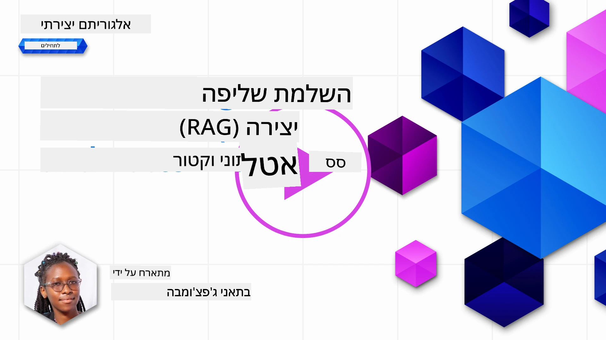
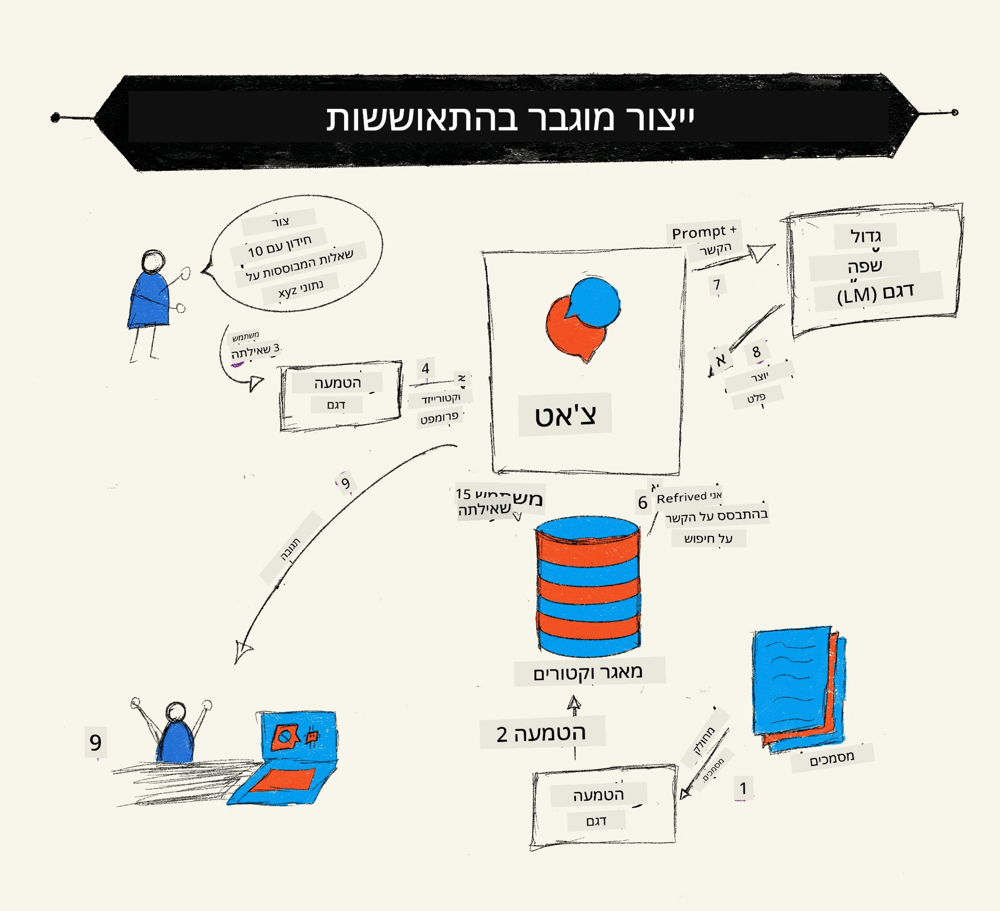
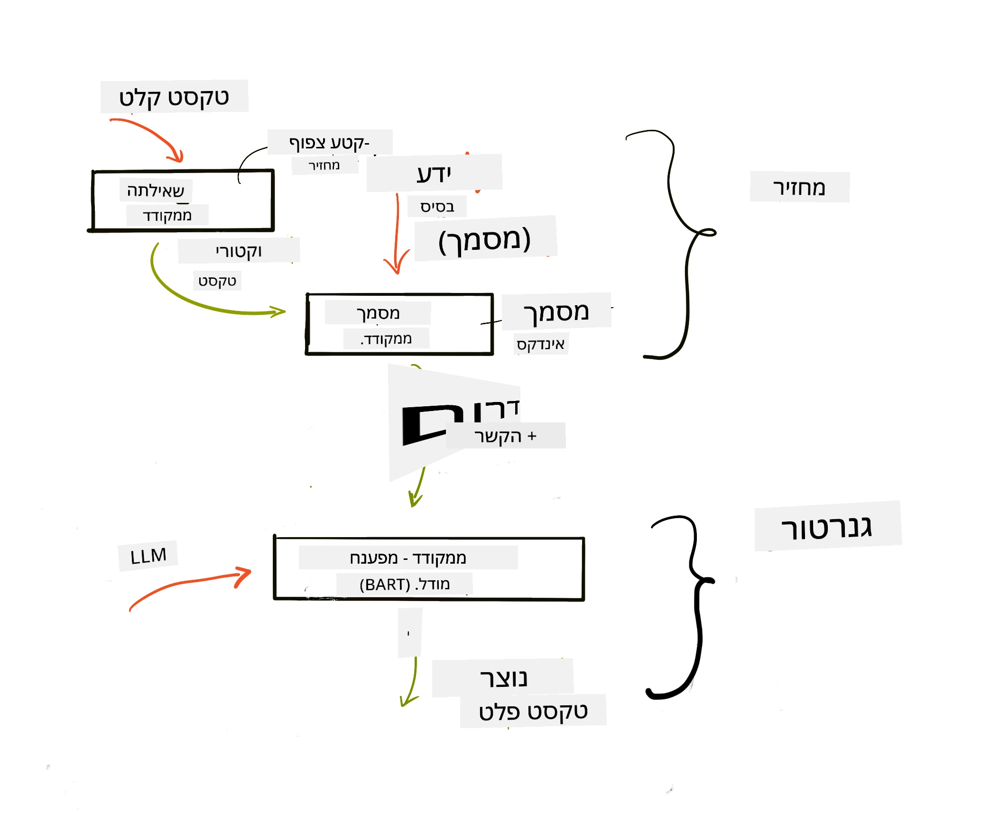
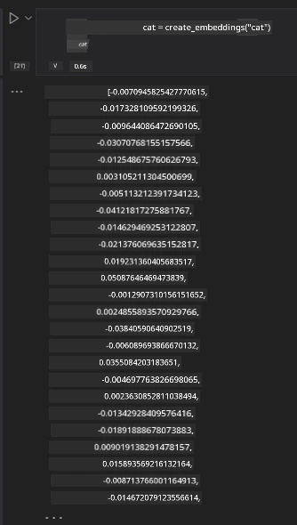

# יצירה מוגברת על ידי שליפה (RAG) ומאגרי וקטורים

[](https://youtu.be/4l8zhHUBeyI?si=BmvDmL1fnHtgQYkL)

בשיעור יישומי החיפוש למדנו בקצרה כיצד לשלב את הנתונים שלכם במודלי שפה גדולים (LLMs). בשיעור זה נעמיק עוד יותר במושגים של עיגון הנתונים באפליקציית LLM שלכם, במכניקה של התהליך ובשיטות לאחסון נתונים, כולל גם הטמעות וגם טקסט.

> **וידאו יגיע בקרוב**

## הקדמה

בשיעור זה נסקור את הנושאים הבאים:

- היכרות עם RAG, מה זה ולמה משתמשים בו בבינה מלאכותית (AI).

- הבנת מה הם מאגרי וקטורים וכיצד ליצור אחד עבור האפליקציה שלנו.

- דוגמה מעשית לאופן השילוב של RAG באפליקציה.

## מטרות הלמידה

לאחר סיום שיעור זה, תוכלו:

- להסביר את החשיבות של RAG בשליפת ועיבוד נתונים.

- להגדיר אפליקציית RAG ולעגן את הנתונים שלכם ל-LLM

- שילוב יעיל של RAG ומאגרי וקטורים באפליקציות LLM.

## התרחיש שלנו: שיפור ה-LLMs שלנו עם הנתונים שלנו

לשיעור זה, אנו רוצים להוסיף את ההערות האישיות שלנו לסטארטאפ חינוכי, המאפשר לצ'טבוט לקבל מידע נוסף על הנושאים השונים. בעזרת ההערות שיש לנו, הלומדים יוכלו ללמוד טוב יותר ולהבין את הנושאים השונים, מה שיקל עליהם לבחון למבחנים. כדי ליצור את התרחיש שלנו, נשתמש ב:

- `Azure OpenAI:` ה-LLM שנשתמש בו ליצירת הצ'טבוט שלנו

- `שיעור AI למתחילים בנושא רשתות עצביות`: זה יהיה הנתון שעליו נעגן את ה-LLM שלנו

- `Azure AI Search` ו-`Azure Cosmos DB:` מאגר וקטורים לאחסון הנתונים שלנו וליצירת אינדקס חיפוש

המשתמשים יוכלו ליצור מבחני תרגול מההערות שלהם, כרטיסיות סקירה ולסכם אותן לתצוגות מקוצרות. כדי להתחיל, בואו נסתכל מה זה RAG ואיך זה עובד:

## יצירה מוגברת על ידי שליפה (RAG)

צ'טבוט מונע על ידי LLM מעבד פקודות משתמש כדי ליצור תגובות. הוא מעוצב להיות אינטראקטיבי ומעורבב עם משתמשים על מגוון רחב של נושאים. עם זאת, התגובות שלו מוגבלות להקשר הניתן ולנתוני האימונים הבסיסיים שלו. לדוגמה, הידע של GPT-4 מוגבל לספטמבר 2021, כלומר, הוא חסר ידע על אירועים שהתרחשו לאחר תקופה זו. נוסף על כך, הנתונים בהם משתמשים לאימון LLM אינם כוללים מידע סודי כגון הערות אישיות או מדריך מוצר של חברה.

### איך RAGs (יצירה מוגברת על ידי שליפה) עובדים



נניח שאתם רוצים לפרוס צ'טבוט שיוצר שאלונים מההערות שלכם, תצטרכו חיבור לבסיס הידע. כאן RAG נכנס לפעולה. RAGs פועלים כך:

- **בסיס ידע:** לפני השליפה, יש לעבד ולפרק את המסמכים, בדרך כלל לפירוק למסמכים קטנים יותר, המרה לטקסט מוטמע ואחסון בבסיס נתונים.

- **שאילתת משתמש:** המשתמש שואל שאלה

- **שליפה:** כאשר המשתמש שואל שאלה, מודל ההטמעות שולף מידע רלוונטי מבסיס הידע שלנו כדי לספק הקשר שישולב בבקשה.

- **יצירה מוגברת:** ה-LLM משדרג את התגובה שלו בהתבסס על הנתונים שנשלפו. זה מאפשר שתגובה שנוצרה לא תהיה מבוססת רק על נתוני האימון, אלא גם על מידע רלוונטי מההקשר שנוסף. הנתונים שנשלפו משמשים לשדרוג תגובות ה-LLM. לאחר מכן ה-LLM מחזיר תשובה לשאלת המשתמש.



האדריכלות של RAGs מיושמת באמצעות טרנספורמרים הכוללים שני חלקים: מקודד ופענח. לדוגמה, כאשר משתמש שואל שאלה, הטקסט הקלט 'מקודד' לוקטורים הכוללים את משמעות המילים ווקטורים אלו 'מפוענחים' לאינדקס המסמכים שלנו ומייצרים טקסט חדש בהתבסס על שאילתת המשתמש. ה-LLM משתמש במודל מקודד-פענח ליצירת הפלט.

ישנן שתי גישות לביצוע RAG לפי המאמר המוצע: [יצירה מוגברת על ידי שליפה למשימות NLP אינטנסיביות בידע](https://arxiv.org/pdf/2005.11401.pdf?WT.mc_id=academic-105485-koreyst):

- **_RAG-Sequence_** המשתמש במסמכים שנשלפו כדי לנבא את התשובה הטובה ביותר לשאילתת משתמש

- **RAG-Token** המשתמש במסמכים ליצירת הטוקן הבא, ואז שולף אותם כדי לענות על שאלת המשתמש

### למה כדאי להשתמש ב-RAGs?

- **עושר מידע:** מבטיח שהתשובות הטקסטואליות מעודכנות ונכונות. לכן, משפר ביצועים במשימות ספציפיות לפי תחום בעזרת גישה לבסיס הידע הפנימי.

- מצמצם המצאות (fabrication) על ידי שימוש ב**נתונים שניתן לאמת** בבסיס הידע כדי לספק הקשר לשאלות המשתמשים.

- הוא **חסכוני** שכן הוא זול יותר בהשוואה לכוונון עדין של LLM

## יצירת בסיס ידע

האפליקציה שלנו מבוססת על הנתונים האישיים שלנו, כלומר, שיעור הרשת העצבית במדריך AI למתחילים.

### מאגרי וקטורים

מאגר וקטורים, בניגוד למאגרים מסורתיים, הוא מאגר נתונים מיוחד שנועד לאחסן, לנהל ולחפש וקטורי הטמעות. הוא מאחסן ייצוגים מספריים של מסמכים. פירוק נתונים להטמעות מספריות מקל על מערכת ה-AI שלנו להבין ולעבד את הנתונים.

אנו מאחסנים את ההטמעות שלנו במאגרים וקטוריים כי ל-LLMs יש גבול למספר הטוקנים אותם הם מקבלים כקלט. מאחר שאי אפשר להעביר את כל ההטמעות ל-LLM, נצטרך לפרק אותן לחלקים וכאשר המשתמש שואל שאלה, ההטמעות הקרובות ביותר אליה יוחזרו יחד עם הבקשה. פירוק לחלקים גם מפחית עלויות על מספר הטוקנים המועברים דרך LLM.

כמה ממאגרים וקטוריים פופולריים הם Azure Cosmos DB, Clarifyai, Pinecone, Chromadb, ScaNN, Qdrant ו-DeepLake. ניתן ליצור מודל Azure Cosmos DB באמצעות Azure CLI באמצעות הפקודה הבאה:

```bash
az login
az group create -n <resource-group-name> -l <location>
az cosmosdb create -n <cosmos-db-name> -r <resource-group-name>
az cosmosdb list-keys -n <cosmos-db-name> -g <resource-group-name>
```

### מטקסט להטמעות

לפני שנאחסן את הנתונים, נצטרך להמירם להטמעות וקטוריות לפני האחסון בבסיס הנתונים. אם אתם עובדים עם מסמכים גדולים או טקסטים ארוכים, ניתן לפרק אותם לפי השאילתות שאתם מצפים להם. פילוח יכול להתבצע ברמת משפט או ברמת פסקה. מאחר שפילוח שואב משמעות מהמילים סביב, ניתן להוסיף הקשר לחלק, למשל, על ידי הוספת כותרת המסמך או כלול טקסט לפני או אחרי החלק. ניתן לפרק את הנתונים כך:

```python
def split_text(text, max_length, min_length):
    words = text.split()
    chunks = []
    current_chunk = []

    for word in words:
        current_chunk.append(word)
        if len(' '.join(current_chunk)) < max_length and len(' '.join(current_chunk)) > min_length:
            chunks.append(' '.join(current_chunk))
            current_chunk = []

    # אם הקטע האחרון לא הגיע לאורך המינימלי, הוסף אותו בכל מקרה
    if current_chunk:
        chunks.append(' '.join(current_chunk))

    return chunks
```

לאחר הפילוח, נוכל להטמיע את הטקסט באמצעות דגמי הטמעות שונים. בין הדגמים שניתן להשתמש בהם: word2vec, ada-002 של OpenAI, Azure Computer Vision ועוד רבים. בחירת מודל תתבסס על השפות בהן אתם משתמשים, סוג התוכן המקודד (טקסט/תמונות/אודיו), גודל הקלט אותו ניתן לקודד ואורך הפלט של ההטמעה.

דוגמה להטמעת טקסט באמצעות מודל `text-embedding-ada-002` של OpenAI היא:


## שליפה וחיפוש וקטורי

כאשר משתמש שואל שאלה, המאתר ממיר אותה לוקטור באמצעות מקודד השאילתה, ואז מחפש באינדקס החיפוש שלנו וקטורים רלוונטיים במסמכים הקשורים לקלט. לאחר מכן הוא ממיר גם את וקטור הקלט וגם את וקטורי המסמכים לטקסט ומעבירם דרך ה-LLM.

### שליפה

שליפה מתבצעת כאשר המערכת מנסה במהירות לאתר את המסמכים מהאינדקס העונים לקריטריוני החיפוש. מטרת המאתר היא להשיג מסמכים שישמשו לספק הקשר ולעגן את ה-LLM על הנתונים שלכם.

קיימות מספר דרכים לבצע חיפוש בתוך מאגר הנתונים שלנו כגון:

- **חיפוש מילות מפתח** - משמש לחיפושי טקסט

- **חיפוש וקטורי** - ממיר מסמכים מטקסט לייצוגים וקטוריים באמצעות דגמי הטמעות, ומאפשר **חיפוש סמנטי** באמצעות משמעות המילים. השליפה תתבצע על ידי שאילת מסמכים שהייצוג הוקטורי שלהם קרוב ביותר לשאלת המשתמש.

- **השילוב** - שילוב של חיפוש מילות מפתח וחיפוש וקטורי.

אתגר בשליפה מתעורר כאשר אין תגובה דומה לשאילתה בבסיס הנתונים, אז המערכת תחזיר את המידע הטוב ביותר שיכולה להשיג, עם זאת, ניתן להשתמש בטקטיקות כמו הגדרת מרחק מקסימלי לרלוונטיות או שימוש בחיפוש משולב המשלב מילות מפתח ווקטורים. בשיעור זה נשתמש בחיפוש משולב, שילוב של חיפוש וקטורי ומילות מפתח. נאחסן את המידע שלנו במסגרת נתונים עם עמודות שמכילות את החלקים כמו גם את ההטמעות.

### דמיון וקטורי

המאחד יחפש במאגר הידע הטמעות שהן קרובות אחת לשנייה, השכן הקרוב ביותר, שכן אלו טקסטים דומים. בתרחיש בו המשתמש שואל שאלה, היא תחילה מוטמעת ואז תתאים לה הטמעות דומות. המדידה המקובלת להשוואת דמיון בין וקטורים שונים היא הדמיון הקוסינוסי המבוסס על הזווית בין שני וקטורים.

אנו יכולים למדוד דמיון באמצעות חלופות אחרות כגון מרחק אוקלידי שהוא הקו הישר בין נקודות קצה של וקטורים, ומכפלה סקלרית שמודדת את סכום מכפלות הרכיבים המתאימים בשני הוקטורים.

### אינדקס חיפוש

בעת ביצוע שליפה, נצטרך לבנות אינדקס חיפוש עבור בסיס הידע שלנו לפני ביצוע החיפוש. אינדקס יאחסן את ההטמעות שלנו ויוכל לשלוף במהירות את החלקים הדומים ביותר גם במאגר מידע גדול. נוכל ליצור את האינדקס שלנו מקומית באמצעות:

```python
from sklearn.neighbors import NearestNeighbors

embeddings = flattened_df['embeddings'].to_list()

# צור את אינדקס החיפוש
nbrs = NearestNeighbors(n_neighbors=5, algorithm='ball_tree').fit(embeddings)

# כדי לשאול את האינדקס, ניתן להשתמש בשיטת kneighbors
distances, indices = nbrs.kneighbors(embeddings)
```

### דירוג מחדש

לאחר ששאלתם את בסיס הנתונים, ייתכן ותצטרכו למיין את התוצאות לפי הרלוונטיות הגבוהה ביותר. LLM מדרג מחדש משתמש בלמידת מכונה לשפר את רלוונטיות תוצאות החיפוש על ידי סידור מהכי רלוונטי. באמצעות Azure AI Search, הדירוג מחודש נעשה אוטומטית עבורכם בעזרת דירוג סמנטי מחדש. דוגמה לאופן פעולת הדירוג מחדש באמצעות שכנים קרובים:

```python
# מצא את המסמכים הכי דומים
distances, indices = nbrs.kneighbors([query_vector])

index = []
# הדפס את המסמכים הכי דומים
for i in range(3):
    index = indices[0][i]
    for index in indices[0]:
        print(flattened_df['chunks'].iloc[index])
        print(flattened_df['path'].iloc[index])
        print(flattened_df['distances'].iloc[index])
    else:
        print(f"Index {index} not found in DataFrame")
```

## סיכום

הצעד האחרון הוא להוסיף את ה-LLM לתמונה כדי לקבל תגובות המעוגנות בנתונים שלנו. ניתן ליישם זאת כך:

```python
user_input = "what is a perceptron?"

def chatbot(user_input):
    # המר את השאלה לווקטור שאילתה
    query_vector = create_embeddings(user_input)

    # מצא את המסמכים הדומים ביותר
    distances, indices = nbrs.kneighbors([query_vector])

    # הוסף מסמכים לשאילתה כדי לספק הקשר
    history = []
    for index in indices[0]:
        history.append(flattened_df['chunks'].iloc[index])

    # שלב את ההיסטוריה ואת כניסת המשתמש
    history.append(user_input)

    # צור אובייקט הודעה
    messages=[
        {"role": "system", "content": "You are an AI assistant that helps with AI questions."},
        {"role": "user", "content": "\n\n".join(history) }
    ]

    # השתמש ב-API של Responses כדי ליצור תגובה
    response = client.responses.create(
        model="gpt-4o-mini",
        temperature=0.7,
        max_output_tokens=800,
        input=messages,
        store=False,
    )

    return response.output_text

chatbot(user_input)
```

## הערכת האפליקציה שלנו

### מדדי הערכה

- איכות התגובות שסופקו - להבטיח שהן נשמעות טבעיות, שוטפות ובנות אדם

- עיגון הנתונים: הערכת האם התגובה נובעת מהמסמכים שסופקו

- רלוונטיות: הערכת התאמת התגובה והקשר לשאלה שנשאלה

- שוטפות - האם התגובה הגיונית מבחינה דקדוקית

## מקרים לשימוש ב-RAG ומאגרי וקטורים

קיימים שימושים רבים ושונים שבהם קריאות לפונקציות יכולות לשפר את האפליקציה שלכם, כגון:

- שאלות ותשובות: עיגון נתוני החברה שלכם לצ'ט שניתן להשתמש בו על ידי עובדים לשאילת שאלות.

- מערכות המלצה: שם ניתן ליצור מערכת המתאימה ערכים דומים ביותר, למשל סרטים, מסעדות ועוד רבים.

- שירותי צ'טבוט: ניתן לאחסן היסטוריית שיחה ולהתאים את השיחה באופן אישי בהתבסס על נתוני המשתמש.

- חיפוש תמונות מבוסס הטמעות וקטוריות, שימושי בזיהוי תמונות וזיהוי חריגות.

## סיכום

סקרנו את היסודות של RAG מהוספת הנתונים לאפליקציה, השאילתה של המשתמש והפלט. כדי לפשט את יצירת ה-RAG, ניתן להשתמש במסגרת כמו Semantic Kernel, Langchain או Autogen.

## משימה

כדי להמשיך את הלמידה שלכם בנושא יצירה מוגברת על ידי שליפה (RAG), תוכלו לבנות:

- לבנות ממשק קדמי לאפליקציה באמצעות המסגרת לבחירתכם

- לנצל מסגרת, בין אם LangChain או Semantic Kernel, ולשחזר את האפליקציה שלכם.

מזל טוב על סיום השיעור 👏.

## הלמידה לא נגמרת כאן, המשיכו במסע

לאחר סיום שיעור זה, עיינו ב-[אוסף הלמידה שלנו על AI גנרטיבי](https://aka.ms/genai-collection?WT.mc_id=academic-105485-koreyst) כדי להמשיך ולשדרג את הידע שלכם בבינה מלאכותית גנרטיבית!

---

<!-- CO-OP TRANSLATOR DISCLAIMER START -->
**כתב ויתור**:
מסמך זה תורגם באמצעות שירות תרגום אוטומטי [Co-op Translator](https://github.com/Azure/co-op-translator). למרות שאנו שואפים לדיוק, יש לקחת בחשבון שתרגומים אוטומטיים עלולים להכיל שגיאות או אי-דיוקים. יש להחשיב את המסמך המקורי בשפתו הטבעית כמקור הסמכות. למידע קריטי מומלץ להשתמש בתרגום מקצועי על ידי מתרגם אדם. אנו לא אחראים לכל אי-הבנה או פירוש שגוי הנובע מהשימוש בתרגום זה.
<!-- CO-OP TRANSLATOR DISCLAIMER END -->