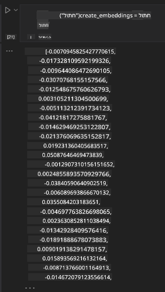

<!--
CO_OP_TRANSLATOR_METADATA:
{
  "original_hash": "e2861bbca91c0567ef32bc77fe054f9e",
  "translation_date": "2025-06-25T22:38:03+00:00",
  "source_file": "15-rag-and-vector-databases/README.md",
  "language_code": "he"
}
-->
# אחזור מוגבר יצירה (RAG) ומאגרי נתונים וקטוריים

בשיעור על יישומי חיפוש, למדנו בקצרה כיצד לשלב את הנתונים שלך במודלים של שפה גדולה (LLMs). בשיעור זה, נעמיק במושגים של עיגון הנתונים שלך ביישום ה-LLM שלך, במכניקת התהליך ובשיטות לאחסון נתונים, כולל הן הטמעות והן טקסט.

> **וידאו יגיע בקרוב**

## מבוא

בשיעור זה נסקור את הדברים הבאים:

- מבוא ל-RAG, מה זה ולמה משתמשים בו בבינה מלאכותית.

- הבנת מה הם מאגרי נתונים וקטוריים ויצירת אחד ליישום שלנו.

- דוגמה מעשית כיצד לשלב RAG ביישום.

## מטרות למידה

לאחר השלמת השיעור, תוכלו:

- להסביר את חשיבות ה-RAG באחזור ועיבוד נתונים.

- להקים יישום RAG ולעגן את הנתונים שלך ל-LLM

- שילוב יעיל של RAG ומאגרי נתונים וקטוריים ביישומי LLM.

## התרחיש שלנו: שיפור ה-LLMs שלנו עם הנתונים שלנו

לשיעור זה, אנחנו רוצים להוסיף את ההערות שלנו לסטארט-אפ החינוכי, שמאפשר לצ'אטבוט לקבל יותר מידע על נושאים שונים. באמצעות ההערות שיש לנו, הלומדים יוכלו ללמוד טוב יותר ולהבין את הנושאים השונים, מה שמקל עליהם לחזור על החומר לקראת הבחינות שלהם. כדי ליצור את התרחיש שלנו, נשתמש ב:

- `Azure OpenAI:` ה-LLM שנשתמש בו כדי ליצור את הצ'אטבוט שלנו

- `AI for beginners' lesson on Neural Networks`: זה יהיה הנתונים שעליהם נעגן את ה-LLM שלנו

- `Azure AI Search` ו-`Azure Cosmos DB:` מאגר נתונים וקטורי לאחסון הנתונים שלנו וליצירת אינדקס חיפוש

משתמשים יוכלו ליצור מבחני תרגול מההערות שלהם, כרטיסי חזרה ולסכם אותם לתצוגות כלליות תמציתיות. כדי להתחיל, בואו נבין מהו RAG וכיצד הוא פועל:

## אחזור מוגבר יצירה (RAG)

צ'אטבוט המופעל על ידי LLM מעבד הנחיות משתמש כדי ליצור תגובות. הוא מתוכנן להיות אינטראקטיבי ומתקשר עם משתמשים במגוון רחב של נושאים. עם זאת, תגובותיו מוגבלות להקשר שניתן לו ולנתוני ההדרכה הבסיסיים שלו. לדוגמה, גבול הידע של GPT-4 הוא ספטמבר 2021, כלומר, הוא חסר ידע על אירועים שהתרחשו לאחר תקופה זו. בנוסף, הנתונים המשמשים לאימון LLMs אינם כוללים מידע חסוי כמו הערות אישיות או מדריך מוצר של חברה.

### כיצד פועלים RAGs (אחזור מוגבר יצירה)

נניח שברצונך לפרוס צ'אטבוט שיוצר מבחנים מההערות שלך, תצטרך חיבור לבסיס הידע. כאן נכנס לתמונה ה-RAG. RAGs פועלים כך:

- **בסיס ידע:** לפני האחזור, יש לעבד את המסמכים הללו, לרוב על ידי פירוק מסמכים גדולים לחלקים קטנים יותר, המרתם להטמעות טקסט ואחסונם במאגר נתונים.

- **שאילתת משתמש:** המשתמש שואל שאלה

- **אחזור:** כאשר המשתמש שואל שאלה, מודל ההטמעה מאחזר מידע רלוונטי מבסיס הידע שלנו כדי לספק יותר הקשר שישולב בהנחיה.

- **יצירה מוגברת:** ה-LLM משפר את תגובתו בהתבסס על הנתונים שהושגו. הוא מאפשר לתגובה שנוצרה להיות לא רק מבוססת על נתונים מאומנים מראש אלא גם על מידע רלוונטי מההקשר שנוסף. הנתונים שהושגו משמשים להגדלת תגובות ה-LLM. ה-LLM מחזיר אז תשובה לשאלת המשתמש.

הארכיטקטורה של RAGs מיושמת באמצעות טרנספורמרים המורכבים משני חלקים: מקודד ומפענח. לדוגמה, כאשר משתמש שואל שאלה, הטקסט הנכנס 'מקודד' לווקטורים שתופסים את משמעות המילים והווקטורים 'מפוענחים' לאינדקס המסמכים שלנו ומייצרים טקסט חדש בהתבסס על שאילתת המשתמש. ה-LLM משתמש במודל מקודד-מפענח כדי ליצור את הפלט.

שתי גישות בעת יישום RAG לפי המאמר המוצע: [אחזור מוגבר יצירה למשימות עיבוד שפה טבעית (NLP)](https://arxiv.org/pdf/2005.11401.pdf?WT.mc_id=academic-105485-koreyst) הן:

- **_RAG-Sequence_** שימוש במסמכים שהושגו כדי לנבא את התשובה הטובה ביותר לשאילתת משתמש

- **RAG-Token** שימוש במסמכים ליצירת הטוקן הבא, ואז אחזורם כדי לענות על שאילתת המשתמש

### למה להשתמש ב-RAGs?

- **עושר מידע:** מבטיח תגובות טקסט עדכניות ועדכניות. זה משפר ביצועים במשימות ספציפיות לתחום על ידי גישה לבסיס הידע הפנימי.

- מפחית זיוף על ידי שימוש ב**נתונים שניתן לאמת** בבסיס הידע כדי לספק הקשר לשאילתות המשתמשים.

- זה **חסכוני** מכיוון שהם כלכליים יותר בהשוואה לכוונון עדין של LLM

## יצירת בסיס ידע

היישום שלנו מבוסס על הנתונים האישיים שלנו, כלומר, השיעור על רשתות עצביות בתכנית הלימודים של AI למתחילים.

### מאגרי נתונים וקטוריים

מאגר נתונים וקטורי, בניגוד למאגרי נתונים מסורתיים, הוא מאגר נתונים מיוחד המיועד לאחסן, לנהל ולחפש וקטורים מוטמעים. הוא מאחסן ייצוגים מספריים של מסמכים. פירוק נתונים להטמעות מספריות מקל על מערכת ה-AI שלנו להבין ולעבד את הנתונים.

אנו מאחסנים את ההטמעות שלנו במאגרי נתונים וקטוריים מכיוון של-LLMs יש מגבלה על מספר הטוקנים שהם מקבלים כקלט. מכיוון שאינך יכול להעביר את כל ההטמעות ל-LLM, נצטרך לפרק אותן לחלקים וכאשר משתמש שואל שאלה, ההטמעות הדומות ביותר לשאלה יוחזרו יחד עם ההנחיה. פירוק גם מפחית עלויות על מספר הטוקנים שעוברים דרך LLM.

כמה מאגרי נתונים וקטוריים פופולריים כוללים את Azure Cosmos DB, Clarifyai, Pinecone, Chromadb, ScaNN, Qdrant ו-DeepLake. ניתן ליצור מודל Azure Cosmos DB באמצעות Azure CLI עם הפקודה הבאה:

```bash
az login
az group create -n <resource-group-name> -l <location>
az cosmosdb create -n <cosmos-db-name> -r <resource-group-name>
az cosmosdb list-keys -n <cosmos-db-name> -g <resource-group-name>
```

### מטקסט להטמעות

לפני שנאחסן את הנתונים שלנו, נצטרך להמיר אותם להטמעות וקטוריות לפני שהם יאוחסנו במאגר הנתונים. אם אתה עובד עם מסמכים גדולים או טקסטים ארוכים, תוכל לפרק אותם על בסיס שאילתות שאתה מצפה להן. פירוק יכול להיעשות ברמת המשפט או ברמת הפסקה. מכיוון שפירוק נובע ממשמעות המילים סביבם, תוכל להוסיף הקשר נוסף לחלק, למשל, על ידי הוספת כותרת המסמך או הוספת טקסט לפני או אחרי החלק. ניתן לפרק את הנתונים כך:

```python
def split_text(text, max_length, min_length):
    words = text.split()
    chunks = []
    current_chunk = []

    for word in words:
        current_chunk.append(word)
        if len(' '.join(current_chunk)) < max_length and len(' '.join(current_chunk)) > min_length:
            chunks.append(' '.join(current_chunk))
            current_chunk = []

    # If the last chunk didn't reach the minimum length, add it anyway
    if current_chunk:
        chunks.append(' '.join(current_chunk))

    return chunks
```

לאחר הפירוק, נוכל להטמיע את הטקסט שלנו באמצעות מודלים שונים של הטמעות. כמה מודלים שניתן להשתמש בהם כוללים: word2vec, ada-002 על ידי OpenAI, Azure Computer Vision ועוד רבים. בחירת המודל לשימוש תלויה בשפות שאתה משתמש בהן, סוג התוכן המקודד (טקסט/תמונות/אודיו), גודל הקלט שהוא יכול לקודד ואורך פלט ההטמעה.

דוגמה לטקסט מוטמע באמצעות המודל `text-embedding-ada-002` של OpenAI היא:


## אחזור וחיפוש וקטורי

כאשר משתמש שואל שאלה, המחפש ממיר אותה לווקטור באמצעות מקודד השאילתה, ולאחר מכן מחפש באינדקס החיפוש של המסמכים שלנו וקטורים רלוונטיים במסמך הקשורים לקלט. לאחר סיום, הוא ממיר גם את וקטור הקלט וגם את וקטורי המסמך לטקסט ומעביר אותם דרך ה-LLM.

### אחזור

אחזור מתרחש כאשר המערכת מנסה למצוא במהירות את המסמכים מהאינדקס שעונים על קריטריוני החיפוש. מטרת המחפש היא להשיג מסמכים שישמשו לספק הקשר ולעגן את ה-LLM על הנתונים שלך.

ישנן מספר דרכים לבצע חיפוש בתוך מאגר הנתונים שלנו כגון:

- **חיפוש לפי מילות מפתח** - משמש לחיפושי טקסט

- **חיפוש סמנטי** - משתמש במשמעות הסמנטית של מילים

- **חיפוש וקטורי** - ממיר מסמכים מ

 טקסט לייצוגי וקטור באמצעות מודלים להטמעות. האחזור יתבצע על ידי שאילתת המסמכים שייצוגי הווקטור שלהם הם הקרובים ביותר לשאלת המשתמש.

- **היברידי** - שילוב של חיפוש לפי מילות מפתח וחיפוש וקטורי.

אתגר עם האחזור מתרחש כאשר אין תגובה דומה לשאילתה במאגר הנתונים, המערכת תחזיר את המידע הטוב ביותר שהיא יכולה להשיג, עם זאת, ניתן להשתמש בטקטיקות כמו הגדרת המרחק המרבי לרלוונטיות או שימוש בחיפוש היברידי שמשלב גם מילות מפתח וגם חיפוש וקטורי. בשיעור זה נשתמש בחיפוש היברידי, שילוב של חיפוש וקטורי ומילות מפתח. נאחסן את הנתונים שלנו במסגרת נתונים עם עמודות המכילות את החלקים וכן את ההטמעות.

### דמיון וקטורי

המחפש יחפש בבסיס הידע הטמעות שהן קרובות זו לזו, השכן הקרוב ביותר, מכיוון שהן טקסטים דומים. בתרחיש שבו משתמש שואל שאילתה, היא מוטמעת תחילה ואז מותאמת להטמעות דומות. המדידה הנפוצה שמשמשת למציאת הדמיון בין וקטורים שונים היא דמיון קוסינוס המבוסס על הזווית בין שני וקטורים.

אנו יכולים למדוד דמיון באמצעות חלופות אחרות שניתן להשתמש בהן, כמו מרחק אוקלידי שהוא הקו הישר בין נקודות קצה של וקטורים ומכפלה נקודתית שמודדת את סכום מכפלות האלמנטים המתאימים של שני וקטורים.

### אינדקס חיפוש

כאשר מבצעים אחזור, נצטרך לבנות אינדקס חיפוש עבור בסיס הידע שלנו לפני שנבצע חיפוש. אינדקס יאחסן את ההטמעות שלנו ויוכל לאחזר במהירות את החלקים הדומים ביותר אפילו במאגר נתונים גדול. ניתן ליצור את האינדקס שלנו באופן מקומי באמצעות:

```python
from sklearn.neighbors import NearestNeighbors

embeddings = flattened_df['embeddings'].to_list()

# Create the search index
nbrs = NearestNeighbors(n_neighbors=5, algorithm='ball_tree').fit(embeddings)

# To query the index, you can use the kneighbors method
distances, indices = nbrs.kneighbors(embeddings)
```

### דירוג מחדש

לאחר ששאלת את מאגר הנתונים, ייתכן שתצטרך למיין את התוצאות מהכי רלוונטי. LLM לדירוג מחדש מנצל למידת מכונה כדי לשפר את הרלוונטיות של תוצאות החיפוש על ידי סידורן מהכי רלוונטי. באמצעות חיפוש AI של Azure, הדירוג מחדש מתבצע אוטומטית עבורך באמצעות דירוג מחדש סמנטי. דוגמה לאופן שבו דירוג מחדש פועל באמצעות שכנים קרובים:

```python
# Find the most similar documents
distances, indices = nbrs.kneighbors([query_vector])

index = []
# Print the most similar documents
for i in range(3):
    index = indices[0][i]
    for index in indices[0]:
        print(flattened_df['chunks'].iloc[index])
        print(flattened_df['path'].iloc[index])
        print(flattened_df['distances'].iloc[index])
    else:
        print(f"Index {index} not found in DataFrame")
```

## מביאים הכל יחד

השלב האחרון הוא להוסיף את ה-LLM שלנו לתערובת כדי להיות מסוגל לקבל תגובות המעוגנות בנתונים שלנו. ניתן ליישם זאת כך:

```python
user_input = "what is a perceptron?"

def chatbot(user_input):
    # Convert the question to a query vector
    query_vector = create_embeddings(user_input)

    # Find the most similar documents
    distances, indices = nbrs.kneighbors([query_vector])

    # add documents to query  to provide context
    history = []
    for index in indices[0]:
        history.append(flattened_df['chunks'].iloc[index])

    # combine the history and the user input
    history.append(user_input)

    # create a message object
    messages=[
        {"role": "system", "content": "You are an AI assistant that helps with AI questions."},
        {"role": "user", "content": history[-1]}
    ]

    # use chat completion to generate a response
    response = openai.chat.completions.create(
        model="gpt-4",
        temperature=0.7,
        max_tokens=800,
        messages=messages
    )

    return response.choices[0].message

chatbot(user_input)
```

## הערכת היישום שלנו

### מדדי הערכה

- איכות התגובות המסופקות, לוודא שהן נשמעות טבעיות, שוטפות ודומות לאדם

- עיגון הנתונים: הערכה האם התגובה הגיעה מהמסמכים שסופקו

- רלוונטיות: הערכה האם התגובה תואמת וקשורה לשאלה שנשאלה

- שוטפות - האם התגובה הגיונית מבחינה דקדוקית

## מקרים לשימוש ב-RAG (אחזור מוגבר יצירה) ומאגרי נתונים וקטוריים

ישנם מקרים רבים ושונים שבהם קריאות פונקציה יכולות לשפר את האפליקציה שלך כמו:

- שאלות ותשובות: עיגון נתוני החברה שלך לצ'אט שיכול לשמש את העובדים לשאול שאלות.

- מערכות המלצה: שבהן ניתן ליצור מערכת שמתאימה לערכים הדומים ביותר, למשל, סרטים, מסעדות ועוד.

- שירותי צ'אטבוט: ניתן לאחסן היסטוריית צ'אט ולהתאים אישית את השיחה על בסיס נתוני המשתמש.

- חיפוש תמונות המבוסס על הטמעות וקטוריות, שימושי בעת זיהוי תמונות וגילוי חריגות.

## סיכום

כיסינו את התחומים הבסיסיים של RAG מהוספת הנתונים שלנו ליישום, השאילתה של המשתמש והפלט. כדי לפשט את יצירת ה-RAG, ניתן להשתמש במסגרות כגון Semanti Kernel, Langchain או Autogen.

## משימה

כדי להמשיך ללמוד על אחזור מוגבר יצירה (RAG) תוכל לבנות:

- לבנות חזית ליישום באמצעות המסגרת שתבחר

- לנצל מסגרת, או LangChain או Semantic Kernel, וליצור מחדש את היישום שלך.

ברכות על השלמת השיעור 👏.

## הלמידה לא עוצרת כאן, המשיכו במסע

לאחר השלמת השיעור, בדוק את [אוסף הלמידה של AI יצירתי](https://aka.ms/genai-collection?WT.mc_id=academic-105485-koreyst) שלנו כדי להמשיך לשדרג את הידע שלך ב-AI יצירתי!

**כתב ויתור**:  
מסמך זה תורגם באמצעות שירות תרגום AI [Co-op Translator](https://github.com/Azure/co-op-translator). בעוד אנו שואפים לדיוק, יש להיות מודעים לכך שתרגומים אוטומטיים עשויים להכיל שגיאות או אי-דיוקים. המסמך המקורי בשפתו המקורית צריך להיחשב כמקור הסמכותי. עבור מידע קריטי, מומלץ להשתמש בתרגום אנושי מקצועי. אנו לא אחראים לכל אי הבנה או פרשנות שגויה הנובעות מהשימוש בתרגום זה.