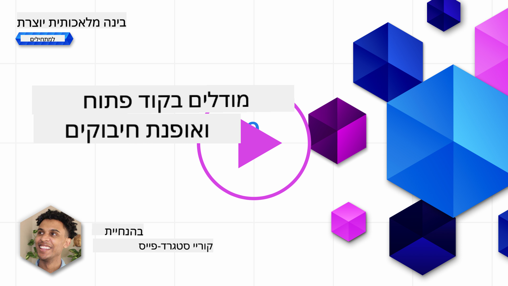
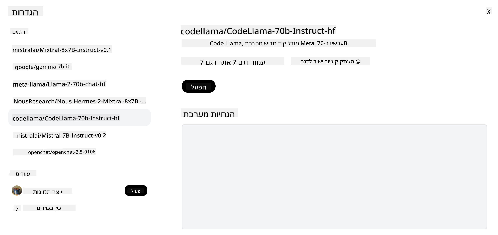

<!--
CO_OP_TRANSLATOR_METADATA:
{
  "original_hash": "0bba96e53ab841d99db731892a51fab8",
  "translation_date": "2025-07-09T17:12:06+00:00",
  "source_file": "16-open-source-models/README.md",
  "language_code": "he"
}
-->

## מבוא

עולם ה-LLM בקוד פתוח מרגש ומתפתח כל הזמן. השיעור הזה נועד לספק מבט מעמיק על מודלים בקוד פתוח. אם אתם מחפשים מידע על השוואה בין מודלים קנייניים למודלים בקוד פתוח, עברו לשיעור ["Exploring and Comparing Different LLMs"](../02-exploring-and-comparing-different-llms/README.md?WT.mc_id=academic-105485-koreyst). שיעור זה יעסוק גם בנושא ה-fine-tuning, אך הסבר מפורט יותר ניתן למצוא בשיעור ["Fine-Tuning LLMs"](../18-fine-tuning/README.md?WT.mc_id=academic-105485-koreyst).

## מטרות הלמידה

- להבין את עולם המודלים בקוד פתוח  
- להבין את היתרונות בעבודה עם מודלים בקוד פתוח  
- להכיר את המודלים הפתוחים הזמינים ב-Hugging Face וב-Azure AI Studio  

## מה הם מודלים בקוד פתוח?

תוכנה בקוד פתוח שיחקה תפקיד מרכזי בהתפתחות הטכנולוגיה בתחומים שונים. ה-Open Source Initiative (OSI) הגדיר [10 קריטריונים לתוכנה](https://web.archive.org/web/20241126001143/https://opensource.org/osd?WT.mc_id=academic-105485-koreyst) כדי שתסווג כקוד פתוח. קוד המקור חייב להיות משותף באופן גלוי תחת רישיון שאושר על ידי OSI.

בעוד שפיתוח LLMs כולל אלמנטים דומים לפיתוח תוכנה, התהליך אינו זהה במדויק. הדבר עורר דיון רב בקהילה לגבי ההגדרה של קוד פתוח בהקשר של LLMs. כדי שמודל ייחשב תואם להגדרה המסורתית של קוד פתוח, המידע הבא צריך להיות זמין לציבור:

- מערכי הנתונים ששימשו לאימון המודל  
- משקלי המודל המלאים כחלק מהאימון  
- קוד ההערכה  
- קוד ה-fine-tuning  
- משקלי המודל המלאים ומדדי האימון  

כרגע קיימים רק מספר מועט של מודלים שעומדים בקריטריונים אלו. [המודל OLMo שפותח על ידי Allen Institute for Artificial Intelligence (AllenAI)](https://huggingface.co/allenai/OLMo-7B?WT.mc_id=academic-105485-koreyst) הוא אחד מהם.

בשיעור זה, נתייחס למודלים כ"מודלים פתוחים" מכיוון שהם עשויים לא לעמוד בקריטריונים המדויקים בזמן הכתיבה.

## יתרונות של מודלים פתוחים

**גמישות גבוהה בהתאמה** – מכיוון שהמודלים הפתוחים משוחררים עם מידע מפורט על האימון, חוקרים ומפתחים יכולים לשנות את הפנימיות של המודל. זה מאפשר יצירת מודלים מותאמים במיוחד למשימות או תחומי מחקר ספציפיים. דוגמאות לכך הן יצירת קוד, פעולות מתמטיות וביולוגיה.

**עלות** – העלות לפריט לשימוש והטמעה של מודלים אלו נמוכה יותר מזו של מודלים קנייניים. כשבונים יישומי Generative AI, חשוב לשקול את היחס בין ביצועים למחיר בעבודה עם מודלים אלו בהתאם למקרה השימוש שלכם.

  
מקור: Artificial Analysis

**גמישות** – עבודה עם מודלים פתוחים מאפשרת גמישות בשימוש במודלים שונים או בשילוב ביניהם. דוגמה לכך היא [HuggingChat Assistants](https://huggingface.co/chat?WT.mc_id=academic-105485-koreyst) שבה המשתמש יכול לבחור את המודל ישירות בממשק המשתמש:

## היכרות עם מודלים פתוחים שונים

### Llama 2

[LLama2](https://huggingface.co/meta-llama?WT.mc_id=academic-105485-koreyst), שפותח על ידי Meta, הוא מודל פתוח המותאם במיוחד ליישומי שיחה. זאת בזכות שיטת ה-fine-tuning שלו, שכללה כמות גדולה של דיאלוגים ומשוב אנושי. שיטה זו מאפשרת למודל להניב תוצאות שמתאימות יותר לציפיות אנושיות, מה שמשפר את חוויית המשתמש.

דוגמאות לגרסאות מותאמות של Llama כוללות את [Japanese Llama](https://huggingface.co/elyza/ELYZA-japanese-Llama-2-7b?WT.mc_id=academic-105485-koreyst), שמתמחה ביפנית, ואת [Llama Pro](https://huggingface.co/TencentARC/LLaMA-Pro-8B?WT.mc_id=academic-105485-koreyst), שהיא גרסה משופרת של המודל הבסיסי.

### Mistral

[Mistral](https://huggingface.co/mistralai?WT.mc_id=academic-105485-koreyst) הוא מודל פתוח עם דגש חזק על ביצועים ויעילות. הוא משתמש בגישת Mixture-of-Experts, שמשלבת קבוצת מודלים מומחים מתמחים למערכת אחת, שבה בהתאם לקלט, נבחרים מודלים מסוימים לשימוש. זה הופך את החישוב ליעיל יותר, שכן המודלים מתמקדים רק בקלטים שבהם הם מומחים.

דוגמאות לגרסאות מותאמות של Mistral כוללות את [BioMistral](https://huggingface.co/BioMistral/BioMistral-7B?text=Mon+nom+est+Thomas+et+mon+principal?WT.mc_id=academic-105485-koreyst), שמתמקד בתחום הרפואה, ואת [OpenMath Mistral](https://huggingface.co/nvidia/OpenMath-Mistral-7B-v0.1-hf?WT.mc_id=academic-105485-koreyst), שמתמחה בחישובים מתמטיים.

### Falcon

[Falcon](https://huggingface.co/tiiuae?WT.mc_id=academic-105485-koreyst) הוא LLM שפותח על ידי Technology Innovation Institute (**TII**). ה-Falcon-40B אומן על 40 מיליארד פרמטרים, והוכח שהוא מתפקד טוב יותר מ-GPT-3 עם תקציב חישוב נמוך יותר. זאת בזכות השימוש באלגוריתם FlashAttention וב-multiquery attention, שמאפשרים להפחית את דרישות הזיכרון בזמן ההסקה. בזכות זמן ההסקה המופחת, ה-Falcon-40B מתאים ליישומי שיחה.

דוגמאות לגרסאות מותאמות של Falcon הן [OpenAssistant](https://huggingface.co/OpenAssistant/falcon-40b-sft-top1-560?WT.mc_id=academic-105485-koreyst), עוזר שנבנה על מודלים פתוחים, ו-[GPT4ALL](https://huggingface.co/nomic-ai/gpt4all-falcon?WT.mc_id=academic-105485-koreyst), שמספק ביצועים גבוהים יותר מהמודל הבסיסי.

## איך לבחור

אין תשובה אחת נכונה לבחירת מודל פתוח. מקום טוב להתחיל בו הוא שימוש בפילטר לפי משימה ב-Azure AI Studio. זה יעזור לכם להבין לאילו סוגי משימות המודל אומן. Hugging Face גם מחזיקה בלוח מובילים של LLM שמציג את המודלים הטובים ביותר לפי מדדים מסוימים.

כשמחפשים להשוות בין LLMs מסוגים שונים, [Artificial Analysis](https://artificialanalysis.ai/?WT.mc_id=academic-105485-koreyst) הוא משאב מצוין נוסף:

  
מקור: Artificial Analysis

אם אתם עובדים על מקרה שימוש ספציפי, חיפוש אחר גרסאות מותאמות שמתמקדות באותו תחום יכול להיות יעיל. ניסוי עם מספר מודלים פתוחים כדי לראות איך הם מתפקדים בהתאם לציפיות שלכם ושל המשתמשים הוא גם פרקטיקה מומלצת.

## צעדים הבאים

החלק הטוב ביותר במודלים פתוחים הוא שניתן להתחיל לעבוד איתם די מהר. בדקו את [Azure AI Studio Model Catalog](https://ai.azure.com?WT.mc_id=academic-105485-koreyst), שמכיל אוסף מיוחד של Hugging Face עם המודלים שדיברנו עליהם כאן.

## הלמידה לא נגמרת כאן, המשיכו במסע

לאחר שסיימתם את השיעור הזה, בדקו את [Generative AI Learning collection](https://aka.ms/genai-collection?WT.mc_id=academic-105485-koreyst) שלנו כדי להמשיך להעמיק את הידע שלכם ב-Generative AI!

**כתב ויתור**:  
מסמך זה תורגם באמצעות שירות תרגום מבוסס בינה מלאכותית [Co-op Translator](https://github.com/Azure/co-op-translator). למרות שאנו שואפים לדיוק, יש לקחת בחשבון כי תרגומים אוטומטיים עלולים להכיל שגיאות או אי-דיוקים. המסמך המקורי בשפת המקור שלו נחשב למקור הסמכותי. למידע קריטי מומלץ להשתמש בתרגום מקצועי על ידי מתרגם אנושי. אנו לא נושאים באחריות לכל אי-הבנה או פרשנות שגויה הנובעת משימוש בתרגום זה.