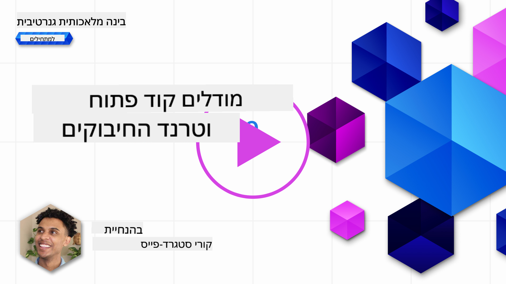
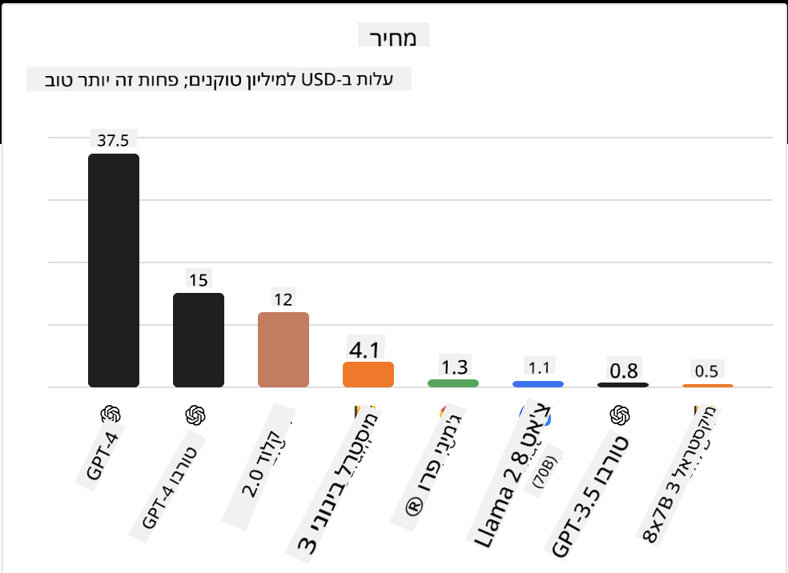
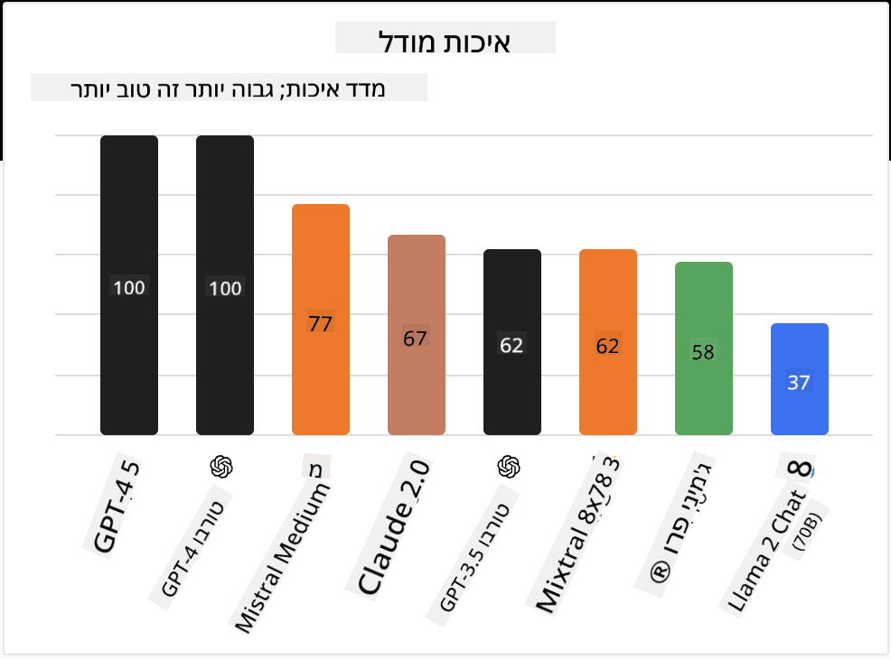

<!--
CO_OP_TRANSLATOR_METADATA:
{
  "original_hash": "0bba96e53ab841d99db731892a51fab8",
  "translation_date": "2025-05-20T06:59:04+00:00",
  "source_file": "16-open-source-models/README.md",
  "language_code": "he"
}
-->

## הקדמה

עולם ה-LLM בקוד פתוח מרגש ומתפתח כל הזמן. שיעור זה נועד לספק מבט מעמיק על מודלים בקוד פתוח. אם אתם מחפשים מידע על איך מודלים קנייניים משתווים למודלים בקוד פתוח, גשו לשיעור ["חקר והשוואת LLMs שונים"](../02-exploring-and-comparing-different-llms/README.md?WT.mc_id=academic-105485-koreyst). שיעור זה יעסוק גם בנושא של כיוונון עדין, אך הסבר מפורט יותר ניתן למצוא בשיעור ["כיוונון עדין של LLMs"](../18-fine-tuning/README.md?WT.mc_id=academic-105485-koreyst).

## מטרות למידה

- להבין מודלים בקוד פתוח
- להבין את היתרונות בעבודה עם מודלים בקוד פתוח
- חקר המודלים הפתוחים הזמינים ב-Hugging Face וב-Azure AI Studio

## מה הם מודלים בקוד פתוח?

תוכנה בקוד פתוח שיחקה תפקיד חשוב בצמיחה של טכנולוגיה בתחומים שונים. יוזמת הקוד הפתוח (OSI) הגדירה [10 קריטריונים לתוכנה](https://web.archive.org/web/20241126001143/https://opensource.org/osd?WT.mc_id=academic-105485-koreyst) כדי להיחשב כקוד פתוח. קוד המקור חייב להיות משותף בפומבי תחת רישיון שאושר על ידי OSI.

בעוד שפיתוח LLMs כולל אלמנטים דומים לפיתוח תוכנה, התהליך אינו זהה בדיוק. זה הביא לדיונים רבים בקהילה על הגדרת הקוד הפתוח בהקשר של LLMs. כדי שמודל יעמוד בהגדרה המסורתית של קוד פתוח, המידע הבא צריך להיות זמין לציבור:

- מערכי הנתונים ששימשו לאימון המודל.
- משקל המודל המלא כחלק מהאימון.
- קוד ההערכה.
- קוד הכיוונון העדין.
- משקל המודל המלא ומדדי האימון.

נכון לעכשיו, ישנם רק מספר מועט של מודלים שעומדים בקריטריונים הללו. [המודל OLMo שנוצר על ידי מכון אלן לאינטליגנציה מלאכותית (AllenAI)](https://huggingface.co/allenai/OLMo-7B?WT.mc_id=academic-105485-koreyst) הוא אחד מהם.

בשיעור זה נתייחס למודלים כ"מודלים פתוחים" מכיוון שהם עשויים שלא לעמוד בקריטריונים הללו בזמן כתיבת השיעור.

## יתרונות של מודלים פתוחים

**מותאם אישית במיוחד** - מכיוון שמודלים פתוחים משוחררים עם מידע אימון מפורט, חוקרים ומפתחים יכולים לשנות את פנימיות המודל. זה מאפשר יצירה של מודלים מתמחים במיוחד המכווננים למטלה או תחום לימוד ספציפי. דוגמאות לכך כוללות יצירת קוד, פעולות מתמטיות וביולוגיה.

**עלות** - עלות לשימוש ופריסה של מודלים אלה נמוכה יותר מאשר מודלים קנייניים. כאשר בונים יישומי בינה מלאכותית גנרטיבית, יש לשקול את הביצועים מול המחיר בעת עבודה עם מודלים אלה במקרה השימוש שלכם.

מקור: ניתוח מלאכותי

**גמישות** - עבודה עם מודלים פתוחים מאפשרת להיות גמישים מבחינת שימוש במודלים שונים או שילובם. דוגמה לכך היא [HuggingChat Assistants](https://huggingface.co/chat?WT.mc_id=academic-105485-koreyst) שבה משתמש יכול לבחור את המודל בו משתמשים ישירות בממשק המשתמש:

## חקר מודלים פתוחים שונים

### Llama 2

[LLama2](https://huggingface.co/meta-llama?WT.mc_id=academic-105485-koreyst), שפותח על ידי Meta, הוא מודל פתוח המותאם ליישומים מבוססי צ'אט. זאת בשל שיטת הכיוונון העדין שלו, שכללה כמות גדולה של דיאלוג ומשוב אנושי. בשיטה זו, המודל מייצר יותר תוצאות התואמות את ציפיות האדם, מה שמספק חוויית משתמש טובה יותר.

כמה דוגמאות לגרסאות מכווננות של Llama כוללות את [Llama היפני](https://huggingface.co/elyza/ELYZA-japanese-Llama-2-7b?WT.mc_id=academic-105485-koreyst), שמתמחה ביפנית, ו[Llama Pro](https://huggingface.co/TencentARC/LLaMA-Pro-8B?WT.mc_id=academic-105485-koreyst), שהיא גרסה משופרת של המודל הבסיסי.

### Mistral

[Mistral](https://huggingface.co/mistralai?WT.mc_id=academic-105485-koreyst) הוא מודל פתוח עם דגש חזק על ביצועים גבוהים ויעילות. הוא משתמש בגישת Mixture-of-Experts המשלבת קבוצת מודלים מתמחים למערכת אחת שבה בהתאם לקלט, מודלים מסוימים נבחרים לשימוש. זה הופך את החישוב ליעיל יותר מכיוון שהמודלים מטפלים רק בקלטים שבהם הם מתמחים.

כמה דוגמאות לגרסאות מכווננות של Mistral כוללות את [BioMistral](https://huggingface.co/BioMistral/BioMistral-7B?text=Mon+nom+est+Thomas+et+mon+principal?WT.mc_id=academic-105485-koreyst), שמתמקד בתחום הרפואי, ו[OpenMath Mistral](https://huggingface.co/nvidia/OpenMath-Mistral-7B-v0.1-hf?WT.mc_id=academic-105485-koreyst), שמבצע חישוב מתמטי.

### Falcon

[Falcon](https://huggingface.co/tiiuae?WT.mc_id=academic-105485-koreyst) הוא LLM שנוצר על ידי מכון חדשנות טכנולוגית (TII). Falcon-40B אומן על 40 מיליארד פרמטרים והוכח כיעיל יותר מ-GPT-3 עם תקציב חישוב נמוך יותר. זאת בזכות השימוש שלו באלגוריתם FlashAttention ובתשומת לב מרובת שאילתות המאפשרים לו להקטין את דרישות הזיכרון בזמן ניבוי. עם זמן הניבוי המופחת הזה, Falcon-40B מתאים ליישומי צ'אט.

כמה דוגמאות לגרסאות מכווננות של Falcon כוללות את [OpenAssistant](https://huggingface.co/OpenAssistant/falcon-40b-sft-top1-560?WT.mc_id=academic-105485-koreyst), עוזר שנבנה על מודלים פתוחים, ו[GPT4ALL](https://huggingface.co/nomic-ai/gpt4all-falcon?WT.mc_id=academic-105485-koreyst), שמספק ביצועים גבוהים יותר מהמודל הבסיסי.

## כיצד לבחור

אין תשובה אחת לבחירת מודל פתוח. מקום טוב להתחיל בו הוא להשתמש בתכונת הסינון לפי מטלה של Azure AI Studio. זה יעזור לכם להבין אילו סוגי מטלות המודל אומן עבורן. Hugging Face גם מתחזקת לוח תוצאות LLM שמראה לכם את המודלים בעלי הביצועים הטובים ביותר על בסיס מדדים מסוימים.

כאשר מסתכלים להשוות LLMs בין סוגים שונים, [Artificial Analysis](https://artificialanalysis.ai/?WT.mc_id=academic-105485-koreyst) הוא משאב נהדר נוסף:

מקור: ניתוח מלאכותי

אם עובדים על מקרה שימוש ספציפי, חיפוש גרסאות מכווננות שמתמקדות באותו תחום יכול להיות יעיל. ניסוי עם מספר מודלים פתוחים כדי לראות איך הם מבצעים בהתאם לציפיות שלכם ושל המשתמשים שלכם הוא עוד פרקטיקה טובה.

## צעדים הבאים

החלק הטוב ביותר במודלים פתוחים הוא שניתן להתחיל לעבוד איתם במהירות יחסית. בדקו את [קטלוג המודלים של Azure AI Studio](https://ai.azure.com?WT.mc_id=academic-105485-koreyst), הכולל אוסף ספציפי של Hugging Face עם המודלים שדיברנו עליהם כאן.

## הלמידה אינה עוצרת כאן, המשיכו את המסע

לאחר השלמת שיעור זה, בדקו את [אוסף הלמידה של בינה מלאכותית גנרטיבית](https://aka.ms/genai-collection?WT.mc_id=academic-105485-koreyst) כדי להמשיך ולהעמיק את הידע שלכם בבינה מלאכותית גנרטיבית!

**כתב ויתור**:  
מסמך זה תורגם באמצעות שירות תרגום AI [Co-op Translator](https://github.com/Azure/co-op-translator). בעוד אנו שואפים לדיוק, יש להיות מודעים לכך שתרגומים אוטומטיים עשויים להכיל טעויות או אי דיוקים. המסמך המקורי בשפתו המקורית צריך להיחשב כמקור סמכותי. עבור מידע קריטי, מומלץ להשתמש בתרגום מקצועי אנושי. איננו אחראים לאי הבנות או פירושים שגויים הנובעים משימוש בתרגום זה.