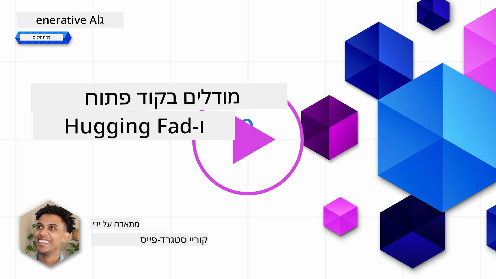
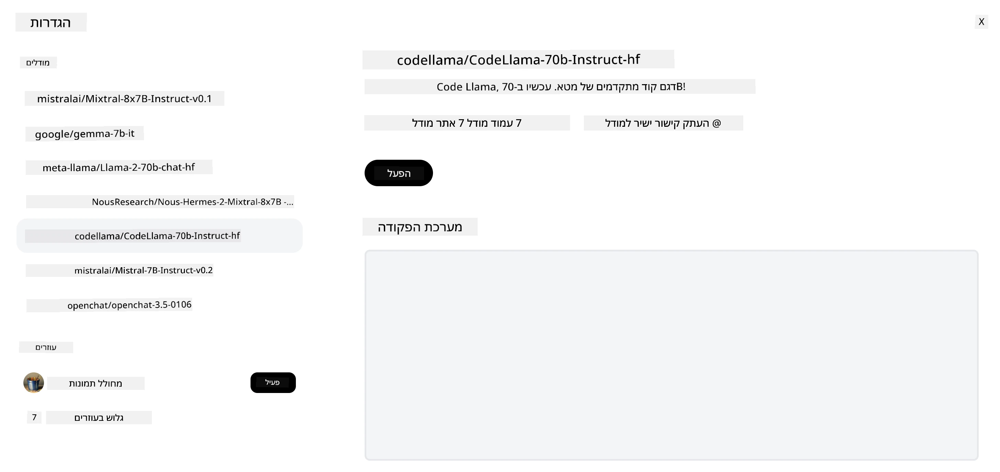
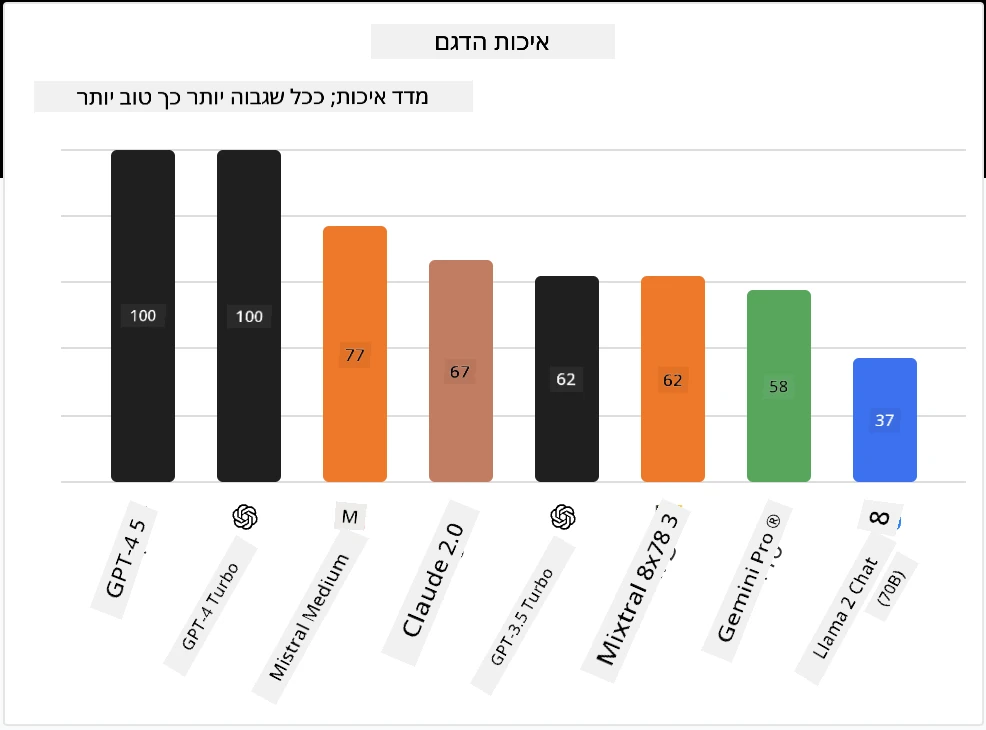

## מבוא

עולם המודלים בקוד פתוח הוא מרגש ומתפתח ללא הפסקה. שיעור זה נועד לספק מבט מעמיק על מודלים בקוד פתוח. אם אתם מחפשים מידע על אופן ההשוואה בין מודלים קנייניים למודלים בקוד פתוח, גשו לשיעור ["חקירת והשוואת מודלים שונים של LLM"](../02-exploring-and-comparing-different-llms/README.md?WT.mc_id=academic-105485-koreyst). שיעור זה גם יעסוק בנושא של כיוונון עדין, אך הסבר מפורט יותר ניתן למצוא בשיעור ["כיוונון עדין של LLM"](../18-fine-tuning/README.md?WT.mc_id=academic-105485-koreyst).

## מטרות הלמידה

- להרוויח הבנה של מודלים בקוד פתוח
- להבין את היתרונות של עבודה עם מודלים בקוד פתוח
- לחקור את המודלים הפתוחים הזמינים ב-Hugging Face ובקטלוג המודלים של Microsoft Foundry

## מה הם מודלים בקוד פתוח?

תוכנת קוד פתוח שיחקה תפקיד מרכזי בצמיחת הטכנולוגיה בתחומים רבים. יוזמת הקוד הפתוח (OSI) הגדירה [10 קריטריונים לתוכנה](https://web.archive.org/web/20241126001143/https://opensource.org/osd?WT.mc_id=academic-105485-koreyst) כדי שתוגדר כקוד פתוח. קוד המקור חייב להיות משותף באופן גלוי תחת רישיון שאושר על ידי OSI.

למרות שהתפתחות מודלים גדולים מסוג LLM מכילה אלמנטים דומים לפיתוח תוכנה, התהליך אינו זהה בדיוק. הדבר עורר דיון רב בקהילה לגבי הגדרת הקוד הפתוח בהקשר של LLM. עבור מודל כדי שיהיה תואם להגדרה המסורתית של קוד פתוח, המידע הבא צריך להיות זמין לציבור:

- מערכי נתונים ששימשו לאימון המודל.
- משקלי המודל המלאים כחלק מהאימון.
- קוד ההערכה.
- קוד הכיוונון העדין.
- משקלי המודל המלאים ומדדי האימון.

כיום ישנם רק כמה מודלים שעומדים בקריטריונים אלה. [מודל OLMo שפותח על ידי מכון אלן לבינה מלאכותית (AllenAI)](https://huggingface.co/allenai/OLMo-7B?WT.mc_id=academic-105485-koreyst) הוא אחד שמתאים לקטגוריה זו.

בשיעור זה, נתייחס למודלים כ"מודלים פתוחים" הלאה, כיוון שהם עשויים לא להתאים לקריטריונים הנ"ל בזמן הכתיבה.

## יתרונות של מודלים פתוחים

**ניתן להתאמה אישית רבה** - מכיוון שהמודלים הפתוחים משוחררים עם מידע מפורט על האימון, חוקרים ומפתחים יכולים לשנות את הפנים הפנימיים של המודל. זה מאפשר יצירת מודלים מתמחים מאוד המכוונים בצורה מדויקת למשימה או תחום מסוים של מחקר. דוגמאות לכך הן יצירת קוד, פעולות מתמטיות וביולוגיה.

**מחיר** - העלות לפריט לשימוש ופריסה של מודלים אלה נמוכה מזו של מודלים קנייניים. כאשר בונים יישומי בינה מלאכותית גנרטיבית, יש להסתכל על ביצועים מול מחיר בעת עבודה עם מודלים אלה במקרה השימוש שלכם.

מקור: Artificial Analysis

**גמישות** - עבודה עם מודלים פתוחים מאפשרת לך להיות גמיש במונחים של שימוש במודלים שונים או שילוב שלהם. דוגמה לכך היא [עוזרי HuggingChat](https://huggingface.co/chat?WT.mc_id=academic-105485-koreyst) שבה משתמש יכול לבחור את המודל בשימוש ישירות בממשק המשתמש:

## חקר מודלים פתוחים שונים

### Llama 2

[LLama2](https://huggingface.co/meta-llama?WT.mc_id=academic-105485-koreyst), שפותח על ידי Meta, הוא מודל פתוח המותאם ליישומי שיחה. זאת בזכות שיטת הכוונון המדויק שלו, שכללה כמות גדולה של דיאלוג ומשוב אנושי. עם שיטה זו, המודל מייצר תוצאות יותר מותאמות לציפיות האנושיות, מה שמספק חוויית משתמש טובה יותר.

כמה דוגמאות לגרסאות מכוונות של Llama כוללות את [Japanese Llama](https://huggingface.co/elyza/ELYZA-japanese-Llama-2-7b?WT.mc_id=academic-105485-koreyst), שמתמחה ביפנית, ואת [Llama Pro](https://huggingface.co/TencentARC/LLaMA-Pro-8B?WT.mc_id=academic-105485-koreyst), שהיא גרסה משודרגת של המודל הבסיסי.

### Mistral

[Mistral](https://huggingface.co/mistralai?WT.mc_id=academic-105485-koreyst) הוא מודל פתוח המתמקד בביצועים גבוהים ויעילות. הוא משתמש בגישת Mixture-of-Experts שמשלבת קבוצת מודלים מומחים מיוחדים למערכת אחת, שבה בהתאם לקלט, נבחרים מודלים מסוימים לשימוש. זה עושה את החישוב ליעיל יותר מאחר שהמודלים מטפלים רק בקלטים בהם הם מתמחים.

כמה דוגמאות לגרסאות מכוונות של Mistral כוללות את [BioMistral](https://huggingface.co/BioMistral/BioMistral-7B?text=Mon+nom+est+Thomas+et+mon+principal?WT.mc_id=academic-105485-koreyst), שמתמקד בתחום הרפואי, ואת [OpenMath Mistral](https://huggingface.co/nvidia/OpenMath-Mistral-7B-v0.1-hf?WT.mc_id=academic-105485-koreyst), שמבצע חישובים מתמטיים.

### Falcon

[Falcon](https://huggingface.co/tiiuae?WT.mc_id=academic-105485-koreyst) הוא LLM שנוצר על ידי המכון לחדשנות טכנולוגית (**TII**). ה-Falcon-40B אומן על 40 מיליארד פרמטרים, והוכח שהוא מבצע טוב יותר מ-GPT-3 עם תקציב חישוב נמוך יותר. זאת בזכות השימוש באלגוריתם FlashAttention ותשומת לב רב-בקשתית שמאפשרים לו להפחית את דרישות הזיכרון בזמן ההסקה. בזכות זמן ההסקה המופחת הזה, ה-Falcon-40B מתאים ליישומי שיחה.

כמה דוגמאות לגרסאות ממוּתקות של Falcon הן [OpenAssistant](https://huggingface.co/OpenAssistant/falcon-40b-sft-top1-560?WT.mc_id=academic-105485-koreyst), עוזר מבוסס מודלים פתוחים, ו-[GPT4ALL](https://huggingface.co/nomic-ai/gpt4all-falcon?WT.mc_id=academic-105485-koreyst), שהופך ביצועים טובים יותר מהמודל הבסיסי.

## איך לבחור

אין תשובה אחת לבחירת מודל פתוח. מקום טוב להתחיל בו הוא על ידי שימוש בתכונת סינון לפי משימה בקטלוג המודלים של Microsoft Foundry. זה יעזור לך להבין לאילו סוגי משימות המודל אומן. Hugging Face גם מנהלת לוח מובילים של LLM שמראה את המודלים בעלי הביצועים הטובים ביותר בהתבסס על מדדים מסוימים.

כשמחפשים להשוות בין LLM מסוגים שונים, [Artificial Analysis](https://artificialanalysis.ai/?WT.mc_id=academic-105485-koreyst) הוא משאב נהדר נוסף:

מקור: Artificial Analysis

אם עובדים על מקרה שימוש ספציפי, חיפוש אחר גרסאות ממוּתקות המתמקדות באותו תחום יכול להיות יעיל. ניסוי עם מספר מודלים פתוחים כדי לראות כיצד הם מתפקדים לפי הציפיות שלך ושל המשתמשים הוא עוד תרגול טוב.

## שלבים הבאים

החלק הטוב ביותר במודלים פתוחים הוא שאתה יכול להתחיל לעבוד איתם די מהר. עיין ב-[קטלוג המודלים של Microsoft Foundry](https://ai.azure.com?WT.mc_id=academic-105485-koreyst), הכולל אוסף ספציפי של Hugging Face עם המודלים שדיברנו עליהם כאן.

## הלמידה לא נעצרת כאן, המשך את המסע

לאחר שסיימת את השיעור הזה, עיין ב-[אוסף הלמידה של Generative AI](https://aka.ms/genai-collection?WT.mc_id=academic-105485-koreyst) שלנו להמשך שיפור הידע שלך באנדרטת AI גנרטיבי!

---

<!-- CO-OP TRANSLATOR DISCLAIMER START -->
**כתב ויתור**:
מסמך זה תורגם באמצעות שירות תרגום אוטומטי [Co-op Translator](https://github.com/Azure/co-op-translator). למרות שאנו שואפים לדיוק, יש לקחת בחשבון שתרגומים אוטומטיים עלולים להכיל שגיאות או אי-דיוקים. יש להחשיב את המסמך המקורי בשפתו הטבעית כמקור הסמכות. למידע קריטי מומלץ להשתמש בתרגום מקצועי על ידי מתרגם אדם. אנו לא אחראים לכל אי-הבנה או פירוש שגוי הנובע מהשימוש בתרגום זה.
<!-- CO-OP TRANSLATOR DISCLAIMER END -->