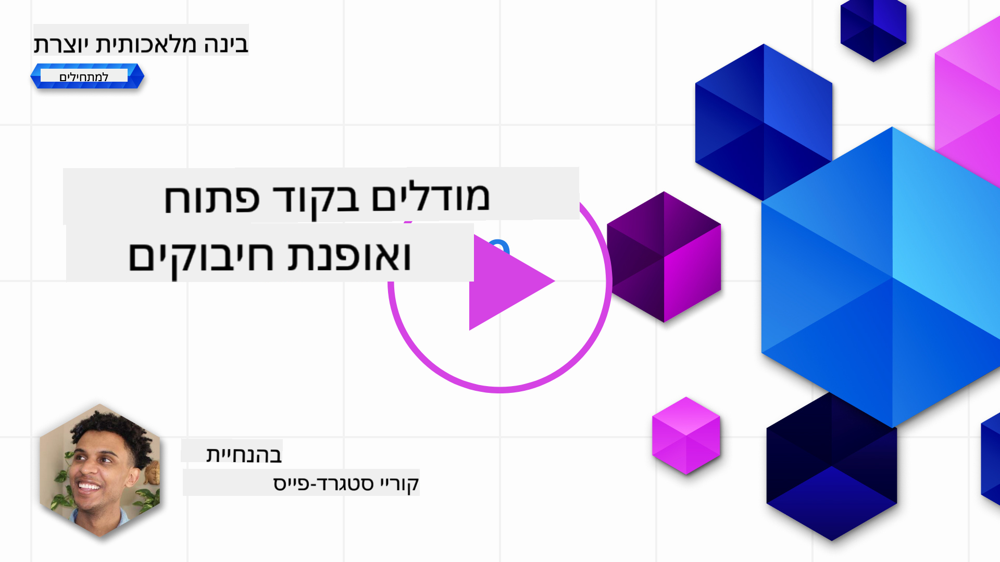
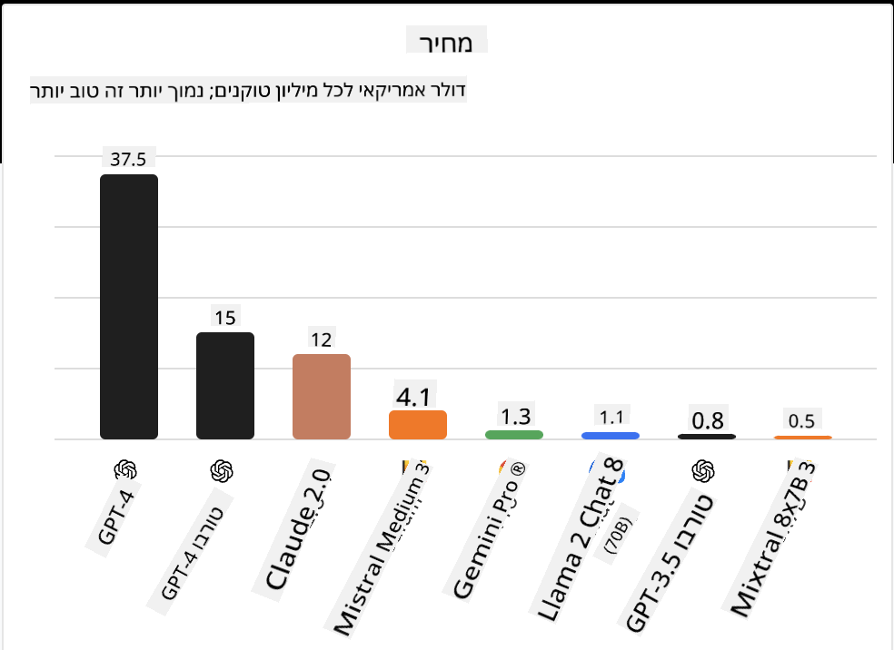
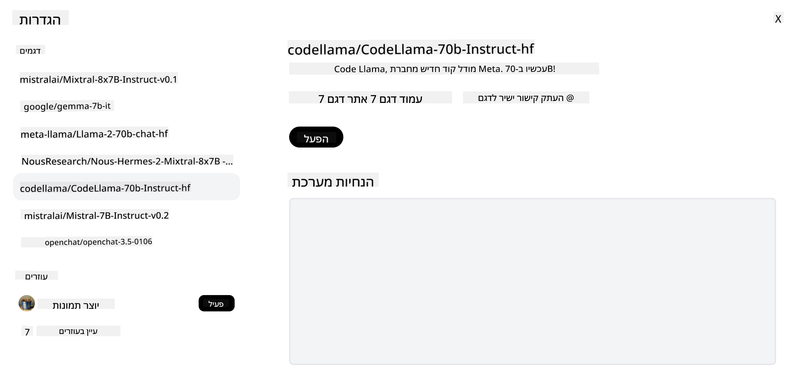

<!--
CO_OP_TRANSLATOR_METADATA:
{
  "original_hash": "0bba96e53ab841d99db731892a51fab8",
  "translation_date": "2025-06-25T23:59:37+00:00",
  "source_file": "16-open-source-models/README.md",
  "language_code": "he"
}
-->

## הקדמה

עולם מודלי ה-LLM בקוד פתוח הוא מרגש ומתפתח כל הזמן. שיעור זה נועד לספק מבט מעמיק על מודלים בקוד פתוח. אם אתם מחפשים מידע על איך מודלים קנייניים משווים למודלים בקוד פתוח, גשו לשיעור ["חקר והשוואת LLMs שונים"](../02-exploring-and-comparing-different-llms/README.md?WT.mc_id=academic-105485-koreyst). שיעור זה יכסה גם את נושא הכוונון המדויק, אך הסבר מפורט יותר ניתן למצוא בשיעור ["כוונון מדויק של LLMs"](../18-fine-tuning/README.md?WT.mc_id=academic-105485-koreyst).

## מטרות הלמידה

- הבנה של מודלים בקוד פתוח
- הבנת היתרונות בעבודה עם מודלים בקוד פתוח
- חקר המודלים הפתוחים הזמינים ב-Hugging Face וב-Azure AI Studio

## מה הם מודלים בקוד פתוח?

תוכנה בקוד פתוח מילאה תפקיד מכריע בצמיחת הטכנולוגיה בתחומים שונים. יוזמת הקוד הפתוח (OSI) הגדירה [10 קריטריונים לתוכנה](https://web.archive.org/web/20241126001143/https://opensource.org/osd?WT.mc_id=academic-105485-koreyst) כדי לסווג אותה כקוד פתוח. קוד המקור חייב להיות משותף בגלוי תחת רישיון שאושר על ידי ה-OSI.

בעוד שפיתוח LLMs כולל אלמנטים דומים לפיתוח תוכנה, התהליך אינו זהה בדיוק. זה הביא לדיונים רבים בקהילה על הגדרת הקוד הפתוח בהקשר של LLMs. כדי שמודל יתאים להגדרה המסורתית של קוד פתוח, המידע הבא צריך להיות זמין לציבור:

- מערכי נתונים ששימשו לאימון המודל.
- משקולות המודל המלאות כחלק מהאימון.
- קוד ההערכה.
- קוד הכוונון המדויק.
- משקולות המודל המלאות ומדדי האימון.

נכון לעכשיו, ישנם רק כמה מודלים שעונים על קריטריונים אלו. [המודל OLMo שנוצר על ידי מכון אלן לבינה מלאכותית (AllenAI)](https://huggingface.co/allenai/OLMo-7B?WT.mc_id=academic-105485-koreyst) הוא אחד מהם.

בשיעור זה, נשתמש במונח "מודלים פתוחים" מכאן ואילך, מכיוון שהם עשויים שלא להתאים לקריטריונים הנ"ל בזמן הכתיבה.

## יתרונות של מודלים פתוחים

**ניתנים להתאמה גבוהה** - מכיוון שמודלים פתוחים משתחררים עם מידע מפורט על האימון, חוקרים ומפתחים יכולים לשנות את הפנימיות של המודל. זה מאפשר יצירת מודלים מותאמים אישית במיוחד, המכווננים למשימה מסוימת או לתחום מחקר. כמה דוגמאות לכך הן יצירת קוד, פעולות מתמטיות וביולוגיה.

**עלות** - העלות לכל טוקן לשימוש ופריסת המודלים הללו נמוכה מזו של מודלים קנייניים. בעת בניית יישומי AI גנרטיביים, יש לבדוק את הביצועים מול המחיר בעת עבודה עם מודלים אלו לשימוש שלכם.

  
מקור: ניתוח מלאכותי

**גמישות** - עבודה עם מודלים פתוחים מאפשרת גמישות מבחינת שימוש במודלים שונים או שילובם. דוגמה לכך היא [HuggingChat Assistants](https://huggingface.co/chat?WT.mc_id=academic-105485-koreyst), שבה המשתמש יכול לבחור את המודל המשמש ישירות בממשק המשתמש:

## חקר מודלים פתוחים שונים

### Llama 2

[LLama2](https://huggingface.co/meta-llama?WT.mc_id=academic-105485-koreyst), שפותח על ידי Meta, הוא מודל פתוח המותאם ליישומים מבוססי צ'אט. זאת בזכות שיטת הכוונון המדויק שלו, שכללה כמות גדולה של דיאלוגים ומשוב אנושי. עם שיטה זו, המודל מייצר תוצאות שמתואמות יותר לציפיות אנושיות, מה שמספק חוויית משתמש טובה יותר.

כמה דוגמאות לגרסאות מכווננות של Llama כוללות את [Japanese Llama](https://huggingface.co/elyza/ELYZA-japanese-Llama-2-7b?WT.mc_id=academic-105485-koreyst), שמתמחה ביפנית, ו-[Llama Pro](https://huggingface.co/TencentARC/LLaMA-Pro-8B?WT.mc_id=academic-105485-koreyst), שהיא גרסה משופרת של המודל הבסיסי.

### Mistral

[Mistral](https://huggingface.co/mistralai?WT.mc_id=academic-105485-koreyst) הוא מודל פתוח עם דגש חזק על ביצועים גבוהים ויעילות. הוא משתמש בגישת Mixture-of-Experts, שמשלבת קבוצה של מודלים מומחים מיוחדים למערכת אחת שבה, בהתאם לקלט, נבחרים מודלים מסוימים לשימוש. זה הופך את החישוב ליעיל יותר מכיוון שהמודלים מתמודדים רק עם הקלטים שהם מתמחים בהם.

כמה דוגמאות לגרסאות מכווננות של Mistral כוללות את [BioMistral](https://huggingface.co/BioMistral/BioMistral-7B?text=Mon+nom+est+Thomas+et+mon+principal?WT.mc_id=academic-105485-koreyst), שמתמקד בתחום הרפואי, ו-[OpenMath Mistral](https://huggingface.co/nvidia/OpenMath-Mistral-7B-v0.1-hf?WT.mc_id=academic-105485-koreyst), שמבצע חישוב מתמטי.

### Falcon

[Falcon](https://huggingface.co/tiiuae?WT.mc_id=academic-105485-koreyst) הוא LLM שנוצר על ידי מכון החדשנות הטכנולוגית (**TII**). ה-Falcon-40B אומן על 40 מיליארד פרמטרים, מה שהוכיח שהוא מבצע טוב יותר מ-GPT-3 עם תקציב חישוב נמוך יותר. זאת בזכות השימוש באלגוריתם FlashAttention ובתשומת לב מרובת שאילתות, שמאפשרים לו להפחית את דרישות הזיכרון בזמן ההיסק. עם זמן ההיסק המופחת הזה, ה-Falcon-40B מתאים ליישומי צ'אט.

כמה דוגמאות לגרסאות מכווננות של Falcon הן [OpenAssistant](https://huggingface.co/OpenAssistant/falcon-40b-sft-top1-560?WT.mc_id=academic-105485-koreyst), עוזר שנבנה על מודלים פתוחים, ו-[GPT4ALL](https://huggingface.co/nomic-ai/gpt4all-falcon?WT.mc_id=academic-105485-koreyst), שמספק ביצועים גבוהים יותר מהמודל הבסיסי.

## איך לבחור

אין תשובה אחת לבחירת מודל פתוח. מקום טוב להתחיל בו הוא להשתמש בתכונת הסינון לפי משימה של Azure AI Studio. זה יעזור לכם להבין לאילו סוגי משימות המודל אומן. Hugging Face גם מתחזקת לוח מובילים של LLM שמראה את המודלים המבצעים ביותר על פי מדדים מסוימים.

כאשר מחפשים להשוות LLMs בין הסוגים השונים, [Artificial Analysis](https://artificialanalysis.ai/?WT.mc_id=academic-105485-koreyst) הוא משאב מצוין נוסף:

  
מקור: ניתוח מלאכותי

אם עובדים על מקרה שימוש ספציפי, חיפוש גרסאות מכווננות שממוקדות באותו תחום יכול להיות יעיל. ניסוי עם מספר מודלים פתוחים כדי לראות איך הם מבצעים בהתאם לציפיות שלכם ושל המשתמשים שלכם הוא פרקטיקה טובה נוספת.

## צעדים הבאים

החלק הטוב ביותר במודלים פתוחים הוא שניתן להתחיל לעבוד איתם במהירות רבה. בדקו את [קטלוג המודלים של Azure AI Studio](https://ai.azure.com?WT.mc_id=academic-105485-koreyst), שמציג אוסף ספציפי של Hugging Face עם המודלים שדנו בהם כאן.

## הלמידה לא נעצרת כאן, המשיכו במסע

לאחר השלמת שיעור זה, בדקו את [אוסף הלמידה של AI גנרטיבי שלנו](https://aka.ms/genai-collection?WT.mc_id=academic-105485-koreyst) כדי להמשיך להעמיק את הידע שלכם ב-AI גנרטיבי!

**כתב ויתור**:  
מסמך זה תורגם באמצעות שירות תרגום AI [Co-op Translator](https://github.com/Azure/co-op-translator). בעוד שאנו שואפים לדיוק, אנא היו מודעים לכך שתרגומים אוטומטיים עשויים להכיל שגיאות או אי דיוקים. המסמך המקורי בשפתו המקורית צריך להיחשב כמקור סמכותי. עבור מידע קריטי, מומלץ להשתמש בתרגום אנושי מקצועי. איננו אחראים לכל אי הבנות או פרשנויות שגויות הנובעות משימוש בתרגום זה.