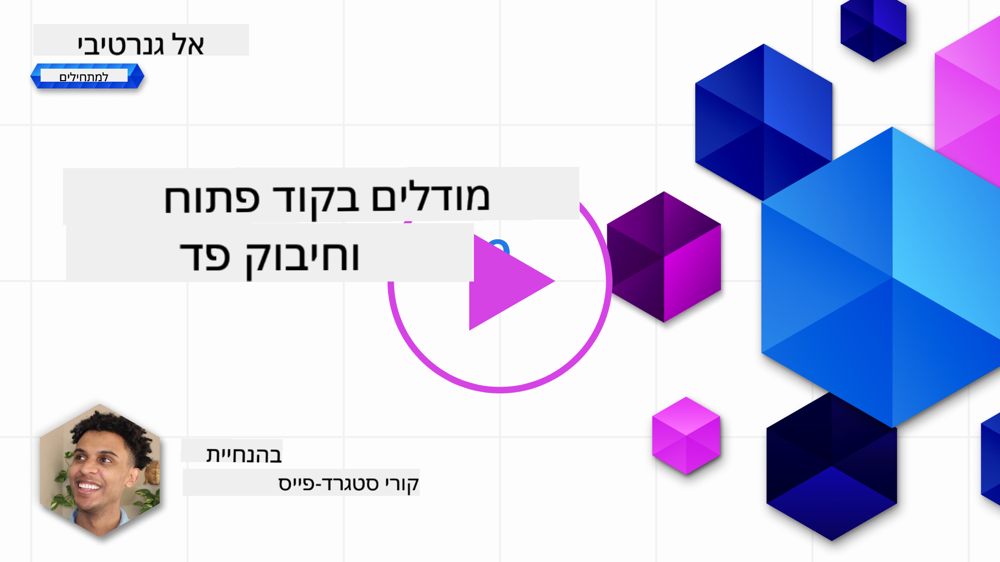

<!--
CO_OP_TRANSLATOR_METADATA:
{
  "original_hash": "a8b2d4bb727c877ebf9edff8623d16b9",
  "translation_date": "2025-09-06T10:20:34+00:00",
  "source_file": "16-open-source-models/README.md",
  "language_code": "he"
}
-->

## הקדמה

עולם מודלי ה-LLM בקוד פתוח הוא מרגש ומתפתח ללא הרף. שיעור זה נועד לספק מבט מעמיק על מודלים בקוד פתוח. אם אתם מחפשים מידע על ההבדלים בין מודלים קנייניים למודלים בקוד פתוח, עברו לשיעור ["חקר והשוואת מודלי LLM שונים"](../02-exploring-and-comparing-different-llms/README.md?WT.mc_id=academic-105485-koreyst). שיעור זה יעסוק גם בנושא התאמה אישית (fine-tuning), אך הסבר מפורט יותר ניתן למצוא בשיעור ["התאמת מודלי LLM"](../18-fine-tuning/README.md?WT.mc_id=academic-105485-koreyst).

## מטרות למידה

- להבין את מודלי הקוד הפתוח
- להבין את היתרונות של עבודה עם מודלים בקוד פתוח
- לחקור את המודלים הפתוחים הזמינים ב-Hugging Face וב-Azure AI Studio

## מה הם מודלים בקוד פתוח?

תוכנה בקוד פתוח מילאה תפקיד מרכזי בצמיחת הטכנולוגיה בתחומים שונים. יוזמת הקוד הפתוח (OSI) הגדירה [10 קריטריונים לתוכנה](https://web.archive.org/web/20241126001143/https://opensource.org/osd?WT.mc_id=academic-105485-koreyst) כדי להיחשב כקוד פתוח. קוד המקור חייב להיות משותף באופן פתוח תחת רישיון שאושר על ידי OSI.

בעוד שפיתוח מודלי LLM כולל אלמנטים דומים לפיתוח תוכנה, התהליך אינו זהה לחלוטין. הדבר עורר דיון רב בקהילה על הגדרת הקוד הפתוח בהקשר של מודלי LLM. כדי שמודל יתאים להגדרה המסורתית של קוד פתוח, המידע הבא צריך להיות זמין לציבור:

- מערכי הנתונים ששימשו לאימון המודל.
- משקלי המודל המלאים כחלק מהאימון.
- קוד ההערכה.
- קוד ההתאמה האישית.
- משקלי המודל המלאים ומדדי האימון.

כיום ישנם רק מעט מודלים שעומדים בקריטריונים הללו. [מודל OLMo שנוצר על ידי מכון אלן לבינה מלאכותית (AllenAI)](https://huggingface.co/allenai/OLMo-7B?WT.mc_id=academic-105485-koreyst) הוא אחד שעונה על קטגוריה זו.

בשיעור זה, נתייחס למודלים כ"מודלים פתוחים" מכאן ואילך, שכן ייתכן שהם אינם עומדים בקריטריונים הנ"ל בזמן כתיבת השיעור.

## יתרונות של מודלים פתוחים

**ניתנים להתאמה אישית גבוהה** - מכיוון שמודלים פתוחים משוחררים עם מידע מפורט על האימון, חוקרים ומפתחים יכולים לשנות את המודל מבפנים. הדבר מאפשר יצירת מודלים מותאמים במיוחד למשימה או תחום מחקר מסוים. דוגמאות לכך כוללות יצירת קוד, פעולות מתמטיות וביולוגיה.

**עלות** - העלות לכל טוקן בשימוש ובפריסה של מודלים אלו נמוכה יותר מזו של מודלים קנייניים. בעת בניית יישומי בינה מלאכותית גנרטיבית, יש לבחון את הביצועים מול המחיר בהתאם למקרה השימוש שלכם.

  
מקור: Artificial Analysis

**גמישות** - עבודה עם מודלים פתוחים מאפשרת גמישות בשימוש במודלים שונים או בשילוב ביניהם. דוגמה לכך היא [HuggingChat Assistants](https://huggingface.co/chat?WT.mc_id=academic-105485-koreyst), שבה משתמש יכול לבחור את המודל שבו נעשה שימוש ישירות בממשק המשתמש:

## חקר מודלים פתוחים שונים

### Llama 2

[LLama2](https://huggingface.co/meta-llama?WT.mc_id=academic-105485-koreyst), שפותח על ידי Meta, הוא מודל פתוח שמותאם ליישומים מבוססי שיחה. זאת בזכות שיטת ההתאמה האישית שלו, שכללה כמות גדולה של דיאלוגים ומשוב אנושי. בשיטה זו, המודל מייצר תוצאות שמתאימות יותר לציפיות אנושיות, מה שמספק חוויית משתמש טובה יותר.

דוגמאות לגרסאות מותאמות של Llama כוללות את [Japanese Llama](https://huggingface.co/elyza/ELYZA-japanese-Llama-2-7b?WT.mc_id=academic-105485-koreyst), שמתמחה ביפנית, ואת [Llama Pro](https://huggingface.co/TencentARC/LLaMA-Pro-8B?WT.mc_id=academic-105485-koreyst), שהיא גרסה משופרת של המודל הבסיסי.

### Mistral

[Mistral](https://huggingface.co/mistralai?WT.mc_id=academic-105485-koreyst) הוא מודל פתוח שמתמקד בביצועים גבוהים וביעילות. הוא משתמש בגישת Mixture-of-Experts, שמשלבת קבוצת מודלים מומחים למערכת אחת שבה, בהתאם לקלט, נבחרים מודלים מסוימים לשימוש. הדבר הופך את החישוב ליעיל יותר, שכן המודלים מטפלים רק בקלטים שהם מתמחים בהם.

דוגמאות לגרסאות מותאמות של Mistral כוללות את [BioMistral](https://huggingface.co/BioMistral/BioMistral-7B?text=Mon+nom+est+Thomas+et+mon+principal?WT.mc_id=academic-105485-koreyst), שמתמקד בתחום הרפואי, ואת [OpenMath Mistral](https://huggingface.co/nvidia/OpenMath-Mistral-7B-v0.1-hf?WT.mc_id=academic-105485-koreyst), שמבצע חישובים מתמטיים.

### Falcon

[Falcon](https://huggingface.co/tiiuae?WT.mc_id=academic-105485-koreyst) הוא מודל LLM שנוצר על ידי מכון החדשנות הטכנולוגית (**TII**). Falcon-40B אומן על 40 מיליארד פרמטרים, מה שהוכח כיעיל יותר מ-GPT-3 עם תקציב חישוב נמוך יותר. זאת בזכות השימוש באלגוריתם FlashAttention ובתשומת לב מרובת שאילתות, שמאפשרים להפחית את דרישות הזיכרון בזמן ההסקה. עם זמן הסקה מופחת זה, Falcon-40B מתאים ליישומי שיחה.

דוגמאות לגרסאות מותאמות של Falcon כוללות את [OpenAssistant](https://huggingface.co/OpenAssistant/falcon-40b-sft-top1-560?WT.mc_id=academic-105485-koreyst), עוזר שנבנה על מודלים פתוחים, ואת [GPT4ALL](https://huggingface.co/nomic-ai/gpt4all-falcon?WT.mc_id=academic-105485-koreyst), שמספק ביצועים גבוהים יותר מהמודל הבסיסי.

## איך לבחור

אין תשובה אחת לבחירת מודל פתוח. מקום טוב להתחיל בו הוא שימוש בתכונת הסינון לפי משימה של Azure AI Studio. תכונה זו תעזור לכם להבין אילו סוגי משימות המודל אומן עבורן. Hugging Face גם מתחזקת לוח דירוג LLM שמציג את המודלים הטובים ביותר לפי מדדים מסוימים.

כאשר מחפשים להשוות בין מודלי LLM מסוגים שונים, [Artificial Analysis](https://artificialanalysis.ai/?WT.mc_id=academic-105485-koreyst) הוא משאב נהדר נוסף:

  
מקור: Artificial Analysis

אם עובדים על מקרה שימוש ספציפי, חיפוש גרסאות מותאמות שמתמקדות באותו תחום יכול להיות יעיל. ניסוי עם מספר מודלים פתוחים כדי לראות כיצד הם מתפקדים בהתאם לציפיות שלכם ושל המשתמשים שלכם הוא גם פרקטיקה טובה.

## צעדים הבאים

החלק הטוב ביותר במודלים פתוחים הוא שניתן להתחיל לעבוד איתם די מהר. בדקו את [קטלוג המודלים של Azure AI Foundry](https://ai.azure.com?WT.mc_id=academic-105485-koreyst), שמציג אוסף ספציפי של Hugging Face עם המודלים שדיברנו עליהם כאן.

## הלמידה לא נגמרת כאן, המשיכו במסע

לאחר סיום שיעור זה, בדקו את [אוסף הלמידה של בינה מלאכותית גנרטיבית](https://aka.ms/genai-collection?WT.mc_id=academic-105485-koreyst) כדי להמשיך להעמיק את הידע שלכם בבינה מלאכותית גנרטיבית!

---

**כתב ויתור**:  
מסמך זה תורגם באמצעות שירות תרגום מבוסס בינה מלאכותית [Co-op Translator](https://github.com/Azure/co-op-translator). למרות שאנו שואפים לדיוק, יש לקחת בחשבון שתרגומים אוטומטיים עשויים להכיל שגיאות או אי דיוקים. המסמך המקורי בשפתו המקורית צריך להיחשב כמקור סמכותי. עבור מידע קריטי, מומלץ להשתמש בתרגום מקצועי על ידי אדם. אנו לא נושאים באחריות לאי הבנות או לפרשנויות שגויות הנובעות משימוש בתרגום זה.