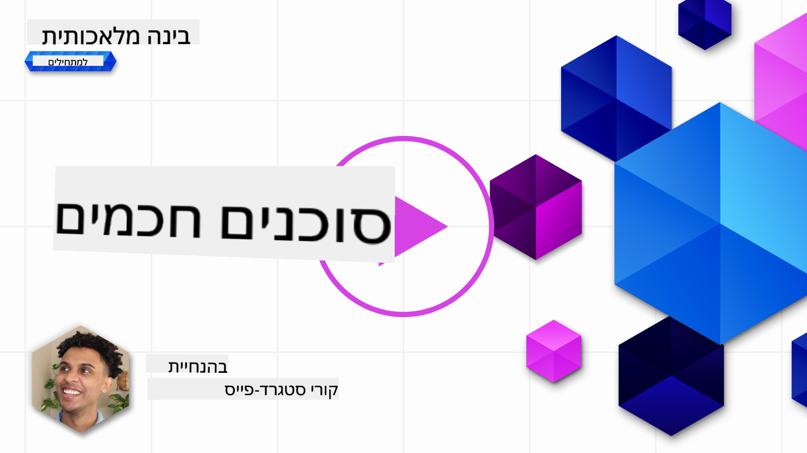
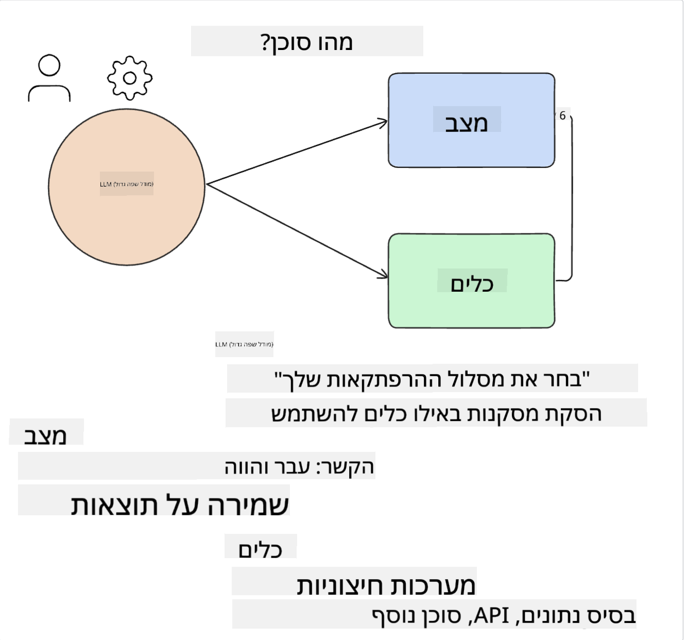
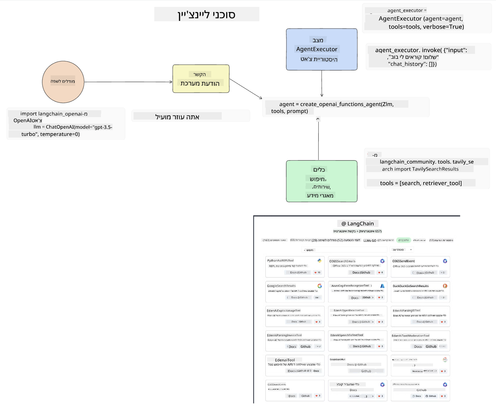
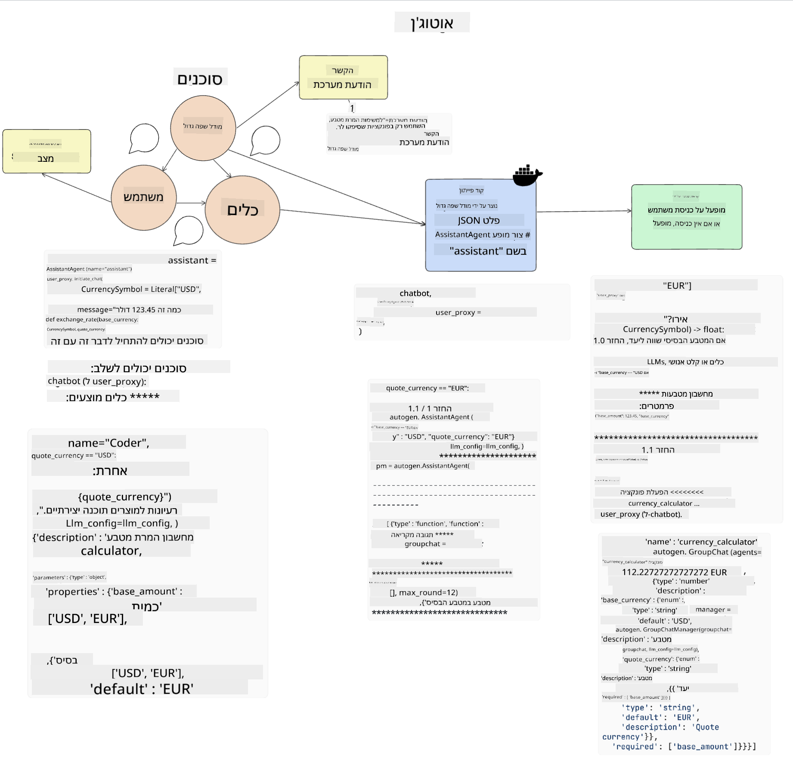
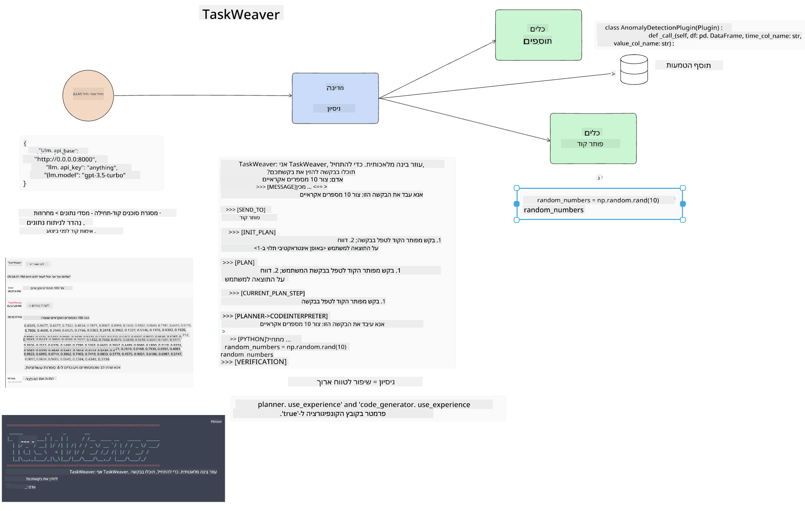
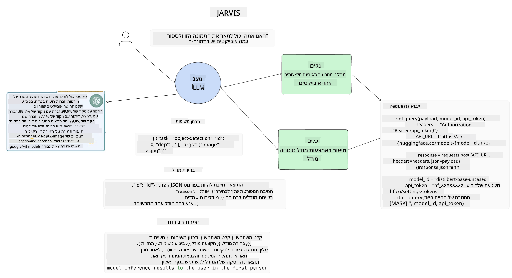

<!--
CO_OP_TRANSLATOR_METADATA:
{
  "original_hash": "11f03c81f190d9cbafd0f977dcbede6c",
  "translation_date": "2025-05-20T07:27:23+00:00",
  "source_file": "17-ai-agents/README.md",
  "language_code": "he"
}
-->
[](https://aka.ms/gen-ai-lesson17-gh?WT.mc_id=academic-105485-koreyst)

## מבוא

סוכני AI מייצגים התפתחות מרגשת ב-AI גנרטיבי, המאפשרים למודלים שפתיים גדולים (LLMs) להתפתח מעוזרים לסוכנים המסוגלים לבצע פעולות. מסגרות סוכני AI מאפשרות למפתחים ליצור יישומים שנותנים ל-LLMs גישה לכלים וניהול מצבים. מסגרות אלו גם משפרות את הנראות, ומאפשרות למשתמשים ולמפתחים לעקוב אחר הפעולות המתוכננות על ידי LLMs, ובכך לשפר את ניהול החוויות.

השיעור יכסה את התחומים הבאים:

- הבנת מהו סוכן AI - מה בדיוק הוא סוכן AI?
- חקר ארבע מסגרות סוכני AI שונות - מה מייחד אותן?
- יישום סוכני AI אלה למקרי שימוש שונים - מתי עלינו להשתמש בסוכני AI?

## מטרות למידה

לאחר שיעור זה, תוכלו:

- להסביר מה הם סוכני AI וכיצד ניתן להשתמש בהם.
- להבין את ההבדלים בין כמה ממסגרות סוכני AI הפופולריות וכיצד הן שונות.
- להבין כיצד סוכני AI פועלים כדי לבנות יישומים איתם.

## מה הם סוכני AI?

סוכני AI הם תחום מרתק בעולם ה-AI הגנרטיבי. עם ההתרגשות הזו מגיעה לפעמים בלבול במונחים וביישומם. כדי לשמור על פשטות והכללה של רוב הכלים המתייחסים לסוכני AI, נשתמש בהגדרה זו:

סוכני AI מאפשרים למודלים שפתיים גדולים (LLMs) לבצע משימות על ידי מתן גישה ל**מצב** ו**כלים**.



בואו נגדיר את המונחים האלה:

**מודלים שפתיים גדולים** - אלה הם המודלים המוזכרים לאורך כל הקורס כמו GPT-3.5, GPT-4, Llama-2, וכו'.

**מצב** - זה מתייחס להקשר שבו ה-LLM פועל. ה-LLM משתמש בהקשר של פעולותיו הקודמות וההקשר הנוכחי, מכוון את קבלת ההחלטות שלו לפעולות הבאות. מסגרות סוכני AI מאפשרות למפתחים לשמור על הקשר זה בצורה קלה יותר.

**כלים** - כדי להשלים את המשימה שהמשתמש ביקש ושה-LLM תכנן, ה-LLM צריך גישה לכלים. כמה דוגמאות לכלים יכולות להיות מסד נתונים, API, יישום חיצוני או אפילו LLM אחר!

ההגדרות הללו יעניקו לכם בסיס טוב ככל שנתקדם ונבחן כיצד הן מיושמות. בואו נחקור כמה מסגרות סוכני AI שונות:

## סוכני LangChain

[סוכני LangChain](https://python.langchain.com/docs/how_to/#agents?WT.mc_id=academic-105485-koreyst) הם יישום של ההגדרות שסיפקנו לעיל.

כדי לנהל את ה**מצב**, הוא משתמש בפונקציה מובנית שנקראת `AgentExecutor`. זה מקבל את ה`agent` המוגדרים ואת ה`tools` הזמינים לו.

ה`Agent Executor` גם מאחסן את היסטוריית הצ'אט כדי לספק את הקשר הצ'אט.



LangChain מציעה [קטלוג של כלים](https://integrations.langchain.com/tools?WT.mc_id=academic-105485-koreyst) שניתן לייבא ליישום שלכם שבו ה-LLM יכול לקבל גישה. אלה נוצרו על ידי הקהילה ועל ידי צוות LangChain.

אתם יכולים להגדיר את הכלים האלה ולהעביר אותם ל`Agent Executor`.

נראות היא היבט חשוב נוסף כאשר מדברים על סוכני AI. חשוב למפתחי יישומים להבין איזה כלי ה-LLM משתמש ולמה. לשם כך, הצוות ב-LangChain פיתח את LangSmith.

## AutoGen

מסגרת סוכני AI הבאה שנדון בה היא [AutoGen](https://microsoft.github.io/autogen/?WT.mc_id=academic-105485-koreyst). המיקוד המרכזי של AutoGen הוא שיחות. סוכנים הם גם **ניתנים לשיחה** וגם **מותאמים אישית**.

**ניתנים לשיחה -** LLMs יכולים להתחיל ולהמשיך שיחה עם LLM אחר כדי להשלים משימה. זה נעשה על ידי יצירת `AssistantAgents` ומתן להם הודעת מערכת ספציפית.

```python

autogen.AssistantAgent( name="Coder", llm_config=llm_config, ) pm = autogen.AssistantAgent( name="Product_manager", system_message="Creative in software product ideas.", llm_config=llm_config, )

```

**מותאמים אישית** - סוכנים יכולים להיות מוגדרים לא רק כ-LLMs אלא גם כמשתמש או כלי. כמפתח, אתם יכולים להגדיר `UserProxyAgent` שאחראי על אינטראקציה עם המשתמש לקבלת משוב בהשלמת משימה. משוב זה יכול להמשיך את ביצוע המשימה או להפסיק אותה.

```python
user_proxy = UserProxyAgent(name="user_proxy")
```

### מצב וכלים

כדי לשנות ולנהל מצב, סוכן עוזר מייצר קוד פייתון כדי להשלים את המשימה.

הנה דוגמה לתהליך:



#### LLM מוגדר עם הודעת מערכת

```python
system_message="For weather related tasks, only use the functions you have been provided with. Reply TERMINATE when the task is done."
```

הודעות מערכת אלו מכוונות את ה-LLM הספציפי לאילו פונקציות רלוונטיות למשימתו. זכרו, עם AutoGen אתם יכולים להגדיר מספר AssistantAgents עם הודעות מערכת שונות.

#### צ'אט מתחיל על ידי משתמש

```python
user_proxy.initiate_chat( chatbot, message="I am planning a trip to NYC next week, can you help me pick out what to wear? ", )

```

הודעה זו מ-user_proxy (אדם) היא מה שיתחיל את תהליך הסוכן לחקור את הפונקציות האפשריות שהוא צריך לבצע.

#### פונקציה מבוצעת

```bash
chatbot (to user_proxy):

***** Suggested tool Call: get_weather ***** Arguments: {"location":"New York City, NY","time_periond:"7","temperature_unit":"Celsius"} ******************************************************** --------------------------------------------------------------------------------

>>>>>>>> EXECUTING FUNCTION get_weather... user_proxy (to chatbot): ***** Response from calling function "get_weather" ***** 112.22727272727272 EUR ****************************************************************

```

לאחר עיבוד הצ'אט הראשוני, הסוכן ישלח את הכלי המוצע לקריאה. במקרה זה, מדובר בפונקציה שנקראת `get_weather`. Depending on your configuration, this function can be automatically executed and read by the Agent or can be executed based on user input.

You can find a list of [AutoGen code samples](https://microsoft.github.io/autogen/docs/Examples/?WT.mc_id=academic-105485-koreyst) to further explore how to get started building.

## Taskweaver

The next agent framework we will explore is [Taskweaver](https://microsoft.github.io/TaskWeaver/?WT.mc_id=academic-105485-koreyst). It is known as a "code-first" agent because instead of working strictly with `strings` , it can work with DataFrames in Python. This becomes extremely useful for data analysis and generation tasks. This can be things like creating graphs and charts or generating random numbers.

### State and Tools

To manage the state of the conversation, TaskWeaver uses the concept of a `Planner`. The `Planner` is a LLM that takes the request from the users and maps out the tasks that need to be completed to fulfill this request.

To complete the tasks the `Planner` is exposed to the collection of tools called `Plugins`. אלו יכולים להיות מחלקות פייתון או מתורגמן קוד כללי. תוספים אלו מאוחסנים כהטמעות כדי שה-LLM יוכל לחפש טוב יותר את התוסף הנכון.



הנה דוגמה לתוסף לטיפול בזיהוי חריגות:

```python
class AnomalyDetectionPlugin(Plugin): def __call__(self, df: pd.DataFrame, time_col_name: str, value_col_name: str):
```

הקוד מאומת לפני הביצוע. תכונה נוספת לניהול הקשר ב-Taskweaver היא `experience`. Experience allows for the context of a conversation to be stored over to the long term in a YAML file. This can be configured so that the LLM improves over time on certain tasks given that it is exposed to prior conversations.

## JARVIS

The last agent framework we will explore is [JARVIS](https://github.com/microsoft/JARVIS?tab=readme-ov-file?WT.mc_id=academic-105485-koreyst). What makes JARVIS unique is that it uses an LLM to manage the `state` של השיחה וה`tools` הם מודלים AI אחרים. כל אחד מהמודלים הם מודלים מיוחדים המבצעים משימות מסוימות כמו זיהוי אובייקטים, תמלול או כיתוב תמונות.



ה-LLM, בהיותו מודל כללי, מקבל את הבקשה מהמשתמש ומזהה את המשימה הספציפית וכל טיעונים/נתונים הנדרשים להשלמת המשימה.

```python
[{"task": "object-detection", "id": 0, "dep": [-1], "args": {"image": "e1.jpg" }}]
```

ה-LLM אז מעצב את הבקשה באופן שהמודל AI המיוחד יכול לפרש, כמו JSON. ברגע שהמודל AI החזיר את התחזית שלו בהתבסס על המשימה, ה-LLM מקבל את התגובה.

אם נדרשים מספר מודלים להשלמת המשימה, הוא גם יפרש את התגובה מהמודלים הללו לפני שיחבר אותם יחד ליצירת התגובה למשתמש.

הדוגמה הבאה מראה כיצד זה יעבוד כאשר משתמש מבקש תיאור וספירה של האובייקטים בתמונה:

## משימה

כדי להמשיך את הלמידה שלכם על סוכני AI, אתם יכולים לבנות עם AutoGen:

- יישום המדמה פגישת עסקים עם מחלקות שונות של סטארט-אפ חינוכי.
- יצירת הודעות מערכת שמנחות את ה-LLMs בהבנת פרסונות וקדימויות שונות, ומאפשרות למשתמש להציע רעיון למוצר חדש.
- ה-LLM צריך אז לייצר שאלות המשך מכל מחלקה כדי לחדד ולשפר את ההצעה ורעיון המוצר.

## הלמידה לא נעצרת כאן, המשיכו במסע

לאחר השלמת שיעור זה, עיינו באוסף [למידת AI גנרטיבי](https://aka.ms/genai-collection?WT.mc_id=academic-105485-koreyst) שלנו כדי להמשיך לשפר את הידע שלכם ב-AI גנרטיבי!

**כתב ויתור**:  
מסמך זה תורגם באמצעות שירות תרגום AI [Co-op Translator](https://github.com/Azure/co-op-translator). בעוד שאנו שואפים לדיוק, יש להיות מודעים לכך שתרגומים אוטומטיים עשויים להכיל שגיאות או אי-דיוקים. המסמך המקורי בשפתו המקורית צריך להיחשב כמקור הסמכותי. עבור מידע קריטי, מומלץ להשתמש בתרגום מקצועי אנושי. איננו אחראים לכל אי-הבנות או פרשנויות שגויות הנובעות מהשימוש בתרגום זה.