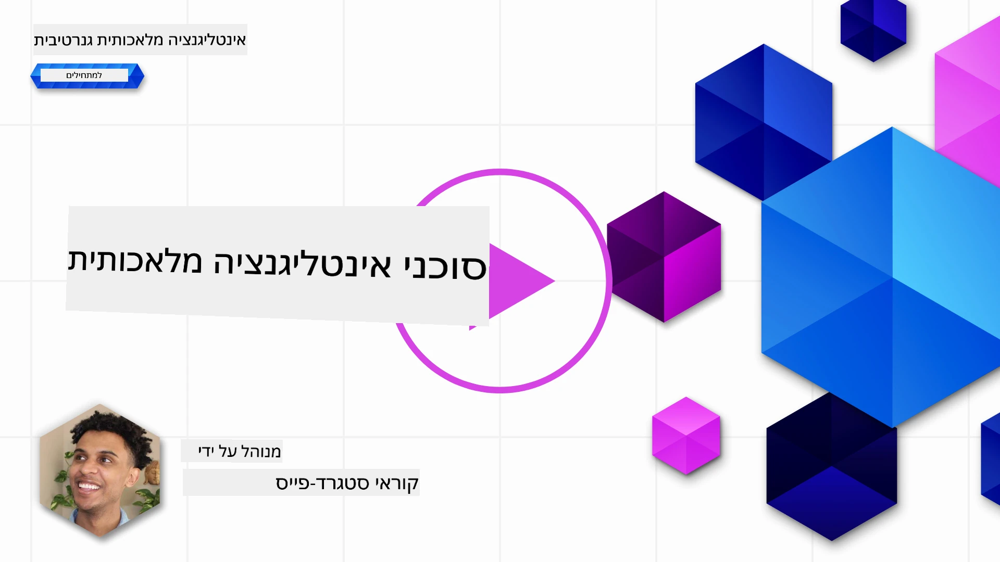
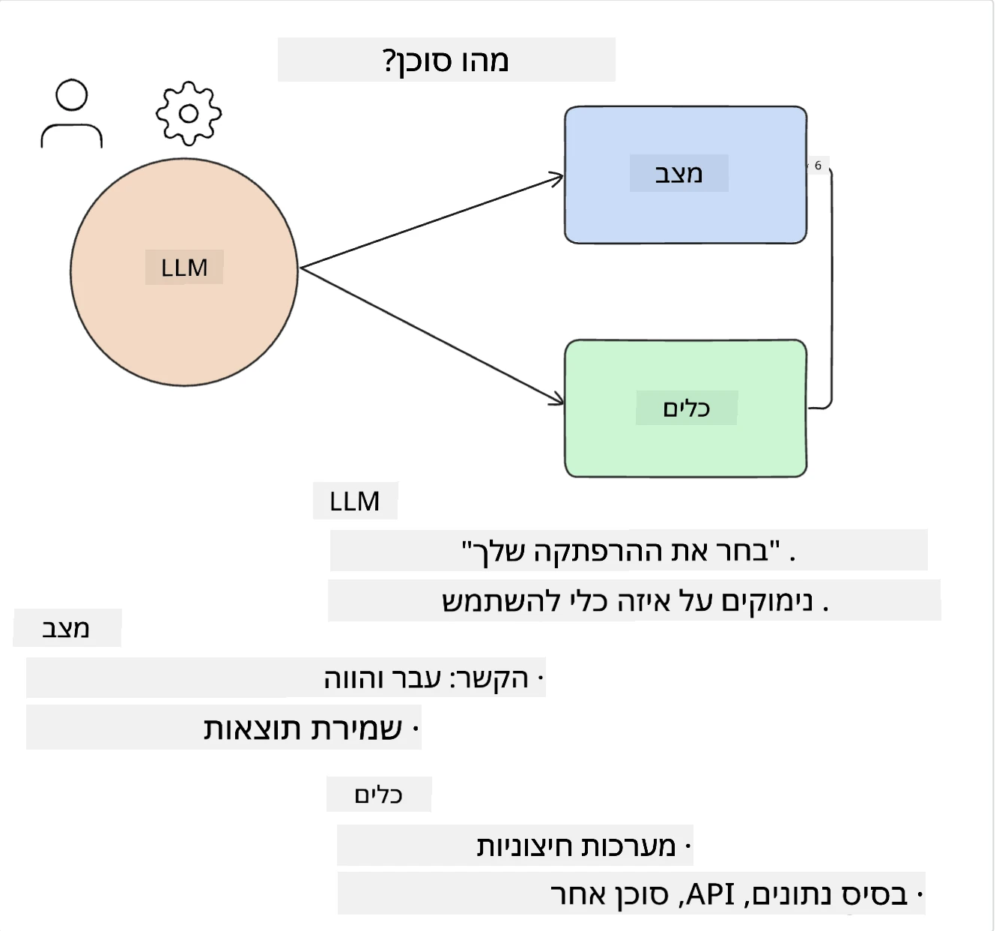
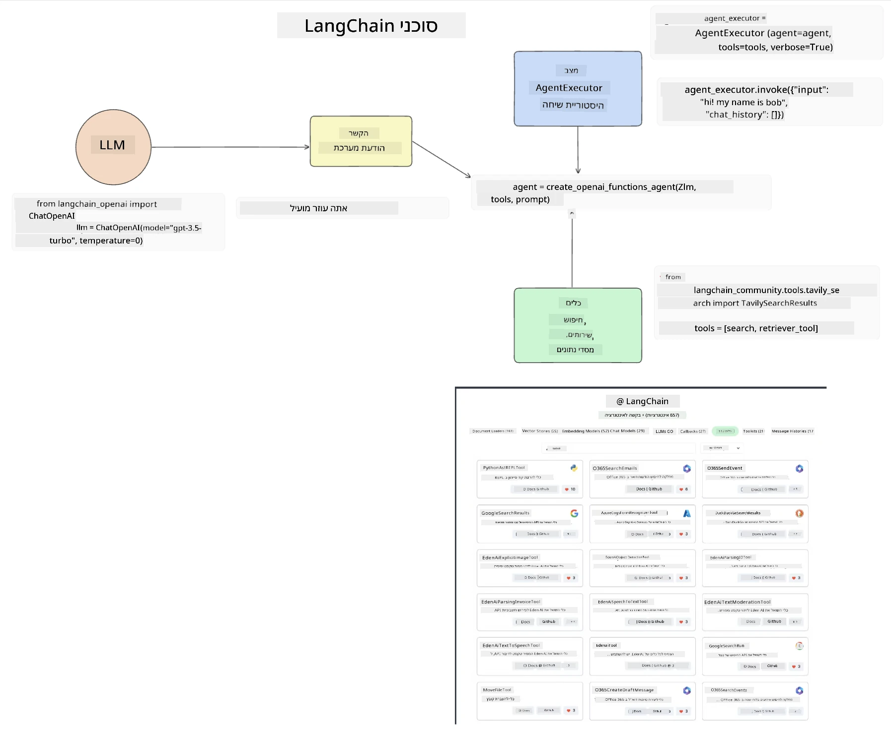
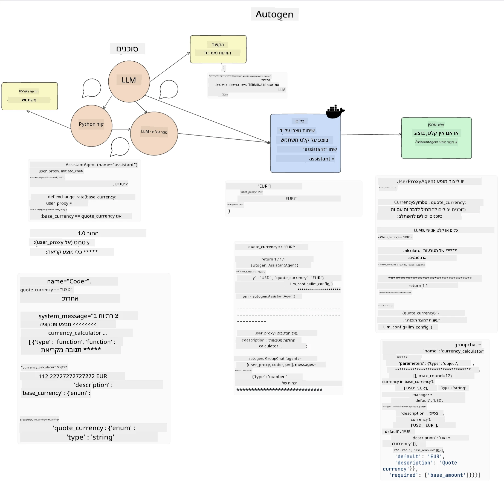
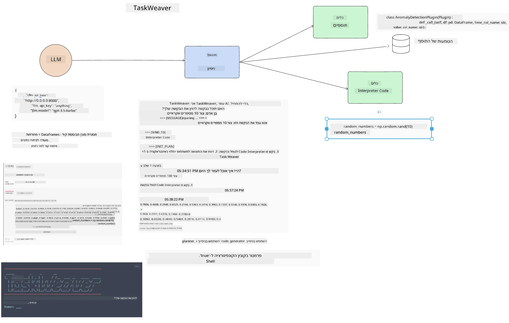
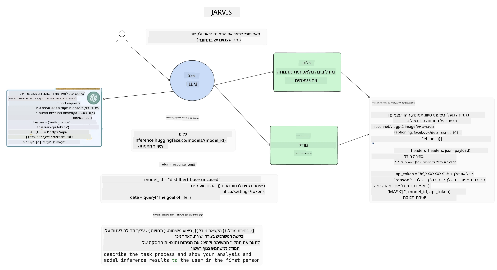

[](https://youtu.be/yAXVW-lUINc?si=bOtW9nL6jc3XJgOM)

## مقدمة

סוכני בינה מלאכותית מייצגים פיתוח מרתק בבינה מלאכותית גנרטיבית, ומאפשרים למודלים שפתיים גדולים (LLMs) להתפתח מעוזרים לסוכנים המסוגלים לבצע פעולות. מסגרות סוכני בינה מלאכותית מאפשרות למפתחים ליצור יישומים שנותנים ל-LLMs גישה לכלים ולניהול מצב. מסגרות אלה גם משפרות את השקיפות, המאפשרת למשתמשים ולמפתחים לעקוב אחר הפעולות המתוכננות על ידי ה-LLMs, ובכך משפרות את ניהול החוויה.

השיעור יכסה את התחומים הבאים:

- הבנה מהו סוכן בינה מלאכותית - מה בדיוק זה סוכן בינה מלאכותית?
- חקירת ארבע מסגרות סוכן שונות - מה מייחד אותן?
- יישום סוכני בינה מלאכותית שונים במקרים שונים - מתי צריך להשתמש בסוכני בינה מלאכותית?

## מטרות הלמידה

לאחר שלקחת את השיעור הזה, תוכל/י:

- להסביר מה הם סוכני בינה מלאכותית וכיצד ניתן להשתמש בהם.
- להבין את ההבדלים בין כמה ממסגרות סוכני הבינה המלאכותית הפופולריות, ואיך הן שונות.
- להבין כיצד סוכני בינה מלאכותית מתפקדים כדי לבנות יישומים בעזרתם.

## מה הם סוכני בינה מלאכותית?

סוכני בינה מלאכותית הם תחום מרתק מאד בעולם הבינה המלאכותית הגנרטיבית. עם ההתרגשות הזו לעיתים מגיע בלבול במונחים ובשימושיהם. כדי לשמור על פשטות ולהכליל את רוב הכלים המתייחסים לסוכני בינה מלאכותית, נשתמש בהגדרה הבאה:

סוכני בינה מלאכותית מאפשרים למודלים שפתיים גדולים (LLMs) לבצע משימות על ידי מתן גישה ל**מצב** ול**כלים**.



בוא נגדיר את המונחים:

**מודלים שפתיים גדולים** - אלו המודלים שמוזכרים לאורך הקורס כגון GPT-3.5, GPT-4, Llama-2 ועוד.

**מצב** - מתייחס להקשר שבו ה-LLM עובד. ה-LLM משתמש בהקשר של פעולות עבר שלו ובהקשר הנוכחי, המכוון את קבלת ההחלטות לפעולות הבאות. מסגרות סוכני בינה מלאכותית מאפשרות למפתחים לנהל הקשר זה בצורה נוחה יותר.

**כלים** - כדי להשלים את המשימה שהמשתמש ביקש ואת מה ש-LLM תכנן, ה-LLM זקוק לגישה לכלים. כמה דוגמאות לכלים יכולים להיות בסיס נתונים, API, יישום חיצוני ואפילו LLM נוסף!

ההגדרות האלה אמורות לתת לך בסיס טוב להמשך כשנבחן כיצד הם מיושמים. בואו נחקור כמה מסגרות סוכני בינה מלאכותית שונות:

## סוכני LangChain

[סוכני LangChain](https://python.langchain.com/docs/how_to/#agents?WT.mc_id=academic-105485-koreyst) הם מימוש של ההגדרות שנתנו לעיל.

כדי לנהל את ה**מצב**, משתמשים בפונקציה מובנית בשם `AgentExecutor`. פונקציה זו מקבלת את ה-`agent` המוגדר ואת ה-`tools` הזמינים לו.

`Agent Executor` גם מאחסן את היסטוריית השיחה כדי לספק את ההקשר של השיחה.



LangChain מציע [קטלוג של כלים](https://integrations.langchain.com/tools?WT.mc_id=academic-105485-koreyst) שניתן לייבא ליישום שלך ואליהם ה-LLM יכול לקבל גישה. כלים אלו נוצרים על ידי הקהילה ועל ידי צוות LangChain.

אתה יכול להגדיר את הכלים האלו ולהעביר אותם ל-`Agent Executor`.

שקיפות היא היבט חשוב נוסף כשמדברים על סוכני בינה מלאכותית. חשוב למפתחים להבין איזה כלי ה-LLM משתמש ולמה. לשם כך, צוות LangChain פיתח את LangSmith.

## AutoGen

מסגרת סוכן הבינה המלאכותית הבאה נדבר עליה היא [AutoGen](https://microsoft.github.io/autogen/?WT.mc_id=academic-105485-koreyst). המוקד העיקרי של AutoGen הוא בשיחות. הסוכנים הם גם **שיחניים** וגם **ניתנים להתאמה אישית**.

**שיחניים -** LLMs יכולים להתחיל ולהמשיך שיחה עם LLM אחר כדי להשלים משימה. זה נעשה על ידי יצירת `AssistantAgents` ומתן הודעת מערכת ספציפית להם.

```python

autogen.AssistantAgent( name="Coder", llm_config=llm_config, ) pm = autogen.AssistantAgent( name="Product_manager", system_message="Creative in software product ideas.", llm_config=llm_config, )

```

**ניתנים להתאמה אישית** - סוכנים יכולים להיות מוגדרים לא רק כלמידל שפה גדול אלא גם כמשתמש או ככלי. כמפתח, ניתן להגדיר `UserProxyAgent` האחראי על אינטראקציה עם המשתמש לקבלת משוב לביצוע המשימה. המשוב יכול להמשיך בביצוע המשימה או להפסיקה.

```python
user_proxy = UserProxyAgent(name="user_proxy")
```

### מצב וכלים

כדי לשנות ולנהל את המצב, סוכן עוזר (assistant) מייצר קוד Python כדי להשלים את המשימה.

הנה דוגמה לתהליך:



#### LLM מוגדר עם הודעת מערכת

```python
system_message="For weather related tasks, only use the functions you have been provided with. Reply TERMINATE when the task is done."
```

הודעת המערכת הזו מכוונת את ה-LLM הספציפי אילו פונקציות רלוונטיות למשימה שלו. זכור, עם AutoGen ניתן להגדיר מספר `AssistantAgents` עם הודעות מערכת שונות.

#### השיחה מתחילה על ידי המשתמש

```python
user_proxy.initiate_chat( chatbot, message="I am planning a trip to NYC next week, can you help me pick out what to wear? ", )

```

הודעה זו מ-`user_proxy` (אדם) היא מה שתתחיל את תהליך הסוכן לחקור את הפונקציות שעליו לבצע.

#### הפונקציה מבוצעת

```bash
chatbot (to user_proxy):

***** Suggested tool Call: get_weather ***** Arguments: {"location":"New York City, NY","time_periond:"7","temperature_unit":"Celsius"} ******************************************************** --------------------------------------------------------------------------------

>>>>>>>> EXECUTING FUNCTION get_weather... user_proxy (to chatbot): ***** Response from calling function "get_weather" ***** 112.22727272727272 EUR ****************************************************************

```

לאחר עיבוד השיחה ההתחלתית, הסוכן ישלח את ההצעה להפעיל כלי. במקרה זה, זו פונקציה שנקראת `get_weather`. בהתאם להגדרות, פונקציה זו יכולה להיות מופעלת אוטומטית ולהיקרא על ידי הסוכן או להפעיל על בסיס קלט מהמשתמש.

ניתן למצוא רשימת [דוגמאות קוד AutoGen](https://microsoft.github.io/autogen/docs/Examples/?WT.mc_id=academic-105485-koreyst) לחקירה נוספת כיצד להתחיל בבנייה.

## Taskweaver

מסגרת הסוכן הבאה שנחקור היא [Taskweaver](https://microsoft.github.io/TaskWeaver/?WT.mc_id=academic-105485-koreyst). היא ידועה כסוכן "קוד-ראשון" כי במקום לעבוד רק עם `strings`, היא יכולה לעבוד עם DataFrames בפייתון. זה הופך שימושי מאד למשימות של ניתוח ויצירת נתונים. לדוגמה יצירת גרפים וטבלאות או יצירת מספרים אקראיים.

### מצב וכלים

כדי לנהל את מצב השיחה, TaskWeaver משתמשת במושג `Planner`. ה-`Planner` הוא LLM שלוקח את הבקשה מהמשתמשים וממפה את המשימות שיש להשלים למימוש הבקשה.

כדי להשלים את המשימות, ה-`Planner` נחשף לאוסף כלים הנקראים `Plugins`. אלה יכולים להיות מחלקות פייתון או מפענח קוד כללי. הפלאגינים נשמרים כסמלים (embeddings) כדי שה-LLM יוכל לחפש טוב יותר את הפלאגין המתאים.



זו דוגמה לפלאגין שיטפל בגילוי חריגות:

```python
class AnomalyDetectionPlugin(Plugin): def __call__(self, df: pd.DataFrame, time_col_name: str, value_col_name: str):
```

הקוד נבדק לפני ביצוע. תכונה נוספת לניהול ההקשר ב-Taskweaver היא 'חווייה' (experience). חווייה מאפשרת לאחסן את הקשר השיחה לטווח ארוך בקובץ YAML. ניתן להגדיר זאת כך שה-LLM ישפר עם הזמן במשימות מסוימות כשנחשף לשיחות קודמות.

## JARVIS

מסגרת הסוכן האחרונה שנחקור היא [JARVIS](https://github.com/microsoft/JARVIS?tab=readme-ov-file&WT.mc_id=academic-105485-koreyst). מה שמייחד את JARVIS הוא שהוא משתמש ב-LLM כדי לנהל את ה`state` של השיחה ו`tools` הם דגמי AI אחרים. כל אחד מהדגמים המקצועיים מבצע משימות ספציפיות כמו זיהוי עצמים, תמלול או כיתוב תמונות.



ה-LLM, שמודל למטרות כלליות, מקבל את הבקשה מהמשתמש ומזהה את המשימה הספציפית ואת כל הטיעונים/נתונים הדרושים להשלמת המשימה.

```python
[{"task": "object-detection", "id": 0, "dep": [-1], "args": {"image": "e1.jpg" }}]
```

ה-LLM מעצב אז את הבקשה בצורה שהמודל המיוחד של ה-AI יכול לפרש, כגון JSON. לאחר שהמודל החזיר את הניבוי שלו על בסיס המשימה, ה-LLM מקבל את התגובה.

אם יש צורך בדגמים מרובים להשלמת המשימה, הוא גם יפרש את התגובה מדגמים אלה לפני שיאחד אותם ליצירת תגובה למשתמש.

הדוגמה למטה מראה כיצד זה יעבוד כאשר משתמש מבקש תיאור ומספר של העזרים בתמונה:

## מטלה

כדי להמשיך את לימודיך על סוכני בינה מלאכותית אתה יכול לבנות עם AutoGen:

- יישום המודל סימולציית ישיבת עסקים עם מחלקות שונות בסטארטאפ חינוכי.
- יצירת הודעות מערכת המכוונות את ה-LLMs להבנת פרסונות ופריוריטיז שונות, ומאפשרות למשתמש להציג רעיון מוצר חדש.
- ה-LLM ייצור אז שאלות המשך מכל מחלקה כדי לדייק ולשפר את ההצגה ורעיון המוצר.

## הלמידה לא מסתיימת כאן, המשך את המסע

לאחר סיום השיעור, בדוק את אוסף הלמידה שלנו ל- [בינה מלאכותית גנרטיבית](https://aka.ms/genai-collection?WT.mc_id=academic-105485-koreyst) כדי להמשיך להשתפר בידע שלך בבינה מלאכותית גנרטיבית!

---

<!-- CO-OP TRANSLATOR DISCLAIMER START -->
**הצהרת פרסום**:
מסמך זה תורגם באמצעות שירות תרגום מבוסס בינה מלאכותית [Co-op Translator](https://github.com/Azure/co-op-translator). למרות שאנו שואפים לדיוק, יש להיות מודעים לכך שתרגומים אוטומטיים עלולים להכיל שגיאות או אי-דיוקים. המסמך המקורי בשפתו המקורית צריך להיחשב כמקור הרשמי. עבור מידע קריטי מומלץ להשתמש בתרגום מקצועי על ידי מתרגם אנושי. אנו לא אחראים על אי-הבנות או פרשנויות שגויות הנובעות משימוש בתרגום זה.
<!-- CO-OP TRANSLATOR DISCLAIMER END -->