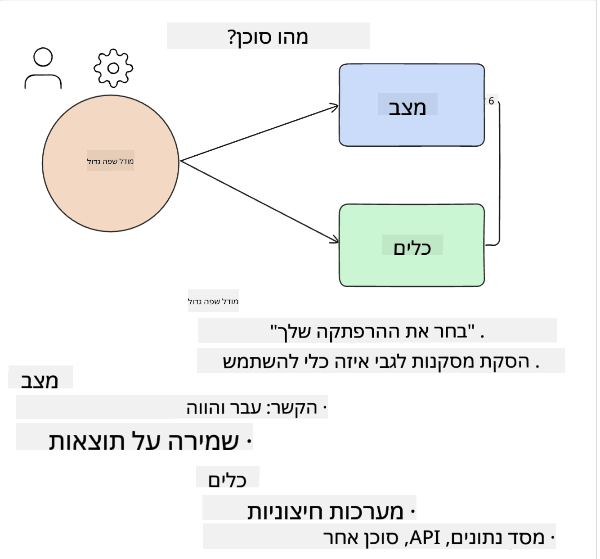
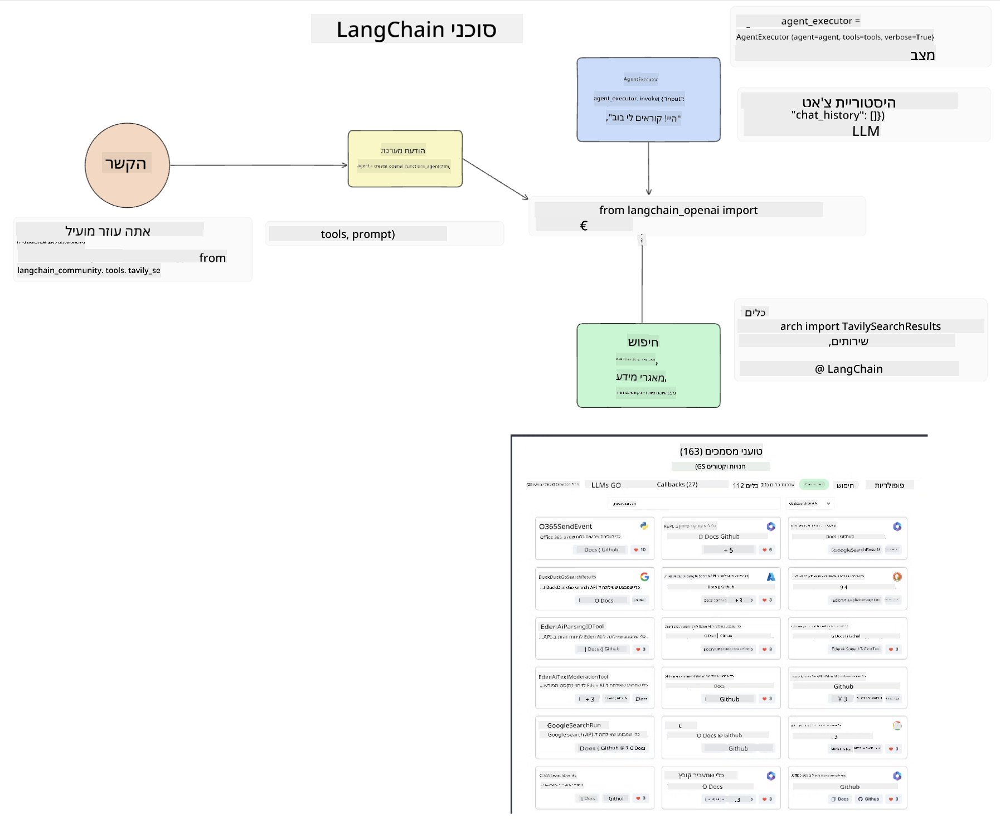

<!--
CO_OP_TRANSLATOR_METADATA:
{
  "original_hash": "8e8d1f6a63da606af7176a87ff8e92b6",
  "translation_date": "2025-10-17T20:09:37+00:00",
  "source_file": "17-ai-agents/README.md",
  "language_code": "he"
}
-->
[](https://youtu.be/yAXVW-lUINc?si=bOtW9nL6jc3XJgOM)

## הקדמה

סוכני AI מייצגים התפתחות מרגשת בתחום הבינה המלאכותית הגנרטיבית, ומאפשרים למודלים שפה גדולים (LLMs) להתפתח מעוזרים לסוכנים המסוגלים לבצע פעולות. מסגרות סוכני AI מאפשרות למפתחים ליצור יישומים שמעניקים ל-LLMs גישה לכלים וניהול מצב. מסגרות אלו גם משפרות את השקיפות, ומאפשרות למשתמשים ולמפתחים לעקוב אחר הפעולות המתוכננות על ידי LLMs, ובכך לשפר את ניהול החוויה.

השיעור יעסוק בנושאים הבאים:

- הבנת מהו סוכן AI - מה בדיוק הוא סוכן AI?
- חקר ארבע מסגרות סוכני AI שונות - מה הופך אותן לייחודיות?
- יישום סוכני AI אלו במקרים שונים - מתי כדאי להשתמש בסוכני AI?

## מטרות למידה

לאחר השיעור, תוכלו:

- להסביר מה הם סוכני AI וכיצד ניתן להשתמש בהם.
- להבין את ההבדלים בין כמה ממסגרות סוכני AI הפופולריות וכיצד הן שונות זו מזו.
- להבין כיצד סוכני AI פועלים כדי לבנות יישומים באמצעותם.

## מה הם סוכני AI?

סוכני AI הם תחום מרתק בעולם הבינה המלאכותית הגנרטיבית. עם ההתרגשות מגיעה לעיתים גם בלבול במונחים ובשימושם. כדי לשמור על הדברים פשוטים ומקיפים את רוב הכלים שמתייחסים לסוכני AI, נשתמש בהגדרה הבאה:

סוכני AI מאפשרים למודלים שפה גדולים (LLMs) לבצע משימות על ידי מתן גישה ל**מצב** ו**כלים**.



בואו נגדיר את המונחים הללו:

**מודלים שפה גדולים** - אלו הם המודלים המוזכרים לאורך הקורס, כמו GPT-3.5, GPT-4, Llama-2 וכו'.

**מצב** - מתייחס להקשר שבו ה-LLM פועל. ה-LLM משתמש בהקשר של פעולותיו הקודמות וההקשר הנוכחי, כדי להנחות את קבלת ההחלטות שלו לפעולות הבאות. מסגרות סוכני AI מאפשרות למפתחים לשמור על הקשר זה בצורה קלה יותר.

**כלים** - כדי להשלים את המשימה שהמשתמש ביקש ושאותה תכנן ה-LLM, ה-LLM זקוק לגישה לכלים. דוגמאות לכלים יכולות להיות מסד נתונים, API, יישום חיצוני או אפילו LLM אחר!

ההגדרות הללו אמורות לספק לכם בסיס טוב להמשך, כשנבחן כיצד הן מיושמות. בואו נחקור כמה מסגרות סוכני AI שונות:

## סוכני LangChain

[סוכני LangChain](https://python.langchain.com/docs/how_to/#agents?WT.mc_id=academic-105485-koreyst) הם יישום של ההגדרות שסיפקנו לעיל.

כדי לנהל את ה**מצב**, הם משתמשים בפונקציה מובנית בשם `AgentExecutor`. פונקציה זו מקבלת את ה-`agent` המוגדר ואת ה-`tools` הזמינים לו.

ה-`AgentExecutor` גם שומר את היסטוריית השיחה כדי לספק את הקשר השיחה.



LangChain מציע [קטלוג כלים](https://integrations.langchain.com/tools?WT.mc_id=academic-105485-koreyst) שניתן לייבא ליישום שלכם, בו ה-LLM יכול לקבל גישה. כלים אלו נוצרו על ידי הקהילה ועל ידי צוות LangChain.

לאחר מכן תוכלו להגדיר את הכלים הללו ולהעבירם ל-`AgentExecutor`.

שקיפות היא היבט חשוב נוסף כשמדברים על סוכני AI. חשוב למפתחי יישומים להבין איזה כלי ה-LLM משתמש ולמה. לשם כך, צוות LangChain פיתח את LangSmith.

## AutoGen

מסגרת סוכני AI הבאה שנדון בה היא [AutoGen](https://microsoft.github.io/autogen/?WT.mc_id=academic-105485-koreyst). המיקוד העיקרי של AutoGen הוא שיחות. סוכנים הם גם **שיחיים** וגם **מותאמים אישית**.

**שיחיים -** LLMs יכולים להתחיל ולהמשיך שיחה עם LLM אחר כדי להשלים משימה. הדבר נעשה על ידי יצירת `AssistantAgents` ומתן הודעת מערכת ספציפית.

```python

autogen.AssistantAgent( name="Coder", llm_config=llm_config, ) pm = autogen.AssistantAgent( name="Product_manager", system_message="Creative in software product ideas.", llm_config=llm_config, )

```

**מותאמים אישית** - סוכנים יכולים להיות מוגדרים לא רק כ-LLMs אלא גם כמשתמש או כלי. כמפתח, תוכלו להגדיר `UserProxyAgent` שאחראי על אינטראקציה עם המשתמש לקבלת משוב להשלמת משימה. משוב זה יכול להמשיך את ביצוע המשימה או לעצור אותה.

```python
user_proxy = UserProxyAgent(name="user_proxy")
```

### מצב וכלים

כדי לשנות ולנהל מצב, סוכן עוזר מייצר קוד Python להשלמת המשימה.

הנה דוגמה לתהליך:


#### LLM מוגדר עם הודעת מערכת

```python
system_message="For weather related tasks, only use the functions you have been provided with. Reply TERMINATE when the task is done."
```

הודעת מערכת זו מכוונת את ה-LLM הספציפי לאילו פונקציות רלוונטיות למשימתו. זכרו, עם AutoGen תוכלו להגדיר מספר AssistantAgents עם הודעות מערכת שונות.

#### השיחה מתחילה על ידי המשתמש

```python
user_proxy.initiate_chat( chatbot, message="I am planning a trip to NYC next week, can you help me pick out what to wear? ", )

```

הודעה זו מ-`user_proxy` (אדם) היא מה שיתחיל את תהליך הסוכן לחקור את הפונקציות האפשריות שהוא צריך לבצע.

#### הפונקציה מבוצעת

```bash
chatbot (to user_proxy):

***** Suggested tool Call: get_weather ***** Arguments: {"location":"New York City, NY","time_periond:"7","temperature_unit":"Celsius"} ******************************************************** --------------------------------------------------------------------------------

>>>>>>>> EXECUTING FUNCTION get_weather... user_proxy (to chatbot): ***** Response from calling function "get_weather" ***** 112.22727272727272 EUR ****************************************************************

```

לאחר עיבוד השיחה הראשונית, הסוכן ישלח את הכלי המוצע לשימוש. במקרה זה, מדובר בפונקציה בשם `get_weather`. בהתאם להגדרות שלכם, פונקציה זו יכולה להתבצע אוטומטית ולהיקרא על ידי הסוכן או להתבצע על בסיס קלט המשתמש.

תוכלו למצוא רשימה של [דוגמאות קוד AutoGen](https://microsoft.github.io/autogen/docs/Examples/?WT.mc_id=academic-105485-koreyst) כדי לחקור עוד כיצד להתחיל לבנות.

## Taskweaver

מסגרת הסוכנים הבאה שנחקור היא [Taskweaver](https://microsoft.github.io/TaskWeaver/?WT.mc_id=academic-105485-koreyst). היא ידועה כסוכן "קוד-תחילה" מכיוון שבמקום לעבוד רק עם `strings`, היא יכולה לעבוד עם DataFrames ב-Python. הדבר הופך להיות שימושי במיוחד עבור משימות ניתוח נתונים ויצירה. זה יכול להיות דברים כמו יצירת גרפים ותרשימים או יצירת מספרים אקראיים.

### מצב וכלים

כדי לנהל את מצב השיחה, TaskWeaver משתמשת במושג של `Planner`. ה-`Planner` הוא LLM שמקבל את הבקשה מהמשתמשים וממפה את המשימות שצריך להשלים כדי למלא את הבקשה.

כדי להשלים את המשימות, ה-`Planner` נחשף לאוסף כלים שנקרא `Plugins`. אלו יכולים להיות מחלקות Python או מפרש קוד כללי. הפלאגינים הללו נשמרים כ-embeddings כך שה-LLM יוכל לחפש טוב יותר את הפלאגין הנכון.


הנה דוגמה לפלאגין לטיפול בזיהוי חריגות:

```python
class AnomalyDetectionPlugin(Plugin): def __call__(self, df: pd.DataFrame, time_col_name: str, value_col_name: str):
```

הקוד מאומת לפני ביצוע. תכונה נוספת לניהול הקשר ב-Taskweaver היא `experience`. ה-`experience` מאפשר לשמור את הקשר השיחה לטווח הארוך בקובץ YAML. ניתן להגדיר זאת כך שה-LLM ישתפר לאורך זמן במשימות מסוימות בהתבסס על שיחות קודמות.

## JARVIS

מסגרת הסוכנים האחרונה שנחקור היא [JARVIS](https://github.com/microsoft/JARVIS?tab=readme-ov-file?WT.mc_id=academic-105485-koreyst). מה שהופך את JARVIS לייחודי הוא שהוא משתמש ב-LLM לניהול ה`מצב` של השיחה וה`כלים` הם מודלים AI אחרים. כל אחד ממודלי ה-AI הם מודלים מתמחים שמבצעים משימות מסוימות כמו זיהוי אובייקטים, תמלול או תיאור תמונות.


ה-LLM, בהיותו מודל כללי, מקבל את הבקשה מהמשתמש ומזהה את המשימה הספציפית ואת כל הפרמטרים/נתונים הדרושים להשלמת המשימה.

```python
[{"task": "object-detection", "id": 0, "dep": [-1], "args": {"image": "e1.jpg" }}]
```

ה-LLM לאחר מכן מעצב את הבקשה בצורה שהמודל AI המתמחה יכול להבין, כמו JSON. לאחר שהמודל AI החזיר את התחזית שלו על בסיס המשימה, ה-LLM מקבל את התגובה.

אם נדרשים מספר מודלים להשלמת המשימה, הוא גם יפרש את התגובה מהמודלים הללו לפני שיאחד אותם ליצירת התגובה למשתמש.

הדוגמה הבאה מראה כיצד זה יעבוד כאשר משתמש מבקש תיאור ומספר של אובייקטים בתמונה:

## משימה

כדי להמשיך ללמוד על סוכני AI תוכלו לבנות עם AutoGen:

- יישום שמדמה פגישת עסקים עם מחלקות שונות של סטארטאפ חינוכי.
- יצירת הודעות מערכת שמנחות את ה-LLMs להבין דמויות שונות וקדימויות, ומאפשרות למשתמש להציג רעיון למוצר חדש.
- ה-LLM צריך לאחר מכן ליצור שאלות המשך מכל מחלקה כדי לחדד ולשפר את הרעיון והמוצר.

## הלמידה לא נגמרת כאן, המשיכו במסע

לאחר סיום השיעור, בדקו את [אוסף הלמידה של בינה מלאכותית גנרטיבית](https://aka.ms/genai-collection?WT.mc_id=academic-105485-koreyst) כדי להמשיך ולהעמיק את הידע שלכם בבינה מלאכותית גנרטיבית!

---

**כתב ויתור**:  
מסמך זה תורגם באמצעות שירות תרגום AI [Co-op Translator](https://github.com/Azure/co-op-translator). למרות שאנו שואפים לדיוק, יש להיות מודעים לכך שתרגומים אוטומטיים עשויים להכיל שגיאות או אי דיוקים. המסמך המקורי בשפתו המקורית צריך להיחשב כמקור סמכותי. עבור מידע קריטי, מומלץ להשתמש בתרגום מקצועי אנושי. איננו אחראים לאי הבנות או לפרשנויות שגויות הנובעות משימוש בתרגום זה.