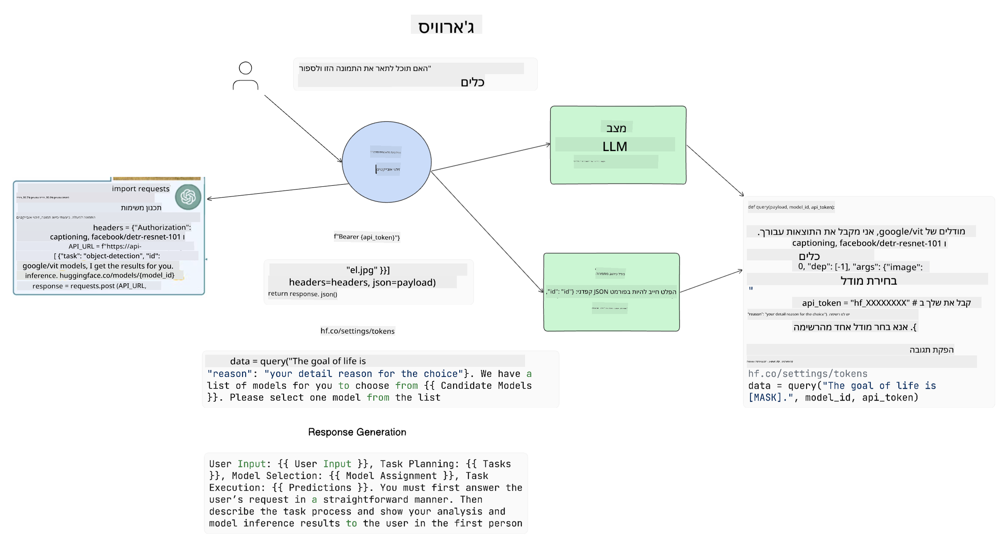

<!--
CO_OP_TRANSLATOR_METADATA:
{
  "original_hash": "11f03c81f190d9cbafd0f977dcbede6c",
  "translation_date": "2025-07-09T17:27:59+00:00",
  "source_file": "17-ai-agents/README.md",
  "language_code": "he"
}
-->
[](https://aka.ms/gen-ai-lesson17-gh?WT.mc_id=academic-105485-koreyst)

## מבוא

סוכני AI מייצגים התפתחות מרגשת בתחום ה-Generative AI, המאפשרת למודלים גדולים של שפה (LLMs) להתפתח מעוזרים לסוכנים המסוגלים לבצע פעולות. מסגרות עבודה לסוכני AI מאפשרות למפתחים ליצור יישומים שנותנים ל-LLMs גישה לכלים ולניהול מצב. מסגרות אלו גם משפרות את השקיפות, ומאפשרות למשתמשים ולמפתחים לעקוב אחר הפעולות המתוכננות על ידי ה-LLMs, ובכך לשפר את ניהול החוויה.

השיעור יעסוק בנושאים הבאים:

- הבנת מהו סוכן AI - מה בעצם זה סוכן AI?
- חקר ארבע מסגרות עבודה שונות לסוכני AI - מה מייחד כל אחת מהן?
- יישום סוכני AI במקרים שונים - מתי כדאי להשתמש בסוכני AI?

## מטרות הלמידה

לאחר שיעור זה, תוכל:

- להסביר מה הם סוכני AI וכיצד ניתן להשתמש בהם.
- להבין את ההבדלים בין כמה מהמסגרות הפופולריות לסוכני AI, וכיצד הן שונות זו מזו.
- להבין כיצד סוכני AI פועלים כדי לבנות יישומים באמצעותם.

## מה הם סוכני AI?

סוכני AI הם תחום מרתק מאוד בעולם ה-Generative AI. עם ההתרגשות הזו לפעמים מגיע בלבול במונחים וביישומם. כדי לשמור על פשטות ולהיות כוללניים לרוב הכלים המתייחסים לסוכני AI, נשתמש בהגדרה הבאה:

סוכני AI מאפשרים למודלים גדולים של שפה (LLMs) לבצע משימות על ידי מתן גישה ל**מצב** ו**כלים**.


נגדיר את המונחים הללו:

**מודלים גדולים של שפה** - אלו הם המודלים המוזכרים לאורך הקורס, כגון GPT-3.5, GPT-4, Llama-2 ועוד.

**מצב** - מתייחס להקשר שבו ה-LLM פועל. ה-LLM משתמש בהקשר של פעולותיו הקודמות ובהקשר הנוכחי כדי להנחות את קבלת ההחלטות לפעולות הבאות. מסגרות עבודה לסוכני AI מאפשרות למפתחים לנהל הקשר זה בקלות רבה יותר.

**כלים** - כדי להשלים את המשימה שהמשתמש ביקש ושה-LLM תכנן, ה-LLM זקוק לגישה לכלים. דוגמאות לכלים יכולים להיות מסד נתונים, API, אפליקציה חיצונית או אפילו LLM נוסף!

הגדרות אלו אמורות לספק בסיס טוב להמשך כשנבחן כיצד הם מיושמים. בואו נחקור כמה מסגרות עבודה שונות לסוכני AI:

## סוכני LangChain

[סוכני LangChain](https://python.langchain.com/docs/how_to/#agents?WT.mc_id=academic-105485-koreyst) הם מימוש של ההגדרות שסיפקנו לעיל.

כדי לנהל את ה**מצב**, הוא משתמש בפונקציה מובנית בשם `AgentExecutor`. פונקציה זו מקבלת את ה-`agent` שהוגדר ואת ה-`tools` הזמינים לו.

ה-`Agent Executor` גם שומר את היסטוריית השיחה כדי לספק את הקשר השיחה.


LangChain מציעה [קטלוג של כלים](https://integrations.langchain.com/tools?WT.mc_id=academic-105485-koreyst) שניתן לייבא ליישום שלך ולקבל אליהם גישה דרך ה-LLM. כלים אלו נוצרו על ידי הקהילה וצוות LangChain.

אתה יכול להגדיר את הכלים הללו ולהעבירם ל-`Agent Executor`.

שקיפות היא היבט חשוב נוסף כשמדברים על סוכני AI. חשוב שמפתחי יישומים יבינו איזה כלי ה-LLM משתמש ולמה. לשם כך, צוות LangChain פיתח את LangSmith.

## AutoGen

מסגרת העבודה הבאה לסוכני AI שנדון בה היא [AutoGen](https://microsoft.github.io/autogen/?WT.mc_id=academic-105485-koreyst). המוקד המרכזי של AutoGen הוא שיחות. סוכנים הם גם **שיחניים** וגם **ניתנים להתאמה**.

**שיחניים -** LLMs יכולים להתחיל ולהמשיך שיחה עם LLM אחר כדי להשלים משימה. זה נעשה על ידי יצירת `AssistantAgents` ומתן הודעת מערכת ספציפית להם.

```python

autogen.AssistantAgent( name="Coder", llm_config=llm_config, ) pm = autogen.AssistantAgent( name="Product_manager", system_message="Creative in software product ideas.", llm_config=llm_config, )

```

**ניתנים להתאמה** - סוכנים יכולים להיות מוגדרים לא רק כלמודלים אלא גם כמשתמש או ככלי. כמפתח, אתה יכול להגדיר `UserProxyAgent` שאחראי על אינטראקציה עם המשתמש לקבלת משוב להשלמת המשימה. משוב זה יכול להמשיך את ביצוע המשימה או לעצור אותה.

```python
user_proxy = UserProxyAgent(name="user_proxy")
```

### מצב וכלים

כדי לשנות ולנהל את המצב, סוכן העוזר מייצר קוד Python להשלמת המשימה.

הנה דוגמה לתהליך:


#### LLM מוגדר עם הודעת מערכת

```python
system_message="For weather related tasks, only use the functions you have been provided with. Reply TERMINATE when the task is done."
```

הודעת מערכת זו מכוונת את ה-LLM הספציפי אילו פונקציות רלוונטיות למשימה שלו. זכור, עם AutoGen ניתן להגדיר מספר AssistantAgents עם הודעות מערכת שונות.

#### השיחה מתחילה על ידי המשתמש

```python
user_proxy.initiate_chat( chatbot, message="I am planning a trip to NYC next week, can you help me pick out what to wear? ", )

```

הודעה זו מה-user_proxy (בן אדם) היא שתתחיל את תהליך הסוכן לחקור את הפונקציות האפשריות שעליו לבצע.

#### פונקציה מתבצעת

```bash
chatbot (to user_proxy):

***** Suggested tool Call: get_weather ***** Arguments: {"location":"New York City, NY","time_periond:"7","temperature_unit":"Celsius"} ******************************************************** --------------------------------------------------------------------------------

>>>>>>>> EXECUTING FUNCTION get_weather... user_proxy (to chatbot): ***** Response from calling function "get_weather" ***** 112.22727272727272 EUR ****************************************************************

```

לאחר עיבוד השיחה הראשונית, הסוכן ישלח את ההצעה לקרוא לכלי. במקרה זה, זו פונקציה בשם `get_weather`. בהתאם להגדרות שלך, פונקציה זו יכולה להתבצע אוטומטית ולהיקרא על ידי הסוכן או להתבצע על בסיס קלט המשתמש.

תוכל למצוא רשימה של [דוגמאות קוד ל-AutoGen](https://microsoft.github.io/autogen/docs/Examples/?WT.mc_id=academic-105485-koreyst) כדי להעמיק כיצד להתחיל לבנות.

## Taskweaver

מסגרת הסוכן הבאה שנחקור היא [Taskweaver](https://microsoft.github.io/TaskWeaver/?WT.mc_id=academic-105485-koreyst). היא ידועה כסוכן "קוד-ראשון" כי במקום לעבוד רק עם `strings`, היא יכולה לעבוד עם DataFrames בפייתון. זה שימושי מאוד למשימות ניתוח ויצירת נתונים, כמו יצירת גרפים ותרשימים או יצירת מספרים אקראיים.

### מצב וכלים

כדי לנהל את מצב השיחה, TaskWeaver משתמשת במושג `Planner`. ה-`Planner` הוא LLM שלוקח את הבקשה מהמשתמשים וממפה את המשימות שצריך להשלים כדי למלא בקשה זו.

כדי להשלים את המשימות, ה-`Planner` נחשף לאוסף כלים הנקראים `Plugins`. אלו יכולים להיות מחלקות פייתון או מפרש קוד כללי. תוספים אלו מאוחסנים כהטמעות (embeddings) כדי שה-LLM יוכל לחפש טוב יותר את התוסף המתאים.


הנה דוגמה לתוסף לטיפול בזיהוי חריגות:

```python
class AnomalyDetectionPlugin(Plugin): def __call__(self, df: pd.DataFrame, time_col_name: str, value_col_name: str):
```

הקוד מאומת לפני ההרצה. תכונה נוספת לניהול הקשר ב-Taskweaver היא `experience`. Experience מאפשר לשמור את הקשר השיחה לטווח ארוך בקובץ YAML. ניתן להגדיר זאת כך שה-LLM ישתפר עם הזמן במשימות מסוימות, בהינתן שהוא נחשף לשיחות קודמות.

## JARVIS

מסגרת הסוכן האחרונה שנחקור היא [JARVIS](https://github.com/microsoft/JARVIS?tab=readme-ov-file?WT.mc_id=academic-105485-koreyst). מה שמייחד את JARVIS הוא שהיא משתמשת ב-LLM לניהול ה`state` של השיחה, וה`tools` הם מודלים אחרים של AI. כל אחד מהמודלים המיוחדים מבצע משימות מסוימות כמו זיהוי עצמים, תמלול או תיאור תמונות.



ה-LLM, כמודל כללי, מקבל את הבקשה מהמשתמש ומזהה את המשימה הספציפית ואת כל הטיעונים/הנתונים הדרושים להשלמת המשימה.

```python
[{"task": "object-detection", "id": 0, "dep": [-1], "args": {"image": "e1.jpg" }}]
```

ה-LLM מעצב את הבקשה בצורה שהמודל המיוחד יכול לפרש, כמו JSON. לאחר שהמודל החזיר את התחזית שלו על בסיס המשימה, ה-LLM מקבל את התגובה.

אם נדרשים מספר מודלים להשלמת המשימה, ה-LLM גם מפרש את התגובות מהמודלים הללו לפני שהוא מאחד אותם ליצירת התגובה למשתמש.

הדוגמה הבאה מראה כיצד זה יעבוד כאשר משתמש מבקש תיאור ומספר של עצמים בתמונה:

## מטלה

כדי להמשיך ללמוד על סוכני AI, תוכל לבנות עם AutoGen:

- יישום המדמה פגישת עסקים עם מחלקות שונות בסטארטאפ חינוכי.
- יצירת הודעות מערכת שמנחות את ה-LLMs להבין פרסונות ופריוריטיז שונות, ומאפשרות למשתמש להציג רעיון למוצר חדש.
- ה-LLM אמור לייצר שאלות המשך מכל מחלקה כדי לחדד ולשפר את ההצגה ואת רעיון המוצר.

## הלמידה לא נעצרת כאן, המשך את המסע

לאחר שסיימת את השיעור, בדוק את [אוסף הלמידה של Generative AI](https://aka.ms/genai-collection?WT.mc_id=academic-105485-koreyst) שלנו כדי להמשיך לשפר את הידע שלך ב-Generative AI!

**כתב ויתור**:  
מסמך זה תורגם באמצעות שירות תרגום מבוסס בינה מלאכותית [Co-op Translator](https://github.com/Azure/co-op-translator). למרות שאנו שואפים לדיוק, יש לקחת בחשבון כי תרגומים אוטומטיים עלולים להכיל שגיאות או אי-דיוקים. המסמך המקורי בשפת המקור שלו נחשב למקור הסמכותי. למידע קריטי מומלץ להשתמש בתרגום מקצועי על ידי מתרגם אנושי. אנו לא נושאים באחריות לכל אי-הבנה או פרשנות שגויה הנובעת משימוש בתרגום זה.