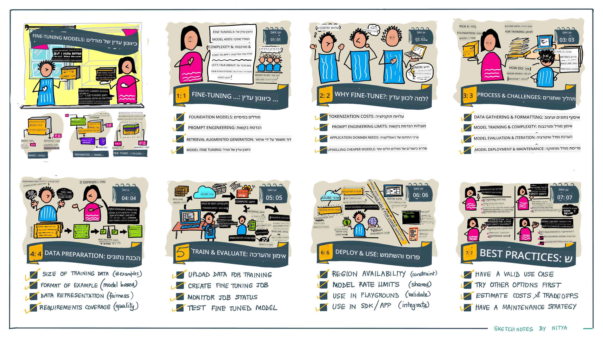

<!--
CO_OP_TRANSLATOR_METADATA:
{
  "original_hash": "68664f7e754a892ae1d8d5e2b7bd2081",
  "translation_date": "2025-05-20T07:52:36+00:00",
  "source_file": "18-fine-tuning/README.md",
  "language_code": "he"
}
-->

# כיוונון עדין של ה-LLM שלך

שימוש במודלים לשוניים גדולים לבניית יישומי AI גנרטיביים מביא עמו אתגרים חדשים. סוגיה מרכזית היא הבטחת איכות התגובה (דיוק ורלוונטיות) בתוכן שנוצר על ידי המודל עבור בקשה מסוימת של המשתמש. בשיעורים קודמים, דנו בטכניקות כמו הנדסת פקודות והפקה מועשרת באחזור שמנסות לפתור את הבעיה על ידי _שינוי הפקודה_ למודל הקיים.

בשיעור של היום, נדון בטכניקה שלישית, **כיוונון עדין**, שמנסה להתמודד עם האתגר על ידי _אימון מחדש של המודל עצמו_ עם נתונים נוספים. בואו נצלול לפרטים.

## מטרות למידה

שיעור זה מציג את מושג הכיוונון העדין למודלים לשוניים שהוכנו מראש, חוקר את היתרונות והאתגרים בגישה זו, ומספק הדרכה על מתי וכיצד להשתמש בכיוונון עדין כדי לשפר את הביצועים של מודלי ה-AI הגנרטיביים שלך.

בסוף השיעור, תוכל לענות על השאלות הבאות:

- מהו כיוונון עדין למודלים לשוניים?
- מתי ולמה כיוונון עדין מועיל?
- כיצד ניתן לכוון עדין מודל שהוכן מראש?
- מהם המגבלות של כיוונון עדין?

מוכנים? בואו נתחיל.

## מדריך מאויר

רוצים לקבל תמונה רחבה של מה שנכסה לפני שנצלול פנימה? בדקו את המדריך המאויר שמתאר את מסלול הלמידה לשיעור זה - מהבנת המושגים המרכזיים והמוטיבציה לכיוונון עדין, להבנת התהליך והפרקטיקות הטובות ביותר לביצוע משימת הכיוונון העדין. זהו נושא מרתק לחקירה, אז אל תשכחו לבדוק את דף [המשאבים](./RESOURCES.md?WT.mc_id=academic-105485-koreyst) לקישורים נוספים לתמיכה במסע הלמידה העצמית שלכם!

## מהו כיוונון עדין למודלים לשוניים?

בהגדרה, מודלים לשוניים גדולים הם _מודלים שהוכנו מראש_ על כמויות גדולות של טקסט ממקורות מגוונים, כולל האינטרנט. כפי שלמדנו בשיעורים קודמים, אנו זקוקים לטכניקות כמו _הנדסת פקודות_ והפקה מועשרת באחזור כדי לשפר את איכות התגובות של המודל לשאלות המשתמש ("פקודות").

טכניקה פופולרית בהנדסת פקודות כוללת מתן יותר הנחיות למודל על מה שמצופה בתגובה, או על ידי מתן _הוראות_ (הנחיות מפורשות) או _מתן כמה דוגמאות_ (הנחיות מרומזות). זה נקרא _למידת יריית כמה_ אבל יש לו שתי מגבלות:

- מגבלות טוקן של המודל יכולות להגביל את מספר הדוגמאות שאתה יכול לתת, ולהגביל את היעילות.
- עלויות טוקן של המודל יכולות להפוך את זה ליקר להוסיף דוגמאות לכל פקודה, ולהגביל את הגמישות.

כיוונון עדין הוא נוהג נפוץ במערכות למידת מכונה שבהן אנו לוקחים מודל שהוכן מראש ומאמנים אותו מחדש עם נתונים חדשים כדי לשפר את הביצועים שלו במשימה ספציפית. בהקשר של מודלים לשוניים, אנו יכולים לכוון עדין את המודל שהוכן מראש _עם קבוצה מאורגנת של דוגמאות למשימה או תחום יישום מסוים_ כדי ליצור **מודל מותאם אישית** שעשוי להיות מדויק ורלוונטי יותר למשימה או התחום הספציפיים הללו. יתרון נוסף של כיוונון עדין הוא שהוא יכול גם להפחית את מספר הדוגמאות הדרושות ללמידת יריית כמה - הפחתת שימוש בטוקנים ועלויות נלוות.

## מתי ולמה כדאי לנו לכוון עדין מודלים?

בהקשר _זה_, כאשר אנו מדברים על כיוונון עדין, אנו מתייחסים לכיוונון עדין **מנוהל** שבו האימון מחדש מתבצע על ידי **הוספת נתונים חדשים** שלא היו חלק ממערכת הנתונים המקורית. זה שונה מגישה של כיוונון עדין בלתי מנוהל שבה המודל מאומן מחדש על הנתונים המקוריים, אך עם פרמטרים שונים.

הדבר המרכזי שיש לזכור הוא שכיוונון עדין הוא טכניקה מתקדמת הדורשת רמה מסוימת של מומחיות כדי להשיג את התוצאות הרצויות. אם זה נעשה באופן לא נכון, זה עשוי לא לספק את השיפורים הצפויים, ואף עלול להוריד את הביצועים של המודל עבור התחום הממוקד שלך.

לכן, לפני שתלמד "איך" לכוון עדין מודלים לשוניים, אתה צריך לדעת "למה" כדאי לך ללכת בדרך זו, ו"מתי" להתחיל את תהליך הכיוונון העדין. התחל בכך שתשאל את עצמך את השאלות הבאות:

- **מקרה שימוש**: מהו _מקרה השימוש_ שלך לכיוונון עדין? איזה היבט של המודל המוכן מראש הנוכחי אתה רוצה לשפר?
- **חלופות**: האם ניסית _טכניקות אחרות_ כדי להשיג את התוצאות הרצויות? השתמש בהן כדי ליצור בסיס להשוואה.
  - הנדסת פקודות: נסה טכניקות כמו פקודת יריית כמה עם דוגמאות לתגובות פקודה רלוונטיות. הערך את איכות התגובות.
  - הפקה מועשרת באחזור: נסה להעשיר פקודות עם תוצאות שאוחזרו על ידי חיפוש בנתונים שלך. הערך את איכות התגובות.
- **עלויות**: האם זיהית את העלויות לכיוונון עדין?
  - כיוונון - האם המודל המוכן מראש זמין לכיוונון עדין?
  - מאמץ - להכנת נתוני אימון, הערכה ושיפור המודל.
  - חישוב - להפעלת עבודות כיוונון עדין, ופריסת המודל המכוון עדין
  - נתונים - גישה לדוגמאות איכות מספקות להשפעת כיוונון עדין
- **יתרונות**: האם אישרת את היתרונות לכיוונון עדין?
  - איכות - האם המודל המכוון עדין עלה על הבסיס?
  - עלות - האם זה מפחית שימוש בטוקנים על ידי פישוט פקודות?
  - הרחבה - האם ניתן לשנות את המודל הבסיסי לתחומים חדשים?

על ידי מענה על שאלות אלו, אתה אמור להיות מסוגל להחליט אם כיוונון עדין הוא הגישה הנכונה עבור מקרה השימוש שלך. באופן אידיאלי, הגישה תקפה רק אם היתרונות עולים על העלויות. ברגע שאתה מחליט להמשיך, הגיע הזמן לחשוב על _איך_ אתה יכול לכוון עדין את המודל המוכן מראש.

רוצים לקבל יותר תובנות על תהליך קבלת ההחלטות? צפו ב[כיוונון עדין או לא לכוון עדין](https://www.youtube.com/watch?v=0Jo-z-MFxJs)

## איך אנחנו יכולים לכוון עדין מודל שהוכן מראש?

כדי לכוון עדין מודל שהוכן מראש, עליך שיהיו לך:

- מודל מוכן מראש לכיוונון עדין
- מערכת נתונים לשימוש בכיוונון עדין
- סביבת אימון להרצת עבודת הכיוונון העדין
- סביבת אירוח לפריסת המודל המכוון עדין

## כיוונון עדין בפעולה

המשאבים הבאים מספקים הדרכות שלב אחר שלב כדי להדריך אותך בדוגמה אמיתית באמצעות מודל נבחר עם מערכת נתונים מאורגנת. כדי לעבוד דרך ההדרכות הללו, אתה צריך חשבון אצל ספק מסוים, יחד עם גישה למודל ולמערכות הנתונים הרלוונטיים.

| ספק         | הדרכה                                                                                                                                                                      | תיאור                                                                                                                                                                                                                                                                                                                                                                                                                         |
| ------------ | ------------------------------------------------------------------------------------------------------------------------------------------------------------------------- | ---------------------------------------------------------------------------------------------------------------------------------------------------------------------------------------------------------------------------------------------------------------------------------------------------------------------------------------------------------------------------------------------------------------------------------- |
| OpenAI       | [איך לכוון עדין מודלים של צ'אט](https://github.com/openai/openai-cookbook/blob/main/examples/How_to_finetune_chat_models.ipynb?WT.mc_id=academic-105485-koreyst)         | למד לכוון עדין `gpt-35-turbo` לתחום ספציפי ("עוזר מתכונים") על ידי הכנת נתוני אימון, הרצת עבודת הכיוונון העדין ושימוש במודל המכוון עדין להסקה.                                                                                                                                                                                                                                              |
| Azure OpenAI | [הדרכת כיוונון עדין של GPT 3.5 Turbo](https://learn.microsoft.com/azure/ai-services/openai/tutorials/fine-tune?tabs=python-new%2Ccommand-line?WT.mc_id=academic-105485-koreyst) | למד לכוון עדין מודל `gpt-35-turbo-0613` **ב-Azure** על ידי ביצוע צעדים ליצירה והעלאת נתוני אימון, הפעלת עבודת הכיוונון העדין. פרוס והשתמש במודל החדש.                                                                                                                                                                                                                                                                 |
| Hugging Face | [כיוונון עדין של LLMs עם Hugging Face](https://www.philschmid.de/fine-tune-llms-in-2024-with-trl?WT.mc_id=academic-105485-koreyst)                                         | פוסט בבלוג זה מדריך אותך בכיוונון עדין של _LLM פתוח_ (לדוגמה: `CodeLlama 7B`) באמצעות ספריית [transformers](https://huggingface.co/docs/transformers/index?WT.mc_id=academic-105485-koreyst) ו-[TRL](https://huggingface.co/docs/trl/index?WT.mc_id=academic-105485-koreyst]) עם [datasets](https://huggingface.co/docs/datasets/index?WT.mc_id=academic-105485-koreyst) פתוחים ב-Hugging Face. |
|              |                                                                                                                                                                           |                                                                                                                                                                                                                                                                                                                                                                                                                                   |
| 🤗 AutoTrain | [כיוונון עדין של LLMs עם AutoTrain](https://github.com/huggingface/autotrain-advanced/?WT.mc_id=academic-105485-koreyst)                                                  | AutoTrain (או AutoTrain Advanced) היא ספריית Python שפותחה על ידי Hugging Face המאפשרת כיוונון עדין למשימות רבות ושונות כולל כיוונון עדין של LLM. AutoTrain היא פתרון ללא קוד וכיוונון עדין ניתן לבצע בענן שלך, ב-Hugging Face Spaces או באופן מקומי. היא תומכת גם ב-GUI מבוסס רשת, CLI ואימון באמצעות קבצי קונפיגורציה yaml.                                                                               |
|              |                                                                                                                                                                           |                                                                                                                                                                                                                                                                                                                                                                                                                                   |

## משימה

בחר אחת מההדרכות לעיל ועבור דרכן. _אנו עשויים לשכפל גרסה של הדרכות אלו ב-Jupyter Notebooks במאגר זה לצורך התייחסות בלבד. אנא השתמש במקורות המקוריים ישירות כדי לקבל את הגרסאות האחרונות_.

## עבודה נהדרת! המשך ללמוד.

לאחר השלמת שיעור זה, בדוק את [אוסף הלמידה של AI גנרטיבי](https://aka.ms/genai-collection?WT.mc_id=academic-105485-koreyst) שלנו כדי להמשיך לשפר את הידע שלך ב-AI גנרטיבי!

ברכות!! סיימת את השיעור האחרון מסדרת v2 עבור קורס זה! אל תפסיק ללמוד ולבנות. **בדוק את דף [המשאבים](RESOURCES.md?WT.mc_id=academic-105485-koreyst) לרשימה של הצעות נוספות רק לנושא זה.

סדרת השיעורים v1 שלנו עודכנה גם היא עם משימות ומושגים נוספים. אז קח דקה לרענן את הידע שלך - ואל תשכח [לשתף את השאלות והמשוב שלך](https://github.com/microsoft/generative-ai-for-beginners/issues?WT.mc_id=academic-105485-koreyst) כדי לעזור לנו לשפר את השיעורים הללו לקהילה.

**כתב ויתור**:  
מסמך זה תורגם באמצעות שירות תרגום AI [Co-op Translator](https://github.com/Azure/co-op-translator). בעוד אנו שואפים לדיוק, יש להיות מודעים לכך שתרגומים אוטומטיים עשויים להכיל שגיאות או אי דיוקים. המסמך המקורי בשפתו המקורית צריך להיחשב כמקור סמכותי. למידע קריטי, מומלץ להשתמש בתרגום אנושי מקצועי. אנו לא אחראים לכל אי הבנות או פרשנויות שגויות הנובעות משימוש בתרגום זה.