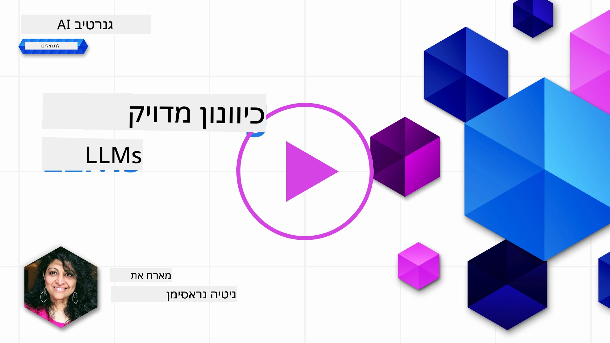

# כיוונון מדויק של מודל השפה הגדול שלך

שימוש במודלי שפה גדולים לבניית יישומי בינה מלאכותית יצירתית מגיע עם אתגרים חדשים. סוגיה מרכזית היא הבטחת איכות התגובה (דיוק ורלוונטיות) בתוכן שנוצר על ידי המודל עבור בקשת משתמש נתונה. בשיעורים קודמים דיברנו על טכניקות כמו הנדסת הנחיות והפקה משופרת בשילוב אחזור מידע שמנסות לפתור את הבעיה באמצעות _שינוי קלט ההנחיה_ אל המודל הקיים.

בשיעור של היום נדון בטכניקה השלישית, **כיוונון מדויק**, שנועדה לטפל באתגר על ידי _אימון מחדש של המודל עצמו_ עם נתונים נוספים. בואו נצלול לפרטים.

## מטרות הלמידה

שיעור זה מציג את מושג הכיוונון המדויק למודלי שפה מאומנים מראש, בוחן את היתרונות והאתגרים של גישה זו, ומספק הנחיות מתי ואיך להשתמש בכיוונון המדויק כדי לשפר את ביצועי מודלי הבינה המלאכותית היצירתית שלך.

בסוף שיעור זה, עליך להיות מסוגל לענות על השאלות הבאות:

- מהו כיוונון מדויק למודלי שפה?
- מתי ולמה כיוונון מדויק שימושי?
- איך ניתן לכוונן מודל מאומן מראש?
- מהם המגבלות של כיוונון מדויק?

מוכנים? בואו נתחיל.

## מדריך ממוחשב

רוצים לקבל תמונה כוללת של מה שנכסה לפני שנכנס לפרטים? עיינו במדריך הממחיש המתאר את מסלול הלמידה לשיעור זה - מלמידת המושגים המרכזיים והמניע לכיוונון המדויק, להבנת התהליך והפרקטיקות הטובות לביצוע משימת הכיוונון המדויק. זה נושא מרתק למיצוי, אז אל תשכחו לבדוק את דף [המשאבים](./RESOURCES.md?WT.mc_id=academic-105485-koreyst) לקישורים נוספים לתמיכה במסע הלמידה העצמי שלכם!

## מהו כיוונון מדויק למודלי שפה?

בהגדרה, מודלי שפה גדולים הם _מאומנים מראש_ על כמויות גדולות של טקסט שמקורו במקורות מגוונים כולל האינטרנט. כפי שלמדנו בשיעורים קודמים, נדרשות טכניקות כמו _הנדסת הנחיות_ ו-_הפקה משופרת בשילוב אחזור מידע_ כדי לשפר את איכות התגובות של המודל לשאלות המשתמש ("הנחיות").

טכניקת הנדסת הנחיות פופולרית כוללת מתן הנחיה ברורה למודל לגבי מה מצופה בתגובה, בין אם על ידי מתן _הוראות_ (הנחיה מפורשת) או _מתן מספר דוגמאות_ (הנחיה IMPLIED). זה נקרא _למידה עם מספר דוגמאות מועט_ אך יש לו שתי מגבלות:

- מגבלות טוקנים במודל מגבילות את מספר הדוגמאות שניתן לספק, ומגבילות את היעילות.
- עלויות טוקנים יכולות להקשות על הוספת דוגמאות לכל הנחיה, ולמזער את הגמישות.

כיוונון מדויק הוא פרקטיקה נפוצה במערכות למידה ממוחשבת שבה לוקחים מודל מאומן מראש ומבצעים אימון מחדש עם נתונים חדשים לשיפור הביצועים במשימה מסוימת. בהקשר של מודלי שפה, ניתן לכוונן את המודל המאומן מראש _עם סט מורכב של דוגמאות למשימה או תחום יישום נתון_ כדי ליצור **מודל מותאם אישית** שעשוי להיות מדויק ורלוונטי יותר למשימה או לתחום הספציפי הזה. תועלת נוספת של כיוונון מדויק היא הפחתת כמות הדוגמאות הנדרשות ללמידה עם מספר דוגמאות מועט - מה שמפחית שימוש בטוקנים ועלויות נלוות.

## מתי ולמה כדאי לכוונן מודלים?

בהקשר זה, כשאנחנו מדברים על כיוונון מדויק, אנו מתכוונים ל**כיוונון מפוקח** שבו האימון מחדש מתבצע על ידי **הוספת נתונים חדשים** שלא היו חלק ממאגר האימון המקורי. זה שונה מגישה של כיוונון ללא פיקוח שבה המודל מאומן מחדש על הנתונים המקוריים, אך עם פרמטרים שונים.

הדבר המרכזי לזכור הוא שכיוונון מדויק הוא טכניקה מתקדמת שדורשת רמת מומחיות מסוימת כדי לקבל את התוצאות הרצויות. אם הוא מתבצע בצורה שגויה, יתכן שלא יתקבלו השיפורים הצפויים, ואפילו תיתכן הידרדרות בביצועי המודל לתחום המיועד.

לפיכך, לפני שתלמד כיצד לכוונן מודלי שפה, אתה צריך לדעת "למה" כדאי לבחור בדרך זו, ו"מתי" להתחיל את תהליך הכיוונון. התחל עם השאלות האלה:

- **מקרי שימוש**: מהו _מקרה השימוש_ שלך לכיוונון? איזה היבט במודל המאומן מראש הנוכחי ברצונך לשפר?
- **חלופות**: האם ניסית _שיטות אחרות_ להשגת התוצאות הרצויות? השתמש בהן ליצירת קו בסיס להשוואה.
  - הנדסת הנחיות: נסה טכניקות כמו מתן מספר דוגמאות רלוונטיות. הערך את איכות התגובות.
  - הפקה משופרת בשילוב אחזור מידע: נסה להעשיר הנחיות בתוצאות חיפוש נתונים. הערך את איכות התגובות.
- **עלויות**: האם זיהית את עלויות הכיוונון המדויק?
  - יכולת כיוונון - האם המודל המאומן מראש זמין לכיוונון?
  - מאמץ - להכנת נתוני אימון, הערכה ושיפור המודל.
  - חישוב - להרצת עבודות הכיוונון, והפעלת המודל המכוונן.
  - נתונים - גישה לדוגמאות איכותיות מספיק עבור השפעת הכיוונון.
- **תועלות**: האם אימתת את התועלות של הכיוונון?
  - איכות - האם המודל המכוון התעלה על קו הבסיס?
  - עלות - האם הוא מפחית שימוש בטוקנים על ידי פישוט הנחיות?
  - יכולת הרחבה - האם ניתן להפעיל את המודל הבסיסי בתחומים חדשים?

על ידי מענה על שאלות אלה, תוכל להחליט אם כיוונון מדויק הוא הגישה הנכונה למקרה השימוש שלך. באופן אידיאלי, הגישה תקפה רק אם התועלות עולות על העלויות. לאחר שתחליט להמשיך, זה הזמן לחשוב על _איך_ ניתן לכוונן את המודל המאומן מראש.

רוצה לקבל תובנות נוספות על תהליך קבלת ההחלטות? צפה ב-[To fine-tune or not to fine-tune](https://www.youtube.com/watch?v=0Jo-z-MFxJs)

## איך ניתן לכוונן מודל מאומן מראש?

כדי לכוונן מודל מאומן מראש, אתה צריך:

- מודל מאומן מראש לכיוונון
- מערכת נתונים לשימוש בכיוונון
- סביבה להכשרת המודל להרצת משימת הכיוונון המדויק
- סביבה לאירוח ולפריסת המודל המכוון

## כיוונון מדויק בפעולה

המשאבים הבאים מספקים מדריכים שלב אחרי שלב שיעזרו לך לעבור דוגמת עבודה אמיתית באמצעות מודל נבחר עם סט נתונים מורכב. כדי לעבוד דרך מדריכים אלה, נדרש חשבון אצל הספק הספציפי יחד עם גישה למודל ולמערכי הנתונים הרלוונטיים.

| ספק          | מדריך                                                                                                                                                                         | תיאור                                                                                                                                                                                                                                                                                                                                                                                        |
| ------------ | ---------------------------------------------------------------------------------------------------------------------------------------------------------------------------- | ---------------------------------------------------------------------------------------------------------------------------------------------------------------------------------------------------------------------------------------------------------------------------------------------------------------------------------------------------------------------------------------------- |
| OpenAI       | [איך לכוונן דגמי שיחה](https://github.com/openai/openai-cookbook/blob/main/examples/How_to_finetune_chat_models.ipynb?WT.mc_id=academic-105485-koreyst)                        | למדו כיצד לכוונן את `gpt-35-turbo` לתחום ספציפי ("עוזר מתכונים") על ידי הכנת נתוני אימון, הרצת משימת הכיוונון המדויק, ושימוש במודל המכוון להסקת מסקנות.                                                                                                                                                                                                                                        |
| Azure OpenAI | [מדריך כיוונון מדויק ל-GPT 3.5 Turbo](https://learn.microsoft.com/azure/ai-services/openai/tutorials/fine-tune?tabs=python-new%2Ccommand-line?WT.mc_id=academic-105485-koreyst)    | למדו כיצד לכוונן את המודל `gpt-35-turbo-0613` **ב-Azure** באמצעות שלבים ליצירה והעלאת נתוני אימון, הרצת משימת הכיוונון המדויק, פריסה ושימוש במודל החדש.                                                                                                                                                                                                                                  |
| Hugging Face | [כיוונון LLMs עם Hugging Face](https://www.philschmid.de/fine-tune-llms-in-2024-with-trl?WT.mc_id=academic-105485-koreyst)                                                   | פוסט זה יסביר כיצד לכוונן _מודל שפה פתוח_ (למשל: `CodeLlama 7B`) באמצעות ספריית [transformers](https://huggingface.co/docs/transformers/index?WT.mc_id=academic-105485-koreyst) ו-[Transformer Reinforcement Learning (TRL)](https://huggingface.co/docs/trl/index?WT.mc_id=academic-105485-koreyst) עם מערכי נתונים פתוחים ב-Hugging Face.                                                                |
|              |                                                                                                                                                                              |                                                                                                                                                                                                                                                                                                                                                                                              |
| 🤗 AutoTrain | [כיוונון LLMs עם AutoTrain](https://github.com/huggingface/autotrain-advanced/?WT.mc_id=academic-105485-koreyst)                                                                 | AutoTrain (או AutoTrain Advanced) היא ספריית פייתון שפותחה על ידי Hugging Face המאפשרת כיוונון למגוון של משימות כולל כיוונון מודלים גדולים של שפה. AutoTrain היא פתרון ללא קוד וכיוונון אפשרי בשרת שלך, ב-Hugging Face Spaces או מקומית. היא תומכת בממשק גרפי מבוסס אינטרנט, CLI ואימון דרך קבצי הגדרה yaml.                                                                                     |
|              |                                                                                                                                                                              |                                                                                                                                                                                                                                                                                                                                                                                              |
| 🦥 Unsloth   | [כיוונון LLMs עם Unsloth](https://github.com/unslothai/unsloth)                                                                                                                | Unsloth הוא מסגרת קוד פתוח התומכת בכיוונון LLM ולמידה עם חיזוק (RL). Unsloth מפשט אימון מקומי, הערכה ופריסה עם מחברות [notebooks](https://github.com/unslothai/notebooks) מוכנות לשימוש. הוא גם תומך בהמרת טקסט לקול (TTS), BERT ומודלים מולטימודאליים. להתחלת עבודה, קראו את מדריך צעד-אחר-צעד [Fine-tuning LLMs Guide](https://docs.unsloth.ai/get-started/fine-tuning-llms-guide).                  |
|              |                                                                                                                                                                              |                                                                                                                                                                                                                                                                                                                                                                                              |
## משימה

בחר אחד מהמדריכים שלמעלה ועבור דרכם. _יתכן שנשכפל גרסה של מדריכים אלה במחברות Jupyter במאגר זה כהפניה בלבד. אנא השתמש במקורות המקוריים ישירות כדי לקבל את הגרסאות העדכניות ביותר_.

## עבודה מצוינת! המשך ללמוד.

לאחר שסיימת את השיעור הזה, עיין באוסף [למידת בינה מלאכותית יצירתית שלנו](https://aka.ms/genai-collection?WT.mc_id=academic-105485-koreyst) כדי להמשיך לשפר את הידע שלך בבינה מלאכותית יצירתית!

ברכות!! השלמת את השיעור הסופי בסדרת v2 של הקורס! אל תפסיק ללמוד ולבנות. \*\*עיין בדף [RESOURCES](RESOURCES.md?WT.mc_id=academic-105485-koreyst) לרשימת הצעות נוספות עבור נושא זה בלבד.

סדרת השיעורים v1 שלנו עודכנה גם היא עם משימות ומושגים נוספים. אז קח דקה לרענן את הידע שלך - ו[שתף את שאלותיך ומשובך](https://github.com/microsoft/generative-ai-for-beginners/issues?WT.mc_id=academic-105485-koreyst) כדי לעזור לנו לשפר שיעורים אלה לטובת הקהילה.

---

<!-- CO-OP TRANSLATOR DISCLAIMER START -->
**כתב ויתור**:
מסמך זה תורגם באמצעות שירות תרגום מבוסס בינה מלאכותית [Co-op Translator](https://github.com/Azure/co-op-translator). למרות שאנו שואפים לדייק, יש לקחת בחשבון כי תרגומים אוטומטיים עלולים להכיל שגיאות או אי דיוקים. המסמך המקורי בשפת המקור מהווה את המקור המוסמך. למידע קריטי מומלץ להיעזר בתרגום מקצועי אנושי. אנו לא אחראים לכל אי-הבנה או פרשנות שגויה הנובעים משימוש בתרגום זה.
<!-- CO-OP TRANSLATOR DISCLAIMER END -->