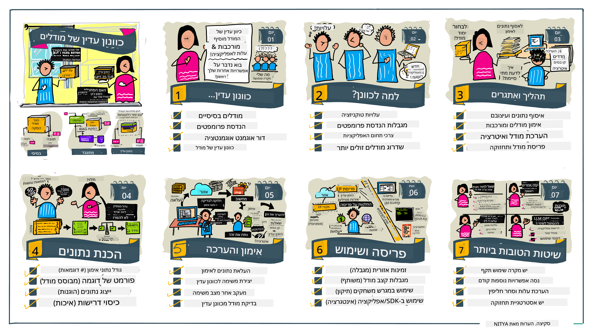

<!--
CO_OP_TRANSLATOR_METADATA:
{
  "original_hash": "68664f7e754a892ae1d8d5e2b7bd2081",
  "translation_date": "2025-07-09T17:45:54+00:00",
  "source_file": "18-fine-tuning/README.md",
  "language_code": "he"
}
-->

# כיוונון עדין של ה-LLM שלך

שימוש במודלים גדולים של שפה לבניית יישומי AI גנרטיביים מביא איתו אתגרים חדשים. סוגיה מרכזית היא הבטחת איכות התגובה (דיוק ורלוונטיות) בתוכן שנוצר על ידי המודל עבור בקשת המשתמש. בשיעורים קודמים דיברנו על טכניקות כמו הנדסת פרומפט ויצירה משולבת שליפה שמנסות לפתור את הבעיה על ידי _שינוי קלט הפרומפט_ למודל הקיים.

בשיעור של היום נדון בטכניקה שלישית, **כיוונון עדין**, שמנסה להתמודד עם האתגר על ידי _אימון מחדש של המודל עצמו_ עם נתונים נוספים. בואו נצלול לפרטים.

## מטרות הלמידה

השיעור מציג את מושג הכיוונון העדין למודלים של שפה מאומנים מראש, בוחן את היתרונות והאתגרים של גישה זו, ומספק הנחיות מתי ואיך להשתמש בכיוונון עדין כדי לשפר את ביצועי מודלי ה-AI הגנרטיביים שלך.

בסיום השיעור תוכל לענות על השאלות הבאות:

- מהו כיוונון עדין למודלי שפה?
- מתי ולמה כיוונון עדין שימושי?
- איך אפשר לכוונן עדין מודל מאומן מראש?
- מהם המגבלות של כיוונון עדין?

מוכן? בוא נתחיל.

## מדריך מאויר

רוצה לקבל תמונה כוללת של מה שנכסה לפני שנכנס לפרטים? עיין במדריך המאויר שמתאר את מסלול הלמידה לשיעור זה - מלמידת המושגים המרכזיים והמוטיבציה לכיוונון עדין, ועד להבנת התהליך והפרקטיקות הטובות לביצוע משימת הכיוונון העדין. זה נושא מרתק לחקירה, אז אל תשכח לבדוק את דף [Resources](./RESOURCES.md?WT.mc_id=academic-105485-koreyst) לקישורים נוספים לתמיכה במסע הלמידה העצמי שלך!

## מהו כיוונון עדין למודלי שפה?

בהגדרה, מודלים גדולים של שפה הם _מאומנים מראש_ על כמויות גדולות של טקסט ממקורות מגוונים כולל האינטרנט. כפי שלמדנו בשיעורים קודמים, אנו זקוקים לטכניקות כמו _הנדסת פרומפט_ ו_יצירה משולבת שליפה_ כדי לשפר את איכות התגובות של המודל לשאלות המשתמש ("פרומפטים").

טכניקת הנדסת פרומפט פופולרית כוללת מתן הנחיות מפורשות למודל לגבי מה מצופה בתגובה, או על ידי מתן _הוראות_ (הנחיה מפורשת) או _מתן כמה דוגמאות_ (הנחיה מרומזת). זה נקרא _למידה עם מעט דוגמאות_ אך יש לכך שתי מגבלות:

- מגבלות על מספר הטוקנים במודל יכולות להגביל את כמות הדוגמאות שניתן לספק, ולהפחית את היעילות.
- עלויות טוקנים יכולות להפוך את הוספת הדוגמאות לכל פרומפט ליקרה, ולהגביל את הגמישות.

כיוונון עדין הוא פרקטיקה נפוצה במערכות למידת מכונה שבה לוקחים מודל מאומן מראש ומאמנים אותו מחדש עם נתונים חדשים כדי לשפר את ביצועיו במשימה ספציפית. בהקשר של מודלי שפה, ניתן לכוונן עדין את המודל המאומן מראש _עם סט דוגמאות מובחר למשימה או תחום יישום מסוים_ כדי ליצור **מודל מותאם אישית** שעשוי להיות מדויק ורלוונטי יותר למשימה או לתחום הספציפי. תועלת נוספת של כיוונון עדין היא שהוא יכול גם להפחית את כמות הדוגמאות הנדרשות ללמידה עם מעט דוגמאות - מה שמפחית את השימוש בטוקנים והעלויות הנלוות.

## מתי ולמה כדאי לכוונן עדין מודלים?

בהקשר _זה_, כשמדברים על כיוונון עדין, מתכוונים ל**כיוונון עדין מפוקח** שבו האימון מחדש נעשה על ידי **הוספת נתונים חדשים** שלא היו חלק ממערך האימון המקורי. זה שונה מגישת כיוונון עדין לא מפוקח שבה המודל מאומן מחדש על הנתונים המקוריים, אך עם פרמטרים שונים.

הנקודה החשובה לזכור היא שכיוונון עדין הוא טכניקה מתקדמת שדורשת רמת מומחיות מסוימת כדי להשיג את התוצאות הרצויות. אם נעשה בצורה לא נכונה, ייתכן שלא יושגו השיפורים הצפויים, ואפילו ביצועי המודל עבור התחום הממוקד שלך עלולים להיפגע.

לפיכך, לפני שלומדים "איך" לכוונן עדין מודלי שפה, צריך לדעת "למה" כדאי לבחור בדרך זו, ו"מתי" להתחיל בתהליך הכיוונון העדין. התחל בשאלות הבאות:

- **מקרה שימוש**: מהו ה_מקרה שימוש_ שלך לכיוונון עדין? איזה היבט במודל המאומן מראש הנוכחי אתה רוצה לשפר?
- **חלופות**: האם ניסית _טכניקות אחרות_ להשגת התוצאות הרצויות? השתמש בהן כדי ליצור קו בסיס להשוואה.
  - הנדסת פרומפט: נסה טכניקות כמו פרומפט עם מעט דוגמאות של תגובות רלוונטיות. הערך את איכות התגובות.
  - יצירה משולבת שליפה: נסה להעשיר פרומפטים עם תוצאות חיפוש במידע שלך. הערך את איכות התגובות.
- **עלויות**: האם זיהית את העלויות של כיוונון עדין?
  - יכולת כיוונון - האם המודל המאומן מראש זמין לכיוונון עדין?
  - מאמץ - להכנת נתוני אימון, הערכה ושיפור המודל.
  - חישוב - להרצת עבודות כיוונון עדין, ופריסת המודל המכוונן.
  - נתונים - גישה לדוגמאות איכותיות מספיקות להשפעה משמעותית.
- **יתרונות**: האם אישרת את היתרונות של כיוונון עדין?
  - איכות - האם המודל המכוון עדין עלה על קו הבסיס?
  - עלות - האם זה מפחית שימוש בטוקנים על ידי פישוט הפרומפטים?
  - הרחבה - האם ניתן להשתמש במודל הבסיסי מחדש לתחומים חדשים?

על ידי מענה על שאלות אלו, תוכל להחליט אם כיוונון עדין הוא הגישה הנכונה למקרה השימוש שלך. באופן אידיאלי, הגישה תקפה רק אם היתרונות עולים על העלויות. ברגע שתחליט להמשיך, הגיע הזמן לחשוב על _איך_ ניתן לכוונן עדין את המודל המאומן מראש.

רוצה לקבל תובנות נוספות על תהליך קבלת ההחלטות? צפה ב-[To fine-tune or not to fine-tune](https://www.youtube.com/watch?v=0Jo-z-MFxJs)

## איך אפשר לכוונן עדין מודל מאומן מראש?

כדי לכוונן עדין מודל מאומן מראש, אתה צריך:

- מודל מאומן מראש לכיוונון
- מערך נתונים לשימוש בכיוונון עדין
- סביבת אימון להרצת משימת הכיוונון
- סביבת אירוח לפריסת המודל המכוון

## כיוונון עדין בפועל

המשאבים הבאים מספקים מדריכים שלב-אחר-שלב שמלווים אותך בדוגמה אמיתית עם מודל נבחר ומערך נתונים מובחר. כדי לעבוד עם המדריכים האלה, דרוש לך חשבון אצל הספק הספציפי, יחד עם גישה למודל ולמערכי הנתונים הרלוונטיים.

| ספק          | מדריך                                                                                                                                                                        | תיאור                                                                                                                                                                                                                                                                                                                                                                                                                            |
| ------------ | --------------------------------------------------------------------------------------------------------------------------------------------------------------------------- | -------------------------------------------------------------------------------------------------------------------------------------------------------------------------------------------------------------------------------------------------------------------------------------------------------------------------------------------------------------------------------------------------------------------------------- |
| OpenAI       | [How to fine-tune chat models](https://github.com/openai/openai-cookbook/blob/main/examples/How_to_finetune_chat_models.ipynb?WT.mc_id=academic-105485-koreyst)               | למד כיצד לכוונן עדין את `gpt-35-turbo` לתחום ספציפי ("עוזר מתכונים") על ידי הכנת נתוני אימון, הרצת משימת הכיוונון, ושימוש במודל המכוון לעיבוד.                                                                                                                                                                                                                                                                                |
| Azure OpenAI | [GPT 3.5 Turbo fine-tuning tutorial](https://learn.microsoft.com/azure/ai-services/openai/tutorials/fine-tune?tabs=python-new%2Ccommand-line?WT.mc_id=academic-105485-koreyst) | למד כיצד לכוונן עדין את מודל `gpt-35-turbo-0613` **ב-Azure** על ידי יצירה והעלאת נתוני אימון, הרצת משימת הכיוונון, פריסה ושימוש במודל החדש.                                                                                                                                                                                                                                                                                 |
| Hugging Face | [Fine-tuning LLMs with Hugging Face](https://www.philschmid.de/fine-tune-llms-in-2024-with-trl?WT.mc_id=academic-105485-koreyst)                                              | פוסט בלוג שמדריך אותך בכיוונון עדין של _מודל LLM פתוח_ (למשל `CodeLlama 7B`) באמצעות ספריית [transformers](https://huggingface.co/docs/transformers/index?WT.mc_id=academic-105485-koreyst) ו-[Transformer Reinforcement Learning (TRL)](https://huggingface.co/docs/trl/index?WT.mc_id=academic-105485-koreyst) עם מערכי נתונים פתוחים ב-Hugging Face.                                                                                   |
|              |                                                                                                                                                                             |                                                                                                                                                                                                                                                                                                                                                                                                                                  |
| 🤗 AutoTrain | [Fine-tuning LLMs with AutoTrain](https://github.com/huggingface/autotrain-advanced/?WT.mc_id=academic-105485-koreyst)                                                        | AutoTrain (או AutoTrain Advanced) היא ספריית פייתון שפותחה על ידי Hugging Face המאפשרת כיוונון עדין למשימות שונות כולל כיוונון LLM. AutoTrain היא פתרון ללא קוד, וכיוונון עדין יכול להתבצע בענן שלך, ב-Hugging Face Spaces או מקומית. היא תומכת בממשק משתמש מבוסס רשת, CLI ואימון דרך קבצי תצורה yaml.                                                                                                                        |
|              |                                                                                                                                                                             |                                                                                                                                                                                                                                                                                                                                                                                                                                  |

## מטלה

בחר אחד מהמדריכים למעלה ועבור עליו. _ייתכן שנשכפל גרסה של מדריכים אלה ב-Jupyter Notebooks במאגר זה כהפניה בלבד. אנא השתמש במקורות המקוריים ישירות לקבלת הגרסאות העדכניות ביותר_.

## עבודה מצוינת! המשך ללמוד.

לאחר שסיימת את השיעור, עיין באוסף [Generative AI Learning](https://aka.ms/genai-collection?WT.mc_id=academic-105485-koreyst) שלנו כדי להמשיך לשפר את הידע שלך ב-AI גנרטיבי!

מזל טוב!! סיימת את השיעור האחרון בסדרת v2 של הקורס! אל תפסיק ללמוד ולבנות. \*\*בדוק את דף [RESOURCES](RESOURCES.md?WT.mc_id=academic-105485-koreyst) לרשימת המלצות נוספות רק לנושא זה.

סדרת השיעורים v1 שלנו עודכנה גם היא עם מטלות ורעיונות נוספים. קח דקה לרענן את הידע שלך - ו[שתף את השאלות והמשוב שלך](https://github.com/microsoft/generative-ai-for-beginners/issues?WT.mc_id=academic-105485-koreyst) כדי לעזור לנו לשפר את השיעורים עבור הקהילה.

**כתב ויתור**:  
מסמך זה תורגם באמצעות שירות תרגום מבוסס בינה מלאכותית [Co-op Translator](https://github.com/Azure/co-op-translator). למרות שאנו שואפים לדיוק, יש לקחת בחשבון כי תרגומים אוטומטיים עלולים להכיל שגיאות או אי-דיוקים. המסמך המקורי בשפת המקור שלו נחשב למקור הסמכותי. למידע קריטי מומלץ להשתמש בתרגום מקצועי על ידי מתרגם אנושי. אנו לא נושאים באחריות לכל אי-הבנה או פרשנות שגויה הנובעת משימוש בתרגום זה.