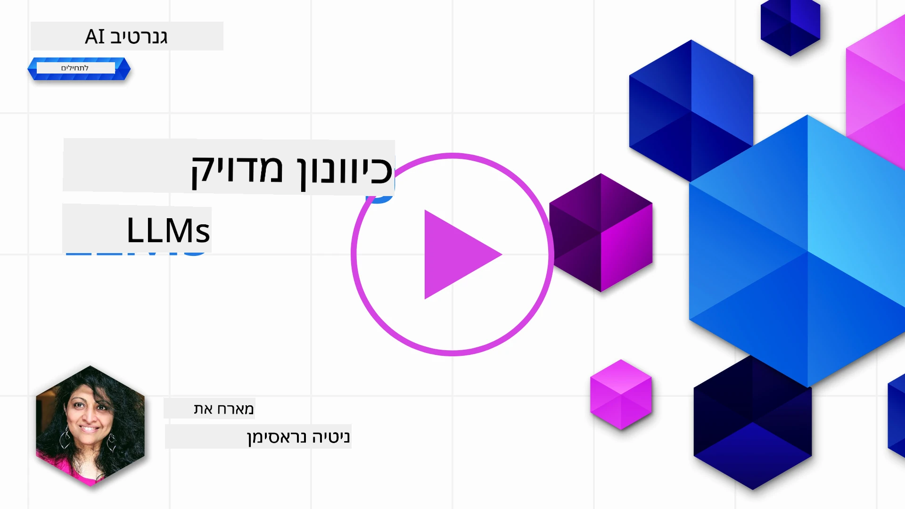

# כוונון מותאם אישית של מודל השפה הגדול שלך

שימוש במודלים גדולים של שפה לבניית אפליקציות בינה מלאכותית יצירתית מביא איתו אתגרים חדשים. סוגיה מרכזית היא הבטחת איכות התגובה (דיוק ורלוונטיות) בתוכן שנוצר על ידי המודל עבור בקשת המשתמש. בשיעורים קודמים דיברנו על טכניקות כמו הנדסת הנחיה והפקה משופרת מבוססת שליפה שמנסות לפתור את הבעיה על ידי _שינוי קלט ההנחיה_ למודל הקיים.

בשיעור של היום, נדבר על טכניקה שלישית, **כוונון מותאם אישית**, שמנסה לפתור את האתגר על ידי _אימון מחדש של המודל עצמו_ עם נתונים נוספים. בואו נצלול לפרטים.

## יעדי הלמידה

השיעור הזה מציג את מושג הכוונון המותאם למודלים של שפה מאומנים מראש, בוחן את היתרונות והאתגרים בגישה זו, ומספק הדרכה מתי ואיך להשתמש בכוונון מותאם לשיפור ביצועי מודלי הבינה המלאכותית היצירתיים שלך.

בסיום השיעור, תוכל לענות על השאלות הבאות:

- מהו כוונון מותאם למודלי שפה?
- מתי ולמה כוונון מותאם מועיל?
- כיצד אפשר לכוונן מודל מאומן מראש?
- מהם המגבלות של כוונון מותאם?

מוכן? מתחילים.

## מדריך מאויר

רוצה לקבל תמונה כללית של מה שנכסה לפני שנצלול פנימה? בדוק את המדריך המאויר שמתאר את מסע הלמידה לשיעור זה - מלמידת המושגים המרכזיים והמוטיבציה לכוונון המותאם, להבנת התהליך והפרקטיקות הטובות ביותר לביצוע משימת הכוונון. זוהי נושא מרתק לחקירה, אז אל תשכח לבדוק את דף ה-[משאבים](./RESOURCES.md?WT.mc_id=academic-105485-koreyst) לקישורים נוספים התומכים במסע הלמידה העצמית שלך!

## מהו כוונון מותאם למודלי שפה?

בהגדרה, מודלים גדולים של שפה הם _מאומנים מראש_ על כמויות גדולות של טקסט ממקורות מגוונים כולל האינטרנט. כפי שלמדנו בשיעורים קודמים, עלינו להשתמש בטכניקות כמו _הנדסת הנחיה_ ו-_הפקה משופרת מבוססת שליפה_ לשפר את איכות התגובות של המודל לשאלות המשתמש ("הנחיות").

טכניקת הנדסת הנחיה פופולרית כוללת מתן יותר כיוון למודל לגבי מה מצופה בתגובה על ידי מתן _הנחיות מפורשות_ או _מתן כמה דוגמאות_ (הנחיות מרומזות). זה מכונה _למידה עם דוגמאות מועטות_ אך יש לה שתי מגבלות:

- מגבלות התווים של המודל יכולות להגביל את מספר הדוגמאות שניתן לתת, ולהפחית את היעילות.
- עלויות התווים של המודל יכולות להפוך את הוספת הדוגמאות לכל הנחיה ליקרה, ולהפחית את הגמישות.

כוונון מותאם הוא פרקטיקה נפוצה במערכות למידת מכונה שבהן לוקחים מודל מאומן מראש ומאמנים אותו מחדש עם נתונים חדשים כדי לשפר את הביצועים למשימה מסוימת. בהקשר של מודלי שפה, ניתן לכוונן את המודל המאומן מראש _עם סט מסודר של דוגמאות למשימה או תחום יישום נתון_ כדי ליצור **מודל מותאם אישית** שעשוי להיות מדויק ורלוונטי יותר למשימה או תחום זה. תועלת משנית של כוונון מותאם היא שהוא גם יכול להפחית את מספר הדוגמאות הנדרשות ללמידה עם דוגמאות מועטות - להפחתת שימוש בתווים והוצאות נלוות.

## מתי ולמה כדאי לבצע כוונון מותאם למודלים?

בהקשר _זה_, כשאנחנו מדברים על כוונון מותאם אישית, הכוונה היא לכוונון מפוקח שבו האימון מחדש נעשה על ידי **הוספת נתונים חדשים** שלא היו חלק ממערכת הנתונים המקורית לאימון. זה שונה מגישה של כוונון לא מפוקח שבה המודל מאומן מחדש על הנתונים המקוריים, אך עם היפרפרמטרים שונים.

הנקודה החשובה לזכור היא שכיוונון מותאם זו טכניקה מתקדמת שדורשת רמה מסוימת של מומחיות לקבלת התוצאות הרצויות. אם נעשה בצורה לא נכונה, לא צפויים שיפורים ניכרים ואף ייתכן פגיעה בביצועי המודל עבור התחום המיועד.

לפיכך, לפני שתלמד "איך" לכוונן מודלים של שפה, עליך לדעת "למה" כדאי ללכת בדרך זו, ו"מתי" להתחיל בתהליך הכוונון. התחל בשאלות הבאות:

- **מקרה שימוש**: מהו _מקרה השימוש_ שלך לכיוונון? איזה היבט של המודל המאומן מראש הקיים אתה רוצה לשפר?
- **חלופות**: האם ניסית _טכניקות אחרות_ להשגת התוצאות הרצויות? השתמש בהן כדי ליצור בסיס להשוואה.
  - הנדסת הנחיה: נסה טכניקות כמו הנחיה עם דוגמאות מועטות שביעות רצון. הערך את איכות התגובות.
  - הפקה משופרת מבוססת שליפה: נסה לשפר את ההנחיות בתוצאות שמשוחזרות מחיפוש בנתונים שלך. הערך את איכות התגובות.
- **עלויות**: האם זיהית את העלויות הכרוכות בכוונון מותאם?
  - כיווננות - האם המודל המאומן מראש זמין לכוונון?
  - מאמץ - להכנת נתוני אימון, הערכה ושיפור המודל.
  - חישוב - להפעלת תהליכי כוונון ולפריסת המודל המכוון.
  - נתונים - גישה לדוגמאות איכותיות מספיק כרוך בכוונון יעיל.
- **יתרונות**: האם ווידאת את היתרונות של כוונון מותאם?
  - איכות - האם המודל המכוון עלה על הבייסליין?
  - עלות - האם יש הפחתת שימוש בתווים על ידי פישוט הנחיות?
  - הרחבה - האם תוכל להשתמש מחדש במודל הבסיסי לתחומים חדשים?

על ידי מענה על שאלות אלו, תוכל להחליט אם כוונון מותאם הוא הגישה הנכונה למקרה השימוש שלך. באופן אידיאלי, הגישה היא תקפה רק אם היתרונות עולים על העלויות. ברגע שהחלטת להמשיך, הגיע הזמן לחשוב על _איך_ תוכל לכוונן את המודל המאומן מראש.

רוצה לקבל תובנות נוספות על תהליך קבלת ההחלטות? צפה ב-[להכוין או לא להכווין](https://www.youtube.com/watch?v=0Jo-z-MFxJs)

## כיצד נוכל לכוונן מודל מאומן מראש?

כדי לכוונן מודל מאומן מראש, אתה צריך:

- מודל מאומן מראש לכוונון
- מערך נתונים לשימוש בכוונון
- סביבה לאימון להפעיל את משימת הכוונון
- סביבה לאירוח לפריסת המודל המכוון

## כוונון מותאם בפעולה

המשאבים הבאים מספקים הדרכות שלב-אחר-שלב שיעזרו לך לעבור דוגמה אמיתית עם מודל נבחר ומערך נתונים מסודר. כדי לעבוד עם ההדרכות, אתה זקוק לחשבון אצל הספק הספציפי, יחד עם גישה למודל ולמערכי הנתונים הרלוונטיים.

| ספק        | הדרכה                                                                                                                                                                      | תיאור                                                                                                                                                                                                                                                                                                                                                                                                                            |
|------------|-----------------------------------------------------------------------------------------------------------------------------------------------------------------------------|----------------------------------------------------------------------------------------------------------------------------------------------------------------------------------------------------------------------------------------------------------------------------------------------------------------------------------------------------------------------------------------------------------------------------------|
| OpenAI     | [איך לכוונן מודלי שיחה](https://github.com/openai/openai-cookbook/blob/main/examples/How_to_finetune_chat_models.ipynb?WT.mc_id=academic-105485-koreyst)                 | למד כיצד לכוונן `gpt-35-turbo` לתחום ספציפי ("עוזר מתכונים") על ידי הכנת נתוני אימון, הפעלת משימת הכוונון, ושימוש במודל המכוון לניבוי.                                                                                                                                                                                                                                                                                          |
| Azure OpenAI | [מדריך לכוונון GPT 3.5 Turbo](https://learn.microsoft.com/azure/ai-services/openai/tutorials/fine-tune?tabs=python-new%2Ccommand-line&WT.mc_id=academic-105485-koreyst) | למד כיצד לכוונן את מודל `gpt-35-turbo-0613` **ב-Azure** על ידי יצירת והעלאת נתוני אימון, הפעלת משימת הכוונון, פריסה ושימוש במודל החדש.                                                                                                                                                                                                                                                                                      |
| Hugging Face | [כוונון מודלי שפה עם Hugging Face](https://www.philschmid.de/fine-tune-llms-in-2024-with-trl?WT.mc_id=academic-105485-koreyst)                                            | פוסט בבלוג זה מדריך איך לכוונן _מודל שפה פתוח_ (לדוגמה: `CodeLlama 7B`) באמצעות ספריית [transformers](https://huggingface.co/docs/transformers/index?WT.mc_id=academic-105485-koreyst) ו-[למידת חיזוק על-ידי Transformer (TRL)](https://huggingface.co/docs/trl/index?WT.mc_id=academic-105485-koreyst) עם [מערכי נתונים](https://huggingface.co/docs/datasets/index?WT.mc_id=academic-105485-koreyst) פתוחים ב-Hugging Face. |
|            |                                                                                                                                                                             |                                                                                                                                                                                                                                                                                                                                                                                                                                  |
| 🤗 AutoTrain | [כוונון מודלי שפה עם AutoTrain](https://github.com/huggingface/autotrain-advanced/?WT.mc_id=academic-105485-koreyst)                                                    | AutoTrain (או AutoTrain Advanced) היא ספריית פייתון שפותחה על ידי Hugging Face המאפשרת כוונון למשימות שונות כולל כוונון מודלי שפה. AutoTrain היא פתרון ללא קוד, וניתן לבצע כוונון בענן הפרטי שלך, ב-Hugging Face Spaces או מקומית. היא תומכת בממשק משתמש ווב, שורת פקודה ואימון דרך קבצי קונפיגורציה ב-YAML.                                                                                                                        |
|            |                                                                                                                                                                             |                                                                                                                                                                                                                                                                                                                                                                                                                                  |
| 🦥 Unsloth | [כוונון מודלי שפה עם Unsloth](https://github.com/unslothai/unsloth)                                                                                                      | Unsloth היא מסגרת קוד פתוח התומכת בכוונון מודלי שפה ולמידת חיזוק (RL). Unsloth מפשט אימון מקומי, הערכה ופריסה עם [מחברות](https://github.com/unslothai/notebooks) מוכנות לשימוש. היא תומכת גם בטקסט לדיבור (TTS), מודלי BERT ומודלים מולטימודאליים. להתחלה, קרא את מדריך [כוונון מודלי השפה](https://docs.unsloth.ai/get-started/fine-tuning-llms-guide).                                                                                           |
|            |                                                                                                                                                                             |                                                                                                                                                                                                                                                                                                                                                                                                                                  |
## מטלה

בחר אחת מההדרכות למעלה ועבור דרכה. _ייתכן ונשכפל גרסה של ההדרכות הללו במחברות Jupyter במאגר זה כהפניה בלבד. אנא השתמש במקורות המקוריים ישירות לקבלת הגרסאות העדכניות ביותר_.

## עבודה מעולה! המשך ללמוד.

לאחר סיום שיעור זה, בדוק את [אוסף למידת הבינה המלאכותית היצירתית שלנו](https://aka.ms/genai-collection?WT.mc_id=academic-105485-koreyst) כדי להמשיך לשפר את הידע שלך בתחום הבינה המלאכותית היצירתית!

מזל טוב!! סיימת את השיעור הסופי מסדרת v2 לקורס זה! אל תעצור מללמוד ולבנות. \*\*בדוק את עמוד ה-[משאבים](RESOURCES.md?WT.mc_id=academic-105485-koreyst) לרשימת הצעות נוספות רק לנושא זה.

גם סדרת השיעורים v1 שלנו עודכנה עם מטלות ומושגים נוספים. קח דקה לרענן את הידע שלך - בבקשה [שתף את שאלותיך והמשוב שלך](https://github.com/microsoft/generative-ai-for-beginners/issues?WT.mc_id=academic-105485-koreyst) כדי לסייע לנו לשפר את השיעורים האלה עבור הקהילה.

---

<!-- CO-OP TRANSLATOR DISCLAIMER START -->
**כתב ויתור**:  
מסמך זה תורגם בעזרת שירות תרגום מבוסס בינה מלאכותית [Co-op Translator](https://github.com/Azure/co-op-translator). אמנם אנו שואפים לדייק, יש לקחת בחשבון כי תרגומים אוטומטיים עלולים להכיל טעויות או אי דיוקים. יש לראות במסמך המקורי בשפת המקור כמקור הסמכותי. למידע קריטי מומלץ להשתמש בתרגום מקצועי של מתרגם אנושי. אנו לא נושאים באחריות לכל אי הבנה או פרשנות שגויה הנובעת משימוש בתרגום זה.
<!-- CO-OP TRANSLATOR DISCLAIMER END -->