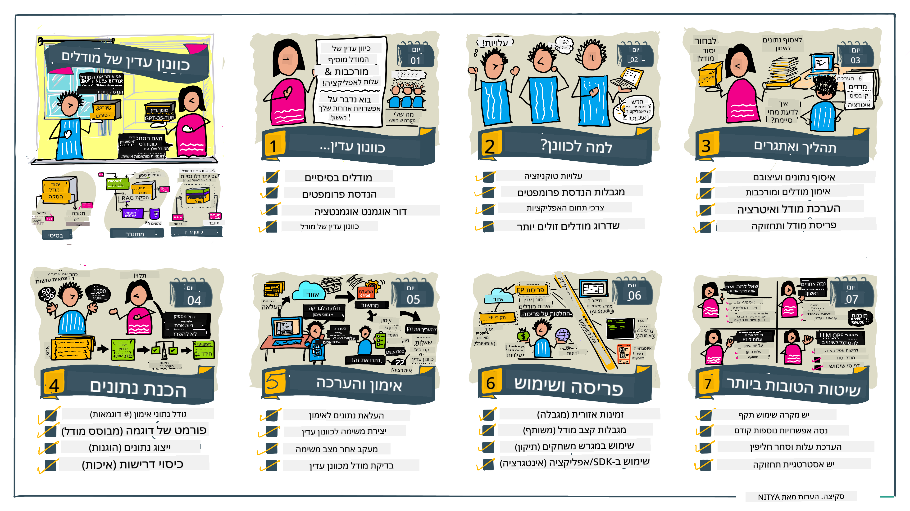

<!--
CO_OP_TRANSLATOR_METADATA:
{
  "original_hash": "68664f7e754a892ae1d8d5e2b7bd2081",
  "translation_date": "2025-06-26T00:46:20+00:00",
  "source_file": "18-fine-tuning/README.md",
  "language_code": "he"
}
-->

# כיוונון עדין של ה-LLM שלך

השימוש במודלים גדולים של שפה לבניית יישומי AI גנרטיביים מגיע עם אתגרים חדשים. נושא מרכזי הוא הבטחת איכות התגובה (דיוק ורלוונטיות) בתוכן שנוצר על ידי המודל עבור בקשת משתמש נתונה. בשיעורים קודמים, דנו בטכניקות כמו הנדסת פקודות והפקה מוגברת אחזור המנסות לפתור את הבעיה על ידי _שינוי קלט הפקודה_ למודל הקיים.

בשיעור של היום, נדון בטכניקה שלישית, **כיוונון עדין**, שמנסה להתמודד עם האתגר על ידי _אימון מחדש של המודל עצמו_ עם נתונים נוספים. בואו נצלול לפרטים.

## מטרות למידה

שיעור זה מציג את המושג של כיוונון עדין למודלים של שפה מאומנים מראש, בוחן את היתרונות והאתגרים של גישה זו, ומספק הנחיות על מתי וכיצד להשתמש בכיוונון עדין לשיפור הביצועים של מודלי AI גנרטיביים שלך.

בסוף השיעור הזה, תוכל לענות על השאלות הבאות:

- מהו כיוונון עדין למודלים של שפה?
- מתי ולמה כיוונון עדין הוא שימושי?
- איך אפשר לכוון עדין מודל מאומן מראש?
- מהן המגבלות של כיוונון עדין?

מוכנים? בואו נתחיל.

## מדריך מאויר

רוצים לקבל את התמונה הגדולה של מה שנכסה לפני שנצלול פנימה? בדקו את המדריך המאויר הזה שמתאר את מסע הלמידה לשיעור זה - מלמידת המושגים הבסיסיים והמוטיבציה לכיוונון עדין, להבנת התהליך והפרקטיקות הטובות ביותר לביצוע משימת הכיוונון העדין. זהו נושא מרתק לחקירה, אז אל תשכחו לבדוק את עמוד [המשאבים](./RESOURCES.md?WT.mc_id=academic-105485-koreyst) לקישורים נוספים שיתמכו במסע הלמידה העצמית שלכם!

## מהו כיוונון עדין למודלים של שפה?

לפי ההגדרה, מודלים גדולים של שפה הם _מאומנים מראש_ על כמויות גדולות של טקסט שמקורם במקורות מגוונים כולל האינטרנט. כפי שלמדנו בשיעורים קודמים, אנו זקוקים לטכניקות כמו _הנדסת פקודות_ ו_הפקה מוגברת אחזור_ כדי לשפר את איכות התגובות של המודל לשאלות המשתמש ("פקודות").

טכניקת הנדסת פקודות פופולרית כוללת מתן למודל יותר הנחיות על מה מצופה בתגובה או על ידי מתן _הוראות_ (הנחיות מפורשות) או _מתן מספר דוגמאות_ (הנחיות מרומזות). זה מכונה _למידה עם מעט דוגמאות_ אך יש לה שני מגבלות:

- מגבלות אסימונים של המודל יכולות להגביל את מספר הדוגמאות שניתן לתת, ולהגביל את היעילות.
- עלויות אסימונים של המודל יכולות להפוך את הוספת הדוגמאות לכל פקודה ליקרה, ולהגביל את הגמישות.

כיוונון עדין הוא פרקטיקה נפוצה במערכות למידה מכונה שבה אנו לוקחים מודל מאומן מראש ומאמנים אותו מחדש עם נתונים חדשים כדי לשפר את ביצועיו במשימה ספציפית. בהקשר של מודלים לשוניים, ניתן לכוון עדין את המודל המאומן מראש _עם סט דוגמאות מותאם למשימה או תחום יישום נתון_ כדי ליצור **מודל מותאם אישית** שעשוי להיות מדויק ורלוונטי יותר למשימה או תחום ספציפי זה. תועלת צדדית של כיוונון עדין היא שהוא יכול גם להפחית את מספר הדוגמאות הנדרשות ללמידה עם מעט דוגמאות - מה שמפחית את השימוש באסימונים ועלויות קשורות.

## מתי ולמה עלינו לכוון עדין מודלים?

בהקשר _זה_, כשאנו מדברים על כיוונון עדין, אנו מתייחסים לכיוונון עדין **מנוהל** שבו האימון מחדש נעשה על ידי **הוספת נתונים חדשים** שלא היו חלק ממערך הנתונים המקורי. זה שונה מגישה של כיוונון עדין לא מנוהל שבה המודל מאומן מחדש על הנתונים המקוריים, אך עם היפרפרמטרים שונים.

הדבר המרכזי לזכור הוא שכיוונון עדין הוא טכניקה מתקדמת שדורשת רמת מומחיות מסוימת כדי להשיג את התוצאות הרצויות. אם נעשה בצורה לא נכונה, הוא עשוי שלא לספק את השיפורים המצופים, ואפילו עלול לפגוע בביצועי המודל עבור התחום הממוקד שלך.

אז, לפני שאתה לומד "איך" לכוון עדין מודלים לשוניים, אתה צריך לדעת "למה" עליך לנקוט בדרך זו, ו"מתי" להתחיל את תהליך הכיוונון העדין. התחל בשאלת עצמך את השאלות הבאות:

- **מקרה שימוש**: מהו _מקרה השימוש_ שלך לכיוונון עדין? איזה היבט של המודל המאומן מראש הנוכחי אתה רוצה לשפר?
- **חלופות**: האם ניסית _טכניקות אחרות_ להשגת התוצאות הרצויות? השתמש בהן כדי ליצור בסיס להשוואה.
  - הנדסת פקודות: נסה טכניקות כמו פקודות עם מעט דוגמאות עם דוגמאות לתגובות פקודות רלוונטיות. הערך את איכות התגובות.
  - הפקה מוגברת אחזור: נסה להוסיף לפקודות תוצאות שאילתות שהושגו על ידי חיפוש בנתונים שלך. הערך את איכות התגובות.
- **עלויות**: האם זיהית את העלויות לכיוונון עדין?
  - כיוונון - האם המודל המאומן מראש זמין לכיוונון עדין?
  - מאמץ - להכנת נתוני אימון, הערכה ושיפור המודל.
  - מחשוב - להפעלת משימות כיוונון עדין, ופריסת המודל המכוון עדין
  - נתונים - גישה לדוגמאות איכותיות מספיק להשפעת כיוונון עדין
- **יתרונות**: האם אישרת את היתרונות לכיוונון עדין?
  - איכות - האם המודל המכוון עדין עלה על הבסיס?
  - עלות - האם זה מפחית את השימוש באסימונים על ידי הפשטת פקודות?
  - הרחבה - האם ניתן להשתמש מחדש במודל הבסיס לתחומים חדשים?

על ידי מענה על שאלות אלו, תוכל להחליט אם כיוונון עדין הוא הגישה הנכונה למקרה השימוש שלך. באופן אידיאלי, הגישה תקפה רק אם היתרונות עולים על העלויות. ברגע שאתה מחליט להמשיך, הגיע הזמן לחשוב על _איך_ תוכל לכוון עדין את המודל המאומן מראש.

רוצה לקבל תובנות נוספות על תהליך קבלת ההחלטות? צפה ב[לכוון עדין או לא לכוון עדין](https://www.youtube.com/watch?v=0Jo-z-MFxJs)

## איך נוכל לכוון עדין מודל מאומן מראש?

כדי לכוון עדין מודל מאומן מראש, אתה צריך:

- מודל מאומן מראש לכיוונון עדין
- מערך נתונים לשימוש בכיוונון עדין
- סביבת אימון להפעלת משימת הכיוונון העדין
- סביבת אירוח לפריסת המודל המכוון עדין

## כיוונון עדין בפעולה

המשאבים הבאים מספקים מדריכים שלב אחר שלב כדי להוליך אותך דרך דוגמה אמיתית באמצעות מודל נבחר עם מערך נתונים מותאם. כדי לעבור על המדריכים האלה, תצטרך חשבון אצל ספק מסוים, יחד עם גישה למודל ולמערכי הנתונים הרלוונטיים.

| ספק          | מדריך                                                                                                                                                                       | תיאור                                                                                                                                                                                                                                                                                                                                                                                                                        |
| ------------ | ------------------------------------------------------------------------------------------------------------------------------------------------------------------------------ | ---------------------------------------------------------------------------------------------------------------------------------------------------------------------------------------------------------------------------------------------------------------------------------------------------------------------------------------------------------------------------------------------------------------------------------- |
| OpenAI       | [איך לכוון עדין מודלים של צ'אט](https://github.com/openai/openai-cookbook/blob/main/examples/How_to_finetune_chat_models.ipynb?WT.mc_id=academic-105485-koreyst)                | למד לכוון עדין `gpt-35-turbo` עבור תחום ספציפי ("עוזר למתכונים") על ידי הכנת נתוני אימון, הרצת משימת הכיוונון העדין, ושימוש במודל המכוון עדין להסקה.                                                                                                                                                                                                                                              |
| Azure OpenAI | [מדריך כיוונון עדין ל-GPT 3.5 Turbo](https://learn.microsoft.com/azure/ai-services/openai/tutorials/fine-tune?tabs=python-new%2Ccommand-line?WT.mc_id=academic-105485-koreyst) | למד לכוון עדין מודל `gpt-35-turbo-0613` **ב-Azure** על ידי ביצוע צעדים ליצירה והעלאת נתוני אימון, הרצת משימת הכיוונון העדין. פרוס והשתמש במודל החדש.                                                                                                                                                                                                                                                                 |
| Hugging Face | [כיוונון עדין של LLMs עם Hugging Face](https://www.philschmid.de/fine-tune-llms-in-2024-with-trl?WT.mc_id=academic-105485-koreyst)                                               | פוסט בבלוג זה מוליך אותך בכיוונון עדין של _LLM פתוח_ (לדוגמה: `CodeLlama 7B`) באמצעות ספריית [transformers](https://huggingface.co/docs/transformers/index?WT.mc_id=academic-105485-koreyst) ו[TRL (Reinforcement Learning)](https://huggingface.co/docs/trl/index?WT.mc_id=academic-105485-koreyst) עם [datasets](https://huggingface.co/docs/datasets/index?WT.mc_id=academic-105485-koreyst) פתוחים ב-Hugging Face. |
|              |                                                                                                                                                                                |                                                                                                                                                                                                                                                                                                                                                                                                                                    |
| 🤗 AutoTrain | [כיוונון עדין של LLMs עם AutoTrain](https://github.com/huggingface/autotrain-advanced/?WT.mc_id=academic-105485-koreyst)                                                         | AutoTrain (או AutoTrain Advanced) היא ספריית פייתון שפותחה על ידי Hugging Face שמאפשרת כיוונון עדין למשימות רבות ושונות כולל כיוונון עדין של LLM. AutoTrain היא פתרון ללא קוד וכיוונון עדין יכול להתבצע בענן שלך, ב-Hugging Face Spaces או מקומית. היא תומכת הן בממשק משתמש מבוסס רשת, CLI ואימון באמצעות קובצי תצורה yaml.                                                                               |
|              |                                                                                                                                                                                |                                                                                                                                                                                                                                                                                                                                                                                                                                    |

## משימה

בחר אחד מהמדריכים לעיל ועבור עליהם. _ייתכן שנשכפל גרסה של מדריכים אלה ב-Jupyter Notebooks במאגר זה לצורך הפניה בלבד. אנא השתמש במקורות המקוריים ישירות כדי לקבל את הגרסאות האחרונות_.

## עבודה נהדרת! המשך ללמוד.

לאחר שסיימת את השיעור הזה, בדוק את [אוסף הלמידה של AI גנרטיבי](https://aka.ms/genai-collection?WT.mc_id=academic-105485-koreyst) שלנו כדי להמשיך להעמיק את הידע שלך ב-AI גנרטיבי!

ברכות!! השלמת את השיעור האחרון מסדרת v2 של הקורס הזה! אל תפסיק ללמוד ולבנות. \*\*בדוק את עמוד [המשאבים](RESOURCES.md?WT.mc_id=academic-105485-koreyst) לרשימת הצעות נוספות רק לנושא זה.

סדרת v1 של השיעורים שלנו עודכנה גם היא עם יותר משימות ומושגים. אז קח דקה לרענן את הידע שלך - ואל תשכח [לשתף את השאלות והמשוב שלך](https://github.com/microsoft/generative-ai-for-beginners/issues?WT.mc_id=academic-105485-koreyst) כדי לעזור לנו לשפר את השיעורים האלה עבור הקהילה.

**כתב ויתור**:  
מסמך זה תורגם באמצעות שירות תרגום AI [Co-op Translator](https://github.com/Azure/co-op-translator). בעוד שאנו שואפים לדיוק, אנא היו מודעים לכך שתרגומים אוטומטיים עשויים להכיל שגיאות או אי דיוקים. המסמך המקורי בשפתו המקורית צריך להיחשב כמקור הסמכותי. עבור מידע קריטי, מומלץ תרגום מקצועי על ידי אדם. איננו אחראים לאי הבנות או לפרשנויות שגויות הנובעות מהשימוש בתרגום זה.