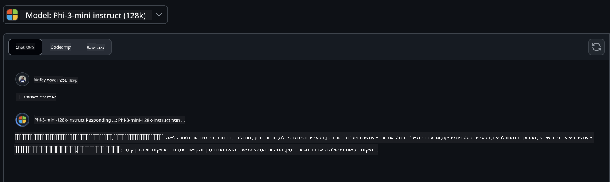
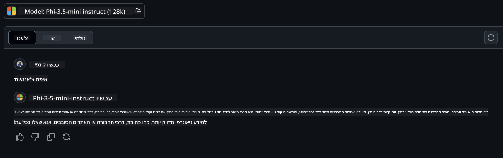

<!--
CO_OP_TRANSLATOR_METADATA:
{
  "original_hash": "124ad36cfe96f74038811b6e2bb93e9d",
  "translation_date": "2025-05-20T10:11:17+00:00",
  "source_file": "19-slm/README.md",
  "language_code": "he"
}
-->
# מבוא למודלים לשוניים קטנים עבור AI גנרטיבי למתחילים

AI גנרטיבי הוא תחום מרתק של בינה מלאכותית המתמקד ביצירת מערכות המסוגלות ליצור תוכן חדש. תוכן זה יכול לנוע מטקסט ותמונות ועד מוזיקה ואפילו סביבות וירטואליות שלמות. אחד היישומים המרגשים ביותר של AI גנרטיבי הוא בתחום המודלים הלשוניים.

## מה הם מודלים לשוניים קטנים?

מודל לשוני קטן (SLM) מייצג גרסה מופחתת של מודל לשוני גדול (LLM), תוך ניצול רבים מהעקרונות והטכניקות הארכיטקטוניים של LLM, בעודו מציג טביעת רגל חישובית מופחתת באופן משמעותי. SLMs הם תת-קבוצה של מודלים לשוניים שנועדו ליצור טקסט דמוי אנושי. בניגוד לעמיתיהם הגדולים יותר, כמו GPT-4, SLMs הם קומפקטיים ויעילים יותר, מה שהופך אותם לאידיאליים ליישומים שבהם משאבי חישוב מוגבלים. למרות גודלם הקטן יותר, הם עדיין יכולים לבצע מגוון משימות. בדרך כלל, SLMs נבנים על ידי דחיסה או זיקוק של LLMs, במטרה לשמר חלק ניכר מהפונקציונליות והיכולות הלשוניות של המודל המקורי. הפחתת גודל המודל מפחיתה את המורכבות הכוללת, מה שהופך את SLMs ליעילים יותר מבחינת שימוש בזיכרון ודרישות חישוביות. למרות האופטימיזציות הללו, SLMs יכולים עדיין לבצע מגוון רחב של משימות עיבוד שפה טבעית (NLP):

- יצירת טקסט: יצירת משפטים או פסקאות קוהרנטיים ורלוונטיים בהקשר.
- השלמת טקסט: חיזוי והשלמת משפטים על בסיס הנחיה נתונה.
- תרגום: המרת טקסט משפה אחת לאחרת.
- סיכום: דחיסת קטעי טקסט ארוכים לסיכומים קצרים יותר ונוחים יותר לעיכול.

למרות שישנם ויתורים בביצועים או בעומק ההבנה בהשוואה לעמיתיהם הגדולים יותר.

## איך עובדים מודלים לשוניים קטנים?

SLMs מאומנים על כמויות גדולות של נתוני טקסט. במהלך האימון, הם לומדים את הדפוסים והמבנים של השפה, מה שמאפשר להם ליצור טקסט שהוא נכון דקדוקית ומתאים בהקשר. תהליך האימון כולל:

- איסוף נתונים: איסוף מערכי נתונים גדולים של טקסט ממקורות שונים.
- עיבוד מקדים: ניקוי וארגון הנתונים כדי להפוך אותם למתאימים לאימון.
- אימון: שימוש באלגוריתמים של למידת מכונה כדי ללמד את המודל כיצד להבין וליצור טקסט.
- כוונון עדין: התאמת המודל לשיפור ביצועיו במשימות ספציפיות.

פיתוח SLMs מתיישר עם הצורך הגובר במודלים שניתן לפרוס בסביבות מוגבלות משאבים, כמו מכשירים ניידים או פלטפורמות מחשוב קצה, שבהן LLMs בקנה מידה מלא עשויים להיות לא מעשיים עקב דרישות המשאבים הכבדות שלהם. על ידי התמקדות ביעילות, SLMs מאזנים ביצועים עם נגישות, ומאפשרים יישום רחב יותר בתחומים שונים.


## מטרות למידה

בשיעור זה, אנו מקווים להציג את הידע על SLM ולשלב אותו עם Microsoft Phi-3 כדי ללמוד תרחישים שונים בתוכן טקסט, חזון ו-MoE. בסוף השיעור הזה, אתה אמור להיות מסוגל לענות על השאלות הבאות:

- מהו SLM
- מה ההבדל בין SLM ל-LLM
- מהי משפחת Microsoft Phi-3/3.5
- כיצד להסיק את משפחת Microsoft Phi-3/3.5

מוכן? בואו נתחיל.

## ההבדלים בין מודלים לשוניים גדולים (LLMs) למודלים לשוניים קטנים (SLMs)

גם LLMs וגם SLMs בנויים על עקרונות בסיסיים של למידת מכונה הסתברותית, בעקבות גישות דומות בעיצוב הארכיטקטוני שלהם, מתודולוגיות אימון, תהליכי יצירת נתונים וטכניקות הערכת מודלים. עם זאת, מספר גורמים מרכזיים מבדילים בין שני סוגי המודלים הללו.

## יישומים של מודלים לשוניים קטנים

ל-SLMs יש מגוון רחב של יישומים, כולל:

- צ'אטבוטים: מתן תמיכה ללקוחות ותקשורת עם משתמשים בצורה שיחתית.
- יצירת תוכן: סיוע לכותבים על ידי יצירת רעיונות או אפילו ניסוח מאמרים שלמים.
- חינוך: עזרה לסטודנטים בהכנת מטלות כתיבה או בלמידת שפות חדשות.
- נגישות: יצירת כלים עבור אנשים עם מוגבלויות, כמו מערכות המרה מטקסט לדיבור.

**גודל**

הבדל עיקרי בין LLMs ל-SLMs טמון בקנה המידה של המודלים. LLMs, כמו ChatGPT (GPT-4), יכולים לכלול כ-1.76 טריליון פרמטרים, בעוד ש-SLMs בקוד פתוח כמו Mistral 7B מתוכננים עם פרמטרים משמעותית פחותים—כ-7 מיליארד. פער זה נובע בעיקר מהבדלים בארכיטקטורת המודל ותהליכי האימון. לדוגמה, ChatGPT משתמש במנגנון תשומת לב עצמית במסגרת מקודד-מפענח, בעוד ש-Mistral 7B משתמש בתשומת לב חלונית מחליקה, המאפשרת אימון יעיל יותר בתוך מודל מפענח בלבד. שונות ארכיטקטונית זו יש לה השלכות עמוקות על המורכבות והביצועים של המודלים הללו.

**הבנה**

SLMs בדרך כלל מותאמים לביצועים בתוך תחומים ספציפיים, מה שהופך אותם למתמחים מאוד אך פוטנציאלית מוגבלים ביכולתם לספק הבנה רחבה בהקשר על פני תחומי ידע מרובים. לעומת זאת, LLMs שואפים לדמות אינטליגנציה אנושית ברמה מקיפה יותר. מאומנים על מערכי נתונים גדולים ומגוונים, LLMs מתוכננים להצליח במגוון תחומים, ולהציע רבגוניות והתאמה רבה יותר. כתוצאה מכך, LLMs מתאימים יותר למגוון רחב יותר של משימות המשך, כמו עיבוד שפה טבעית ותכנות.

**מחשוב**

תהליכי האימון והפריסה של LLMs הם תהליכים עתירי משאבים, ולעיתים דורשים תשתית חישובית משמעותית, כולל אשכולות GPU בקנה מידה גדול. לדוגמה, אימון מודל כמו ChatGPT מאפס עשוי לדרוש אלפי GPUs במשך תקופות ממושכות. לעומת זאת, SLMs, עם ספירת הפרמטרים הקטנה יותר שלהם, נגישים יותר מבחינת משאבי חישוב. מודלים כמו Mistral 7B יכולים להיות מאומנים ומופעלים על מכונות מקומיות המצוידות ביכולות GPU מתונות, למרות שהאימון עדיין דורש מספר שעות על פני מספר GPUs.

**הטיה**

הטיה היא בעיה ידועה ב-LLMs, בעיקר בשל טבע הנתונים עליהם הם מאומנים. מודלים אלו מסתמכים לעיתים קרובות על נתונים גולמיים וזמינים באופן חופשי מהאינטרנט, אשר עשויים לייצג או לייצג באופן שגוי קבוצות מסוימות, להציג תיוג שגוי או לשקף הטיות לשוניות המושפעות מדיאלקט, וריאציות גיאוגרפיות וכללי דקדוק. בנוסף, מורכבות הארכיטקטורות של LLMs יכולה להחמיר בטעות את ההטיה, אשר עשויה להיעלם מעיניהם ללא כוונון עדין. מצד שני, SLMs, מאומנים על מערכי נתונים מוגבלים יותר, ספציפיים לתחום, פחות חשופים להטיות כאלה, אם כי הם לא חסינים מפניהן.

**הסקה**

הגודל המופחת של SLMs מעניק להם יתרון משמעותי מבחינת מהירות ההסקה, מה שמאפשר להם ליצור פלטים ביעילות על חומרה מקומית ללא צורך בעיבוד מקביל נרחב. לעומת זאת, LLMs, בשל גודלם ומורכבותם, דורשים לעיתים קרובות משאבי חישוב מקבילים משמעותיים כדי להשיג זמני הסקה מקובלים. נוכחותם של משתמשים מרובים בו-זמנית מאטה עוד יותר את זמני התגובה של LLMs, במיוחד כאשר הם נפרסים בקנה מידה גדול.

לסיכום, בעוד ש-LLMs ו-SLMs חולקים בסיס יסודי בלמידת מכונה, הם נבדלים משמעותית מבחינת גודל המודל, דרישות משאבים, הבנה הקשרית, רגישות להטיה ומהירות הסקה. הבדלים אלו משקפים את ההתאמה שלהם לשימושים שונים, כאשר LLMs הם רבגוניים יותר אך כבדים במשאבים, ו-SLMs מציעים יעילות ספציפית לתחום עם דרישות חישוביות מופחתות.

***הערה: בפרק זה, נציג את SLM באמצעות Microsoft Phi-3 / 3.5 כדוגמה.***

## הצגת משפחת Phi-3 / Phi-3.5

משפחת Phi-3 / 3.5 מכוונת בעיקר לתרחישי יישומים של טקסט, חזון וסוכן (MoE):

### Phi-3 / 3.5 הנחיה

בעיקר עבור יצירת טקסט, השלמת צ'אט ומיצוי מידע תוכן וכו'.

**Phi-3-mini**

המודל הלשוני 3.8B זמין ב-Microsoft Azure AI Studio, Hugging Face ו-Ollama. מודלי Phi-3 מתעלים משמעותית על מודלים לשוניים בגודל שווה וגדול יותר במדדים מרכזיים (ראה מספרי מדדים למטה, מספרים גבוהים יותר הם טובים יותר). Phi-3-mini מתעלה על מודלים בגודל כפול, בעוד ש-Phi-3-small ו-Phi-3-medium מתעלים על מודלים גדולים יותר, כולל GPT-3.5.

**Phi-3-small & medium**

עם רק 7 מיליארד פרמטרים, Phi-3-small מנצח את GPT-3.5T במגוון מדדי שפה, הסקה, קידוד ומתמטיקה. Phi-3-medium עם 14 מיליארד פרמטרים ממשיך את המגמה הזו ומתעלה על Gemini 1.0 Pro.

**Phi-3.5-mini**

ניתן לחשוב עליו כשדרוג של Phi-3-mini. בעוד שהפרמטרים נשארים ללא שינוי, הוא משפר את היכולת לתמוך בשפות מרובות (תומך ביותר מ-20 שפות: ערבית, סינית, צ'כית, דנית, הולנדית, אנגלית, פינית, צרפתית, גרמנית, עברית, הונגרית, איטלקית, יפנית, קוריאנית, נורווגית, פולנית, פורטוגזית, רוסית, ספרדית, שוודית, תאית, טורקית, אוקראינית) ומוסיף תמיכה חזקה יותר להקשר ארוך. Phi-3.5-mini עם 3.8 מיליארד פרמטרים מתעלה על מודלים לשוניים בגודל זהה והוא ברמה של מודלים בגודל כפול.

### Phi-3 / 3.5 חזון

ניתן לחשוב על מודל ההנחיה של Phi-3/3.5 כיכולת של Phi להבין, וחזון הוא מה שנותן ל-Phi עיניים להבין את העולם.

**Phi-3-Vision**

Phi-3-vision, עם רק 4.2 מיליארד פרמטרים, ממשיך את המגמה הזו ומתעלה על מודלים גדולים יותר כמו Claude-3 Haiku ו-Gemini 1.0 Pro V במשימות הסקה חזותית כללית, OCR ומשימות הבנת טבלאות ודיאגרמות.

**Phi-3.5-Vision**

Phi-3.5-Vision הוא גם שדרוג של Phi-3-Vision, המוסיף תמיכה בתמונות מרובות. ניתן לחשוב עליו כשיפור בחזון, לא רק לראות תמונות אלא גם סרטונים. Phi-3.5-vision מתעלה על מודלים גדולים יותר כמו Claude-3.5 Sonnet ו-Gemini 1.5 Flash במשימות OCR, הבנת טבלאות ותרשימים והוא ברמה במשימות הסקה ידע חזותי כלליות. תומך בקלט רב-פריימים, כלומר מבצע הסקה על מספר תמונות קלט.

### Phi-3.5-MoE

***תערובת מומחים (MoE)*** מאפשרת למודלים להיות מאומנים מראש עם הרבה פחות חישוב, מה שאומר שניתן להגדיל משמעותית את גודל המודל או מערך הנתונים עם אותו תקציב חישוב כמו מודל צפוף. בפרט, מודל MoE צריך להשיג את אותה איכות כמו המקבילה הצפופה שלו הרבה יותר מהר במהלך האימון מראש. Phi-3.5-MoE כולל 16x3.8B מודולי מומחים. Phi-3.5-MoE עם רק 6.6 מיליארד פרמטרים פעילים משיג רמת הסקה, הבנת שפה ומתמטיקה דומה למודלים גדולים בהרבה.

ניתן להשתמש במודל משפחת Phi-3/3.5 בהתבסס על תרחישים שונים. בניגוד ל-LLM, ניתן לפרוס את Phi-3/3.5-mini או Phi-3/3.5-Vision על מכשירי קצה.

## איך להשתמש במודלי משפחת Phi-3/3.5

אנו מקווים להשתמש ב-Phi-3/3.5 בתרחישים שונים. בהמשך, נשתמש ב-Phi-3/3.5 בהתבסס על תרחישים שונים.


### הבדל בהסקה

API של הענן **מודלים של GitHub** GitHub
מודלים הם הדרך הישירה ביותר. אתה יכול לגשת במהירות למודל Phi-3/3.5-Instruct דרך GitHub Models. בשילוב עם Azure AI Inference SDK / OpenAI SDK, אתה יכול לגשת ל-API דרך קוד כדי להשלים את הקריאה ל-Phi-3/3.5-Instruct. אתה יכול גם לבדוק אפקטים שונים דרך Playground. - הדגמה: השוואה בין האפקטים של Phi-3-mini ו-Phi-3.5-mini בתרחישים סיניים   **Azure AI Studio** או אם אנחנו רוצים להשתמש במודלים של ראייה ו-MoE, אתה יכול להשתמש ב-Azure AI Studio כדי להשלים את הקריאה. אם אתה מעוניין, אתה יכול לקרוא את Phi-3 Cookbook כדי ללמוד כיצד לקרוא ל-Phi-3/3.5 Instruct, Vision, MoE דרך Azure AI Studio [לחץ על הקישור הזה](https://github.com/microsoft/Phi-3CookBook/blob/main/md/02.QuickStart/AzureAIStudio_QuickStart.md?WT.mc_id=academic-105485-koreyst) **NVIDIA NIM** בנוסף לפתרונות מבוססי ענן של קטלוג מודלים המסופקים על ידי Azure ו-GitHub, אתה יכול גם להשתמש ב-[Nivida NIM](https://developer.nvidia.com/nim?WT.mc_id=academic-105485-koreyst) כדי להשלים קריאות קשורות. אתה יכול לבקר ב-NIVIDA NIM כדי להשלים את קריאות ה-API של משפחת Phi-3/3.5. NVIDIA NIM (NVIDIA Inference Microservices) הוא סט של מיקרו-שירותי אינפרנס מואצים שנועדו לעזור למפתחים לפרוס מודלים AI ביעילות בסביבות שונות, כולל עננים, מרכזי נתונים ותחנות עבודה. הנה כמה תכונות עיקריות של NVIDIA NIM: - **קלות פריסה:** NIM מאפשרת פריסת מודלים AI עם פקודה אחת, מה שמקל על שילובם בעבודה קיימת. - **ביצועים אופטימליים:** היא מנצלת את מנועי האינפרנס המוכנים מראש של NVIDIA, כמו TensorRT ו-TensorRT-LLM, כדי להבטיח זמן תגובה נמוך ותפוקה גבוהה. - **סקלאביליות:** NIM תומכת באוטו-סקיילינג על Kubernetes, מה שמאפשר לה להתמודד ביעילות עם עומסים משתנים. - **ביטחון ושליטה:** ארגונים יכולים לשמור על שליטה על הנתונים והיישומים שלהם על ידי אירוח עצמי של מיקרו-שירותי NIM על תשתית מנוהלת שלהם. - **APIs סטנדרטיים:** NIM מספקת APIs סטנדרטיים בתעשייה, מה שמקל על בנייה ושילוב יישומי AI כמו צ'אטבוטים, עוזרי AI ועוד. NIM היא חלק מ-NVIDIA AI Enterprise, שמטרתה לפשט את הפריסה והתפעול של מודלים AI, להבטיח שהם פועלים ביעילות על GPUs של NVIDIA. - הדגמה: שימוש ב-Nivida NIM לקריאה ל-Phi-3.5-Vision-API [[לחץ על הקישור הזה](../../../19-slm/python/Phi-3-Vision-Nividia-NIM.ipynb)] ### אינפרנס Phi-3/3.5 בסביבה מקומית אינפרנס ביחס ל-Phi-3, או כל מודל שפה כמו GPT-3, מתייחס לתהליך יצירת תגובות או תחזיות על סמך הקלט שהוא מקבל. כאשר אתה מספק הנחיה או שאלה ל-Phi-3, הוא משתמש ברשת העצבית המאומנת שלו כדי להסיק את התגובה הסבירה והרלוונטית ביותר על ידי ניתוח דפוסים ויחסים בנתונים שעליהם הוא אומן. **Hugging Face Transformer** Hugging Face Transformers היא ספרייה חזקה המיועדת לעיבוד שפה טבעית (NLP) ומשימות למידת מכונה אחרות. הנה כמה נקודות עיקריות לגביה: 1. **מודלים מאומנים מראש**: היא מספקת אלפי מודלים מאומנים מראש שניתן להשתמש בהם למשימות שונות כגון סיווג טקסט, זיהוי ישויות, מענה על שאלות, סיכום, תרגום ויצירת טקסט. 2. **אינטראופרביליות של מסגרות**: הספרייה תומכת במספר מסגרות למידת עומק, כולל PyTorch, TensorFlow ו-JAX. זה מאפשר לך לאמן מודל במסגרת אחת ולהשתמש בו באחרת. 3. **יכולות מולטימודל**: מלבד NLP, Hugging Face Transformers תומכת גם במשימות בראיית מחשב (למשל, סיווג תמונות, זיהוי אובייקטים) ועיבוד שמע (למשל, זיהוי דיבור, סיווג שמע). 4. **קלות שימוש**: הספרייה מציעה APIs וכלים להורדה והתאמה קלה של מודלים, מה שמנגיש אותה הן למתחילים והן למומחים. 5. **קהילה ומשאבים**: ל-Hugging Face יש קהילה תוססת ותיעוד נרחב, מדריכים והדרכות כדי לעזור למשתמשים להתחיל ולהפיק את המרב מהספרייה. [תיעוד רשמי](https://huggingface.co/docs/transformers/index?WT.mc_id=academic-105485-koreyst) או [מאגר GitHub שלהם](https://github.com/huggingface/transformers?WT.mc_id=academic-105485-koreyst). זו השיטה הנפוצה ביותר, אך היא דורשת גם האצת GPU. אחרי הכל, תרחישים כמו Vision ו-MoE דורשים הרבה חישובים, שיהיו מוגבלים מאוד ב-CPU אם הם לא יכומתו. - הדגמה: שימוש ב-Transformer לקריאה ל-Phi-3.5-Instuct [לחץ על הקישור הזה](../../../19-slm/python/phi35-instruct-demo.ipynb) - הדגמה: שימוש ב-Transformer לקריאה ל-Phi-3.5-Vision[לחץ על הקישור הזה](../../../19-slm/python/phi35-vision-demo.ipynb) - הדגמה: שימוש ב-Transformer לקריאה ל-Phi-3.5-MoE[לחץ על הקישור הזה](../../../19-slm/python/phi35_moe_demo.ipynb) **Ollama** [Ollama](https://ollama.com/?WT.mc_id=academic-105485-koreyst) היא פלטפורמה שנועדה להקל על הרצת מודלים שפה גדולים (LLMs) באופן מקומי על המחשב שלך. היא תומכת במודלים שונים כמו Llama 3.1, Phi 3, Mistral, ו-Gemma 2, בין היתר. הפלטפורמה מפשטת את התהליך על ידי חבילה של משקלות מודלים, תצורה ונתונים לחבילה אחת, מה שמקל על המשתמשים להתאים וליצור מודלים משלהם. Ollama זמינה עבור macOS, Linux ו-Windows. זהו כלי נהדר אם אתה מחפש להתנסות או לפרוס LLMs מבלי להסתמך על שירותי ענן. Ollama היא הדרך הישירה ביותר, אתה רק צריך לבצע את ההצהרה הבאה. ```bash

ollama run phi3.5

``` **ONNX Runtime for GenAI** [ONNX Runtime](https://github.com/microsoft/onnxruntime-genai?WT.mc_id=academic-105485-koreyst) הוא מאיץ למידת מכונה אינפרנס ואימון חוצה פלטפורמות. ONNX Runtime עבור Generative AI (GENAI) הוא כלי חזק שעוזר לך להריץ מודלים AI יצירתיים ביעילות על פני פלטפורמות שונות. ## מהו ONNX Runtime? ONNX Runtime הוא פרויקט קוד פתוח שמאפשר אינפרנס בעל ביצועים גבוהים של מודלים למידת מכונה. הוא תומך במודלים בפורמט Open Neural Network Exchange (ONNX), שהוא תקן לייצוג מודלים למידת מכונה.ONNX Runtime אינפרנס יכול לאפשר חוויות לקוח מהירות יותר ולהפחית עלויות, תומך במודלים ממסגרות למידת עומק כמו PyTorch ו-TensorFlow/Keras וכן בספריות למידת מכונה קלאסיות כמו scikit-learn, LightGBM, XGBoost, וכו'. ONNX Runtime תואם לחומרה, דרייברים ומערכות הפעלה שונות, ומספק ביצועים מיטביים על ידי ניצול מאיצי חומרה היכן שניתן לצד אופטימיזציות גרפיות וטרנספורמים ## מהו AI יצירתי? AI יצירתי מתייחס למערכות AI שיכולות ליצור תוכן חדש, כמו טקסט, תמונות או מוזיקה, על בסיס הנתונים שעליהם אומנו. דוגמאות כוללות מודלים שפה כמו GPT-3 ומודלים יצירת תמונות כמו Stable Diffusion. ספריית ONNX Runtime עבור GenAI מספקת את הלולאה AI יצירתית עבור מודלים ONNX, כולל אינפרנס עם ONNX Runtime, עיבוד לוגיטים, חיפוש ודגימה, וניהול מטמון KV. ## ONNX Runtime עבור GENAI ONNX Runtime עבור GENAI מרחיב את יכולות ONNX Runtime לתמוך במודלים AI יצירתיים. הנה כמה תכונות עיקריות: - **תמיכה רחבה בפלטפורמות:** הוא עובד על פלטפורמות שונות, כולל Windows, Linux, macOS, Android, ו-iOS. - **תמיכת מודלים:** הוא תומך במודלים AI יצירתיים פופולריים רבים, כגון LLaMA, GPT-Neo, BLOOM, ועוד. - **אופטימיזציית ביצועים:** הוא כולל אופטימיזציות עבור מאיצי חומרה שונים כמו GPUs של NVIDIA, GPUs של AMD, ועוד2. - **קלות שימוש:** הוא מספק APIs לשילוב קל ביישומים, מה שמאפשר לך ליצור טקסט, תמונות ותוכן אחר עם קוד מינימלי - משתמשים יכולים לקרוא לשיטה generate() ברמה גבוהה, או להריץ כל איטרציה של המודל בלולאה, ליצור טוקן אחד בכל פעם, ולשנות פרמטרי יצירה בתוך הלולאה. - ONNX runtime תומך גם בחיפוש חמדן/קרן ודגימת TopP, TopK ליצירת רצפי טוקנים ועיבוד לוגיטים מובנה כמו עונשי חזרה. אתה יכול גם להוסיף בקלות ניקוד מותאם אישית. ## התחלת עבודה כדי להתחיל עם ONNX Runtime עבור GENAI, אתה יכול לעקוב אחרי השלבים האלה: ### התקן ONNX Runtime: ```Python
pip install onnxruntime
``` ### התקן את התוספים ל-AI יצירתי: ```Python
pip install onnxruntime-genai
``` ### הרץ מודל: הנה דוגמה פשוטה בפייתון: ```Python
import onnxruntime_genai as og

model = og.Model('path_to_your_model.onnx')

tokenizer = og.Tokenizer(model)

input_text = "Hello, how are you?"

input_tokens = tokenizer.encode(input_text)

output_tokens = model.generate(input_tokens)

output_text = tokenizer.decode(output_tokens)

print(output_text) 
``` ### הדגמה: שימוש ב-ONNX Runtime GenAI לקריאה ל-Phi-3.5-Vision ```python

import onnxruntime_genai as og

model_path = './Your Phi-3.5-vision-instruct ONNX Path'

img_path = './Your Image Path'

model = og.Model(model_path)

processor = model.create_multimodal_processor()

tokenizer_stream = processor.create_stream()

text = "Your Prompt"

prompt = "<|user|>\n"

prompt += "<|image_1|>\n"

prompt += f"{text}<|end|>\n"

prompt += "<|assistant|>\n"

image = og.Images.open(img_path)

inputs = processor(prompt, images=image)

params = og.GeneratorParams(model)

params.set_inputs(inputs)

params.set_search_options(max_length=3072)

generator = og.Generator(model, params)

while not generator.is_done():

    generator.compute_logits()
    
    generator.generate_next_token()

    new_token = generator.get_next_tokens()[0]
    
    code += tokenizer_stream.decode(new_token)
    
    print(tokenizer_stream.decode(new_token), end='', flush=True)

``` **אחרים** בנוסף לשיטות התייחסות ONNX Runtime ו-Ollama, אנו יכולים גם להשלים את ההתייחסות של מודלים כמותיים על בסיס שיטות התייחסות מודלים המסופקות על ידי יצרנים שונים. כגון מסגרת Apple MLX עם Apple Metal, Qualcomm QNN עם NPU, Intel OpenVINO עם CPU/GPU, וכו'. אתה יכול גם לקבל יותר תוכן מ-[Phi-3 Cookbook](https://github.com/microsoft/phi-3cookbook?WT.mc_id=academic-105485-koreyst) ## עוד למדנו את הבסיסים של משפחת Phi-3/3.5, אבל כדי ללמוד יותר על SLM אנחנו צריכים יותר ידע. אתה יכול למצוא את התשובות ב-Phi-3 Cookbook. אם אתה רוצה ללמוד עוד, אנא בקר ב-[Phi-3 Cookbook](https://github.com/microsoft/phi-3cookbook?WT.mc_id=academic-105485-koreyst).

**כתב ויתור**:  
מסמך זה תורגם באמצעות שירות תרגום בינה מלאכותית [Co-op Translator](https://github.com/Azure/co-op-translator). למרות שאנו שואפים לדיוק, יש להיות מודעים לכך שתרגומים אוטומטיים עשויים להכיל שגיאות או אי-דיוקים. המסמך המקורי בשפתו המקורית צריך להיחשב כמקור הסמכותי. למידע קריטי, מומלץ להשתמש בתרגום מקצועי על ידי בני אדם. איננו אחראים לכל אי הבנה או פרשנות שגויה הנובעים משימוש בתרגום זה.