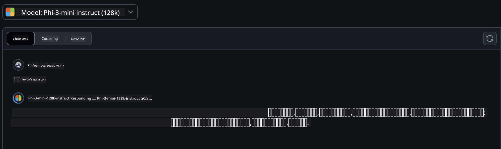
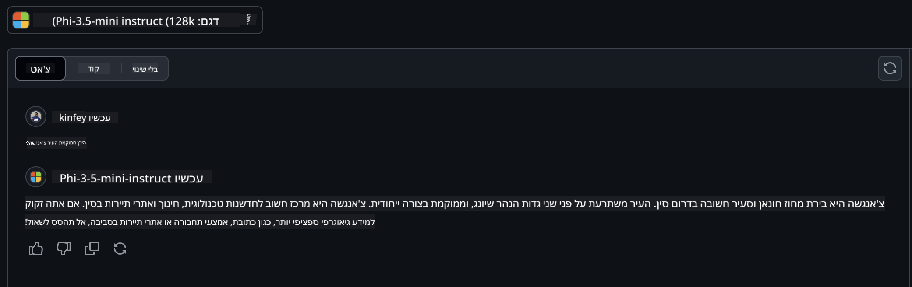

<!--
CO_OP_TRANSLATOR_METADATA:
{
  "original_hash": "124ad36cfe96f74038811b6e2bb93e9d",
  "translation_date": "2025-06-26T02:32:58+00:00",
  "source_file": "19-slm/README.md",
  "language_code": "he"
}
-->
# הקדמה למודלים לשוניים קטנים עבור AI גנרטיבי למתחילים

AI גנרטיבי הוא תחום מרתק של אינטיליגנציה מלאכותית שמתמקד ביצירת מערכות המסוגלות לייצר תוכן חדש. תוכן זה יכול להיות טקסט ותמונות ועד למוזיקה ואפילו סביבות וירטואליות שלמות. אחד מהיישומים המרגשים ביותר של AI גנרטיבי הוא בתחום המודלים הלשוניים.

## מה הם מודלים לשוניים קטנים?

מודל לשוני קטן (SLM) מייצג וריאנט מוקטן של מודל לשוני גדול (LLM), תוך ניצול רבים מהעקרונות האדריכליים והטכניקות של LLMs, תוך הצגת טביעת רגל חישובית מופחתת משמעותית. SLMs הם תת-קבוצה של מודלים לשוניים שנועדו לייצר טקסט דמוי אנושי. בניגוד לעמיתיהם הגדולים יותר, כמו GPT-4, SLMs הם קומפקטיים ויעילים יותר, מה שהופך אותם לאידיאליים עבור יישומים שבהם משאבי חישוב מוגבלים. למרות גודלם הקטן יותר, הם עדיין יכולים לבצע מגוון משימות. בדרך כלל, SLMs נבנים על ידי דחיסה או זיקוק של LLMs, במטרה לשמר חלק ניכר מהפונקציונליות והיכולות הלשוניות של המודל המקורי. הפחתה זו בגודל המודל מפחיתה את המורכבות הכוללת, מה שהופך את SLMs ליעילים יותר מבחינת שימוש בזיכרון ודרישות חישוביות. למרות אופטימיזציות אלו, SLMs עדיין יכולים לבצע מגוון רחב של משימות עיבוד שפה טבעית (NLP):

- יצירת טקסט: יצירת משפטים או פסקאות עקביות ורלוונטיות מבחינה הקשרית.
- השלמת טקסט: חיזוי והשלמת משפטים על סמך הנחיה נתונה.
- תרגום: המרת טקסט משפה אחת לאחרת.
- סיכום: עיבוי קטעי טקסט ארוכים לסיכומים קצרים יותר וניתנים לעיכול.

אף על פי שישנם ויתורים בביצועים או בעומק ההבנה בהשוואה לעמיתיהם הגדולים יותר.

## כיצד פועלים מודלים לשוניים קטנים?

SLMs מאומנים על כמויות עצומות של נתוני טקסט. במהלך האימון, הם לומדים את הדפוסים והמבנים של השפה, ומאפשרים להם ליצור טקסט שהוא גם נכון מבחינה דקדוקית וגם מתאים להקשר. תהליך האימון כולל:

- איסוף נתונים: איסוף מערכי נתונים גדולים של טקסט ממקורות שונים.
- עיבוד מקדים: ניקוי וארגון הנתונים כדי להפוך אותם למתאימים לאימון.
- אימון: שימוש באלגוריתמים של למידת מכונה כדי ללמד את המודל כיצד להבין וליצור טקסט.
- כוונון עדין: התאמת המודל לשיפור ביצועיו במשימות ספציפיות.

פיתוח SLMs מתיישר עם הצורך הגובר במודלים שניתן לפרוס בסביבות עם מגבלות משאבים, כגון מכשירים ניידים או פלטפורמות מחשוב קצה, שבהן LLMs בקנה מידה מלא עשויים להיות לא מעשיים בשל דרישות המשאבים הכבדות שלהם. על ידי התמקדות ביעילות, SLMs מאזנים בין ביצועים לנגישות, ומאפשרים יישום רחב יותר בתחומים שונים.

## מטרות למידה

בשיעור זה, אנו מקווים להציג את הידע של SLM ולשלב אותו עם Microsoft Phi-3 כדי ללמוד תרחישים שונים בתוכן טקסט, חזון ו-MoE. בסוף השיעור הזה, אתה אמור להיות מסוגל לענות על השאלות הבאות:

- מה זה SLM
- מה ההבדל בין SLM ל-LLM
- מהי משפחת Microsoft Phi-3/3.5
- כיצד להסיק את משפחת Microsoft Phi-3/3.5

מוכן? בוא נתחיל.

## ההבדלים בין מודלים לשוניים גדולים (LLMs) למודלים לשוניים קטנים (SLMs)

גם LLMs וגם SLMs בנויים על עקרונות יסוד של למידת מכונה הסתברותית, בעקבות גישות דומות בעיצוב הארכיטקטוני שלהם, מתודולוגיות אימון, תהליכי יצירת נתונים וטכניקות הערכת מודלים. עם זאת, כמה גורמים מרכזיים מבדילים בין שני סוגי המודלים הללו.

## יישומים של מודלים לשוניים קטנים

ל-SLMs יש מגוון רחב של יישומים, כולל:

- צ'אטבוטים: מתן תמיכה ללקוחות ומעורבות עם משתמשים באופן שיחתי.
- יצירת תוכן: סיוע לכותבים על ידי יצירת רעיונות או אפילו כתיבת מאמרים שלמים.
- חינוך: עזרה לתלמידים במשימות כתיבה או בלמידת שפות חדשות.
- נגישות: יצירת כלים לאנשים עם מוגבלויות, כגון מערכות טקסט לדיבור.

**גודל**

הבדל עיקרי בין LLMs ל-SLMs טמון בקנה המידה של המודלים. LLMs, כגון ChatGPT (GPT-4), יכולים להכיל כ-1.76 טריליון פרמטרים, בעוד ש-SLMs בקוד פתוח כמו Mistral 7B מתוכננים עם הרבה פחות פרמטרים - כ-7 מיליארד. פער זה נובע בעיקר מהבדלים בארכיטקטורת המודל ותהליכי האימון. לדוגמה, ChatGPT מעסיק מנגנון תשומת לב עצמית במסגרת מקודד-מפענח, בעוד Mistral 7B משתמש בתשומת לב חלון הזזה, מה שמאפשר אימון יעיל יותר בתוך מודל מפענח בלבד. שונות ארכיטקטונית זו יש לה השלכות עמוקות על המורכבות והביצועים של המודלים הללו.

**הבנה**

SLMs בדרך כלל מותאמים לביצועים בתוך תחומים ספציפיים, מה שהופך אותם למתמחים מאוד אך מוגבלים פוטנציאלית ביכולתם לספק הבנה הקשרית רחבה על פני תחומי ידע מרובים. לעומת זאת, LLMs שואפים לדמות אינטליגנציה דמוית אנוש ברמה מקיפה יותר. מאומנים על מערכי נתונים גדולים ומגוונים, LLMs מתוכננים להצליח במגוון תחומים, ומציעים צדדיות רבה יותר והתאמה. כתוצאה מכך, LLMs מתאימים יותר למגוון רחב יותר של משימות במורד הזרם, כגון עיבוד שפה טבעית ותכנות.

**חישוב**

האימון והפריסה של LLMs הם תהליכים עתירי משאבים, ולעיתים קרובות דורשים תשתית חישובית משמעותית, כולל אשכולות GPU בקנה מידה גדול. לדוגמה, אימון מודל כמו ChatGPT מאפס עשוי לדרוש אלפי GPUs על פני תקופות ממושכות. לעומת זאת, SLMs, עם ספירת הפרמטרים הקטנה שלהם, נגישים יותר מבחינת משאבי חישוב. מודלים כמו Mistral 7B יכולים להיות מאומנים ומופעלים על מכונות מקומיות המצוידות ביכולות GPU מתונות, אם כי האימון עדיין דורש מספר שעות על פני מספר GPUs.

**הטיה**

הטיה היא בעיה ידועה ב-LLMs, בעיקר בשל אופיים של נתוני האימון. מודלים אלה מסתמכים לעתים קרובות על נתונים גולמיים, זמינים באופן פתוח מהאינטרנט, שעשויים לייצג או להציג באופן שגוי קבוצות מסוימות, להציג תיוג שגוי או לשקף הטיות לשוניות המושפעות מדיאלקט, וריאציות גיאוגרפיות וכללי דקדוק. בנוסף, המורכבות של ארכיטקטורות LLM יכולה להחמיר באופן בלתי מכוון הטיה, שעשויה להישאר ללא הבחנה ללא כוונון קפדני. מצד שני, SLMs, בהיותם מאומנים על מערכי נתונים מוגבלים וספציפיים לתחום, חשופים פחות באופן אינהרנטי להטיות כאלה, אם כי הם אינם חסינים בפניהם.

**הסקה**

הגודל המופחת של SLMs מעניק להם יתרון משמעותי מבחינת מהירות ההסקה, מה שמאפשר להם ליצור פלטים ביעילות על חומרה מקומית ללא צורך בעיבוד מקביל נרחב. לעומת זאת, LLMs, בשל גודלם ומורכבותם, דורשים לעתים קרובות משאבי חישוב מקבילים משמעותיים כדי להשיג זמני הסקה מקובלים. נוכחותם של משתמשים מרובים בו זמנית מאטה עוד יותר את זמני התגובה של LLMs, במיוחד כאשר הם נפרסים בקנה מידה גדול.

לסיכום, בעוד של-LLMs ו-SLMs יש בסיס משותף בלמידת מכונה, הם נבדלים משמעותית מבחינת גודל המודל, דרישות משאבים, הבנה הקשרית, חשיפה להטיה ומהירות הסקה. הבדלים אלה משקפים את התאמתם לשימושים שונים, כאשר LLMs הם צדדיים יותר אך עתירי משאבים, ו-SLMs מציעים יעילות ספציפית לתחום עם דרישות חישוב מופחתות.

***הערה: בפרק זה נציג את SLM באמצעות Microsoft Phi-3 / 3.5 כדוגמה.***

## הצגת משפחת Phi-3 / Phi-3.5

משפחת Phi-3 / 3.5 מכוונת בעיקר לתרחישי יישום של טקסט, חזון וסוכן (MoE):

### Phi-3 / 3.5 Instruct

בעיקר ליצירת טקסט, השלמת צ'אט והפקת מידע תוכן וכו'.

**Phi-3-mini**

מודל השפה 3.8B זמין ב-Microsoft Azure AI Studio, Hugging Face ו-Ollama. מודלים של Phi-3 עולים משמעותית על מודלים לשוניים בגודל שווה וגדול יותר במדדים מרכזיים (ראה מספרי מדדים למטה, מספרים גבוהים יותר טובים יותר). Phi-3-mini עולה על מודלים בגודל כפול, בעוד ש-Phi-3-small ו-Phi-3-medium עולים על מודלים גדולים יותר, כולל GPT-3.5.

**Phi-3-small & medium**

עם רק 7B פרמטרים, Phi-3-small מנצח את GPT-3.5T במגוון מדדי שפה, הסקה, קידוד ומתמטיקה. Phi-3-medium עם 14B פרמטרים ממשיך במגמה זו ועולה על Gemini 1.0 Pro.

**Phi-3.5-mini**

אנחנו יכולים לחשוב על זה כשדרוג של Phi-3-mini. בעוד שהפרמטרים נשארים ללא שינוי, זה משפר את היכולת לתמוך בשפות מרובות (תומך ביותר מ-20 שפות: ערבית, סינית, צ'כית, דנית, הולנדית, אנגלית, פינית, צרפתית, גרמנית, עברית, הונגרית, איטלקית, יפנית, קוריאנית, נורווגית, פולנית, פורטוגזית, רוסית, ספרדית, שוודית, תאית, טורקית, אוקראינית) ומוסיף תמיכה חזקה יותר להקשר ארוך. Phi-3.5-mini עם 3.8B פרמטרים עולה על מודלים לשוניים באותו גודל ומתיישר עם מודלים בגודל כפול.

### Phi-3 / 3.5 Vision

אנחנו יכולים לחשוב על מודל ההוראה של Phi-3/3.5 כיכולת של Phi להבין, וחזון הוא מה שנותן ל-Phi עיניים להבין את העולם.

**Phi-3-Vision**

Phi-3-vision, עם רק 4.2B פרמטרים, ממשיך במגמה זו ועולה על מודלים גדולים יותר כמו Claude-3 Haiku ו-Gemini 1.0 Pro V במשימות הסקת חזותית כלליות, OCR ומשימות הבנת טבלה ודיאגרמה.

**Phi-3.5-Vision**

Phi-3.5-Vision הוא גם שדרוג של Phi-3-Vision, הוספת תמיכה לתמונות מרובות. אתה יכול לחשוב על זה כשיפור בראייה, לא רק יכול לראות תמונות, אלא גם סרטונים. Phi-3.5-vision עולה על מודלים גדולים יותר כמו Claude-3.5 Sonnet ו-Gemini 1.5 Flash על פני OCR, הבנת טבלה ותרשים ומשימות על הסקת ידע חזותי כללי ומתיישר במשימות על הסקת ידע חזותי כללי. תומך בקלט רב-מסגרתי, כלומר, מבצע הסקה על תמונות קלט מרובות.

### Phi-3.5-MoE

***Mixture of Experts(MoE)*** מאפשר למודלים להיות מאומנים מראש עם הרבה פחות חישוב, מה שאומר שאתה יכול להגדיל באופן דרמטי את גודל המודל או מערך הנתונים עם אותו תקציב חישוב כמו מודל צפוף. במיוחד, מודל MoE צריך להשיג את אותה איכות כמו עמיתו הצפוף הרבה יותר מהר במהלך האימון מראש. Phi-3.5-MoE כולל 16x3.8B מודולי מומחים. Phi-3.5-MoE עם רק 6.6B פרמטרים פעילים משיג רמה דומה של הסקה, הבנת שפה ומתמטיקה כמו מודלים גדולים בהרבה.

אנחנו יכולים להשתמש במודל משפחת Phi-3/3.5 על סמך תרחישים שונים. בניגוד ל-LLM, אתה יכול לפרוס את Phi-3/3.5-mini או Phi-3/3.5-Vision על מכשירי קצה.

## כיצד להשתמש במודלי משפחת Phi-3/3.5

אנו מקווים להשתמש ב-Phi-3/3.5 בתרחישים שונים. לאחר מכן, נשתמש ב-Phi-3/3.5 בהתבסס על תרחישים שונים.
מודלים הם הדרך הישירה ביותר. ניתן לגשת במהירות למודל Phi-3/3.5-Instruct דרך GitHub Models. בשילוב עם Azure AI Inference SDK / OpenAI SDK, ניתן לגשת ל-API דרך קוד כדי להשלים את הקריאה ל-Phi-3/3.5-Instruct. ניתן גם לבדוק אפקטים שונים דרך Playground. - דמו: השוואת האפקטים של Phi-3-mini ו-Phi-3.5-mini בתרחישים סיניים   **Azure AI Studio** או אם נרצה להשתמש במודלים של ראייה ו-MoE, ניתן להשתמש ב-Azure AI Studio כדי להשלים את הקריאה. אם אתם מעוניינים, תוכלו לקרוא את Phi-3 Cookbook כדי ללמוד כיצד לקרוא ל-Phi-3/3.5 Instruct, Vision, MoE דרך Azure AI Studio [לחצו על הקישור הזה](https://github.com/microsoft/Phi-3CookBook/blob/main/md/02.QuickStart/AzureAIStudio_QuickStart.md?WT.mc_id=academic-105485-koreyst) **NVIDIA NIM** בנוסף לפתרונות קטלוג המודלים מבוססי ענן שמסופקים על ידי Azure ו-GitHub, ניתן גם להשתמש ב-[Nivida NIM](https://developer.nvidia.com/nim?WT.mc_id=academic-105485-koreyst) כדי להשלים קריאות קשורות. ניתן לבקר ב-NIVIDA NIM כדי להשלים את קריאות ה-API של משפחת Phi-3/3.5. NVIDIA NIM (NVIDIA Inference Microservices) היא מערכת של מיקרו-שירותי הסקה מואצים שנועדה לסייע למפתחים לפרוס מודלי AI ביעילות בסביבות שונות, כולל עננים, מרכזי נתונים ותחנות עבודה. הנה כמה תכונות מרכזיות של NVIDIA NIM: - **קלות פריסה:** NIM מאפשרת פריסת מודלי AI עם פקודה אחת, מה שהופך את השילוב לקל לתוך זרמי עבודה קיימים. - **ביצועים מיטביים:** היא מנצלת מנועי הסקה מראש של NVIDIA, כמו TensorRT ו-TensorRT-LLM, כדי להבטיח זמן תגובה נמוך ויכולת עיבוד גבוהה. - **יכולת סקלאביליות:** NIM תומכת באוטוסקלאינג על Kubernetes, ומאפשרת לה להתמודד עם עומסי עבודה משתנים ביעילות. - **ביטחון ושליטה:** ארגונים יכולים לשמור על שליטה על הנתונים והיישומים שלהם על ידי אירוח עצמי של מיקרו-שירותי NIM על תשתית מנוהלת משלהם. - **APIs סטנדרטיים:** NIM מספקת APIs סטנדרטיים בתעשייה, מה שמקל על בניית ושילוב יישומי AI כמו צ'אטבוטים, עוזרי AI ועוד. NIM היא חלק מ-NVIDIA AI Enterprise, שמטרתה לפשט את הפריסה וההפעלה של מודלי AI, להבטיח שהם פועלים ביעילות על GPUs של NVIDIA. - דמו: שימוש ב-Nividia NIM לקריאה ל-Phi-3.5-Vision-API [[לחצו על הקישור הזה](../../../19-slm/python/Phi-3-Vision-Nividia-NIM.ipynb)] ### הסקה Phi-3/3.5 בסביבה מקומית הסקה ביחס ל-Phi-3, או כל מודל שפה כמו GPT-3, מתייחסת לתהליך של יצירת תגובות או תחזיות על סמך הקלט שהוא מקבל. כאשר מספקים הנחיה או שאלה ל-Phi-3, הוא משתמש ברשת הנוירונים המאומנת שלו כדי להסיק את התגובה הסבירה והרלוונטית ביותר על ידי ניתוח דפוסים ויחסים בנתונים עליהם אומן. **Hugging Face Transformer** Hugging Face Transformers היא ספרייה חזקה המיועדת לעיבוד שפה טבעית (NLP) ומשימות למידה מכונה אחרות. הנה כמה נקודות מפתח לגביה: 1. **מודלים מאומנים מראש**: היא מספקת אלפי מודלים מאומנים מראש שניתן להשתמש בהם למשימות שונות כגון סיווג טקסט, זיהוי ישויות שמיות, מענה על שאלות, סיכום, תרגום ויצירת טקסט. 2. **תאימות מסגרת**: הספרייה תומכת במסגרות למידה עמוקה שונות, כולל PyTorch, TensorFlow ו-JAX. זה מאפשר לאמן מודל במסגרת אחת ולהשתמש בו באחרת. 3. **יכולות מולטימודאליות**: בנוסף ל-NLP, Hugging Face Transformers תומכת גם במשימות בתחום הראייה הממוחשבת (למשל, סיווג תמונות, זיהוי אובייקטים) ועיבוד אודיו (למשל, זיהוי דיבור, סיווג אודיו). 4. **קלות שימוש**: הספרייה מציעה APIs וכלים להורדה והתאמה קלה של מודלים, מה שהופך אותה לנגישה הן למתחילים והן למומחים. 5. **קהילה ומשאבים**: ל-Hugging Face יש קהילה תוססת ותיעוד נרחב, מדריכים והדרכות שיעזרו למשתמשים להתחיל ולהפיק את המירב מהספרייה. [תיעוד רשמי](https://huggingface.co/docs/transformers/index?WT.mc_id=academic-105485-koreyst) או [מאגר GitHub שלהם](https://github.com/huggingface/transformers?WT.mc_id=academic-105485-koreyst). זו השיטה הנפוצה ביותר, אך היא גם דורשת האצת GPU. אחרי הכל, סצנות כמו Vision ו-MoE דורשות הרבה חישובים, מה שיהיה מאוד מוגבל ב-CPU אם הם לא יכוילו. - דמו: שימוש ב-Transformer לקריאה ל-Phi-3.5-Instuct [לחצו על הקישור הזה](../../../19-slm/python/phi35-instruct-demo.ipynb) - דמו: שימוש ב-Transformer לקריאה ל-Phi-3.5-Vision[לחצו על הקישור הזה](../../../19-slm/python/phi35-vision-demo.ipynb) - דמו: שימוש ב-Transformer לקריאה ל-Phi-3.5-MoE[לחצו על הקישור הזה](../../../19-slm/python/phi35_moe_demo.ipynb) **Ollama** [Ollama](https://ollama.com/?WT.mc_id=academic-105485-koreyst) היא פלטפורמה שנועדה להקל על הרצת מודלים שפה גדולים (LLMs) באופן מקומי על המחשב שלכם. היא תומכת במודלים שונים כמו Llama 3.1, Phi 3, Mistral, ו-Gemma 2, בין היתר. הפלטפורמה מפשטת את התהליך על ידי איחוד משקלי מודל, תצורה ונתונים לחבילה אחת, מה שהופך אותה לנגישה יותר למשתמשים להתאמה אישית וליצירת מודלים משלהם. Ollama זמינה עבור macOS, Linux ו-Windows. זו כלי נהדר אם אתם מחפשים להתנסות או לפרוס LLMs ללא הסתמכות על שירותי ענן. Ollama היא הדרך הישירה ביותר, פשוט צריך לבצע את ההצהרה הבאה. ```bash

ollama run phi3.5

``` **ONNX Runtime עבור GenAI** [ONNX Runtime](https://github.com/microsoft/onnxruntime-genai?WT.mc_id=academic-105485-koreyst) היא מאיץ למידת מכונה חוצה פלטפורמות עבור הסקה ואימון. ONNX Runtime עבור Generative AI (GENAI) היא כלי חזק שעוזר להריץ מודלים AI יצירתיים ביעילות על פני פלטפורמות שונות. ## מהו ONNX Runtime? ONNX Runtime הוא פרויקט קוד פתוח שמאפשר הסקה בעלת ביצועים גבוהים של מודלי למידת מכונה. הוא תומך במודלים בפורמט Open Neural Network Exchange (ONNX), שהוא סטנדרט לייצוג מודלי למידת מכונה. הסקת ONNX Runtime יכולה לאפשר חוויות לקוח מהירות יותר ולהוריד עלויות, תוך תמיכה במודלים ממסגרות למידה עמוקה כמו PyTorch ו-TensorFlow/Keras וכן ספריות למידת מכונה קלאסיות כמו scikit-learn, LightGBM, XGBoost וכו'. ONNX Runtime תואם לחומרה, דרייברים ומערכות הפעלה שונות, ומספק ביצועים מיטביים על ידי ניצול מאיצי חומרה במקום שבו ניתן לצד אופטימיזציות וטרנספורמציות גרפיות ## מהו AI יצירתי? AI יצירתי מתייחס למערכות AI שיכולות ליצור תוכן חדש, כמו טקסט, תמונות או מוזיקה, על בסיס הנתונים שעליהם אומנו. דוגמאות כוללות מודלי שפה כמו GPT-3 ומודלי יצירת תמונות כמו Stable Diffusion. ספריית ONNX Runtime עבור GenAI מספקת את הלולאה היצירתית של AI עבור מודלי ONNX, כולל הסקה עם ONNX Runtime, עיבוד לוגיטים, חיפוש ודגימה, וניהול מטמון KV. ## ONNX Runtime עבור GENAI ONNX Runtime עבור GENAI מרחיב את היכולות של ONNX Runtime כדי לתמוך במודלי AI יצירתיים. הנה כמה תכונות מרכזיות: - **תמיכה רחבה בפלטפורמות:** הוא פועל על פלטפורמות שונות, כולל Windows, Linux, macOS, Android, ו-iOS. - **תמיכה במודלים:** הוא תומך במודלים AI יצירתיים פופולריים רבים, כגון LLaMA, GPT-Neo, BLOOM, ועוד. - **מיטוב ביצועים:** הוא כולל אופטימיזציות למאיצי חומרה שונים כמו GPUs של NVIDIA, GPUs של AMD, ועוד2. - **קלות שימוש:** הוא מספק APIs לשילוב קל ביישומים, מה שמאפשר ליצור טקסט, תמונות ותוכן אחר עם מינימום קוד - משתמשים יכולים לקרוא לשיטת generate() ברמה גבוהה, או להריץ כל איטרציה של המודל בלולאה, לייצר טוקן אחד בכל פעם, ובאפשרותם לעדכן פרמטרים של יצירה בתוך הלולאה. - ל-ONNX Runtime יש גם תמיכה בחיפוש חמדני/קרן ובדגימת TopP, TopK ליצירת רצפי טוקנים ועיבוד לוגיטים מובנה כמו עונשי חזרה. ניתן גם להוסיף דירוג מותאם אישית בקלות. ## התחלת עבודה כדי להתחיל עם ONNX Runtime עבור GENAI, ניתן לעקוב אחר השלבים הבאים: ### התקנת ONNX Runtime: ```Python
pip install onnxruntime
``` ### התקנת הרחבות AI יצירתיות: ```Python
pip install onnxruntime-genai
``` ### הרצת מודל: הנה דוגמה פשוטה בפייתון: ```Python
import onnxruntime_genai as og

model = og.Model('path_to_your_model.onnx')

tokenizer = og.Tokenizer(model)

input_text = "Hello, how are you?"

input_tokens = tokenizer.encode(input_text)

output_tokens = model.generate(input_tokens)

output_text = tokenizer.decode(output_tokens)

print(output_text) 
``` ### דמו: שימוש ב-ONNX Runtime GenAI לקריאה ל-Phi-3.5-Vision ```python

import onnxruntime_genai as og

model_path = './Your Phi-3.5-vision-instruct ONNX Path'

img_path = './Your Image Path'

model = og.Model(model_path)

processor = model.create_multimodal_processor()

tokenizer_stream = processor.create_stream()

text = "Your Prompt"

prompt = "<|user|>\n"

prompt += "<|image_1|>\n"

prompt += f"{text}<|end|>\n"

prompt += "<|assistant|>\n"

image = og.Images.open(img_path)

inputs = processor(prompt, images=image)

params = og.GeneratorParams(model)

params.set_inputs(inputs)

params.set_search_options(max_length=3072)

generator = og.Generator(model, params)

while not generator.is_done():

    generator.compute_logits()
    
    generator.generate_next_token()

    new_token = generator.get_next_tokens()[0]
    
    code += tokenizer_stream.decode(new_token)
    
    print(tokenizer_stream.decode(new_token), end='', flush=True)

``` **אחרים** בנוסף לשיטות הסקה של ONNX Runtime ו-Ollama, ניתן גם להשלים את הסקת מודלים כמותיים על בסיס שיטות ההסקה שמסופקות על ידי יצרנים שונים. כגון מסגרת Apple MLX עם Apple Metal, Qualcomm QNN עם NPU, Intel OpenVINO עם CPU/GPU וכו'. ניתן גם לקבל יותר תוכן מ-[Phi-3 Cookbook](https://github.com/microsoft/phi-3cookbook?WT.mc_id=academic-105485-koreyst) ## עוד למדנו את הבסיסים של משפחת Phi-3/3.5, אך כדי ללמוד עוד על SLM אנחנו צריכים יותר ידע. ניתן למצוא את התשובות ב-Phi-3 Cookbook. אם רוצים ללמוד יותר, אנא בקרו ב-[Phi-3 Cookbook](https://github.com/microsoft/phi-3cookbook?WT.mc_id=academic-105485-koreyst).

**כתב ויתור**:  
מסמך זה תורגם באמצעות שירות תרגום AI [Co-op Translator](https://github.com/Azure/co-op-translator). בעוד אנו שואפים לדיוק, אנא היו מודעים לכך שתרגומים אוטומטיים עשויים להכיל שגיאות או אי-דיוקים. המסמך המקורי בשפתו המקורית צריך להיחשב כמקור הסמכותי. עבור מידע קריטי, מומלץ להשתמש בתרגום מקצועי על ידי אדם. איננו אחראים על כל אי-הבנות או פירושים שגויים הנובעים משימוש בתרגום זה.