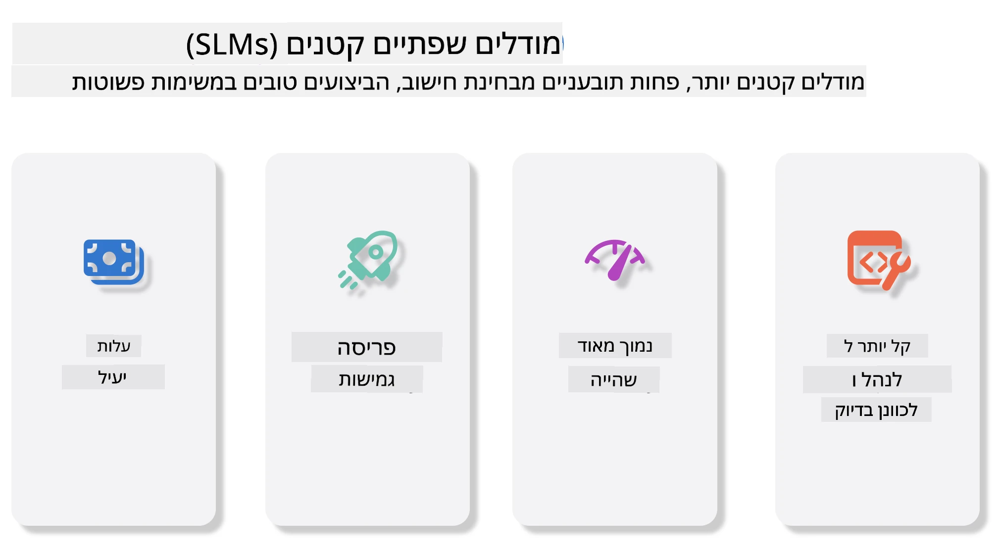
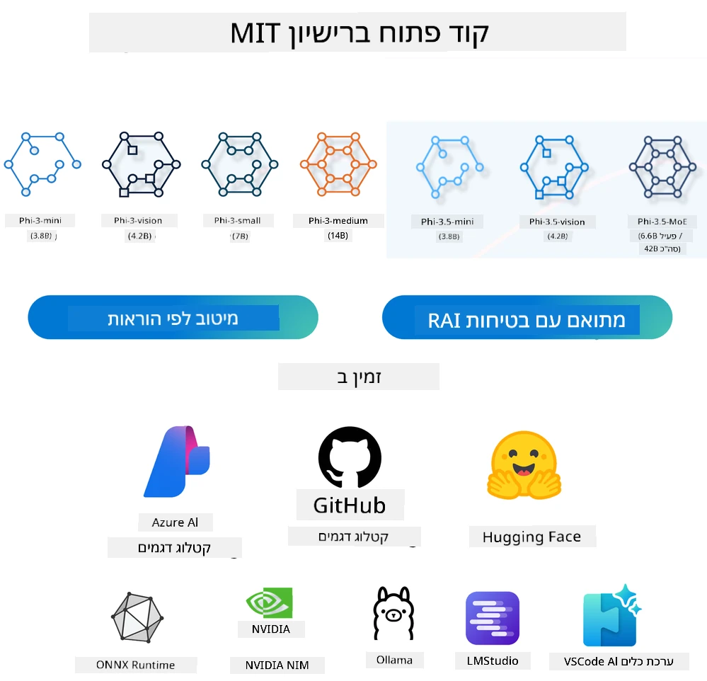
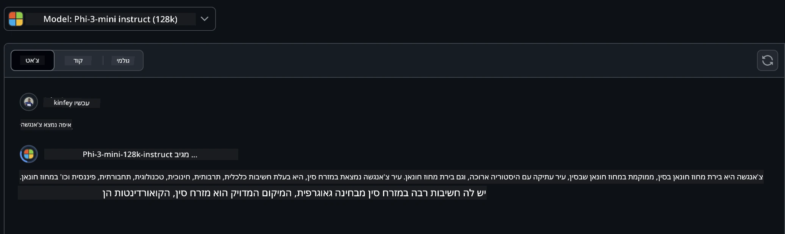
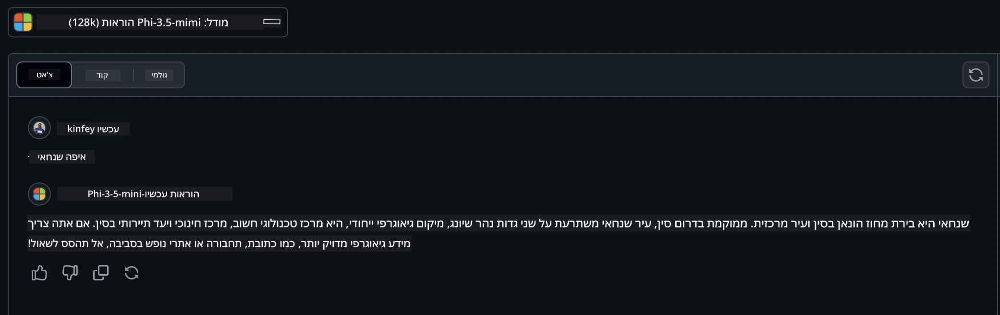

# מבוא למודלים שפתיים קטנים לבינה מלאכותית גנרטיבית למתחילים  
בינה מלאכותית גנרטיבית היא תחום מרתק בבינה מלאכותית שמתמקד ביצירת מערכות המסוגלות לייצר תוכן חדש. תוכן זה יכול לנוע מטקסט ותמונות ועד למוזיקה ואפילו סביבות וירטואליות שלמות. אחת מהיישומים המרגשים ביותר של בינה מלאכותית גנרטיבית היא בתחום המודלים השפתיים.

## מה הם מודלים שפתיים קטנים?  
מודל שפה קטן (SLM) מייצג גרסה מוקטן של מודל שפה גדול (LLM), המנצלת עקרונות ארכיטקטוניים וטכניקות רבות של LLMים, תוך הפגנת טביעת רגל חישובית מצומצמת משמעותית.

SLM הם תת-קבוצה של מודלים שפתיים המיועדים להפיק טקסט הדומה לטקסט אנושי. בניגוד לעמיתיהם הגדולים יותר, כגון GPT-4, SLM הם קומפקטיים ויעילים יותר, מה שהופך אותם לאידיאליים ליישומים שבהם המשאבים החישוביים מוגבלים. על אף גודלם הקטן יותר, הם יכולים לבצע מגוון משימות. בדרך כלל, SLMים נבנים באמצעות דחיסה או זיקוק של LLMים, במטרה לשמר חלק משמעותי מפונקציונליות ויכולות שפתיות של המודל המקורי. הקטנה זו בגודל המודל מפחיתה את המורכבות הכוללת, מה שהופך את SLM ליעילים יותר גם מבחינת שימוש בזיכרון וגם מבחינת דרישות חישוב. למרות האופטימיזציות הללו, SLMים עדיין יכולים לבצע מגוון רחב של משימות עיבוד שפה טבעית (NLP):

- יצירת טקסט: יצירת משפטים או פסקאות קוהרנטיים ורלוונטיים להקשר.  
- השלמת טקסט: חיזוי והשלמת משפטים בהתבסס על הקלט הנתון.  
- תרגום: המרת טקסט משפה אחת לאחרת.  
- סיכום: עיבוי חתיכות ארוכות של טקסט לסיכומים קצרים וברי הבנה.

אם כי בטווח מסוים של ויתורים בביצועים או בעומק ההבנה בהשוואה לעמיתיהם הגדולים יותר.

## כיצד מודלים שפתיים קטנים פועלים?  
SLMים מאומנים על כמויות עצומות של נתוני טקסט. במהלך האימון הם לומדים את הדפוסים והמבנים של השפה, מה שמאפשר להם ליצור טקסט שהוא גם דקדוקית נכון וגם מתאים להקשר. תהליך האימון כולל:

- איסוף נתונים: איסוף מערכי נתונים גדולים של טקסט ממקורות שונים.  
- עיבוד מוקדם: ניקוי וארגון הנתונים כדי להפוך אותם מתאימים לאימון.  
- אימון: שימוש באלגוריתמים של למידת מכונה כדי ללמד את המודל כיצד להבין ולייצר טקסט.  
- כוונון עדין: התאמת המודל לשיפור ביצועים במשימות ספציפיות.

פיתוח ה-SLMים מתיישב עם הצורך ההולך וגדל במודלים שניתן לפרוס בסביבות עם משאבים מוגבלים, כגון מכשירים ניידים או פלטפורמות עיבוד בקצה, שבהן LLMים בקנה מידה מלא אינם מעשיים בשל דרישות המשאבים הכבדות שלהם. על ידי התמקדות ביעילות, SLMים מאזנים בין ביצועים לנגישות, ומאפשרים יישום רחב יותר בתחומים שונים.



## מטרות הלמידה  

בשיעור זה, ננסה להציג את הידע על SLM ולשלבו עם Microsoft Phi-3 כדי ללמוד תרחישים שונים בתוכן טקסט, ראייה ו-MoE.

בסיום שיעור זה, תצטרכו להיות מסוגלים לענות על השאלות הבאות:

- מהו SLM?  
- מה ההבדל בין SLM ל-LLM?  
- מהי משפחת Microsoft Phi-3/3.5?  
- איך להריץ אינפרנס עם משפחת Microsoft Phi-3/3.5?

מוכנים? בואו נתחיל.

## ההבדלים בין מודלים שפתיים גדולים (LLMs) ומודלים שפתיים קטנים (SLMs)  

גם LLMים וגם SLMים נבנים על עקרונות יסודיים של למידת מכונה הסתברותית, ופועלים בגישות דומות בעיצוב הארכיטקטוני, שיטות אימון, תהליכי יצירת הנתונים ושיטות הערכת המודל. אך ישנם מספר גורמים מרכזיים המבדילים בין שני סוגי המודלים הללו.

## יישומים של מודלים שפתיים קטנים  

ל-SLMים יש מגוון רחב של יישומים, ביניהם:

- צ'טבוטים: מתן תמיכה ללקוחות ומעורבות עם משתמשים בצורה שיחתית.  
- יצירת תוכן: סיוע לכותבים ביצירת רעיונות או אפילו ניסוח מאמרים שלמים.  
- חינוך: עזרה ללומדים במשימות כתיבה או בלימוד שפות חדשות.  
- נגישות: יצירת כלים לאנשים עם מוגבלויות, כגון מערכות טקסט לדיבור.

**גודל**  
הבדל מרכזי בין LLMים ל-SLMים טמון בקנה המידה של המודלים. LLMים, כמו ChatGPT (GPT-4), עשויים לכלול כ-1.76 טריליון פרמטרים, בעוד שSLMs בקוד פתוח כמו Mistral 7B מתוכננים עם הרבה פחות פרמטרים – כ-7 מיליארד בלבד. הפרש זה נובע בעיקר מהבדלים בארכיטקטורת המודל ובתהליכי האימון. לדוגמה, ChatGPT משתמש במנגנון תשומת לב-עצמית במסגרת של מקודד-מפענח, בעוד Mistral 7B משתמש בתשומת לב חלונית מחליקה, המאפשרת אימון יעיל יותר במודל מדפענח בלבד. שונות ארכיטקטונית זו משפיעה משמעותית על המורכבות והביצועים של המודלים.

**הבנה**  
SLMs מותאמים בדרך כלל לביצועים בתחומים ספציפיים, מה שהופך אותם למומחים מאוד אך עם הגבלה ביכולתם לספק הבנה הקשרית רחבה בתחומים שונים של ידע. לעומתם, LLMים מיועדים לדמות אינטליגנציה בדומה לבני אדם ברמה רחבה יותר. מאומנים על מערכי נתונים מגוונים וגדולים מאוד, LLMים נועדו לבצע היטב במגוון תחומים ולהציע גמישות והתאמה גבוהה. לכן, LLMים מתאימים יותר למגוון רחב של משימות מטה, כגון עיבוד שפה טבעית ותכנות.

**חישוב**  
האימון והפריסה של LLMים הם תהליכים עתירי משאבים, לעיתים דורשים תשתית חישובית משמעותית, כולל אשכולות GPU גדולים. לדוגמה, אימון מודל כמו ChatGPT מאפס עלול לדרוש אלפי GPUs לפרקי זמן ממושכים. לעומת זאת, SLMים עם מספר הפרמטרים הקטן יותר, נגישים יותר מבחינת משאבים חישוביים. מודלים כמו Mistral 7B יכולים להיות מאומנים ומופעלים במכונות מקומיות עם יכולות GPU בינוניות, אם כי האימון עדיין דורש מספר שעות על פני מספר GPUs.

**הטיה**  
הטיה היא בעיה ידועה ב-LLMים, בעיקר בשל אופי הנתונים המשמשים לאימון. מודלים אלה לעיתים מסתמכים על נתונים גולמיים, זמינים באופן חופשי באינטרנט, שעשויים לייצג באופן נמוך או לא מדויק קבוצות מסוימות, להכניס תיוג שגוי, או לשקף הטיות לשוניות כתוצאה מניבים, הבדלים גאוגרפיים או חוקים דקדוקיים. בנוסף, המורכבות של ארכיטקטורת LLMים עלולה להגביר את ההטייה בדרכים בלתי נראות ללא כוונון זהיר. מצד שני, SLMים, המאמנים על מערכי נתונים ממוקדים ומוגבלים בתחום מסוים, פחות חשופים להשפעות ההטייה הללו, אם כי אינם חסינים לגמרי מפניה.

**אינפרנס**  
גודלם המופחת של SLMים מעניק להם יתרון משמעותי במהירות האינפרנס, ומאפשר יצירת פלט ביעילות על חומרה מקומית ללא צורך בעיבוד מקביל נרחב. לעומת זאת, LLMים, בשל גודלם ומורכבותם, לעיתים דורשים משאבי חישוב מקביליים גדולים כדי להגיע לזמני אינפרנס מקובלים. נוכחותם של משתמשים מרובים בו זמנית מאיטה אף יותר את זמני התגובה של LLMים, בפרט כאשר הם מופעלים בקנה מידה רחב.

לסיכום, למרות ששני הסוגים מבוססים על למידת מכונה, הם נבדלים משמעותית במונחים של גודל המודל, דרישות המשאבים, הבנה הקשרית, רגישות להטיות ומהירות אינפרנס. הבדלים אלו משקפים את התאמתם לשימושים שונים, כאשר LLMים הם גמישים יותר אך דורשים משאבים כבדים, ו-SLMים מציעים יעילות תחומית עם דרישות חישוב מופחתות.

***הערה: בשיעור זה נציג את ה-SLM באמצעות Microsoft Phi-3 / 3.5 כדוגמה.***

## הצגת משפחת Phi-3 / Phi-3.5  

משפחת Phi-3 / 3.5 מיועדת בעיקר לתרחישי יישום בטקסט, ראייה ו-Agent (MoE):

### Phi-3 / 3.5 Instruct  
מיועד בעיקר ליצירת טקסט, השלמת שיחות וחילוץ מידע מתוכן וכדומה.

**Phi-3-mini**  
מודל השפה 3.8B זמין ב-Microsoft Azure AI Studio, Hugging Face ו-Ollama. דגמי Phi-3 מבצעים משמעותית טוב יותר מדגמי שפה בגודל שווה וגדול יותר במבחני בקרה מרכזיים (ראו מספרי הביצועים למטה; מספרים גבוהים יותר = טוב יותר). Phi-3-mini מתעלה על מודלים כפולים בגודלם, בעוד ש-Phi-3-small ו-Phi-3-medium מתעלים על מודלים גדולים יותר, כולל GPT-3.5.

**Phi-3-small & medium**  
עם רק 7 מיליארד פרמטרים, Phi-3-small מתעלה על GPT-3.5T במגוון מבחנים בשפה, היגיון, תכנות ומתמטיקה.

Phi-3-medium עם 14 מיליארד פרמטרים ממשיך מגמה זו ומתעלה על Gemini 1.0 Pro.

**Phi-3.5-mini**  
ניתן לראות אותו כשדרוג של Phi-3-mini. למרות שהפרמטרים נותרו ללא שינוי, הוא משפר את היכולת לתמוך במספר שפות (תומך ב-20+ שפות: ערבית, סינית, צ'כית, דנית, הולנדית, אנגלית, פינית, צרפתית, גרמנית, עברית, הונגרית, איטלקית, יפנית, קוריאנית, נורבגית, פולנית, פורטוגזית, רוסית, ספרדית, שוודית, תאית, טורקית, אוקראינית) ומוסיף תמיכה חזקה יותר בהקשר ארוך.

Phi-3.5-mini עם 3.8B פרמטרים מתעלה על מודלים באותו גודל ומשתווה לביצועים של מודלים כפולי גודל.

### Phi-3 / 3.5 Vision  
ניתן לראות במודל ה-Instruct של Phi-3/3.5 כחלק היכולת של Phi להבין, ו-Vision הוא זה שנותן ל-Phi "עיניים" להבין את העולם.

**Phi-3-Vision**  
Phi-3-Vision, עם רק 4.2B פרמטרים, ממשיך מגמה זו ומתעלה על מודלים גדולים יותר כמו Claude-3 Haiku ו-Gemini 1.0 Pro V במשימות היגיון חזותי כללי, OCR, והבנת טבלאות ותרשימים.

**Phi-3.5-Vision**  
גם Phi-3.5-Vision הוא שדרוג של Phi-3-Vision, ומוסיף תמיכה בתמונות מרובות. ניתן לראות בכך שיפור בראייה – לא רק שניתן לראות תמונות, אלא גם וידאו.

Phi-3.5-Vision מתעלה על מודלים גדולים יותר כמו Claude-3.5 Sonnet ו-Gemini 1.5 Flash במשימות OCR, הבנת טבלאות וגרפים, ומשווה ביצועים במשימות ידע חזותי כללי. תומך בקלט רב-מסגרתי, כלומר מבצע היגיון על מספר תמונות קלט.

### Phi-3.5-MoE  
***תערובת המומחים (MoE)*** מאפשרת למודלים לעבור אימון מוקדם עם פחות חישוב משמעותית, מה שאומר שניתן להגדיל בצורה דרמטית את גודל המודל או מערך הנתונים באותו תקציב חישוב כמו מודל צפוף. במיוחד, מודל MoE אמור להגיע לאותה איכות כמו המקביל הצפוף שלו מהר יותר במהלך ההכשרה.

Phi-3.5-MoE מורכב מ-16 מודולים מומחים של 3.8B כל אחד. Phi-3.5-MoE עם רק 6.6B פרמטרים פעילים משיג רמת היגיון, הבנת שפה ומתמטיקה דומה לזו של מודלים גדולים בהרבה.

ניתן להשתמש במודל משפחת Phi-3/3.5 בתרחישים שונים. שלא כמו LLM, ניתן לפרוס Phi-3/3.5-mini או Phi-3/3.5-Vision על מכשירי קצה.

## כיצד להשתמש במודלים ממשפחת Phi-3/3.5  

אנו מקווים להשתמש ב-Phi-3/3.5 בתרחישים שונים. בהמשך נשתמש ב-Phi-3/3.5 בהתבסס על תרחישים שונים.



### אינפרנס דרך API ענן  

**GitHub Models**  
GitHub Models היא הדרך הישירה ביותר. ניתן לגשת במהירות למודל Phi-3/3.5-Instruct דרך GitHub Models. בשילוב עם Azure AI Inference SDK / OpenAI SDK, ניתן לגשת ל-API דרך קוד כדי להשלים את הקריאה ל-Phi-3/3.5-Instruct. ניתן גם לבדוק השפעות שונות דרך Playground.

- הדגמה: השוואת ביצועי Phi-3-mini ו-Phi-3.5-mini בתרחישים סיניים






**Azure AI Studio**  
או אם רוצים להשתמש בדגמי הראייה ו-MoE, ניתן להשתמש ב-Azure AI Studio כדי להשלים את הקריאה. אם אתם מעוניינים, תוכלו לקרוא את CookBook של Phi-3 כדי ללמוד כיצד לקרוא ל-Phi-3/3.5 Instruct, Vision, MoE דרך Azure AI Studio [לחץ כאן](https://github.com/microsoft/Phi-3CookBook/blob/main/md/02.QuickStart/AzureAIStudio_QuickStart.md?WT.mc_id=academic-105485-koreyst)

  
**NVIDIA NIM**  
בנוסף לפתרונות קטלוג המודלים בענן שמספקים Azure ו-GitHub, ניתן להשתמש גם ב-[NVIDIA NIM](https://developer.nvidia.com/nim?WT.mc_id=academic-105485-koreyst) כדי להשלים קריאות רלוונטיות. ניתן לבקר בנקודה זו כדי להשלים קריאות API של משפחת Phi-3/3.5. NVIDIA NIM (NVIDIA Inference Microservices) היא קבוצת מיקרו-שירותי אינפרנס מאומצים שנועדו לסייע למפתחים לפרוס מודלי AI ביעילות בסביבות שונות, כולל עננים, מרכזי נתונים ועבודות תחנות.

להלן כמה תכונות מפתח של NVIDIA NIM:
- **קלות פריסה:** NIM מאפשר פריסה של מודלים מבוססי בינה מלאכותית באמצעות פקודה אחת בלבד, מה שהופך את התהליך לפשוט לשילוב בתוך זרימות עבודה קיימות.  
- **ביצועים אופטימליים:** הוא מנצל את מנועי המסקנות המותאמים מראש של NVIDIA, כגון TensorRT ו-TensorRT-LLM, כדי להבטיח זמן תגובה נמוך וקצב מעבד גבוה.  
- **סקלביליות:** NIM תומך בוויסות אוטומטי (autoscaling) על Kubernetes, מה שמאפשר לו לטפל בעומסים משתנים בצורה יעילה.  
- **אבטחה ושליטה:** ארגונים יכולים לשמור על שליטה בנתונים וביישומים שלהם על ידי אירוח עצמי של מיקרו-שירותי NIM בתשתית מנוהלת משלהם.  
- **ממשקי API סטנדרטיים:** NIM מספק ממשקי API בת סטנדרט תעשייתי, מה שמקל על בנייה ושילוב של יישומי בינה מלאכותית כמו רובוטי שיחה, עוזרי בינה מלאכותית ועוד.

NIM הוא חלק מ-NVIDIA AI Enterprise, שמטרתו לפשט את הפריסה וההפעלה של מודלי בינה מלאכותית, ולהבטיח שהם פועלים ביעילות על מעבדי ה-GPU של NVIDIA.

- הדגמה: שימוש ב-NVIDIA NIM לקריאה ל-Phi-3.5-Vision-API  [[לחצו כאן](./python/Phi-3-Vision-Nividia-NIM.ipynb?WT.mc_id=academic-105485-koreyst)]


### הפעלת Phi-3/3.5 באופן מקומי
הסקת מסקנות ביחס ל-Phi-3, או לכל מודל שפה אחר כמו GPT-3, מתייחסת לתהליך יצירת תגובות או תחזיות בהתבסס על הקלט שהוא מקבל. כאשר אתם מזינים הפניה או שאלת שאלה ל-Phi-3, הוא משתמש ברשת הנוירונית המאומנת שלו כדי להסיק את התגובה הסבירה והרלוונטית ביותר באמצעות ניתוח דפוסים וקשרים בנתונים שעליהם אומן.

**Hugging Face Transformer**  
Hugging Face Transformers היא ספרייה עוצמתית המיועדת לעיבוד שפה טבעית (NLP) ומשימות אחרות בלמידת מכונה. הנה כמה נקודות מפתח לגביה:

1. **מודלים מאומנים מראש:** היא מספקת אלפי מודלים מאומנים מראש שניתן להשתמש בהם למשימות שונות כמו סיווג טקסט, זיהוי ישויות, מענה על שאלות, סיכום, תרגום ויצירת טקסט.  

2. **תאימות למסגרות עבודה שונות:** הספרייה תומכת במסגרות למידה עמוקה מרובות, ביניהן PyTorch, TensorFlow, ו-JAX. זה מאפשר לכם לאמן מודל במסגרת אחת ולהשתמש בו במסגרת אחרת.  

3. **יכולות מולטימודל:** בנוסף ל-NLP, Hugging Face Transformers תומכת גם במשימות בראייה ממוחשבת (כגון סיווג תמונות, זיהוי אובייקטים) ובעיבוד קול (כגון זיהוי דיבור, סיווג קול).  

4. **קלות שימוש:** הספרייה מציעה ממשקי API וכלים להורדה וטונינג עדין של מודלים בקלות, מה שהופך אותה לנגישה למתחילים ומומחים כאחד.  

5. **קהילה ומשאבים:** Hugging Face מחזיקה בקהילה חיה ומסמכים מקיפים, הדרכות ומדריכים כדי לסייע למשתמשים להתחיל ולממש את מירב הפוטנציאל של הספרייה.  
[מסמכים רשמיים](https://huggingface.co/docs/transformers/index?WT.mc_id=academic-105485-koreyst) או [מאגר GitHub](https://github.com/huggingface/transformers?WT.mc_id=academic-105485-koreyst).

זו השיטה הנפוצה ביותר, אך היא דורשת גם האצת GPU. אחרי הכל, תרחישים כמו Vision ו-MoE דורשים חישובים רבים, שיהיו איטיים מאוד על CPU אם הם לא מקודדים.

- הדגמה: שימוש ב-Transformer לצורך קריאה ל-Phi-3.5-Instruct [לחצו כאן](./python/phi35-instruct-demo.ipynb?WT.mc_id=academic-105485-koreyst)

- הדגמה: שימוש ב-Transformer לצורך קריאה ל-Phi-3.5-Vision [לחצו כאן](./python/phi35-vision-demo.ipynb?WT.mc_id=academic-105485-koreyst)

- הדגמה: שימוש ב-Transformer לצורך קריאה ל-Phi-3.5-MoE [לחצו כאן](./python/phi35_moe_demo.ipynb?WT.mc_id=academic-105485-koreyst)

**Ollama**  
[Ollama](https://ollama.com/?WT.mc_id=academic-105485-koreyst) היא פלטפורמה שנועדה להקל על הפעלת מודלי שפה גדולים (LLMs) באופן מקומי במחשב שלכם. היא תומכת במודלים שונים כמו Llama 3.1, Phi 3, Mistral ו-Gemma 2, בין היתר. הפלטפורמה מפשטת את התהליך על ידי שילוב משקלי המודל, קונפיגורציה ונתונים לאריזה אחת, מה שהופך אותה לנגישה יותר להתאמה אישית וליצירת מודלים משלכם. Ollama זמינה עבור macOS, Linux ו-Windows. זו דרך נהדרת אם אתם רוצים להתנסות או לפרוס LLMs ללא תלות בשירותי ענן. Ollama היא השיטה הישירה ביותר, רק צריך להריץ את הפקודה הבאה.

```bash

ollama run phi3.5

```


**ONNX Runtime עבור GenAI**

[ONNX Runtime](https://github.com/microsoft/onnxruntime-genai?WT.mc_id=academic-105485-koreyst) הוא מאיץ למידה חישובית חוצה פלטפורמות להפעלה והסקת מסקנות. ONNX Runtime עבור AI גנרטיבי (GENAI) הוא כלי עוצמתי שעוזר להריץ מודלים גנרטיביים ביעילות במגוון פלטפורמות.

## מה זה ONNX Runtime?  
ONNX Runtime הוא פרויקט קוד פתוח המאפשר ביצוע הסקת מסקנות במהירות גבוהה של מודלים בלמידת מכונה. הוא תומך במודלים בפורמט Open Neural Network Exchange (ONNX), שהוא תקן להצגת מודלים בלמידת מכונה. ONNX Runtime מאפשר חוויות לקוח מהירות יותר והפחתת עלויות, ותומך במודלים ממסגרות למידה עמוקה כמו PyTorch ו-TensorFlow/Keras וגם מספריות למידת מכונה קלאסיות כמו scikit-learn, LightGBM, XGBoost ועוד. ONNX Runtime תואם לחומרות, דרייברים ומערכות הפעלה שונות, ומספק ביצועים מיטביים באמצעות ניצול מאיצי חומרה כאשר רלוונטי, לצד אופטימיזציות וטרנספורמציות גרף.

## מהו AI גנרטיבי?  
AI גנרטיבי מתייחס למערכות בינה מלאכותית שיכולות לייצר תוכן חדש, כגון טקסט, תמונות או מוזיקה, בהתבסס על הנתונים שבהם אומנו. דוגמאות לכך הן מודלי שפה כמו GPT-3 ומודלי יצירת תמונות כמו Stable Diffusion. ספריית ONNX Runtime עבור GenAI מספקת לולאת AI גנרטיבית עבור מודלים בפורמט ONNX, הכוללת הסקת מסקנות עם ONNX Runtime, עיבוד לוגיטים, חיפוש ודגימה, וניהול מטמון KV.

## ONNX Runtime עבור GENAI  
ONNX Runtime עבור GENAI מרחיב את היכולות של ONNX Runtime לתמיכה במודלים גנרטיביים. הנה כמה תכונות מרכזיות:

- **תמיכה רחבה בפלטפורמות:** הוא עובד על פלטפורמות שונות, כולל Windows, Linux, macOS, Android ו-iOS.  
- **תמיכת מודלים:** תומך במודלים פופולריים רבים של AI גנרטיבי, כגון LLaMA, GPT-Neo, BLOOM ועוד.  
- **אופטימיזציית ביצועים:** כולל אופטימיזציות עבור מאיצי חומרה שונים כמו NVIDIA GPUs, AMD GPUs ועוד.  
- **קלות שימוש:** מספק ממשקי API לשילוב קל בתוך יישומים, ומאפשר הפקת טקסט, תמונות ותוכן נוסף עם מינימום קוד.  
- המשתמשים יכולים לקרוא לפונקציה generate() ברמה גבוהה, או להריץ כל איטרציה של המודל בלולאה, ליצור אסימון אחד בכל פעם, ואפשרי לעדכן פרמטרים של ההפקה בתוך הלולאה.  
- ONNX Runtime גם תומך בחיפוש greedy/beam ובדגימת TopP, TopK ליצירת רצפי אסימונים ובעיבוד לוגיטים מובנה כמו עונשי חזרה. ניתן גם להוסיף דירוג מותאם בקלות.

## איך להתחיל  
כדי להתחיל עם ONNX Runtime עבור GENAI, ניתן לבצע את השלבים הבאים:

### התקנת ONNX Runtime:  
```Python
pip install onnxruntime
```


### התקנת ההרחבות ל-AI גנרטיבי:  
```Python
pip install onnxruntime-genai
```


### הפעלת מודל: הנה דוגמה פשוטה בפייתון:  
```Python
import onnxruntime_genai as og

model = og.Model('path_to_your_model.onnx')

tokenizer = og.Tokenizer(model)

input_text = "Hello, how are you?"

input_tokens = tokenizer.encode(input_text)

output_tokens = model.generate(input_tokens)

output_text = tokenizer.decode(output_tokens)

print(output_text) 
```


### הדגמה: שימוש ב-ONNX Runtime GenAI לקריאה ל-Phi-3.5-Vision  
```python

import onnxruntime_genai as og

model_path = './Your Phi-3.5-vision-instruct ONNX Path'

img_path = './Your Image Path'

model = og.Model(model_path)

processor = model.create_multimodal_processor()

tokenizer_stream = processor.create_stream()

text = "Your Prompt"

prompt = "<|user|>\n"

prompt += "<|image_1|>\n"

prompt += f"{text}<|end|>\n"

prompt += "<|assistant|>\n"

image = og.Images.open(img_path)

inputs = processor(prompt, images=image)

params = og.GeneratorParams(model)

params.set_inputs(inputs)

params.set_search_options(max_length=3072)

generator = og.Generator(model, params)

while not generator.is_done():

    generator.compute_logits()
    
    generator.generate_next_token()

    new_token = generator.get_next_tokens()[0]
    
    output = tokenizer_stream.decode(new_token)
    
    print(tokenizer_stream.decode(new_token), end='', flush=True)

```


**אחרים**

בנוסף ל-ONNX Runtime ולשיטות האזכור של Ollama, ניתן גם להשלים את האזכור של מודלים כמותיים בהתבסס על שיטות האזכור של היצרנים השונים. לדוגמה: מסגרת Apple MLX עם Apple Metal, Qualcomm QNN עם NPU, Intel OpenVINO עם CPU/GPU וכו'. ניתן גם לקבל תוכן נוסף מתוך [Phi-3 Cookbook](https://github.com/microsoft/phi-3cookbook?WT.mc_id=academic-105485-koreyst).

## עוד

למדנו את הבסיס של משפחת Phi-3/3.5, אך כדי ללמוד יותר על SLM נדרשת יותר ידע. תוכלו למצוא את התשובות ב-Phi-3 Cookbook. אם ברצונכם ללמוד עוד, אנא בקרו ב-[Phi-3 Cookbook](https://github.com/microsoft/phi-3cookbook?WT.mc_id=academic-105485-koreyst).

---

<!-- CO-OP TRANSLATOR DISCLAIMER START -->
**הצהרת אחריות**:  
מסמך זה תורגם באמצעות שירות תרגום מבוסס בינה מלאכותית [Co-op Translator](https://github.com/Azure/co-op-translator). למרות שאנו שואפים לדייק, יש לקחת בחשבון כי תרגומים אוטומטיים עלולים להכיל שגיאות או אי-דיוקים. המסמך המקורי בשפת המקור שלו צריך להיחשב כמקור הסמכות. למידע קריטי מומלץ לפנות לתרגום מקצועי על ידי בני אדם. אנו לא נושאים באחריות לכל אי-הבנה או פרשנות שגויה הנובעות משימוש בתרגום זה.
<!-- CO-OP TRANSLATOR DISCLAIMER END -->