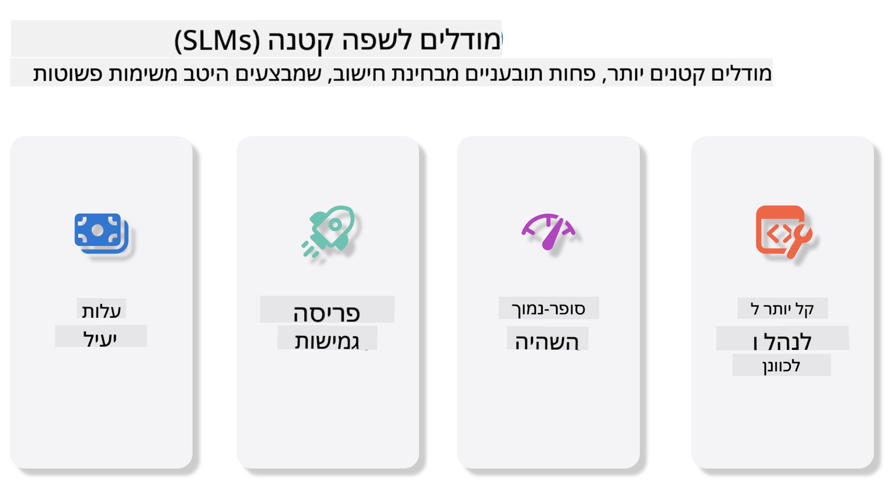
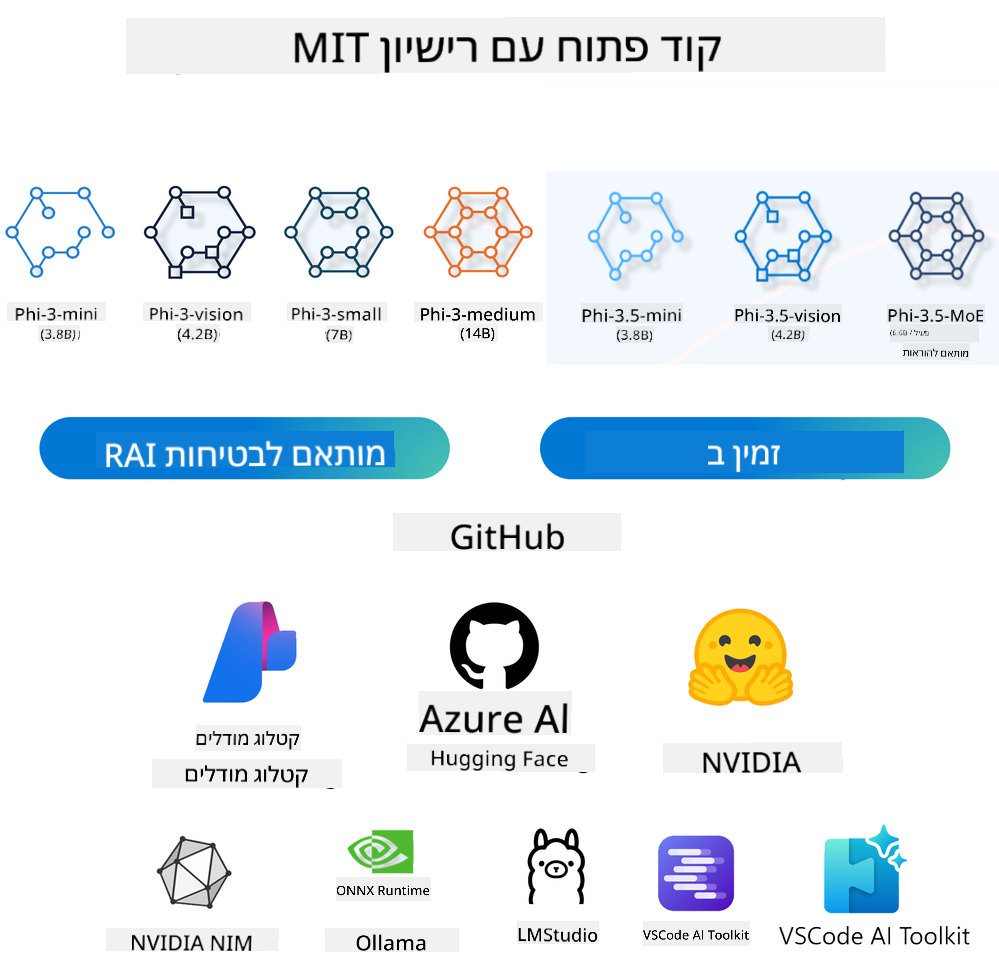
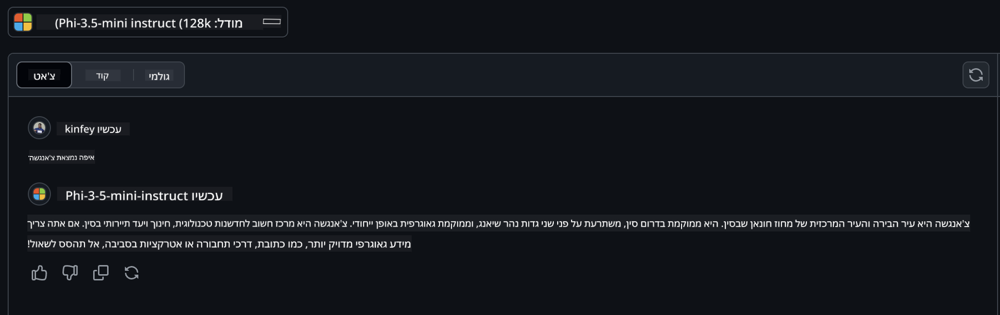

<!--
CO_OP_TRANSLATOR_METADATA:
{
  "original_hash": "124ad36cfe96f74038811b6e2bb93e9d",
  "translation_date": "2025-07-09T18:40:09+00:00",
  "source_file": "19-slm/README.md",
  "language_code": "he"
}
-->
# מבוא למודלים שפתיים קטנים ל-AI גנרטיבי למתחילים  
AI גנרטיבי הוא תחום מרתק בבינה מלאכותית המתמקד ביצירת מערכות המסוגלות לייצר תוכן חדש. התוכן הזה יכול לנוע מטקסט ותמונות ועד למוזיקה ואפילו סביבות וירטואליות שלמות. אחת היישומים המרגשים ביותר של AI גנרטיבי היא בתחום המודלים השפתיים.

## מה הם מודלים שפתיים קטנים?  

מודל שפה קטן (SLM) הוא גרסה מוקטנת של מודל שפה גדול (LLM), המשתמשת בהרבה מהעקרונות והטכניקות האדריכליות של מודלים גדולים, אך עם דרישה חישובית מופחתת משמעותית.  

SLM הם תת-קבוצה של מודלים שפתיים שנועדו לייצר טקסט הדומה לטקסט אנושי. בניגוד למודלים הגדולים יותר, כמו GPT-4, SLM הם קומפקטיים ויעילים יותר, מה שהופך אותם לאידיאליים לשימוש במצבים שבהם המשאבים החישוביים מוגבלים. למרות גודלם הקטן, הם מסוגלים לבצע מגוון משימות. בדרך כלל, SLM נוצרים על ידי דחיסה או זיקוק של מודלים גדולים, במטרה לשמר חלק משמעותי מהפונקציונליות והיכולות הלשוניות של המודל המקורי. הקטנת גודל המודל מפחיתה את המורכבות הכוללת, מה שהופך את ה-SLM ליעילים יותר מבחינת שימוש בזיכרון ודרישות חישוביות. למרות האופטימיזציות הללו, SLM עדיין יכולים לבצע מגוון רחב של משימות עיבוד שפה טבעית (NLP):

- יצירת טקסט: יצירת משפטים או פסקאות קוהרנטיים ורלוונטיים להקשר.  
- השלמת טקסט: חיזוי והשלמת משפטים בהתבסס על טקסט נתון.  
- תרגום: המרת טקסט משפה אחת לאחרת.  
- סיכום: קיצור טקסטים ארוכים לתמצית קצרה וברורה.  

אם כי עם ויתורים מסוימים בביצועים או בעומק ההבנה לעומת המודלים הגדולים יותר.

## איך מודלים שפתיים קטנים עובדים?  
SLM מאומנים על כמויות עצומות של טקסט. במהלך האימון הם לומדים את הדפוסים והמבנים של השפה, מה שמאפשר להם לייצר טקסט שהוא גם דקדוקי נכון וגם מתאים להקשר. תהליך האימון כולל:

- איסוף נתונים: איסוף מאגרי טקסט גדולים ממקורות שונים.  
- עיבוד מקדים: ניקוי וארגון הנתונים כדי להתאים אותם לאימון.  
- אימון: שימוש באלגוריתמים של למידת מכונה ללמד את המודל להבין וליצור טקסט.  
- כוונון עדין: התאמת המודל לשיפור ביצועים במשימות ספציפיות.  

פיתוח ה-SLM מתיישב עם הצורך הגובר במודלים שניתן לפרוס בסביבות עם משאבים מוגבלים, כמו מכשירים ניידים או פלטפורמות edge computing, שבהן מודלים גדולים במלואם עלולים להיות בלתי מעשיים בגלל דרישות המשאבים הכבדות שלהם. על ידי התמקדות ביעילות, SLM מאזנים בין ביצועים לנגישות, ומאפשרים יישום רחב יותר בתחומים שונים.



## מטרות הלמידה  

בשיעור זה אנו מקווים להציג את הידע על SLM ולשלבו עם Microsoft Phi-3 כדי ללמוד תרחישים שונים בתוכן טקסטואלי, ראייה ו-MoE.

בסיום השיעור, תוכל לענות על השאלות הבאות:

- מהו SLM  
- מה ההבדל בין SLM ל-LLM  
- מהי משפחת Microsoft Phi-3/3.5  
- איך לבצע אינפרנס עם משפחת Microsoft Phi-3/3.5  

מוכנים? בואו נתחיל.

## ההבדלים בין מודלים שפתיים גדולים (LLMs) למודלים שפתיים קטנים (SLMs)  

גם LLM וגם SLM מבוססים על עקרונות יסודיים של למידת מכונה הסתברותית, ופועלים בגישות דומות מבחינת עיצוב אדריכלי, שיטות אימון, תהליכי יצירת נתונים וטכניקות הערכת מודלים. עם זאת, מספר גורמים מרכזיים מבדילים בין שני סוגי המודלים.

## יישומים של מודלים שפתיים קטנים  

ל-SLM יש מגוון רחב של יישומים, ביניהם:

- צ'אטבוטים: מתן תמיכה ללקוחות ותקשורת עם משתמשים בשיחה טבעית.  
- יצירת תוכן: סיוע לכותבים ביצירת רעיונות או אפילו טיוטות של מאמרים שלמים.  
- חינוך: עזרה לתלמידים במשימות כתיבה או בלמידת שפות חדשות.  
- נגישות: יצירת כלים לאנשים עם מוגבלויות, כמו מערכות טקסט לדיבור.  

**גודל**  

הבדל מרכזי בין LLM ל-SLM הוא בקנה המידה של המודלים. LLM, כמו ChatGPT (GPT-4), יכולים להכיל כ-1.76 טריליון פרמטרים, בעוד ש-SLM בקוד פתוח כמו Mistral 7B מתוכננים עם פרמטרים משמעותית פחותים – כ-7 מיליארד. הפער הזה נובע בעיקר מהבדלים באדריכלות המודל ותהליכי האימון. לדוגמה, ChatGPT משתמש במנגנון self-attention במסגרת encoder-decoder, בעוד Mistral 7B משתמש ב-sliding window attention, שמאפשר אימון יעיל יותר במסגרת מודל decoder בלבד. הבדל אדריכלי זה משפיע עמוקות על המורכבות והביצועים של המודלים.

**הבנה**  

SLM בדרך כלל מותאמים לביצועים בתחומים ספציפיים, מה שהופך אותם למומחים מאוד אך עם יכולת מוגבלת לספק הבנה רחבה בהקשרים מגוונים. לעומת זאת, LLM שואפים לדמות אינטליגנציה דמוית-אנושית ברמה מקיפה יותר. מאומנים על מאגרי נתונים עצומים ומגוונים, LLM מיועדים להצליח במגוון תחומים, ומציעים גמישות והתאמה רחבה יותר. כתוצאה מכך, LLM מתאימים יותר למשימות מגוונות כמו עיבוד שפה טבעית ותכנות.

**חישוב**  

אימון ופריסה של LLM הם תהליכים עתירי משאבים, שדורשים תשתיות חישוב גדולות, כולל אשכולות GPU בקנה מידה רחב. לדוגמה, אימון מודל כמו ChatGPT מאפס עשוי לדרוש אלפי GPUs לפרקי זמן ארוכים. לעומת זאת, SLM, עם מספר פרמטרים קטן יותר, נגישים יותר מבחינת משאבים חישוביים. מודלים כמו Mistral 7B ניתנים לאימון והרצה במכונות מקומיות עם GPUs בינוניים, אם כי האימון עדיין דורש מספר שעות על פני כמה GPUs.

**הטיה**  

הטיה היא בעיה ידועה ב-LLM, בעיקר בגלל אופי נתוני האימון. מודלים אלה מסתמכים לעיתים קרובות על נתונים גולמיים וזמינים באינטרנט, שעשויים לייצג באופן לא מדויק או להמעיט בערך קבוצות מסוימות, להכיל תיוג שגוי או לשקף הטיות לשוניות המושפעות מניבים, הבדלים גאוגרפיים וכללי דקדוק. בנוסף, המורכבות של אדריכלות LLM עלולה להחמיר הטיות שלא נראות לעין ללא כוונון מדויק. לעומת זאת, SLM, המאומנים על מאגרי נתונים מצומצמים וממוקדים יותר, פחות חשופים להטיות כאלה, אם כי לא חסינים לגמרי מהן.

**אינפרנס**  

הגודל המופחת של SLM מעניק להם יתרון משמעותי במהירות האינפרנס, ומאפשר יצירת פלט ביעילות על חומרה מקומית ללא צורך בעיבוד מקביל נרחב. לעומת זאת, LLM, בשל גודלם ומורכבותם, דורשים לעיתים משאבים חישוביים מקבילים משמעותיים כדי להשיג זמני תגובה מקובלים. נוכחות של משתמשים מרובים במקביל מאיטה עוד יותר את זמני התגובה של LLM, במיוחד בפריסה בקנה מידה גדול.

לסיכום, למרות ששני סוגי המודלים מבוססים על למידת מכונה, הם שונים משמעותית בגודל המודל, דרישות המשאבים, הבנת ההקשר, חשיפה להטיות ומהירות האינפרנס. הבדלים אלה משקפים את ההתאמה של כל אחד מהם לשימושים שונים, כאשר LLM הם גמישים יותר אך דורשים משאבים רבים, ו-SLM מציעים יעילות תחומית עם דרישות חישוב מופחתות.

***Note：בפרק זה נציג את SLM באמצעות Microsoft Phi-3 / 3.5 כדוגמה.***

## הצגת משפחת Phi-3 / Phi-3.5  

משפחת Phi-3 / 3.5 מתמקדת בעיקר בתרחישי יישום של טקסט, ראייה ו-Agent (MoE):

### Phi-3 / 3.5 Instruct  

בעיקר ליצירת טקסט, השלמת שיחות וחילוץ מידע מתוכן, ועוד.

**Phi-3-mini**  

מודל שפה עם 3.8 מיליארד פרמטרים זמין ב-Microsoft Azure AI Studio, Hugging Face ו-Ollama. מודלי Phi-3 מציגים ביצועים משמעותית טובים יותר ממודלים בגודל שווה או גדול יותר במבחני מפתח (ראו מספרי הבנצ'מרק למטה, מספרים גבוהים יותר טובים יותר). Phi-3-mini מתעלה על מודלים כפולי גודלו, בעוד ש-Phi-3-small ו-Phi-3-medium מתעלים על מודלים גדולים יותר, כולל GPT-3.5.

**Phi-3-small & medium**  

עם רק 7 מיליארד פרמטרים, Phi-3-small מנצח את GPT-3.5T במגוון מבחני שפה, היגיון, קידוד ומתמטיקה.  

Phi-3-medium עם 14 מיליארד פרמטרים ממשיך מגמה זו ומתעלה על Gemini 1.0 Pro.

**Phi-3.5-mini**  

ניתן לראות בו שדרוג של Phi-3-mini. למרות שהפרמטרים נשארים ללא שינוי, הוא משפר את היכולת לתמוך בשפות מרובות (תומך ב-20+ שפות: ערבית, סינית, צ'כית, דנית, הולנדית, אנגלית, פינית, צרפתית, גרמנית, עברית, הונגרית, איטלקית, יפנית, קוריאנית, נורווגית, פולנית, פורטוגזית, רוסית, ספרדית, שוודית, תאית, טורקית, אוקראינית) ומוסיף תמיכה חזקה יותר להקשרים ארוכים.  

Phi-3.5-mini עם 3.8 מיליארד פרמטרים מתעלה על מודלים בגודל זהה ומשווה למודלים כפולי גודלו.

### Phi-3 / 3.5 Vision  

ניתן לראות במודל ה-Instruct של Phi-3/3.5 כיכולת של Phi להבין, ו-Vision הוא מה שנותן ל-Phi "עיניים" להבין את העולם.

**Phi-3-Vision**  

Phi-3-vision, עם רק 4.2 מיליארד פרמטרים, ממשיך מגמה זו ומתעלה על מודלים גדולים יותר כמו Claude-3 Haiku ו-Gemini 1.0 Pro V במשימות היגיון חזותי כלליות, OCR, והבנת טבלאות ותרשימים.

**Phi-3.5-Vision**  

גם הוא שדרוג של Phi-3-Vision, המוסיף תמיכה בתמונות מרובות. ניתן לראות בו שיפור בראייה – לא רק תמונות, אלא גם וידאו.  

Phi-3.5-vision מתעלה על מודלים גדולים יותר כמו Claude-3.5 Sonnet ו-Gemini 1.5 Flash במשימות OCR, הבנת טבלאות ותרשימים, ומשווה בביצועים במשימות היגיון חזותי כללי. תומך בקלט רב-מסגרתי, כלומר מבצע היגיון על מספר תמונות קלט.

### Phi-3.5-MoE  

***Mixture of Experts (MoE)*** מאפשר למודלים לעבור אימון מוקדם עם הרבה פחות חישוב, מה שאומר שניתן להגדיל משמעותית את גודל המודל או מאגר הנתונים באותו תקציב חישוב כמו במודל צפוף. במיוחד, מודל MoE אמור להשיג את אותה איכות כמו המקביל הצפוף שלו מהר יותר במהלך האימון המוקדם.

Phi-3.5-MoE מורכב מ-16 מודולי מומחים של 3.8 מיליארד פרמטרים כל אחד. Phi-3.5-MoE עם רק 6.6 מיליארד פרמטרים פעילים משיג רמת היגיון, הבנת שפה ומתמטיקה דומה למודלים גדולים בהרבה.

ניתן להשתמש במודל משפחת Phi-3/3.5 בהתאם לתרחישים שונים. בניגוד ל-LLM, ניתן לפרוס Phi-3/3.5-mini או Phi-3/3.5-Vision במכשירי edge.

## איך להשתמש במודלים ממשפחת Phi-3/3.5  

אנו מקווים להשתמש ב-Phi-3/3.5 בתרחישים שונים. בהמשך נשתמש ב-Phi-3/3.5 בהתאם לתרחישים שונים.



### הבדלי אינפרנס ב-Cloud's API  

**GitHub Models**  

GitHub Models היא הדרך הישירה ביותר. ניתן לגשת במהירות למודל Phi-3/3.5-Instruct דרך GitHub Models. בשילוב עם Azure AI Inference SDK / OpenAI SDK, ניתן לגשת ל-API דרך קוד כדי להשלים קריאה ל-Phi-3/3.5-Instruct. ניתן גם לבדוק אפקטים שונים דרך Playground.

- הדגמה: השוואת ביצועים של Phi-3-mini ו-Phi-3.5-mini בתרחישים סיניים




**Azure AI Studio**  

או אם רוצים להשתמש במודלי ראייה ו-MoE, ניתן להשתמש ב-Azure AI Studio כדי להשלים את הקריאה. אם אתם מעוניינים, ניתן לקרוא את Phi-3 Cookbook כדי ללמוד איך לקרוא ל-Phi-3/3.5 Instruct, Vision, MoE דרך Azure AI Studio [לחצו כאן](https://github.com/microsoft/Phi-3CookBook/blob/main/md/02.QuickStart/AzureAIStudio_QuickStart.md?WT.mc_id=academic-105485-koreyst)

**NVIDIA NIM**  

בנוסף לפתרונות קטלוג המודלים מבוססי ענן שמספקים Azure ו-GitHub, ניתן גם להשתמש ב-[NVIDIA NIM](https://developer.nvidia.com/nim?WT.mc_id=academic-105485-koreyst) כדי להשלים קריאות רלוונטיות. ניתן לבקר ב-NVIDIA NIM כדי להשלים קריאות API של משפחת Phi-3/3.5. NVIDIA NIM (NVIDIA Inference Microservices) היא מערכת של מיקרו-שירותי אינפרנס מואצים שנועדו לסייע למפתחים לפרוס מודלי AI ביעילות בסביבות שונות, כולל עננים, מרכזי נתונים ותחנות עבודה.

להלן כמה תכונות מרכזיות של NVIDIA NIM:

- **קלות פריסה:** NIM מאפשר פריסת מודלי AI בפקודה אחת, מה שהופך את ההטמעה לפשוטה בשגרות עבודה קיימות.  
- **ביצועים מותאמים:** משתמש במנועי אינפרנס מותאמים מראש של NVIDIA, כמו TensorRT ו-TensorRT-LLM, להבטחת זמן תגובה נמוך וקצב העברה גבוה.  
- **סקלאביליות:** NIM תומך באוטוסקיילינג על Kubernetes, ומאפשר להתמודד עם עומסי עבודה משתנים ביעילות.
- **אבטחה ושליטה:** ארגונים יכולים לשמור על שליטה על הנתונים והאפליקציות שלהם על ידי אירוח עצמי של מיקרו-שירותי NIM בתשתית מנוהלת שלהם.
- **API סטנדרטיים:** NIM מספקת API סטנדרטיים בתעשייה, מה שמקל על בנייה ואינטגרציה של אפליקציות AI כמו צ'אטבוטים, עוזרי AI ועוד.

NIM היא חלק מ-NVIDIA AI Enterprise, שמטרתה לפשט את הפריסה והתפעול של מודלים של AI, ולהבטיח שהם פועלים ביעילות על GPUs של NVIDIA.

- הדגמה: שימוש ב-Nividia NIM לקריאה ל-Phi-3.5-Vision-API  [[לחצו כאן](python/Phi-3-Vision-Nividia-NIM.ipynb)]


### אינפרנס Phi-3/3.5 בסביבה מקומית
אינפרנס בהקשר של Phi-3, או כל מודל שפה כמו GPT-3, מתייחס לתהליך יצירת תגובות או תחזיות על בסיס הקלט שהוא מקבל. כשאתה מספק פקודה או שאלה ל-Phi-3, הוא משתמש ברשת הנוירונים המאומנת שלו כדי להסיק את התגובה הסבירה והרלוונטית ביותר על ידי ניתוח דפוסים ויחסים בנתונים שעליהם אומן.

**Hugging Face Transformer**  
Hugging Face Transformers היא ספרייה עוצמתית המיועדת לעיבוד שפה טבעית (NLP) ומשימות למידת מכונה נוספות. הנה כמה נקודות מרכזיות עליה:

1. **מודלים מאומנים מראש:** היא מספקת אלפי מודלים מאומנים מראש שניתן להשתמש בהם למשימות שונות כמו סיווג טקסט, זיהוי ישויות, מענה על שאלות, סיכום, תרגום ויצירת טקסט.

2. **תמיכה במסגרות שונות:** הספרייה תומכת במספר מסגרות למידה עמוקה, כולל PyTorch, TensorFlow ו-JAX. זה מאפשר לאמן מודל במסגרת אחת ולהשתמש בו באחרת.

3. **יכולות מולטימודליות:** בנוסף ל-NLP, Hugging Face Transformers תומכת גם במשימות בראייה ממוחשבת (כגון סיווג תמונות, זיהוי עצמים) ועיבוד קול (כגון זיהוי דיבור, סיווג אודיו).

4. **קלות שימוש:** הספרייה מציעה API וכלים להורדה וכיול מודלים בקלות, מה שהופך אותה לנגישה למתחילים ומומחים כאחד.

5. **קהילה ומשאבים:** Hugging Face מחזיקה בקהילה פעילה ותיעוד נרחב, מדריכים והדרכות שיעזרו למשתמשים להתחיל ולהפיק את המיטב מהספרייה.  
[תיעוד רשמי](https://huggingface.co/docs/transformers/index?WT.mc_id=academic-105485-koreyst) או [מאגר GitHub שלהם](https://github.com/huggingface/transformers?WT.mc_id=academic-105485-koreyst).

זו השיטה הנפוצה ביותר, אך היא דורשת גם האצת GPU. אחרי הכל, סצנות כמו Vision ו-MoE דורשות חישובים רבים, שיהיו מוגבלים מאוד ב-CPU אם לא יעברו כימות.

- הדגמה: שימוש ב-Transformer לקריאה ל-Phi-3.5-Instuct [לחצו כאן](python/phi35-instruct-demo.ipynb)

- הדגמה: שימוש ב-Transformer לקריאה ל-Phi-3.5-Vision [לחצו כאן](python/phi35-vision-demo.ipynb)

- הדגמה: שימוש ב-Transformer לקריאה ל-Phi-3.5-MoE [לחצו כאן](python/phi35_moe_demo.ipynb)

**Ollama**  
[Ollama](https://ollama.com/?WT.mc_id=academic-105485-koreyst) היא פלטפורמה שנועדה להקל על הרצת מודלים גדולים של שפה (LLMs) באופן מקומי במחשב שלך. היא תומכת במודלים שונים כמו Llama 3.1, Phi 3, Mistral, ו-Gemma 2, בין היתר. הפלטפורמה מפשטת את התהליך על ידי אריזת משקלי המודל, ההגדרות והנתונים בחבילה אחת, מה שהופך את ההתאמה האישית ויצירת מודלים חדשים לנגישה יותר. Ollama זמינה ל-macOS, Linux ו-Windows. זוהי כלי מצוין אם ברצונך להתנסות או לפרוס LLMs ללא תלות בשירותי ענן. Ollama היא הדרך הישירה ביותר, כל מה שצריך זה להריץ את הפקודה הבאה.

```bash

ollama run phi3.5

```


**ONNX Runtime ל-GenAI**

[ONNX Runtime](https://github.com/microsoft/onnxruntime-genai?WT.mc_id=academic-105485-koreyst) הוא מאיץ למידת מכונה חוצה פלטפורמות לאינפרנס ואימון. ONNX Runtime ל-Generative AI (GENAI) הוא כלי עוצמתי שמסייע להריץ מודלים של AI גנרטיבי ביעילות על פני פלטפורמות שונות.

## מה זה ONNX Runtime?  
ONNX Runtime הוא פרויקט קוד פתוח שמאפשר אינפרנס ביצועים גבוהים של מודלים למידת מכונה. הוא תומך במודלים בפורמט Open Neural Network Exchange (ONNX), שהוא תקן לייצוג מודלים של למידת מכונה. אינפרנס עם ONNX Runtime יכול לאפשר חוויות משתמש מהירות יותר ועלויות נמוכות יותר, ותומך במודלים ממסגרות למידה עמוקה כמו PyTorch ו-TensorFlow/Keras וכן מספריות למידת מכונה קלאסיות כמו scikit-learn, LightGBM, XGBoost ועוד. ONNX Runtime תואם לחומרה, דרייברים ומערכות הפעלה שונות, ומספק ביצועים מיטביים על ידי ניצול מאיצי חומרה במידת הצורך לצד אופטימיזציות וטרנספורמציות של הגרף.

## מה זה Generative AI?  
Generative AI מתייחס למערכות AI שיכולות ליצור תוכן חדש, כמו טקסט, תמונות או מוזיקה, בהתבסס על הנתונים שעליהם אומנו. דוגמאות לכך הן מודלי שפה כמו GPT-3 ומודלים ליצירת תמונות כמו Stable Diffusion. ספריית ONNX Runtime ל-GenAI מספקת את הלולאה הגנרטיבית למודלי ONNX, כולל אינפרנס עם ONNX Runtime, עיבוד לוגיטים, חיפוש ודגימה, וניהול מטמון KV.

## ONNX Runtime ל-GENAI  
ONNX Runtime ל-GENAI מרחיב את יכולות ONNX Runtime לתמיכה במודלים של AI גנרטיבי. הנה כמה תכונות מרכזיות:

- **תמיכה רחבה בפלטפורמות:** פועל על פלטפורמות שונות, כולל Windows, Linux, macOS, Android ו-iOS.  
- **תמיכה במודלים:** תומך במודלים פופולריים של AI גנרטיבי, כמו LLaMA, GPT-Neo, BLOOM ועוד.  
- **אופטימיזציית ביצועים:** כולל אופטימיזציות למאיצי חומרה שונים כמו NVIDIA GPUs, AMD GPUs ועוד.  
- **קלות שימוש:** מספק API לאינטגרציה פשוטה באפליקציות, המאפשר יצירת טקסט, תמונות ותוכן נוסף עם מינימום קוד.  
- משתמשים יכולים לקרוא לפונקציית generate() ברמה גבוהה, או להריץ כל איטרציה של המודל בלולאה, לייצר טוקן אחד בכל פעם, ולעדכן פרמטרים של הייצור בתוך הלולאה במידת הצורך.  
- ONNX Runtime תומך גם בחיפוש greedy/beam ובדגימות TopP, TopK ליצירת רצפי טוקנים ועיבוד לוגיטים מובנה כמו עונשי חזרה. ניתן גם להוסיף ניקוד מותאם אישית בקלות.

## איך מתחילים  
כדי להתחיל עם ONNX Runtime ל-GENAI, ניתן לבצע את השלבים הבאים:

### התקנת ONNX Runtime:  
```Python
pip install onnxruntime
```  
### התקנת הרחבות Generative AI:  
```Python
pip install onnxruntime-genai
```

### הרצת מודל: דוגמה פשוטה בפייתון:  
```Python
import onnxruntime_genai as og

model = og.Model('path_to_your_model.onnx')

tokenizer = og.Tokenizer(model)

input_text = "Hello, how are you?"

input_tokens = tokenizer.encode(input_text)

output_tokens = model.generate(input_tokens)

output_text = tokenizer.decode(output_tokens)

print(output_text) 
```  
### הדגמה: שימוש ב-ONNX Runtime GenAI לקריאה ל-Phi-3.5-Vision

```python

import onnxruntime_genai as og

model_path = './Your Phi-3.5-vision-instruct ONNX Path'

img_path = './Your Image Path'

model = og.Model(model_path)

processor = model.create_multimodal_processor()

tokenizer_stream = processor.create_stream()

text = "Your Prompt"

prompt = "<|user|>\n"

prompt += "<|image_1|>\n"

prompt += f"{text}<|end|>\n"

prompt += "<|assistant|>\n"

image = og.Images.open(img_path)

inputs = processor(prompt, images=image)

params = og.GeneratorParams(model)

params.set_inputs(inputs)

params.set_search_options(max_length=3072)

generator = og.Generator(model, params)

while not generator.is_done():

    generator.compute_logits()
    
    generator.generate_next_token()

    new_token = generator.get_next_tokens()[0]
    
    code += tokenizer_stream.decode(new_token)
    
    print(tokenizer_stream.decode(new_token), end='', flush=True)

```


**אחרים**

בנוסף ל-ONNX Runtime ו-Ollama, ניתן להשלים את ההתייחסות למודלים כמותיים בהתבסס על שיטות המודל שמספקים יצרנים שונים. לדוגמה, מסגרת Apple MLX עם Apple Metal, Qualcomm QNN עם NPU, Intel OpenVINO עם CPU/GPU ועוד. ניתן גם לקבל תוכן נוסף מ-[Phi-3 Cookbook](https://github.com/microsoft/phi-3cookbook?WT.mc_id=academic-105485-koreyst)


## עוד

למדנו את היסודות של משפחת Phi-3/3.5, אך כדי ללמוד יותר על SLM נדרש ידע נוסף. ניתן למצוא את התשובות ב-Phi-3 Cookbook. אם תרצו להעמיק, אנא בקרו ב-[Phi-3 Cookbook](https://github.com/microsoft/phi-3cookbook?WT.mc_id=academic-105485-koreyst).

**כתב ויתור**:  
מסמך זה תורגם באמצעות שירות תרגום מבוסס בינה מלאכותית [Co-op Translator](https://github.com/Azure/co-op-translator). למרות שאנו שואפים לדיוק, יש לקחת בחשבון כי תרגומים אוטומטיים עלולים להכיל שגיאות או אי-דיוקים. המסמך המקורי בשפת המקור שלו נחשב למקור הסמכותי. למידע קריטי מומלץ להשתמש בתרגום מקצועי על ידי מתרגם אנושי. אנו לא נושאים באחריות לכל אי-הבנה או פרשנות שגויה הנובעת משימוש בתרגום זה.